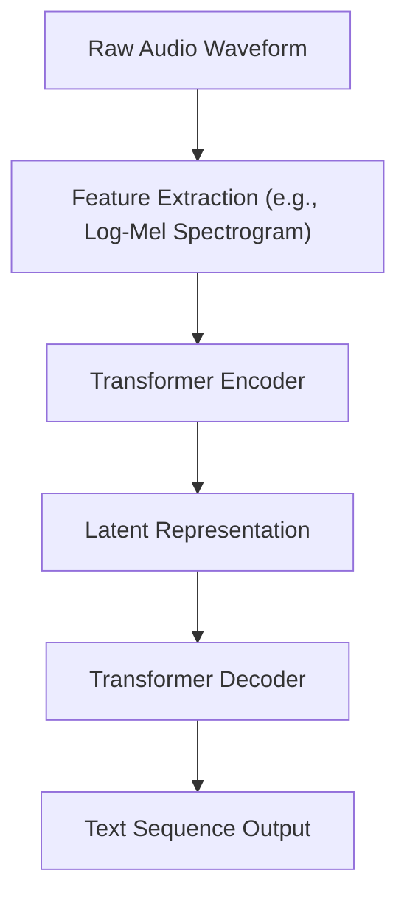
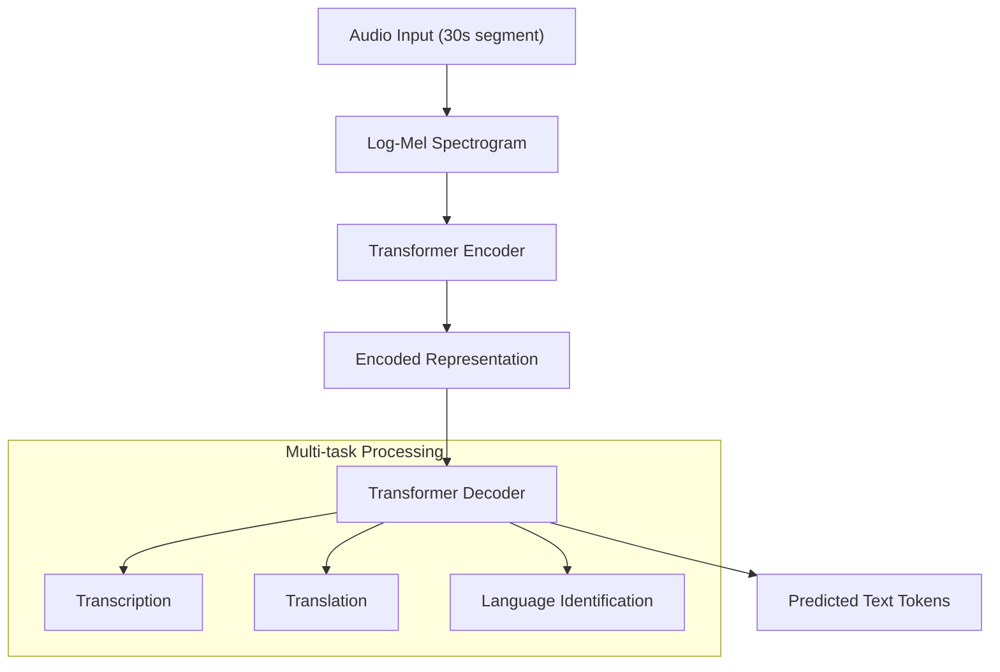
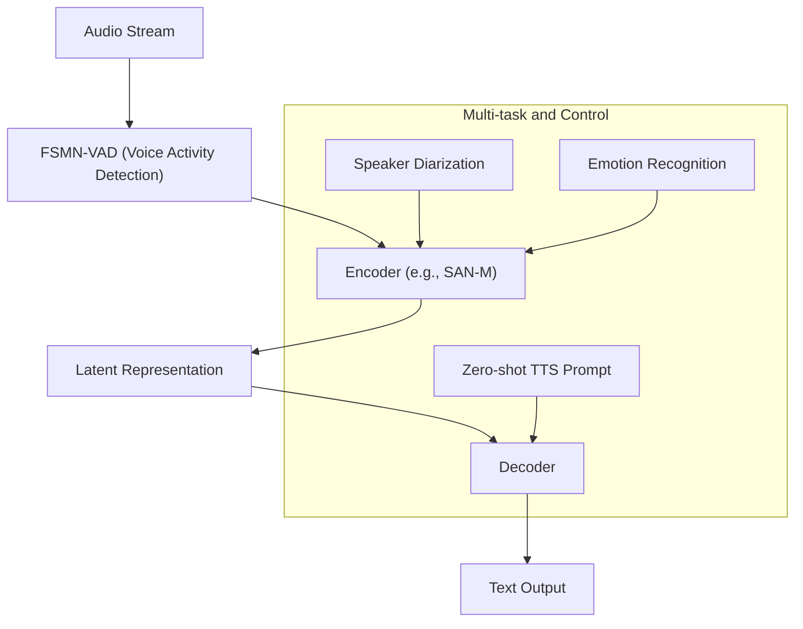

## 1. Background

### 1.1 Pain Points of Traditional ASR Models

Traditional Automatic Speech Recognition (ASR) models, such as those based on Hidden Markov Models-Gaussian Mixture Models (HMM-GMM) or Deep Neural Networks (DNN), perform well in specific domains and controlled environments but face numerous challenges:

1.  **Data Sparsity**: Heavy dependence on large-scale, high-quality labeled datasets, resulting in poor generalization to low-resource languages or specific accents.
2.  **Insufficient Robustness**: Performance drops dramatically in noisy environments, far-field audio capture, multi-person conversations, and other real-world scenarios.
3.  **Lack of Contextual Understanding**: Models are typically limited to direct mapping from acoustic features to text, lacking understanding of long-range context, semantics, and speaker intent, leading to recognition errors (such as homophone confusion).
4.  **Limited Multi-task Capabilities**: Traditional models are usually single-task oriented, supporting only speech transcription without simultaneously handling speaker diarization, language identification, translation, and other tasks.

### 1.2 Large Language Model (LLM) Driven ASR New Paradigm

In recent years, end-to-end large ASR models represented by `Whisper` have demonstrated unprecedented robustness and generalization capabilities through pretraining on massive, diverse unsupervised or weakly supervised data. These models typically adopt an Encoder-Decoder architecture, treating ASR as a sequence-to-sequence translation problem.

**Typical Process**:

This approach not only simplifies the complex pipeline of traditional ASR but also learns rich acoustic and linguistic knowledge through large-scale data, enabling excellent performance even in zero-shot scenarios.

## 2. Analysis of ASR Model Solutions

### 2.1 Whisper-large-v3-turbo

`Whisper` is a pretrained ASR model developed by OpenAI, with its `large-v3` and `large-v3-turbo` versions being among the industry-leading models.

#### 2.1.1 Whisper Design

**Structural Modules**:

**Features**:
-   **Large-scale Weakly Supervised Training**: Trained on 680,000 hours of multilingual, multi-task data, covering a wide range of accents, background noise, and technical terminology.
-   **End-to-end Architecture**: A unified Transformer model directly maps audio to text, without requiring external language models or alignment modules.
-   **Multi-task Capability**: The model can simultaneously handle multilingual speech transcription, speech translation, and language identification.
-   **Robustness**: Through carefully designed data augmentation and mixing, the model performs excellently under various challenging conditions.
-   **Turbo Version**: `large-v3-turbo` is an optimized version of `large-v3`, potentially offering improvements in inference speed, computational efficiency, or specific task performance, with approximately 798M parameters.

#### 2.1.2 Problems Solved

| Target Problem | Whisper's Solution |
| --- | --- |
| Poor Generalization | Large-scale pretraining on massive, diverse datasets covering nearly a hundred languages. |
| Insufficient Robustness | Training data includes various background noise, accents, and speaking styles, enhancing performance in real-world scenarios. |
| Weak Contextual Modeling | Transformer architecture captures long-range dependencies in audio signals. |
| Complex Deployment | Provides multiple model sizes (from `tiny` to `large`), with open-sourced code and model weights, facilitating community use and deployment. |

#### 2.1.3 Production Defect Analysis

##### 2.1.3.1 Hallucination Issues
-   In segments with no speech or noise, the model sometimes generates meaningless or repetitive text, a common issue with large autoregressive models.
-   This phenomenon is particularly noticeable in long audio processing and may require additional post-processing logic for detection and filtering.

##### 2.1.3.2 Limited Timestamp Precision
-   The model predicts word-level timestamps, but their precision may not meet the stringent requirements of certain applications (such as subtitle alignment, speech editing).
-   Timestamp accuracy decreases during long periods of silence or rapid speech flow.

##### 2.1.3.3 High Computational Resource Requirements
-   The `large-v3` model contains 1.55 billion parameters, and the `turbo` version has nearly 800 million parameters, demanding significant computational resources (especially GPU memory), making it unsuitable for direct execution on edge devices.
-   Although optimization techniques like quantization exist, balancing performance while reducing resource consumption remains a challenge.

##### 2.1.3.4 Real-time Processing Bottlenecks
-   The model processes 30-second audio windows, requiring complex sliding window and caching mechanisms for real-time streaming ASR scenarios, which introduces additional latency.

### 2.2 SenseVoice

`SenseVoice` is a next-generation industrial-grade ASR model developed by Alibaba DAMO Academy's speech team. Unlike `Whisper`, which focuses on robust general transcription, `SenseVoice` emphasizes multi-functionality, real-time processing, and integration with downstream tasks.

#### 2.2.1 SenseVoice Design

**Structural Modules**:

**Features**:
-   **Unified End-to-end Model**: Integrates acoustic model, language model, and punctuation prediction, achieving end-to-end output from speech to punctuated text.
-   **Multi-task Learning**: The model not only performs speech recognition but also simultaneously outputs speaker diarization, emotional information, and can even generate acoustic prompts for zero-shot TTS.
-   **Streaming and Non-streaming Integration**: Supports both streaming and non-streaming modes through a unified architecture, meeting the needs of real-time and offline scenarios.
-   **TTS Integration**: One innovation of `SenseVoice` is that its output can serve as a prompt for TTS models like `CosyVoice`, enabling voice cloning and transfer, closing the loop between ASR and TTS.

#### 2.2.2 Problems Solved

| Target Problem | SenseVoice's Solution |
| --- | --- |
| Single-task Limitation, Integration Difficulties | Designed as a multi-task model, natively supporting speaker diarization, emotion recognition, etc., simplifying dialogue system construction. |
| Poor Real-time Performance | Adopts efficient streaming architecture (such as SAN-M), combined with VAD, achieving low-latency real-time recognition. |
| Lack of Coordination with Downstream Tasks | Output includes rich meta-information (such as speaker, emotion) and can generate TTS prompts, achieving deep integration between ASR and TTS. |
| Punctuation Restoration Dependent on Post-processing | Incorporates punctuation prediction as a built-in task, achieving joint modeling of text and punctuation. |

#### 2.2.3 Production Defect Analysis

##### 2.2.3.1 Model Complexity and Maintenance
-   As a complex model integrating multiple functions, its training and maintenance costs are relatively high.
-   Balancing multiple tasks may require fine-tuning to avoid performance degradation in any single task.

##### 2.2.3.2 Generalization of Zero-shot Capabilities
-   Although it supports zero-shot TTS prompt generation, its voice cloning effect and stability when facing unseen speakers or complex acoustic environments may not match specialized voice cloning models.

##### 2.2.3.3 Open-source Ecosystem and Community
-   Compared to `Whisper`'s strong open-source community and rich ecosystem tools, `SenseVoice`, as an industrial-grade model, may have limited open-source availability and community support, affecting its popularity in academic and developer communities.

## 3. Conclusion

-   **Whisper**: Through large-scale weakly supervised learning, it has pushed the robustness and generalization capabilities of ASR to new heights. It is a powerful **general-purpose speech recognizer**, particularly suitable for processing diverse, uncontrolled audio data. Its design philosophy is "trading scale for performance," excelling in zero-shot and multilingual scenarios.

-   **SenseVoice**: Represents the trend of ASR technology developing towards **multi-functionality and integration**. It is not just a recognizer but a **perceptual frontend for conversational intelligence**, aimed at providing richer, more real-time input for downstream tasks (such as dialogue systems, TTS). Its design philosophy is "fusion and collaboration," emphasizing ASR's pivotal role in the entire intelligent interaction chain.

In summary, `Whisper` defines the performance baseline for modern ASR, while `SenseVoice` explores broader possibilities for ASR in industrial applications. Future ASR technology may develop towards combining the strengths of both: having both the robustness and generalization capabilities of `Whisper` and the multi-task collaboration and real-time processing capabilities of `SenseVoice`.