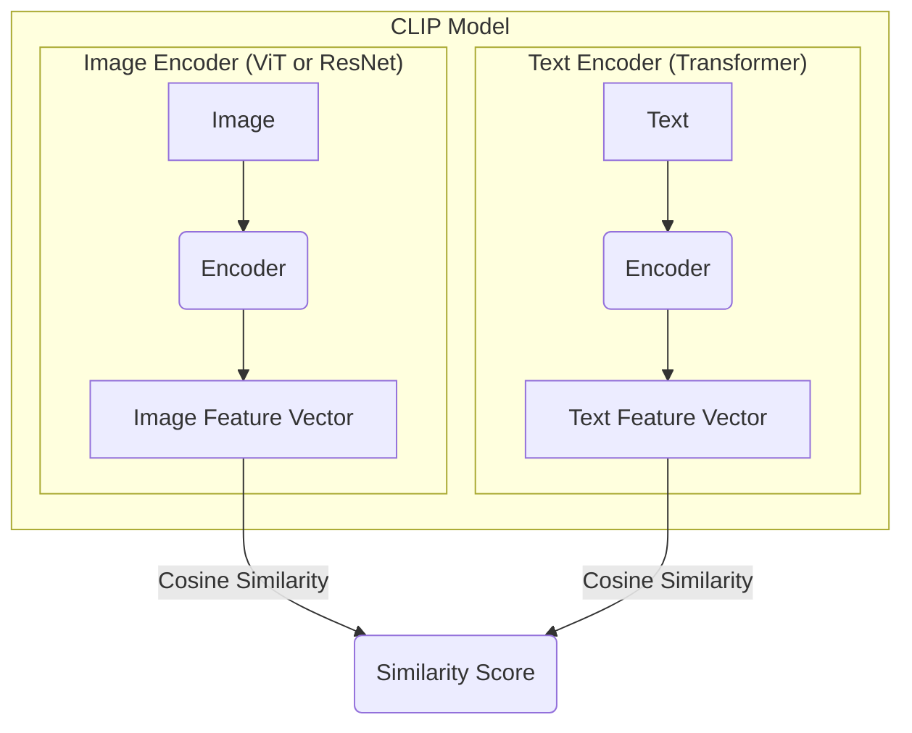
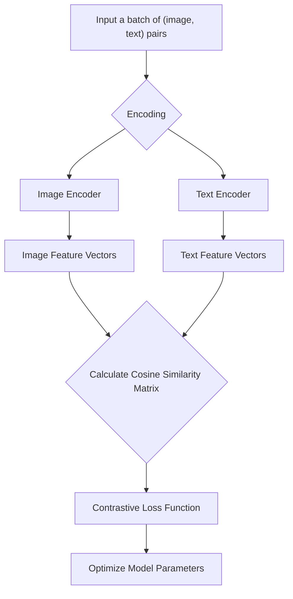

## 1. Introduction

CLIP (Contrastive Language-Image Pre-training) is an advanced deep learning model developed by OpenAI, designed to understand the relationship between images and the text that describes them. Through pre-training on millions of (image, text) pairs, CLIP learns a shared multimodal embedding space that maps both images and text to vectors within this space.

The revolutionary aspect of CLIP lies in its powerful **Zero-Shot Learning** capabilities. Traditional image classification models typically require training for specific tasks and labels, whereas CLIP can classify images into categories it has never explicitly seen during training, greatly enhancing the model's generalization ability and flexibility.

## 2. Core Concepts

To understand CLIP, we first need to grasp several core concepts:

### 2.1 Multimodal Learning

Multimodal learning refers to the ability of models to process and associate information from different modalities (such as text, images, audio). Humans understand the world by combining visual, auditory, and linguistic information, and multimodal learning aims to give AI similar capabilities. CLIP is an outstanding example of multimodal learning in the domains of images and text.

### 2.2 Contrastive Learning

Contrastive learning is a self-supervised learning method. Its core idea is to **bring similar samples closer together in the representation space while pushing dissimilar samples apart**.

Imagine a large collection of "image-text" pairs. For a given image (e.g., a picture of a cat), its corresponding text description ("a photo of a cat") is a positive sample, while all other text descriptions (e.g., "a photo of a dog", "a photo of a car") are negative samples. CLIP's goal is to learn an encoder that makes the representation of "a cat picture" and "a photo of a cat" very close in the vector space, while keeping representations of unrelated text descriptions far apart.

### 2.3 Zero-Shot Learning

Zero-shot learning refers to a model's ability to recognize and classify categories it has never seen during training. CLIP achieves this by transforming image classification into an image-text matching problem.

For example, to determine if an image is a "dog," we don't need a model specifically trained to recognize "dogs." We simply encode the image into a vector, encode the text "a photo of a dog" into another vector, and then calculate the similarity between these two vectors. If the similarity is high, we can consider the image to be a "dog." This approach allows CLIP to identify objects of any category, as long as we can describe it in text.

## 3. Model Architecture

The CLIP model consists of two main components: an image encoder and a text encoder.

*   **Image Encoder**: Responsible for converting input images into feature vectors. CLIP uses two mainstream architectures:
    *   **ResNet**: A classic convolutional neural network.
    *   **Vision Transformer (ViT)**: A model that applies the Transformer architecture to image recognition.
*   **Text Encoder**: Responsible for converting input text into feature vectors. CLIP uses the standard **Transformer** architecture.

These two encoders map images and text to the same multi-dimensional embedding space, allowing their vector representations to be directly compared.



## 4. Workflow

CLIP's workflow is divided into training and inference phases.

### 4.1 Training Phase

During the training phase, CLIP learns from a dataset containing hundreds of millions of (image, text) pairs. For a batch of data containing N (image, text) pairs, CLIP performs the following operations:

1.  **Encoding**: Pass N images through the image encoder to get N image feature vectors, and pass N texts through the text encoder to get N text feature vectors.
2.  **Calculate Similarity**: Compute the cosine similarity between each of the N image feature vectors and each of the N text feature vectors, resulting in an N x N similarity matrix.
3.  **Contrastive Learning**: In this matrix, the elements on the diagonal correspond to the correct (image, text) pairs, which we want to have high similarity. Elements off the diagonal represent mismatched pairs, which we want to have low similarity. The model is optimized through a contrastive loss function to achieve this goal.



### 4.2 Inference Phase (Zero-Shot Classification)

During the inference phase, CLIP can perform zero-shot image classification tasks:

1.  **Prepare Text Prompts**: For all categories you want to classify (e.g., "cat", "dog", "car"), create a series of text prompts such as "a photo of a cat", "a photo of a dog", "a photo of a car".
2.  **Encode Text**: Convert these text prompts into a series of text feature vectors using the text encoder.
3.  **Encode Image**: Convert the image to be classified into an image feature vector using the image encoder.
4.  **Calculate Similarity**: Compute the cosine similarity between the image feature vector and all text feature vectors.
5.  **Prediction**: The category corresponding to the text prompt with the highest similarity is CLIP's prediction result.

## 5. Applications

CLIP's powerful capabilities make it widely applicable in many fields:

*   **Zero-Shot Image Classification**: Classify images into arbitrary categories without additional training.
*   **Image Retrieval**: Search for matching images using natural language descriptions.
*   **Content Moderation**: Automatically identify and filter inappropriate image content.
*   **Guiding Generative Models**: CLIP's multimodal understanding ability can guide generative models (like DALL-E 2) to create images that match text descriptions.

## 6. Code Example

Here's a simple Python code example demonstrating how to use the `clip` library to load the model and obtain image feature vectors.

First, install the necessary libraries:

```bash
pip install torch clip
```

Then, you can use the following code:

```python
import torch
import clip
from PIL import Image

# Load the model, can run on either CPU or GPU
device = "cuda" if torch.cuda.is_available() else "cpu"
model, preprocess = clip.load("ViT-B/32", device=device)

# Load and preprocess the image
image_path = "cat.jpg"  # Replace with your image path
image = preprocess(Image.open(image_path)).unsqueeze(0).to(device)

# Prepare text descriptions
text_descriptions = ["a photo of a cat", "a photo of a dog"]
text_tokens = clip.tokenize(text_descriptions).to(device)

with torch.no_grad():
    # Encode images and text
    image_features = model.encode_image(image)
    text_features = model.encode_text(text_tokens)
    
    # Calculate similarity
    logits_per_image, logits_per_text = model(image, text_tokens)
    probs = logits_per_image.softmax(dim=-1).cpu().numpy()

print("Label probs:", probs)  # Output the matching probability between the image and each text description

```

## 7. Conclusion

Through its innovative contrastive learning method, CLIP successfully connects text and images in a shared representation space, demonstrating powerful zero-shot learning capabilities. It has not only achieved excellent results in multiple benchmark tests but has also opened new paths for the development of multimodal artificial intelligence.

**Advantages**:
*   Strong generalization ability and zero-shot performance.
*   No need for fine-tuning for specific tasks, saving significant annotation costs.
*   Can understand complex and abstract text descriptions.

**Limitations**:
*   May perform poorly on very fine-grained classification tasks (such as identifying specific bird species).
*   Limited understanding of abstract or systematic concepts (such as counting).
*   The model's performance is highly dependent on the quality and scale of pre-training data.

Despite some limitations, CLIP remains one of the most important breakthroughs in artificial intelligence in recent years and continues to push the boundaries of multimodal research.