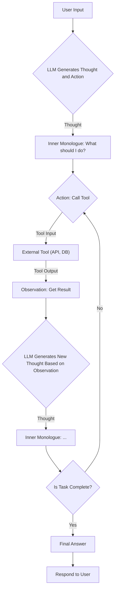
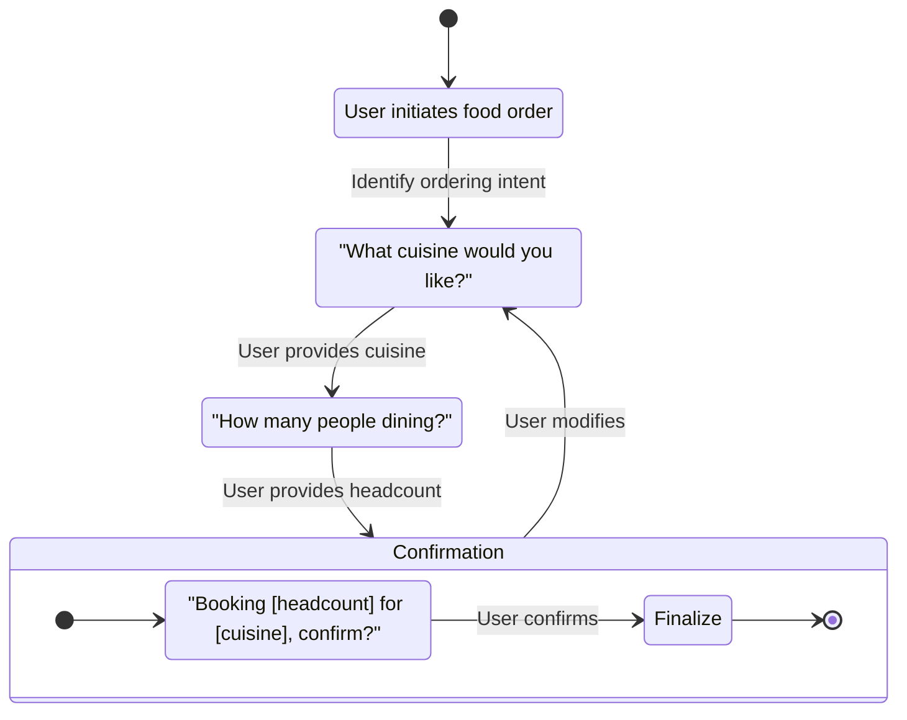
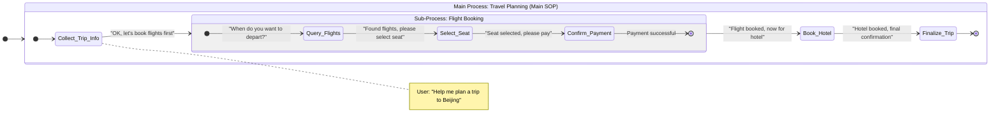
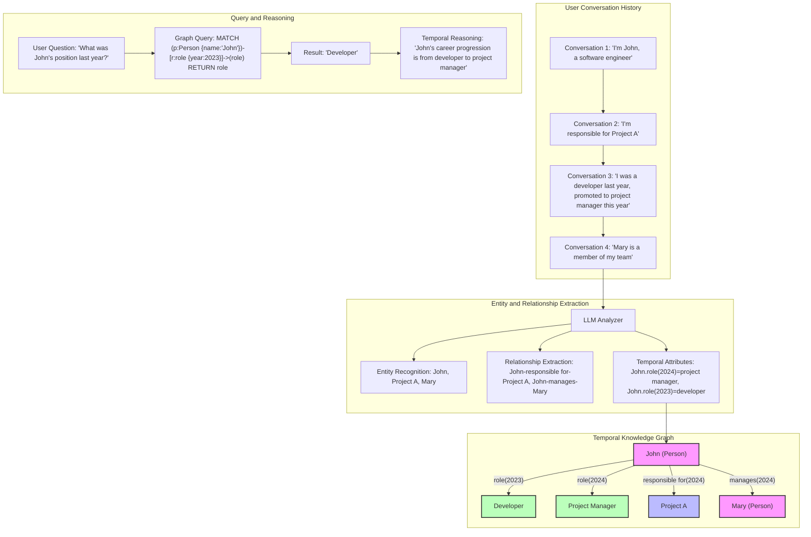

## 1. Introduction: Why Multi-Turn Dialogue is the Core Lifeline of Agents

In the wave of human-machine interaction, Large Language Model (LLM) driven Agents are evolving from simple "question-answer" tools into "intelligent assistants" capable of executing complex tasks with reasoning and planning abilities. The core of this evolution lies in **Multi-turn Dialogue** capabilities.

Single-turn dialogue resembles a one-time query, while multi-turn dialogue is a continuous, memory-driven, goal-oriented exchange. Users may not provide all information at once, requiring Agents to understand evolving needs, clarify ambiguous instructions, call external tools, and ultimately achieve the user's goals through continuous interaction.

This document will thoroughly analyze the core challenges faced by LLM Agents in implementing efficient and reliable multi-turn dialogues, and provide a detailed explanation of current mainstream technical architectures and implementation details.

## 2. Core Challenges: "Thorny Issues" in Multi-Turn Dialogues

To build a powerful multi-turn dialogue Agent, we must address several fundamental challenges:

### 2.1 Context Window Limitation
This is the most fundamental physical constraint. LLMs can only process a limited length of text (tokens). As conversation turns increase, the complete dialogue history quickly exceeds the model's context window.

- **Macro Issue**: Leads to "memory loss," where the Agent cannot recall early critical information, causing dialogue coherence to break.
- **Underlying Details**: Directly truncating early dialogue history is the simplest but crudest method, potentially losing important premises. For example, preferences set by the user at the beginning of a conversation ("I prefer window seats") might be forgotten during subsequent booking steps.

### 2.2 State Maintenance Complexity
Agents need to precisely track the dialogue state, such as: What stage is the current task at? What information has the user provided? What information is still needed?

- **Macro Issue**: If the state is confused, the Agent appears "muddled," repeatedly asking for known information or getting "lost" in the task flow.
- **Underlying Details**: State is more than just dialogue history. It's a structured data collection that may include user intent, extracted entities (like dates, locations), API call results, current task nodes, etc. Designing a robust, scalable state management mechanism is a significant engineering challenge.

### 2.3 Intent Drifting & Goal Forgetting
In long conversations, user intent may change, or a large goal may be broken down into multiple subtasks.

- **Macro Issue**: Agents need to understand and adapt to these dynamic changes rather than rigidly adhering to the initial goal. If a user checks the weather and then says, "Book me a flight there," the Agent must recognize this as a new, related intent.
- **Underlying Details**: This requires the Agent to have strong intent recognition and reasoning capabilities to determine whether the current user input is continuing, modifying, or starting a completely new task.

### 2.4 Error Handling & Self-Correction
When tool calls fail (e.g., API timeout), information extraction errors occur, or understanding deviates, the Agent cannot simply crash or give up.

- **Macro Issue**: A reliable Agent should be able to identify failures and proactively initiate correction processes, such as retrying, clarifying with the user, or finding alternatives.
- **Underlying Details**: This requires designing fault tolerance and retry mechanisms at the architectural level. The Agent needs to "understand" error messages returned by tools and generate new "thoughts" based on these to plan the next corrective action.

## 3. Technical Architecture Evolution and Analysis

To address the above challenges, the industry has explored various solutions, from simple history compression to complex Agentic architectures.

### 3.1 Early Attempts: Dialogue History Compression
This is the most direct approach to solving context window limitations.

- **Summary Memory**: After each round of dialogue, or when the history length approaches a threshold, another LLM call summarizes the existing conversation.
  - **Advantage**: Effectively reduces length.
  - **Disadvantage**: The summarization process may lose details and adds additional LLM call costs and latency.

### 3.2 ReAct Architecture: Giving Agents the Ability to "Think"

ReAct (Reason + Act) is the cornerstone of today's mainstream Agent architectures. Through an elegant "think-act-observe" cycle, it transforms an LLM from a mere text generator into an entity with reasoning and execution capabilities.

- **Macro Concept**: Mimics the human problem-solving pattern—first analyze (Reason), then take action (Act), and finally observe results (Observation) and adjust approach.

- **Underlying Implementation**: Through carefully designed prompts, guides the LLM to generate text with specific markers.
    - **Thought**: The LLM performs an "inner monologue" at this step, analyzing the current situation and planning the next action. This content is invisible to users.
    - **Action**: The LLM decides which tool to call and what parameters to pass. For example, `search("Beijing weather today")`.
    - **Observation**: Feeds back the results of tool execution (such as API returned data, database query results) to the LLM.

This cycle repeats until the Agent considers the task complete.

#### ReAct Work Cycle



### 3.3 Finite State Machine (FSM): Building "Tracks" for Dialogue Flow

For tasks with clear goals and relatively fixed processes (such as food ordering, customer service), Finite State Machines (FSM) are an extremely powerful and reliable architecture.

- **Macro Concept**: Abstract complex dialogue processes into a series of discrete "states" and "transition conditions" between these states. The Agent is in a clear state at any moment and can only transition to the next state through predefined paths.

- **Underlying Implementation**:
    - **States**: Define possible nodes in the dialogue, such as `AskLocation`, `AskCuisine`, `ConfirmOrder`, `OrderPlaced`.
    - **Transitions**: Define rules for state switching, typically triggered by user input or tool output. For example, in the `AskLocation` state, if location information is successfully extracted from user input, transition to the `AskCuisine` state.
    - **State Handler**: Each state is associated with a handler function responsible for executing specific logic in that state (such as asking the user questions, calling APIs).

#### A Simple Food Ordering Agent



#### Modern Evolution of FSM: Dynamic and Hierarchical

Traditional FSMs rely on hardcoded rules for state transitions, which can be rigid when facing complex, changing real-world scenarios. Modern Agent design deeply integrates FSM with LLM capabilities, giving rise to more intelligent and flexible architectures.

-   **LLM-Driven State Transitions**: Rather than using fixed `if-else` rules to determine state changes, let the LLM make decisions. In each cycle, pass the dialogue history, current user input, and a list of all possible target states to the LLM, allowing it to determine the most appropriate next state based on its powerful context understanding. This upgrades state transitions from "rule-driven" to "intelligence-driven."

-   **State-Specific Prompts**: This is a powerful application of dynamic prompting. For each core state node in the FSM, a highly optimized set of dedicated prompts can be pre-designed. When the Agent enters a certain state (such as `Collect_Cuisine`), the system immediately activates the prompt corresponding to that state. This prompt not only guides the LLM on how to interact with users at that node but can also define tools that can be called in that state, rules to follow, etc. This allows the Agent to "wear different hats" at different task stages, exhibiting high professionalism and task relevance.

##### Example: State-Specific Prompt for `Query_Flights` State in Flight Booking Sub-Process
```
# IDENTITY
You are a world-class flight booking assistant AI.

# STATE & GOAL
You are currently in the "Query_Flights" state.
Your SOLE GOAL is to collect the necessary information to search for flights.
The necessary information is: origin city, destination city, and departure date.

# AVAILABLE TOOLS
- `flight_search_api(origin: str, destination: str, date: str)`: Use this tool to search for flights.

# CONTEXT
- Conversation History:
  {conversation_history}
- User Profile:
  {user_profile}
- Current State Data:
  {state_data}  # e.g., {"origin": "Shanghai", "destination": "Beijing", "date": null}

# RULES
1.  Analyze the Current State Data first.
2.  If any necessary information (origin, destination, date) is missing, you MUST ask the user for it clearly.
3.  Phrase your questions to sound helpful and natural.
4.  Once all information is collected, your FINAL ACTION MUST be to call the `flight_search_api` tool with the correct parameters.
5.  Do not make up information. Do not ask for information that is not required (e.g., return date, unless specified by the user).

# OUTPUT FORMAT
Your output must be a single JSON object.
- To ask a question: {"action": "ask_user", "question": "Your question here."}
- To call a tool: {"action": "call_tool", "tool_name": "flight_search_api", "tool_params": {"origin": "...", "destination": "...", "date": "..."}}
```

-   **Hierarchical FSM**: For large complex tasks, a single flat state diagram is difficult to manage. Hierarchical FSMs introduce the concept of "SOP nesting" or "sub-state diagrams." A high-level FSM (main SOP) is responsible for planning the macro business process (such as "complete a travel booking"), and when the process reaches a certain macro state (such as "book flight"), it can activate an embedded, more detailed sub-FSM (sub-SOP) that specifically handles a series of refined operations like "query flights -> select seats -> confirm payment." This pattern greatly enhances the modularity and manageability of task decomposition.

##### Hierarchical State Machine (SOP Nesting) Example


**FSM vs. ReAct**: FSM is structured, predictable, and easy to debug, making it very suitable for task-oriented dialogues. ReAct is more flexible and versatile, suitable for handling open-ended tasks requiring complex reasoning and dynamic planning. In practice, the two are often combined (for example, using ReAct to handle an open-ended subtask within an FSM state, or as mentioned above, using an LLM to drive FSM state transitions).

## 4. Core Components: Agent's "Memory" System

Regardless of the architecture used, a powerful memory system is the cornerstone of effective multi-turn dialogue.

### 4.1 Short-term Memory
Also known as working memory, primarily responsible for storing recent dialogue history.

- **Typical Implementation**: `ConversationBufferMemory` or `ConversationBufferWindowMemory`.
- **Underlying Details**:
    - `ConversationBufferMemory`: Stores complete dialogue history. Simple and direct, but quickly exhausts the context window in long conversations.
    - `ConversationBufferWindowMemory`: Only keeps the most recent `k` turns of dialogue. This sliding window mechanism effectively controls length but risks losing important early information.

### 4.2 Long-term Memory
Responsible for storing cross-dialogue, persistent knowledge and information.

- **Typical Implementation**: Retrieval-Augmented Generation (RAG) based on **vector databases**.
- **Underlying Details**:
    1.  Chunk external documents (such as product manuals, knowledge base articles) or key information from past conversations.
    2.  Use an Embedding model to convert text blocks into vectors.
    3.  Store vectors in a vector database (such as Chroma, Pinecone, FAISS).
    4.  When a user asks a question, convert their question into a vector as well.
    5.  Perform similarity search in the vector database to find the most relevant text blocks.
    6.  Inject these text blocks as context along with the user's question into the LLM's prompt, guiding it to generate more precise answers.

### 4.3 Structured Memory
Stores and retrieves information in a structured way, especially key entities and their relationships from conversations.

- **Typical Implementation**: Entity-relationship storage based on knowledge graphs, such as the `Graphiti` project using Neo4j.
- **Underlying Details**: 
  - **Knowledge Graph Advantages**: Unlike simple key-value storage, knowledge graphs can capture complex relationship networks between entities. For example, not just recording a person named "John," but also recording "John is Mary's manager," "John is responsible for Project A," and other relationship information.
  - **Graphiti Project Analysis**: [Graphiti](https://github.com/getzep/graphiti) is a knowledge graph memory system designed specifically for LLM Agents, seamlessly integrating Neo4j's graph database capabilities with LLM's natural language processing abilities.
    - **Core Workflow**:
      1. **Entity and Relationship Extraction**: LLM analyzes conversation content, identifying key entities and their relationships
      2. **Graph Construction**: Transforms identified entities and relationships into Cypher query statements, dynamically updating the Neo4j graph database
      3. **Context Enhancement**: In subsequent conversations, retrieves relevant entity networks through graph queries, injecting them as context into the LLM's prompt
    - **Technical Highlights**:
      - **Automatic Schema Inference**: No need to predefine entity types and relationships; the system can automatically infer appropriate graph structures from conversations
      - **Incremental Updates**: As conversations progress, the graph is continuously enriched and corrected, forming an increasingly complete knowledge network
      - **Relationship Reasoning**: Supports multi-hop queries, able to discover indirectly associated information (e.g., "Who are the colleagues of John's manager?")
      - **Temporal Awareness**: Graphiti/Zep's core feature is its Temporal Knowledge Graph architecture, where each node and relationship carries timestamp attributes, enabling the system to:
        - Track how entity states change over time (e.g., "John was a developer last year, promoted to project manager this year")
        - Perform temporal reasoning (e.g., "What was B's status before event A occurred?")
        - Resolve time-related queries (e.g., "How is the project mentioned last month progressing now?")
        - Automatically identify and handle outdated information, ensuring answers are based on the latest factual state
        - Build event timelines, helping the Agent understand causal relationships and event sequences
  - **Practical Application Example**:
    ```python
    from graphiti import GraphMemory
    
    # Initialize graph memory
    graph_memory = GraphMemory(
        neo4j_uri="neo4j://localhost:7687",
        neo4j_user="neo4j",
        neo4j_password="password"
    )
    
    # Update graph in conversation
    user_message = "My project manager John said we're starting a new project next week"
    graph_memory.update_from_text(user_message)
    
    # Retrieve relevant information in subsequent conversations
    query = "Who is the project manager?"
    context = graph_memory.retrieve_relevant_context(query)
    # Returns: "John is the project manager, responsible for a new project starting next week."
    ```

  - **Comparison with Traditional Entity Memory**: Traditional methods can only store flat entity-attribute pairs, while knowledge graph methods can express and query complex multi-level relationship networks, providing Agents with richer, more insightful contextual information.
  
  - **Essentially a Form of Long-term Memory**: Although we discuss structured memory as a separate category, knowledge graph systems like Graphiti/Zep are essentially an advanced form of long-term memory. They not only persistently store information across conversations but also organize this information in a more structured, queryable, and reasoning-friendly way. Compared to semantic similarity retrieval in vector databases, knowledge graphs provide more precise relationship navigation and reasoning capabilities.

#### Graphiti/Zep Temporal Knowledge Graph Architecture and Workflow



This diagram shows how Graphiti/Zep transforms conversation history into a knowledge graph with a temporal dimension, supporting time-based queries and reasoning. Timestamps enable the system to track the evolution of entity attributes and relationships, answering "when" and "how changed" types of questions, capabilities that traditional knowledge graphs and vector stores struggle to achieve.

### 4.4 Summary Memory
As mentioned earlier, saves space by creating rolling summaries of dialogue history.

- **Typical Implementation**: `ConversationSummaryMemory` or `ConversationSummaryBufferMemory`.
- **Underlying Details**:
    - `ConversationSummaryMemory`: Summarizes the entire dialogue history each time, which is costly.
    - `ConversationSummaryBufferMemory`: A hybrid strategy. It keeps the most recent `k` turns of complete dialogue while maintaining a rolling summary of earlier conversations. This achieves a good balance between cost and information fidelity.

### 4.5 User Profile Memory

This is a more proactive, advanced form of structured memory, aimed at going beyond single conversations to establish a persistent, dynamically updated "profile" for users. The Agent not only remembers conversation content but also "who you are."

- **Macro Concept**: Structurally store user preferences, habits, historical choices, and even demographic information (with user authorization). In each interaction, inject this "user profile" as key context directly into the prompt, allowing the LLM to "understand" its conversation partner from the start.

- **Underlying Implementation**:
    1.  **Data Structure**: Typically maintains user metadata in the form of key-value pairs (such as JSON objects). For example: `{"user_id": "123", "preferred_language": "English", "dietary_restrictions": ["vegetarian"], "home_city": "Shanghai"}`.
    2.  **Prompt Injection**: When building the final prompt, include the serialized user profile string (such as `[UserProfile]...[/UserProfile]`) as a fixed part of the context.
    3.  **Dynamic Maintenance**: This is the core of the mechanism. After a conversation ends, the Agent or a background process analyzes the interaction to determine if the user profile needs updating. For example, when a user says "I recently moved to Beijing," the system needs a mechanism to update the `home_city` field. This update process itself may require a separate LLM call for information extraction and decision-making.

- **Advantages**:
    - **High Personalization**: The Agent can provide forward-looking, highly customized services.
    - **Conversation Efficiency**: Avoids repeatedly asking users for basic preferences, making interactions smoother.
- **Challenges**:
    - **Update Mechanism Complexity**: How to accurately and safely update user profiles is a technical challenge.
    - **Token Consumption**: User profiles occupy valuable context window space.
    - **Data Privacy**: Must strictly adhere to user privacy policies.

## 5. Summary and Outlook

Building an LLM Agent capable of smooth, intelligent multi-turn dialogue is a complex system engineering task. It requires us to:

1.  **Face Physical Limitations**: Overcome context window bottlenecks through clever **memory management mechanisms** (such as summaries, RAG).
2.  **Choose Appropriate Architecture**: Balance **flexibility (ReAct)** and **structure (FSM)** based on task complexity, or even combine both.
3.  **Design Robust Processes**: Build in **state tracking**, **intent recognition**, and **error correction** capabilities to keep the Agent stable and reliable in complex interactions.

Future development will focus more on the Agent's autonomous learning and evolution capabilities. Agents will not only execute tasks but also learn new skills from interactions with users, optimize their tool calling strategies, and dynamically adjust their conversation style, ultimately becoming truly personalized intelligent partners.