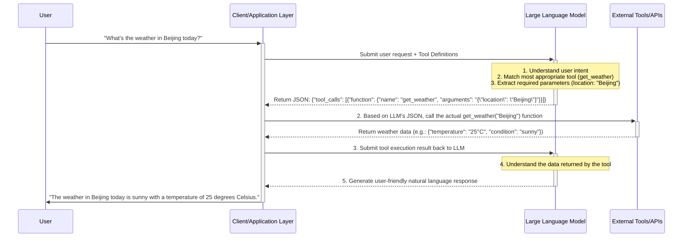

## 1. Macro Overview: Why Tool Calling is LLM's "Super Plugin"

The emergence of Large Language Models (LLMs) has fundamentally changed how we interact with machines. However, LLMs have an inherent, unavoidable "ceiling": they are essentially "probability prediction machines" trained on massive text data, with their knowledge frozen at the time their training data ends. This means an LLM cannot know "what's the weather like today?", cannot access your company's internal database, and cannot book a flight ticket for you.

The **LLM Tool Calling / Function Calling** mechanism emerged precisely to break through this ceiling. It gives LLMs an unprecedented ability: **calling external tools (APIs, functions, databases, etc.) to obtain real-time information, perform specific tasks, or interact with the external world** when needed.

In simple terms, the tool calling mechanism upgrades LLMs from "knowledgeable conversationalists" to capable "intelligent agents." It allows LLMs to:

*   **Obtain real-time information**: By calling weather APIs, news APIs, search engines, etc., to get the latest information beyond the model's training data.
*   **Operate external systems**: Connect to enterprise CRM/ERP systems to query data, or connect to IoT devices to control smart home appliances.
*   **Execute complex tasks**: Break down complex user instructions (like "help me find and book a cheap flight to Shanghai next week") and complete them by calling multiple APIs in combination.
*   **Provide more precise, verifiable answers**: For queries requiring exact calculations or structured data, LLMs can call calculators or databases instead of relying on their potentially inaccurate internal knowledge.

Therefore, tool calling is not just a simple extension of LLM functionality, but a core foundation for building truly powerful AI applications that deeply integrate with both the physical and digital worlds.

## 2. Core Concepts and Workflow: How Do LLMs "Learn" to Use Tools?

To understand the underlying logic of tool calling, we need to view it as an elegant process involving three core roles working together:

1.  **Large Language Model (LLM)**: The brain and decision-maker.
2.  **Tool Definitions**: A detailed "tool instruction manual."
3.  **Developer/Client-side Code**: The ultimate "executor."

The LLM itself **never actually executes any code**. Its only task, after understanding the user's intent and the "tool manual" it has, is to **generate a JSON data structure that precisely describes which tool should be called and with what parameters**.

Below is a visual explanation of this process:



### Process Breakdown:

1.  **Define & Describe**:
    *   Developers first need to define available tools in a structured way (typically using JSON Schema). This "manual" is crucial to the entire process and must clearly tell the LLM:
        *   **Tool name** (`name`): For example, `get_weather`.
        *   **Tool function description** (`description`): For example, "Get real-time weather information for a specified city." This is the most important basis for the LLM to understand the tool's purpose.
        *   **Tool parameters** (`parameters`): Detailed definition of what inputs the tool needs, including each input's name, type (string, number, boolean, etc.), whether it's required, and parameter descriptions.

2.  **Intent Recognition & Parameter Extraction**:
    *   When a user makes a request (e.g., "Check the weather in Beijing"), the developer's application sends the user's original request **along with all the tool definitions from step 1** to the LLM.
    *   The LLM's core task is to do two things:
        *   **Intent Recognition**: Among all available tools, determine which tool's function description best matches the user's request. In this example, it would match `get_weather`.
        *   **Parameter Extraction**: From the user's request, identify and extract values that satisfy the tool's parameter requirements. Here, it would recognize that the `location` parameter value is "Beijing".
    *   After completing these two steps, the LLM generates one or more `tool_calls` objects, essentially saying "I suggest you call the function named `get_weather` and pass in the parameter `{ "location": "Beijing" }`".

3.  **Execute & Observe**:
    *   The developer's application code receives the JSON returned by the LLM and parses this "call suggestion."
    *   The application code **actually executes** the `get_weather("Beijing")` function locally or on the server side.
    *   After execution, it gets a real return result, such as a JSON object containing weather information.

4.  **Summarize & Respond**:
    *   To complete the loop, the application layer needs to submit the actual execution result from the previous step back to the LLM.
    *   This time, the LLM's task is to understand this raw data returned by the tool (e.g., `{"temperature": "25°C", "condition": "sunny"}`) and convert it into a fluent, natural, user-friendly response.
    *   Finally, the user receives the reply "The weather in Beijing today is sunny with a temperature of 25 degrees Celsius," and the entire process is complete.

This process elegantly combines the LLM's powerful natural language understanding ability with the external tool's powerful functional execution capability, achieving a 1+1>2 effect.

## 3. Technical Deep Dive: Analyzing the Industry Standard (OpenAI Tool Calling)

OpenAI's API is currently the de facto standard in the field of LLM tool calling, and its design is widely emulated. Understanding its implementation details is crucial for any developer looking to integrate LLM tool calling into their applications.

### 3.1. Core API Parameters

When calling OpenAI's Chat Completions API, there are two main parameters related to tool calling: `tools` and `tool_choice`.

#### `tools` Parameter: Your "Toolbox"

The `tools` parameter is an array where you can define one or more tools. Each tool follows a fixed structure, with the core being a `function` object defined based on the **JSON Schema** specification.

**Example: Defining a weather tool and a flight booking tool**

```json
[
    {
        "type": "function",
        "function": {
            "name": "get_current_weather",
            "description": "Get real-time weather information for a specified location",
            "parameters": {
                "type": "object",
                "properties": {
                    "location": {
                        "type": "string",
                        "description": "City and state/province name, e.g., 'San Francisco, CA'"
                    },
                    "unit": {
                        "type": "string",
                        "enum": ["celsius", "fahrenheit"],
                        "description": "Temperature unit"
                    }
                },
                "required": ["location"]
            }
        }
    },
    {
        "type": "function",
        "function": {
            "name": "book_flight",
            "description": "Book a flight ticket for the user from departure to destination",
            "parameters": {
                "type": "object",
                "properties": {
                    "departure": {
                        "type": "string",
                        "description": "Departure airport or city"
                    },
                    "destination": {
                        "type": "string",
                        "description": "Destination airport or city"
                    },
                    "date": {
                        "type": "string",
                        "description": "Desired departure date in YYYY-MM-DD format"
                    }
                },
                "required": ["departure", "destination", "date"]
            }
        }
    }
]
```

**Key Points Analysis**:

*   **`type`**: Currently fixed as `"function"`.
*   **`function.name`**: Function name. Must be a combination of letters, numbers, and underscores, not exceeding 64 characters. This is the key for your code to identify which function to call.
*   **`function.description`**: **Critically important**. This is the main basis for the LLM to decide whether to select this tool. The description should clearly, accurately, and unambiguously explain what the function does. A good description can greatly improve the LLM's call accuracy.
*   **`function.parameters`**: A standard JSON Schema object.
    *   **`type`**: Must be `"object"`.
    *   **`properties`**: Defines each parameter's name, type (`string`, `number`, `boolean`, `array`, `object`), and description. The parameter description is equally important as it helps the LLM understand what information to extract from user input to fill this parameter.
    *   **`required`**: An array of strings listing which parameters are mandatory. If the user request lacks necessary information, the LLM might ask follow-up questions or choose not to call the tool.

#### `tool_choice` Parameter: Controlling the LLM's Choice

By default, the LLM decides on its own whether to respond with text or call one or more tools based on the user's input. The `tool_choice` parameter allows you to control this behavior more precisely.

*   **`"none"`**: Forces the LLM not to call any tools and directly return a text response.
*   **`"auto"`** (default): The LLM can freely choose whether to respond with text or call tools.
*   **`{"type": "function", "function": {"name": "my_function"}}`**: Forces the LLM to call this specific tool named `my_function`.

This parameter is very useful in scenarios where you need to enforce a specific process or limit the LLM's capabilities.

### 3.2. Request-Response Lifecycle

A complete tool calling interaction involves at least two API requests.

**First Request: From User to LLM**

```python
# request
response = client.chat.completions.create(
    model="gpt-4o",
    messages=[{"role": "user", "content": "Please book me a flight from New York to London tomorrow"}],
    tools=my_tools,  # The tool list defined above
    tool_choice="auto"
)
```

**First Response: LLM's "Call Suggestion"**

If the LLM decides to call a tool, the API response's `finish_reason` will be `tool_calls`, and the `message` object will contain a `tool_calls` array.

```json
{
  "choices": [
    {
      "finish_reason": "tool_calls",
      "message": {
        "role": "assistant",
        "content": null,
        "tool_calls": [
          {
            "id": "call_abc123",
            "type": "function",
            "function": {
              "name": "book_flight",
              "arguments": "{\"departure\":\"New York\",\"destination\":\"London\",\"date\":\"2025-07-01\"}"
            }
          }
        ]
      }
    }
  ],
  ...
}

```
**Key Points Analysis**:

*   **`finish_reason`**: A value of `"tool_calls"` indicates that the LLM wants you to execute a tool call, rather than ending the conversation.
*   **`message.role`**: `assistant`.
*   **`message.tool_calls`**: This is an array, meaning the LLM can request multiple tool calls at once.
    *   **`id`**: A unique call ID. In subsequent requests, you'll need to use this ID to associate the tool's execution results.
    *   **`function.name`**: The function name the LLM suggests calling.
    *   **`function.arguments`**: **A JSON object in string form**. You need to parse this string to get the specific parameters needed to call the function.

**Second Request: Returning Tool Results to the LLM**

After executing the tool in your code, you need to send the results back to the LLM to complete the conversation. At this point, you need to construct a new `messages` list that includes:

1.  The original user message.
2.  The `assistant` message returned by the LLM in the previous step (containing `tool_calls`).
3.  A new message with the `tool` role, containing the tool's execution results.

```python
# message history
messages = [
    {"role": "user", "content": "Please book me a flight from New York to London tomorrow"},
    response.choices[0].message, # Assistant's 'tool_calls' message
    {
      "tool_call_id": "call_abc123", # Must match the ID from the previous step
      "role": "tool",
      "name": "book_flight",
      "content": "{\"status\": \"success\", \"ticket_id\": \"TICKET-45678\"}" # Actual return value from the tool
    }
]

# second request
second_response = client.chat.completions.create(
    model="gpt-4o",
    messages=messages
)
```

**Second Response: LLM's Final Reply**

This time, the LLM will generate a natural language response for the user based on the tool's returned results.

```json
{
  "choices": [
    {
      "finish_reason": "stop",
      "message": {
        "role": "assistant",
        "content": "Great! I've booked your flight from New York to London for tomorrow. Your ticket ID is TICKET-45678."
      }
    }
  ],
  ...
}
```

With this, a complete tool calling cycle is finished.

## 4. Code Implementation: A Complete Python Example

Below is an end-to-end Python example using OpenAI's Python library to demonstrate how to implement a weather query feature.

```python
import os
import json
from openai import OpenAI
from dotenv import load_dotenv

# --- 1. Initial Setup ---
load_dotenv() # Load environment variables from .env file
client = OpenAI(api_key=os.getenv("OPENAI_API_KEY"))

# --- 2. Define Our Local Tool Functions ---
# This is a mock function; in a real application, it would call an actual weather API
def get_current_weather(location, unit="celsius"):
    """Get real-time weather information for a specified location"""
    if "New York" in location:
        return json.dumps({
            "location": "New York",
            "temperature": "10",
            "unit": unit,
            "forecast": ["sunny", "light breeze"]
        })
    elif "London" in location:
        return json.dumps({
            "location": "London",
            "temperature": "15",
            "unit": unit,
            "forecast": ["light rain", "northeast wind"]
        })
    else:
        return json.dumps({"location": location, "temperature": "unknown"})

# --- 3. Main Execution Flow ---
def run_conversation(user_prompt: str):
    print(f"👤 User: {user_prompt}")
    
    # Step 1: Send the user's message and tool definitions to the LLM
    messages = [{"role": "user", "content": user_prompt}]
    tools = [
        {
            "type": "function",
            "function": {
                "name": "get_current_weather",
                "description": "Get real-time weather information for a specified city",
                "parameters": {
                    "type": "object",
                    "properties": {
                        "location": {
                            "type": "string",
                            "description": "City name, e.g., New York City",
                        },
                        "unit": {"type": "string", "enum": ["celsius", "fahrenheit"]},
                    },
                    "required": ["location"],
                },
            },
        }
    ]
    
    response = client.chat.completions.create(
        model="gpt-4o",
        messages=messages,
        tools=tools,
        tool_choice="auto",
    )
    
    response_message = response.choices[0].message
    tool_calls = response_message.tool_calls
    
    # Step 2: Check if the LLM decided to call a tool
    if tool_calls:
        print(f"🤖 LLM decided to call tool: {tool_calls[0].function.name}")
        # Add the LLM's reply to the message history
        messages.append(response_message)
        
        # Step 3: Execute the tool call
        # Note: This example only handles the first tool call
        tool_call = tool_calls[0]
        function_name = tool_call.function.name
        function_to_call = globals().get(function_name) # Get the function from the global scope
        
        if not function_to_call:
            print(f"❌ Error: Function {function_name} is not defined")
            return

        function_args = json.loads(tool_call.function.arguments)
        
        # Call the function and get the result
        function_response = function_to_call(
            location=function_args.get("location"),
            unit=function_args.get("unit"),
        )
        print(f"🛠️ Tool '{function_name}' returned: {function_response}")
        
        # Step 4: Return the tool's execution result to the LLM
        messages.append(
            {
                "tool_call_id": tool_call.id,
                "role": "tool",
                "name": function_name,
                "content": function_response,
            }
        )
        
        print("🗣️ Submitting tool result back to LLM, generating final response...")
        second_response = client.chat.completions.create(
            model="gpt-4o",
            messages=messages,
        )
        
        final_response = second_response.choices[0].message.content
        print(f"🤖 LLM final response: {final_response}")
        return final_response

    else:
        # If the LLM didn't call any tools, directly return its text content
        final_response = response_message.content
        print(f"🤖 LLM direct response: {final_response}")
        return final_response

# --- Run Examples ---
if __name__ == "__main__":
    run_conversation("What's the weather like in London today?")
    print("\n" + "="*50 + "\n")
    run_conversation("How are you?")

```

This example clearly demonstrates the entire process from defining tools, sending requests, handling `tool_calls`, executing local functions, to sending results back to the model to get the final answer.

## 5. Advanced Topics and Best Practices

After mastering the basic process, we need to understand some advanced usage and design principles to build more robust and reliable tool calling systems.

### 5.1. Parallel Tool Calling

Newer models (like `gpt-4o`) support parallel tool calling. This means the model can request multiple different, independent tools to be called in a single response.

**Scenario Example**: User asks: "What's the weather like in New York and London today?"

The model might return a response containing two `tool_calls`:
1.  `get_current_weather(location="New York")`
2.  `get_current_weather(location="London")`

Your code needs to be able to iterate through each `tool_call` object in the `message.tool_calls` array, execute them separately, collect all results, and then submit these results together in a new request to the model.

**Code Handling Logic**:
```python
# ... (received response_message containing multiple tool_calls)
messages.append(response_message) # Add assistant's reply to messages

# Execute functions for each tool call and collect results
tool_outputs = []
for tool_call in tool_calls:
    function_name = tool_call.function.name
    function_to_call = available_functions[function_name]
    function_args = json.loads(tool_call.function.arguments)
    output = function_to_call(**function_args)
    tool_outputs.append({
        "tool_call_id": tool_call.id,
        "role": "tool",
        "name": function_name,
        "content": output,
    })

# Add all tool outputs to the message history
messages.extend(tool_outputs)

# Call the model again
second_response = client.chat.completions.create(
    model="gpt-4o",
    messages=messages
)
```

### 5.2. Error Handling

Tool calls are not always successful. APIs might time out, databases might be unreachable, or the function execution itself might throw exceptions. Gracefully handling these errors is crucial.

When a tool execution fails, you should catch the exception and return structured information describing the error as the result of the tool call to the LLM.

**Example**:
```python
try:
    # Try to call the API
    result = some_flaky_api()
    content = json.dumps({"status": "success", "data": result})
except Exception as e:
    # If it fails, return error information
    content = json.dumps({"status": "error", "message": f"API call failed: {str(e)}"})

# Return the result (whether successful or failed) to the LLM
messages.append({
    "tool_call_id": tool_call.id,
    "role": "tool",
    "name": function_name,
    "content": content,
})
```
When the LLM receives error information, it typically responds to the user with an apologetic answer that reflects the problem (e.g., "Sorry, I'm currently unable to retrieve weather information. Please try again later.") rather than causing the entire application to crash.

### 5.3. Designing Effective Tool Descriptions

**The quality of the tool description (`description`) directly determines the LLM's call accuracy.**

*   **Clear and Specific**: Avoid using vague terms.
    *   **Bad**: "Get data"
    *   **Good**: "Query the user's order history from the company's CRM system based on user ID"
*   **Include Key Information and Limitations**: If the tool has specific limitations, be sure to mention them in the description.
    *   **Example**: "Query flight information. Note: This tool can only query flights within the next 30 days and cannot query historical flights."
*   **Start with a Verb**: Use a clear verb to describe the core functionality of the function.
*   **Clear Parameter Descriptions**: The `description` of parameters is equally important; it guides the LLM on how to correctly extract information from user conversations.
    *   **Bad**: `"date": "A date"`
    *   **Good**: `"date": "Booking date, must be a string in YYYY-MM-DD format"`

### 5.4. Security Considerations

Giving LLMs the ability to call code is a double-edged sword and must be handled with caution.

*   **Never Execute Code Generated by LLMs**: The LLM's output is a "call suggestion," not executable code. Never use `eval()` or similar methods to directly execute strings generated by LLMs. You should parse the suggested function name and parameters, then call your pre-defined, safe, and trusted local functions.
*   **Confirmation and Authorization**: For operations with serious consequences (like deleting data, sending emails, making payments), implement a confirmation mechanism before execution. This could be forcing user confirmation at the code level or having the LLM generate a confirmation message after generating the call suggestion.
*   **Principle of Least Privilege**: Only provide the LLM with the minimum tools necessary to complete its task. Don't expose your entire codebase or irrelevant APIs.

## 6. Conclusion and Future Outlook

LLM tool calling is one of the most breakthrough advances in artificial intelligence in recent years. It transforms LLMs from closed "language brains" into open, extensible "intelligent agent" cores capable of interacting with the world. By combining the powerful natural language understanding capabilities of LLMs with the unlimited functionality of external tools, we can build unprecedented intelligent applications.

From querying weather and booking hotels to controlling smart homes, analyzing corporate financial reports, and automating software development processes, tool calling is unlocking countless possibilities. As model capabilities continue to strengthen, tool description understanding will become more precise, multi-tool coordination will become more complex and intelligent, and error handling and self-correction capabilities will become stronger.

In the future, we may see more complex Agentic architectures where LLMs not only call tools but can dynamically create, combine, and even optimize tools. Mastering the principles and practices of LLM tool calling is not only an essential skill to keep up with the current AI technology wave but also a key to future intelligent application development.