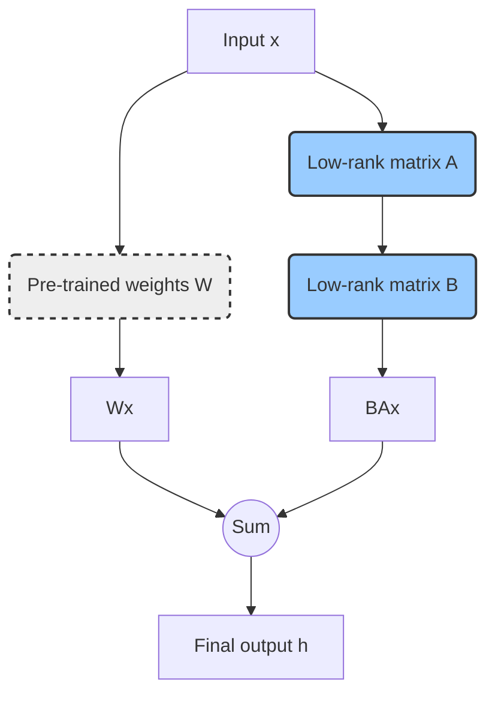

## 1. Introduction: Why LoRA?

In today's rapidly evolving landscape of Large Language Models (LLMs) and generative AI, we've witnessed an explosive growth in model sizes, ranging from hundreds of millions to trillions of parameters. These massive models demonstrate remarkable capabilities across various tasks. However, a significant challenge emerges: how can we fine-tune these models for specific downstream tasks?

The traditional **Full Fine-Tuning** approach, which updates all parameters of a model, faces severe challenges:

*   **High computational cost**: Fine-tuning a model with billions of parameters requires enormous computational resources and hundreds of GB of GPU memory, which is prohibitively expensive for most developers and small to medium-sized enterprises.
*   **Massive storage requirements**: Each fine-tuned model for a specific task requires storing a complete model copy, leading to rapidly escalating storage costs.
*   **Deployment difficulties**: Maintaining and switching between multiple massive model copies for different tasks in a production environment is a nightmare.

To address these pain points, **Parameter-Efficient Fine-Tuning (PEFT)** techniques have emerged. The core idea is to freeze most parameters of the pre-trained model during fine-tuning and only adjust a small portion (typically far less than 1% of the total) of new or specific parameters.

Among the various PEFT techniques, **LoRA (Low-Rank Adaptation of Large Language Models)** stands out for its excellent performance, efficiency, and implementation simplicity, becoming one of the most mainstream and widely applied solutions today. This document will provide an in-depth yet accessible introduction to the core principles of LoRA and offer detailed practical guidance.

## 2. Core Principles: The Magic of LoRA

LoRA's core assumption is that **the weight changes in large language models when adapting to new tasks are low-rank**. In other words, although the weight matrix `W` of the pre-trained model is very large (e.g., `d x d` dimensions), the weight change `ΔW` during fine-tuning has a very low "intrinsic rank."

Based on this assumption, LoRA doesn't directly update `W`, but instead approximates `ΔW` by training two smaller, low-rank matrices `B` and `A`, such that `ΔW ≈ BA`.

*   `W` is the pre-trained, frozen weight matrix.
*   `A` is an `r x d` dimensional matrix, where `r` is a rank much smaller than `d`.
*   `B` is a `d x r` dimensional matrix.

During fine-tuning, only the parameters of matrices `A` and `B` are trainable. The forward propagation computation process is accordingly changed to:

`h = Wx + BAx`

Here's a diagram that illustrates this process more intuitively:

Where `x` is the input and `h` is the output. This approach greatly reduces the number of parameters that need to be trained. For example, if `d = 4096` and `r = 8`, the original matrix `W` has `4096 * 4096 ≈ 16.7M` parameters, while `A` and `B` together have only `4096 * 8 + 8 * 4096 ≈ 65K` parameters, reducing the parameter count by approximately 256 times!

**Key parameter `r`**: The rank `r` is the most important hyperparameter in LoRA. It controls the size of the low-rank matrices and directly determines the number of new parameters.
*   **Smaller `r`**: Fewer trainable parameters, faster training speed, lower memory usage, but may not fully capture complex features of the task.
*   **Larger `r`**: More trainable parameters, stronger model fitting capability, but increases computational cost and risk of overfitting.
In practice, `r` is typically set to 8, 16, 32, or 64, which achieves a good balance between performance and efficiency.