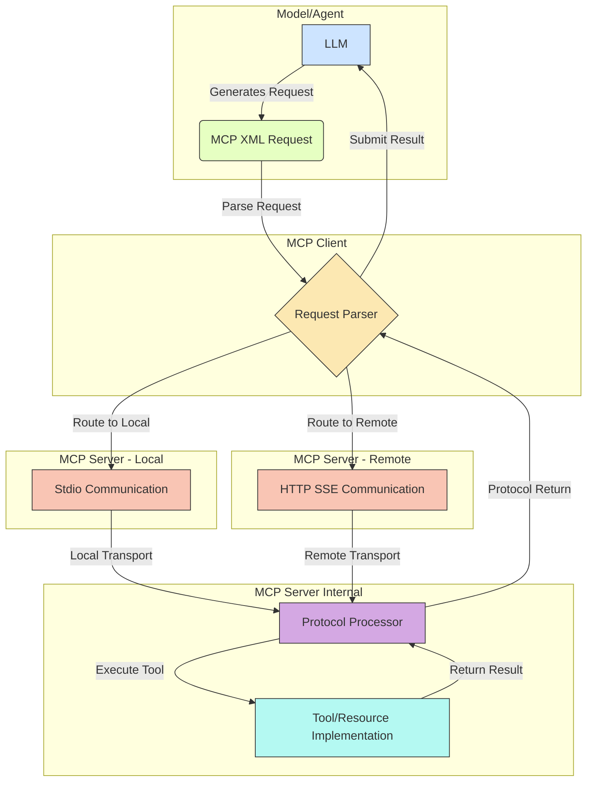
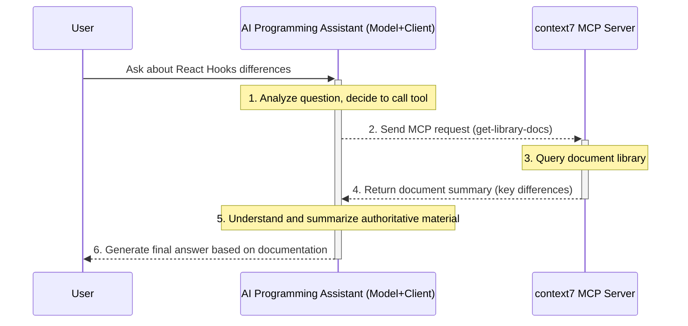

## 1. Macro Introduction: Why Do We Need MCP Beyond Tool Calling?

In our previous document on general LLM tool calling, we revealed how LLMs can break their knowledge boundaries by calling external functions. This is a powerful **programming paradigm**, but it doesn't define a **standardized set of communication rules**. Each developer must decide for themselves how to organize APIs, manage tools, and handle data formats, leading to ecosystem fragmentation.

The **Model Context Protocol (MCP)** was born precisely to solve this problem. It doesn't aim to replace the general concept of tool calling, but rather builds a layer of **standardized, pluggable, service-oriented protocol** on top of it.

If "tool calling" is teaching a car how to "refuel" (use external capabilities), then MCP establishes **standardized gas stations and fuel nozzle interfaces** for the world. No matter what car you drive (different LLMs) or what fuel you need (different tools), as long as you follow the MCP standard, you can connect seamlessly and plug-and-play.

The core value of MCP lies in:

*   **Standardization**: Defines unified message formats and interaction patterns for communication between models and external tool services. Developers no longer need to customize tool integration solutions for each model or application.
*   **Decoupling**: Completely separates the **implementation** of tools (running on MCP servers) from their **use** (initiated by LLMs). Models don't need to know the internal code of tools, only how to communicate with them through the protocol.
*   **Reusability**: Once a tool or data source is encapsulated as an MCP server, it can be easily reused by any model or application that supports the MCP protocol, greatly improving development efficiency.
*   **Discoverability**: MCP makes tools service-oriented, laying the foundation for building tool marketplaces and enabling automatic discovery and orchestration of tools in the future.

In simple terms, MCP elevates scattered "function calls" to the level of "distributed service calls," serving as a key infrastructure for building scalable, interoperable AI Agent ecosystems.

## 2. MCP Core Architecture: A Trinity Collaboration Model

The MCP architecture consists of three core components that interact through clearly defined protocols, forming a solid "trinity" collaboration model.

1.  **Model/Agent**: The decision core. It is responsible for understanding user intent and generating requests that follow the MCP format to call external tools or access external resources.
2.  **MCP Client**: The communication hub. It serves as a bridge between the model and MCP servers, parsing MCP requests generated by the model, communicating with the corresponding MCP servers through standardized transmission methods (such as Stdio, HTTP SSE), and handling returned results.
3.  **MCP Server**: The capability provider. This is a separate process or service that encapsulates one or more tools or data sources and provides standardized access interfaces through the MCP protocol.

Below is a visual explanation of this architecture:



### Detailed Architecture Responsibilities:

1.  **Model Generates Request**: When an LLM needs external capabilities, it no longer generates JSON for specific APIs, but instead generates an XML message that conforms to the MCP specification, such as `<use_mcp_tool>`. This message clearly specifies which `server_name` to communicate with and which `tool_name` to call.
2.  **Client Parsing and Routing**: The MCP client (typically part of the model's runtime environment) captures and parses this XML request. It queries a service registry based on the `server_name` to determine whether the target server is a local process or a remote service.
3.  **Selecting Communication Channel**:
    *   If the target is a **local MCP server** (e.g., a locally running Python script), the client will communicate with that server process through **standard input/output (stdio)**.
    *   If the target is a **remote MCP server** (e.g., a service deployed in the cloud), the client will establish a connection with it through the **HTTP Server-Sent Events (SSE)** protocol.
4.  **Server Processing Request**: After receiving the request, the protocol processor on the MCP server calls the specific tool function or resource handler that has been registered internally based on the `tool_name` or `uri`.
5.  **Execution and Return**: The server executes the specific logic (calling APIs, querying databases, etc.) and encapsulates the results in the MCP standard format, returning them to the client through the same route.
6.  **Result Feedback to Model**: After receiving the server's response, the client organizes and formats it as the execution result of the external tool, and submits it back to the LLM for the LLM to generate the final natural language reply, completing the entire interaction loop.

The brilliance of this architecture lies in the fact that the LLM itself is completely decoupled from the physical location and network implementation details of the tools. It only needs to learn to "speak" the MCP "common language" to interact with any service in the entire MCP ecosystem.

## 3. Communication Protocol Deep Dive: MCP's Neural Network

The power of MCP lies in its standardized communication methods. It primarily connects clients and servers through two distinctly different protocols to accommodate different deployment scenarios.

### 3.1. Local Communication: Standard Input/Output (Stdio)

When the MCP server is a local executable file or script (e.g., a Python script, a Go program), the MCP client uses **Standard Input/Output (Stdio)** for communication. This is a classic and efficient form of inter-process communication (IPC).

**Workflow Breakdown**:

1.  **Launch Subprocess**: The MCP client (such as a VS Code extension) launches the MCP server program as a **subprocess** (e.g., executing `python mcp_server.py`).
2.  **Pipe Establishment**: The operating system automatically establishes three pipes between the parent process (client) and child process (server):
    *   `stdin` (standard input): The channel for the client to send data to the server.
    *   `stdout` (standard output): The channel for the server to send successful results to the client.
    *   `stderr` (standard error): The channel for the server to send error messages to the client.
3.  **Message Exchange**:
    *   The client writes the MCP request (e.g., an XML string like `<use_mcp_tool>...`) to the server process's `stdin`. To handle packet sticking issues, messages are typically delimited by specific separators (such as newline `\n`) or length prefixes.
    *   The server reads and parses the request from its `stdout` and executes the corresponding logic.
    *   The server writes the execution result (also an XML string in MCP format) to its own `stdout`.
    *   If any errors occur during the process, error details are written to `stderr`.
4.  **Lifecycle Management**: The client is responsible for monitoring the lifecycle of the server subprocess and can terminate it when it's no longer needed.

**Advantages**:
*   **Extremely Low Latency**: Since it's local inter-process communication, there's almost no network overhead.
*   **Simple and Reliable**: Simple implementation, not dependent on the network stack.
*   **High Security**: Data doesn't leave the machine, providing natural isolation.

**Applicable Scenarios**:
*   Local tools requiring high performance and high-frequency calls.
*   Tools that directly operate on the local file system or hardware.
*   Development and debugging environments.

### 3.2. Remote Communication: Server-Sent Events (HTTP SSE)

When the MCP server is deployed on a remote host or in the cloud, communication is done through the HTTP-based **Server-Sent Events (SSE)** protocol. SSE is a web technology that allows servers to push events to clients in a one-way fashion.

**Workflow Breakdown**:

1.  **HTTP Connection**: The MCP client initiates a regular HTTP GET request to a specific endpoint of the MCP server (e.g., `https://api.my-mcp-server.com/v1/mcp`). The key is that the client includes `Accept: text/event-stream` in the request header, indicating it wants to establish an SSE connection.
2.  **Long Connection Maintenance**: Upon receiving the request, the server doesn't immediately close the connection but keeps it open, forming a **long connection**. The `Content-Type` header of the response is set to `text/event-stream`.
3.  **Event Pushing**:
    *   The client sends the MCP request (XML string) as part of the HTTP POST request body to another endpoint of the server through this long connection.
    *   After processing the request, the server encapsulates the response data in the SSE event format and **pushes** it back to the client through the previously established long connection. Each event consists of fields such as `event: <event_name>` and `data: <event_data>`.
    *   MCP typically defines different types of events, such as `result` for success, `error` for failure, and `log` for transmitting logs.

**Advantages**:
*   **Cross-Network Communication**: Can easily connect to servers anywhere.
*   **Firewall Penetration**: Based on standard HTTP(S) protocol, with good network compatibility.
*   **Server-Side Push**: Suitable for scenarios requiring server-initiated notifications.

**Applicable Scenarios**:
*   Encapsulating third-party cloud service APIs (such as weather, maps, payments).
*   Shared tools that need centralized management and deployment.
*   Building publicly accessible tool service ecosystems.

## 4. MCP Message Format Breakdown: The Protocol's "Common Language"

The core of MCP is its XML-based message format that is both human-readable and machine-parsable. Models express their intentions by generating XML fragments in these specific formats.

### 4.1. `<use_mcp_tool>`: Calling a Tool

This is the most core message, used to request the execution of a defined tool.

**Structure Example**:
```xml
<use_mcp_tool>
    <server_name>weather-server</server_name>
    <tool_name>get_forecast</tool_name>
    <arguments>
        {
          "city": "San Francisco",
          "days": 5
        }
    </arguments>
</use_mcp_tool>
```

**Field Details**:
*   **`<server_name>` (Required)**:
    *   **Purpose**: Unique identifier of the MCP server.
    *   **Underlying Details**: The client uses this name to look up corresponding server information (whether it's a local process or remote URL) in its internal service registry, deciding whether to use Stdio or SSE for communication. This is key to implementing routing.
*   **`<tool_name>` (Required)**:
    *   **Purpose**: Name of the tool to call.
    *   **Underlying Details**: After receiving the request, the MCP server uses this name to find and execute the corresponding function in its internal tool mapping table.
*   **`<arguments>` (Required)**:
    *   **Purpose**: Parameters needed to call the tool.
    *   **Underlying Details**: The content is typically a **JSON string**. The server needs to first parse this string, convert it to a language-native object or dictionary, and then pass it to the specific tool function. This design leverages JSON's powerful data expression capabilities and cross-language universality.

### 4.2. `<access_mcp_resource>`: Accessing a Resource

In addition to actively "executing" tools, MCP also supports passively "accessing" data sources.

**Structure Example**:
```xml
<access_mcp_resource>
    <server_name>internal-docs</server_name>
    <uri>doc://product/specs/version-3.md</uri>
</access_mcp_resource>
```
**Field Details**:
*   **`<server_name>` (Required)**: Same as above, used for routing.
*   **`<uri>` (Required)**:
    *   **Purpose**: Uniform Resource Identifier for the resource.
    *   **Underlying Details**: The format of the URI (`scheme://path`) is defined and interpreted by the server itself. For example:
        *   `file:///path/to/local/file`: Access a local file.
        *   `db://customers/id/123`: Query a database.
        *   `api://v1/users?active=true`: Access a REST API endpoint.
      The server needs to parse this URI and execute the appropriate resource retrieval logic based on its scheme and path.

## 5. Building an MCP Server: From Concept to Code Skeleton

To make the concept more concrete, below is a minimalist Python pseudocode skeleton showing how to implement an MCP server that responds to Stdio communication.

```python
import sys
import json
import xml.etree.ElementTree as ET

# 1. Define specific tool functions
def get_weather(city: str, days: int = 1):
    """A simulated weather tool"""
    # In the real world, this would call a weather API
    return {"city": city, "forecast": f"Sunny for the next {days} days"}

# Map tool names to function objects
AVAILABLE_TOOLS = {
    "get_weather": get_weather
}

# 2. MCP protocol processing main loop
def main_loop():
    """Read requests from stdin, process them, and write results to stdout"""
    for line in sys.stdin:
        request_xml = line.strip()
        if not request_xml:
            continue

        try:
            # 3. Parse MCP request
            root = ET.fromstring(request_xml)
            if root.tag == "use_mcp_tool":
                tool_name = root.find("tool_name").text
                args_str = root.find("arguments").text
                args = json.loads(args_str)

                # 4. Find and execute the tool
                tool_function = AVAILABLE_TOOLS.get(tool_name)
                if tool_function:
                    result = tool_function(**args)
                    # 5. Encapsulate successful result and write back to stdout
                    response = {"status": "success", "data": result}
                    sys.stdout.write(json.dumps(response) + "\n")
                else:
                    raise ValueError(f"Tool '{tool_name}' not found.")
            
            # (Logic for handling access_mcp_resource can be added here)

        except Exception as e:
            # 6. Write error information back to stderr
            error_response = {"status": "error", "message": str(e)}
            sys.stderr.write(json.dumps(error_response) + "\n")
        
        # Flush buffers in real-time to ensure the client receives immediately
        sys.stdout.flush()
        sys.stderr.flush()

if __name__ == "__main__":
    main_loop()

```
This skeleton clearly demonstrates the core responsibilities of an MCP server: listening for input, parsing the protocol, executing logic, and returning results.

## 6. Practical Exercise: Using the MCP-Driven context7 Server to Answer Technical Questions

After theory and skeleton, let's look at a real, end-to-end example to see how MCP works in practical applications.

**Scenario**: We're building an AI programming assistant. When a user asks a specific programming question, we want the AI to provide the most authoritative and accurate answer by querying the latest official documentation, rather than relying on its potentially outdated internal knowledge.

In this scenario, the `context7` MCP server is our "external document library."

Here's the complete interaction flow:



### Process Breakdown and MCP Value Demonstration

1.  **Intent to Protocol Conversion**: The model (LLM) successfully converts the user's natural language question into a structured, standardized MCP request. It not only identifies the need to call a tool but also accurately fills in the `server_name`, `tool_name`, and `arguments`, which is the core capability of an MCP-driven Agent.

2.  **Decoupling Advantage**: The AI programming assistant (client) doesn't need to know at all how the `context7` server is implemented. It could be a complex system connected to multiple data sources. But for the assistant, it's just a service endpoint that follows the MCP protocol and can be accessed through the name `context7`. This decoupling makes replacing or upgrading the document source extremely simple without needing to modify the Agent's core logic.

3.  **Scalability from Standardization**: Now, if we want to add the ability to query NPM package dependencies to this AI assistant, we just need to develop or integrate another MCP server named `npm-analyzer`. The learning cost for the Agent is almost zero because it only needs to learn to generate a new `<use_mcp_tool>` request pointing to the new `server_name`. The entire system's capabilities can be infinitely expanded like building with Lego blocks.

This example clearly demonstrates how MCP evolves from a simple "function call" concept to a powerful, scalable service-oriented architecture, providing a solid foundation for building complex AI applications.

## 7. Conclusion: MCP's Value and Future—Building the "Internet" of AI

General tool calling gives LLMs the ability to "speak" and "act," while the **Model Context Protocol (MCP) defines the grammar and traffic rules for these abilities**. Through standardization, decoupling, and service-oriented design principles, MCP transforms isolated AI applications and tools into a potential, interoperable massive network.

The true value of MCP isn't that it defines another type of RPC (Remote Procedure Call), but that it's specifically tailored for the unique scenario of **AI Agent interaction with the external world**. It's simple enough for LLMs to easily generate protocol messages, yet powerful enough to support complex, distributed application ecosystems.

In the future, as the MCP ecosystem matures, we can envision an "Internet of AI tools":
*   **Tool Marketplace**: Developers can publish and sell standardized MCP servers, and other applications can purchase and integrate them as needed.
*   **Agent Interoperability**: Intelligent agents developed by different companies based on different underlying models can call each other's capabilities and collaborate on more complex tasks as long as they all "speak" the MCP language.
*   **Dynamic Service Discovery**: More advanced Agents might be able to dynamically discover and learn new MCP services, continuously expanding their capability boundaries without requiring reprogramming.

Therefore, understanding and mastering MCP is not just about learning a specific technology, but a key step in gaining insight into and planning for the next generation of AI application architecture.