## 1. Kokoro: Lightweight Efficient TTS

### 1.1 Architecture Design

Kokoro adopts a concise and efficient architecture design, with its core structure as follows:

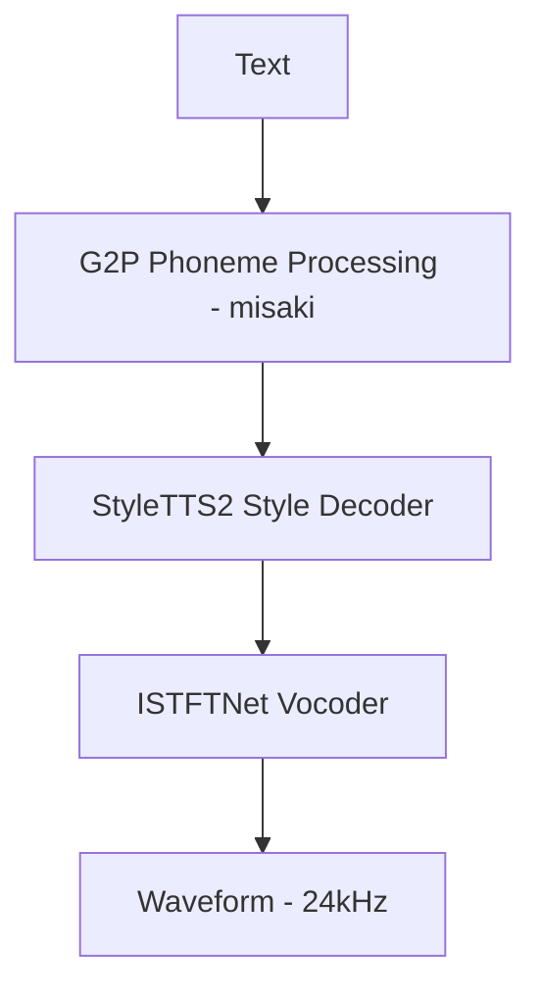

Kokoro's features:
- No traditional Encoder (directly processes phonemes)
- Decoder uses feed-forward non-recursive structure (Conv1D/FFN)
- Does not use transformer, autoregression, or diffusion
- Style and prosody are injected as conditional vectors in the decoder
- Uses ISTFTNet as vocoder: lightweight, fast, supports ONNX inference

### 1.2 Technical Advantages

Kokoro provides solutions to multiple pain points of traditional TTS systems:

| Target Issue | Kokoro's Solution |
| --- | --- |
| Limited voice style diversity | Built-in style embedding and multiple speaker options (48+) |
| High deployment threshold | Full Python/PyTorch + ONNX support, one-line pip installation |
| Slow generation speed | Uses non-autoregressive structure + lightweight vocoder (ISTFTNet) |
| Lack of control capability | Explicitly models pitch/duration/energy and other prosody parameters |
| Unclear licensing | Uses Apache 2.0, commercial-friendly and fine-tunable |

### 1.3 Limitation Analysis

Despite Kokoro's excellence in efficiency and deployment convenience, it has some notable limitations:

#### 1.3.1 Strong Structural Parallelism but Weak Context Modeling
- No encoder → Cannot understand whole-sentence context, e.g., "He is happy today" vs "He is angry today" cannot naturally vary in intonation
- Phonemes are sent directly to the decoder, without linguistic hierarchical structure
- In long texts or sentences with strong contextual dependencies, pause rhythm lacks semantic awareness
- Parallel generation can produce output at once without token-by-token inference, but semantic consistency is poor and cannot simulate paragraph tone progression

#### 1.3.2 Limited Acoustic Modeling Capability
- Sound details (such as breathiness, intonation contour) are not as good as VALL-E, StyleTTS2, Bark
- Uses the classic TTS route of "decoder predicts Mel + vocoder synthesis," acoustic precision is approaching its upper limit
- Prosody prediction is controllable but limited in quality (model itself is too small)

#### 1.3.3 Trade-off Between Audio Quality and Model Complexity
- Sacrifices some audio quality to maintain speed
- May produce artifacts in high-frequency bands, nasal sounds, and plosives
- Limited emotional expression intensity, cannot do "roaring, crying" and other extreme styles
## 2. CosyVoice: LLM-Based Unified Architecture

### 2.1 Architecture Design

CosyVoice adopts a unified architecture design similar to LLMs, integrating text and audio processing into a single framework:

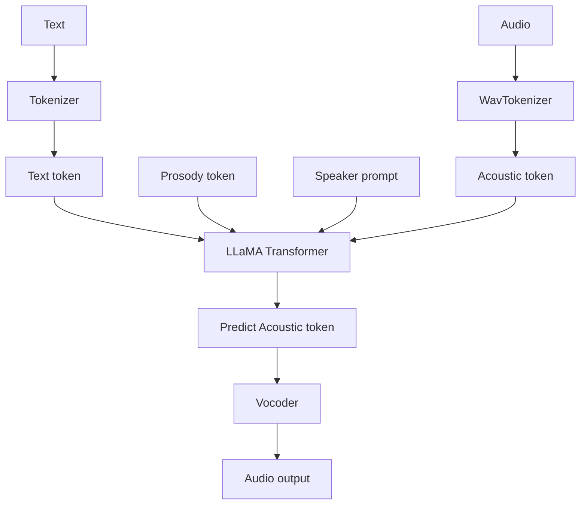

Main modules and their functions:

| Module | Implementation Details |
| --- | --- |
| Tokenizer | Uses standard BPE tokenizer, converts text to tokens (supports Chinese-English mixed input) |
| WavTokenizer | Discretizes audio into tokens (replacing traditional Mel), interfaces with Transformer decoder |
| Transformer Model | Multimodal autoregressive Transformer, structure similar to LLaMA, fuses text and audio tokens |
| Prosody Token | Controls \<laugh\> \<pause\> \<whisper\> and other tones through token insertion rather than model structure modeling |
| Vocoder | Supports HiFi-GAN or SNAC: restores waveforms from audio tokens, lightweight, supports low-latency deployment |

### 2.2 Technical Advantages

CosyVoice provides innovative solutions to multiple issues in traditional TTS architectures:

| Target Issue | CosyVoice's Solution |
| --- | --- |
| Complex traditional structure, slow inference | Uses unified Transformer architecture, no encoder, direct token input/output, simplified structure |
| Lack of prosody control | Inserts prosody tokens (like \<laugh\>) for expression control, no need to train dedicated emotion models |
| Upstream/downstream inconsistency, uncontrollable TTS | Both text and audio are discretized into tokens, unified modeling logic, supports prompt guidance and controllable generation |
| High difficulty in multilingual modeling | Supports Chinese-English bilingual training, text tokenizer natively supports multiple languages, unified expression at token layer |
| Lack of conversational speech capability | Generation method compatible with LLMs, can integrate chat context to construct speech dialogue system framework |

### 2.3 Limitation Analysis

While CosyVoice has significant advantages in unified architecture and flexibility, it also faces some challenges in practical applications:

#### 2.3.1 Autoregressive Structure Leads to Low Parallelism
- Model uses LLM-like token-by-token autoregressive generation method
- Must generate sequentially, cannot process long sentences in parallel
- Inference speed significantly slower than non-autoregressive models like Fastspeech2/StyleTTS2
- Fundamental limitation comes from Transformer decoder architecture: must wait for previous token generation before predicting the next one

#### 2.3.2 Prosody Control Mechanism Relies on Prompts, Not Suitable for Stable Production
- Style control depends on manual insertion of prosody tokens
- Style output quality highly dependent on "prompt crafting techniques"
- Compared to StyleTTS2's direct input of style vector/embedding, control is less structured, lacking learnability and robustness
- Difficult to automatically build stable output flow in engineering

#### 2.3.3 Lacks Speaker Transfer Capability
- No explicit support for speaker embedding
- Cannot implement voice cloning through reference audio
- Capability clearly insufficient when highly personalized speech is needed (e.g., virtual characters, customer-customized voices)

## 3. ChatTTS: Modular Diffusion System

### 3.1 Architecture Design

ChatTTS adopts a modular design approach, combining the advantages of diffusion models:

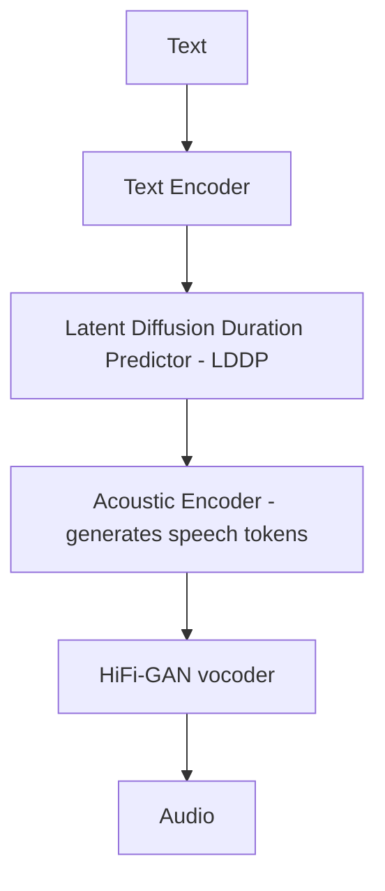

Main modules and their functions:

| Module | Implementation Details |
| --- | --- |
| Tokenizer | Uses standard BPE tokenizer, converts text to tokens (supports Chinese-English mixed input) |
| WavTokenizer | Discretizes audio into tokens (replacing Mel), as decoder target |
| Text Encoder | Encodes text tokens, provides context vector representation for subsequent modules |
| Duration Predictor (LDDP) | Uses diffusion model to predict token duration, achieving natural prosody (rhythm modeling) |
| Acoustic Decoder | Autoregressively generates speech tokens, constructing speech representation frame by frame |
| Prosody Token | Controls \<laugh\> \<pause\> \<shout\> and other tokens, incorporating sentence expression tone and rhythm |
| Vocoder | Supports HiFi-GAN/EnCodec, restores waveforms from speech tokens, flexible deployment |

### 3.2 Technical Advantages

ChatTTS provides solutions to module dependency and inference pipeline issues in TTS systems:

| Issue | ChatTTS's Strategy |
| --- | --- |
| Heavy module dependencies | Decouples modules for modular training: supports independent training of tokenizer, diffusion-based duration model, vocoder, and connects through intermediate tokens, reducing end-to-end coupling risk |
| Long inference pipeline | Uses unified token expression structure (text token → speech token → waveform), forming standard token flow path, enhancing module collaboration efficiency; supports HiFi-GAN to simplify backend |
| High fine-tuning difficulty | Explicit control logic: expresses style through prosody token insertion, no need for additional style models, reducing data dependency and fine-tuning complexity |

### 3.3 Limitation Analysis

ChatTTS has advantages in modular design but also faces some practical application challenges:

#### 3.3.1 Autoregressive Structure Leads to Low Parallelism
- Uses Transformer Decoder + autoregressive mechanism, generating tokens one by one
- Must wait for the completion of the previous speech token before generating the next one

#### 3.3.2 Complex Architecture, Multiple Modules, High Maintenance Difficulty
- Heavy module dependencies: includes tokenizer, diffusion predictor, decoder, vocoder, and other components, difficult to train and optimize uniformly
- Long inference pipeline: errors in any module will affect speech quality and timing control
- High fine-tuning difficulty: control tokens and style embedding effects have strong data dependency

#### 3.3.3 Control Tokens Have Weak Interpretability, Generation Is Unstable
- Control tokens lack standardization, e.g., [laugh], [pause], [sad] insertions show inconsistent performance, requiring manual parameter tuning
- Token combination effects are complex, multiple control tokens combined may produce unexpected speech effects (such as rhythm disorder)
## 4. Chatterbox: Multi-Module Fusion System

### 4.1 Architecture Design

Chatterbox adopts a multi-module fusion design approach, combining various advanced technologies:

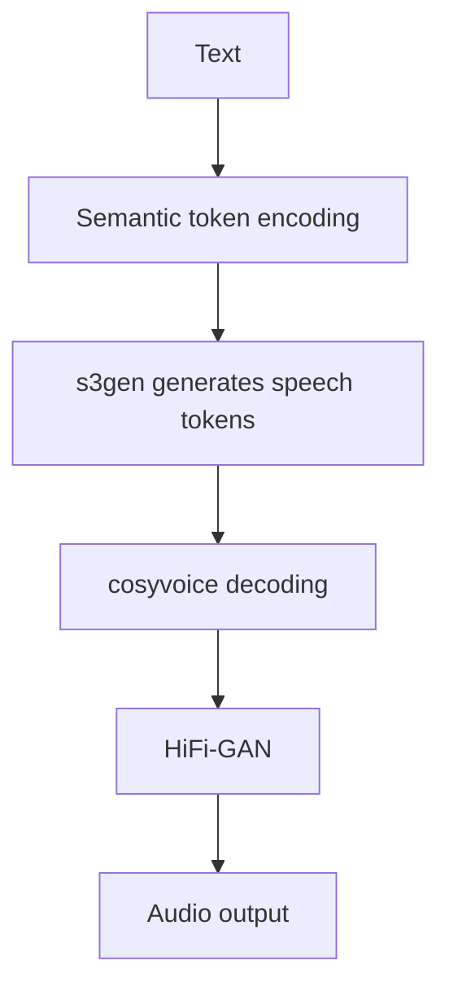

Main modules and their functions:

| Module | Algorithm Approach |
| --- | --- |
| Text Encoder (LLM) | Uses language model (like LLaMA) to encode text |
| s3gen (Speech Semantic Sequence Generator) | Mimics VALL-E concept, predicts discrete speech tokens |
| t3_cfg (TTS Config) | Model structure definition, including vocoder type, tokenizer configuration, etc. |
| CosyVoice (Decoder) | Non-autoregressive decoder |
| HiFi-GAN (Vocoder) | Convolutional + discriminator generator network |

### 4.2 Technical Advantages

Chatterbox provides solutions to multiple issues in traditional TTS systems:

| Target Issue | Chatterbox's Strategy |
| --- | --- |
| Difficult prosody control | Inserts prosody tokens for expression control, no need for additional labels or gating models |
| Text and speech structure separation | Uses discrete speech tokens to connect to unified token pipeline, enhancing upstream-downstream coordination |
| Poor multilingual support | Supports native Chinese-English mixed input, unified token layer expression structure |
| Lack of context/dialogue support | Integrates LLM output token sequences, laying foundation for dialogue speech framework |

### 4.3 Limitation Analysis

Chatterbox has innovations in multi-module fusion but also faces some practical application challenges:

#### 4.3.1 Intermediate Tokens Lack Transparency
- s3gen's speech tokens lack clear interpretability, not conducive to later debugging and control of tone, emotion, and other attributes

#### 4.3.2 Insufficient Context Management Capability
- Current design tends toward single-round inference, does not support long dialogue caching, difficult to use in multi-round voice dialogue agent scenarios

#### 4.3.3 Long Chain, Dependent on Multiple Modules
- Multi-module combination (LLM + s3gen + CosyVoice + vocoder), overall system robustness decreases, difficult to optimize as a whole

## 5. Dia: Lightweight Cross-Platform TTS

### 5.1 Architecture Design

Dia adopts a lightweight design suitable for cross-platform deployment:

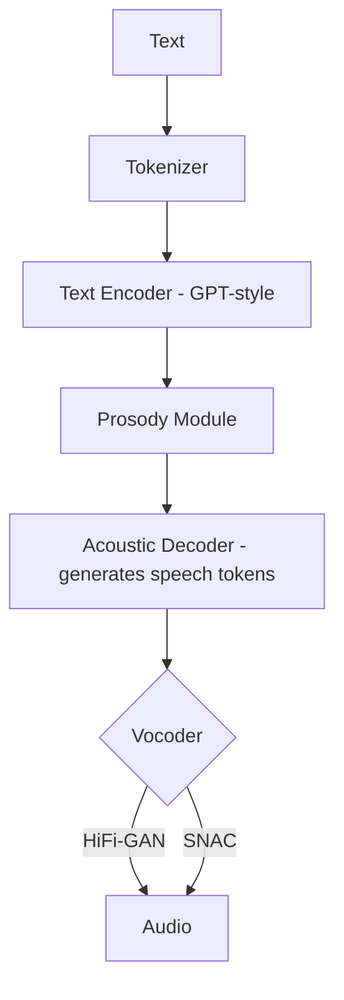

Main modules and their functions:

| Module | Description |
| --- | --- |
| Text Encoder | Mostly GPT-style structures, modeling input text; captures context semantics and intonation cues |
| Prosody Module | Controls tone, rhythm, emotional state (possibly embedding + classifier) |
| Decoder | Maps encoded semantics to acoustic tokens (possibly codec representation or Mel features) |
| Vocoder | Commonly uses HiFi-GAN, converts acoustic tokens to playable audio (.wav or .mp3) |

### 5.2 Technical Advantages

Dia provides solutions to multiple issues in TTS deployment and cross-platform applications:

| Target Issue | dia-gguf's Strategy |
| --- | --- |
| Lack of natural dialogue intonation | Introduces prosody tokens (like \<laugh\>, \<pause\>, etc.) to express tonal changes, building dialogue-aware pronunciation style |
| High inference threshold, complex deployment | Through GGUF format encapsulation + multi-level quantization (Q2/Q4/Q6/F16), supports offline running on CPU, no need for specialized GPU |
| Fragmented model deployment formats | Uses GGUF standard format to encapsulate model parameters and structure information, compatible with TTS.cpp/gguf-connector and other frameworks, achieving cross-platform operation |

### 5.3 Limitation Analysis

Dia has advantages in lightweight and cross-platform deployment but also faces some practical application challenges:

#### 5.3.1 Acoustic Decoder May Become a Bottleneck
- If using high-fidelity decoders (such as VQ-VAE or GAN-based vocoders), inference phase efficiency depends on the vocoder itself
- Current gguf‑connector is mainly implemented in C++, not as efficient as GPU-side HiFi-GAN

#### 5.3.2 Lacks Flexible Style Transfer Mechanism
- Current version mainly targets single dialogue style, does not support style transfer or emotion control in multi-speaker, multi-emotion scenarios
- No encoder-decoder separation structure, limiting style transfer scalability

#### 5.3.3 Clear Trade-off Between Precision and Naturalness
- Low-bit quantization (like Q2) is fast for inference but prone to speech fragmentation and detail loss, not suitable for high-fidelity scenarios
- If deployed in voice assistant or announcer systems, user experience will decline for audio quality-sensitive users

## 6. Orpheus: LLM-Based End-to-End TTS

### 6.1 Architecture Design

Orpheus adopts an end-to-end design approach based on LLMs:

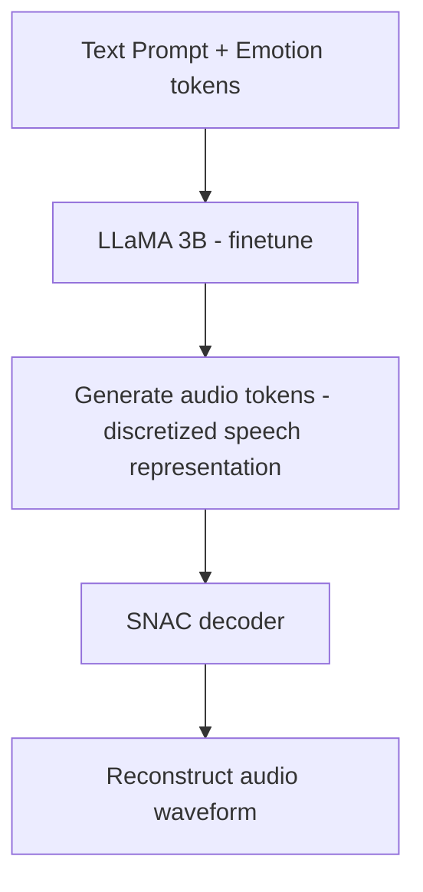

Main modules and their functions:
- **LLaMA 3B Structure**: The foundation is Meta's Transformer architecture, with Orpheus performing SFT (Supervised Finetuning) to learn audio token prediction
- **Tokenization**: Uses audio codec from the SoundStorm series to discretize audio (similar to VQVAE) forming training targets
- **Output Form**: The model's final stage predicts multiple audio token sequences (token-class level autoregression), which can be concatenated to reconstruct speech
- **Decoder**: Uses SNAC (Streaming Non-Autoregressive Codec) to decode audio tokens into final waveform

#### SNAC Decoder in Detail

SNAC (Spectral Neural Audio Codec) is a neural network audio codec used in TTS systems to convert audio codes into actual audio waveforms.

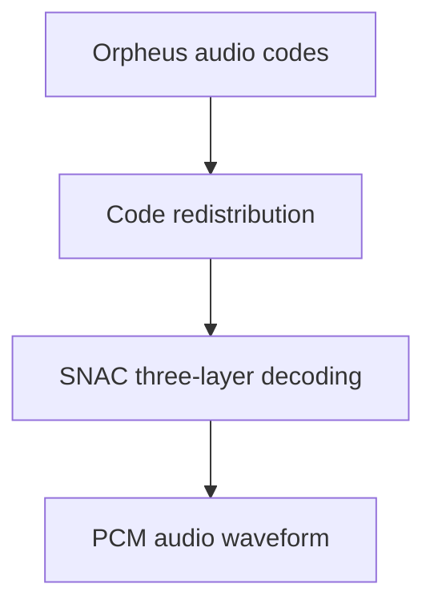

**Basic Concept**

SNAC is a neural network audio decoder specifically designed for TTS systems. It receives discrete audio codes generated by TTS models (such as Orpheus) and converts these codes into high-quality 24kHz audio waveforms. SNAC's main feature is its ability to efficiently process hierarchically encoded audio information and generate natural, fluent speech.

**Technical Architecture**

1. **Layered Structure**: SNAC uses a 3-layer structure to process audio information, while the Orpheus model generates 7-layer audio codes. This requires code redistribution.

2. **Code Redistribution Mapping**:
   - SNAC layer 0 receives Orpheus layer 0 codes
   - SNAC layer 1 receives Orpheus layers 1 and 4 codes (interleaved)
   - SNAC layer 2 receives Orpheus layers 2, 3, 5, and 6 codes (interleaved)

3. **Decoding Process**:
   ```
   Orpheus audio codes → Code redistribution → SNAC three-layer decoding → PCM audio waveform
   ```

**Implementation Methods**

SNAC has two main implementation methods:

1. **PyTorch Implementation**:
   - Uses the original PyTorch model for decoding
   - Suitable for environments without ONNX support
   - Relatively slower decoding speed

2. **ONNX Optimized Implementation**:
   - Uses pre-trained models in ONNX (Open Neural Network Exchange) format
   - Supports hardware acceleration (CUDA or CPU)
   - Provides quantized versions, reducing model size and improving inference speed
   - Better real-time performance (higher RTF - Real Time Factor)

**Code Processing Flow**

1. **Code Validation**:
   - Checks if codes are within valid range
   - Ensures the number of codes is a multiple of ORPHEUS_N_LAYERS (7)

2. **Code Padding**:
   - If the number of codes is not a multiple of 7, automatic padding is applied
   - Uses the last valid code or default code for padding

3. **Code Redistribution**:
   - Remaps 7-layer Orpheus codes to 3-layer SNAC codes
   - Follows specific mapping rules

4. **Decoding**:
   - Uses the SNAC model (PyTorch or ONNX) to convert redistributed codes into audio waveforms
   - Outputs 24kHz sample rate mono PCM audio data

**Role in TTS Systems**

SNAC plays a key role in the entire TTS workflow:

1. The TTS model (Orpheus) generates audio codes
2. The SNAC decoder converts these codes into actual audio waveforms
3. The audio waveform undergoes post-processing (such as fade in/out, gain adjustment, watermarking, etc.)
4. The final audio is encoded in Opus format and transmitted to the client via HTTP or WebSocket

SNAC's efficient decoding capability is one of the key technologies for achieving low-latency, high-quality streaming TTS, enabling the system to respond to user requests in real time.
### 6.2 Technical Advantages

Orpheus provides innovative solutions to multiple issues in TTS systems:

| Issue | Solution |
| --- | --- |
| Complex multi-module deployment | Integrates TTS into LLM, builds single-model structure, directly generates audio tokens |
| High inference latency | Uses low-bit quantization (Q4_K_M), combined with GGUF format, accelerating inference |
| Uncontrollable emotions | Introduces \<laugh\>, \<sigh\>, \<giggle\> and other prompt control tokens |
| Cloud service dependency | Can run locally on llama.cpp/LM Studio, no need for cloud inference |
| Separation from LLM | Compatible with LLM dialogue structure, can directly generate speech responses in multimodal dialogue |

### 6.3 Limitation Analysis

Orpheus has innovations in end-to-end design but also faces some practical application challenges:

#### 6.3.1 Emotion Control Lacks Structural Modeling
- Emotions are only controlled through "prompt token" insertion, lacking systematic emotion modeling modules
- May lead to the same \<laugh\> showing unstable, occasionally ineffective performance (prompt injection instability)

#### 6.3.2 Strong Decoder Binding
- Using SNAC decoder means final sound quality is tightly bound to the audio codec, cannot be freely replaced with alternatives like HiFi-GAN
- If the codec produces artifacts, the entire system struggles to independently optimize the decoding module

#### 6.3.3 Difficult Customization
- Does not support zero-shot speaker cloning
- Generating user-customized voices still requires "fine-tuning," creating a training threshold

## 7. OuteTTS: GGUF Format Optimized TTS

### 7.1 Architecture Design

OuteTTS adopts an optimized design suitable for GGUF format deployment:

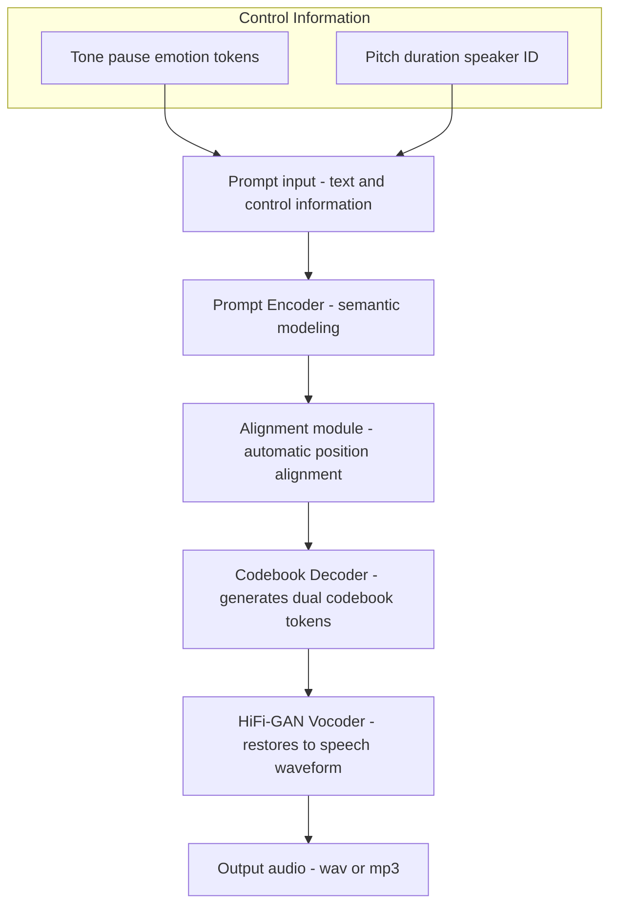

Main modules and their functions:

| Module | Description |
| --- | --- |
| Prompt Encoder | Input is natural language prompt (with context, speaker, timbre information), similar to instruction-guided model generating speech content |
| Alignment Module (internal modeling) | Embedded alignment capability, no need for external alignment tool, builds position-to-token mapping based on transformer |
| Codebook Decoder | Maps text to dual codebook tokens under DAC encoder (e.g., codec-C1, codec-C2), as latent representation of audio content |
| Vocoder (HiFi-GAN) | Maps DAC codebook or speech features to final playable audio (supports .wav), deployed on CPU/GPU |

#### DAC Decoder in Detail

DAC (Discrete Audio Codec) is a discrete audio codec used in TTS systems primarily to convert audio codes generated by OuteTTS models into actual audio waveforms. DAC is an efficient neural network audio decoder specifically designed for high-quality speech synthesis.

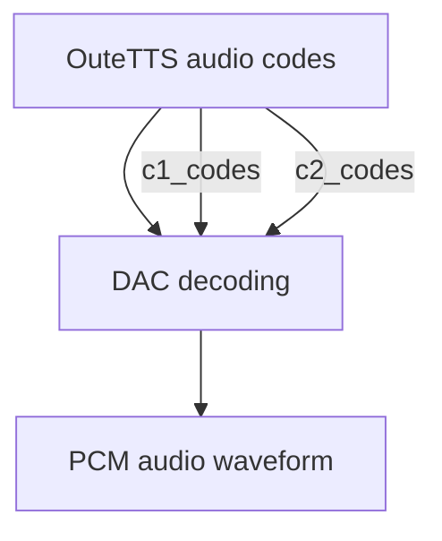

**Technical Architecture**

1. **Encoding Structure**: DAC uses a 2-layer encoding structure (dual codebook), with each codebook having a size of 1024, which differs from SNAC's 3-layer structure.

2. **Code Format**:
   - DAC uses two sets of codes: c1_codes and c2_codes
   - These two sets of codes have the same length and correspond one-to-one
   - Each code has a value range of 0-1023

3. **Decoding Process**:
   ```
   OuteTTS audio codes(c1_codes, c2_codes) → DAC decoding → PCM audio waveform
   ```

4. **Sample Rate**: DAC generates 24kHz sample rate audio, the same as SNAC

**Implementation Methods**

Similar to SNAC, DAC also has two implementation methods:

1. **PyTorch Implementation**:
   - Uses the original PyTorch model for decoding
   - Suitable for environments without ONNX support

2. **ONNX Optimized Implementation**:
   - Uses pre-trained models in ONNX format
   - Supports hardware acceleration (CUDA or CPU)
   - Provides quantized versions, reducing model size and improving inference speed

**DAC's Advanced Features**

The DAC decoder implements several advanced features that make it particularly suitable for streaming TTS applications:

1. **Batch Processing Optimization**:
   - Adaptive batch size (8-64 frames)
   - Dynamically adjusts batch size based on performance history

2. **Streaming Processing**:
   - Supports batch decoding and streaming output
   - Adaptively adjusts parameters based on network quality

3. **Audio Effect Processing**:
   - Supports fade in/out effects
   - Supports audio gain adjustment

#### Comparison Between SNAC and DAC

Feature | DAC | SNAC |
|---------|-----|------|
Encoding Layers | 2 layers | 3 layers |
Code Organization | Two parallel code sets | Three hierarchical code layers |
Codebook Size | 1024 | 4096 |
Input Format | c1_codes, c2_codes | 7-layer Orpheus codes redistributed to 3 layers |

**Applicable Models**

- **DAC**: Designed specifically for OuteTTS-type models, processes dual codebook format audio codes
- **SNAC**: Designed specifically for Orpheus-type models, processes 7-layer encoded format audio codes

**Performance Characteristics**

- **DAC**: More focused on streaming processing and low latency, with more adaptive optimizations
- **SNAC**: More focused on audio quality and accurate code redistribution

**Code Processing Methods**

- **DAC**: Directly processes two sets of codes, no complex redistribution needed
- **SNAC**: Needs to remap 7-layer Orpheus codes to a 3-layer structure

**Why Different Models Use Different Decoders**

OuteTTS and Orpheus use different decoders primarily for the following reasons:

1. **Model Design Differences**:
   - OuteTTS model was designed with DAC compatibility in mind, directly outputting DAC format dual codebook codes
   - Orpheus model is based on a different architecture, outputting 7-layer encoding, requiring SNAC for decoding

2. **Encoding Format Incompatibility**:
   - DAC expects to receive two parallel code sets (c1_codes, c2_codes)
   - SNAC expects to receive redistributed 3-layer codes, which come from Orpheus's 7-layer output

3. **Different Optimization Directions**:
   - OuteTTS+DAC combination focuses more on streaming processing and low latency
   - Orpheus+SNAC combination focuses more on audio quality and multi-level encoding


### 7.2 Technical Advantages

OuteTTS provides innovative solutions to multiple issues in TTS systems:

| Target Issue | Llama-OuteTTS's Strategy |
| --- | --- |
| Multilingual TTS without preprocessing | Directly supports Chinese, English, Japanese, Arabic and other languages, no need for pinyin conversion or forced spacing |
| Difficult alignment, requires external CTC | Model has built-in alignment mechanism, directly aligns text to generated tokens, no need for external alignment tools |
| Audio quality vs. throughput conflict | DAC + dual codebook improves audio quality; generates 150 tokens per second, speed significantly improved compared to similar diffusion models |
| Complex model invocation | GGUF format encapsulated structure + llama.cpp support, more streamlined local deployment |

### 7.3 Limitation Analysis

OuteTTS has innovations in GGUF format optimization but also faces some practical application challenges:

#### 7.3.1 Audio Encoding Bottleneck
- Currently mainly uses DAC-based dual codebook expression, which improves audio quality, but:
  - Decoder (HiFi-GAN) remains a bottleneck, especially with inference latency on edge devices
  - If using more complex models (like VQ-VAE) in the future, their parallelism and efficient inference will become more problematic
  - Current gguf-connector is C++-based, does not yet support native mobile deployment (like Android/iOS TensorDelegate)

#### 7.3.2 Parallelism and Context Dependency
- Model strongly depends on context memory (such as token temporal dependencies), during inference:
  - Cannot parallelize extensively like some autoregressive diffusion models, inference remains serially dominated
  - Sampling stage requires setting repetition penalty window (default 64 tokens)
  - High context length (e.g., 8192) is supported but significantly increases memory cost during deployment

#### 7.3.3 Insufficient Style Transfer and Personality Control
- Current version mainly optimized for "single person + tone control," style transfer mechanism not sophisticated enough:
  - Lacks speaker embedding-based control mechanism
  - Multi-emotion, multi-style still requires prompt fine-tuning rather than explicit token control
  - Future needs to introduce speaker encoder or style/emotion vectors

## 8. F5-TTS: Diffusion Model Optimized TTS

### 8.1 Architecture Design

F5-TTS adopts an innovative design based on diffusion models:

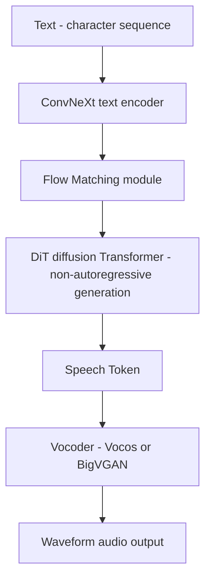

Main modules and their functions:

| Module | Description |
| --- | --- |
| ConvNeXt text encoder | Used to extract global features of text, with parallel convolution capability |
| Flow Matching | Used in training process to learn noise → speech token mapping path |
| DiT (Diffusion Transformer) | Core synthesizer, parallel speech token generator based on diffusion modeling |
| Sway Sampling | Optimizes sampling path during inference, reducing ineffective diffusion steps, improving speed and quality |
| Vocoder | Uses BigVGAN or Vocos to restore speech tokens to waveform audio |

### 8.2 Technical Advantages

F5-TTS provides innovative solutions to multiple issues in TTS systems:

| Issue | F5-TTS's Solution |
| --- | --- |
| Phoneme alignment, duration dependency | Input characters directly fill alignment, not dependent on duration predictor or aligner |
| Unnatural speech quality, weak cloning ability | Uses diffusion-based speech token synthesis, with sway sampling technology to enhance naturalness |

### 8.3 Limitation Analysis

F5-TTS has innovations in diffusion model optimization but also faces some practical application challenges:

#### 8.3.1 Inference Requires Multi-Step Sampling
Although sway sampling is optimized, inference still needs to execute diffusion sampling process (about 20 steps)

#### 8.3.2 Dependency on Vocoder
Final speech quality highly depends on vocoder (like vocos, BigVGAN), requiring separate deployment

#### 8.3.3 Weak Audio Length Control
No explicit duration predictor, speed control requires additional prompts or sampling techniques

#### 8.3.4 License Restrictions
Uses CC-BY-NC-4.0 open source license, cannot be used commercially directly, must follow authorization terms

## 9. Index-TTS: Multimodal Conditional TTS

### 9.1 Architecture Design

Index-TTS adopts an innovative design with multimodal conditional control:

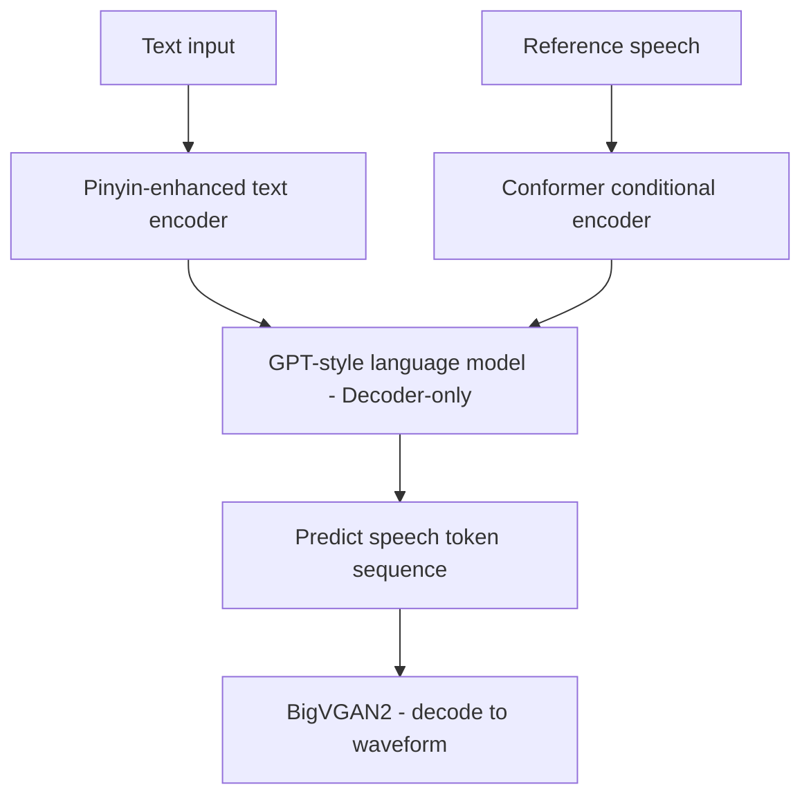

Main modules and their functions:

| Module Name | Function Description |
| --- | --- |
| Text encoder (character + pinyin) | Chinese supports pinyin input, English directly models characters - Can accurately capture pronunciation features, solving complex reading problems like polyphonic characters and neutral tones |
| Neural audio tokenizer | Uses FSQ encoder to convert audio to discrete tokens - Each frame (25Hz) expressed with multiple codebooks, token utilization rate reaches 98%, far higher than VQ |
| LLM-style Decoder (GPT structure) | Decoder-only Transformer architecture - Conditional inputs include text tokens and reference audio - Supports multi-speaker migration and zero-shot speech generation |
| Conditional Conformer encoder | Encodes implicit features like timbre, rhythm, prosody in reference audio - Provides stable control vector input to GPT, enhancing stability and timbre restoration |
| BigVGAN2 | Decodes final audio waveform - Balances high fidelity and real-time synthesis performance |

### 9.2 Technical Advantages

Index-TTS provides innovative solutions to multiple issues in TTS systems:

| Issue | IndexTTS's Solution |
| --- | --- |
| Polyphonic character control | Character+pinyin joint modeling, can explicitly specify pronunciation |
| Poor speaker consistency | Introduces Conformer conditional module, uses reference audio to enhance control capability |
| Low audio token utilization | Uses FSQ instead of VQ-VAE, effectively utilizes codebook, enhances expressiveness |
| Poor model stability | Phased training + conditional control, reduces divergence, ensures synthesis quality |
| Poor English compatibility | IndexTTS 1.5 strengthens English token learning, enhances cross-language adaptability |
| Slow inference | GPT decoder + BigVGAN2, balances naturalness and speed, can deploy industrial systems |

### 9.3 Limitation Analysis

Index-TTS has innovations in multimodal conditional control but also faces some practical application challenges:

#### 9.3.1 Prosody Control Depends on Reference Audio
- Current system's prosody generation mainly relies on implicit guidance from input reference audio
  - Lacks explicit prosody annotation or token control mechanism, cannot manually control pauses, stress, intonation, and other information
  - When reference audio is not ideal or style differences are large, prosody transfer effects can easily become unnatural or inconsistent
- Not conducive to template-based large-scale application scenarios (such as customer service, reading) where controllability and stability are needed

#### 9.3.2 Generation Uncertainty
- Uses GPT-style autoregressive generation structure, although speech naturalness is high, there is some uncertainty:
  - The same input in different inference rounds may fluctuate in speech rate, prosody, and slight timbre
  - Difficult to completely reproduce generation results, not conducive to audio caching and version management
- In high-consistency requirement scenarios (such as film post-production, legal synthesis), may affect delivery stability

#### 9.3.3 Speaker Migration Not Completely End-to-End
- Current speaker control module still relies on explicit reference audio embedding (such as speaker encoder) as conditional vector input
  - Speaker vectors need external module extraction, not end-to-end integration
  - When reference audio quality is low or speaking style varies greatly, cloning effect is unstable
- Does not support completely text-driven speaker specification (such as specifying speaker ID generation), limiting automated deployment flexibility

## 10. Mega-TTS3: Unified Modeling TTS

### 10.1 Architecture Design

Mega-TTS3 adopts an innovative design with unified modeling:

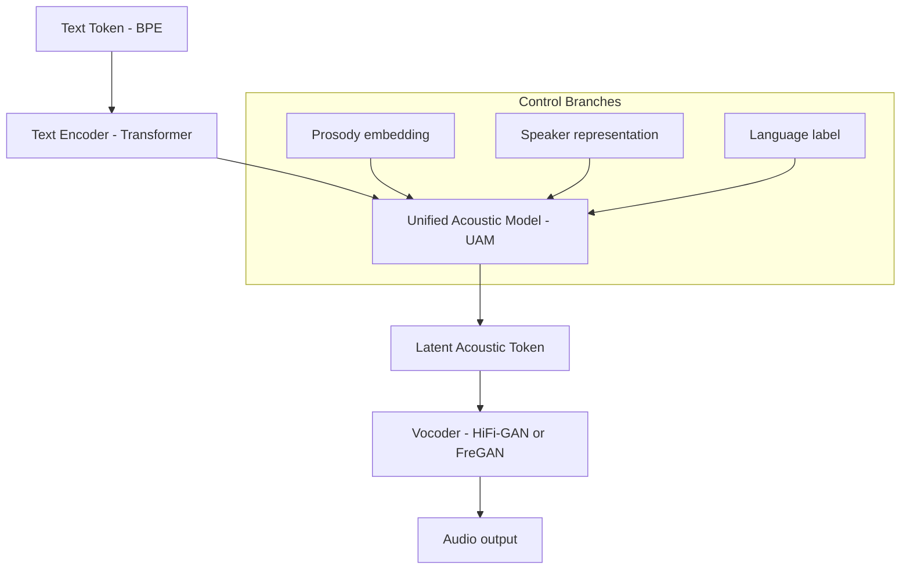

Main modules and their functions:

| Module | Description |
| --- | --- |
| Text Encoder | Encodes input text tokens into semantic vectors, supports multilingual tokens |
| UAM (Unified Acoustic Model) | Core module, fuses Text, Prosody, Speaker, Language information, predicts acoustic latent |
| Continuous Speaker Modeling | Models speaker information across time sequence, reducing style drift issues |
| Prosody Control Module | Provides independent prosody controller, can precisely control pauses, rhythm, pitch, etc. |
| Vocoder | Finally decodes latent tokens into audio waveforms, using HiFi-GAN / FreGAN |

### 10.2 Technical Advantages

Mega-TTS3 provides innovative solutions to multiple issues in TTS systems:

| Issue | Description | Mega-TTS3's Solution |
| --- | --- | --- |
| Inconsistent modeling granularity | Different modules (text, prosody, speech) have inconsistent modeling granularity, causing information fragmentation and style transfer distortion | Introduces Unified Acoustic Model (UAM), fusing text encoding, prosody information, language labels and audio latent in unified modeling, avoiding staged information loss |
| Difficult multi-speaker modeling | Traditional embedding methods struggle to stably model large numbers of speakers, with insufficient generalization and synthesis consistency | Proposes Continuous Speaker Embedding, embedding speaker representation as temporal vector into unified modeling process, improving style consistency and transfer stability |
| Weak control granularity | Lacks pluggable independent control mechanisms when controlling emotion, speed, prosody, and other styles | Designs pluggable control branches (Prosody / Emotion / Language / Speaker Embedding), each control signal independently modeled, can be combined and flexibly plugged in, enhancing control precision |
| Cross-language interference | Sparse language label modeling, multi-language systems often interfere with each other, affecting speech quality | Introduces explicit language label embedding + multilingual shared Transformer parameter mechanism, enhancing language sharing while ensuring language identifiability, alleviating inter-language interference |

### 10.3 Limitation Analysis

Mega-TTS3 has innovations in unified modeling but also faces some practical application challenges:

#### 10.3.1 Limited Control Granularity & Weak Interpretability
- Although control dimensions are many (emotion, speed, prosody, etc.), they still rely on end-to-end model implicit modeling:
  - Lacks pluggable independent control modules
  - Strong coupling between control variables, difficult to precisely control single dimensions
  - Not suitable for "controllable interpretable synthesis" scenarios oriented toward industrial deployment

#### 10.3.2 Uneven Multilingual Speech Quality
- Despite supporting multilingual modeling, actual generation still shows:
  - Heavy dependence on language labels, label errors directly lead to pronunciation disorder
  - Inter-language interference issues (such as accent drift in Chinese-English mixed reading)
  - Low-resource language generation effects significantly lower than high-resource languages

## 11. Summary and Outlook

### 11.1 Modern TTS Model Architecture Trends

Through in-depth analysis of ten mainstream TTS models, we can observe the following clear technical trends:

1. **Unified Architecture**: From early multi-module cascades to today's end-to-end unified architectures, TTS systems are developing toward more integrated directions
2. **Discrete Token Representation**: Using discrete tokens to represent audio has become mainstream, more suitable for fusion with models like LLMs
3. **Coexistence of Diffusion and Autoregression**: Diffusion models provide high-quality generation capabilities, while autoregressive models have advantages in context modeling
4. **Multimodal Conditional Control**: Controlling speech generation through multimodal inputs such as reference audio and emotion labels, enhancing personalization capabilities
5. **Deployment Format Standardization**: Popularization of formats like GGUF makes TTS models easier to deploy on different platforms

### 11.2 Technical Challenges and Future Directions

Despite significant progress in modern TTS systems, they still face some key challenges:

1. **Inference Efficiency vs. Audio Quality Balance**: How to improve inference speed while ensuring high audio quality, especially on edge devices
2. **Controllability vs. Naturalness Trade-off**: Enhancing control capabilities often sacrifices speech naturalness; balancing the two is an ongoing challenge
3. **Multilingual Consistency**: Building truly high-quality multilingual TTS systems, ensuring consistency and quality across languages
4. **Emotional Expression Depth**: Current systems still have limitations in nuanced emotional expression, requiring deeper emotion modeling in the future
5. **Long Text Coherence**: Improving coherence and consistency in long text generation, especially at paragraph and chapter levels of speech synthesis

### 11.3 Application Scenario Matching Recommendations

Different TTS models are suitable for different application scenarios. Here are some matching recommendations:

| Application Scenario | Recommended Models | Rationale |
| --- | --- | --- |
| Edge devices/Low-resource environments | Kokoro, Dia | Lightweight design, supports ONNX/GGUF format, low latency |
| High-quality audio content creation | Index-TTS, F5-TTS | High-quality output, supports reference audio cloning, suitable for professional content production |
| Multilingual customer service systems | Mega-TTS3 | Excellent multilingual support, unified modeling architecture, good stability |
| Conversational voice assistants | CosyVoice, Orpheus | Good compatibility with LLMs, supports dialogue context, natural emotional expression |
| Local deployment voice applications | OuteTTS | GGUF format optimization, supports CPU inference, no need for cloud services |

With continued technological advancement, we can expect future TTS systems to further break modal boundaries, achieving more natural, personalized, and emotionally rich voice interaction experiences.