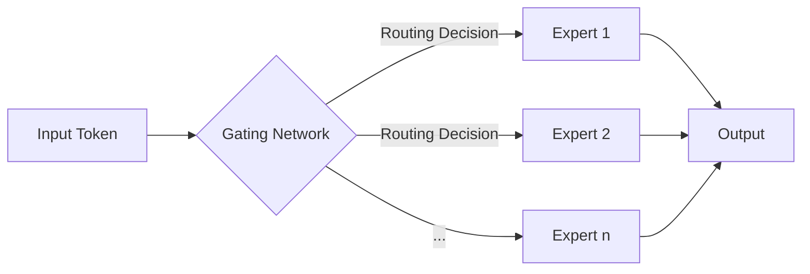
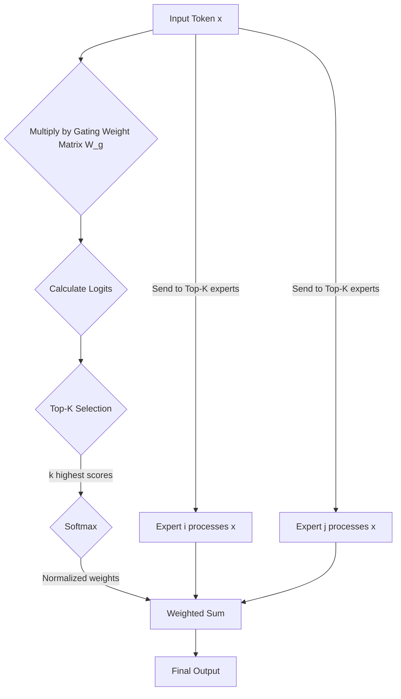

## 1. Introduction

Mixture of Experts (MoE) is a neural network architecture that dramatically expands model capacity without significantly increasing computational costs by decomposing large models into multiple smaller "expert" networks and using a "gating" network to dynamically select the most appropriate subset of experts for each input.

This approach draws inspiration from expert systems in human society, where specific problems are directed to relevant specialists. In deep learning, this means the model can learn to route different inputs to expert networks specialized in processing that type of data, enabling more efficient and specialized learning.

## 2. Core Components: Macro and Micro Analysis

From a macro perspective, MoE layers typically serve as efficient alternatives to standard Feed-Forward Network (FFN) layers in Transformer models. While traditional FFN layers apply identical transformations to every token in a sequence, MoE layers introduce the concept of **Conditional Computation**: for each token, the model dynamically selects a small subset of "expert" networks to process it, rather than engaging the entire model's parameters. This mechanism allows models to maintain relatively constant computation costs despite having enormous parameter counts.

An MoE layer consists of two core components: **Expert Networks** and a **Gating Network**.
Below is a visualization of the macro architecture of an MoE layer:

An MoE layer consists of two core components: **Expert Networks** and a **Gating Network**.

### 2.1. Expert Networks: Specialized Processors

#### Underlying Structure and Variants

At the foundational level, each "expert" is typically an independent feed-forward neural network (FFN). In standard Transformer architectures, an FFN usually consists of two linear layers and a non-linear activation function (such as GeLU or SwiGLU).

*   **Homogeneous Experts**: In most MoE models, all experts share identical network structures. For example, in the Mixtral 8x7B model, each MoE layer contains 8 structurally identical expert FFNs. This design facilitates implementation and optimization.
*   **Heterogeneous Experts**: Though less common, experts can theoretically be heterogeneous, using different activation functions, hidden layer dimensions, or even more complex structures (like convolutional layers). This might allow the model to learn more diverse features but increases implementation complexity.

#### Functional Specialization: From General to Specialized

During training, although all experts start identical, the routing mechanism of the gating network guides them to develop different "specializations." For example, in natural language processing tasks, after sufficient training, we might observe:

*   **Grammar Experts**: Specialized in processing tokens related to sentence structure, parts of speech, etc.
*   **Semantic Experts**: Focused on understanding word meanings and contextual relationships.
*   **Domain-Specific Knowledge Experts**: For instance, one expert might specialize in "legal" text, while another becomes more sensitive to "biomedical" domain knowledge.

This functional specialization is a key source of MoE models' efficiency, as it allows the model to process specific types of information with dedicated subnetworks rather than using a single large, general network for all information.

### 2.2. Gating Network: Intelligent Routing and Dispatch Center

The gating network is the core decision-making unit of MoE, responsible for assigning the most appropriate experts to each input token.

#### Technical Details

The gating network implementation is typically concise and efficient. Its workflow is as follows:

1.  **Generate Logits**: For the vector representation `x` of an input token (typically the output from a self-attention layer), the gating network calculates routing logits through a simple trainable linear layer `W_g`: `logits = einsum("d,de->e", x, W_g)`, where `d` is the token dimension and `e` is the number of experts. This operation produces a vector of length `e`, with each element representing the "score" for the corresponding expert.

2.  **Top-K Routing Mechanism**: To achieve sparse computation, tokens are not sent to all experts. The gating network selects the `k` highest scores from the logits vector. This `k` value is an important hyperparameter; in Mixtral 8x7B, `k=2`. This means each token is processed by only the two most relevant experts.

3.  **Calculate Gating Weights (Softmax)**: The selected `k` logits are normalized through a Softmax function, generating `k` gating weights that determine how to combine the outputs of these `k` experts.
    `weights = softmax(top_k_logits)`

4.  **Calculate Final Output**: The input token `x` is sent to the selected `k` experts, producing `k` expert outputs. The final output is the weighted sum of these `k` expert outputs, with weights being the gating weights calculated in the previous step.
    `output = sum(weights[i] * expert_i(x) for i in top_k_indices)`

Below is a visualization of this workflow:

#### Key Challenge: Load Balancing

A critical challenge for the gating network is the "Matthew Effect": some experts may receive more training opportunities due to slightly higher initial weights, becoming stronger and subsequently being selected more frequently, causing other experts to be "starved." To address this issue, MoE introduces an **Auxiliary Load Balancing Loss**.

*   **Principle**: This loss function aims to encourage the gating network to distribute tokens as evenly as possible across all experts. It's typically implemented by calculating the square sum of the proportion of tokens assigned to each expert in a batch, multiplied by an adjustable hyperparameter `α`. The loss value increases as the distribution becomes more unbalanced.
*   **Optimization**: This auxiliary loss is added to the model's main task loss (such as cross-entropy loss for language models) to form the final total loss function. By optimizing both losses during backpropagation, the model is incentivized to maintain load balance among experts while completing its main task.

## 3. MoE Model Training Methods: Addressing Scale Challenges

Due to the enormous parameter count of MoE models (despite sparse computation), their training poses significant challenges to computational resources, especially memory. To effectively train MoE models, complex parallelization strategies must be employed.

### 3.1. Expert Parallelism

This is the core parallelization strategy for training MoE models.

*   **Core Idea**: Distribute different experts across different computing devices (such as GPUs). For example, in a scenario with an MoE layer containing 8 experts and 8 GPUs, each GPU is responsible for storing and computing one expert. Other parts of the model (such as self-attention layers) can be replicated on each GPU.
*   **Workflow and Communication Overhead**: In each forward pass, tokens from various GPUs, after being processed by the gating network, need to be sent to the GPUs storing the corresponding experts based on routing decisions. This process involves a global **All-to-All** communication operation, where each GPU needs to send and receive data to and from all other GPUs. After computation, results are sent back to the original GPUs through another All-to-All communication. This intensive communication is the main performance bottleneck in expert parallel mode.

### 3.2. Combining with Other Parallelism Strategies

To address different scales of models and hardware configurations, expert parallelism often needs to be combined with other parallelism strategies:

*   **Data Parallelism**: This is the most common parallelism approach. When the number of GPUs exceeds the number of experts, multiple GPUs can form a data parallel group, with each group containing a complete set of experts (distributed through expert parallelism). For example, with 64 GPUs and 8 experts, 8 data parallel groups can be created, each with 8 GPUs, with each GPU responsible for one expert.
*   **Model Parallelism and Pipeline Parallelism**: For ultra-large models where even a single expert or non-MoE layer cannot fit into a single GPU, tensor model parallelism and pipeline parallelism need to be introduced to further split the model.

In summary, training MoE is a complex multi-dimensional parallel engineering task that requires careful design of parallelism strategies based on factors such as model size, number of experts, number of GPUs, and network bandwidth.

## 4. Advantages of MoE

- **Enormous Model Capacity**: MoE allows models to have massive parameters (e.g., trillions of parameters) without needing to compute all parameters in each forward pass. This enables the model to learn more complex and detailed knowledge.
- **Controllable Computational Cost**: Due to the sparse activation strategy (activating only a few experts), the training and inference costs of MoE models are comparable to dense models with far fewer total parameters.
- **Faster Training and Inference**: Under the same computational budget, MoE models typically converge faster and have faster inference speeds compared to dense models.

## 5. Challenges of MoE

- **Training Instability**: The gating network may tend to always select a few "popular" experts, preventing other experts from being adequately trained. To address this issue, a "load balancing loss" is typically introduced to encourage the gating network to distribute inputs evenly across all experts.
- **High Communication Cost**: In distributed training, since different experts may be distributed across different computing devices, routing input data from the gating network to selected experts incurs significant communication overhead.
- **Complex Implementation**: Compared to standard dense models, MoE models are more complex to implement and deploy, requiring specialized parallel computing strategies and hardware support.
- **Memory Consumption**: Although computation is sparse, all parameters of the model (all experts) need to be stored in memory, placing high demands on hardware.

## 6. Key Technologies and Recent Advances

- **Switch Transformers**: This is a simplified MoE architecture proposed by Google that simplifies the top-k strategy to top-1, meaning each token is routed to only one expert. This design greatly simplifies routing logic and reduces communication costs.
- **GShard**: This is a system for training MoE models on ultra-large-scale clusters. It effectively addresses the communication bottleneck in MoE training through clever data and model parallelism strategies.
- **Expert Capacity Factor**: To handle load imbalance issues, a "capacity" can be set for each expert, defining the maximum number of tokens it can process in a batch. If an expert is selected more times than its capacity, excess tokens will be "dropped" or routed to other experts.
- **Latest Routing Strategies**: Researchers are exploring more advanced routing strategies, such as allowing tokens to be routed to multiple experts with weighted combination of their outputs, or using more complex gating networks to make smarter routing decisions.
- **Applications in Computer Vision**: MoE is not limited to NLP; it has also been successfully applied to computer vision tasks such as pose estimation, enhancing model performance by training specialized experts for different datasets or pose types.

## 7. Summary and Outlook

MoE models have successfully achieved massive model scaling at controllable computational costs by introducing sparsely activated expert networks, becoming a key technology for building ultra-large-scale language and vision models.

Despite challenges in training stability and communication overhead, with the continued maturation of technologies like Switch Transformers and GShard, as well as the emergence of new routing strategies and hardware optimizations, the application prospects for MoE are increasingly broad. In the future, we can expect to see more, larger, and more efficient MoE models playing important roles across various domains.