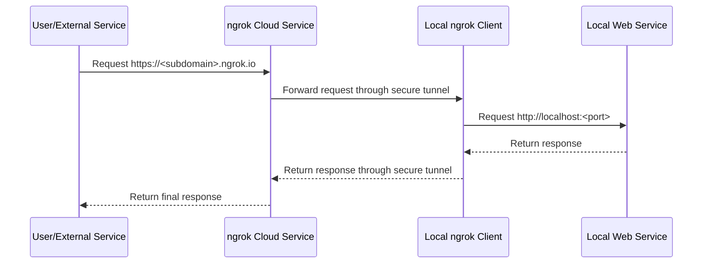

## 1. Introduction

### 1.1 What is ngrok?

ngrok is a powerful reverse proxy tool that can expose your local development environment to the public internet. By creating a secure tunnel, ngrok can forward requests from the public internet to services running on your local machine. This makes it exceptionally easy to integrate with external services (such as Webhooks, APIs) during development and testing phases.

### 1.2 How It Works

The working principle of ngrok can be summarized in the following steps:

1.  **Start the ngrok client**: You run the ngrok client on your local machine and specify the local port to expose.
2.  **Establish a secure tunnel**: The ngrok client connects to the ngrok cloud service and establishes a secure encrypted tunnel.
3.  **Assign a public address**: The ngrok cloud service assigns you a unique public URL (e.g., `https://random-string.ngrok.io`).
4.  **Forward requests**: When requests are sent to this public URL, the ngrok cloud service forwards them through the tunnel to your local ngrok client.
5.  **Access local service**: The ngrok client then forwards the requests to the service running on the specified local port.



### 1.3 Why Use ngrok?

-   **Webhook Development**: Locally develop and test applications that need to receive webhooks (like GitHub, Stripe, Twilio).
-   **API Testing**: Allow mobile applications or other external services to access APIs you're developing locally.
-   **Project Demonstration**: Quickly demonstrate a website or application under development to clients or colleagues without deploying to a server.
-   **Debugging**: Capture and inspect all HTTP requests and responses through the tunnel for easy debugging.

---

## 2. Quick Start

### 2.1 Download and Installation

1.  **Visit the official website**: Go to [ngrok's official website](https://ngrok.com/download).
2.  **Download the client**: Download the ngrok client corresponding to your operating system (Windows, macOS, Linux).
3.  **Extract the file**: After downloading, extract the compressed package. You'll get an executable file named `ngrok`.

### 2.2 Account and Authtoken

1.  **Register an account**: Register a free account on [ngrok's official website](https://dashboard.ngrok.com/signup).
2.  **Get your Authtoken**: After logging in, find your Authtoken on your [dashboard](https://dashboard.ngrok.com/get-started/your-authtoken) page.
3.  **Configure your Authtoken**: Open a terminal, navigate to the directory containing the ngrok executable, and run the following command to add your Authtoken to the default configuration file `ngrok.yml`:

    ```bash
    ./ngrok config add-authtoken <YOUR_AUTHTOKEN>
    ```

    After configuring your Authtoken, you'll be able to use more features, such as custom subdomains, longer session times, etc.

### 2.3 Establish Your First Tunnel

Suppose you have a Web service running on port `8000` locally, you can use the following command to create a public tunnel for it:

```bash
./ngrok http 8000
```

After executing the command, you'll see output similar to the following in your terminal:

```
ngrok by @inconshreveable                                                                                                                                                                                                (Ctrl+C to quit)

Session Status                online
Account                       Your Name (Plan: Free)
Version                       3.x.x
Region                        United States (us)
Web Interface                 http://127.0.0.1:4040
Forwarding                    https://9a1b-2c3d-4e5f-6a7b-8c9d.ngrok.io -> http://localhost:8000

Connections                   ttl     opn     rt1     rt5     p50     p90
                              0       0       0.00    0.00    0.00    0.00
```

Now, you can access your local service on port `8000` through the public address `https://9a1b-2c3d-4e5f-6a7b-8c9d.ngrok.io`.

At the same time, you can also access ngrok's Web interface by visiting `http://127.0.0.1:4040` in your browser, where you can view details of all requests and responses through the tunnel.

---

## 3. Core Concepts

### 3.1 Tunnel Protocols

ngrok supports multiple protocols for creating tunnels:

-   **HTTP/HTTPS**: The most commonly used protocol for exposing Web services.

    ```bash
    # Expose HTTP service on local port 80
    ngrok http 80

    # Expose HTTPS service on local port 3000
    ngrok http https://localhost:3000
    ```

-   **TCP**: Used to expose non-HTTP services, such as SSH, database connections, game servers, etc.

    ```bash
    # Expose SSH service on local port 22
    ngrok tcp 22
    ```

-   **TLS**: Used to expose TCP services that require end-to-end TLS encryption.

    ```bash
    ngrok tls --domain=your-domain.com 443
    ```

### 3.2 Custom Domains

For paid users, ngrok allows you to use custom subdomains or fully custom domains.

-   **Custom subdomain**:

    ```bash
    ngrok http --subdomain=my-awesome-app 8080
    ```

    This will expose your service at `https://my-awesome-app.ngrok.io`.

-   **Custom domain** (requires a paid plan and CNAME configuration):

    ```bash
    ngrok http --hostname=dev.example.com 80
    ```

---

## 4. Advanced Usage

### 4.1 Configuration File

In addition to specifying parameters on the command line, you can also define tunnels through the `ngrok.yml` configuration file. This is very useful for managing multiple tunnels and complex configurations.

By default, the configuration file is located at:

-   **macOS**: `~/Library/Application Support/ngrok/ngrok.yml`
-   **Linux**: `~/.config/ngrok/ngrok.yml`
-   **Windows**: `C:\Users\YourUser\AppData\Local\ngrok\ngrok.yml`

An example of a configuration file:

```yaml
version: "2"
authtoken: <YOUR_AUTHTOKEN>
tunnels:
  my-api:
    proto: http
    addr: 8080
    subdomain: my-cool-api
  ssh:
    proto: tcp
    addr: 22
```

After configuration, you can start tunnels by name:

```bash
ngrok start my-api
ngrok start ssh
ngrok start --all # Start all defined tunnels
```

### 4.2 Security Options

ngrok provides various security features to protect your tunnels:

-   **HTTP Basic Authentication**: Add username and password protection to your tunnel.

    ```bash
    ngrok http --basic-auth="username:password" 8000
    ```

-   **OAuth 2.0** (paid feature): Integrate with OAuth providers like Google, GitHub, Microsoft, etc., so that only authenticated users can access your tunnel.

    ```bash
    ngrok http --oauth=google --oauth-allow-emails=user@example.com 8000
    ```

-   **IP Restrictions** (paid feature): Only allow or deny access from specific IP addresses or CIDR ranges.

    ```bash
    ngrok http --ip-restriction-allow-cidrs=203.0.113.0/24 8000
    ```

### 4.3 Webhook Verification (paid feature)

ngrok can automatically verify signatures of webhook requests from certain services (like Twilio, Stripe), increasing security.

```bash
ngrok http --verify-webhook=twilio --verify-webhook-secret=<YOUR_SECRET> 8000
```

---

## 5. API and Integration

ngrok provides official client libraries that allow you to control tunnels programmatically. `@ngrok/ngrok` is the official Node.js library.

### 5.1 Installation

```bash
npm install @ngrok/ngrok
```

### 5.2 Example: Starting a Tunnel in a Node.js Application

```javascript
const ngrok = require("@ngrok/ngrok");

// Set up Express application
const express = require('express');
const app = express();
const port = 8080;

app.get('/', (req, res) => {
  res.send('Hello from local server!');
});

app.listen(port, async () => {
  console.log(`Local server listening at http://localhost:${port}`);

  // Start ngrok tunnel
  try {
    const listener = await ngrok.forward({
      addr: port,
      authtoken_from_env: true, // Read from NGROK_AUTHTOKEN environment variable
    });
    console.log(`Ingress established at: ${listener.url()}`);
  } catch (error) {
    console.error("Error establishing ngrok tunnel:", error);
  }
});
```

---

## 6. Frequently Asked Questions (FAQ)

**Q: Is the ngrok tunnel address fixed?**
A: In the free plan, you'll get a new random URL each time you restart the ngrok client. Paid plan users can use fixed subdomains or custom domains.

**Q: How do I run ngrok in the background?**
A: On Linux or macOS, you can use `&` to place it in the background: `./ngrok http 8000 &`. For more stable solutions, it's recommended to use tools like `systemd` or `supervisor` to manage the ngrok process.

**Q: What are the main differences between the free and paid versions?**
A: The paid version offers more advanced features, including:
-   Custom/fixed subdomains
-   Custom domains
-   More concurrent tunnels
-   IP whitelisting/blacklisting
-   OAuth integration
-   Longer session timeout times

**Q: Can I run multiple tunnels simultaneously?**
A: Yes. You can define multiple tunnels in the configuration file and start them with `ngrok start --all`, or open multiple terminal windows and run the `ngrok` command separately. The free version has limitations on the number of concurrent tunnels.