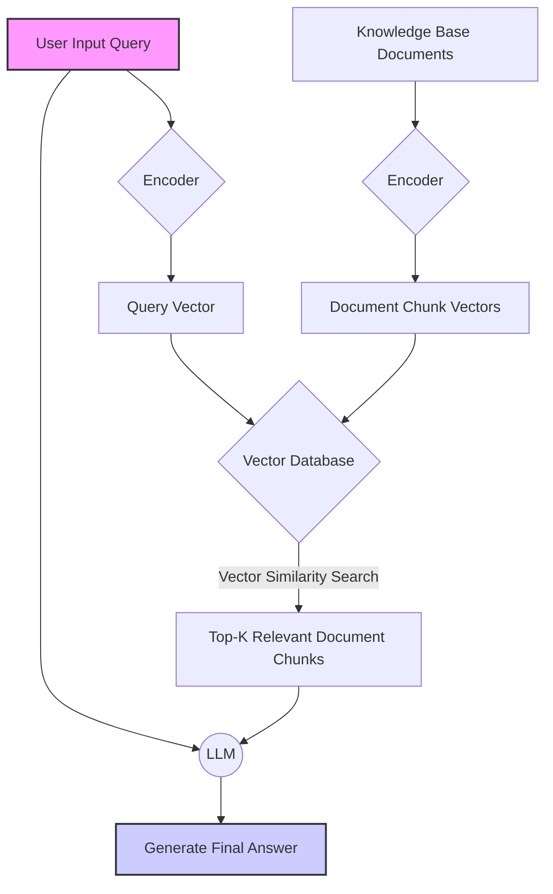
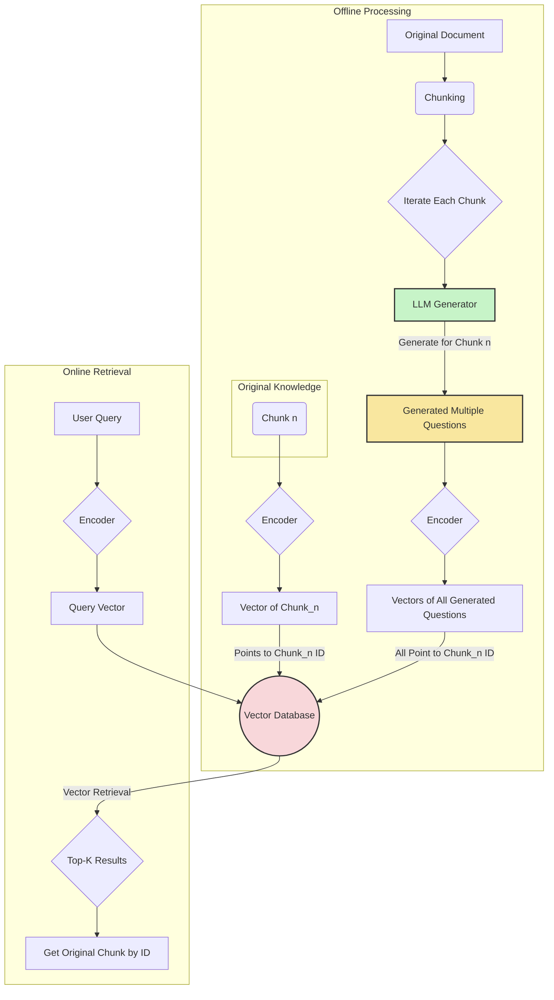

## 1. Introduction: Why RAG Needs Data Augmentation?

### 1.1 Understanding the "Semantic Gap"

The core of Retrieval-Augmented Generation (RAG) lies in the "retrieval" component. However, in practical applications, the retrieval step often becomes the bottleneck of the entire system. The root cause is the **"Semantic Gap"** or **"Retrieval Mismatch"**.

Specifically, this problem manifests in:

*   **Diversity and Uncertainty of User Queries**: Users ask questions in countless ways, potentially using colloquial language, abbreviations, typos, or describing the same issue from different angles.
*   **Fixed and Formal Nature of Knowledge Base Documents**: Documents in knowledge bases are typically structured and formal, with relatively fixed terminology.

This leads to a situation where the user's query vector and the document chunk vectors in the knowledge base may be far apart in vector space, even when they are semantically related.

**For example:**

*   **Knowledge Base Document**: `# ThinkPad X1 Carbon Cooling Guide\n\nIf your ThinkPad X1 Carbon is experiencing overheating issues, you can try cleaning the fan, updating the BIOS, or selecting balanced mode in power management...`
*   **Possible User Queries**:
    *   "My laptop is too hot, what should I do?"
    *   "Is my Lenovo laptop fan noise due to overheating?" (Even though the brand doesn't exactly match, the issue is essentially similar)
    *   "Computer gets very hot, games are lagging"
    *   "How can I cool down my ThinkPad?"

In a standard RAG workflow, these queries might fail to accurately retrieve the cooling guide mentioned above because their literal expressions and vector representations are too different.

### 1.2 Standard RAG Workflow

To better understand the problem, let's first look at the standard RAG workflow.


*Figure 1: Standard RAG System Workflow*

As shown above, the entire retrieval process heavily relies on the similarity between the `Query Vector` and `Chunk Vectors`. If there is a "semantic gap" between them, the retrieval effectiveness will be significantly reduced.

The core objective of **Data Augmentation/Generalization** is to proactively generate a large number of potential, semantically equivalent but expressively diverse "virtual queries" or "equivalent descriptions" for each document chunk in the knowledge base, thereby preemptively bridging this gap on the knowledge base side.

## 2. LLM-Based Data Augmentation/Generalization Techniques: Deep Dive into Details

Leveraging the powerful language understanding and generation capabilities of Large Language Models (LLMs) is the most efficient and mainstream approach to data augmentation/generalization. The core idea is: **Let the LLM play the role of users and generate various possible questions and expressions for each knowledge chunk.**

There are two main technical implementation paths: **Hypothetical Questions Generation** and **Summarization & Paraphrasing**.

### 2.1 Technical Path One: Hypothetical Questions Generation

This is the most direct and effective method. For each document chunk in the knowledge base, we have the LLM generate a set of questions that can be answered by this document chunk.

#### Technical Implementation Details:

1.  **Document Chunking**: First, split the original document into meaningful, appropriately sized knowledge chunks. This is the foundation of all RAG systems.
2.  **Generate Questions for Each Chunk**:
    *   Iterate through each chunk.
    *   Feed the content of the chunk as context to an LLM.
    *   Use a carefully designed prompt (see Chapter 3) to instruct the LLM to generate N questions closely related to the chunk's content.
3.  **Data Organization and Indexing**:
    *   **Key Step**: Associate the N generated questions with the original chunk. When vectorizing, **don't vectorize the questions themselves**, but process each generated "question-original text pair". A common approach is to concatenate the question and original text when vectorizing, or associate the question as metadata with the original chunk's vector during indexing.
    *   A more common practice is to store **both the vectors of the generated questions** and **the vector of the original chunk** in the vector database, all pointing to the same original chunk ID. This way, when a user queries, whether they match the original chunk or one of the generated questions, they can ultimately locate the correct original text.
4.  **Store in Vector Database**: Store the processed data (original chunk vectors, generated question vectors) and their metadata (such as original ID) in a vector database (like ChromaDB, Milvus, Qdrant, etc.).

#### Workflow Diagram:


*Figure 2: Data-Augmented RAG Workflow with Hypothetical Questions Generation*

This method greatly enriches the "retrievability" of each knowledge chunk, essentially creating multiple different "entry points" for each piece of knowledge.

### 2.2 Technical Path Two: Summarization & Paraphrasing

Besides generating questions, we can also generate summaries of knowledge chunks or rewrite them in different ways.

*   **Summarization**: For a relatively long knowledge chunk, an LLM can generate a concise core summary. This summary can serve as a "coarse-grained" retrieval entry point. When a user's query is relatively broad, it might more easily match with the summary.
*   **Paraphrasing**: Have the LLM rewrite the core content of the same knowledge chunk using different sentence structures and vocabulary. This also creates new vectors that are different from the original text vector but semantically consistent.

#### Technical Implementation Details:

The implementation method is similar to hypothetical question generation, except that the prompt's goal changes from "generating questions" to "generating summaries" or "paraphrasing". The generated data is similarly associated with the original chunk, and its vector is stored in the database.

In practice, **hypothetical question generation is usually more popular than summarization/paraphrasing** because it more directly simulates the user's "questioning" behavior, aligning better with the essence of the retrieval task.

## 3. Prompt Engineering for Data Generalization: An Excellent Example

The quality of the prompt directly determines the quality of the generated data. A good prompt should be like a precise scalpel, guiding the LLM to generate the data we want.

Below is a well-considered prompt example designed for the "hypothetical questions generation" task:

```text
### Role and Goal
You are an advanced AI assistant tasked with generating a set of high-quality, diverse questions for a given knowledge text (Context). These questions should be fully answerable by the provided text. Your goal is to help build a smarter Q&A system that can find answers regardless of how users phrase their questions, as long as they relate to the text content.

### Instructions
Based on the `[Original Text]` provided below, please generate **5** different questions.

### Requirements
1.  **Diversity**: The generated questions must differ in sentence structure, wording, and intent. Try to ask from different angles, for example:
    *   **How-to type**: How to operate...?
    *   **Why type**: Why does...happen?
    *   **What is type**: What does...mean?
    *   **Comparison type**: What's the difference between...and...?
    *   **What-if type**: What if...?
2.  **Persona**: Imagine you are different types of users asking questions:
    *   A **Beginner** who knows nothing about this field.
    *   An **Expert** seeking in-depth technical details.
    *   A **Student** looking for answers for an assignment.
3.  **Fully Answerable**: Ensure each generated question can be fully and only answered using information from the `[Original Text]`. Don't ask questions that require external knowledge.
4.  **Language Style**: Questions should be natural, clear, and conform to conversational English.

### Output Format
Please output strictly in the following JSON format, without any additional explanations or text:
```json
{
  "generated_questions": [
    {
      "persona": "beginner",
      "question": "First question here"
    },
    {
      "persona": "expert",
      "question": "Second question here"
    },
    {
      "persona": "student",
      "question": "Third question here"
    },
    // ... more questions
  ]
}
```

### [Original Text]
{context_chunk}
```

#### Prompt Design Analysis:

*   **Role and Goal**: Gives the LLM a clear positioning, helping it understand the significance of the task, rather than just mechanically executing it.
*   **Diversity Requirements**: This is the most critical part. It guides the LLM to think from different dimensions, avoiding generating a large number of homogeneous questions (e.g., simply turning statements into questions).
*   **Persona Role-Playing**: This instruction greatly enriches the diversity of questions. A beginner's questions might be broader and more colloquial, while an expert's questions might be more specific and technical.
*   **Fully Answerable**: This is an important constraint, ensuring the strong relevance of generated questions to the original text, avoiding introducing noise.
*   **JSON Output Format**: Forced structured output makes the LLM's return results easily parsable and processable by programs, an essential element in automated workflows.

## 4. Effect Validation: How to Measure the Effectiveness of Data Augmentation?

Data augmentation is not a process that is "automatically good once done"; a scientific evaluation system must be established to verify its effectiveness. Evaluation should be conducted from two aspects: **recall rate** and **final answer quality**.

### 4.1 Retrieval Evaluation

This is the core metric for evaluating improvements in the retrieval component.

#### Steps:

1.  **Build an Evaluation Dataset**: This is the most critical step. You need to create a test set containing `(question, corresponding correct original Chunk_ID)` pairs. The questions in this test set should be as diverse as possible, simulating real user queries.
2.  **Conduct Two Tests**:
    *   **Experimental Group A (Without Data Augmentation)**: Use the standard RAG process to retrieve with questions from the test set, recording the Top-K Chunk IDs recalled.
    *   **Experimental Group B (With Data Augmentation)**: Use a knowledge base integrated with data augmentation, retrieve with the same questions, and record the Top-K Chunk IDs recalled.
3.  **Calculate Evaluation Metrics**:
    *   **Recall@K**: What proportion of questions in the test set had their corresponding correct Chunk_ID appear in the top K of the recall results? This is the most important metric. `Recall@K = (Number of correctly recalled questions) / (Total number of questions)`.
    *   **Precision@K**: How many of the top K results recalled are correct? For a single question, if there is only one correct answer, then Precision@K is either 1/K or 0.
    *   **MRR (Mean Reciprocal Rank)**: The average of the reciprocal of the rank of the correct answer in the recall list. This metric not only cares about whether it was recalled but also how high it was ranked. The higher the ranking, the higher the score. `MRR = (1/N) * Σ(1 / rank_i)`, where `N` is the total number of questions, and `rank_i` is the rank of the correct answer for the i-th question.

By comparing the `Recall@K` and `MRR` metrics of experimental groups A and B, you can quantitatively determine whether data augmentation has improved recall performance.

### 4.2 Generation Quality Evaluation

Improved recall rate is a prerequisite, but it doesn't completely equate to improved user experience. We also need to evaluate the final answers generated by the RAG system end-to-end.

#### Method One: Human Evaluation

This is the most reliable but most costly method.

1.  **Design Evaluation Dimensions**:
    *   **Relevance**: Does the generated answer get to the point and address the user's question?
    *   **Accuracy/Factuality**: Is the information in the answer accurate and based on the retrieved knowledge?
    *   **Fluency**: Is the language of the answer natural and smooth?
2.  **Conduct Blind Evaluation**: Have evaluators score (e.g., 1-5 points) or compare (A is better/B is better/tie) two sets of answers without knowing which answer comes from which system (before/after enhancement).
3.  **Statistical Analysis**: Determine whether data augmentation has a positive impact on the final answer quality through statistical scores or win rates.

#### Method Two: LLM-based Automatic Evaluation

This is a more efficient alternative, using a more powerful, advanced LLM (such as GPT-4o, Claude 3.5 Sonnet) as a "judge".

1.  **Design Evaluation Prompt**: Create a prompt asking the judge LLM to compare answers generated by different systems.
    *   **Input**: User question, retrieved context, System A's answer, System B's answer.
    *   **Instructions**: Ask the LLM to analyze from dimensions such as relevance and accuracy, determine which answer is better, and output scores and reasons in JSON format.
2.  **Batch Execution and Analysis**: Run this evaluation process for all questions in the test set, then calculate win rates.

This method allows for large-scale, low-cost evaluation, making rapid iteration possible.

## 5. Conclusion and Future Outlook

**In summary, LLM-based data augmentation/generalization is a key technology for enhancing RAG system performance, especially for solving the "semantic gap" problem.** By pre-generating a large number of "virtual questions" or equivalent descriptions in the offline phase, it greatly enriches the retrievability of the knowledge base, making the system more adaptable to the diversity of user queries in the real world.

**Practical Considerations:**

*   **Balance Between Cost and Quality**: Generating data incurs LLM API call costs and index storage costs. The number of data to generate for each chunk needs to be decided based on budget and performance improvement needs.
*   **Cleaning Generated Data**: LLM generation is not 100% perfect and may produce low-quality or irrelevant questions. Consider adding a validation step to filter out poor-quality data.

**Future Outlook:**

*   **Combination with Rerankers**: Data augmentation aims to improve "recall," while reranker models aim to optimize "ranking." Combining the two—ensuring relevant content is recalled through data augmentation, then fine-ranking through reranker models—is the golden combination for RAG optimization.
*   **Multimodal Data Augmentation**: With the development of multimodal large models, future RAG will process more than just text. How to perform data augmentation for image and audio/video knowledge (e.g., generating text questions about image content) will be an interesting research direction.
*   **Adaptive Data Augmentation**: Future systems might automatically discover recall failure cases based on real user queries online, and perform targeted data augmentation for relevant knowledge chunks, forming a continuously optimizing closed loop.