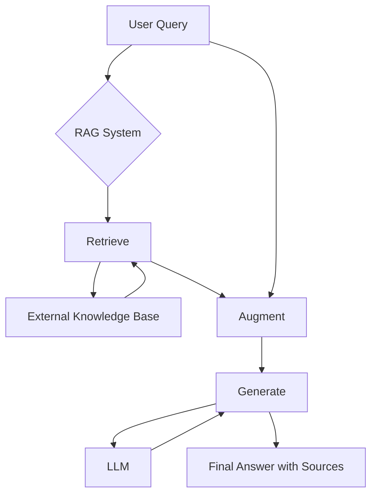
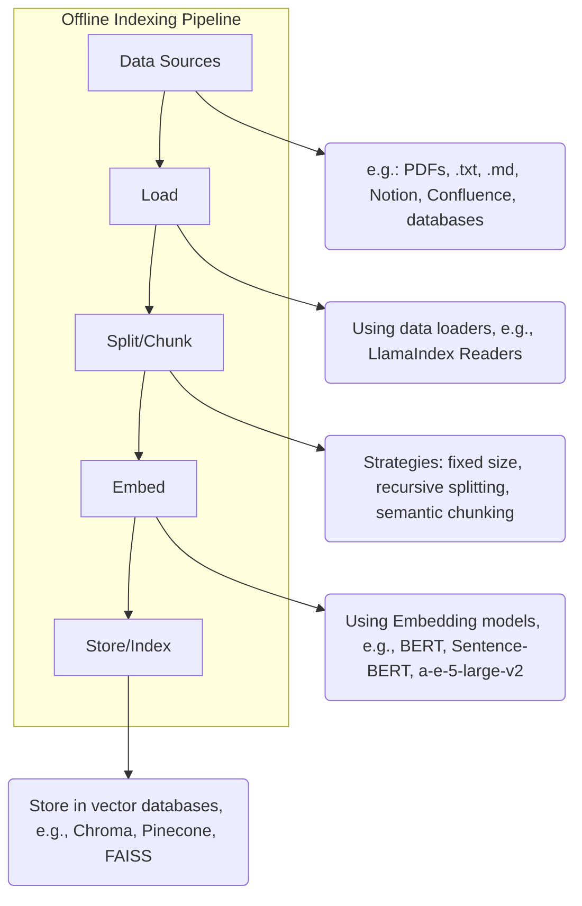
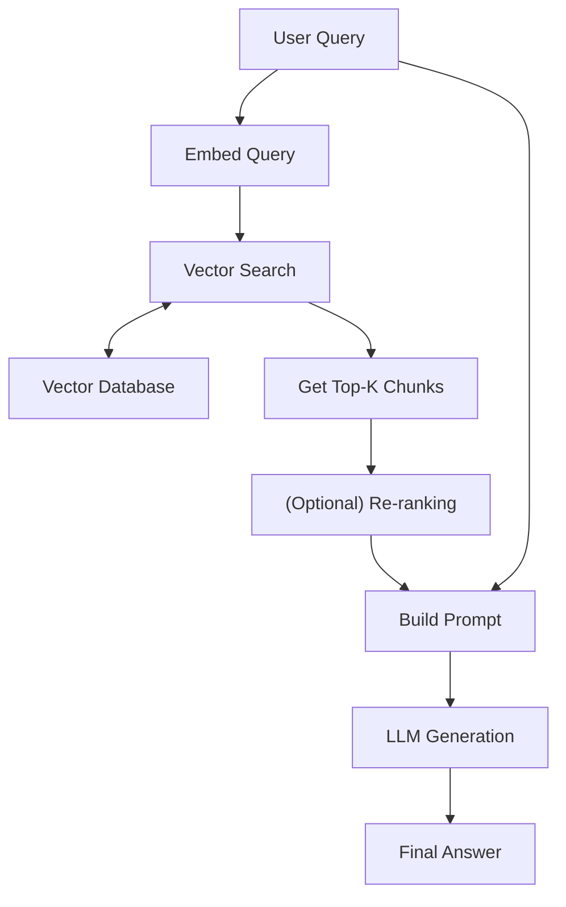
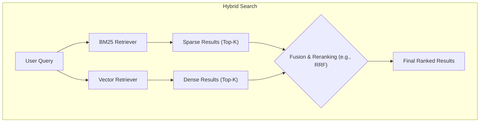
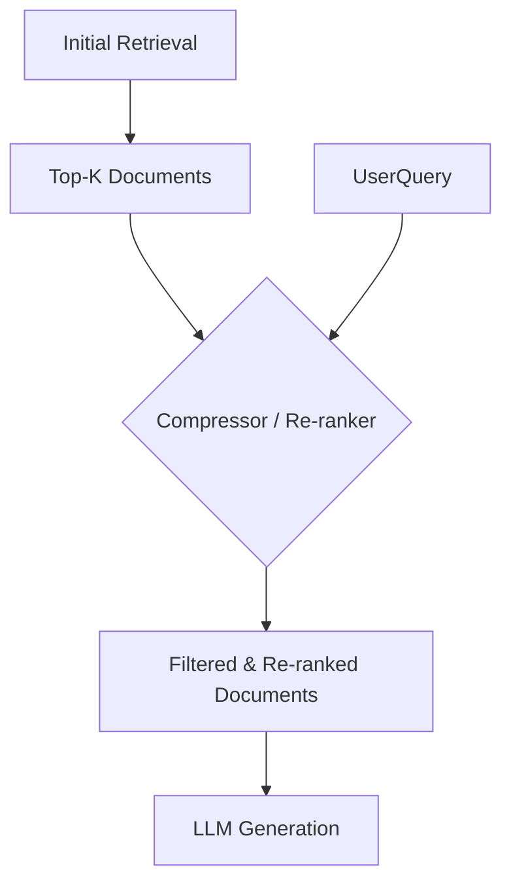
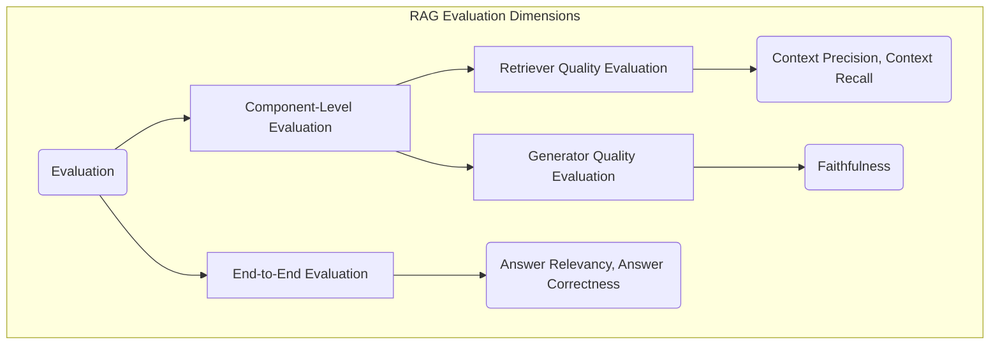

## 1. Macro Overview: Why RAG?

### 1.1 What is RAG?

RAG, or Retrieval-Augmented Generation, is a technical framework that combines information retrieval from external knowledge bases with the powerful generative capabilities of large language models (LLMs). In simple terms, when a user asks a question, a RAG system first retrieves the most relevant information snippets from a vast, updatable knowledge base (such as company internal documents, product manuals, or the latest web information), and then "feeds" this information along with the original question to the language model, enabling it to generate answers based on precise, up-to-date context.

To use an analogy: Imagine a student taking an open-book exam. This student (the LLM) has already learned a lot of knowledge (pre-training data), but when answering very specific questions or those involving the latest information, they can refer to reference books (external knowledge base). RAG is this "open-book" process, allowing the LLM to consult the most recent and authoritative materials when answering questions, thus providing more accurate and comprehensive answers.

### 1.2 RAG's Core Value: Solving LLM's Inherent Limitations

Despite their power, large language models have several inherent limitations that RAG technology specifically addresses.

**Limitation 1: Knowledge Cut-off**

An LLM's knowledge is frozen at the time of its last training. For example, a model completed in early 2023 cannot answer questions about events that occurred after that point. RAG completely solves this problem by introducing an external knowledge base that can be updated at any time. Companies can update their knowledge bases with the latest product information, financial reports, market dynamics, etc., and the RAG system can immediately leverage this new knowledge to answer questions.

**Limitation 2: Hallucination**

When LLMs encounter questions outside their knowledge domain or with uncertain answers, they sometimes "confidently make things up," fabricating facts and producing what are known as "hallucinations." RAG greatly constrains model output by providing clear, fact-based reference materials. The model is required to answer based on the retrieved context, which effectively defines the scope of its response, significantly reducing the probability of hallucinations.

**Limitation 3: Lack of Domain-Specific Knowledge**

General-purpose LLMs often perform poorly when handling specialized questions in specific industries or enterprises. For example, they don't understand a company's internal processes or the technical specifications of particular products. Through RAG, enterprises can build a specialized knowledge base containing internal regulations, technical documentation, customer support records, and more. This equips the LLM with domain expert knowledge, enabling it to handle highly specialized Q&A tasks.

**Limitation 4: Lack of Transparency & Interpretability**

The answer generation process of traditional LLMs is a "black box" - we cannot know what information they based their conclusions on. This is fatal in fields requiring high credibility, such as finance, healthcare, and law. The RAG architecture naturally enhances transparency because the system can clearly show "I derived this answer based on these documents (Source 1, Source 2...)". Users can trace and verify the sources of information, greatly enhancing trust in the answers.
### 1.3 RAG's Macro Workflow

At the highest level, RAG's workflow can be depicted as a simple yet elegant architecture.



This workflow can be interpreted as:
1.  **Retrieve**: After receiving a user's question, the system first converts it into a format suitable for searching (such as a vector), then quickly matches and retrieves the most relevant information snippets from the knowledge base.
2.  **Augment**: The system integrates the retrieved information snippets with the user's original question into a richer "prompt."
3.  **Generate**: This enhanced prompt is sent to the LLM, guiding it to generate a content-rich and accurate answer based on the provided context, along with sources of information.

Through this process, RAG successfully transforms the LLM from a "closed-world scholar" into an "open-world, verifiable expert."

## 2. RAG Core Architecture: Dual Process Analysis

The lifecycle of a RAG system can be clearly divided into two core processes:

1.  **Offline Process: Indexing**: This is a preprocessing stage responsible for transforming raw data sources into a knowledge base ready for quick retrieval. This process typically runs in the background and is triggered whenever the knowledge base content needs updating.
2.  **Online Process: Retrieval & Generation**: This is the real-time process of user interaction with the system, responsible for retrieving information from the index based on user input and generating answers.

Below, we'll analyze these two processes through detailed diagrams and explanations.

### 2.1 Offline Process: Indexing

The goal of this process is to transform unstructured or semi-structured raw data into structured, easily queryable indices.



**Process Details:**

1.  **Load**: The system first needs to load original documents from various specified data sources. These sources can be diverse, such as PDF files, Markdown documents, web pages, Notion pages, database records, etc. Modern RAG frameworks (like LlamaIndex, LangChain) provide rich data loader ecosystems to simplify this process.
2.  **Split/Chunk**: Due to the limited context window of language models, directly embedding a long document (like a PDF with hundreds of pages) as a single vector performs poorly and loses many details. Therefore, it's essential to split long texts into smaller, semantically complete chunks. The chunking strategy is crucial and directly affects retrieval precision.
3.  **Embed**: This is the core step of transforming textual information into machine-understandable mathematical representations. The system uses a pre-trained embedding model to map each text chunk to a high-dimensional vector. This vector captures the semantic information of the text, with semantically similar text chunks being closer to each other in the vector space.
4.  **Store/Index**: Finally, the system stores the vector representations of all text chunks along with their metadata (such as source document, chapter, page number, etc.) in a specialized database, typically a vector database. Vector databases are specially optimized to support efficient similarity searches across massive-scale vector data.

### 2.2 Online Process: Retrieval & Generation

This process is triggered when a user submits a query, with the goal of generating precise, evidence-based answers in real-time.



**Process Details:**

1.  **Embed Query**: When a user inputs a question, the system uses the **same embedding model** as in the indexing phase to convert this question into a query vector.
2.  **Vector Search**: The system takes this query vector and performs a similarity search in the vector database. The most common algorithm is "K-Nearest Neighbors" (KNN), aiming to find the K text chunk vectors closest to the query vector in the vector space.
3.  **Get Top-K Chunks**: Based on the search results, the system retrieves the original content of these K most relevant text chunks from the database. These K text chunks form the core context for answering the question.
4.  **Re-ranking (Optional)**: In some advanced RAG systems, there's an additional re-ranking step. This is because high vector similarity doesn't always equate to high relevance to the question. A re-ranker is a lighter-weight model that re-examines the relevance of these Top-K text chunks to the original question and reorders them, selecting the highest quality ones as the final context.
5.  **Build Prompt**: The system combines the original question and the filtered context information according to a predefined template into a complete prompt. This prompt typically includes instructions like: "Please answer this question based on the following context information. Question: [...] Context: [...]".
6.  **LLM Generation**: Finally, this enhanced prompt is sent to the large language model (LLM). The LLM, following the instructions, comprehensively utilizes its internal knowledge and the provided context to generate a fluent, accurate, and information-rich answer. The system can also cite the sources of the context, enhancing the credibility of the answer.

## 3. Indexing Deep Dive

Indexing is the cornerstone of RAG systems. The quality of this process directly determines the effectiveness of subsequent retrieval and generation phases. A well-designed indexing process ensures that information in the knowledge base is accurately and completely transformed into retrievable units. Let's explore each component in depth.

### 3.1 Data Loading

The first step is to load raw data from various sources into the processing pipeline.

*   **Loaders**: Modern RAG frameworks provide powerful loader ecosystems. For example, LangChain's `Document Loaders` support loading data from over 100 different sources, including:
    *   **Files**: `TextLoader` (plain text), `PyPDFLoader` (PDF), `JSONLoader`, `CSVLoader`, `UnstructuredFileLoader` (capable of processing Word, PowerPoint, HTML, XML, and other formats).
    *   **Web Content**: `WebBaseLoader` (web scraping), `YoutubeLoader` (loading YouTube video captions).
    *   **Collaboration Platforms**: `NotionDirectoryLoader`, `ConfluenceLoader`.
    *   **Databases**: `AzureCosmosDBLoader`, `PostgresLoader`.

Choosing the right loader allows enterprises to easily integrate their existing knowledge assets into RAG systems without complex data format conversions.
### 3.2 Text Splitting / Chunking

**Why is chunking necessary?**
Directly vectorizing an entire document (like a PDF with hundreds of pages) is impractical for three reasons:
1.  **Context Length Limitations**: Most embedding models and LLMs have token input limits.
2.  **Noise Issues**: A single vector representing a lengthy document contains too many topics and details, diluting the semantic information and making it difficult to precisely match specific user questions during retrieval.
3.  **Retrieval Cost**: Feeding an entire document as context to an LLM consumes substantial computational resources and costs.

Therefore, splitting documents into semantically related chunks is a crucial step. **The quality of chunks determines the ceiling of RAG performance.**

#### 3.2.1 Core Parameters: `chunk_size` and `chunk_overlap`

*   `chunk_size`: Defines the size of each text block, typically calculated in character count or token count. Choosing this value requires balancing "information density" and "context completeness." Too small may fragment complete semantics; too large may introduce excessive noise.
*   `chunk_overlap`: Defines the number of characters (or tokens) that overlap between adjacent text blocks. Setting overlap can effectively prevent cutting off a complete sentence or paragraph at block boundaries, ensuring semantic continuity.

#### 3.2.2 Mainstream Chunking Strategies

The choice of chunking strategy depends on the structure and content of the document.

**Strategy 1: Character Splitting**

*   **Representative**: `CharacterTextSplitter`
*   **Principle**: This is the simplest direct method. It splits text based on a fixed character (like `\n\n` newline) and then forcibly chunks according to the preset `chunk_size`.
*   **Advantages**: Simple, fast, low computational cost.
*   **Disadvantages**: Completely ignores the semantics and logical structure of the text, easily breaking sentences in the middle or abruptly cutting off complete concept descriptions.
*   **Applicable Scenarios**: Suitable for texts with no obvious structure or where semantic coherence is not a high requirement.

```python
# Example: CharacterTextSplitter
from langchain_text_splitters import CharacterTextSplitter
text_splitter = CharacterTextSplitter(
    separator="\n\n",
    chunk_size=1000,
    chunk_overlap=200,
    length_function=len,
)
```

**Strategy 2: Recursive Character Splitting**

*   **Representative**: `RecursiveCharacterTextSplitter`
*   **Principle**: This is currently the most commonly used and recommended strategy. It attempts to split recursively according to a set of preset separators (like `["\n\n", "\n", " ", ""]`). It first tries to split using the first separator (`\n\n`, paragraph); if the resulting blocks are still larger than `chunk_size`, it continues using the next separator (`\n`, line) to split these large blocks, and so on until the block size meets requirements.
*   **Advantages**: Makes the greatest effort to maintain the integrity of paragraphs, sentences, and other semantic units, striking a good balance between universality and effectiveness.
*   **Disadvantages**: Still based on character rules rather than true semantic understanding.
*   **Applicable Scenarios**: The preferred strategy for the vast majority of scenarios.

```python
# Example: RecursiveCharacterTextSplitter
from langchain_text_splitters import RecursiveCharacterTextSplitter
text_splitter = RecursiveCharacterTextSplitter(
    chunk_size=1000,
    chunk_overlap=200,
)
```

**Strategy 3: Token-Based Splitting**

*   **Representative**: `TokenTextSplitter`, `CharacterTextSplitter.from_tiktoken_encoder`
*   **Principle**: It calculates `chunk_size` by token count rather than character count. This is more consistent with how language models process text and allows for more precise control over the length of content input to the model.
*   **Advantages**: More precise control over cost and input length for model API calls.
*   **Disadvantages**: Computation is slightly more complex than character splitting.
*   **Applicable Scenarios**: When strict control over costs and API call input lengths is needed.

**Strategy 4: Semantic Chunking**

*   **Principle**: This is a more advanced experimental method. Instead of being based on fixed rules, it's based on understanding the semantics of the text. The splitter calculates embedding similarity between sentences and splits when it detects that the semantic difference between adjacent sentences exceeds a threshold.
*   **Advantages**: Can generate highly semantically consistent text blocks, theoretically the best splitting method.
*   **Disadvantages**: Very high computational cost, as it requires multiple embedding calculations during the splitting phase.
*   **Applicable Scenarios**: Scenarios requiring extremely high retrieval quality, regardless of computational cost.

### 3.3 Embedding

Embedding is the process of transforming text chunks into high-dimensional numerical vectors, which serve as mathematical representations of the text's semantics.

#### 3.3.1 Embedding Model Selection

The choice of embedding model directly affects retrieval quality and system cost.

*   **Closed-Source Commercial Models (e.g., OpenAI)**:
    *   **Representatives**: `text-embedding-ada-002`, `text-embedding-3-small`, `text-embedding-3-large`
    *   **Advantages**: Powerful performance, typically ranking high in various evaluation benchmarks, simple to use (API calls).
    *   **Disadvantages**: Requires payment, data must be sent to third-party servers, privacy risks exist.

```python
# Example: Using OpenAI Embeddings
from langchain_openai import OpenAIEmbeddings
embeddings_model = OpenAIEmbeddings(model="text-embedding-3-small")
```

*   **Open-Source Models (e.g., Hugging Face)**:
    *   **Representatives**: `sentence-transformers/all-mpnet-base-v2` (English general), `bge-large-zh-v1.5` (Chinese), `m3e-large` (Chinese-English) etc.
    *   **Advantages**: Free, can be deployed locally, no data privacy leakage risk, numerous fine-tuned models available for specific languages or domains.
    *   **Disadvantages**: Requires self-management of model deployment and computational resources, performance may have some gap compared to top commercial models.
    *   **MTEB Leaderboard**: The Massive Text Embedding Benchmark (MTEB) is a public leaderboard for evaluating and comparing the performance of different embedding models, an important reference for selecting open-source models.

```python
# Example: Using open-source models from Hugging Face
from langchain_huggingface import HuggingFaceEmbeddings
model_name = "sentence-transformers/all-mpnet-base-v2"
embeddings_model = HuggingFaceEmbeddings(model_name=model_name)
```

**Core Principle**: Throughout the entire RAG process, **the same embedding model must be used in both the indexing phase and the online retrieval phase**. Otherwise, the query vectors and document vectors will exist in different vector spaces, making meaningful similarity comparisons impossible.

## 4. Retrieval Technology Deep Dive

Retrieval is the "heart" of RAG systems. Finding the most relevant contextual information is the prerequisite for generating high-quality answers. If the retrieved content is irrelevant or inaccurate, even the most powerful LLM will be ineffective - this is the so-called "Garbage In, Garbage Out" principle.

Retrieval technology has evolved from traditional keyword matching to modern semantic vector search, and has now developed various advanced strategies to address complex challenges in different scenarios.

### 4.1 Traditional Foundation: Sparse Retrieval

Sparse retrieval is a classic information retrieval method based on word frequency statistics, independent of deep learning models. Its core idea is that the more times a word appears in a specific document and the fewer times it appears across all documents, the more representative that word is for that document.

*   **Representative Algorithms**: **TF-IDF** & **BM25 (Best Match 25)**
*   **Principle Brief (using BM25 as an example)**:
    1.  **Term Frequency (TF)**: Calculate the frequency of each query term in the document.
    2.  **Inverse Document Frequency (IDF)**: Measure the "rarity" of a term. Rarer terms have higher weights.
    3.  **Document Length Penalty**: Penalize overly long documents to prevent them from getting artificially high scores just because they contain more words.
*   **Advantages**:
    *   **Precise Keyword Matching**: Performs excellently for queries containing specific terms, abbreviations, or product models (like "iPhone 15 Pro").
    *   **Strong Interpretability**: Score calculation logic is clear, easy to understand and debug.
    *   **Fast Computation**: No complex model inference required.
*   **Disadvantages**:
    *   **Cannot Understand Semantics**: Unable to handle synonyms, near-synonyms, or conceptual relevance. For example, searching for "Apple phone" won't match documents containing "iPhone".
    *   **"Vocabulary Gap" Problem**: Relies on literal matching between queries and documents.
*   **Applicable Scenarios**: As part of hybrid retrieval, handling keyword and proper noun matching.

### 4.2 Modern Core: Dense Retrieval / Vector Search

Dense retrieval is the mainstream technology in current RAG systems. It uses deep learning models (the embedding models we discussed earlier) to encode the semantic information of text into dense vectors, enabling retrieval based on "semantic similarity" rather than "literal similarity".

*   **Core Idea**: Semantically similar texts have vectors that are close to each other in multidimensional space.
*   **Workflow**:
    1.  Offline: Vectorize all document chunks and store them in a vector database.
    2.  Online: Vectorize the user query.
    3.  In the vector database, calculate the distance/similarity between the query vector and all document vectors (such as cosine similarity, Euclidean distance).
    4.  Return the Top-K document chunks with the closest distances.

#### 4.2.1 Approximate Nearest Neighbor (ANN) Search

Since performing exact "nearest neighbor" searches among millions or even billions of vectors is extremely computationally expensive, the industry widely adopts **Approximate Nearest Neighbor (ANN)** algorithms. ANN sacrifices minimal precision in exchange for query speed improvements of several orders of magnitude.

*   **Mainstream ANN Algorithm**: **HNSW (Hierarchical Navigable Small World)**
*   **HNSW Principle Brief**: It constructs a hierarchical graph structure. In the higher-level graph, it performs rough, large-step searches to quickly locate the target area; then in the lower-level graph, it performs fine, small-step searches to finally find the nearest neighbor vectors. This is like finding an address in a city - first determining which district (higher level), then which street (lower level).

*   **Advantages**:
    *   **Powerful Semantic Understanding**: Can cross literal barriers to understand concepts and intentions.
    *   **High Recall Rate**: Can retrieve more semantically relevant documents with different wording.
*   **Disadvantages**:
    *   **Keyword Insensitivity**: Sometimes less effective than sparse retrieval for matching specific keywords or proper nouns.
    *   **Strong Dependence on Embedding Models**: Effectiveness completely depends on the quality of the embedding model.
    *   **"Black Box" Problem**: The process of generating and matching vectors is less intuitive than sparse retrieval.

### 4.3 Powerful Combination: Hybrid Search

Since sparse retrieval and dense retrieval each have their own strengths and weaknesses, the most natural idea is to combine them to leverage their respective advantages. Hybrid search was born for this purpose.

*   **Implementation Method**:
    1.  **Parallel Execution**: Simultaneously process user queries using sparse retrieval (like BM25) and dense retrieval (vector search).
    2.  **Score Fusion**: Obtain two sets of results and their corresponding scores.
    3.  **Result Re-ranking**: Use a fusion algorithm (such as **Reciprocal Rank Fusion, RRF**) to merge the two sets of results and re-rank them based on the fused scores to get the final Top-K results. The RRF algorithm gives higher weight to documents that rank high in different retrieval methods.



*   **Advantages**: Balances the precision of keyword matching and the breadth of semantic understanding, achieving better results than single retrieval methods in most scenarios.
*   **Applicable Scenarios**: Almost all RAG applications requiring high-quality retrieval.

### 4.4 Frontier Exploration: Advanced Retrieval Strategies

To address more complex query intentions and data structures, academia and industry have developed a series of advanced retrieval strategies.

#### 4.4.1 Contextual Compression & Re-ranking

**Problem**: The Top-K document chunks returned by vector search may only partially contain content truly relevant to the question, and some high-ranking blocks might actually be "false positives." Directly feeding this redundant or irrelevant information to the LLM increases noise and cost.

**Solution**: Add an intermediate "filtering" and "sorting" layer between retrieval and generation.



*   **Implementation Method**: Using LangChain's `ContextualCompressionRetriever`.
    *   **`LLMChainExtractor`**: Uses an LLM to judge whether each document chunk is relevant to the query and only extracts relevant sentences.
    *   **`EmbeddingsFilter`**: Recalculates the similarity between query vectors and document chunk vectors, filtering out documents below a certain threshold.
    *   **Re-ranker**: This is currently the most effective and commonly used approach. It uses a lighter-weight **cross-encoder** model specifically trained to calculate relevance scores. Unlike the bi-encoder used in the retrieval phase (which encodes queries and documents separately), a cross-encoder receives both the query and document chunk as input simultaneously, enabling more fine-grained relevance judgment. Common re-rankers include `Cohere Rerank`, `BAAI/bge-reranker-*`, and models provided by open-source or cloud service vendors.

#### 4.4.2 Self-Querying Retriever

**Problem**: User queries are typically in natural language but may contain filtering requirements for **metadata**. For example: "Recommend some science fiction movies released after 2000 with ratings above 8.5?"

**Solution**: Let the LLM itself "translate" natural language queries into structured query statements containing metadata filtering conditions.

*   **Workflow**:
    1.  User inputs a natural language query.
    2.  `SelfQueryingRetriever` sends the query to the LLM.
    3.  Based on predefined metadata field information (such as `year`, `rating`, `genre`), the LLM generates a structured query containing:
        *   `query`: The keyword part for vector search ("science fiction movies").
        *   `filter`: Conditions for metadata filtering (`year > 2000 AND rating > 8.5`).
    4.  The retriever uses this structured query to perform a "filter first, then search" operation on the vector database, greatly narrowing the search scope and improving precision.

```python
# Core settings for Self-Querying in LangChain
metadata_field_info = [
    AttributeInfo(name="genre", ...),
    AttributeInfo(name="year", ...),
    AttributeInfo(name="rating", ...),
]
retriever = SelfQueryRetriever.from_llm(
    llm,
    vectorstore,
    document_content_description,
    metadata_field_info,
)
```

#### 4.4.3 Multi-Vector Retriever

**Problem**: A single vector struggles to perfectly summarize a longer document chunk, especially when the chunk contains multiple subtopics.

**Solution**: Generate **multiple** vectors representing different aspects for each document chunk, rather than a single vector.

*   **Implementation Methods**:
    1.  **Smaller Sub-chunks**: Further split the original document chunk into smaller sentences or paragraphs, and generate vectors for these small chunks.
    2.  **Summary Vectors**: Use an LLM to generate a summary for each document chunk, then vectorize the summary.
    3.  **Hypothetical Question Vectors**: Use an LLM to pose several possible questions about each document chunk, then vectorize these questions.

During querying, the query vector matches with all these sub-vectors (sub-chunks, summaries, questions). Once a match is successful, what's returned is the **complete original document chunk** it belongs to. This leverages both the precision of fine-grained matching and ensures that the context provided to the final LLM is complete.

#### 4.4.4 Parent Document Retriever

This is a common implementation of the multi-vector retriever. It splits documents into "parent chunks" and "child chunks." Indexing and retrieval happen on the smaller "child chunks," but what's ultimately returned to the LLM is the larger "parent chunk" that the child belongs to. This solves the "context loss" problem, ensuring that the LLM sees a more complete linguistic context when generating answers.

#### 4.4.5 Graph RAG

**Problem**: Traditional RAG views knowledge as independent text blocks, ignoring the complex, web-like relationships between knowledge points.

**Solution**: Build the knowledge base into a **Knowledge Graph**, where entities are nodes and relationships are edges.

*   **Workflow**:
    1.  During querying, the system first identifies the core entities in the query.
    2.  It then explores neighboring nodes and relationships related to these entities in the graph, forming a subgraph containing rich structured information.
    3.  This subgraph information is linearized (converted to text) and provided to the LLM as context.
*   **Advantages**: Can answer more complex questions requiring multi-hop reasoning (e.g., "Who is A's boss's wife?"), providing deeper context than "text blocks."

*   **Implementation Case: Graphiti/Zep**:
    *   **Introduction**: [Graphiti](https://github.com/getzep/graphiti) is a temporal knowledge graph architecture designed specifically for LLM Agents, seamlessly integrating Neo4j's graph database capabilities with LLM's natural language processing abilities.
    *   **Core Features**:
        *   **Temporal Awareness**: Each node and relationship carries timestamp attributes, enabling tracking of how entity states change over time.
        *   **Automatic Schema Inference**: No need to predefine entity types and relationships; the system can automatically infer appropriate graph structures from conversations.
        *   **Multi-hop Reasoning**: Supports complex relationship path queries, capable of discovering indirectly associated information.
    *   **Application Scenarios**: Particularly suitable for multi-turn dialogue systems requiring long-term memory and temporal reasoning, such as customer support, personal assistants, and other scenarios needing to "remember" user historical interactions.
#### 4.4.6 Agentic RAG / Adaptive RAG

This is the latest evolutionary direction of RAG, endowing RAG systems with certain "thinking" and "decision-making" capabilities, allowing them to adaptively select the best retrieval strategy based on the complexity of the question.

*   **Core Idea**: Transform the traditional linear RAG process into a dynamic process driven by an LLM Agent that can loop and iterate.
*   **Possible Workflow**:
    1.  **Question Analysis**: The Agent first analyzes the user's question. Is this a simple question or a complex one? Does it need keyword matching or semantic search?
    2.  **Strategy Selection**:
        *   If the question is simple, directly perform vector search.
        *   If the question contains metadata, switch to Self-Querying.
        *   If the question is ambiguous, the Agent might first rewrite the question (Query Rewriting), generating several different query variants and executing them separately.
    3.  **Result Reflection & Iteration**: The Agent examines the preliminary retrieved results. If the results are not ideal (e.g., low relevance or conflicting information), it can decide to:
        *   **Query Again**: Use different keywords or strategies to retrieve again.
        *   **Web Search**: If the internal knowledge base doesn't have an answer, it can call search engine tools to find information online.
        *   **Multi-step Reasoning**: Break down complex questions into several sub-questions, retrieving and answering step by step.

Agentic RAG is no longer a fixed pipeline but a flexible, intelligent framework, representing the future direction of RAG development.

## 5. Generation Phase: The Final Touch

The generation phase is the endpoint of the RAG process and the ultimate manifestation of its value. In this phase, the system combines the "essence" context obtained from previous retrieval, filtering, and re-ranking with the user's original question to form a final prompt, which is then sent to the large language model (LLM) to generate an answer.

### 5.1 Core Task: Effective Prompt Engineering

The core task of this phase is **Prompt Engineering**. A well-designed prompt template can clearly instruct the LLM on its task, ensuring it thinks and answers along the right track.

A typical RAG prompt template structure is as follows:

```text
You are a professional, rigorous Q&A assistant. Please answer the user's question based on the context information provided below.
Your answer must be completely based on the given context, and you are prohibited from using your internal knowledge for any supplementation or imagination.
If there is not enough information in the context to answer the question, please clearly state "Based on the available information, I cannot answer this question."
At the end of your answer, please list all the context source IDs you referenced.

---
[Context Information]

{context}

---
[User Question]

{question}

---
[Your Answer]
```

#### 5.1.1 Template Key Elements Analysis

*   **Persona**: "You are a professional, rigorous Q&A assistant." This helps set the tone and style of the LLM's output.
*   **Core Instruction**: "Please answer the user's question based on the context information provided below." This is the most critical task instruction.
*   **Constraints & Guardrails**:
    *   "Must be completely based on the given context, prohibited from... supplementation or imagination." -> This is key to suppressing model hallucinations.
    *   "If there is not enough information, please clearly state..." -> This defines the model's "escape route" when information is insufficient, preventing it from guessing.
*   **Attribution/Citation**: "Please list all the context source IDs you referenced." -> This is the foundation for answer explainability and credibility.
*   **Placeholders**:
    *   `{context}`: This will be filled with the content of multiple document chunks (chunks) obtained from the retrieval phase, after processing.
    *   `{question}`: This will be filled with the user's original question.

### 5.2 Context and Question Fusion

When the system fills multiple document chunks (e.g., Top-5 chunks) into the `{context}` placeholder, these chunks are packaged together with the original question and sent to the LLM. The LLM reads the entire enhanced prompt and then:

1.  **Understands the Question**: Clarifies the user's query intent.
2.  **Locates Information**: Searches for sentences and paragraphs directly related to the question within the provided multiple context blocks.
3.  **Synthesizes & Refines**: Integrates, understands, and refines scattered information points found from different context blocks.
4.  **Generates an Answer**: Based on the refined information, generates a final answer using fluent, coherent natural language.
5.  **Cites Sources**: According to instructions, includes the document sources that the answer is based on.

Through this carefully designed "open-book exam" process, the RAG system ultimately generates a high-quality answer that combines both the LLM's powerful language capabilities and fact-based information.

## 6. RAG Evaluation Framework: How to Measure System Quality?

Building a RAG system is just the first step. Scientifically and quantitatively evaluating its performance, and continuously iterating and optimizing based on this evaluation, is equally important. A good evaluation framework can help us diagnose whether the system's bottleneck is in the retrieval module ("not found") or in the generation module ("not well expressed").

Industry-leading RAG evaluation frameworks, such as **RAGAS (RAG Assessment)** and **TruLens**, provide a series of metrics to score RAG system performance from different dimensions.

### 6.1 Core Evaluation Dimensions

RAG evaluation can be divided into two levels: **component level** (evaluating retrieval and generation separately) and **end-to-end level** (evaluating the quality of the final answer).



### 6.2 Key Evaluation Metrics (Using RAGAS as an Example)

Below we explain in detail several core metrics in the RAGAS framework. These metrics do not require manually annotated reference answers (Reference-Free), greatly reducing evaluation costs.

#### 6.2.1 Evaluating Generation Quality

**Metric 1: Faithfulness**

*   **Definition**: Measures the extent to which the generated answer is completely based on the provided context. High faithfulness means that every statement in the answer can find evidence in the context.
*   **Evaluation Method**: RAGAS uses an LLM to analyze the answer, breaking it down into a series of statements. Then, for each statement, it verifies in the context whether there is evidence supporting that statement. The final score is (number of statements supported by the context) / (total number of statements).
*   **Problem Diagnosed**: This metric is the **core indicator for measuring "model hallucination"**. A low score means the generator (LLM) is freely making up information that doesn't exist in the context.
*   **Data Required**: `question`, `answer`, `context`.

#### 6.2.2 Evaluating Both Retrieval and Generation Quality

**Metric 2: Answer Relevancy**

*   **Definition**: Measures the relevance of the generated answer to the user's original question. An answer faithful to the context might still be off-topic.
*   **Evaluation Method**: RAGAS uses an Embedding model to measure the semantic similarity between the question and answer. It also uses an LLM to identify "noise" or irrelevant sentences in the answer and penalizes them.
*   **Problem Diagnosed**: A low score means that although the answer may be based on the context, it doesn't directly or effectively answer the user's question, or it contains too much irrelevant information.
*   **Data Required**: `question`, `answer`.

#### 6.2.3 Evaluating Retrieval Quality

**Metric 3: Context Precision**

*   **Definition**: Measures how much of the retrieved context is truly relevant to the question - the "signal-to-noise ratio."
*   **Evaluation Method**: RAGAS analyzes the context sentence by sentence and has an LLM judge whether each sentence is necessary for answering the user's question. The final score is (number of sentences deemed useful) / (total number of sentences in the context).
*   **Problem Diagnosed**: A low score (high `1 - Context Precision` value) indicates that the retriever returned many irrelevant "noise" documents, which interferes with the generator's judgment and increases costs. This suggests that the **retrieval algorithm needs optimization**.
*   **Data Required**: `question`, `context`.

**Metric 4: Context Recall**

*   **Definition**: Measures whether the retrieved context contains all the necessary information to answer the question.
*   **Evaluation Method**: This metric requires a **manually annotated reference answer (Ground Truth)** as a benchmark. RAGAS has an LLM analyze this reference answer and judge whether each sentence in it can find support in the retrieved context.
*   **Problem Diagnosed**: A low score means the retriever **failed to find** key information needed to answer the question, indicating "missed retrievals." This might suggest that the document chunking strategy is unreasonable, or the Embedding model cannot understand the query well.
*   **Data Required**: `question`, `ground_truth` (reference answer), `context`.

### 6.3 Using Evaluation to Guide Iteration

By comprehensively evaluating a RAG system using the above metrics, we can get a clear performance profile and make targeted optimizations:

*   **Low Faithfulness Score**: The problem is in the **generator**. Need to optimize the Prompt, add stronger constraints, or switch to an LLM with stronger instruction-following capabilities.
*   **Low Answer Relevancy Score**: The problem could be in either the generator or retriever. Need to check if the Prompt is guiding the model off-topic, or if the retrieved content is of poor quality.
*   **Low Context Precision Score**: The problem is in the **retriever**. Indicates that the recalled documents are of poor quality with much noise. Can try better retrieval strategies, such as adding a Re-ranker to filter irrelevant documents.
*   **Low Context Recall Score**: The problem is in the **retriever**. Indicates that key information wasn't found. Need to check if the Chunking strategy is fragmenting key information, or try methods like Multi-Query to expand the retrieval scope.

Through the "evaluate-diagnose-optimize" closed loop, we can continuously improve the overall performance of the RAG system.

## 7. Challenges and Future Outlook

Although RAG has greatly expanded the capabilities of large language models and has become the de facto standard for building knowledge-intensive applications, it still faces some challenges while also pointing to exciting future development directions.

### 7.1 Current Challenges

1.  **"Needle-in-a-Haystack" Problem**: As LLM context windows grow larger (e.g., million-level tokens), precisely finding and utilizing key information in lengthy, noisy contexts becomes increasingly difficult. Research shows that LLM performance when processing long contexts is affected by the position of information within them, with issues like "middle neglect."
2.  **Imperfect Chunking**: How to optimally split documents remains an open question. Existing rule-based or simple semantic splitting methods may damage information integrity or introduce irrelevant context, affecting retrieval and generation quality.
3.  **Evaluation Complexity and Cost**: Although frameworks like RAGAS provide automated evaluation metrics, building a comprehensive, reliable evaluation set still requires significant human effort. Especially in domains requiring fine judgment, machine evaluation results may differ from human perception.
4.  **Integration of Structured and Multimodal Data**: Knowledge in the real world isn't just text. How to efficiently integrate tables, charts, images, audio, and other multimodal information, and enable RAG systems to understand and utilize them, is an actively explored area.
5.  **Production Environment Complexity**: Deploying a RAG prototype to a production environment requires considering data updates, permission management, version control, cost monitoring, low-latency responses, and a series of engineering challenges.

### 7.2 Future Outlook

1.  **Smarter Indexing**: Future indexing processes will no longer be simple "split-vectorize" operations. They will more deeply understand document structures, automatically build knowledge graphs, identify entities and relationships, generate multi-level, multi-perspective representations (such as summaries, questions), creating a richer, more queryable knowledge network.
2.  **Adaptive Retrieval**: As demonstrated by Agentic RAG, future RAG systems will have stronger autonomy. They can dynamically decide whether to perform simple vector searches or execute complex multi-step queries, or even call external tools (such as search engines, calculators, APIs) to obtain information based on the specific situation of the question. Retrieval will evolve from a fixed step to a flexible, agent-driven process.
3.  **LLM as Part of RAG**: As LLM capabilities strengthen, they will participate more deeply in every aspect of RAG. Not just in the generation phase, but also in indexing (generating metadata, summaries), querying (query rewriting, expansion), retrieval (as a re-ranker), and other phases, playing a core role.
4.  **End-to-End Optimization**: Future frameworks may allow end-to-end joint fine-tuning of various RAG components (Embedding models, LLM generators, etc.), making the entire system highly optimized for a specific task or domain, rather than simply piecing together individual components.
5.  **Native Multimodal RAG**: RAG will natively support understanding and retrieving content like images, audio, and video. Users can ask questions like "Find me that picture of 'a cat playing piano'" and the system can directly perform semantic retrieval in multimedia databases and return results.

In summary, RAG is evolving from a relatively fixed "retrieve-augment-generate" pipeline to a more dynamic, intelligent, adaptive knowledge processing framework. It will continue to serve as the key bridge connecting large language models with the vast external world, continuously unleashing AI's application potential across various industries in the foreseeable future.