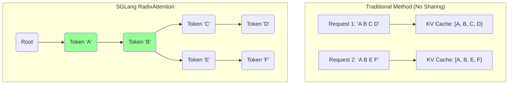
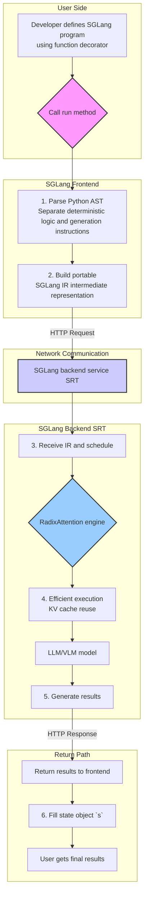
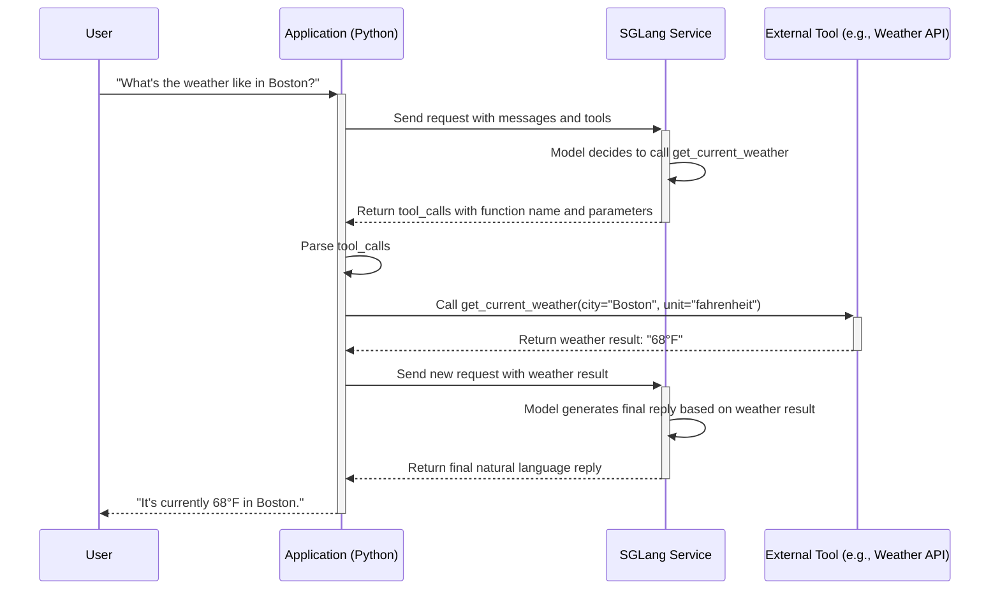

## 1. SGLang Introduction

SGLang (Structured Generation Language) is a high-performance service framework designed for large language models (LLMs) and vision language models (VLMs). Its core goal is to address the challenges faced by complex LLM programs in real-world applications, maximizing inference performance while maintaining flexibility.

Traditional LLM service frameworks (like vLLM) excel at handling simple, one-shot prompting but face limitations in complex scenarios requiring multi-turn interactions, structured outputs, function calls, or control flow. SGLang effectively bridges this gap by introducing a novel frontend language and an efficient backend runtime.

**Core advantages of SGLang include:**

*   **Exceptional Performance:** SGLang introduces **RadixAttention**, an innovative attention mechanism that automatically and losslessly reuses key-value caches (KV Cache), significantly improving inference speed in scenarios with complex prompts (like CoT, ReAct) or multi-turn conversations. Compared to leading frameworks like vLLM, SGLang can achieve several times higher throughput in these scenarios.
*   **Powerful Programming Capabilities:** SGLang provides an intuitive domain-specific language (DSL) that allows developers to orchestrate complex generation tasks in a Pythonic way. You can easily define variables, use loops and conditional statements, call external tools, and seamlessly integrate these logic elements with the LLM's generation process. This makes building complex AI agents, multi-turn dialogue systems, and structured data extraction tasks unprecedentedly simple.
*   **Unified Frontend-Backend Interface:** SGLang decouples frontend programming logic from backend inference services. The frontend defines "what to generate," while the backend handles "how to efficiently generate it." This design not only simplifies the development process but also makes SGLang compatible with OpenAI's API standards, allowing users to easily migrate existing applications to SGLang and immediately benefit from performance gains.
*   **Flexible Structured Output:** SGLang provides powerful structured output constraint capabilities. Whether through regular expressions, EBNF grammar, or JSON Schema, you can precisely control the output format of the LLM, ensuring that the generated content conforms to the expected structure, which is crucial for applications requiring reliable data formats.

In summary, SGLang is not just an LLM inference acceleration engine but a complete programming and execution framework for complex generation tasks. It aims to enable developers to fully unleash the potential of large language models in an efficient and intuitive way.

## 2. Core Features

The power of SGLang lies in its unique design, which combines an intuitive frontend programming model with an efficient backend execution engine. Below are detailed introductions to several of its core features.

### 2.1 RadixAttention: KV Cache Optimization for Complex Prompts

When processing complex LLM programs, such as Chain-of-Thought, multi-turn dialogues, or agents that need to call tools, prompts often contain large shared prefixes. Traditional attention mechanisms produce redundant computation and storage when handling these shared prefixes.

SGLang introduces **RadixAttention**, a novel KV cache optimization technique. Its core idea is to organize prompts into a radix tree and perform attention calculations on this tree.

*   **Automatic Sharing and Reuse**: RadixAttention can automatically identify and share common prefixes between different requests, avoiding duplicate computation and storage. For example, in multi-turn dialogues, the conversation history of each turn can be losslessly reused by subsequent turns.
*   **Performance Improvement**: By maximizing KV cache reuse, RadixAttention significantly reduces memory usage and computational load, increasing throughput by 2 to 5 times, especially when handling long prompts or high-concurrency requests.

Below is a Mermaid diagram that visually demonstrates how RadixAttention handles requests with shared prefixes:


In the diagram above, for two requests `'A B C D'` and `'A B E F'`, the traditional method creates two independent KV caches. RadixAttention, however, organizes them into a tree, sharing the computation and storage of the common prefix `'A B'` (green nodes), creating new branches only for the different parts (C, D, E, F). This greatly improves memory and computational efficiency.

### 2.2 Unified Frontend Programming Language (DSL)

SGLang provides an expressive domain-specific language (DSL) deeply integrated with Python, allowing developers to build complex generation logic in a natural and intuitive way.
### SGLang Architecture Overview

To better understand how SGLang works, we can observe its core architecture through the following flowchart:



This diagram clearly shows how SGLang decouples and combines the programming convenience of the frontend with the high-performance execution engine of the backend.

*   **Pythonic Control Flow**: You can directly use standard Python control flow statements like `if/else` and `for` loops in SGLang functions to dynamically build prompts.
*   **Integration of Generation and Logic**: Through the `@function` decorator and `gen()` instruction, SGLang seamlessly combines the LLM's generation process (the "non-deterministic" part) with the program's deterministic logic.

**Example: Generating Different Content Based on Conditions**

```python
from sglang import function, system, user, assistant, gen

@function
def tool_use(s, question):
    s += system("You are a helpful assistant.")
    s += user(question)
    s += assistant(
        "To answer this question, I need to use a "
        + gen("tool", choices=["calculator", "search engine"])
        + ". "
    )

    if s["tool"] == "calculator":
        s += assistant("The math expression is: " + gen("expression"))
    elif s["tool"] == "search engine":
        s += assistant("The key word to search is: " + gen("word"))

state = tool_use.run("What is the population of London?")
print(state["tool"])
# Output: search engine
print(state["word"])
# Output: population of London
```

In this example, the program first asks the LLM to choose between "calculator" and "search engine" as a tool, then executes different logic branches based on the LLM's choice, guiding the LLM to generate the next step of content.

### 2.3 Powerful Structured Output

To ensure that content generated by the LLM can be reliably parsed and used by downstream programs, SGLang provides multiple powerful structured output constraint mechanisms.

*   **Regular Expressions (Regex)**: You can provide a regular expression to force the model's output to strictly match that pattern. This is useful for generating identifiers, numbers, or simple text fragments in specific formats.

    ```python
    response = client.chat.completions.create(
        model="deepseek-ai/DeepSeek-R1-Distill-Qwen-7B",
        messages=[{"role": "assistant", "content": "What is the capital of France?"}],
        extra_body={"regex": "(Paris|London)"},
    )
    # response.choices[0].message.content will necessarily be "Paris" or "London"
    ```

*   **EBNF Grammar**: For more complex grammatical structures, you can use Extended Backus-Naur Form (EBNF) to define a complete grammar. This allows you to generate code, DSLs, or other structured text that strictly adheres to specific syntax.

    ```python
    ebnf_grammar = """
    root ::= city " is the capital of " country
    city ::= "London" | "Paris" | "Berlin" | "Rome"
    country ::= "England" | "France" | "Germany" | "Italy"
    """
    response = client.chat.completions.create(
        model="meta-llama/Meta-Llama-3.1-8B-Instruct",
        messages=[{"role": "user", "content": "Give me the information of the capital of France."}],
        extra_body={"ebnf": ebnf_grammar},
    )
    # response.choices[0].message.content will be "Paris is the capital of France"
    ```

*   **JSON Schema**: SGLang supports using JSON Schema to constrain the model to generate structured JSON objects. You can directly define a JSON Schema or use a Pydantic model to automatically generate one. This is crucial for APIs and data processing tasks that require reliable, verifiable JSON output.

    ```python
    from pydantic import BaseModel

    class CapitalInfo(BaseModel):
        name: str
        population: int

    response = client.chat.completions.create(
        model="deepseek-ai/DeepSeek-R1-Distill-Qwen-7B",
        messages=[{"role": "assistant", "content": "Give me the information and population of the capital of France in the JSON format."}],
        response_format={
            "type": "json_schema",
            "json_schema": {
                "name": "capital_info",
                "schema": CapitalInfo.model_json_schema(),
            },
        },
    )
    # response.choices[0].message.content will be a JSON string conforming to the CapitalInfo structure
    ```

## 3. Quick Start

This section will guide you through installing SGLang, starting the service, and basic usage, allowing you to experience SGLang's powerful features in just a few minutes.

### 3.1 Installation

SGLang can be installed via `pip` or the faster `uv`. For the best experience and full functionality, it's recommended to install the `all` version.

**Using pip:**
```bash
pip install --upgrade pip
pip install "sglang[all]"
```

**Using uv (recommended, faster):**
```bash
pip install uv
uv pip install "sglang[all]"
```

> **Note**: The installation process may require compiling CUDA kernels (such as `flashinfer`). Please ensure that the `CUDA_HOME` environment variable is correctly configured in your environment and that the CUDA version is compatible with your PyTorch version.

### 3.2 Starting the Backend Service (SRT)

After installation, the next step is to start SGLang's backend service (SRT, SGLang Runtime). This service will load the specified language model and provide an interface compatible with the OpenAI API.

Run the following command in your terminal:

```bash
python -m sglang.launch_server --model-path meta-llama/Meta-Llama-3.1-8B-Instruct --host 0.0.0.0 --port 30000
```

**Parameter Description:**

*   `--model-path`: Specifies the path to the model to load. This can be a model name on the Hugging Face Hub (as shown in this example) or a local model path.
*   `--host`: The host address the service listens on. `0.0.0.0` means allowing access from any network interface.
*   `--port`: The port number the service listens on.

When the service starts successfully, you'll see output similar to the following, indicating that the model has been loaded and is ready to receive requests.

```
INFO:     Uvicorn running on http://0.0.0.0:30000 (Press CTRL+C to quit)
INFO:     Started server process [12345]
INFO:     Waiting for application startup.
INFO:     Application startup complete.
```

### 3.3 Sending Your First Request

With the service running, we can now interact with it using OpenAI's Python client library.

Create a Python file named `test_sglang.py` and fill it with the following content:

```python
import openai

# Initialize the client, pointing to our locally started SGLang service
client = openai.Client(
    base_url="http://127.0.0.1:30000/v1",
    api_key="EMPTY"  # SGLang service doesn't require an API Key
)

# Create a chat completion request
response = client.chat.completions.create(
    model="meta-llama/Meta-Llama-3.1-8B-Instruct",  # Must match the model loaded by the service
    messages=[
        {"role": "system", "content": "You are a helpful assistant."},
        {"role": "user", "content": "What is the capital of France and why is it famous?"},
    ],
    temperature=0.7,
    max_tokens=150,
)

# Print the model's response
print(response.choices[0].message.content)
```

Run this script:

```bash
python test_sglang.py
```

You'll see the model's detailed answer about Paris. At this point, you've successfully completed the entire process from service deployment to inference request using SGLang!

## 4. Frontend Language (SGLang DSL)

SGLang's frontend language (DSL) is the core of its usability. It allows you to define complex generation processes in a declarative way, perfectly combining Python's flexibility with the generative capabilities of LLMs.

### 4.1 `@function` Decorator

All SGLang programs begin with a Python function decorated by `@function`. This decorator transforms an ordinary Python function into an executable SGLang program template.

*   **State Management**: The first parameter of the function (typically named `s`) represents the current generation state. It's a dictionary-like object used to store and pass all variables produced during the generation process.
*   **Delayed Execution**: Functions decorated with `@function` are not executed immediately when defined. Instead, they create a reusable template. The program only executes when the `.run()` or `.run_batch()` method is called.

**Interaction Flow**

The entire function call interaction flow can be represented by the following sequence diagram:



This sequence diagram clearly shows the complete loop from user question to model decision, tool call, result integration, and final response.

### 4.2 Core Instructions

Within SGLang functions, you use a series of instructions to build prompts and control the generation flow.

*   **Role Instructions**: `system()`, `user()`, `assistant()`
    These instructions are used to define different parts of a conversation, conforming to the standard multi-turn dialogue format. You can pass strings directly to them.
*   **Generation Instruction**: `gen()`
    This is the most important instruction in SGLang. It tells the LLM to generate text at the current position.
    *   `s += gen("variable_name", ...)`: The first parameter of `gen()` is required and specifies the variable name in which the generation result will be stored in the state `s`.
    *   `max_tokens`: Limits the maximum number of tokens to generate.
    *   `stop`: Defines one or more stop strings. When the model generates these strings, the generation process ends early.
    *   `choices`: Provides a list of strings, forcing the model to choose one of these options for generation.

**Example: A Complete Frontend Function**

```python
from sglang import function, system, user, assistant, gen, set_default_backend, OpenAI

# Set the backend to the OpenAI-compatible service provided by SGLang
set_default_backend(OpenAI("meta-llama/Meta-Llama-3.1-8B-Instruct"))

@function
def multi_turn_qa(s, question1, question2):
    s += system("You are a helpful assistant.")
    s += user(question1)
    s += assistant(gen("answer1", max_tokens=128))
    s += user(question2)
    s += assistant(gen("answer2", max_tokens=128))

# Execute the SGLang program
state = multi_turn_qa.run(
    question1="What is the capital of the UK?",
    question2="What is its population?",
    temperature=0.1
)

print("Answer 1:", state["answer1"])
print("Answer 2:", state["answer2"])
```

### 4.3 Streaming Output

For applications requiring real-time feedback, SGLang supports streaming output. Simply set `stream=True` in the `.run()` method and iterate over the `.text_iter()` method of the returned state object.

```python
state = multi_turn_qa.run(
    question1="Write a short story about a robot.",
    question2="Continue the story.",
    stream=True
)

for out in state.text_iter("answer2"):
    print(out, end="", flush=True)
```

## 5. Backend Service (SRT) and API Reference

SGLang's backend, the SGLang Runtime (SRT), is a high-performance inference server implemented in Python. It's responsible for loading models, managing KV caches (through RadixAttention), and handling requests from clients. SRT provides two main API endpoints.

### 5.1 Native API: `/generate`

This is a lower-level API that provides the finest control over the generation process.

*   **Endpoint**: `POST /generate`
*   **Description**: Generate text starting from a given text prompt.
*   **Core Parameters**:
    *   `text` (string, required): The input text prompt.
    *   `sampling_params` (object, optional): A JSON object containing sampling parameters.
        *   `temperature` (float): Sampling temperature.
        *   `max_new_tokens` (int): Maximum number of new tokens to generate.
        *   `stop` (string or list[string]): Stop tokens.
        *   `json_schema` (string): JSON Schema string for constraining output.
        *   `regex` (string): Regular expression for constraining output.
        *   `ebnf` (string): EBNF grammar for constraining output.
    *   `stream` (boolean, optional): Whether to use streaming.

**Example (using `requests`)**:

```python
import requests
import json

url = "http://127.0.0.1:30000/generate"
data = {
    "text": "The capital of France is",
    "sampling_params": {
        "temperature": 0,
        "max_new_tokens": 16,
    }
}

response = requests.post(url, json=data)
print(response.json())
# {'text': ' Paris.\n\nThe capital of France is Paris. It is the most populous city in', 'meta': ...}
```

### 5.2 OpenAI Compatible API: `/v1/chat/completions`

For easy migration and integration, SGLang provides a chat completion API fully compatible with OpenAI. You can seamlessly use OpenAI's official client library.

*   **Endpoint**: `POST /v1/chat/completions`
*   **Description**: Perform chat-style text generation.
*   **Core Parameters**:
    *   `model` (string, required): The name of the model.
    *   `messages` (list[object], required): List of conversation messages.
    *   `temperature`, `max_tokens`, `stream`, etc.
    *   `response_format` (object, optional): For specifying structured output, such as `{"type": "json_schema", "json_schema": ...}`.
    *   `extra_body` (object, optional): SGLang-specific extension parameters, such as `{"regex": "..."}` or `{"ebnf": "..."}`.

**Example (using the `openai` library)**:

```python
import openai

client = openai.Client(base_url="http://127.0.0.1:30000/v1", api_key="EMPTY")

response = client.chat.completions.create(
    model="meta-llama/Meta-Llama-3.1-8B-Instruct",
    messages=[{"role": "user", "content": "List 3 countries and their capitals."}],
    temperature=0,
    max_tokens=64,
)
print(response.choices[0].message.content)
```

## 6. Advanced Usage: Function Calling/Tool Usage

SGLang's powerful programming model makes it very suitable for building AI agents capable of calling external tools. This is typically achieved through structured output, where the model is guided to generate text in a specific format (usually JSON) describing a function call.

Here are the steps to build a simple weather query agent:

**1. Define Tool Schema**

First, use JSON Schema to define your tool. This tells the model the name of the tool, its purpose, and what parameters it needs.

```python
tools = [
    {
        "type": "function",
        "function": {
            "name": "get_current_weather",
            "description": "Get the current weather in a given location",
            "parameters": {
                "type": "object",
                "properties": {
                    "city": {"type": "string", "description": "The city name"},
                    "unit": {"type": "string", "enum": ["celsius", "fahrenheit"]},
                },
                "required": ["city", "unit"],
            },
        },
    }
]
```

**2. Guide the Model to Make Function Calls**

In the `messages` sent to the model, include a system prompt indicating that the model can use these tools. Then, pass `tools` and `tool_choice="auto"` in the API call.

```python
import json

messages = [
    {"role": "system", "content": "You are a helpful assistant that can access external tools."},
    {"role": "user", "content": "What's the weather like in Boston in fahrenheit?"}
]

response = client.chat.completions.create(
    model="meta-llama/Meta-Llama-3.1-8B-Instruct",
    messages=messages,
    tools=tools,
    tool_choice="auto",
)

# Check if the model decided to call a tool
response_message = response.choices[0].message
tool_calls = response_message.tool_calls

if tool_calls:
    # Model decided to call a tool
    for tool_call in tool_calls:
        function_name = tool_call.function.name
        function_args = json.loads(tool_call.function.arguments)
        
        print(f"Function Call: {function_name}")
        print(f"Arguments: {function_args}")
        
        # Here, you could actually execute the function call
        # e.g., result = get_current_weather(**function_args)
```

**Output:**
```
Function Call: get_current_weather
Arguments: {'city': 'Boston', 'unit': 'fahrenheit'}
```

In this way, you can build powerful AI applications capable of interacting with the external world.