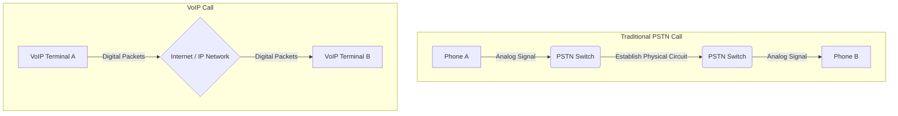
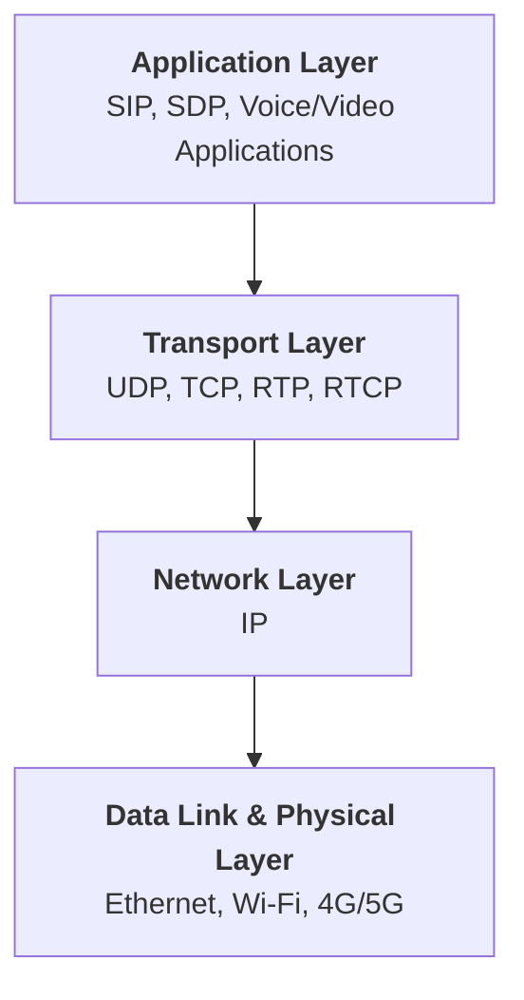
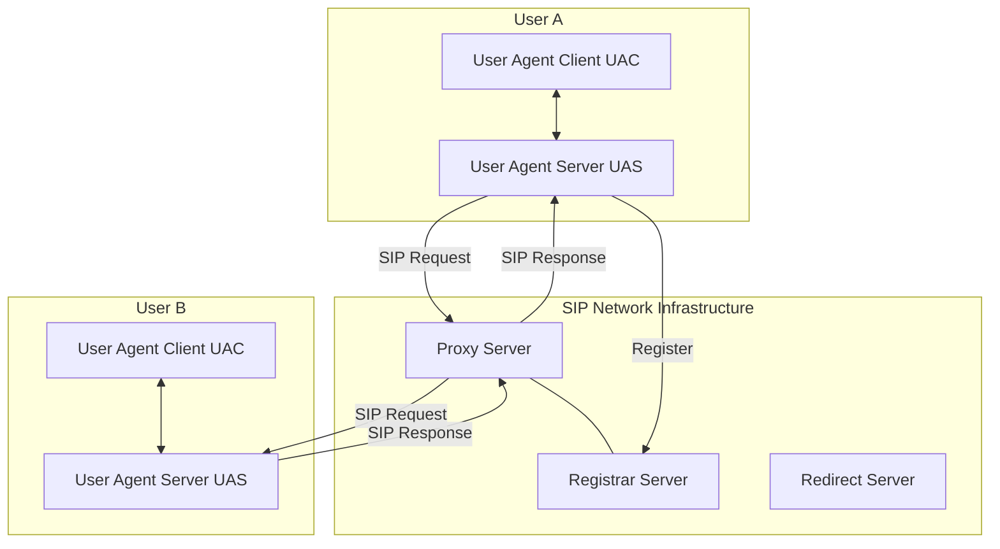
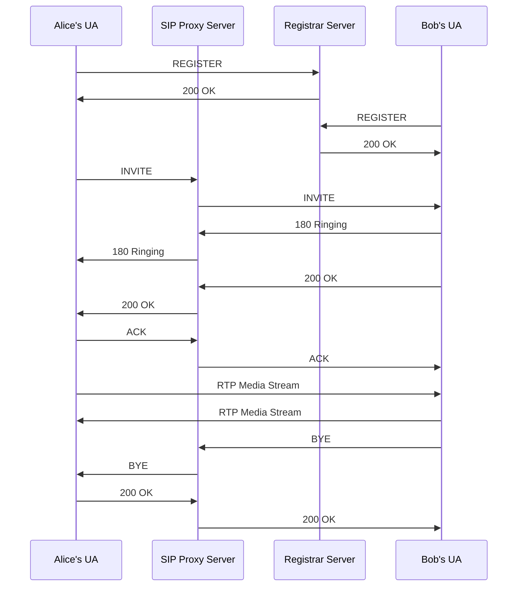
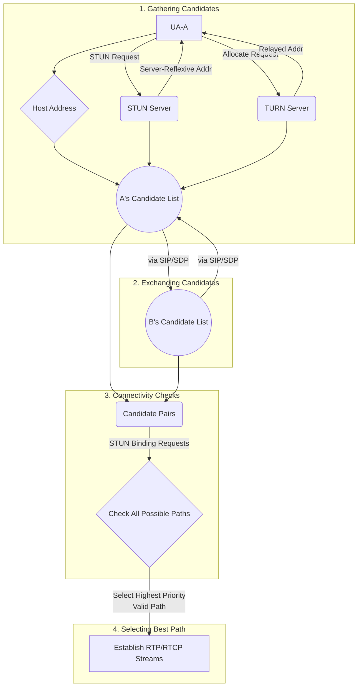
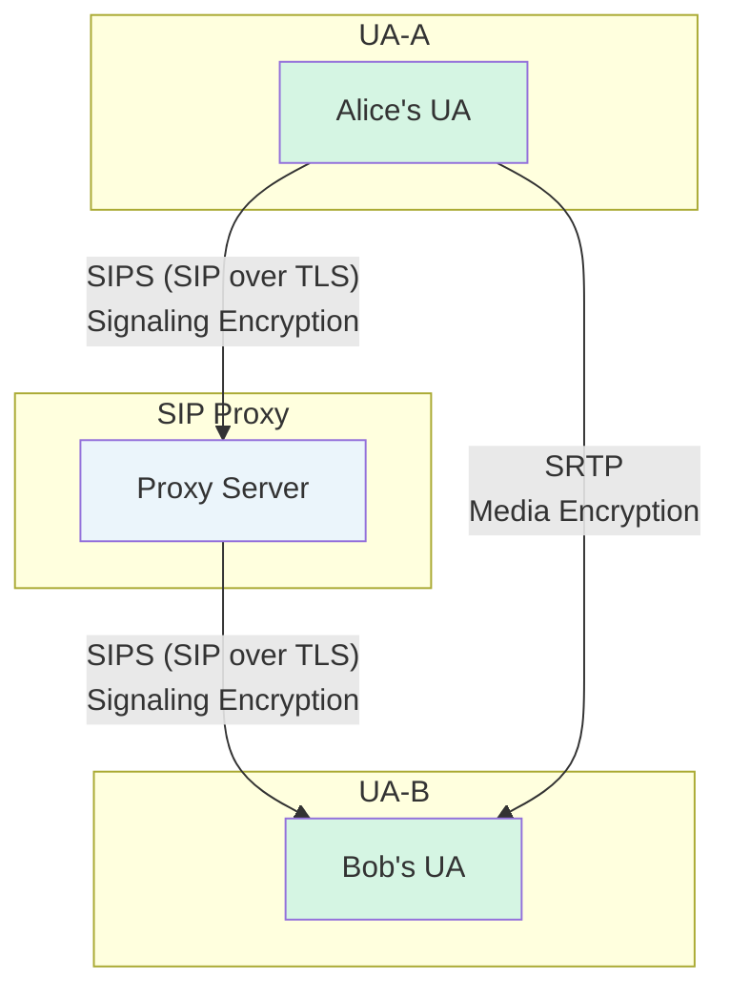

## 1. Introduction: The World of VoIP and SIP

### 1.1 What is VoIP?

VoIP (Voice over Internet Protocol) is a revolutionary technology that transmits voice communications over IP networks. Essentially, it digitizes, compresses, and packages human voice (analog signals), transmits them through IP networks (like the internet), and then unpacks, decompresses, and converts them back to sound at the receiving end.

**Core Concept**: Treating voice as data, transmitting it over networks just like sending emails or browsing websites.

This breaks the dependency on physical telephone lines that traditional telephone systems (PSTN - Public Switched Telephone Network) rely on, bringing tremendous flexibility and cost advantages.

### 1.2 SIP: The "Traffic Director" of VoIP

If VoIP is a complete communication system, then SIP (Session Initiation Protocol) is its brain and traffic director.

SIP itself doesn't transmit voice data. Its core responsibility is **signaling**, handling the **creation (Setup), management, and termination (Teardown)** of communication sessions.

It can be understood this way:
*   **You want to call a friend**: SIP is responsible for finding where your friend is (address resolution), telling their phone "someone's looking for you," making their phone ring (session invitation).
*   **Your friend answers the call**: SIP confirms both parties are ready and the conversation can begin.
*   **The call ends, you hang up**: SIP notifies both parties that the call has ended and resources can be released.

SIP is an application layer protocol deeply influenced by HTTP and SMTP, using text format, easy to understand and extend. Due to its flexibility and powerful functionality, SIP has become the mainstream signaling protocol in modern VoIP systems.

### 1.3 VoIP vs. PSTN: A Communication Revolution

To more intuitively understand the disruptive nature of VoIP, we can compare it with traditional PSTN.

| Feature | PSTN (Traditional Telephone) | VoIP (Network Telephone) |
| :--- | :--- | :--- |
| **Network Foundation** | Dedicated, circuit-switched network | Common, packet-switched IP network |
| **Connection Method** | Establishes a physical exclusive line before calling | Data packets are independently routed in the network, sharing bandwidth |
| **Core Principle** | Circuit switching | Packet switching |
| **Functionality** | Mainly limited to voice calls | Integrates voice, video, messaging, presence display, etc. |
| **Cost** | Depends on distance and call duration, expensive long-distance calls | Mainly depends on network bandwidth cost, no difference between long-distance and local calls |
| **Flexibility** | Number bound to physical line | Number (address) bound to user, can be used anywhere with network access |



In the following chapters, we will delve into the technology stack that makes up VoIP systems and analyze every detail of the SIP protocol.

## 2. VoIP Core Technology Stack (Macro Perspective)

From a macro perspective, VoIP is not a single technology but a complex yet orderly technological system composed of multiple protocols working together. Understanding its layered architecture is key to grasping the global view of VoIP.

### 2.1 Layered Architecture

The VoIP technology stack can be roughly divided into four layers, each depending on the services provided by the layer below it.



*   **Application Layer**: This is the layer closest to users.
    *   **Signaling Protocols**: Such as **SIP**, which we focus on, and its predecessor **H.323**. They are responsible for control operations like "making calls" and "hanging up."
    *   **Media Description Protocol**: **SDP (Session Description Protocol)** plays a crucial role. It doesn't transmit media but is used to describe media stream attributes in detail, such as: What codec to use (G.711, Opus)? What are the IP address and port? Is it audio or video? SDP content is typically exchanged "carried" by SIP.

*   **Transport Layer**: Responsible for end-to-end data transmission.
    *   **UDP (User Datagram Protocol)**: Due to its real-time, low-overhead characteristics, it is the **preferred choice** for VoIP media data (voice packets) transmission. It doesn't guarantee reliability, allowing packet loss, which is acceptable for real-time voice (losing a packet or two might just be a momentary noise, while waiting for retransmission would cause serious delay and jitter). The **RTP (Real-time Transport Protocol)** is built on top of UDP.
    *   **TCP (Transmission Control Protocol)**: For signaling messages (like SIP) that require absolute reliability, TCP is typically chosen. It ensures critical commands like "INVITE" or "BYE" are not lost. Of course, SIP can also run on UDP and ensure reliability through its own retransmission mechanism.

*   **Network Layer**: The core is **IP (Internet Protocol)**, responsible for packet routing and addressing, ensuring data packets can travel from the source through complex networks to reach their destination.

*   **Data Link & Physical Layer**: This is the most fundamental infrastructure, including Ethernet, Wi-Fi, fiber optics, etc., responsible for transmitting data bit streams over physical media.

### 2.2 Key Protocols Overview

| Protocol | Full Name | Layer | Core Function |
| :--- | :--- | :--- | :--- |
| **SIP** | Session Initiation Protocol | Application Layer | Establish, manage, and terminate multimedia sessions (signaling control). |
| **SDP** | Session Description Protocol | Application Layer | Describe media session parameters, such as IP address, port, codec, etc. |
| **RTP** | Real-time Transport Protocol | Transport Layer | Carry real-time data (such as voice, video), provide timestamps and sequence numbers. |
| **RTCP** | Real-time Transport Control Protocol | Transport Layer | Used in conjunction with RTP, providing Quality of Service (QoS) monitoring and feedback. |
| **UDP** | User Datagram Protocol | Transport Layer | Provide low-latency, unreliable datagram transmission for RTP. |
| **TCP** | Transmission Control Protocol | Transport Layer | Provide reliable, connection-oriented transmission for signaling like SIP. |
| **STUN/TURN/ICE** | (See NAT chapter) | Application Layer | Used to solve connectivity issues brought by Network Address Translation (NAT). |
| **SRTP** | Secure Real-time Transport Protocol | Transport/Application Layer | Secure version of RTP, providing encryption and authentication for media streams. |
| **TLS**| Transport Layer Security | Transport Layer | Used to encrypt SIP signaling (SIPS), ensuring confidentiality and integrity of signaling. |

Having understood this macro picture, we can now delve into the most important protocol—SIP, to explore how it elegantly accomplishes communication direction.
## 3. SIP Protocol In-Depth Analysis (Micro Details)

Now, we formally enter the world of SIP. SIP's design philosophy is "simplicity" and "extensibility," borrowing heavily from HTTP design concepts. If you understand HTTP, learning SIP will feel very familiar.

### 3.1 SIP Core Components

A typical SIP network consists of the following logical components:



*   **User Agent (UA)**: This is the terminal device in the SIP world. It can be:
    *   **Hardware Phone**: Looks like a traditional phone but runs the SIP protocol internally.
    *   **Softphone**: An application installed on a computer or mobile phone.
    *   Any device capable of initiating or receiving SIP sessions.
    
    A UA contains two parts:
    *   **User Agent Client (UAC)**: Responsible for **initiating** SIP requests. When you make a call, your device is a UAC.
    *   **User Agent Server (UAS)**: Responsible for **receiving** SIP requests and providing responses. When your phone rings, your device is a UAS.
    In a complete two-way call, **each party's device is simultaneously both a UAC and a UAS**.

*   **Proxy Server**: This is the central nervous system of the SIP network. It receives requests from UACs and **forwards** them to the target UAS. The proxy server itself does not initiate requests, but it may modify certain parts of the request for policy enforcement (such as billing, routing policies). It is the "middleman" of the call.

*   **Registrar Server**: It functions like an "address book." When a UA starts up and connects to the network, it sends a `REGISTER` request to the Registrar, telling the server: "I'm Bob, my SIP address is `sip:bob@example.com`, and my current IP address is `192.168.1.100`". The Registrar is responsible for maintaining this address mapping relationship (i.e., the binding between the user's SIP URI and their actual network location). When someone wants to call Bob, the Proxy server queries the Registrar to find Bob's current location.

*   **Redirect Server**: It's somewhat similar to a Proxy, but "lazier." When it receives a request, it doesn't forward it itself but directly replies to the UAC with a "3xx" response, telling the UAC: "The person you're looking for is at `sip:bob@192.168.1.100`, go find him yourself." The UAC needs to initiate a new request based on this new address. This mode is less common in practical applications than the proxy mode.

### 3.2 SIP Messages: The Harmony with HTTP

SIP messages are plain text and come in two types: **Request** and **Response**.

**A typical SIP request (INVITE):**
```
INVITE sip:bob@biloxi.com SIP/2.0
Via: SIP/2.0/UDP pc33.atlanta.com;branch=z9hG4bK776asdhds
Max-Forwards: 70
To: Bob <sip:bob@biloxi.com>
From: Alice <sip:alice@atlanta.com>;tag=1928301774
Call-ID: a84b4c76e66710
CSeq: 314159 INVITE
Contact: <sip:alice@pc33.atlanta.com>
Content-Type: application/sdp
Content-Length: 142

(Message body: SDP content here...)
```

**Request message structure analysis:**
*   **Request Line**: `Method Request-URI Version`
    *   **Method**: Defines the purpose of the request. Common methods include:
        *   `INVITE`: Initiates a session invitation.
        *   `ACK`: Confirms a final response to an `INVITE`.
        *   `BYE`: Terminates an established session.
        *   `CANCEL`: Cancels an incomplete `INVITE` request.
        *   `REGISTER`: Registers user location with a Registrar server.
        *   `OPTIONS`: Queries the capabilities of a server or UA.
    *   **Request-URI**: The target address of the request, i.e., `sip:user@domain`.
*   **Header Fields**: Key-value pairs in the form of `Field Name: Field Value`, providing detailed information about the message.
    *   `Via`: Records the path the request has taken. Each hop proxy adds its own address at the top. Response messages will return along the path specified by the `Via` header. The `branch` parameter is a key part of the transaction ID.
    *   `From` / `To`: Represent the initiator and recipient of the call, respectively. The `tag` parameter uniquely identifies a party in a call and is key to the dialog.
    *   `Call-ID`: Uniquely identifies a complete call globally. All requests and responses related to this call use the same `Call-ID`.
    *   `CSeq`: Command Sequence, containing a number and a method name, used to order and distinguish multiple transactions under the same `Call-ID`.
    *   `Contact`: Provides a direct contact address (URI) for the request initiator. In an `INVITE`, it tells the other party where subsequent requests (like `BYE`) should be sent directly.
    *   `Content-Type`: Describes the media type of the message body, typically `application/sdp`.
    *   `Content-Length`: The length of the message body.

**A typical SIP response (200 OK):**
```
SIP/2.0 200 OK
Via: SIP/2.0/UDP pc33.atlanta.com;branch=z9hG4bK776asdhds;received=192.0.2.4
To: Bob <sip:bob@biloxi.com>;tag=a6c85cf
From: Alice <sip:alice@atlanta.com>;tag=1928301774
Call-ID: a84b4c76e66710
CSeq: 314159 INVITE
Contact: <sip:bob@198.51.100.3>
Content-Type: application/sdp
Content-Length: 131

(Message body: SDP content here...)
```

**Response message structure analysis:**
*   **Status Line**: `Version Status-Code Reason-Phrase`
### 3.3 A Complete Call: SIP Session Flow Explained

Below, we use a Mermaid sequence diagram to break down a typical SIP call flow, from user registration, to A calling B, and finally hanging up.



**Flow Breakdown**:
1.  **Registration (1-4)**: After coming online, Alice and Bob each register their locations with the Registrar. This is the prerequisite for others to find them.
2.  **Call (5-12)**: This is the famous "three-way handshake" process (`INVITE` -> `200 OK` -> `ACK`).
    *   **INVITE**: Alice initiates the call, carrying her prepared media information (SDP) in the request, describing the media types, codecs, and IP/port she can receive.
    *   **1xx Provisional Responses**: The Proxy and Bob return `100 Trying` (not shown in the diagram) and `180 Ringing`, telling Alice "please wait, processing/the other phone is ringing." This effectively prevents the UAC from resending `INVITE` due to timeout.
    *   **200 OK**: When Bob answers the call, his UA sends a `200 OK` response containing **his own SDP information**. At this point, media negotiation is complete, and both parties know each other's media capabilities and receiving addresses.
    *   **ACK**: After receiving the `200 OK`, Alice must send an `ACK` request to confirm. `ACK` is an independent transaction used to confirm the final response. When Bob receives the `ACK`, a complete SIP dialog is formally established.
3.  **Media Transmission**: After the dialog is established, Alice and Bob can bypass the Proxy server and **directly** send RTP voice packets to each other based on the IP and port information obtained from each other's SDP. **The path taken by signaling (through Proxy) and media (P2P) can be different**, which is an important feature of SIP.
4.  **Termination (13-16)**: Either party can end the call by sending a `BYE` request. Upon receiving it, the other party replies with a `200 OK`, and the call is cleanly terminated.

### 3.4 SDP: Blueprint for Media Sessions

SDP (Session Description Protocol) is a perfect match for SIP, but it is an independent protocol (RFC 4566). It doesn't transmit any media data itself but is used to **describe** media sessions. It's like a blueprint, detailing the specifications of the "communication building" to be constructed.

**A typical SDP example (in an INVITE request):**
```
v=0
o=alice 2890844526 2890844526 IN IP4 pc33.atlanta.com
s=SIP Call
c=IN IP4 192.0.2.4
t=0 0
m=audio 49170 RTP/AVP 0 8 97
a=rtpmap:0 PCMU/8000
a=rtpmap:8 PCMA/8000
a=rtpmap:97 iLBC/8000
```
**Key fields analysis**:
*   `v=0`: Protocol version.
*   `o=`: (owner/creator) Describes the session initiator's information, including username, session ID, version number, etc.
*   `s=`: Session name.
*   `c=`: (connection data) Connection information. **Very important**, it specifies the address where media streams should be sent (`IN` means Internet, `IP4` means IPv4, followed by the IP address).
*   `t=`: (time) Session start and end times, `0 0` means permanent.
*   `m=`: (media description) Media description. **Crucial**.
    *   `audio`: Media type is audio.
    *   `49170`: **Port to which media will be sent**.
    *   `RTP/AVP`: Transport protocol used is RTP.
    *   `0 8 97`: **Proposed codec list** (payload type). This is a priority list, meaning "I prefer to use 0, then 8, then 97."
*   `a=rtpmap: ...`: (attribute) Attribute line, mapping the payload type numbers in the `m` line to specific codec names and clock frequencies. For example, `a=rtpmap:0 PCMU/8000` means payload type 0 corresponds to G.711u (PCMU) with a sampling rate of 8000Hz.

This model is called the **Offer/Answer Model**:
1.  **Offer**: Alice sends her SDP in the `INVITE`, which is an Offer, listing all the codecs she supports and her receiving address/port.
2.  **Answer**: Upon receiving it, Bob selects a codec he also supports from Alice's list (e.g., PCMA) and returns this selected codec along with **his own** receiving address/port in the SDP of the `200 OK`.

When Alice receives this Answer, both parties have reached a consensus: use the PCMA codec, Alice sends RTP packets to Bob's IP/port, and Bob sends RTP packets to Alice's IP/port.

## 4. Media Stream Transmission: RTP and RTCP

We have successfully established the "signaling" connection through SIP/SDP, like two airport control centers coordinating flight plans between cities. Now, we need the actual "airplanes"—the RTP protocol—to transport our "passengers"—voice and video data.

### 4.1 RTP: Born for Real-time Data

RTP (Real-time Transport Protocol, RFC 3550) is a network protocol specifically designed for end-to-end transmission of real-time data such as audio and video. It typically runs on top of **UDP**.

**Why UDP?**
TCP provides reliable, ordered transmission, but at a cost: when a packet is lost, TCP stops sending subsequent packets until the lost packet is retransmitted and successfully received. For real-time voice, this delay paid for "reliability" is fatal. Losing a small piece of voice (perhaps just a fraction of a second of silence or faint noise) is far better than making the entire conversation stutter for several seconds while waiting for it. RTP is based on this principle of "tolerating packet loss, not tolerating delay," choosing UDP as its ideal carrier.

However, pure UDP just throws data packets to the other side on a "best effort" basis, providing no timing information or knowledge of packet order. RTP adds an additional header on top of UDP, giving data packets "life": **timestamps** and **sequence numbers**.

**RTP Header Structure Explained**

A standard RTP header is at least 12 bytes, structured as follows:

```
    0                   1                   2                   3
    0 1 2 3 4 5 6 7 8 9 0 1 2 3 4 5 6 7 8 9 0 1 2 3 4 5 6 7 8 9 0 1
   +-+-+-+-+-+-+-+-+-+-+-+-+-+-+-+-+-+-+-+-+-+-+-+-+-+-+-+-+-+-+-+-+
   |V=2|P|X|  CC   |M|     PT      |       Sequence Number         |
   +-+-+-+-+-+-+-+-+-+-+-+-+-+-+-+-+-+-+-+-+-+-+-+-+-+-+-+-+-+-+-+-+
   |                           Timestamp                           |
   +-+-+-+-+-+-+-+-+-+-+-+-+-+-+-+-+-+-+-+-+-+-+-+-+-+-+-+-+-+-+-+-+
   |           Synchronization Source (SSRC) identifier            |
   +=+=+=+=+=+=+=+=+=+=+=+=+=+=+=+=+=+=+=+=+=+=+=+=+=+=+=+=+=+=+=+=+
   |            Contributing source (CSRC) identifiers             |
   |                             ....                              |
   +-+-+-+-+-+-+-+-+-+-+-+-+-+-+-+-+-+-+-+-+-+-+-+-+-+-+-+-+-+-+-+-+
```

*   **V (Version, 2 bits)**: RTP protocol version, currently version 2.
*   **P (Padding, 1 bit)**: Padding bit. If set, indicates there are additional padding bytes at the end of the packet.
*   **X (Extension, 1 bit)**: Extension bit. If set, indicates an extension header follows the standard header.
*   **CC (CSRC Count, 4 bits)**: Contributing source count, indicating the number of CSRC identifiers following the fixed header.
*   **M (Marker, 1 bit)**: Marker bit. Its specific meaning is defined by the particular application profile. For example, in video streams, it can mark the end of a frame. In audio, it can mark the beginning of a silence period.
*   **PT (Payload Type, 7 bits)**: **Payload type**. This is a very critical field, used to identify what format the media data in the RTP packet is. This number corresponds exactly to what we negotiated in the `m=` line and `a=rtpmap` line of SDP. For example, if SDP negotiation decides to use PCMU (payload type 0), then all RTP packets carrying PCMU data will have their PT field set to 0. When the receiver sees PT=0, it knows to use the PCMU decoder to process the data.
*   **Sequence Number (16 bits)**: **Sequence number**. Increments by 1 for each RTP packet sent. This field has two core functions:
    1.  **Detecting packet loss**: The receiver can determine if packets have been lost by checking if the received sequence numbers are consecutive.
    2.  **Reordering**: Due to different paths packets may take in the network, packets sent earlier might arrive later. The receiver can restore the original order of packets using the sequence number.
*   **Timestamp (32 bits)**: **Timestamp**. **This is the soul of RTP**. It records the sampling moment of the media data in the packet. **Note: This timestamp is not a "wall clock"** but is based on the media's sampling clock. For example, for audio sampled at 8000Hz, the clock "ticks" 8000 times per second. If a packet contains 20 milliseconds of audio data, the timestamp of the next packet will increase by `8000 * 0.020 = 160`.
    The main functions of the timestamp are:
    1.  **Synchronizing playback and eliminating jitter**: Jitter refers to variations in packet arrival delay. The receiver sets up a "jitter buffer" to play media smoothly based on the timestamps on the packets, rather than playing at varying speeds, thus providing a smooth auditory/visual experience.
    2.  **Multimedia synchronization**: In a call containing both audio and video, audio and video streams are two separate RTP streams (with different SSRCs), but their timestamps can be based on the same reference clock. This allows the receiver to precisely align audio and video, achieving "lip sync."
*   **SSRC (Synchronization Source, 32 bits)**: **Synchronization source**. In an RTP session, each media stream source (such as a microphone or a camera) is assigned a randomly generated, globally unique SSRC value. For example, if Alice is sending both audio and video in a call, she will generate two SSRCs, one for the audio stream and one for the video stream. Intermediate devices like Proxies or Mixers can distinguish different streams based on SSRC.
*   **CSRC (Contributing Source)**: Contributing source. When multiple source media streams pass through a mixer and are merged into one stream, this field lists the SSRCs of all original contributors.
    *   **Status Code**: Very similar to HTTP status codes.
        *   `1xx` (Provisional): Request received, processing in progress. E.g., `180 Ringing`.
        *   `2xx` (Success): Request successfully processed. E.g., `200 OK`.
        *   `3xx` (Redirection): Further action needed.
        *   `4xx` (Client Error): Request has syntax errors or cannot be processed on this server.
        *   `5xx` (Server Error): Server failed to process the request.
        *   `6xx` (Global Failure): The request cannot be processed by any server.
*   **Header Fields**: Most header fields (such as `Via`, `From`, `To`, `Call-ID`, `CSeq`) are copied from the request to ensure the response can be correctly associated with the request. The `tag` parameter in the `To` field is added by the called party (UAS).
### 4.2 RTCP: RTP's "Control Partner"

RTP is only responsible for "cargo transport," but it doesn't know the quality of the "shipping." RTCP (Real-time Transport Control Protocol) is the accompanying "quality supervisor." It works in parallel with RTP, periodically sending control packets between participants to monitor the quality of service (QoS) of data transmission.

RTCP packets and RTP packets use different UDP ports (typically RTP port number + 1). It doesn't transmit any media data itself, only control information, and its bandwidth usage is typically limited to within 5% of RTP bandwidth.

**Core RTCP packet types and their functions:**

*   **Sender Report (SR)**: Sent by the **media sender**.
    *   **Content**: Contains the sender's SSRC, an **NTP timestamp** (used for synchronization with the "wall clock," enabling absolute time synchronization and cross-media stream synchronization), the RTP timestamp corresponding to the NTP timestamp, and the total number of packets and bytes sent.
    *   **Function**: Lets the receiver know how much data has been sent and provides key information needed for cross-media stream synchronization (such as audio-video synchronization).

*   **Receiver Report (RR)**: Sent by the **media receiver**.
    *   **Content**: Contains the SSRC of the source it is receiving from, and since the last report: **fraction lost**, **cumulative number of packets lost**, **highest sequence number received**, and an estimate of **interarrival jitter**.
    *   **Function**: **This is the most important QoS feedback mechanism**. After receiving an RR, the sender can understand the network conditions. If the report shows a high packet loss rate, the sender's application might make intelligent adjustments, such as switching to a more loss-resistant, lower bitrate codec, or notifying the user of poor network conditions.

*   **Source Description (SDES)**:
    *   **Content**: Provides additional information associated with an SSRC, most importantly the **CNAME (Canonical Name)**. CNAME is a unique, persistent identifier for each endpoint.
    *   **Function**: Used to associate different media streams (such as SSRC_audio and SSRC_video) from the same user. When the receiver sees two streams with the same CNAME, it knows they come from the same participant and can synchronize their playback.

*   **BYE**: Used to explicitly indicate that a participant is leaving the session, closing a stream.

*   **APP**: Used for application-specific extensions.

Through the collaborative work of RTP and RTCP, VoIP systems can not only efficiently transmit real-time media but also intelligently sense network quality and make adaptive adjustments, which is the technical cornerstone for achieving high-quality call experiences.

## 5. NAT Traversal: Breaking Through Network Barriers

So far, our discussion of SIP and RTP flows has been based on an ideal assumption: both parties in the call have public IP addresses and can directly access each other. However, in the real world, the vast majority of user devices (computers, phones, IP phones) are behind home or office routers, using private IP addresses (such as `192.168.x.x`).

Network Address Translation (NAT) devices (i.e., what we commonly call routers) play the role of "gatekeepers," allowing internal devices to access the internet but, by default, blocking unsolicited connections from the outside. This poses a huge challenge for VoIP communications.

### 5.1 The NAT Challenge

Imagine Alice and Bob are both in their respective home networks, and they both have IP addresses of `192.168.1.10`.

1.  Alice initiates a call and honestly fills in her media receiving address in the SDP of her `INVITE` request: `c=IN IP4 192.168.1.10` and `m=audio 49170 ...`.
2.  This `INVITE` request successfully reaches Bob through the SIP proxy.
3.  Bob's UA sees this SDP and becomes confused. It dutifully tries to send its RTP packets to the address `192.168.1.10`. But this address is a private address in Bob's own network (it might even be his neighbor's printer address), not Alice on the public internet!
4.  The result is: **Media streams (RTP packets) cannot be delivered, and both parties can only hear their own side (or silence)**.

This is the core challenge NAT poses to VoIP: **The private address information carried in SDP is useless and misleading to the other party on the public internet**. To solve this problem, we need a mechanism to discover the device's "identity" on the public internet and establish a path that can penetrate NAT.

### 5.2 The Three Musketeers of NAT Traversal: STUN, TURN, ICE

To solve the connectivity problems brought by NAT, IETF defined a complete solution, with the ICE protocol at its core, while ICE's work depends on two auxiliary protocols: STUN and TURN.

#### 1. STUN (Session Traversal Utilities for NAT)

STUN (RFC 5389) is a simple client-server protocol, with its core functionality acting like a "mirror."

*   **Working Principle**: The UA (client) behind a private network sends a request to a STUN server on the public internet. Upon receiving the request, the STUN server checks which public IP and port the request came from, then packages this address (called the **Server-Reflexive Address**) in a response and returns it to the client along the original path.
*   **Function**: After receiving the response, the client sees its "appearance" on the public internet in the "mirror." It now knows: "Oh, when I send packets outward, my router maps my source address `192.168.1.10:49170` to the public address `203.0.113.10:8001`." This way, it can fill this public address and port in the SDP and send it to the other party.

STUN can also be used to detect the type of NAT (e.g., full cone, restricted cone, port restricted cone, symmetric). Understanding the NAT type helps select the optimal traversal strategy.

**Limitations**: STUN is powerless against "Symmetric NAT." In this strictest type of NAT, the router not only allocates a public port for each outbound session, but this port mapping relationship is **only valid for a specific destination IP and port**. The public address `203.0.113.10:8001` that Alice discovers through the STUN server is a dedicated mapping for her communication with the STUN server; Bob cannot use this address to send data to Alice.

#### 2. TURN (Traversal Using Relays around NAT)

When STUN fails due to symmetric NAT or other firewall policies, TURN (RFC 8656) is needed as the final "fallback" solution.

*   **Working Principle**: A TURN server is not just a "mirror"; it is a fully functional **public media relay**.
    1.  The client first **allocates** a relay address (public IP and port) on the TURN server.
    2.  Then, the client tells the peer (through SIP/SDP) to send its media packets to this relay address.
    3.  At the same time, the client also sends its media packets to the peer through the TURN server.
*   **Function**: All media streams are forwarded through the TURN server. Although this increases latency and consumes server bandwidth, it **guarantees connectivity** because both communicating parties are actually communicating with the TURN server, which has a public address.

#### 3. ICE (Interactive Connectivity Establishment)

ICE (RFC 8445) is the real "commander-in-chief." It doesn't invent new protocols but cleverly integrates STUN and TURN to form a systematic framework, establishing media paths between communicating parties in the most effective way.

The ICE workflow can be divided into the following stages:



**ICE Process Explained**:
1.  **Gathering Candidates**:
    *   **Host Candidates**: The UA first collects all IP addresses and ports on its local network interfaces.
    *   **Server-Reflexive Candidates**: The UA uses a STUN server to discover its public mapping address.
    *   **Relayed Candidates**: The UA allocates a relay address using a TURN server.
    *   In the end, each UA generates a list of candidates of various types with different priorities.

2.  **Exchanging Candidates**:
    *   Both parties exchange their candidate lists through the signaling channel (typically in the SDP of SIP's `INVITE`/`200 OK` messages).

3.  **Connectivity Checks**:
    *   After receiving the other party's address list, each UA pairs its local candidates with the other party's candidates, forming a **Candidate Pair** list, sorted by priority (P2P > Server-Reflexive > Relayed).
    *   ICE begins **connectivity checks (STUN Binding Requests)**. It starts from the highest priority address pair, sending STUN requests to each other. If a request successfully receives a response, that path is considered **valid**.

4.  **Selecting the Best Path and Starting Media Transmission**:
    *   Once a valid path pair is found, the UA can start using it to send media data. But it doesn't stop immediately; it continues to check other possible path pairs.
    *   When all checks are complete, ICE selects the validated path with the highest priority as the final communication path.
    *   **Final Result**:
        *   If a Host-to-Host or Host-to-ServerReflexive path works, a P2P (or quasi-P2P) connection is achieved, which is most efficient.
        *   If all P2P attempts fail, ICE will ultimately choose a path relayed through the TURN server, sacrificing some performance to ensure the successful establishment of the call.

Through ICE, VoIP systems can intelligently and dynamically adapt to various complex network environments, maximizing attempts to establish efficient P2P connections while gracefully degrading to relay mode when necessary, greatly improving the success rate and quality of VoIP calls.
## 6. VoIP Security: Protecting Your Call Privacy

As VoIP becomes more widespread, its security also becomes increasingly important. An unprotected VoIP communication system faces risks of eavesdropping, fraud, and denial of service attacks. Fortunately, we have mature solutions to protect the two key parts of communication: signaling and media.



### 6.1 Signaling Encryption: SIPS (SIP over TLS)

*   **Problem**: Ordinary SIP messages are transmitted in plaintext. Attackers can easily sniff these messages on the network, obtaining metadata such as who the parties in the call are (`From`/`To` headers), the unique identifier of the call (`Call-ID`), and even tamper with message content, performing call hijacking or fraud.
*   **Solution**: **TLS (Transport Layer Security)**, the same protocol used by HTTPS to encrypt web traffic.
    *   **SIPS (Secure SIP)**: When SIP runs on top of TLS, it is called SIPS. It encapsulates the entire SIP message (requests and responses) in an encrypted TLS channel for transmission.
    *   **Working Method**: The UA and SIP proxy first establish a standard TLS handshake, exchanging certificates and negotiating encryption keys. Once the TLS connection is established, all subsequent SIP messages are transmitted within this encrypted channel, preventing outsiders from peeking at their content.
    *   **SIP URI**: Addresses using SIPS are typically represented as `sips:alice@example.com` and use port `5061` by default instead of `5060`.

Through SIPS, we ensure the **confidentiality and integrity of call signaling**.

### 6.2 Media Encryption: SRTP

*   **Problem**: Even if signaling is encrypted, the actual voice/video data (RTP packets) are still in plaintext by default! Attackers may not know who is on the call, but if they can intercept the RTP stream, they can still eavesdrop on the conversation content.
*   **Solution**: **SRTP (Secure Real-time Transport Protocol)**, RFC 3711.
    *   **Working Method**: SRTP is not an entirely new protocol but adds a layer of encryption and authentication on top of the RTP protocol. It **encrypts the payload portion of RTP** but keeps the RTP header in plaintext (because network devices may need to read header information for QoS processing).
    *   **Key Exchange**: SRTP itself does not specify how keys are exchanged. In practice, encryption keys are typically negotiated through a secure signaling channel (i.e., SIP/SDP messages encrypted with SIPS/TLS). This process is usually handled by a mechanism called **SDES (SDP Security Descriptions)** or the more modern **DTLS-SRTP**.
    *   **Functions**:
        1.  **Confidentiality**: Using symmetric encryption algorithms (such as AES) to encrypt RTP payloads, ensuring that only the communicating parties with the key can decrypt the conversation content.
        2.  **Message Authentication**: Generating an Authentication Tag through algorithms like HMAC-SHA1. The receiver can use this to verify whether the message has been tampered with during transmission.
        3.  **Replay Protection**: Preventing attackers from capturing packets and resending them to conduct malicious attacks.

Alongside SRTP, there is also **SRTCP**, which provides the same level of encryption and authentication protection for RTCP control packets.

By combining SIPS and SRTP, we can build an end-to-end secure VoIP communication system, ensuring that the entire process from "who is calling" to "what is said on the phone" is tightly protected.

## 7. Conclusion and Future Outlook

### Conclusion

This document has provided an in-depth analysis of the two core technologies supporting modern network voice communications: VoIP and SIP, from macro to micro perspectives.

*   We started with the **basic concept of VoIP**, understanding how it transforms voice into data packets on IP networks, revolutionizing the traditional PSTN system.
*   At the **macro level**, we outlined VoIP's layered technology stack, clarifying the positions and collaborative relationships of key protocols such as SIP (signaling), RTP/RTCP (media), SDP (description), and UDP/TCP (transport).
*   At the **micro level**, we thoroughly analyzed the **SIP protocol**'s core components (UA, Proxy, Registrar), its text message structure similar to HTTP, and the detailed signaling flow of a complete call from registration, establishment to termination. We also understood how **SDP** negotiates media parameters through the Offer/Answer model.
*   We delved into the **RTP protocol** responsible for carrying actual voice data, understanding the critical importance of sequence numbers and timestamps in its header for handling out-of-order packets, jitter, and achieving synchronization, as well as the key role of **RTCP** in QoS monitoring.
*   We faced the biggest obstacle in real-world network deployment—**NAT**, and detailed how the "three musketeers" **STUN, TURN, ICE** work together to intelligently establish a media path that can penetrate routers.
*   Finally, we discussed **VoIP security** mechanisms, protecting signaling through **SIPS (TLS)** and media through **SRTP**, building end-to-end secure communications.

### Future Outlook

VoIP technology is far from stopping its development; it is evolving towards being more intelligent, integrated, and seamless.

*   **Deep Integration with WebRTC**: WebRTC (Web Real-Time Communication) has brought high-quality audio and video communication capabilities directly into browsers. Although WebRTC uses a set of standards based on Javascript API on the browser side, its underlying core concepts (ICE, STUN, TURN, (S)RTP, DTLS-SRTP) are in line with the VoIP technology stack we've discussed. In the future, traditional SIP systems and WebRTC-based applications will be more tightly interconnected, forming a seamless unified communication ecosystem.
*   **AI-Empowered Communication Experience**: Artificial intelligence is reshaping VoIP. For example:
    *   **Intelligent Codecs (AI Codec)**: Using machine learning to reconstruct high-quality voice at extremely low bandwidth.
    *   **Intelligent Noise Reduction and Echo Cancellation**: Precisely separating human voice from background noise through AI models, achieving studio-level call quality.
    *   **Network Path Optimization**: AI can analyze RTCP data and network telemetry data, predict network congestion, and proactively switch to better servers or network paths.
*   **Immersive Communication**: With the popularization of 5G and the rise of the metaverse concept, VoIP will no longer be limited to voice and flat video. Spatial Audio, VR/AR calls, and other immersive experiences will place higher demands on VoIP's latency, bandwidth, and synchronization, spurring new technological evolution.

From electric current on analog telephone lines, to data packets racing through IP networks, to future AI-empowered virtual space conversations, the revolution in communication technology never ceases. A profound understanding of the core technological principles represented by SIP and VoIP will be our solid foundation as we move forward in this wave.