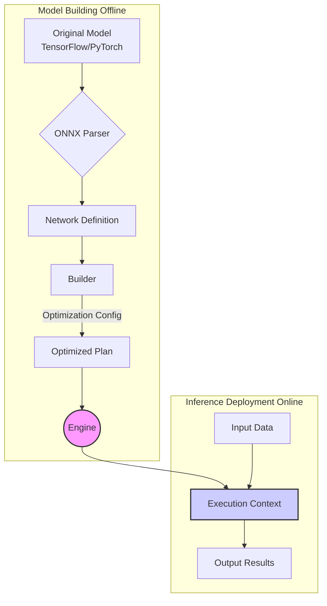
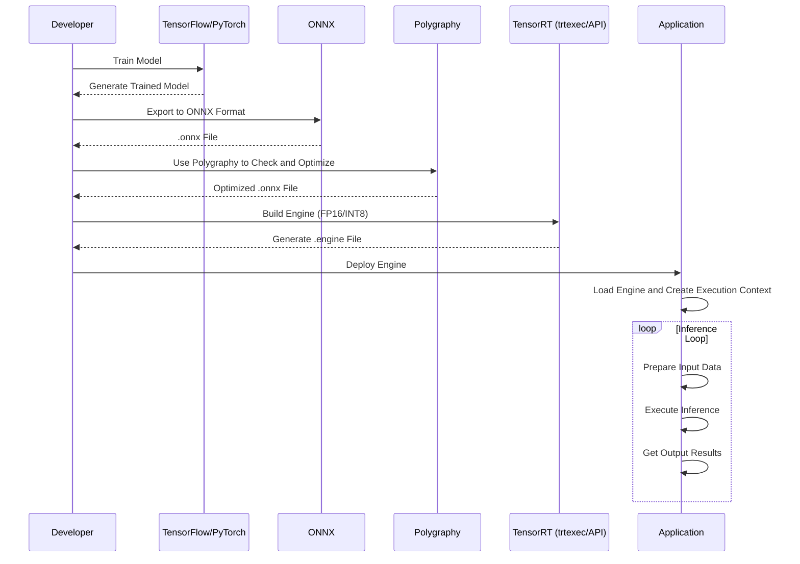
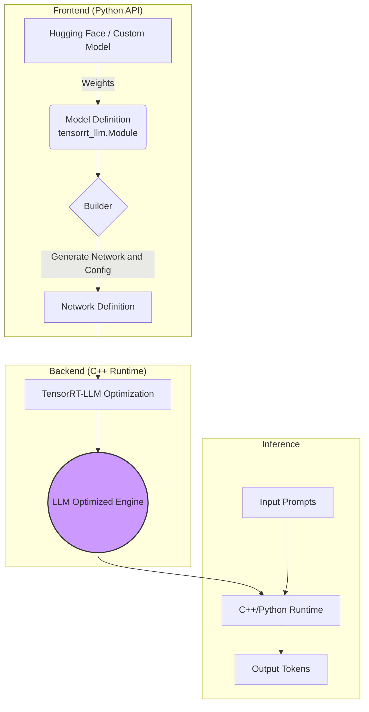
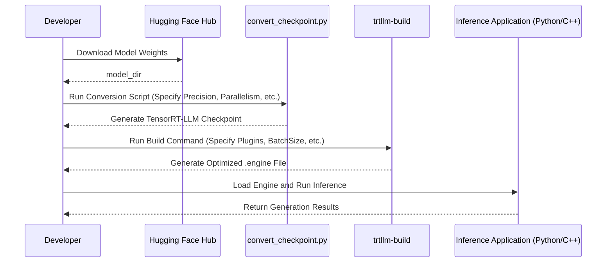

## 1. Introduction

NVIDIA® TensorRT™ is a software development kit (SDK) for high-performance deep learning inference on NVIDIA GPUs. It is designed to optimize and accelerate trained neural networks, enabling them to run in production environments with low latency and high throughput. TensorRT takes models from mainstream deep learning frameworks (such as TensorFlow, PyTorch, ONNX, etc.), applies a series of sophisticated optimization techniques, and generates a highly optimized runtime engine.

This document will provide an in-depth yet accessible introduction to TensorRT's core concepts, key features, workflow, and latest functionalities (including TensorRT-LLM specifically designed for accelerating large language models), helping developers fully leverage its powerful performance advantages.

## 2. Core Concepts

Understanding TensorRT's core components is the first step to using it effectively.

*   **Engine**: The core of TensorRT. It is an optimized model representation that includes a computation graph and weights generated for a specific GPU architecture and configuration (such as batch size, precision). The Engine is immutable and is the final product for deployment.
*   **Builder (`IBuilder`)**: This is the main interface for creating an Engine. The Builder takes a network definition and applies various optimizations, ultimately generating an optimized plan for the target GPU, which can be serialized into an Engine.
*   **Network Definition (`INetworkDefinition`)**: This is where you define the model structure. You can build the network manually from scratch or import it from a model file using a Parser.
*   **Parser**: Used to parse models from different frameworks (primarily ONNX format) and convert them into TensorRT's network definition. TensorRT provides a powerful ONNX parser.
*   **Profiler (`IProfiler`)**: An optional interface that allows you to collect and query information about layer performance during the build process. This helps with debugging and understanding which layers are performance bottlenecks.
*   **Execution Context (`IExecutionContext`)**: This is the main interface for executing inference. An Engine can have multiple Execution Contexts, allowing concurrent execution of inference tasks. Each context maintains its own inputs, outputs, and state.



## 3. Key Features and Optimization Techniques

TensorRT's high performance stems from its advanced optimization techniques.

### 3.1. Precision Calibration & Quantization

TensorRT supports multiple precisions for inference, including FP32, FP16, INT8, and the latest FP8. Among these, INT8 quantization is a key technology for improving performance and reducing memory usage.

*   **Post-Training Quantization (PTQ)**: Determines the scaling factors needed to convert FP32 weights and activation values to INT8 through a calibration dataset, without retraining the model.
*   **Quantization-Aware Training (QAT)**: Simulates quantization operations during training, making the model more robust to quantization errors, thus achieving higher accuracy when converted to INT8.

You can use `QuantizationSpec` to precisely control which layers or types of layers need to be quantized.

```python
# Example: Only quantize 'Conv2D' type layers
q_spec = QuantizationSpec()
q_spec.add(name='Conv2D', is_keras_class=True)
q_model = quantize_model(model, quantization_mode='partial', quantization_spec=q_spec)
```

### 3.2. Layer & Tensor Fusion

TensorRT intelligently merges multiple independent layers into a single, more complex layer. This reduces the number of CUDA kernel launches and memory reads/writes, significantly lowering latency.

*   **Vertical Fusion**: Merges consecutive layers with the same data dependencies (such as Conv, Bias, ReLU) into a single CBR layer.

    ```mermaid
    graph TD;
        subgraph "Before Fusion"
            A[Input] --> B(Conv);
            B --> C(Bias);
            C --> D(ReLU);
            D --> E[Output];
        end
        subgraph "After Fusion"
            A2[Input] --> F((Conv + Bias + ReLU));
            F --> E2[Output];
        end
    ```

*   **Horizontal Fusion**: Merges parallel layers that have the same input but perform different operations.

    ```mermaid
    graph TD;
        subgraph "Before Fusion"
            A[Input] --> B(Conv A);
            A --> C(Conv B);
            B --> D[Output A];
            C --> E[Output B];
        end
        subgraph "After Fusion"
            A2[Input] --> F((Conv A + Conv B));
            F --> D2[Output A];
            F --> E2[Output B];
        end
    ```

### 3.3. Kernel Auto-Tuning

For specific target GPU architectures, TensorRT selects the optimal CUDA kernel for each layer from a library containing multiple implementations. It tests different algorithms and implementations based on the current batch size, input dimensions, and parameters to find the fastest one.

### 3.4. Dynamic Shapes

TensorRT can handle models with input tensor dimensions that vary at runtime. When building an Engine, you can specify an optimization profile that includes minimum, optimal, and maximum dimensions for inputs. TensorRT will generate an Engine that can efficiently handle any input dimensions within the specified range.

### 3.5. Plugins

For custom or special layers not natively supported by TensorRT, you can implement your own logic through the plugin API (`IPluginV2`). This provides great extensibility for TensorRT.

The latest versions of TensorRT have greatly simplified the plugin registration process through decorators, especially for the Python API.

```python
# Example: Register a simple element-wise addition plugin
import tensorrt.plugin as trtp

@trtp.register("sample::elemwise_add_plugin")
def add_plugin_desc(inp0: trtp.TensorDesc, block_size: int) -> trtp.TensorDesc:
    return inp0.like()
```

### 3.6. Sparsity

TensorRT supports leveraging structured sparsity features on NVIDIA Ampere and higher architecture GPUs. If your model weights have a 2:4 sparsity pattern, TensorRT can utilize sparse tensor cores to further accelerate computation, nearly doubling performance.

## 4. Workflow

A typical TensorRT deployment workflow is as follows:



1.  **Model Export**: Export your trained model from your training framework (such as PyTorch or TensorFlow) to ONNX format. ONNX is an open model exchange format that serves as a bridge between training and inference.

2.  **Model Inspection and Optimization (Polygraphy)**: Before building an Engine, it is strongly recommended to use the **Polygraphy** toolkit to inspect, modify, and optimize your ONNX model. Polygraphy is a powerful tool that can:
    *   **Inspect Models**: Display information about the model's layers, inputs, outputs, etc.
    *   **Constant Folding**: Pre-compute constant expressions in the model, simplifying the computation graph.
        ```bash
        polygraphy surgeon sanitize model.onnx -o folded.onnx --fold-constants
        ```
    *   **Compare Outputs from Different Frameworks**: Verify that TensorRT's output is consistent with the original framework (such as ONNX Runtime) to troubleshoot precision issues.
        ```bash
        polygraphy run model.onnx --trt --onnxrt
        ```
    *   **Handle Data-Dependent Shapes (DDS)**: Identify and set upper bounds for tensors with data-dependent shapes.

3.  **Build Engine**: Use the `trtexec` command-line tool or TensorRT's C++/Python API to build an Engine.
    *   **`trtexec`**: A convenient command-line tool for quickly building an Engine from an ONNX file and conducting performance benchmarking.
        ```bash
        trtexec --onnx=model.onnx --saveEngine=model.engine --fp16
        ```
    *   **API**: Provides more flexible control, such as defining optimization profiles for dynamic shapes, configuring plugins, etc.

4.  **Deployment and Inference**: Load the serialized Engine file into your application and use an Execution Context to perform inference.
    ```python
    # Using Polygraphy's TrtRunner for inference
    from polygraphy.backend.trt import TrtRunner, EngineFromBytes

    # Load Engine
    engine = EngineFromBytes(open("model.engine", "rb").read())

    with TrtRunner(engine) as runner:
        # Prepare input data
        feed_dict = {"input_name": input_data}
        # Execute inference
        outputs = runner.infer(feed_dict=feed_dict)
    ```

## 5. Latest Feature Highlights

TensorRT is rapidly iterating, and here are some of the latest important features:

*   **Polygraphy Tool Enhancements**:
    *   **Simplified CLI Syntax**: Allows specifying both script and function name in a single parameter (`my_script.py:my_func`).
    *   **Improved Input Specification**: Uses a new list-style syntax (`--input-shapes input0:[x,y,z]`) to avoid ambiguity.

*   **Quickly Deployable Plugins**:
    *   The Python API has introduced `@trtp.register` and `@trt.plugin.autotune` decorators, making it unprecedentedly simple to define, register, and auto-tune plugins without writing C++ code.

*   **CUDA Graphs**:
    *   Through the `--use-cuda-graph` flag, TensorRT can leverage CUDA Graphs to capture the entire inference process, further reducing CPU overhead and kernel launch latency, particularly suitable for scenarios with fixed model structures.

*   **FP8 Support**:
    *   On Hopper and higher architecture GPUs, TensorRT supports FP8 inference, providing higher performance and lower memory usage for large language models and other applications.

## 6. Appendix: Common Commands

*   **Install Polygraphy**:
    ```bash
    python3 -m pip install polygraphy --extra-index-url https://pypi.ngc.nvidia.com
    ```
*   **Build and Install TensorRT Open Source Components**:
    ```bash
    # From source directory
    make install
    ```
*   **Run pytest Tests**:
    ```bash
    pytest --verbose
    ```

## 7. TensorRT-LLM: Born for Large Language Model Inference

As the scale and complexity of large language models (LLMs) grow exponentially, traditional inference optimization methods face unprecedented challenges. To address these challenges, NVIDIA has introduced TensorRT-LLM, an open-source library specifically designed to accelerate and optimize LLM inference. It is built on top of TensorRT and encapsulates a series of cutting-edge optimization techniques for LLMs.

### 7.1. What is TensorRT-LLM?

TensorRT-LLM can be thought of as an "LLM expert version" of TensorRT. It provides a Python API that allows developers to easily define LLM models and automatically apply various state-of-the-art optimizations. Ultimately, it generates a high-performance TensorRT engine that can be directly deployed.

Unlike general TensorRT which mainly handles static graphs, TensorRT-LLM specifically addresses the dynamic characteristics in LLM inference, such as:
*   **Autoregressive Generation**: Each newly generated token depends on the previous tokens, resulting in dynamically changing input sequence lengths.
*   **Enormous Model Scale**: Model parameters often number in the billions or even hundreds of billions, making it impossible to deploy on a single GPU.
*   **Massive KV Cache**: The inference process requires storing a large number of key-value pairs (Key-Value Cache), placing extremely high demands on memory bandwidth and capacity.

### 7.2. Core Architecture and Components

TensorRT-LLM's architecture is divided into frontend and backend:

*   **Python API (`tensorrt_llm`)**: This is the main interface for user interaction. It defines models in a declarative way (similar to PyTorch), allowing developers to avoid dealing with the complex underlying TensorRT C++ API.
*   **C++ Backend**: This is the core that actually performs the optimization, containing pre-written, highly optimized CUDA kernels, LLM-specific optimization passes, and a runtime that can efficiently handle LLM tasks.



### 7.3. Key Optimization Techniques (LLM-Specific)

The magic of TensorRT-LLM lies in its optimization techniques specifically designed for LLMs.

#### 7.3.1. In-Flight Batching (also known as Continuous Batching)

**Problem**: Traditional static batching requires all requests to wait until a batch is formed before processing them together. Due to the varying generation lengths of each request, this leads to significant GPU idle time ("bubbles"), as the batch must wait for the slowest request to complete.

**Solution**: In-Flight Batching allows the server to dynamically add new requests while the GPU is running. Once a request completes, its computational resources are immediately released and allocated to new requests in the waiting queue. This greatly improves GPU utilization and overall system throughput.

```mermaid
gantt
    title GPU Utilization Comparison
    dateFormat X
    axisFormat %S
    section Static Batching
    Request A: 0, 6
    Request B: 0, 3
    Request C: 0, 5
    GPU Waiting : 3, 3
    GPU Waiting : 5, 1
    section In-Flight Batching
    Request A : 0, 6
    Request B : 0, 3
    Request C : 0, 5
    New Request D : 3, 4
```



#### 7.3.2. Paged KV Cache & Attention

**Problem**: In the autoregressive generation process, the KV cache grows linearly with sequence length, consuming large amounts of GPU memory. The traditional approach is to pre-allocate a continuous memory block for each request that can accommodate the maximum sequence length, leading to severe memory fragmentation and waste.

**Solution**: Inspired by operating system virtual memory paging, TensorRT-LLM introduced Paged KV Cache. It divides the KV cache into fixed-size "blocks" and allocates them as needed.
*   **Non-contiguous Storage**: KV caches for logically continuous tokens can be stored in physically non-contiguous blocks.
*   **Memory Sharing**: For complex scenarios (such as parallel sampling, Beam Search), different sequences can share the same KV cache blocks (e.g., sharing the cache for the prompt portion), significantly saving memory.
*   **Optimized Attention Kernels**: TensorRT-LLM uses specially optimized Attention kernels such as FlashAttention and MQA/GQA that can directly operate on these non-contiguous cache blocks, avoiding data copy overhead.

#### 7.3.3. Tensor & Pipeline Parallelism

For large models that cannot fit on a single GPU, TensorRT-LLM has built-in seamless support for tensor parallelism and pipeline parallelism. Developers only need to specify the parallelism degree (`tp_size`, `pp_size`) during building, and TensorRT-LLM will automatically handle model splitting and cross-GPU communication.

```bash
# Example: Build a Llama model with 2-way tensor parallelism
python3 examples/llama/convert_checkpoint.py \
    --model_dir ./llama-7b-hf \
    --output_dir ./tllm_checkpoint_tp2 \
    --dtype float16 \
    --tp_size 2
```

#### 7.3.4. Advanced Quantization Support (FP8/INT4/INT8)

The enormous parameter count of LLMs makes them ideal candidates for quantization. TensorRT-LLM supports various advanced quantization schemes:
*   **FP8**: On NVIDIA Hopper and higher architecture GPUs, FP8 provides precision close to FP16 while significantly improving performance and reducing memory usage.
*   **INT8 SmoothQuant**: A technique that quantizes both activations and weights, achieving INT8 acceleration while maintaining high precision.
*   **INT4/INT8 Weight-Only Quantization (W4A16/W8A16)**: This is a very popular technique that only quantizes model weights (the largest part of parameters) to INT4 or INT8, while keeping activations in FP16. This greatly reduces memory usage with minimal impact on accuracy.

```bash
# Example: Build a model with INT4 weight-only quantization
python convert_checkpoint.py --model_dir ./gpt-j-6b \
                             --dtype float16 \
                             --use_weight_only \
                             --weight_only_precision int4 \
                             --output_dir ./trt_ckpt/gptj_int4wo_tp1/
```

### 7.4. TensorRT-LLM Workflow

A typical TensorRT-LLM workflow is as follows:



**End-to-End Example (Using Llama-7B)**:
1.  **Convert Weights**:
    ```bash
    git clone https://huggingface.co/meta-llama/Llama-2-7b-hf
    python3 examples/llama/convert_checkpoint.py \
        --model_dir ./Llama-2-7b-hf \
        --output_dir ./tllm_checkpoint_1gpu \
        --dtype float16
    ```
2.  **Build Engine**:
    ```bash
    trtllm-build --checkpoint_dir ./tllm_checkpoint_1gpu \
                 --output_dir ./trt_engines/llama_7b \
                 --gpt_attention_plugin float16 \
                 --gemm_plugin float16
    ```
3.  **Run Inference**:
    ```bash
    python3 examples/run.py --max_output_len=100 \
                          --tokenizer_dir ./Llama-2-7b-hf \
                          --engine_dir=./trt_engines/llama_7b
    ```

### 7.5. Convenient High-Level API (`LLM`)

To further simplify the development process, TensorRT-LLM provides a high-level API called `LLM`. This interface encapsulates model loading, building, saving, and inference into a simple class, allowing developers to complete all operations in just a few lines of code.

```python
from tensorrt_llm import LLM

# 1. Initialize LLM object, if the engine doesn't exist, it will automatically build from HuggingFace model
#    All optimizations like In-Flight Batching, Paged KV-Cache will be applied here
llm = LLM(
    model="meta-llama/Llama-2-7b-hf",
    tensor_parallel_size=1,
)

# 2. (Optional) Save the built engine for later use
llm.save("llama_engine_dir")

# 3. Run inference
prompt = "NVIDIA TensorRT-LLM is"
for output in llm.generate([prompt], max_new_tokens=50):
    print(output)

```

This high-level API is ideal for rapid prototyping and deployment.

### 7.6. Conclusion

TensorRT-LLM is not simply applying TensorRT to LLMs, but a comprehensive solution fundamentally redesigned for LLM inference, containing multiple state-of-the-art optimizations. Through In-Flight Batching, Paged KV-Cache, native parallel support, and advanced quantization schemes, it can maximize the hardware performance of NVIDIA GPUs, providing a solid foundation for deploying high-performance, high-throughput LLM services.