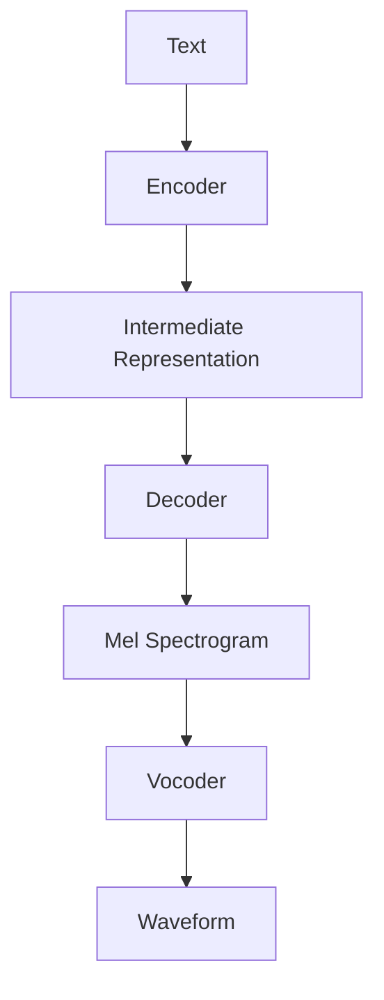

## 1. Background

### 1.1 Pain Points of Traditional TTS Models

Traditional Text-to-Speech (TTS) models have excelled in voice cloning and speech synthesis, typically employing a two-stage process:
1. Acoustic Model (e.g., Tacotron): Converts text into intermediate acoustic representations (such as spectrograms).
2. Vocoder (e.g., WaveGlow, HiFi-GAN): Transforms acoustic representations into waveform audio.

Despite these models' ability to produce realistic sounds, their primary focus remains on replicating a speaker's voice, lacking the flexibility to adapt in dynamic, context-sensitive conversations.

### 1.2 Initial Integration of LLMs: Context-Aware Conversational Voice Models

The emergence of Large Language Models (LLMs) has provided rich reasoning capabilities and contextual understanding. Integrating LLMs into the TTS workflow enables synthesis that goes beyond mere sound production to intelligent conversational responses within context.

Typical cascade workflow (speech-to-speech system):
- STT (Speech-to-Text): e.g., Whisper
- LLM (Contextual Understanding and Generation): e.g., fine-tuned Llama
- TTS (Text-to-Speech): e.g., ElevenLabs

Example workflow:
```
Speech-to-Text  (e.g., Whisper)       : "Hello friend, how are you?"
Conversational LLM (e.g., Llama)      : "Hi there! I am fine and you?"
Text-to-Speech (e.g., ElevenLabs)     : Generates natural speech response
```

This pipeline approach integrates the strengths of specialized modules but has limitations:
The transcribed text received by the LLM loses rich prosodic and emotional cues from the original speech, resulting in responses that lack the nuanced expression of the original voice.

### 1.3 Direct Speech Input to LLMs: Audio Encoders and Neural Codecs

To address the above bottlenecks, researchers have attempted to directly input speech representations into LLMs. Currently, there are two main approaches to converting continuous high-dimensional speech signals into formats that LLMs can process:

- **Audio Encoders**: Convert continuous speech into discrete tokens, preserving key information such as rhythm and emotion.
  > New Challenge: Audio encoders must balance between preserving critical information and the need for compact, discrete representations.

- **Neural Codecs**: Such as DAC, Encodec, XCodec, which convert audio waveforms into discrete token sequences, bridging the gap between continuous audio and discrete token requirements.
  > New Challenge: Audio tokens are far more numerous than text, and the quantization process may lead to loss of details.

## 2. TTS Model Structure

The basic structural flow of traditional TTS models is typically as follows:



This workflow includes several key components:

1. **Text Encoder**: Responsible for converting input text into an intermediate representation, usually a deep learning model such as a Transformer or CNN. The encoder needs to understand the semantics, syntactic structure of the text, and extract pronunciation-related features.

2. **Intermediate Representation**: The bridge connecting the encoder and decoder, typically a set of vectors or feature maps containing the semantic information of the text and some preliminary acoustic features.

3. **Decoder**: Converts the intermediate representation into acoustic features, such as Mel spectrograms. The decoder needs to consider factors like prosody, rhythm, and pauses in speech.

4. **Vocoder**: Transforms acoustic features (such as Mel spectrograms) into final waveform audio. Modern vocoders like HiFi-GAN and WaveGlow can generate high-quality speech waveforms.

## 3. In-Depth Analysis of Audio Encoder Technology

Audio encoders are crucial bridges connecting continuous speech signals with discrete token representations. Below, we delve into several mainstream audio encoding technologies and their working principles.

### 3.1 VQ-VAE (Vector Quantized Variational Autoencoder)

VQ-VAE is an effective method for converting continuous audio signals into discrete codes. Its working principle is as follows:

1. **Encoding Stage**: Uses an encoder network to convert input audio into continuous latent representations.
2. **Quantization Stage**: Maps continuous latent representations to the nearest discrete codebook vectors.
3. **Decoding Stage**: Uses a decoder network to reconstruct audio signals from quantized latent representations.

The advantage of VQ-VAE lies in its ability to learn compact discrete representations while preserving key information needed for audio reconstruction. However, it also faces challenges such as low codebook utilization (codebook collapse) and trade-offs between reconstruction quality and compression rate.

### 3.2 Encodec

Encodec is an efficient neural audio codec proposed by Meta AI, combining the ideas of VQ-VAE with multi-level quantization techniques:

1. **Multi-Resolution Encoding**: Uses encoders with different time resolutions to capture audio features at different time scales.
2. **Residual Quantization**: Adopts a multi-level quantization strategy, with each level of quantizer processing the residual error from the previous level.
3. **Variable Bit Rate**: Supports different compression levels, allowing for adjustment of the balance between bit rate and audio quality according to needs.

A significant advantage of Encodec is its ability to maintain good audio quality at extremely low bit rates, making it particularly suitable for speech synthesis and audio transmission applications.

### 3.3 DAC (Discrete Autoencoder for Audio Compression)

DAC is a discrete autoencoder designed specifically for audio compression, with features including:

1. **Hierarchical Quantization**: Uses a multi-level quantization structure, with different levels capturing different levels of audio detail.
2. **Context Modeling**: Utilizes autoregressive models to model quantized token sequences, capturing temporal dependencies.
3. **Perceptual Loss Function**: Combines spectral loss and adversarial loss to optimize audio quality as perceived by the human ear.

DAC maintains excellent audio quality even at high compression rates, making it particularly suitable for speech synthesis applications requiring efficient storage and transmission.

## 4. Audio Data Formats and Transmission in TTS Systems

In TTS systems, the choice of audio formats and transmission methods is crucial for practical applications. This chapter details the various audio formats, transmission protocols, and frontend processing techniques used in TTS systems.

### 4.1 Common Audio Formats and Their Characteristics

TTS systems support multiple audio formats, each with specific use cases and trade-offs. Here are the most commonly used formats:

#### 4.1.1 PCM (Pulse Code Modulation)

**Characteristics:**
- **No Compression**: Raw audio data without any compression
- **Bit Depth**: Typically 16-bit (also 8-bit, 24-bit, 32-bit, etc.)
- **Simple Format**: Directly represents audio waveform as digital samples
- **File Size**: Large, about 2.8MB for one minute of 24kHz/16-bit mono audio
- **Processing Overhead**: Low, no decoding required
- **Quality**: Lossless, preserves all original audio information

**Use Cases:**
- Internal audio processing pipelines
- Real-time applications requiring low latency
- Intermediate format for further processing

#### 4.1.2 Opus

**Characteristics:**
- **High Compression Ratio**: Much smaller than PCM while maintaining high quality
- **Low Latency**: Encoding/decoding delay as low as 20ms
- **Variable Bitrate**: 6kbps to 510kbps
- **Adaptive**: Can adjust based on network conditions
- **Designed for Network Transmission**: Strong packet loss resistance
- **Open Standard**: Royalty-free, widely supported

**Use Cases:**
- Network streaming
- WebRTC applications
- Real-time communication systems
- WebSocket audio transmission

**Opus Encoding Configuration:**
- **Sample Rate**: 24000 Hz
- **Channels**: 1 (Mono)
- **Bitrate**: 32000 bps (32 kbps)
- **Frame Size**: 480 samples (corresponding to 20ms@24kHz)
- **Complexity**: 5 (balanced setting)

#### 4.1.3 MP3

**Characteristics:**
- **High Compression Ratio**: Much smaller than PCM
- **Wide Compatibility**: Supported by almost all devices and platforms
- **Variable Bitrate**: Typically 32kbps to 320kbps
- **Lossy Compression**: Loses some audio information
- **Encoding/Decoding Delay**: Higher, not suitable for real-time applications
- **File Size**: Medium, about 1MB for one minute of audio (128kbps)

**Use Cases:**
- Non-real-time applications
- Scenarios requiring wide compatibility
- Audio storage and distribution

#### 4.1.4 WAV

**Characteristics:**
- **Container Format**: Typically contains PCM data
- **No Compression**: Large files
- **Metadata Support**: Contains information about sample rate, channels, etc.
- **Wide Compatibility**: Supported by almost all audio software
- **Simple Structure**: Easy to process
- **Quality**: Typically lossless

**Use Cases:**
- Audio archiving
- Professional audio processing
- Testing and development environments

### 4.2 TTS Interface Transmission Technologies

#### 4.2.1 Basic Audio Parameters
In TTS systems, audio data typically has the following basic parameters:
- **Sample Rate**: Typically 24000 Hz (24 kHz)
- **Channels**: 1 (Mono)
- **Bit Depth**: 16-bit (Int16)

#### 4.2.2 Transmission Protocols

**HTTP REST API**
- **Content-Type**: `audio/opus`
- **Custom Header**: `X-Sample-Rate: 24000`
- **Data Format**: Raw Opus encoded data (non-OggS container)

**WebSocket Protocol**
- **Subprotocol**: `tts-1.0`
- **Message Structure**: 1 byte type + 4 bytes length (little-endian) + payload
- **Audio Message Type**: `AUDIO = 0x12`
- **Audio Data**: Raw Opus encoded data

#### 4.2.3 Frontend Processing Techniques

The frontend of TTS systems needs to process received audio data, primarily in two ways:

**WebCodecs API Decoding**
- Uses browser hardware acceleration to decode Opus data
- Converts decoded data to Float32Array for Web Audio API

**PCM Direct Processing**
- Converts Int16 PCM data to Float32 audio data (range from -32768~32767 to -1.0~1.0)
- Creates AudioBuffer and plays through Web Audio API

#### 4.2.4 Audio Processing Enhancements
- **Fade In/Out Effects**: Configurable audio fade in/out processing, default 10ms
- **Audio Gain Adjustment**: Adjustable volume
- **Watermarking**: Optional audio watermarking functionality
- **Adaptive Batch Processing**: Dynamically adjusts audio processing batch size based on performance

### 4.3 Audio Data Flow in TTS Systems

In TTS models, audio data follows this flow from generation to playback:


### 4.4 Format Selection in Practical Applications

In practical TTS applications, format selection is primarily based on the use case:

**Real-time Streaming TTS Applications**
- **Opus** is preferred due to its low latency characteristics and high compression ratio
- Suitable for voice assistants, real-time dialogue systems, online customer service, etc.

**Non-real-time TTS Applications**
- **MP3** is more commonly used because it's supported by almost all devices and platforms
- Suitable for audiobooks, pre-recorded announcements, content distribution, etc.

**Internal System Processing**
- **PCM** format is commonly used for internal processing, providing highest quality and lowest processing delay
- Suitable for intermediate stages in audio processing pipelines

**Archiving and Professional Applications**
- **WAV** format is suitable for scenarios requiring metadata preservation and highest quality
- Suitable for professional audio editing, archiving, and quality assessment

## 5. Integration of Neural Codecs with LLMs

The fusion of neural codecs with LLMs is a key step in achieving end-to-end speech understanding and generation. This fusion faces several technical challenges:

### 5.1 Token Rate Mismatch Problem

Speech signals have a much higher information density than text, resulting in far more audio tokens than text tokens. For example, one second of speech might require hundreds of tokens to represent, while the corresponding text might only need a few tokens. This mismatch poses challenges for LLM processing.

Solutions include:
- **Hierarchical Encoding**: Using multi-level encoding structures to capture information at different time scales
- **Downsampling Strategies**: Downsampling in the time dimension to reduce the number of tokens
- **Attention Mechanism Optimization**: Designing special attention mechanisms to effectively handle long token sequences

### 5.2 Cross-Modal Representation Alignment

Text and speech are information from two different modalities, with natural differences in their representation spaces. To achieve effective fusion, the representation alignment problem needs to be solved.

Main methods include:
- **Joint Training**: Simultaneously training text encoders and audio encoders to align their representation spaces
- **Contrastive Learning**: Using contrastive loss functions to bring related text and speech representations closer while pushing unrelated representations apart
- **Cross-Modal Transformers**: Designing specialized Transformer architectures to handle multi-modal inputs and learn relationships between them

### 5.3 Context-Aware Speech Synthesis

Traditional TTS models often lack understanding of context, resulting in generated speech lacking appropriate emotional and prosodic variations. After fusion with LLMs, models can generate more natural speech based on conversation context.

Key technologies include:
- **Context Encoding**: Encoding conversation history into context vectors that influence speech generation
- **Emotion Control**: Automatically adjusting the emotional color of speech based on context understanding
- **Prosody Modeling**: Adjusting speech rhythm, pauses, and stress according to semantic importance and conversation state

## 6. Future Development Directions

As technology continues to advance, TTS models are developing in the following directions:

### 6.1 End-to-End Multimodal Models

Future voice models will break down barriers between modules, achieving true end-to-end training and inference. Such models will be able to generate natural speech outputs directly from raw inputs (text, speech, images, etc.) without explicit conversion of intermediate representations.

### 6.2 Personalization and Adaptability

Next-generation TTS models will place greater emphasis on personalization and adaptability, automatically adjusting speech characteristics based on user preferences, conversation history, and environmental factors, providing a more natural and humanized interaction experience.

### 6.3 Low-Resource Scenario Optimization

For low-resource languages and special application scenarios, researchers are exploring how to leverage transfer learning, meta-learning, and data augmentation techniques to build high-quality TTS models under limited data conditions.

### 6.4 Real-Time Interactive Speech Synthesis

With the advancement of algorithms and hardware, real-time interactive speech synthesis will become possible, supporting more natural and fluid human-machine dialogue, providing better user experiences for virtual assistants, customer service robots, and metaverse applications.

## 7. Conclusion

Speech synthesis technology is undergoing a significant transformation from traditional TTS to multimodal voice models. Through the integration of large language models, neural codecs, and advanced audio processing technologies, modern TTS models can not only generate high-quality speech but also understand context, express emotions, and naturally adapt in dynamic conversations. Despite facing many challenges, with continuous technological advancement, we can expect more intelligent, natural, and personalized voice interaction experiences.