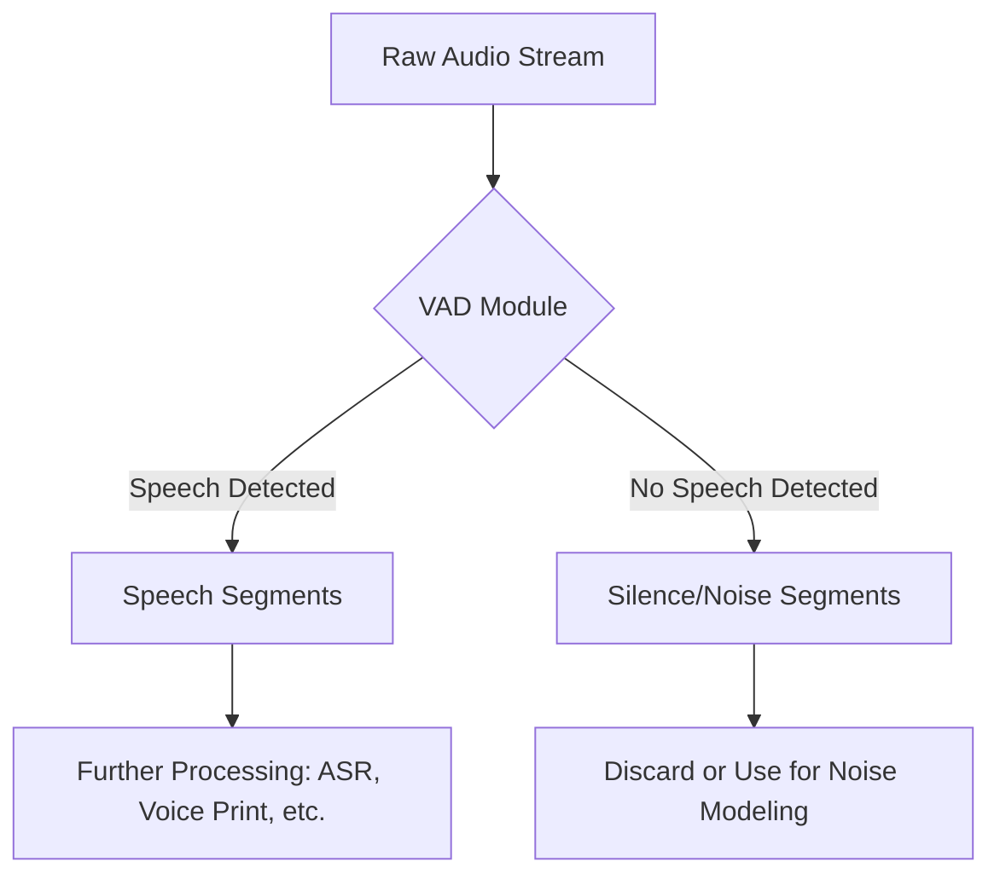
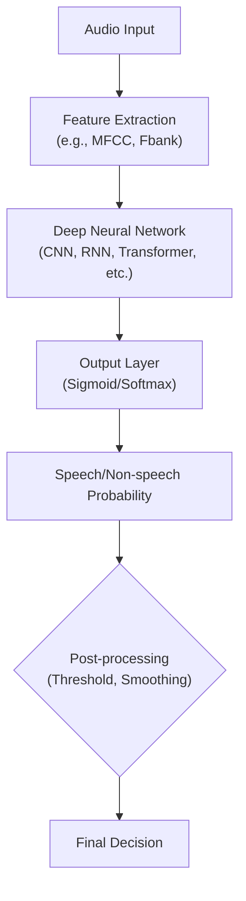
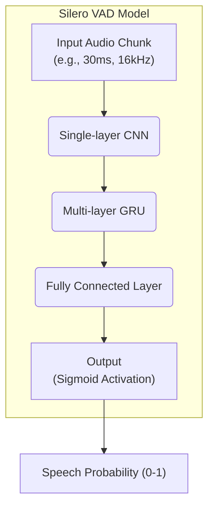
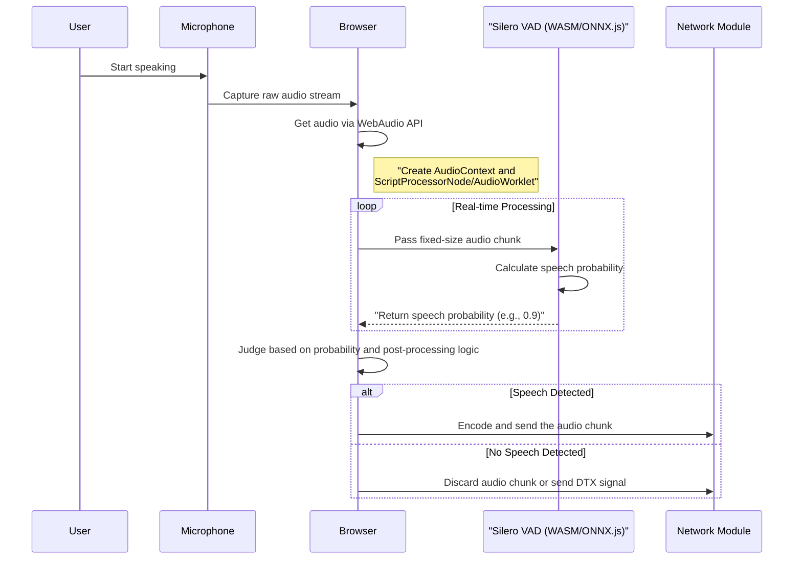
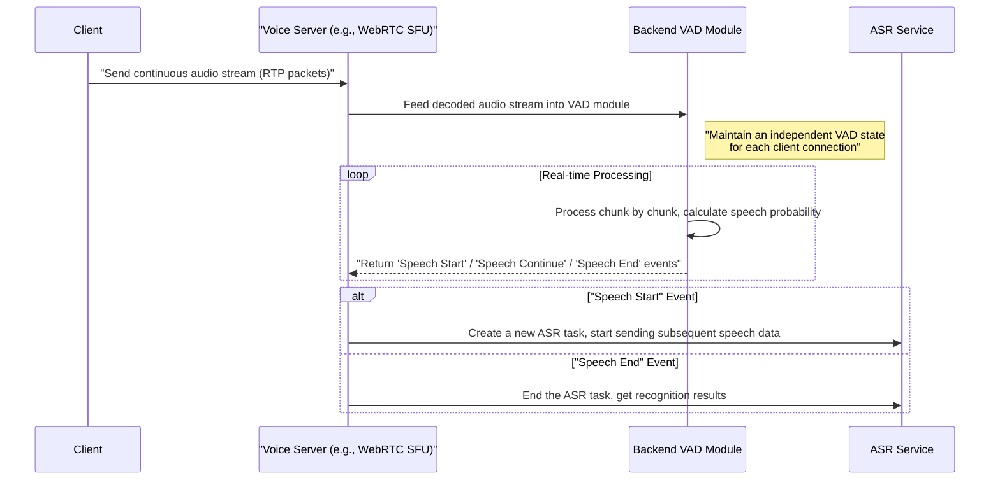

## 1. VAD Technology Overview: A Macro-level Understanding

### 1.1 What is VAD?

VAD (Voice Activity Detection) is a technology designed to accurately identify the presence of human speech in audio signals. Its core task is to segment an audio stream into two parts: **segments containing speech** and **silent/noise segments without speech**.

From a macro perspective, VAD serves as the "gatekeeper" or "preprocessor" in the speech processing pipeline. It is crucial and typically the first step in any system that needs to process human speech.

### 1.2 Why is VAD So Important?

The value of VAD is reflected in several key aspects:

*   **Conserving Computational Resources**: In compute-intensive tasks like automatic speech recognition (ASR), processing only detected speech segments avoids unnecessary computation on silence and background noise, saving 50% or more of CPU/GPU resources.
*   **Improving Downstream Task Accuracy**: Removing silent segments reduces interference for ASR models, voice print recognition models, or emotion analysis models, thereby improving their accuracy.
*   **Optimizing Network Bandwidth**: In real-time voice communication (like VoIP, WebRTC), silent segments can be either not transmitted or transmitted at extremely low bit rates (known as "Discontinuous Transmission", DTX), significantly reducing network bandwidth usage.
*   **Enhancing User Experience**: In smart assistants and voice interaction scenarios, precise VAD enables more natural interaction, avoiding premature interruption of recognition during user pauses or false triggering in noisy environments.
*   **Data Preprocessing and Annotation**: When building large speech datasets, VAD can automatically segment and annotate effective speech segments, greatly improving data processing efficiency.

## 2. Traditional VAD Implementation Methods

Before deep learning became popular, VAD primarily relied on manually designed acoustic features. These methods are computationally simple and fast but have poor robustness in complex noisy environments.

The main methods include:

*   **Energy-based**: The simplest method. It's generally assumed that the short-time energy of speech signals is much greater than background noise. Speech and silence are distinguished by setting an energy threshold.
    *   **Advantage**: Extremely simple computation.
    *   **Disadvantage**: Very sensitive to noise and volume changes, with thresholds difficult to set.
*   **Zero-Crossing Rate (ZCR)**: ZCR describes the frequency at which a signal crosses zero. Unvoiced sounds (like 's') have a higher ZCR, while voiced sounds and background noise have a lower ZCR.
    *   **Advantage**: Not sensitive to broadband noise.
    *   **Disadvantage**: Poor discrimination between certain unvoiced sounds and noise.
*   **Spectral Features**: Such as spectral entropy, spectral flatness, etc. Speech signals typically have more complex and regular spectral structures than noise, resulting in lower spectral entropy and less flat spectra.
*   **Combined Features**: In practical applications, multiple features (such as energy+ZCR) are often combined with smoothing filter techniques to enhance stability. The famous **WebRTC VAD** is a classic example based on Gaussian Mixture Models (GMM), extracting features across multiple frequency bands with good performance and efficiency.

## 3. Deep Learning-based VAD

With the development of deep learning, neural network-based VAD methods far outperform traditional methods, especially in low signal-to-noise ratio (SNR) and complex noise environments. The core idea is to **let the model automatically learn the distinguishing features between speech and non-speech from data**, rather than relying on manually designed rules.

The general workflow for these models is as follows:

## 4. In-depth Analysis of the Silero VAD Model

**Silero VAD** is one of the leading VAD models in the industry, renowned for its **extremely high accuracy, amazing computational efficiency, and universality across multiple languages**. Its achievements are primarily based on the `snakers4/silero-vad` repository.

### 4.1 Core Features

*   **High Precision**: Its accuracy rivals or even surpasses many large, complex models in various noisy environments.
*   **Extremely Lightweight**: The model size is very small (typically less than 1MB), making it easy to deploy on browsers, mobile devices, and even embedded systems.
*   **Language-Independent**: It is not trained on specific languages but learns the universal acoustic characteristics of human speech, making it effective for almost all languages worldwide.
*   **Real-time Performance**: Extremely low processing latency, making it ideal for real-time communication applications.

### 4.2 Model Architecture

The core architecture of Silero VAD is a hybrid **CNN + GRU** model. This architecture combines the advantages of both:

*   **CNN (Convolutional Neural Network)**: Used to extract local features with translation invariance from raw audio or spectrograms. CNNs can effectively capture the instantaneous characteristics of sound events.
*   **GRU (Gated Recurrent Unit)**: A type of RNN (Recurrent Neural Network) used to process sequential data. It can capture the contextual dependencies of audio signals in the time dimension, such as the beginning and end of a syllable.

Its detailed architecture can be macroscopically understood as:

**Diving into the details**:

1.  **Input**: The model receives a small segment of audio as input, such as a 480-sample chunk (equivalent to 30 milliseconds at a 16kHz sampling rate). The model processes **chunk-by-chunk**.
2.  **Feature Extraction**: Unlike many models, Silero VAD may operate directly on raw waveforms or very low-level features, with the first CNN layer automatically learning effective acoustic features, rather than relying on manually designed features like MFCC.
3.  **CNN Layer**: This layer acts like a filter bank, scanning the input audio chunk to capture phoneme-level micro-patterns.
4.  **GRU Layer**: This is the memory core of the model. The feature vector of each audio chunk after CNN processing is fed into the GRU. The internal state of the GRU is updated based on the current input and the previous state. This allows the model to understand "whether the sound I'm hearing now is a continuation of the previous sound or the beginning of a completely new sound event." This is crucial for accurately judging the first word after a long silence or brief pauses in the middle of a sentence.
5.  **Fully Connected Layer & Output**: The output of the GRU goes through one or more fully connected layers for integration, and finally through a `Sigmoid` function, outputting a floating-point number between 0 and 1. This number represents **the probability that the current input audio chunk contains speech**.

### 4.3 Technical Implementation Details

*   **State Maintenance (Stateful)**: To process continuous audio streams, Silero VAD is a stateful model. You need to maintain an internal state of the model (mainly the hidden state of the GRU) for each independent audio stream. After processing an audio chunk, the model's hidden state needs to be saved and used as input for processing the next audio chunk. This enables uninterrupted real-time detection.
*   **Sampling Rate Support**: Typically supports 8kHz and 16kHz, which are the most common sampling rates in voice communication.
*   **Audio Chunk Size**: The model has strict requirements for the size of input audio chunks, such as 256, 512, 768 (8kHz) or 512, 1024, 1536 (16kHz) samples. Developers need to buffer and segment the audio stream from microphones or networks into these fixed-size chunks.
*   **Post-processing**: The model only outputs the speech probability for a single chunk. In practical applications, a simple post-processing logic is also needed. For example:
    *   `trigger_level`: Speech activation threshold (e.g., 0.5).
    *   `speech_pad_ms`: Additional audio retention after the speech end signal is issued, to prevent premature cutting.
    *   `min_silence_duration_ms`: Minimum duration required to be classified as a silence segment.
    *   `min_speech_duration_ms`: Minimum duration required to be classified as a speech segment, preventing brief noises (like coughs) from being misclassified as speech.

## 5. Application of VAD in Real-time Voice Communication

### 5.1 Frontend Applications (Browser/Client)

Running VAD on the frontend allows processing of voice data before it leaves the user's device, achieving maximum bandwidth savings and minimal latency.

**Typical Scenarios**: Web-based online meetings, browser-embedded customer service dialogue systems.

**Implementation Process**:

**Technology Stack**:

*   **Audio Capture**: `navigator.mediaDevices.getUserMedia()`
*   **Audio Processing**: Web Audio API (`AudioContext`, `AudioWorkletNode`)
*   **VAD Model Running**:
    *   **WebAssembly (WASM)**: Compile the VAD inference engine implemented in C++/Rust into WASM for near-native performance. Silero officially provides such an implementation.
    *   **ONNX.js / TensorFlow.js**: Convert the VAD model to ONNX or TF.js format to run directly in JavaScript, simpler to deploy but slightly lower performance than WASM.

### 5.2 Backend Applications (Server)

Running VAD on the backend allows centralized processing of all incoming audio streams, suitable for scenarios where client behavior cannot be controlled, or server-side recording and analysis are needed.

**Typical Scenarios**: ASR as a service, mixing and recording of multi-party calls, intelligent voice monitoring.

**Implementation Process**:

**Technology Stack**:

*   **Voice Server**: Open-source projects like `livekit`, `ion-sfu`, or self-developed media servers.
*   **VAD Module**: Typically implemented in Python, C++, or Go, directly calling Silero's PyTorch model or its ONNX/C++ implementation.
*   **Inter-service Communication**: If VAD is an independent microservice, gRPC or message queues can be used to communicate with the main business server.

## 6. Summary and Outlook

Although VAD seems like a simple task, it is the cornerstone of building efficient, intelligent voice applications.

*   **Traditional VAD** is simple and fast but struggles in complex scenarios.
*   **Modern deep learning VAD represented by Silero VAD**, through clever model design, has achieved a perfect balance in **accuracy, efficiency, and universality**, pushing high-quality VAD technology to unprecedented popularity, making it easy to deploy on any device from cloud to edge.

In the future, VAD technology may evolve in more refined directions, such as:

*   **Deeper integration with noise suppression**: Not just detecting speech, but directly outputting clean speech.
*   **Multimodal detection**: Combining lip movement information from video (Lip-VAD) to achieve even greater accuracy.
*   **More complex acoustic scene understanding**: Not only distinguishing between speech and non-speech but also differentiating between different types of non-speech (such as music, applause, environmental noise), providing richer contextual information for downstream tasks.