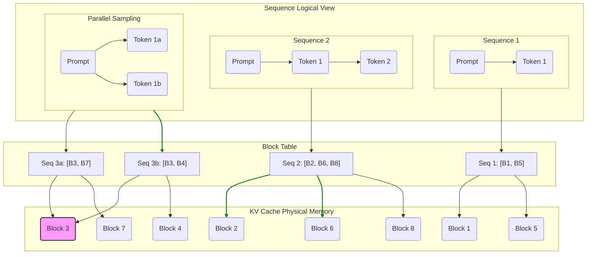
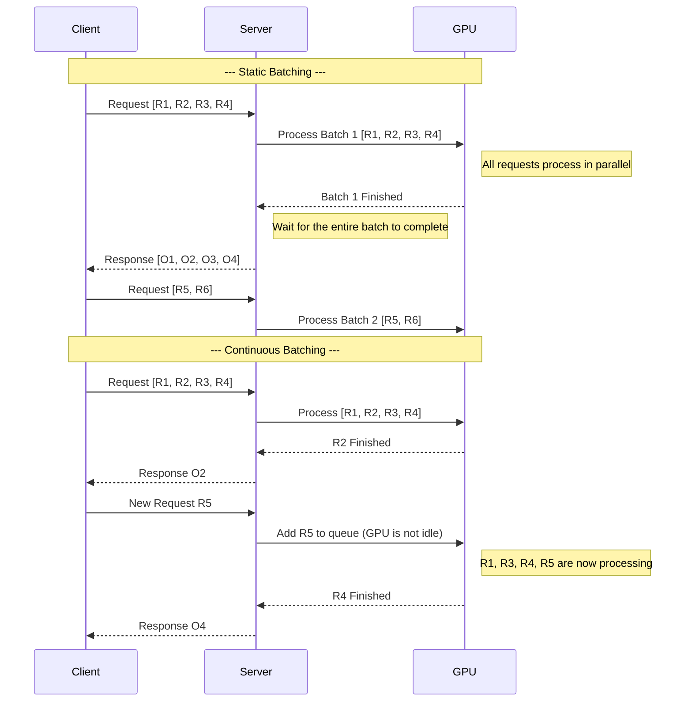

# vLLM Deep Dive: Technical Principles and Practical Guide

## 1. Introduction to vLLM

vLLM is an open-source inference and serving engine designed for large language models (LLMs), renowned for its high throughput and memory efficiency. In the field of LLM serving, vLLM addresses a core pain point: traditional inference systems are inefficient when handling the key-value cache (KV Cache) in Transformer models' attention mechanism, resulting in significant memory waste and limited inference speed.

The memory bottleneck in LLM inference primarily stems from the KV Cache. This cache stores attention keys and values for each previous token in a sequence to accelerate the generation of subsequent tokens. However, the size of the KV Cache is dynamic and difficult to predict, creating enormous challenges for memory management. Traditional systems (like HuggingFace Transformers) typically pre-allocate a large continuous memory space to store the KV Cache, leading to severe memory fragmentation and waste.

vLLM fundamentally solves this problem by introducing its core innovation: the **PagedAttention** mechanism.

## 2. Core Features and Advantages

vLLM stands out among numerous LLM inference frameworks thanks to several key features:

- **Extremely High Throughput**: Through PagedAttention and Continuous Batching, vLLM significantly improves GPU utilization. Its throughput is several times higher than HuggingFace Transformers and outperforms other mainstream inference libraries.
- **Efficient Memory Management**: The PagedAttention mechanism divides the KV Cache into non-continuous memory blocks, greatly reducing internal and external memory fragmentation. According to official data, it can save up to 55% of memory, meaning you can load larger models or serve more concurrent requests with the same hardware.
- **Flexible Decoding Strategies**: vLLM supports various complex decoding algorithms, including Parallel Sampling, Beam Search, and Top-K/Top-P sampling, meeting the needs of different application scenarios.
- **OpenAI API Compatibility**: vLLM provides a service endpoint that is fully compatible with the OpenAI API. This means you can seamlessly integrate vLLM into existing application ecosystems built on the OpenAI API with just a few configuration changes.
- **Distributed Inference**: For ultra-large models that cannot fit on a single GPU, vLLM supports Tensor Parallelism, distributing model weights and computational load across multiple GPUs for efficient distributed inference.
- **Streaming and Structured Output**: Supports streaming of generated tokens and can produce structured outputs in specific formats (such as JSON Schema or regular expressions) through Guided Generation.

## 3. Core Architecture: Deep Dive into PagedAttention

PagedAttention is the soul of vLLM, with its design inspiration coming from the paging technique used in modern operating systems to manage virtual memory.

### 3.1 Working Principle

In traditional methods, the KV Cache for each sequence is stored in continuous memory space. While this approach seems simple, it leads to severe memory fragmentation due to the vast differences in sequence lengths.

PagedAttention divides each sequence's KV Cache into fixed-size **blocks**. Each block can store keys and values for a fixed number of tokens. During inference, vLLM's core scheduler dynamically allocates these blocks to sequences as needed.

The advantages of this design include:

1.  **Eliminating Internal Fragmentation**: Since blocks are of fixed size, a sequence's last block may have some unused space, but this waste is far less than that caused by reserving continuous memory for the entire sequence.
2.  **Flexible Memory Allocation**: Blocks are stored in non-continuous memory space, making memory management more flexible, similar to how operating systems manage physical memory pages.
3.  **Efficient Memory Sharing**: PagedAttention makes sharing KV Cache between different sequences exceptionally simple and efficient. For example, in parallel sampling or beam search, multiple candidate sequences originate from the same prompt. vLLM allows these sequences to share KV blocks storing the prompt portion, only needing to allocate new, independent blocks for each sequence when generating new tokens. This "Copy-on-Write" mechanism greatly reduces the memory overhead of complex decoding algorithms.


Below is a Mermaid diagram that more intuitively illustrates PagedAttention's memory management approach:


*Diagram explanation:*
- **KV Cache Physical Memory**: Represents non-continuous physical memory blocks on the GPU.
- **Sequence Logical View**: Represents multiple requests (sequences) being processed.
- **Block Table**: vLLM's core component that maps logical token positions to physical memory blocks.
- **Memory Sharing**: Note that the two branches in "Parallel Sampling" (3a and 3b) share the same Prompt block (B3), demonstrating PagedAttention's efficient memory sharing.

### 3.2 Continuous Batching

Based on PagedAttention, vLLM implements a more advanced batching strategy—continuous batching. Traditional static batching requires waiting for all sequences in a batch to complete generation before processing the next batch. Continuous batching, however, allows new requests to be inserted into the batch immediately after a sequence in the batch completes generation, avoiding GPU idle waiting and further improving throughput.

Below is a comparison of the two batching methods using a Mermaid sequence diagram:



## 4. Quick Start Guide

Below, we'll demonstrate how to install and use vLLM through a few simple steps.

### 4.1 Installation

You can install vLLM using either `pip` or `uv` (a faster package installation tool). Using `uv` is recommended as it can automatically detect your CUDA version and install the matching PyTorch backend.

**Using uv (recommended):**
```bash
# Create and activate a virtual environment
uv venv
source .venv/bin/activate

# Install vLLM
uv pip install vllm --torch-backend=auto
```

**Using pip:**
```bash
pip install vllm
```

### 4.2 Offline Inference

The `vllm.LLM` class makes offline inference very convenient.

```python
from vllm import LLM, SamplingParams

# Define input prompts
prompts = [
    "Hello, my name is",
    "The capital of France is",
    "The future of AI is",
]

# Define sampling parameters
sampling_params = SamplingParams(temperature=0.8, top_p=0.95)

# Initialize the LLM engine (model will be automatically downloaded from Hugging Face)
llm = LLM(model="facebook/opt-125m")

# Generate text
outputs = llm.generate(prompts, sampling_params)

# Print results
for output in outputs:
    prompt = output.prompt
    generated_text = output.outputs[0].text
    print(f"Prompt: {prompt!r}, Generated text: {generated_text!r}")
```

### 4.3 Launching an OpenAI-Compatible Server

One of vLLM's most powerful features is its built-in API server. With just one command, you can start a service compatible with the OpenAI API.

```bash
vllm serve Qwen/Qwen2.5-1.5B-Instruct
```

By default, the server will run on `http://localhost:8000`.

### 4.4 Interacting with the Server

You can interact with the server using `curl` or the `openai` Python client.

**Using curl:**
```bash
curl http://localhost:8000/v1/completions \
    -H "Content-Type: application/json" \
    -d '{
        "model": "Qwen/Qwen2.5-1.5B-Instruct",
        "prompt": "San Francisco is a",
        "max_tokens": 7,
        "temperature": 0
    }'
```

**Using the OpenAI Python client:**
```python
from openai import OpenAI

client = OpenAI(
    base_url="http://localhost:8000/v1",
    api_key="not-used"  # API key is not required
)

completion = client.chat.completions.create(
    model="Qwen/Qwen2.5-1.5B-Instruct",
    messages=[
        {"role": "system", "content": "You are a helpful assistant."},
        {"role": "user", "content": "Who won the world series in 2020?"}
    ]
)

print(completion.choices[0].message)
```

## 5. Model Serving

### 5.1 Distributed Serving

If a model is too large to fit on a single GPU, you can distribute it across multiple GPUs using tensor parallelism.

```bash
# Start a service on 4 GPUs
vllm serve facebook/opt-13b --tensor-parallel-size 4
```

### 5.2 Docker Deployment

vLLM provides official Docker images for convenient containerized deployment.

```bash
docker run --runtime nvidia --gpus all \
    -v ~/.cache/huggingface:/root/.cache/huggingface \
    --env "HUGGING_FACE_HUB_TOKEN=<your-hf-token>" \
    -p 8000:8000 \
    --ipc=host \
    vllm/vllm-openai:latest \
    --model mistralai/Mistral-7B-v0.1
```

## 6. Advanced Features

### 6.1 Structured Outputs

vLLM supports various ways to constrain the model's output format, which is crucial for applications requiring reliable, parsable outputs.

**Generating JSON using Pydantic models:**
```python
from pydantic import BaseModel
from openai import OpenAI

client = OpenAI(base_url="http://localhost:8000/v1", api_key="dummy")
model = client.models.list().data[0].id

class People(BaseModel):
    name: str
    age: int

completion = client.chat.completions.create(
    model=model,
    messages=[
        {"role": "user", "content": "Generate a JSON with the name and age of one random person."}
    ],
    response_format={
        "type": "json_schema",
        "json_schema": {
            "name": "people",
            "schema": People.model_json_schema()
        }
    },
)
print(completion.choices[0].message.content)
```

### 6.2 LoRA Support

vLLM can efficiently serve multiple LoRA adapters on the same base model. This is particularly useful for scenarios requiring customized models for different customers or tasks.

**Starting a server with LoRA support:**
```python
from vllm import LLM

llm = LLM(model="meta-llama/Llama-2-7b-hf", enable_lora=True)
```

**Specifying a LoRA adapter in a request:**
```bash
curl http://localhost:8000/v1/completions \
    -H "Content-Type: application/json" \
    -d '{
        "model": "sql-lora", # Specify the LoRA model ID
        "prompt": "San Francisco is a",
        "max_tokens": 7
    }'
```

### 6.3 Quantization

Quantization is a technique to reduce model size and memory usage by lowering the precision of model weights. vLLM supports various quantization schemes, such as AWQ and FP8 KV cache.

**Enabling FP8 KV cache:**
```python
from vllm import LLM

llm = LLM(
    model="meta-llama/Llama-2-7b-chat-hf",
    kv_cache_dtype="fp8",
    calculate_kv_scales=True # Dynamically calculate quantization scales
)
```

## 7. Framework Integration

vLLM can be easily integrated with popular LLM application frameworks like Langchain and LlamaIndex for building complex systems such as Retrieval-Augmented Generation (RAG). Typically, vLLM serves as a backend providing fast LLM inference and embedding generation services.

**Installing related dependencies:**
```bash
pip install -U vllm langchain_openai langchain_community
```

Afterward, in Langchain, you can point the `base_url` of `ChatOpenAI` or `OpenAIEmbeddings` to your vLLM server's address to complete the integration.

## 8. Conclusion

Through its innovative PagedAttention architecture, vLLM successfully addresses memory management and performance bottlenecks in LLM inference, providing developers with an extremely efficient, flexible, and easy-to-use inference serving engine. Whether conducting quick offline experiments or deploying production-grade, high-concurrency LLM services, vLLM demonstrates excellent performance and powerful functionality. As the community continues to develop, vLLM is becoming one of the standard tools in the field of LLM serving.