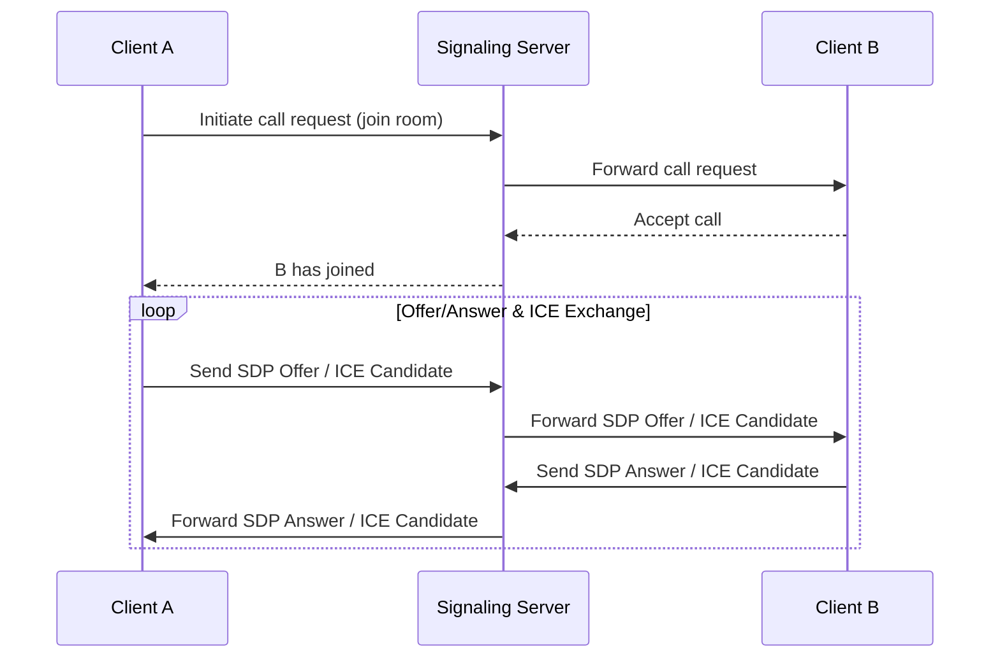
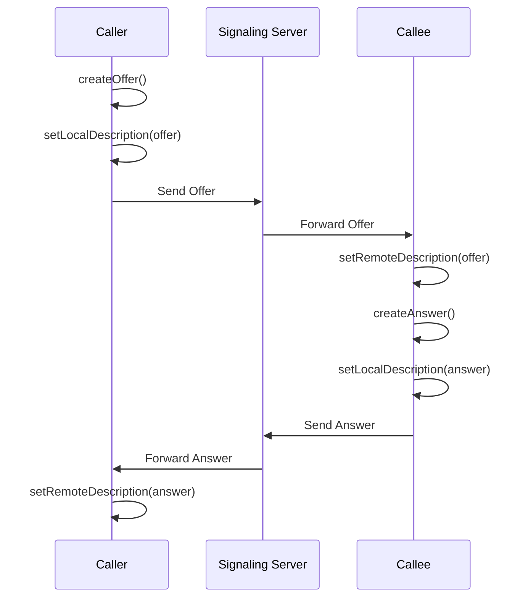
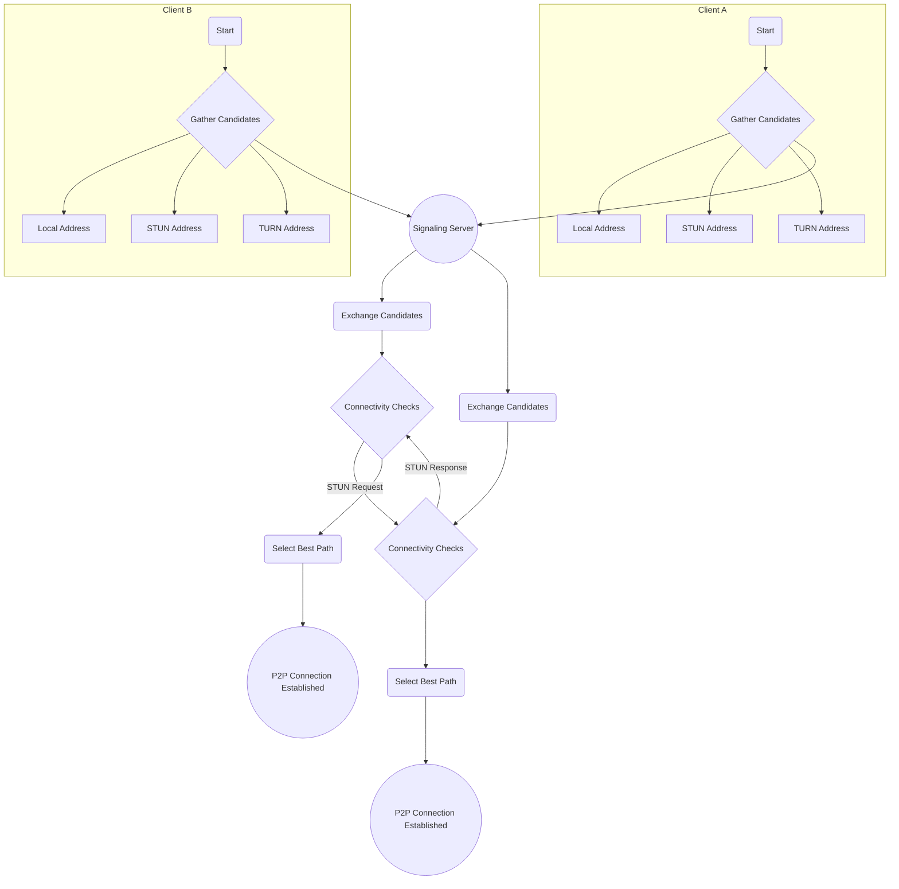

## 1. Introduction

WebRTC (Web Real-Time Communication) is an open-source technology that enables real-time voice and video communication in web browsers. It allows direct peer-to-peer (P2P) audio, video, and data sharing between browsers without requiring any plugins or third-party software.

The main goal of WebRTC is to provide high-quality, low-latency real-time communication, making it easy for developers to build rich communication features into web applications.

### Core Advantages

- **Cross-platform and browser compatibility**: WebRTC is an open standard by W3C and IETF, widely supported by major browsers (Chrome, Firefox, Safari, Edge).
- **No plugins required**: Users can use real-time communication features directly in their browsers without downloading or installing any extensions.
- **Peer-to-peer communication**: When possible, data is transmitted directly between users, reducing server bandwidth pressure and latency.
- **High security**: All WebRTC communications are mandatorily encrypted (via SRTP and DTLS), ensuring data confidentiality and integrity.
- **High-quality audio and video**: WebRTC includes advanced signal processing components like echo cancellation, noise suppression, and automatic gain control to provide excellent audio/video quality.
## 2. Core Concepts

WebRTC consists of several key JavaScript APIs that work together to enable real-time communication.

### 2.1. `RTCPeerConnection`

`RTCPeerConnection` is the core interface of WebRTC, responsible for establishing and managing connections between two peers. Its main responsibilities include:

- **Media negotiation**: Handling parameters for audio/video codecs, resolution, etc.
- **Network path discovery**: Finding the best connection path through the ICE framework.
- **Connection maintenance**: Managing the connection lifecycle, including establishment, maintenance, and closure.
- **Data transmission**: Handling the actual transmission of audio/video streams (SRTP) and data channels (SCTP/DTLS).

An `RTCPeerConnection` object represents a WebRTC connection from the local computer to a remote peer.

### 2.2. `MediaStream`

The `MediaStream` API represents streams of media content. A `MediaStream` object can contain one or more media tracks (`MediaStreamTrack`), which can be:

- **Audio tracks (`AudioTrack`)**: Audio data from a microphone.
- **Video tracks (`VideoTrack`)**: Video data from a camera.

Developers typically use the `navigator.mediaDevices.getUserMedia()` method to obtain a local `MediaStream`, which prompts the user to authorize access to their camera and microphone. The obtained stream can then be added to an `RTCPeerConnection` for transmission to the remote peer.

### 2.3. `RTCDataChannel`

In addition to audio and video, WebRTC supports the transmission of arbitrary binary data between peers through the `RTCDataChannel` API. This provides powerful functionality for:

- **File sharing**
- **Real-time text chat**
- **Online game state synchronization**
- **Remote desktop control**

The `RTCDataChannel` API is designed similarly to WebSockets, offering reliable and unreliable, ordered and unordered transmission modes that developers can choose based on application requirements. It uses the SCTP protocol (Stream Control Transmission Protocol) for transmission and is encrypted via DTLS.
## 3. Connection Process in Detail

Establishing a WebRTC connection is a complex multi-stage process involving signaling, session description, and network path discovery.

### 3.1. Signaling

Interestingly, the WebRTC API itself does not include a signaling mechanism. Signaling is the process of exchanging metadata between peers before establishing communication. Developers must choose or implement their own signaling channel. Common technologies include WebSocket or XMLHttpRequest.

The signaling server acts as an intermediary, helping two clients who want to communicate exchange three types of information:

1.  **Session control messages**: Used to open or close communication.
2.  **Network configuration**: Information about the client's IP address and port.
3.  **Media capabilities**: Codecs and resolutions supported by the client.

This process typically follows these steps:
1.  Client A sends a "request call" message to the signaling server.
2.  The signaling server forwards this request to client B.
3.  Client B agrees to the call.
4.  Afterward, clients A and B exchange SDP and ICE candidates through the signaling server until they find a viable connection path.

### 3.2. Session Description Protocol (SDP)

SDP (Session Description Protocol) is a standard format for describing multimedia connection content. It doesn't transmit media data itself but describes the connection parameters. An SDP object includes:

-   Session unique identifier and version.
-   Media types (audio, video, data).
-   Codecs used (e.g., VP8, H.264, Opus).
-   Network transport information (IP addresses and ports).
-   Bandwidth information.

WebRTC uses the **Offer/Answer model** to exchange SDP information:
1.  The **Caller** creates an **Offer** SDP describing the communication parameters it desires and sends it to the receiver through the signaling server.
2.  The **Callee** receives the Offer and creates an **Answer** SDP describing the communication parameters it can support, sending it back to the caller through the signaling server.
3.  Once both parties accept each other's SDP, they have reached a consensus on the session parameters.

### 3.3. Interactive Connectivity Establishment (ICE)

Since most devices are behind NAT (Network Address Translation) or firewalls and don't have public IP addresses, establishing direct P2P connections becomes challenging. ICE (Interactive Connectivity Establishment) is a framework specifically designed to solve this problem.

The ICE workflow is as follows:
1.  **Gather candidate addresses**: Each client collects its network address candidates from different sources:
    -   **Local addresses**: The device's IP address within the local network.
    -   **Server Reflexive Address**: The device's public IP address and port discovered through a STUN server.
    -   **Relayed Address**: A relay address obtained through a TURN server. When P2P direct connection fails, all data will be forwarded through the TURN server.
2.  **Exchange candidates**: Clients exchange their collected ICE candidate lists through the signaling server.
3.  **Connectivity checks**: Clients pair up the received candidate addresses and send STUN requests for connectivity checks (called "pings") to determine which paths are available.
4.  **Select the best path**: Once a viable address pair is found, the ICE agent selects it as the communication path and begins transmitting media data. P2P direct connection paths are typically prioritized because they have the lowest latency.

## 4. NAT Traversal: STUN and TURN

To achieve P2P connections, WebRTC heavily relies on STUN and TURN servers to solve NAT-related issues.

### 4.1. STUN Servers

STUN (Session Traversal Utilities for NAT) servers are very lightweight, with a simple task: telling a client behind NAT what its public IP address and port are.

When a WebRTC client sends a request to a STUN server, the server checks the source IP and port of the request and returns them to the client. This way, the client knows "what it looks like on the internet" and can share this public address as an ICE candidate with other peers.

Using STUN servers is the preferred approach for establishing P2P connections because they are only needed during the connection establishment phase and don't participate in actual data transmission, resulting in minimal overhead.

### 4.2. TURN Servers

However, in some complex network environments (such as symmetric NAT), peers cannot establish direct connections even if they know their public addresses. This is where TURN (Traversal Using Relays around NAT) servers come in.

A TURN server is a more powerful relay server. When P2P connection fails, both clients connect to the TURN server, which then forwards all audio, video, and data between them. This is no longer true P2P communication, but it ensures that connections can still be established under the worst network conditions.

Using TURN servers increases latency and server bandwidth costs, so they are typically used as a last resort.

## 5. Security

Security is a core principle in WebRTC design, with all communications mandatorily encrypted and unable to be disabled.

- **Signaling security**: The WebRTC standard doesn't specify a signaling protocol but recommends using secure WebSocket (WSS) or HTTPS to encrypt signaling messages.
- **Media encryption**: All audio/video streams use **SRTP (Secure Real-time Transport Protocol)** for encryption. SRTP prevents eavesdropping and content tampering by encrypting and authenticating RTP packets.
- **Data encryption**: All `RTCDataChannel` data is encrypted using **DTLS (Datagram Transport Layer Security)**. DTLS is a protocol based on TLS that provides the same security guarantees for datagrams.

Key exchange is automatically completed during the `RTCPeerConnection` establishment process through the DTLS handshake. This means a secure channel is established before any media or data exchange occurs.
## 6. Practical Application Cases

With its powerful features, WebRTC has been widely applied in various scenarios:

- **Video conferencing systems**: Such as Google Meet, Jitsi Meet, etc., allowing multi-party real-time audio/video calls.
- **Online education platforms**: Enabling remote interactive teaching between teachers and students.
- **Telemedicine**: Allowing doctors to conduct video consultations with patients remotely.
- **P2P file sharing**: Using `RTCDataChannel` for fast file transfers between browsers.
- **Cloud gaming and real-time games**: Providing low-latency instruction and data synchronization for games.
- **Online customer service and video support**: Businesses providing real-time video support services to customers through web pages.

## 7. Conclusion

WebRTC is a revolutionary technology that brings real-time communication capabilities directly into browsers, greatly lowering the barrier to developing rich media applications. Through the three core APIs of `RTCPeerConnection`, `MediaStream`, and `RTCDataChannel`, combined with powerful signaling, ICE, and security mechanisms, WebRTC provides a complete, robust, and secure real-time communication solution.

As network technology develops and 5G becomes more widespread, WebRTC's application scenarios will become even broader, with its potential in emerging fields such as IoT, augmented reality (AR), and virtual reality (VR) gradually becoming apparent. For developers looking to integrate high-quality, low-latency communication features into their applications, WebRTC is undoubtedly one of the most worthwhile technologies to focus on and learn about today.