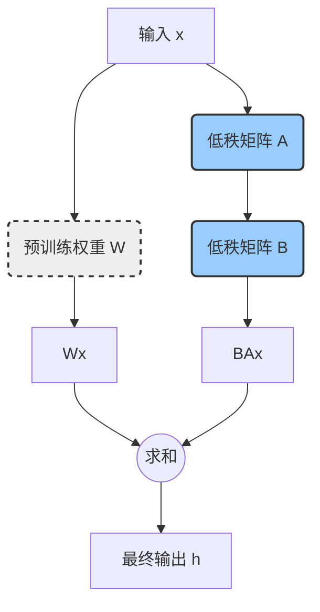

# LoRA 技术文档：深入浅出理解与实战

## 1. 引言：为什么需要 LoRA？

在大型语言模型（LLM）和生成式 AI 飞速发展的今天，我们见证了模型规模的爆炸式增长，从数亿到数万亿参数不等。这些庞大的模型在各种任务上都展现出了惊人的能力。然而，一个巨大的挑战随之而来：如何针对特定的下游任务对这些模型进行微调？

传统的**全量微调（Full Fine-Tuning）**方法，即更新模型的所有参数，面临着严峻的问题：

*   **计算成本高昂**：微调一个数十亿参数的模型需要巨大的计算资源和数百 GB 的显存，这对于大多数开发者和中小型企业来说是难以承受的。
*   **存储成本巨大**：每针对一个任务微调一次，就需要保存一份完整的模型副本，导致存储成本急剧上升。
*   **部署困难**：在生产环境中，为不同任务维护和切换多个庞大的模型副本是一场噩梦。

为了解决这些痛点，**参数高效微调（Parameter-Efficient Fine-Tuning, PEFT）**技术应运而生。其核心思想是在微调过程中冻结大部分预训练模型的参数，只调整一小部分（通常远小于总参数的 1%）新增的或特定的参数。

在众多 PEFT 技术中，**LoRA（Low-Rank Adaptation of Large Language Models）**以其出色的效果、高效的性能和实现的简洁性脱颖而出，成为目前最主流、应用最广泛的方案之一。本篇文档将深入浅出地介绍 LoRA 的核心原理，并提供详细的实战指南。

## 2. 核心原理：LoRA 的魔法

LoRA 的核心假设是：**大型语言模型在适应新任务时，其权重的变化是低秩的（low-rank）**。换句话说，尽管预训练模型的权重矩阵 `W` 非常庞大（例如 `d x d` 维），但在微调过程中，权重的改变量 `ΔW` 具有一个很低的"内在秩"。

基于这个假设，LoRA 不直接更新 `W`，而是通过训练两个更小的、低秩的矩阵 `B` 和 `A` 来近似 `ΔW`，即 `ΔW ≈ BA`。

*   `W` 是预训练好的、被冻结的权重矩阵。
*   `A` 是一个 `r x d` 维的矩阵，其中 `r` 是一个远小于 `d` 的秩（rank）。
*   `B` 是一个 `d x r` 维的矩阵。

在微调过程中，只有矩阵 `A` 和 `B` 的参数是可训练的。前向传播的计算过程也相应地变为：

`h = Wx + BAx`

下面是一个图示，更直观地展示了这个过程：

其中 `x` 是输入，`h` 是输出。这种方式极大地减少了需要训练的参数数量。例如，如果 `d = 4096`，`r = 8`，那么原始矩阵 `W` 有 `4096 * 4096 ≈ 16.7M` 个参数，而 `A` 和 `B` 加起来只有 `4096 * 8 + 8 * 4096 ≈ 65K` 个参数，参数量减少了约 256 倍！

**关键参数 `r`**：秩 `r` 是 LoRA 中最重要的超参数。它控制了低秩矩阵的大小，直接决定了新增参数的数量。
*   **较小的 `r`**：可训练参数少，训练速度快，显存占用低，但可能无法充分学习到任务的复杂特征。
*   **较大的 `r`**：可训练参数多，模型拟合能力更强，但会增加计算成本和过拟合的风险。
在实践中，`r` 通常被设置为 8, 16, 32 或 64，就能在性能和效率之间取得很好的平衡。