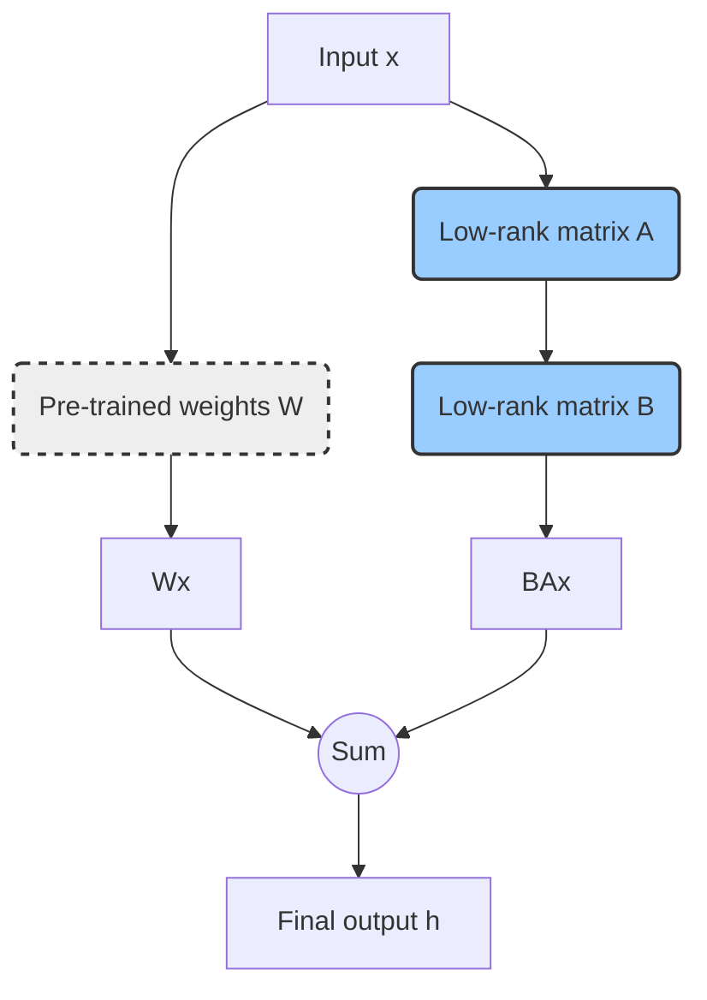
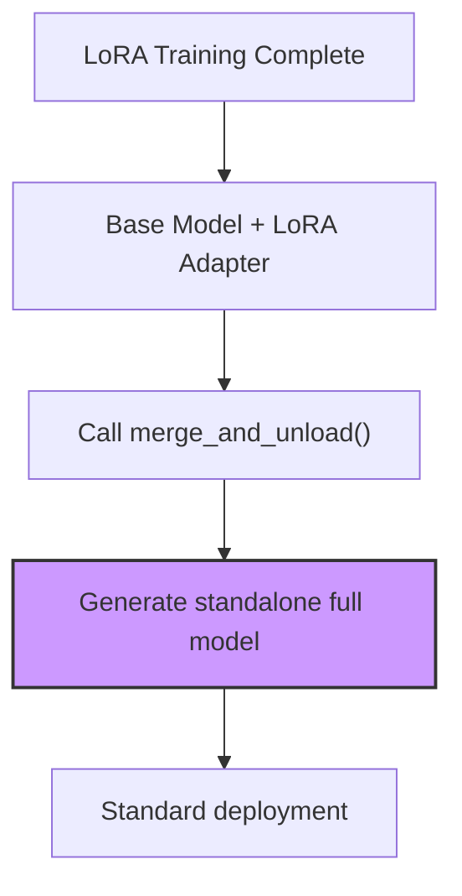
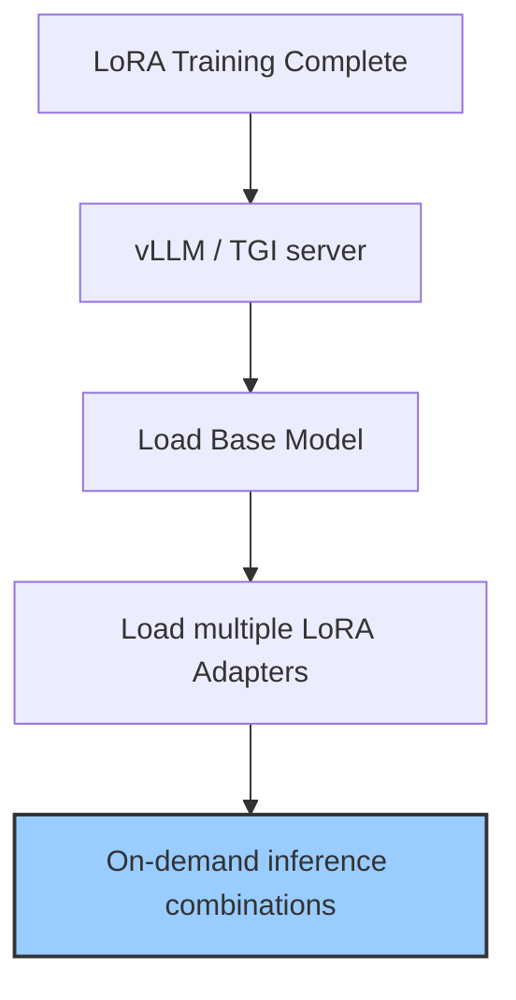

# LoRA Technical Documentation: A Comprehensive Guide

## 1. Introduction: Why LoRA?

In today's rapidly evolving landscape of Large Language Models (LLMs) and generative AI, we've witnessed an explosive growth in model sizes, ranging from hundreds of millions to trillions of parameters. These massive models demonstrate remarkable capabilities across various tasks. However, a significant challenge emerges: how can we fine-tune these models for specific downstream tasks?

The traditional **Full Fine-Tuning** approach, which updates all parameters of a model, faces severe challenges:

*   **High computational cost**: Fine-tuning a model with billions of parameters requires enormous computational resources and hundreds of GB of GPU memory, which is prohibitively expensive for most developers and small to medium-sized enterprises.
*   **Massive storage requirements**: Each fine-tuned model for a specific task requires storing a complete model copy, leading to rapidly escalating storage costs.
*   **Deployment difficulties**: Maintaining and switching between multiple massive model copies for different tasks in a production environment is a nightmare.

To address these pain points, **Parameter-Efficient Fine-Tuning (PEFT)** techniques have emerged. The core idea is to freeze most parameters of the pre-trained model during fine-tuning and only adjust a small portion (typically far less than 1% of the total) of new or specific parameters.

Among the various PEFT techniques, **LoRA (Low-Rank Adaptation of Large Language Models)** stands out for its excellent performance, efficiency, and implementation simplicity, becoming one of the most mainstream and widely applied solutions today. This document will provide an in-depth yet accessible introduction to the core principles of LoRA and offer detailed practical guidance.

## 2. Core Principles: The Magic of LoRA

LoRA's core assumption is that **the weight changes in large language models when adapting to new tasks are low-rank**. In other words, although the weight matrix `W` of the pre-trained model is very large (e.g., `d x d` dimensions), the weight change `ΔW` during fine-tuning has a very low "intrinsic rank."

Based on this assumption, LoRA doesn't directly update `W`, but instead approximates `ΔW` by training two smaller, low-rank matrices `B` and `A`, such that `ΔW ≈ BA`.

*   `W` is the pre-trained, frozen weight matrix.
*   `A` is an `r x d` dimensional matrix, where `r` is a rank much smaller than `d`.
*   `B` is a `d x r` dimensional matrix.

During fine-tuning, only the parameters of matrices `A` and `B` are trainable. The forward propagation computation process is accordingly changed to:

`h = Wx + BAx`

Here's a diagram that illustrates this process more intuitively:



Where `x` is the input and `h` is the output. This approach greatly reduces the number of parameters that need to be trained. For example, if `d = 4096` and `r = 8`, the original matrix `W` has `4096 * 4096 ≈ 16.7M` parameters, while `A` and `B` together have only `4096 * 8 + 8 * 4096 ≈ 65K` parameters, reducing the parameter count by approximately 256 times!

**Key parameter `r`**: The rank `r` is the most important hyperparameter in LoRA. It controls the size of the low-rank matrices and directly determines the number of new parameters.
*   **Smaller `r`**: Fewer trainable parameters, faster training speed, lower memory usage, but may not fully capture complex features of the task.
*   **Larger `r`**: More trainable parameters, stronger model fitting capability, but increases computational cost and risk of overfitting.
In practice, `r` is typically set to 8, 16, 32, or 64, which achieves a good balance between performance and efficiency.

## 3. Significant Advantages of LoRA

Compared to full fine-tuning, LoRA demonstrates overwhelming advantages in multiple aspects:

1.  **Extreme parameter efficiency**: As mentioned above, LoRA only requires training a tiny fraction of parameters. We can see this intuitively through the `print_trainable_parameters()` function, where the proportion of trained parameters is typically less than 1%.
2.  **Faster training speed**: With a significantly reduced number of parameters for gradient computation and updates, training time is also shortened, accelerating the iteration cycle.
3.  **Lower hardware requirements**: LoRA significantly reduces GPU memory (VRAM) usage during training, making it possible to fine-tune models with tens of billions of parameters on consumer-grade GPUs (such as RTX 3090/4090).
4.  **Flexibility in deployment and management**: This is one of LoRA's most attractive advantages. The pre-trained model remains unchanged and can be shared across all tasks. For each downstream task, we only need to save a lightweight (typically just a few MB to tens of MB) LoRA adapter (i.e., the weights of matrices A and B). During deployment, the appropriate adapter can be loaded dynamically according to needs, greatly simplifying model management and switching in multi-task scenarios.

## 4. Hands-on Practice: LoRA Training Methods

Below, we'll demonstrate a complete example of how to fine-tune a large model using LoRA with the `transformers`, `peft`, and `trl` libraries from the Hugging Face ecosystem.

### Step 1: Environment Preparation

First, ensure you have installed the necessary Python libraries:

```bash
pip install transformers peft trl datasets torch
```

### Step 2: Load Model, Tokenizer, and Dataset

We select a pre-trained model as the foundation and load the corresponding tokenizer. At the same time, we load a dataset from the Hugging Face Hub for fine-tuning.

```python
from transformers import AutoModelForCausalLM, AutoTokenizer, TrainingArguments
from datasets import load_dataset

# Model ID, can be any supported Causal LM
model_id = "facebook/opt-350m"

# Load pre-trained model
model = AutoModelForCausalLM.from_pretrained(model_id)
# Load tokenizer
tokenizer = AutoTokenizer.from_pretrained(model_id)

# Load dataset (using English quotes dataset as an example)
dataset = load_dataset("Abirate/english_quotes", split="train")
```

### Step 3: Configure LoRA (`LoraConfig`)

This is the core step of LoRA fine-tuning. We need to create a `LoraConfig` object to define the behavior of the LoRA adapter.

```python
from peft import LoraConfig

lora_config = LoraConfig(
    r=16,  # Rank of the low-rank matrices, recommended values are 8, 16, 32
    lora_alpha=32,  # Scaling factor, typically set to twice the value of r
    target_modules=["q_proj", "v_proj"],  # Specify which model layers to apply LoRA to. For Transformer models, typically q_proj and v_proj
    lora_dropout=0.05,  # Dropout probability for LoRA layers
    bias="none",  # Whether to train bias terms, "none" means not training
    task_type="CAUSAL_LM"  # Task type, here it's causal language modeling
)
```

*   `target_modules`: This parameter is crucial. It tells the PEFT library which modules (typically `nn.Linear` layers) in the model should have LoRA applied. For most Transformer models, applying it to the query and value projection layers in the Attention mechanism (i.e., `q_proj` and `v_proj`) is a common practice. You can print the `model` object to see the names of all its modules to determine which can be targeted.

### Step 4: Apply LoRA and Train with `SFTTrainer`

The `SFTTrainer` (Supervised Fine-tuning Trainer) provided by the `trl` library greatly simplifies the fine-tuning process. It has built-in support for `peft`, so we just need to pass the model, tokenizer, dataset, and `peft_config` to it.

```python
from trl import SFTTrainer

# Define training parameters
training_args = TrainingArguments(
    output_dir="./lora_finetuned_model",  # Model output directory
    num_train_epochs=3,  # Number of training epochs
    per_device_train_batch_size=4,  # Training batch size per device
    logging_dir='./logs',  # Logging directory
    logging_steps=50,  # Log every this many steps
    learning_rate=2e-4,  # Learning rate
)

# Initialize SFTTrainer
trainer = SFTTrainer(
    model=model,
    tokenizer=tokenizer,
    args=training_args,
    train_dataset=dataset,
    peft_config=lora_config,  # Pass in LoRA configuration
    dataset_text_field="quote",  # Field name containing text in the dataset
)

# Start training
trainer.train()

# Save the trained LoRA adapter
trainer.save_model()
```

After training is complete, an `adapter_model.bin` file and an `adapter_config.json` file will be generated in the `output_dir` directory. These are the lightweight LoRA adapter we've trained.

### Step 5: Inference with the Trained LoRA Adapter

For inference, we first load the original pre-trained model, then load the trained LoRA adapter weights.

```python
from peft import PeftModel

# Load the original, non-fine-tuned model
base_model = AutoModelForCausalLM.from_pretrained(model_id)

# Load the LoRA adapter
model_with_lora = PeftModel.from_pretrained(base_model, "./lora_finetuned_model")

# Now model_with_lora is a model with LoRA weights integrated, ready for inference
prompt = "The best way to predict the future is to"
inputs = tokenizer(prompt, return_tensors="pt")

# Generate text
outputs = model_with_lora.generate(**inputs, max_new_tokens=20)
print(tokenizer.decode(outputs[0], skip_special_tokens=True))
```

## 5. LoRA Model Deployment: From Static to Dynamic

After training, efficiently deploying LoRA models into production environments is the crucial next step. LoRA deployment strategies mainly fall into two categories: **Weight Merging (Static Deployment)** and **Dynamic Adapter Loading (Dynamic Deployment)**. The following flowcharts illustrate these two paths:

**Option 1: Weight Merging (Static Deployment)**


**Option 2: Dynamic Adapter Loading (Dynamic Deployment)**


### Option 1: Weight Merging and Standard Deployment (Static)

This is the simplest and most direct deployment approach. The core idea is to merge the lightweight LoRA adapter weights into the original base model weights, generating a new, standalone full model.

**Method**:
Using the `merge_and_unload()` method from the `peft` library, this process can be easily completed.

```python
from peft import PeftModel
from transformers import AutoModelForCausalLM, AutoTokenizer

# Assuming model_id and lora_path are defined
base_model = AutoModelForCausalLM.from_pretrained(model_id)
model_with_lora = PeftModel.from_pretrained(base_model, "./lora_finetuned_model")

# Merge weights
merged_model = model_with_lora.merge_and_unload()

# Now merged_model is a standard Transformers model
# You can save it like any other model
merged_model.save_pretrained("./merged_lora_model")
tokenizer.save_pretrained("./merged_lora_model")
```

Afterward, you can load and use this `merged_lora_model` just like any regular Hugging Face model.

*   **Advantages**:
    *   **Zero inference latency**: After merging, the inference process is identical to a standard model, with no additional computational overhead.
    *   **Simple deployment**: No need for any additional inference framework support, can be used directly with standard libraries like `transformers`.
*   **Disadvantages**:
    *   **Loss of flexibility**: For each LoRA adapter, you need to save and load a complete model copy, defeating the lightweight purpose of LoRA.
    *   **High storage cost**: If you have multiple adapters, the storage overhead is enormous.

### Option 2: High-Performance Dynamic Deployment with vLLM (Recommended)

For scenarios requiring simultaneous service of multiple LoRA adapters, **vLLM** is currently the industry-leading high-performance inference and serving engine. Through core technologies such as **PagedAttention**, it achieves efficient management and dynamic loading of multiple LoRA adapters, delivering extremely high throughput without significantly sacrificing performance.

**Method**:

1.  **Install vLLM**:
    ```bash
    pip install vllm
    ```

2.  **Start vLLM server**:
    Use the `vllm serve` command to start an OpenAI-compatible API server. The key is to enable LoRA support with `--enable-lora` and optionally preload adapters with `--lora-modules`.

    ```bash
    # lora_path points to your trained adapter directory
    vllm serve meta-llama/Llama-2-7b-hf \
        --enable-lora \
        --lora-modules my_sql_lora=/path/to/your/sql_lora_adapter
    ```
    Here, we've preloaded an adapter named `my_sql_lora`.

3.  **Send inference requests**:
    You can send requests to the vLLM server using `curl` or any HTTP client. Just specify the `model` in the request body as the name of your loaded LoRA adapter.

    ```bash
    curl http://localhost:8000/v1/completions \
        -H "Content-Type: application/json" \
        -d '{
            "model": "my_sql_lora",
            "prompt": "Write a SQL query for all users.",
            "max_tokens": 64
        }'
    ```
    vLLM will automatically route the request to the corresponding LoRA adapter for inference.

**Using Python Client**:
vLLM also provides a Python API for direct calls in code.

```python
from vllm import LLM, SamplingParams
from vllm.lora.request import LoRARequest

# Initialize LLM engine with LoRA support
llm = LLM(model="meta-llama/Llama-2-7b-hf", enable_lora=True)

sampling_params = SamplingParams(max_tokens=64)

# In the generate call, specify which adapter to use via lora_request
outputs = llm.generate(
    "Write a SQL query for all users.",
    sampling_params,
    lora_request=LoRARequest("my_sql_lora", 1, "/path/to/your/sql_lora_adapter")
)
```

*   **Advantages**:
    *   **Extremely high throughput**: Designed for large-scale concurrent inference.
    *   **Dynamic flexibility**: Can simultaneously serve hundreds or thousands of LoRA adapters, loading them on demand, perfect for multi-tenant scenarios.
    *   **Memory efficient**: PagedAttention mechanism effectively manages GPU memory, avoiding waste.
*   **Disadvantages**:
    *   **Slightly more complex deployment**: Requires additional learning and configuration of vLLM service.

### Option 3: Other Dynamic Deployment Options (e.g., TGI)

Hugging Face's own **Text Generation Inference (TGI)** is another powerful production-grade inference server. Similar to vLLM, TGI also supports loading multiple LoRA adapters at startup and dynamically applying them based on incoming request headers. It integrates best with the Hugging Face ecosystem and is a strong competitor to vLLM.

### Deployment Options Comparison Summary

| Feature | Weight Merging (Static) | vLLM (Dynamic) | TGI (Dynamic) |
| :--- | :--- | :--- | :--- |
| **Performance/Throughput** | Highest (lowest single request latency) | Very High | High |
| **Flexibility** | Low (no dynamic capability) | Very High | High |
| **Deployment Complexity** | Low | Medium | Medium |
| **Memory Usage** | Very High (N adapters = N times memory) | Low (efficient sharing) | Low (efficient sharing) |
| **Suitable Scenarios** | Single, fixed tasks | Multi-tenant, high-concurrency, multi-task scenarios | Production deployment in Hugging Face ecosystem |

## 6. Advanced Topics

*   **Multi-adapter Management**: PEFT supports dynamically adding, switching, and disabling multiple adapters on a single model using methods like `model.add_adapter()` and `model.set_adapter()`, providing great convenience for building flexible multi-task systems.

## 7. Conclusion

As a revolutionary parameter-efficient fine-tuning technique, LoRA successfully addresses the high cost challenges of fine-tuning in the era of large models. Through clever low-rank decomposition ideas, it greatly reduces computational resource and storage requirements while maintaining fine-tuning effectiveness. Combined with advanced inference engines like vLLM, LoRA deployment and service have become unprecedentedly efficient and flexible, driving the application of large models in more specific scenarios.