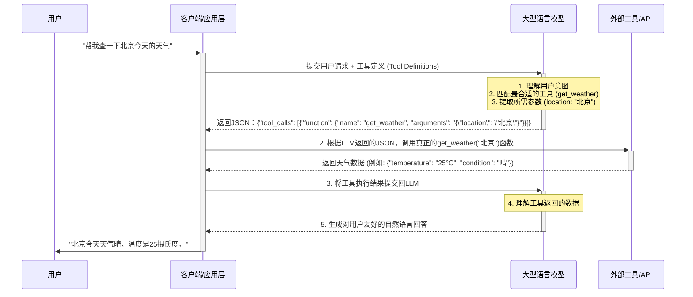

## 1. 宏观概述：为什么工具调用是LLM的"超级外挂"？

大型语言模型（LLM）的出现，彻底改变了我们与机器交互的方式。然而，LLM本身存在一个固有的、无法回避的"天花板"：它们本质上是基于海量文本数据训练出来的"概率预测机器"，其知识被冻结在训练数据截止的那一刻。这意味着，LLM无法得知"今天的天气怎么样？"，也无法访问你公司的内部数据库，更不能帮你预订一张机票。

**LLM工具调用（Tool Calling / Function Calling）** 机制的出现，正是为了打破这层天花板。它赋予了LLM一个前所未有的能力：在需要的时候，**调用外部工具（API、函数、数据库等）来获取实时信息、执行特定任务，或与外部世界进行交互**。

简而言之，工具调用机制将LLM从一个"博学的对话者"升级为了一个能知能行的"智能代理"（Intelligent Agent）。它允许LLM：

*   **获取实时信息**：通过调用天气API、新闻API、搜索引擎等，获取模型训练数据之外的最新信息。
*   **操作外部系统**：连接到企业内部的CRM、ERP系统，查询数据；或者连接到IoT设备，控制智能家居。
*   **执行复杂任务**：将用户的复杂指令（如"帮我找找下周去上海的便宜机票并预订"）拆解，并通过调用多个API组合来完成。
*   **提供更精确、可验证的答案**：对于需要精确计算或结构化数据的查询，LLM可以调用计算器或数据库，而不是依赖其可能不准确的内部知识。

因此，工具调用不仅是LLM功能的一个简单扩展，更是通往构建真正强大的、能够与物理和数字世界深度融合的AI应用的核心基石。

## 2. 核心理念与工作流程：LLM如何"学会"使用工具？

要理解工具调用的底层逻辑，我们需要将其看作是一个由三个核心角色协同工作的精妙流程：

1.  **大型语言模型 (LLM)**：大脑和决策者。
2.  **工具定义 (Tool Definitions)**：一本详细的"工具使用说明书"。
3.  **开发者/客户端 (Client-side Code)**：最终的"执行者"。

LLM本身**永远不会真正地执行任何代码**。它的唯一任务是，在理解了用户的意图和它所拥有的"工具说明书"后，**生成一段精确描述了应该调用哪个工具、以及使用什么参数的JSON数据**。

下面是这个流程的可视化解释：



### 流程详解：

1.  **定义与描述 (Define & Describe)**：
    *   开发者首先需要用一种结构化的方式（通常是JSON Schema）来定义好可用的工具。这份"说明书"是整个流程的关键，它必须清晰地告诉LLM：
        *   **工具名称** (`name`)：例如 `get_weather`。
        *   **工具功能描述** (`description`)：例如"获取指定城市的实时天气信息"。这是LLM理解工具用途的最重要依据。
        *   **工具参数** (`parameters`)：详细定义工具需要哪些输入，每个输入的名称、类型（字符串、数字、布尔等）、是否必需，以及对参数的描述。

2.  **意图识别与参数提取 (Intent Recognition & Parameter Extraction)**：
    *   当用户发出请求时（例如"查查北京天气"），开发者的应用会将用户的原始请求**连同第一步中定义的所有工具说明书**一起发送给LLM。
    *   LLM的核心任务就是进行两件事：
        *   **意图识别**：在所有可用的工具中，判断用户的请求最符合哪个工具的功能描述。在这个例子中，它会匹配到`get_weather`。
        *   **参数提取**：从用户的请求中，找出并提取满足工具参数要求的值。在这里，它会识别出`location`参数的值是"北京"。
    *   完成这两步后，LLM会生成一个或多个`tool_calls`对象，其内容本质上是"我建议你调用名为`get_weather`的函数，并传入`{ "location": "北京" }`这个参数"。

3.  **执行与观察 (Execute & Observe)**：
    *   开发者的应用层代码接收到LLM返回的JSON后，会解析这个"调用建议"。
    *   应用层代码**在本地或服务器端，实际地执行**`get_weather("北京")`这个函数。
    *   执行后，会得到一个真实的返回结果，例如一个包含天气信息的JSON对象。

4.  **总结与回应 (Summarize & Respond)**：
    *   为了完成闭环，应用层需要将上一步中工具的真实执行结果，再次提交给LLM。
    *   这一次，LLM的任务是理解这个工具返回的原始数据（例如`{"temperature": "25°C", "condition": "晴"}`），并将其转换成一句通顺、自然的、对用户友好的答复。
    *   最终，用户收到了"北京今天天气晴，温度是25摄氏度"的回复，整个流程结束。

这个流程精妙地结合了LLM强大的自然语言理解能力和外部工具强大的功能执行能力，实现了1+1>2的效果。

## 3. 技术深潜：剖析行业标准 (OpenAI Tool Calling)

OpenAI的API是目前LLM工具调用领域的事实标准，其设计被广泛借鉴。理解其实现细节对于任何希望在应用中集成LLM工具调用的开发者都至关重要。

### 3.1. 核心API参数

在调用OpenAI的Chat Completions API时，与工具调用相关的核心参数主要有两个：`tools` 和 `tool_choice`。

#### `tools` 参数：你的"工具箱"

`tools`参数是一个数组，你可以在其中定义一个或多个工具。每个工具都遵循一个固定的结构，其核心是`function`对象，该对象基于**JSON Schema**规范来定义。

**示例：定义一个获取天气和一个预订机票的工具**

```json
[
    {
        "type": "function",
        "function": {
            "name": "get_current_weather",
            "description": "获取指定地点的实时天气信息",
            "parameters": {
                "type": "object",
                "properties": {
                    "location": {
                        "type": "string",
                        "description": "城市和省份名称，例如：'北京市'"
                    },
                    "unit": {
                        "type": "string",
                        "enum": ["celsius", "fahrenheit"],
                        "description": "温度单位"
                    }
                },
                "required": ["location"]
            }
        }
    },
    {
        "type": "function",
        "function": {
            "name": "book_flight",
            "description": "为用户预订从出发地到目的地的机票",
            "parameters": {
                "type": "object",
                "properties": {
                    "departure": {
                        "type": "string",
                        "description": "出发机场或城市"
                    },
                    "destination": {
                        "type": "string",
                        "description": "目的机场或城市"
                    },
                    "date": {
                        "type": "string",
                        "description": "希望出发的日期，格式为 YYYY-MM-DD"
                    }
                },
                "required": ["departure", "destination", "date"]
            }
        }
    }
]
```

**关键点剖析**：

*   **`type`**: 目前固定为`"function"`。
*   **`function.name`**: 函数名。必须是字母、数字和下划线的组合，长度不超过64。这是你的代码用来识别调用哪个函数的关键。
*   **`function.description`**: **至关重要**。这是LLM决定是否选择该工具的主要依据。描述应该清晰、准确、无歧义地说明该函数能做什么。好的描述能极大提升LLM的调用准确率。
*   **`function.parameters`**: 一个标准的JSON Schema对象。
    *   **`type`**: 必须是`"object"`。
    *   **`properties`**: 定义每个参数的名称、类型 (`string`, `number`, `boolean`, `array`, `object`) 和描述。参数的描述同样重要，它能帮助LLM理解应该从用户输入中提取什么信息来填充这个参数。
    *   **`required`**: 一个字符串数组，列出哪些参数是必须的。如果用户请求中缺少必要信息，LLM可能会追问用户，或者选择不调用该工具。

#### `tool_choice` 参数：控制LLM的选择

默认情况下，LLM会根据用户的输入自主决定是回答文本，还是调用一个或多个工具。`tool_choice`参数允许你更精确地控制这个行为。

*   **`"none"`**: 强制LLM不调用任何工具，直接返回文本回复。
*   **`"auto"`** (默认值): LLM可以自由选择是回复文本还是调用工具。
*   **`{"type": "function", "function": {"name": "my_function"}}`**: 强制LLM必须调用名为`my_function`的这个特定工具。

这个参数在需要固定执行某个流程或限制LLM能力的场景下非常有用。

### 3.2. 请求-响应生命周期

一次完整的工具调用交互包含至少两次API请求。

**第一次请求：从用户到LLM**

```python
# request
response = client.chat.completions.create(
    model="gpt-4o",
    messages=[{"role": "user", "content": "明天从北京到上海的机票帮我订一张"}],
    tools=my_tools,  # 上面定义的工具列表
    tool_choice="auto"
)
```

**第一次响应：LLM的"调用建议"**

如果LLM决定调用工具，API的响应中`finish_reason`会是`tool_calls`，并且`message`对象会包含一个`tool_calls`数组。

```json
{
  "choices": [
    {
      "finish_reason": "tool_calls",
      "message": {
        "role": "assistant",
        "content": null,
        "tool_calls": [
          {
            "id": "call_abc123",
            "type": "function",
            "function": {
              "name": "book_flight",
              "arguments": "{\"departure\":\"北京\",\"destination\":\"上海\",\"date\":\"2025-07-01\"}"
            }
          }
        ]
      }
    }
  ],
  ...
}

```
**关键点剖析**：

*   **`finish_reason`**: 值为`"tool_calls"`标志着LLM希望你执行工具调用，而不是对话结束。
*   **`message.role`**: `assistant`。
*   **`message.tool_calls`**: 这是一个数组，意味着LLM可以要求一次性调用多个工具。
    *   **`id`**: 一个唯一的调用ID。在后续请求中，你需要用这个ID来关联工具的执行结果。
    *   **`function.name`**: LLM建议调用的函数名。
    *   **`function.arguments`**: **一个字符串形式的JSON对象**。你需要解析这个字符串来获取调用函数所需的具体参数。

**第二次请求：将工具结果返回给LLM**

在你的代码中执行完工具后，你需要将结果再次发送给LLM以完成对话。这时，你需要构造一个新的`messages`列表，其中包含：

1.  原始的用户消息。
2.  上一步中LLM返回的`assistant`消息（包含`tool_calls`）。
3.  一个新的`tool`角色的消息，其中包含工具的执行结果。

```python
# message history
messages = [
    {"role": "user", "content": "明天从北京到上海的机票帮我订一张"},
    response.choices[0].message, # Assistant's 'tool_calls' message
    {
      "tool_call_id": "call_abc123", # 必须和上一步的ID匹配
      "role": "tool",
      "name": "book_flight",
      "content": "{\"status\": \"success\", \"ticket_id\": \"TICKET-45678\"}" # 工具的真实返回值
    }
]

# second request
second_response = client.chat.completions.create(
    model="gpt-4o",
    messages=messages
)
```

**第二次响应：LLM的最终回复**

这次，LLM会基于工具返回的结果，生成一段自然的语言回复给用户。

```json
{
  "choices": [
    {
      "finish_reason": "stop",
      "message": {
        "role": "assistant",
        "content": "好的，已经为您预订了明天从北京到上海的机票，订单号是 TICKET-45678。"
      }
    }
  ],
  ...
}
```

至此，一个完整的工具调用周期完成。

## 4. 代码实现：一个完整的Python示例

下面是一个端到端的Python示例，使用OpenAI的Python库来演示如何实现一个查询天气的功能。

```python
import os
import json
from openai import OpenAI
from dotenv import load_dotenv

# --- 1. 初始化设置 ---
load_dotenv() # 加载 .env 文件中的环境变量
client = OpenAI(api_key=os.getenv("OPENAI_API_KEY"))

# --- 2. 定义我们本地的工具函数 ---
# 这是一个模拟函数，实际应用中它会调用真正的天气API
def get_current_weather(location, unit="celsius"):
    """获取指定地点的实时天气信息"""
    if "北京" in location:
        return json.dumps({
            "location": "北京",
            "temperature": "10",
            "unit": unit,
            "forecast": ["晴", "微风"]
        })
    elif "上海" in location:
        return json.dumps({
            "location": "上海",
            "temperature": "15",
            "unit": unit,
            "forecast": ["小雨", "东北风"]
        })
    else:
        return json.dumps({"location": location, "temperature": "未知"})

# --- 3. 主执行流程 ---
def run_conversation(user_prompt: str):
    print(f"👤 用户: {user_prompt}")
    
    # 步骤1: 将用户的消息和工具定义发送给LLM
    messages = [{"role": "user", "content": user_prompt}]
    tools = [
        {
            "type": "function",
            "function": {
                "name": "get_current_weather",
                "description": "获取指定城市的实时天气信息",
                "parameters": {
                    "type": "object",
                    "properties": {
                        "location": {
                            "type": "string",
                            "description": "城市名称, e.g., 北京市",
                        },
                        "unit": {"type": "string", "enum": ["celsius", "fahrenheit"]},
                    },
                    "required": ["location"],
                },
            },
        }
    ]
    
    response = client.chat.completions.create(
        model="gpt-4o",
        messages=messages,
        tools=tools,
        tool_choice="auto",
    )
    
    response_message = response.choices[0].message
    tool_calls = response_message.tool_calls
    
    # 步骤2: 检查LLM是否决定调用工具
    if tool_calls:
        print(f"🤖 LLM决定调用工具: {tool_calls[0].function.name}")
        # 将LLM的回复添加到消息历史中
        messages.append(response_message)
        
        # 步骤3: 执行工具调用
        # 注意: 目前示例仅处理第一个工具调用
        tool_call = tool_calls[0]
        function_name = tool_call.function.name
        function_to_call = globals().get(function_name) # 从全局作用域中获取函数
        
        if not function_to_call:
            print(f"❌ 错误: 函数 {function_name} 未定义")
            return

        function_args = json.loads(tool_call.function.arguments)
        
        # 调用函数并获取结果
        function_response = function_to_call(
            location=function_args.get("location"),
            unit=function_args.get("unit"),
        )
        print(f"🛠️ 工具 '{function_name}' 返回: {function_response}")
        
        # 步骤4: 将工具的执行结果返回给LLM
        messages.append(
            {
                "tool_call_id": tool_call.id,
                "role": "tool",
                "name": function_name,
                "content": function_response,
            }
        )
        
        print("🗣️ 将工具结果提交回LLM，生成最终回复...")
        second_response = client.chat.completions.create(
            model="gpt-4o",
            messages=messages,
        )
        
        final_response = second_response.choices[0].message.content
        print(f"🤖 LLM最终回复: {final_response}")
        return final_response

    else:
        # 如果LLM没有调用工具，直接返回其文本内容
        final_response = response_message.content
        print(f"🤖 LLM直接回复: {final_response}")
        return final_response

# --- 运行示例 ---
if __name__ == "__main__":
    run_conversation("上海今天天气怎么样？")
    print("\n" + "="*50 + "\n")
    run_conversation("你好吗？")

```

这个示例清晰地展示了从定义工具、发送请求、处理`tool_calls`、执行本地函数、再到将结果发回给模型以获得最终答案的全过程。

## 5. 高级主题与最佳实践

掌握了基础流程后，我们还需要了解一些高级用法和设计原则，以构建更健壮、更可靠的工具调用系统。

### 5.1. 并行工具调用 (Parallel Tool Calling)

较新的模型（如`gpt-4o`）支持并行工具调用。这意味着模型可以在一次响应中，要求同时调用多个不同的、独立的工具。

**场景示例**: 用户问："北京和上海今天的天气怎么样？"

模型可能会返回一个包含两个`tool_calls`的响应：
1.  `get_current_weather(location="北京")`
2.  `get_current_weather(location="上海")`

你的代码需要能够迭代处理`message.tool_calls`数组中的每一个`tool_call`对象，分别执行它们，收集所有结果，然后将这些结果在一个新的请求中一并提交给模型。

**代码处理逻辑**：
```python
# ... (接收到包含多个tool_calls的response_message)
messages.append(response_message) # Add assistant's reply to messages

# 为每个工具调用执行函数并收集结果
tool_outputs = []
for tool_call in tool_calls:
    function_name = tool_call.function.name
    function_to_call = available_functions[function_name]
    function_args = json.loads(tool_call.function.arguments)
    output = function_to_call(**function_args)
    tool_outputs.append({
        "tool_call_id": tool_call.id,
        "role": "tool",
        "name": function_name,
        "content": output,
    })

# 将所有工具的输出都添加到消息历史中
messages.extend(tool_outputs)

# 再次调用模型
second_response = client.chat.completions.create(
    model="gpt-4o",
    messages=messages
)
```

### 5.2. 错误处理

工具调用并不总是成功的。API可能会超时，数据库可能无法连接，或者函数执行本身可能抛出异常。优雅地处理这些错误至关重要。

当工具执行失败时，你应该捕获异常，并将一个描述错误的、结构化的信息作为工具调用的结果返回给LLM。

**示例**：
```python
try:
    # 尝试调用API
    result = some_flaky_api()
    content = json.dumps({"status": "success", "data": result})
except Exception as e:
    # 如果失败，返回错误信息
    content = json.dumps({"status": "error", "message": f"API调用失败: {str(e)}"})

# 将结果（无论成功或失败）返回给LLM
messages.append({
    "tool_call_id": tool_call.id,
    "role": "tool",
    "name": function_name,
    "content": content,
})
```
LLM在接收到错误信息后，通常会向用户回复一个歉意的、能反映出问题的答案（例如："抱歉，我暂时无法查询到天气信息，请稍后再试。"），而不是让整个应用崩溃。

### 5.3. 设计高效的工具描述

**工具描述 (`description`) 的质量直接决定了LLM的调用准确率。**

*   **清晰具体**: 避免使用模糊的词汇。
    *   **不好**: "获取数据"
    *   **好**: "从公司的CRM系统中，根据用户ID查询该用户的订单历史记录"
*   **包含关键信息和限制**: 如果工具有特定限制，一定要在描述中说明。
    *   **示例**: "查询航班信息。注意：本工具只能查询未来30天内的航班，无法查询历史航班。"
*   **使用动词开头**: 用一个清晰的动词来描述函数的核心功能。
*   **参数描述也要清晰**: 参数的`description`同样重要，它指导LLM如何从用户对话中正确提取信息。
    *   **不好**: `"date": "一个日期"`
    *   **好**: `"date": "预订的日期，必须是YYYY-MM-DD格式的字符串"`

### 5.4. 安全性考量

赋予LLM调用代码的能力是一把双刃剑，必须谨慎处理其安全性。

*   **永远不要执行LLM生成的代码**: LLM的输出是"调用建议"，而不是可执行代码。永远不要使用`eval()`或类似的方法直接执行LLM生成的字符串。你应该解析它建议的函数名和参数，然后调用你已经预先定义好的、安全可信的本地函数。
*   **确认与授权**: 对于会产生严重后果的操作（如删除数据、发送邮件、进行支付），应该在执行前实现一个确认机制。可以是在代码层面强制要求用户确认，或者让LLM在生成调用建议后，再生成一句向用户确认的话术。
*   **最小权限原则**: 只向LLM提供完成其任务所必需的最少工具。不要暴露整个代码库或不相关的API。

## 6. 总结与未来展望

LLM工具调用是近年来人工智能领域最具突破性的进展之一。它将LLM从一个封闭的"语言大脑"转变为一个开放的、可扩展的、能够与世界交互的"智能代理"核心。通过将LLM强大的自然语言理解能力与外部工具的无限功能相结合，我们得以构建出前所未有的智能应用。

从查询天气、预订酒店，到控制智能家居、分析企业财报、自动化软件开发流程，工具调用正在解锁无数的可能性。随着模型能力的不断增强，工具描述的理解会愈发精准，多工具的协同会更加复杂和智能，错误处理和自我修正的能力也会变得更强。

未来，我们可能会看到更加复杂的Agentic架构，其中LLM不仅调用工具，还能动态地创建、组合甚至优化工具。掌握LLM工具调用的原理与实践，不仅是跟上当前AI技术浪潮的必备技能，更是通往未来智能应用开发的关键钥匙。
