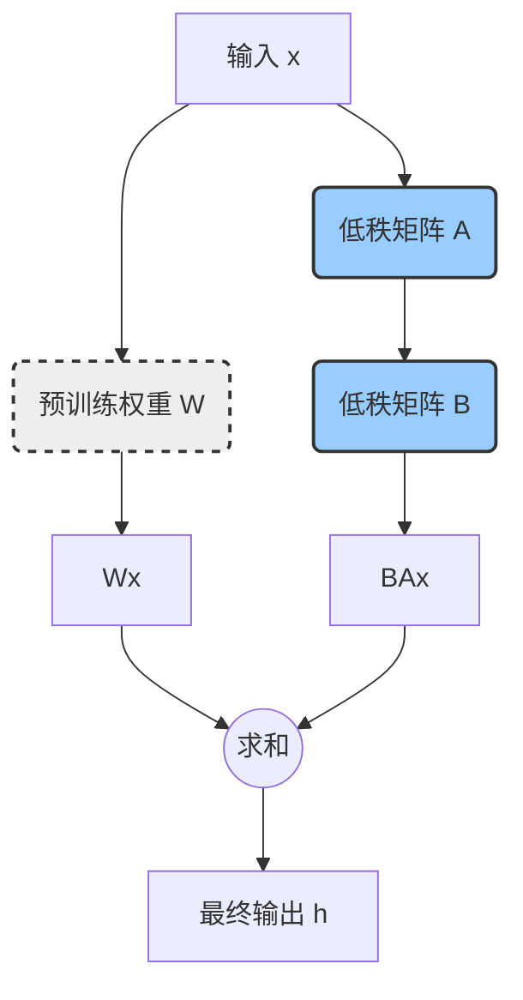
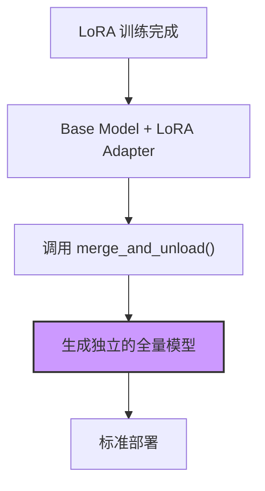
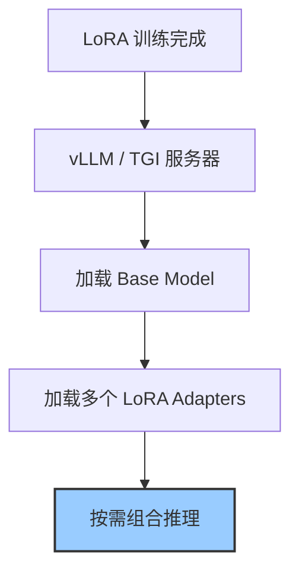

## 1. 引言：为什么需要 LoRA？

在大型语言模型（LLM）和生成式 AI 飞速发展的今天，我们见证了模型规模的爆炸式增长，从数亿到数万亿参数不等。这些庞大的模型在各种任务上都展现出了惊人的能力。然而，一个巨大的挑战随之而来：如何针对特定的下游任务对这些模型进行微调？

传统的**全量微调（Full Fine-Tuning）**方法，即更新模型的所有参数，面临着严峻的问题：

*   **计算成本高昂**：微调一个数十亿参数的模型需要巨大的计算资源和数百 GB 的显存，这对于大多数开发者和中小型企业来说是难以承受的。
*   **存储成本巨大**：每针对一个任务微调一次，就需要保存一份完整的模型副本，导致存储成本急剧上升。
*   **部署困难**：在生产环境中，为不同任务维护和切换多个庞大的模型副本是一场噩梦。

为了解决这些痛点，**参数高效微调（Parameter-Efficient Fine-Tuning, PEFT）**技术应运而生。其核心思想是在微调过程中冻结大部分预训练模型的参数，只调整一小部分（通常远小于总参数的 1%）新增的或特定的参数。

在众多 PEFT 技术中，**LoRA（Low-Rank Adaptation of Large Language Models）**以其出色的效果、高效的性能和实现的简洁性脱颖而出，成为目前最主流、应用最广泛的方案之一。本篇文档将深入浅出地介绍 LoRA 的核心原理，并提供详细的实战指南。

## 2. 核心原理：LoRA 的魔法

LoRA 的核心假设是：**大型语言模型在适应新任务时，其权重的变化是低秩的（low-rank）**。换句话说，尽管预训练模型的权重矩阵 `W` 非常庞大（例如 `d x d` 维），但在微调过程中，权重的改变量 `ΔW` 具有一个很低的"内在秩"。

基于这个假设，LoRA 不直接更新 `W`，而是通过训练两个更小的、低秩的矩阵 `B` 和 `A` 来近似 `ΔW`，即 `ΔW ≈ BA`。

*   `W` 是预训练好的、被冻结的权重矩阵。
*   `A` 是一个 `r x d` 维的矩阵，其中 `r` 是一个远小于 `d` 的秩（rank）。
*   `B` 是一个 `d x r` 维的矩阵。

在微调过程中，只有矩阵 `A` 和 `B` 的参数是可训练的。前向传播的计算过程也相应地变为：

`h = Wx + BAx`

下面是一个图示，更直观地展示了这个过程：



其中 `x` 是输入，`h` 是输出。这种方式极大地减少了需要训练的参数数量。例如，如果 `d = 4096`，`r = 8`，那么原始矩阵 `W` 有 `4096 * 4096 ≈ 16.7M` 个参数，而 `A` 和 `B` 加起来只有 `4096 * 8 + 8 * 4096 ≈ 65K` 个参数，参数量减少了约 256 倍！

**关键参数 `r`**：秩 `r` 是 LoRA 中最重要的超参数。它控制了低秩矩阵的大小，直接决定了新增参数的数量。
*   **较小的 `r`**：可训练参数少，训练速度快，显存占用低，但可能无法充分学习到任务的复杂特征。
*   **较大的 `r`**：可训练参数多，模型拟合能力更强，但会增加计算成本和过拟合的风险。
在实践中，`r` 通常被设置为 8, 16, 32 或 64，就能在性能和效率之间取得很好的平衡。

## 3. LoRA 的显著优势

相比于全量微调，LoRA 展现出多方面的压倒性优势：

1.  **极高的参数效率**：如上所述，LoRA 只需训练极少量的参数。我们可以通过 `print_trainable_parameters()` 函数直观地看到这一点，训练的参数占比通常低于 1%。
2.  **更快的训练速度**：由于需要计算梯度和更新的参数数量大幅减少，训练时间也随之缩短，从而加速了迭代周期。
3.  **更低的硬件门槛**：LoRA 显著减少了训练过程中的显存（VRAM）占用，使得在消费级 GPU（如 RTX 3090/4090）上微调拥有数百亿参数的大模型成为可能。
4.  **部署和管理的灵活性**：这是 LoRA 最具吸引力的优点之一。预训练模型始终保持不变，可以被所有任务共享。对于每个下游任务，我们只需要保存一个轻量级（通常只有几 MB 到几十 MB）的 LoRA 适配器（即矩阵 A 和 B 的权重）。在部署时，可以根据需求动态加载对应的适配器，极大地简化了多任务场景下的模型管理和切换。

## 4. 动手实践：LoRA 训练方法

下面，我们将通过一个完整的例子，展示如何使用 Hugging Face 生态中的 `transformers`、`peft` 和 `trl` 库来对一个大模型进行 LoRA 微调。

### 步骤 1: 环境准备

首先，确保你已经安装了必要的 Python 库：

```bash
pip install transformers peft trl datasets torch
```

### 步骤 2: 加载模型、分词器和数据集

我们选择一个预训练模型作为基础，并加载相应的分词器。同时，我们从 Hugging Face Hub 加载一个用于微调的数据集。

```python
from transformers import AutoModelForCausalLM, AutoTokenizer, TrainingArguments
from datasets import load_dataset

# 模型 ID，可以是任何支持的 Causal LM
model_id = "facebook/opt-350m"

# 加载预训练模型
model = AutoModelForCausalLM.from_pretrained(model_id)
# 加载分词器
tokenizer = AutoTokenizer.from_pretrained(model_id)

# 加载数据集（以英文名言数据集为例）
dataset = load_dataset("Abirate/english_quotes", split="train")
```

### 步骤 3: 配置 LoRA (`LoraConfig`)

这是 LoRA 微调的核心步骤。我们需要创建一个 `LoraConfig` 对象，来定义 LoRA 适配器的行为。

```python
from peft import LoraConfig

lora_config = LoraConfig(
    r=16,  # 低秩矩阵的秩，推荐值为 8, 16, 32
    lora_alpha=32,  # 缩放因子，通常设置为 r 的两倍
    target_modules=["q_proj", "v_proj"],  # 指定要应用 LoRA 的模型层。对于 Transformer 模型，通常是 q_proj 和 v_proj
    lora_dropout=0.05,  # LoRA 层的 dropout 概率
    bias="none",  # 是否训练偏置项，"none" 表示不训练
    task_type="CAUSAL_LM"  # 任务类型，这里是因果语言模型
)
```

*   `target_modules`: 这个参数非常关键。它告诉 PEFT 库应该在模型的哪些模块（通常是 `nn.Linear` 层）上应用 LoRA。对于大多数 Transformer 模型，将其应用于 Attention 机制中的查询（query）和值（value）投影层（即 `q_proj` 和 `v_proj`）是常见的做法。你可以通过打印 `model` 对象来查看其所有模块的名称，以确定可以作为目标的选择。

### 步骤 4: 应用 LoRA 并使用 `SFTTrainer` 进行训练

`trl` 库提供的 `SFTTrainer` (Supervised Fine-tuning Trainer) 极大地简化了微调流程。它内置了对 `peft` 的支持，我们只需将模型、分词器、数据集和 `peft_config` 传递给它即可。

```python
from trl import SFTTrainer

# 定义训练参数
training_args = TrainingArguments(
    output_dir="./lora_finetuned_model",  # 模型输出目录
    num_train_epochs=3,  # 训练轮次
    per_device_train_batch_size=4,  # 每个设备的训练批量大小
    logging_dir='./logs',  # 日志目录
    logging_steps=50,  # 每隔多少步记录一次日志
    learning_rate=2e-4,  # 学习率
)

# 初始化 SFTTrainer
trainer = SFTTrainer(
    model=model,
    tokenizer=tokenizer,
    args=training_args,
    train_dataset=dataset,
    peft_config=lora_config,  # 传入 LoRA 配置
    dataset_text_field="quote",  # 数据集中包含文本的字段名
)

# 开始训练
trainer.train()

# 保存训练好的 LoRA 适配器
trainer.save_model()
```

训练完成后，`output_dir` 目录下会生成一个 `adapter_model.bin` 文件和 `adapter_config.json` 文件，这就是我们训练得到的轻量级 LoRA 适配器。

### 步骤 5: 使用训练好的 LoRA 适配器进行推理

在推理时，我们首先加载原始的预训练模型，然后加载训练好的 LoRA 适配器权重。

```python
from peft import PeftModel

# 加载原始的、未经微调的模型
base_model = AutoModelForCausalLM.from_pretrained(model_id)

# 加载 LoRA 适配器
model_with_lora = PeftModel.from_pretrained(base_model, "./lora_finetuned_model")

# 现在 model_with_lora 就是一个融合了 LoRA 权重的、可以用于推理的模型
prompt = "The best way to predict the future is to"
inputs = tokenizer(prompt, return_tensors="pt")

# 生成文本
outputs = model_with_lora.generate(**inputs, max_new_tokens=20)
print(tokenizer.decode(outputs[0], skip_special_tokens=True))
```

## 5. LoRA 模型部署：从静态到动态

训练完成后，如何高效地将 LoRA 模型投入生产环境是关键的下一步。LoRA 的部署策略主要分为两大类：**权重合并（静态部署）** 和 **动态适配器加载（动态部署）**。下面的流程图分别展示了这两种路径：

**方案一：权重合并 (静态部署)**


**方案二：动态适配器加载 (动态部署)**


### 方案一：权重合并与标准部署 (静态)

这是最简单直接的部署方式。其核心思想是将轻量级的 LoRA 适配器权重合并到原始的基础模型权重中，生成一个全新的、独立的全量模型。

**操作方法**:
使用 `peft` 库的 `merge_and_unload()` 方法可以轻松完成这个过程。

```python
from peft import PeftModel
from transformers import AutoModelForCausalLM, AutoTokenizer

# 假设 model_id 和 lora_path 已定义
base_model = AutoModelForCausalLM.from_pretrained(model_id)
model_with_lora = PeftModel.from_pretrained(base_model, "./lora_finetuned_model")

# 合并权重
merged_model = model_with_lora.merge_and_unload()

# 现在 merged_model 就是一个标准的 Transformers 模型
# 你可以像保存任何其他模型一样保存它
merged_model.save_pretrained("./merged_lora_model")
tokenizer.save_pretrained("./merged_lora_model")
```

之后，你可以像加载任何普通 Hugging Face 模型一样加载并使用这个 `merged_lora_model`。

*   **优点**:
    *   **零推理延迟**: 合并后，推理过程与标准模型完全相同，没有任何额外的计算开销。
    *   **部署简单**: 无需任何额外的推理框架支持，可直接用于 `transformers` 等标准库。
*   **缺点**:
    *   **失去灵活性**: 每有一个 LoRA 适配器，就需要保存和加载一个完整的模型副本，违背了 LoRA 轻量化的初衷。
    *   **存储成本高**: 如果有多个适配器，存储开销巨大。

### 方案二：使用 vLLM 进行高性能动态部署 (推荐)

对于需要同时服务多个 LoRA 适配器的场景，**vLLM** 是目前业界领先的高性能推理和服务引擎。它通过 **PagedAttention** 等核心技术，实现了对多个 LoRA 适配器的高效管理和动态加载，能够在不显著牺牲性能的前提下，实现极高的吞吐量。

**操作方法**:

1.  **安装 vLLM**:
    ```bash
    pip install vllm
    ```

2.  **启动 vLLM 服务器**:
    使用 `vllm serve` 命令启动一个 OpenAI 兼容的 API 服务器。关键在于使用 `--enable-lora` 开启 LoRA 支持，并可以通过 `--lora-modules` 预加载适配器。

    ```bash
    # lora_path 指向你训练好的适配器目录
    vllm serve meta-llama/Llama-2-7b-hf \
        --enable-lora \
        --lora-modules my_sql_lora=/path/to/your/sql_lora_adapter
    ```
    这里，我们将名为 `my_sql_lora` 的适配器预加载了进来。

3.  **发送推理请求**:
    你可以通过 `curl` 或任何 HTTP 客户端向 vLLM 服务器发送请求。只需在请求体中指定 `model` 为你加载的 LoRA 适配器名称即可。

    ```bash
    curl http://localhost:8000/v1/completions \
        -H "Content-Type: application/json" \
        -d '{
            "model": "my_sql_lora",
            "prompt": "Write a SQL query for all users.",
            "max_tokens": 64
        }'
    ```
    vLLM 会自动将请求路由到对应的 LoRA 适配器进行推理。

**使用 Python 客户端**:
vLLM 也提供了 Python API，可以在代码中直接调用。

```python
from vllm import LLM, SamplingParams
from vllm.lora.request import LoRARequest

# 初始化 LLM 引擎，并开启 LoRA 支持
llm = LLM(model="meta-llama/Llama-2-7b-hf", enable_lora=True)

sampling_params = SamplingParams(max_tokens=64)

# 在 generate 调用中，通过 lora_request 指定要使用的适配器
outputs = llm.generate(
    "Write a SQL query for all users.",
    sampling_params,
    lora_request=LoRARequest("my_sql_lora", 1, "/path/to/your/sql_lora_adapter")
)
```

*   **优点**:
    *   **极高吞吐量**: 专为大规模并发推理设计。
    *   **动态灵活**: 可同时服务成百上千个 LoRA 适配器，按需加载，完美支持多租户场景。
    *   **显存高效**: PagedAttention 机制有效管理显存，避免浪费。
*   **缺点**:
    *   **部署稍复杂**: 需要额外学习和配置 vLLM 服务。

### 方案三：其他动态部署方案 (如 TGI)

Hugging Face 自家的 **Text Generation Inference (TGI)** 是另一个强大的生产级推理服务器。与 vLLM 类似，TGI 也支持在启动时加载多个 LoRA 适配器，并根据传入的请求头动态应用。它与 Hugging Face 生态系统集成得最好，是 vLLM 的一个有力竞争者。

### 部署方案对比总结

| 特性 | 权重合并 (静态) | vLLM (动态) | TGI (动态) |
| :--- | :--- | :--- | :--- |
| **性能/吞吐量** | 最高（单请求延迟最低） | 非常高 | 高 |
| **灵活性** | 低（无动态能力） | 非常高 | 高 |
| **部署复杂度** | 低 | 中等 | 中等 |
| **显存占用** | 非常高（N个适配器N倍显存） | 低（高效共享） | 低（高效共享） |
| **适用场景** | 单一、固定的任务 | 多租户、高并发、多任务场景 | Hugging Face 生态的生产部署 |

## 6. 高级话题

*   **多适配器管理**：PEFT 支持在单个模型上动态添加、切换和禁用多个适配器，使用 `model.add_adapter()` 和 `model.set_adapter()` 等方法，这为构建灵活的多任务系统提供了极大的便利。

## 7. 总结

LoRA 作为一种革命性的参数高效微调技术，成功地解决了大模型时代微调成本高昂的难题。它通过巧妙的低秩分解思想，在保证微调效果的同时，极大地降低了对计算资源和存储的需求。结合 vLLM 等先进的推理引擎，LoRA 的部署和服务也变得前所未有的高效和灵活，正在推动大模型在更多特定场景下的落地和应用。