## 1. Kokoro：轻量级高效TTS

### 1.1 架构设计

Kokoro采用了简洁高效的架构设计，其核心结构如下：

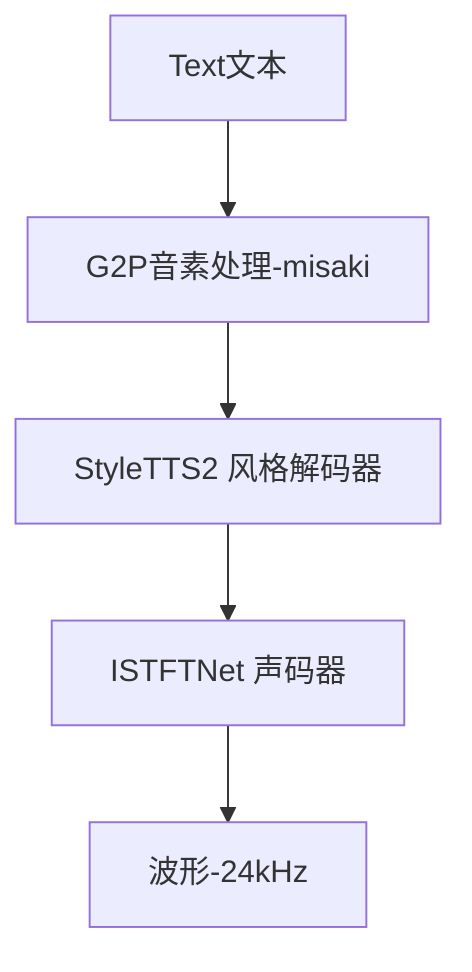

Kokoro的特点：
- 没有传统的Encoder（直接处理phoneme）
- 解码器采用前馈非递归结构（Conv1D/FFN）
- 不使用transformer，不使用自回归或扩散
- 风格、韵律作为条件向量在解码器注入
- vocoder采用ISTFTNet：轻量、快速、可ONNX推理

### 1.2 技术优势

Kokoro针对传统TTS系统的多个痛点提供了解决方案：

| 目标问题 | Kokoro的应对方案 |
| --- | --- |
| 声音风格不够丰富 | 内置style embedding与多speaker选择（48+） |
| 部署门槛高 | 全Python/PyTorch + ONNX支持，一行pip安装 |
| 生成速度太慢 | 采用非自回归结构 + 轻量vocoder（ISTFTNet） |
| 缺乏控制能力 | 明确建模pitch/duration/energy等prosody参数 |
| 许可证不清晰 | 使用Apache 2.0，可商用、可微调 |

### 1.3 局限性分析

尽管Kokoro在效率和部署便捷性方面表现出色，但也存在一些值得注意的局限：

#### 1.3.1 结构并行性强，但上下文建模弱
- 没有encoder → 无法理解整句上下文，例如："他今天很开心" vs "他今天很生气" 语调无法自然变化
- phoneme直接送入decoder，不带语言层次结构
- 在长文本或强上下文依赖的句子中，停顿节奏缺乏语义感知
- 并行可以一次生成，无token by token推理，但语义一致性差、无法模拟段落语气递进

#### 1.3.2 声学建模能力受限
- 声音细节（如breathiness、intonation contour）不如VALL-E, StyleTTS2, Bark
- 用的是「解码器预测Mel + vocoder合成」的经典TTS路线，声学精度已经接近上限
- prosody预测虽可控，但质量有限（模型本身太小）

#### 1.3.3 音质与模型复杂度需要权衡
- 在保持速度的同时，牺牲部分音质
- 例如在高频段、鼻音、爆破音中可能产生artifacts
- 情绪表达强度有限，不能做"怒吼、哭腔"等极端风格

## 2. CosyVoice：基于LLM的统一架构

### 2.1 架构设计

CosyVoice采用了类似LLM的统一架构设计，将文本和音频处理融合在一个框架中：

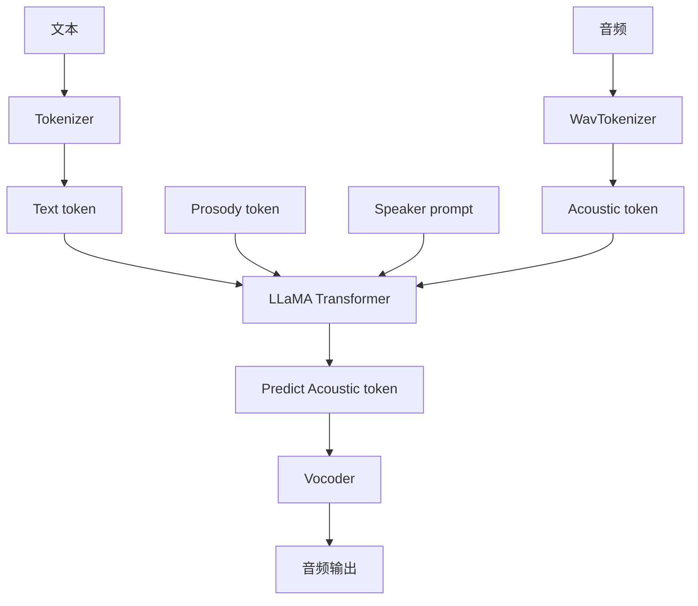

主要模块及其功能：

| 模块 | 实现说明 |
| --- | --- |
| Tokenizer | 使用标准BPE tokenizer，将文本转为token（支持中英混合） |
| WavTokenizer | 将音频离散化为token（替代传统Mel），对接Transformer解码器 |
| Transformer模型 | 多模态自回归Transformer，结构类似LLaMA，融合文本与音频token |
| Prosody Token | 控制\<laugh\> \<pause\> \<whisper\>等语气，通过token插入而非模型结构建模 |
| Vocoder | 支持HiFi-GAN或SNAC：从音频token还原出波形，轻量、可低延迟部署 |
### 2.2 技术优势

CosyVoice针对传统TTS架构的多个问题提供了创新解决方案：

| 目标问题 | CosyVoice的应对方案 |
| --- | --- |
| 传统结构复杂、推理慢 | 使用统一Transformer架构，无encoder，直接token输入输出，简化结构 |
| 韵律控制缺乏 | 插入prosody token（如\<laugh\>）进行表达控制，无需训练专门情感模型 |
| 上下游不统一，TTS不可控 | 文本与音频均离散化为token，统一建模逻辑，支持prompt引导与controllable generation |
| 多语言建模难度高 | 支持中英文双语训练，文本tokenizer原生多语言支持，token层统一表达 |
| 缺乏对话式语音能力 | 与LLM相兼容的生成方式，可融合聊天上下文构造语音对话系统框架 |

### 2.3 局限性分析

CosyVoice虽然在统一架构和灵活性方面有显著优势，但也存在一些实际应用中的挑战：

#### 2.3.1 自回归结构导致低并行性
- 模型采用类似LLM的token-by-token自回归生成方式
- 必须顺序生成，不能并行处理长句子
- 推理速度明显慢于Fastspeech2/StyleTTS2等非自回归模型
- 本质限制来自Transformer decoder架构：必须等待上一个token生成，才能预测下一个

#### 2.3.2 韵律控制机制依赖prompt，不适合稳定生产
- 控制风格依赖手动插入prosody token
- 风格输出质量高度依赖"prompt编排技巧"
- 相比StyleTTS2那种直接输入style vector/embedding的方式，控制不够结构化，缺乏可学习性与稳健性
- 工程上难以自动构建稳定输出流

#### 2.3.3 不具备说话人迁移能力
- 没有显式支持speaker embedding
- 也无法通过参考音频实现voice cloning
- 在需要高个性化语音（如虚拟人、客户定制声音）时能力明显不足

## 3. ChatTTS：模块化扩散系统

### 3.1 架构设计

ChatTTS采用了模块化的设计思路，结合了扩散模型的优势：

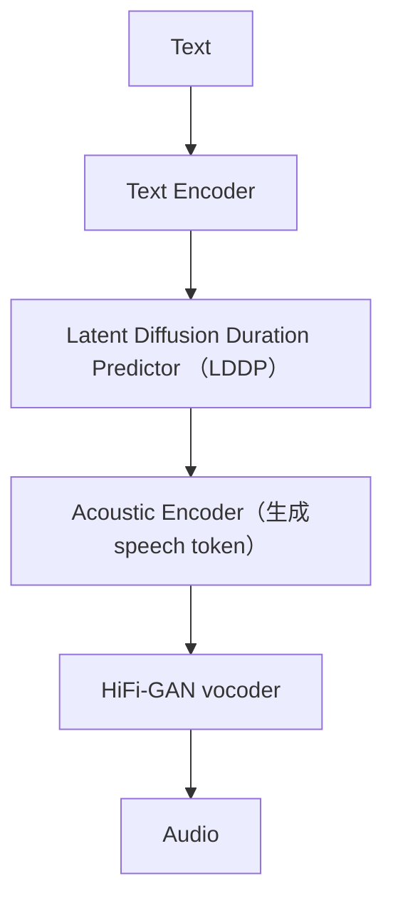

主要模块及其功能：

| 模块 | 实现说明 |
| --- | --- |
| Tokenizer | 使用标准BPE tokenizer，将文本转为token（支持中英混合） |
| WavTokenizer | 将音频离散化为token（代替Mel），作为decoder目标 |
| Text Encoder | 编码文本token，为后续模块提供上下文向量表示 |
| Duration Predictor（LDDP） | 使用扩散模型预测token时长，实现自然的prosody（节奏建模） |
| Acoustic Decoder | 自回归生成speech token，逐帧构建语音表示 |
| Prosody Token | 控制\<laugh\> \<pause\> \<shout\>等token，融入句子表达语气与节奏 |
| Vocoder | 支持HiFi-GAN/EnCodec，从speech token还原波形，部署灵活 |

### 3.2 技术优势

ChatTTS针对TTS系统的模块依赖和推理链路问题提供了解决方案：

| 问题 | ChatTTS的应对策略 |
| --- | --- |
| 模块依赖繁重 | 将各模块解耦实现模块化训练：支持独立训练tokenizer、扩散式duration模型、vocoder，并通过中间token实现衔接，降低端到端耦合风险 |
| 推理链路长 | 使用统一token表达结构（文本token → speech token → waveform），形成标准token流转路径，提升模块协同效率；支持HiFi-GAN简化后端 |
| 精调难度高 | 控制逻辑显式化：通过插入prosody token进行风格表达，无需训练额外风格模型，降低数据依赖性与微调复杂度 |

### 3.3 局限性分析

ChatTTS在模块化设计方面有优势，但也面临一些实际应用挑战：

#### 3.3.1 自回归结构导致低并行性
- 采用Transformer Decoder + 自回归机制，逐token生成
- 必须等待上一个speech token完成后才能生成下一个

#### 3.3.2 架构复杂，模块多，维护难度高
- 模块依赖繁重：包含tokenizer、扩散预测器、解码器、vocoder等多个组件，难以统一训练和调优
- 推理链路长：任一模块出错都会影响语音质量和时序控制
- 精调难度高：控制token和style embedding的效果对数据依赖性强

#### 3.3.3 控制token可解释性弱，生成不稳定
- 控制token无标准，例如[laugh], [pause], [sad]插入后表现不一致，需人工调参
- token组合效应复杂，多种控制token组合时可能产生非预期语音效果（如节奏错乱）

## 4. Chatterbox：多模块融合系统

### 4.1 架构设计

Chatterbox采用了多模块融合的设计思路，结合了多种先进技术：

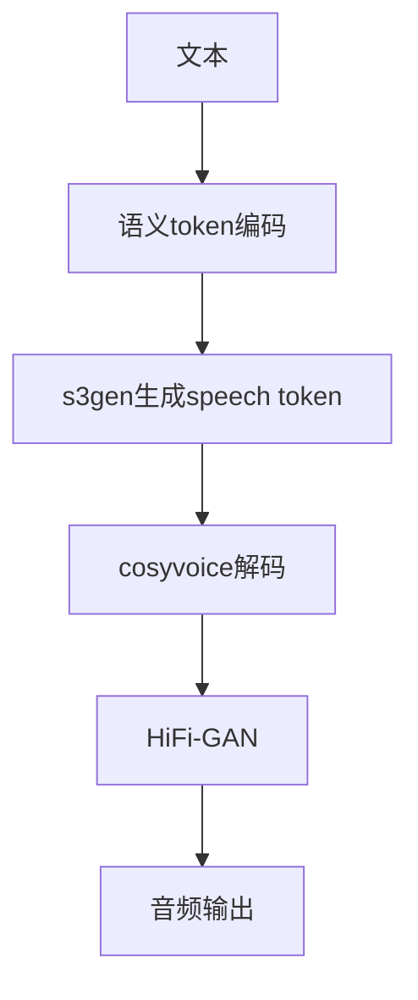

主要模块及其功能：

| 模块 | 算法思路 |
| --- | --- |
| Text Encoder（LLM） | 使用语言模型（如LLaMA）对文本编码 |
| s3gen（Speech Semantic Sequence Generator） | 模仿VALL-E概念，预测离散speech token |
| t3_cfg（TTS Config） | 模型结构定义，包括vocoder类型、tokenizer配置等 |
| CosyVoice（Decoder） | 非自回归解码器 |
| HiFi-GAN（Vocoder） | 卷积 + 判别器生成器网络 |
### 4.2 技术优势

Chatterbox针对传统TTS系统的多个问题提供了解决方案：

| 目标问题 | Chatterbox的应对策略 |
| --- | --- |
| 韵律控制难 | 插入prosody token进行表达控制，无需额外标签或门控模型 |
| 文本与语音结构割裂 | 使用离散语音token接入统一token管线，增强上下游协同性 |
| 多语言支持差 | 支持原生中英混合输入，统一token层表达结构 |
| 缺乏上下文/对话支持 | 融合LLM输出token序列，为构建对话式语音框架打基础 |

### 4.3 局限性分析

Chatterbox在多模块融合方面有创新，但也面临一些实际应用挑战：

#### 4.3.1 中间token不透明
- s3gen的speech token无明确可解释性，不利于后期调试和控制语气、情绪等属性

#### 4.3.2 上下文管理能力不足
- 当前设计偏向单轮推理，不支持长对话缓存，难以用于多轮语音对话代理场景

#### 4.3.3 链条长、依赖多模块
- 多模块组合（LLM + s3gen + CosyVoice + vocoder），整体系统鲁棒性下降，难以整体优化

## 5. Dia：轻量级跨平台TTS

### 5.1 架构设计

Dia采用了适合跨平台部署的轻量级设计：

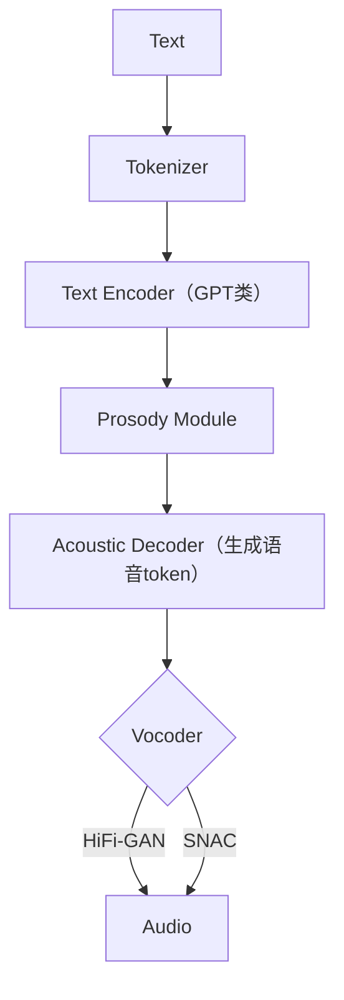

主要模块及其功能：

| 模块 | 描述 |
| --- | --- |
| Text Encoder | 多为GPT类结构，对输入文本建模；捕捉上下文语义与语调提示 |
| Prosody Module | 控制语气、节奏、情感状态（可能为embedding + classifier） |
| Decoder | 将编码后的语义映射成声学token（可能是codec表征或Mel特征） |
| Vocoder | 常用HiFi-GAN，将声学token转为可播放音频（.wav或.mp3） |

### 5.2 技术优势

Dia针对TTS部署和跨平台应用的多个问题提供了解决方案：

| 目标问题 | dia-gguf的应对策略 |
| --- | --- |
| 缺乏自然对话语调 | 引入prosody token（如\<laugh\>、\<pause\>等）表达语气变化，构建对话感知式发音风格 |
| 推理门槛高，部署复杂 | 通过GGUF格式封装 + 多级量化（Q2/Q4/Q6/F16），支持在CPU离线运行，无需专业GPU |
| 模型部署格式割裂 | 使用GGUF标准格式封装模型参数与结构信息，兼容TTS.cpp/gguf-connector等框架，实现跨平台运行 |

### 5.3 局限性分析

Dia在轻量化和跨平台部署方面有优势，但也面临一些实际应用挑战：

#### 5.3.1 声学解码器可能成为瓶颈
- 如果使用高保真的decoder（如基于VQ-VAE或GAN的声码器），推理阶段的效率依赖于声码器本身
- 当前gguf‑connector主要以C++实现，不如GPU端的HiFi-GAN高效

#### 5.3.2 缺乏灵活风格迁移机制
- 当前版本主要针对单一对话风格，不支持多说话人、多情绪场景下的样式迁移或情感控制
- 无encoder-decoder分离结构，导致风格迁移可扩展性受限

#### 5.3.3 精度与自然度折中明显
- 低bit量化（如Q2）虽然推理快，但容易出现语音破碎、细节缺失现象，不适合高保真场景
- 若部署在语音助手或主播系统中，对音质敏感的用户体验会下降

## 6. Orpheus：基于LLM的端到端TTS

### 6.1 架构设计

Orpheus采用了基于LLM的端到端设计思路：

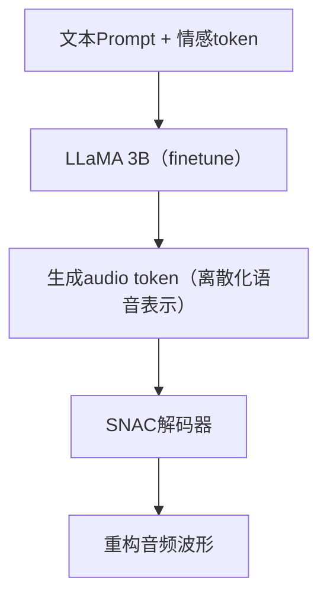

主要模块及其功能：
- **LLaMA 3B结构**：基础是Meta的Transformer架构，Orpheus对其进行SFT（Supervised Finetuning）以学习音频token预测
- **tokenization**：借助SoundStorm系列中的audio codec，对音频进行离散化（类似VQVAE）形成训练目标
- **输出形式**：模型最后阶段预测多个音频token序列（token-class level autoregression），可拼接重构语音
- **解码器**：使用SNAC (Streaming Non-Autoregressive Codec)解码音频token成最终waveform

#### SNAC解码器详解

SNAC（Spectral Neural Audio Codec）是一种神经网络音频编解码器，在TTS系统中用于将音频代码转换为实际的音频波形。

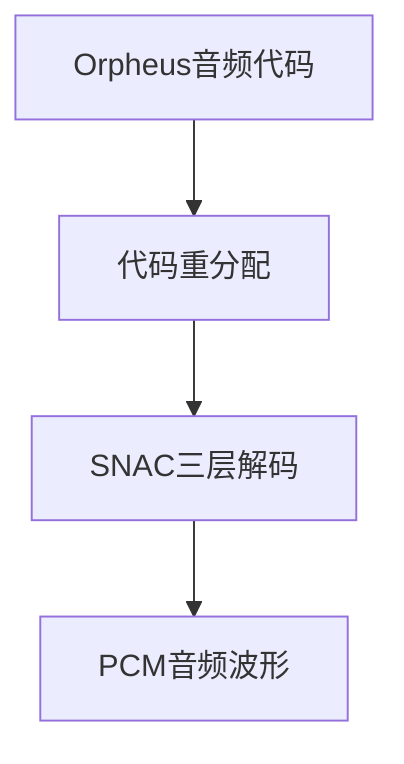

**基本概念**

SNAC是一种专门设计用于TTS系统的神经网络音频解码器，它接收由TTS模型（如Orpheus）生成的离散音频代码，并将这些代码转换为高质量的24kHz音频波形。SNAC的主要特点是能够高效地处理分层编码的音频信息，并生成自然流畅的语音。

**技术架构**

1. **分层结构**：SNAC使用3层结构处理音频信息，而Orpheus模型生成的是7层音频代码。这需要进行代码重分配（redistribution）。

2. **代码重分配映射**：
   - SNAC第0层接收Orpheus的第0层代码
   - SNAC第1层接收Orpheus的第1层和第4层代码（交错排列）
   - SNAC第2层接收Orpheus的第2、3、5、6层代码（交错排列）

3. **解码过程**：
   ```
   Orpheus音频代码 → 代码重分配 → SNAC三层解码 → PCM音频波形
   ```

**实现方式**

SNAC有两种主要实现方式：

1. **PyTorch实现**：
   - 使用原始PyTorch模型进行解码
   - 适用于没有ONNX支持的环境
   - 解码速度相对较慢

2. **ONNX优化实现**：
   - 使用ONNX（Open Neural Network Exchange）格式的预训练模型
   - 支持硬件加速（CUDA或CPU）
   - 提供量化版本，减小模型体积并提高推理速度
   - 实时性能更好（RTF - Real Time Factor更高）

**代码处理流程**

1. **代码验证**：
   - 检查代码是否在有效范围内
   - 确保代码数量是ORPHEUS_N_LAYERS（7）的倍数

2. **代码填充**：
   - 如果代码数量不是7的倍数，会自动进行填充
   - 使用最后一个有效代码或默认代码进行填充

3. **代码重分配**：
   - 将7层Orpheus代码重新映射到3层SNAC代码
   - 按照特定的映射规则进行分配

4. **解码**：
   - 使用SNAC模型（PyTorch或ONNX）将重分配后的代码转换为音频波形
   - 输出24kHz采样率的单声道PCM音频数据

**在TTS系统中的作用**

在整个TTS流程中，SNAC扮演关键角色：

1. TTS模型（Orpheus）生成音频代码
2. SNAC解码器将这些代码转换为实际音频波形
3. 音频波形经过后处理（如淡入淡出、增益调整、水印等）
4. 最终音频被编码为Opus格式并通过HTTP或WebSocket传输给客户端

SNAC的高效解码能力是实现低延迟、高质量流式TTS的关键技术之一，它能够快速将离散的音频代码转换为自然流畅的语音，使系统能够实时响应用户请求。
### 6.2 技术优势

Orpheus针对TTS系统的多个问题提供了创新解决方案：

| 问题 | 解决方案 |
| --- | --- |
| 多模块部署复杂 | 将TTS融入LLM，构建单模型结构，直接生成音频token |
| 推理延迟高 | 使用低位量化（Q4_K_M），结合GGUF格式，加速推理 |
| 情绪无法控制 | 引入\<laugh\>、\<sigh\>、\<giggle\>等prompt控制token |
| 云服务依赖 | 可本地运行于llama.cpp/LM Studio，无需云端推理 |
| 与LLM分离 | 与LLM对话结构兼容，可直接多模态对话生成语音响应 |

### 6.3 局限性分析

Orpheus在端到端设计方面有创新，但也面临一些实际应用挑战：

#### 6.3.1 情感控制缺乏结构建模
- 情感只是通过"prompt token"插入控制，缺少系统性的情绪建模模块
- 可能导致相同\<laugh\>表现出不稳定、偶尔失效的情况（prompt injection不稳定性）

#### 6.3.2 解码器绑定强
- 使用SNAC解码器，意味着最终声音质量与audio codec紧密绑定，不可自由替换为HiFi-GAN等
- 如果codec出现artifacts，则整个系统难以替换解码模块独立优化

#### 6.3.3 定制化困难
- 不支持零样本声音克隆（zero-shot speaker cloning）
- 想生成用户自定义声音仍需"微调"，存在训练门槛

## 7. OuteTTS：GGUF格式优化TTS

### 7.1 架构设计

OuteTTS采用了适合GGUF格式部署的优化设计：

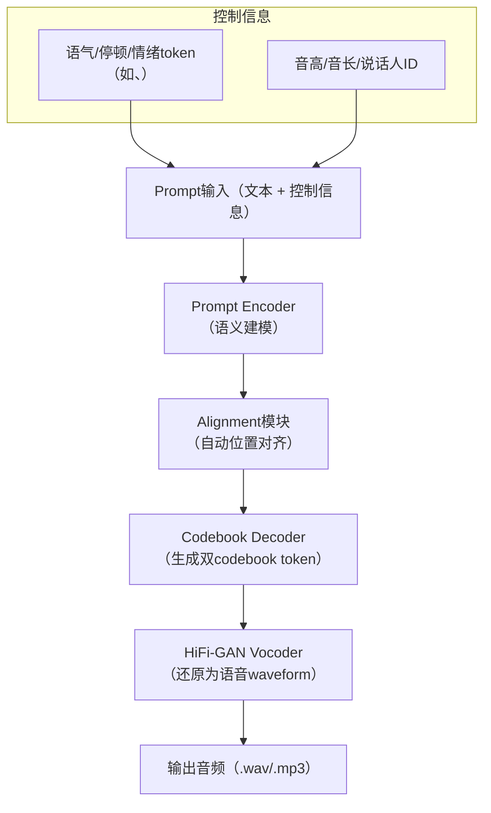

主要模块及其功能：

| 模块 | 描述 |
| --- | --- |
| Prompt Encoder | 输入为自然语言prompt（带上下文、说话人、音色等信息），类似指令引导模型生成语音内容 |
| Alignment模块（内部建模） | 内嵌对齐能力，无需external alignment tool，基于transformer自建位置到token映射 |
| Codebook Decoder | 将文本映射为DAC编码器下的双codebook token（例如codec-C1、codec-C2），作为音频内容的潜在表示 |
| Vocoder（HiFi-GAN） | 将DAC codebook或语音特征映射为最终可播放音频（支持.wav），部署于CPU/GPU |

#### DAC解码器详解

DAC（Discrete Audio Codec）是一种离散音频编解码器，在TTS系统中主要用于将OuteTTS模型生成的音频代码转换为实际的音频波形。DAC是一种高效的神经网络音频解码器，专为高质量语音合成设计。

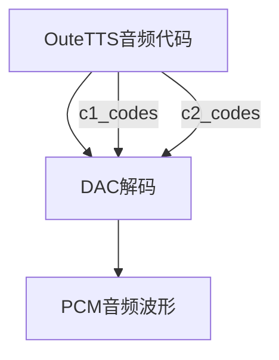

**技术架构**

1. **编码结构**：DAC使用2层编码结构（双编码本），每个编码本的大小为1024，这与SNAC的3层结构不同。

2. **代码格式**：
   - DAC使用两组代码：c1_codes和c2_codes
   - 这两组代码长度相同，一一对应
   - 每个代码的取值范围是0-1023

3. **解码过程**：
   ```
   OuteTTS音频代码(c1_codes, c2_codes) → DAC解码 → PCM音频波形
   ```

4. **采样率**：DAC生成24kHz采样率的音频，与SNAC相同

**实现方式**

与SNAC类似，DAC也有两种实现方式：

1. **PyTorch实现**：
   - 使用原始PyTorch模型进行解码
   - 适用于没有ONNX支持的环境

2. **ONNX优化实现**：
   - 使用ONNX格式的预训练模型
   - 支持硬件加速（CUDA或CPU）
   - 提供量化版本，减小模型体积并提高推理速度

**DAC的高级特性**

DAC解码器实现了多项高级特性，使其特别适合流式TTS应用：

1. **批处理优化**：
   - 自适应批次大小（8-64帧）
   - 根据性能历史动态调整批次大小

2. **流式处理**：
   - 支持分批解码和流式输出
   - 针对网络质量自适应调整参数

3. **音频效果处理**：
   - 支持淡入淡出效果
   - 支持音频增益调整

#### SNAC与DAC的比较

特性 | DAC | SNAC |
|------|-----|------|
编码层数 | 2层 | 3层 |
代码组织 | 两组平行代码 | 三层分层代码 |
编码本大小 | 1024 | 4096 |
输入格式 | c1_codes, c2_codes | 7层Orpheus代码重分配到3层 |

**适用模型**

- **DAC**：专为OuteTTS一类的模型设计，处理双编码本格式的音频代码
- **SNAC**：专为Orpheus一类的模型设计，处理7层编码格式的音频代码

**性能特点**

- **DAC**：更注重流式处理和低延迟，有更多自适应优化
- **SNAC**：更注重音频质量和准确的代码重分配

**代码处理方式**

- **DAC**：直接处理两组代码，无需复杂的重分配
- **SNAC**：需要将7层Orpheus代码重新映射到3层结构

**为什么不同模型使用不同解码器**

OuteTTS和Orpheus使用不同的解码器主要有以下原因：

1. **模型设计差异**：
   - OuteTTS模型设计时就考虑了与DAC的兼容性，直接输出DAC格式的双编码本代码
   - Orpheus模型基于不同的架构，输出7层编码，需要SNAC进行解码

2. **编码格式不兼容**：
   - DAC期望接收两组平行的代码(c1_codes, c2_codes)
   - SNAC期望接收重分配后的3层代码，这些代码来自Orpheus的7层输出

3. **优化方向不同**：
   - OuteTTS+DAC组合更注重流式处理和低延迟
   - Orpheus+SNAC组合更注重音频质量和多层次编码


### 7.2 技术优势

OuteTTS针对TTS系统的多个问题提供了创新解决方案：

| 目标问题 | Llama-OuteTTS的应对策略 |
| --- | --- |
| 多语言TTS无需预处理 | 直接支持中、英、日、阿语等语言，无需转拼音或强制空格 |
| 对齐困难、需要外部CTC | 模型内建对齐机制，直接将文字对齐至生成token，无需外部对齐工具 |
| 音质与吞吐矛盾 | DAC + 双codebook提高音质；每秒生成150 token，速度相对同类扩散模型大幅提升 |
| 模型调用复杂 | GGUF格式封装结构 + llama.cpp支持，本地部署更简洁 |

### 7.3 局限性分析

OuteTTS在GGUF格式优化方面有创新，但也面临一些实际应用挑战：

#### 7.3.1 音频编码瓶颈
- 当前主要使用基于DAC的双codebook表达方式，虽然提升了音质，但：
  - 解码器（HiFi-GAN）仍为瓶颈，尤其在边缘设备上存在推理时延
  - 如果后续使用更复杂模型（如VQ-VAE），其并行性与高效推理将更成问题
  - 当前gguf-connector基于C++实现，尚不支持移动端原生部署（如Android/iOS TensorDelegate）

#### 7.3.2 并行性与上下文依赖
- 模型强依赖上下文记忆（如token间时序依赖），推理中：
  - 不能像一些自回归扩散模型那样大幅并行，推理仍为串行主导
  - sampling阶段需要设定重复惩罚窗口（默认64 token）
  - 高上下文长度（例如8192）虽然支持，但部署时memory cost显著增加

#### 7.3.3 风格迁移与个性控制不足
- 当前版本主要针对"单人+语调控制"优化，风格迁移机制不够完善：
  - 缺少基于embedding的说话人控制机制
  - 多情绪、多风格还需通过prompt微调，而非显式token控制
  - 未来需要引入speaker encoder或风格/情绪向量
## 8. F5-TTS：扩散模型优化TTS

### 8.1 架构设计

F5-TTS采用了基于扩散模型的创新设计：

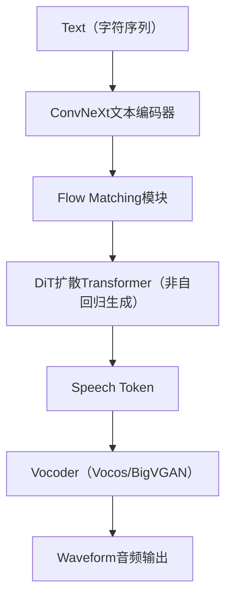

主要模块及其功能：

| 模块 | 描述 |
| --- | --- |
| ConvNeXt文本编码器 | 用于提取文本的全局特征，具备并行卷积能力 |
| Flow Matching | 用于训练过程中学习noise → speech token的映射路径 |
| DiT（Diffusion Transformer） | 核心合成器，基于扩散建模的并行语音token生成器 |
| Sway Sampling | 推理阶段优化采样路径，减少无效扩散步骤，提升速度和质量 |
| Vocoder | 使用BigVGAN或Vocos将speech token还原为波形音频 |

### 8.2 技术优势

F5-TTS针对TTS系统的多个问题提供了创新解决方案：

| 问题 | F5-TTS的解决方案 |
| --- | --- |
| 音素对齐、duration依赖 | 输入字符直接填充对齐，不依赖时长预测器或对齐器 |
| 语音质量不自然、克隆能力弱 | 采用扩散式语音token合成，配合sway sampling技术提升自然度 |

### 8.3 局限性分析

F5-TTS在扩散模型优化方面有创新，但也面临一些实际应用挑战：

#### 8.3.1 推理需采样多步
虽然sway sampling已优化，但推理仍需执行扩散采样过程（约20步）

#### 8.3.2 对声码器依赖
最终语音质量高度依赖vocoder（如vocos、BigVGAN），需单独部署

#### 8.3.3 音频长度控制弱
没有显式的duration predictor，语速控制需通过额外的prompt或采样技巧

#### 8.3.4 许可限制
使用CC-BY-NC-4.0开源协议，不能直接商业使用，需要遵循授权条款

## 9. Index-TTS：多模态条件TTS

### 9.1 架构设计

Index-TTS采用了多模态条件控制的创新设计：

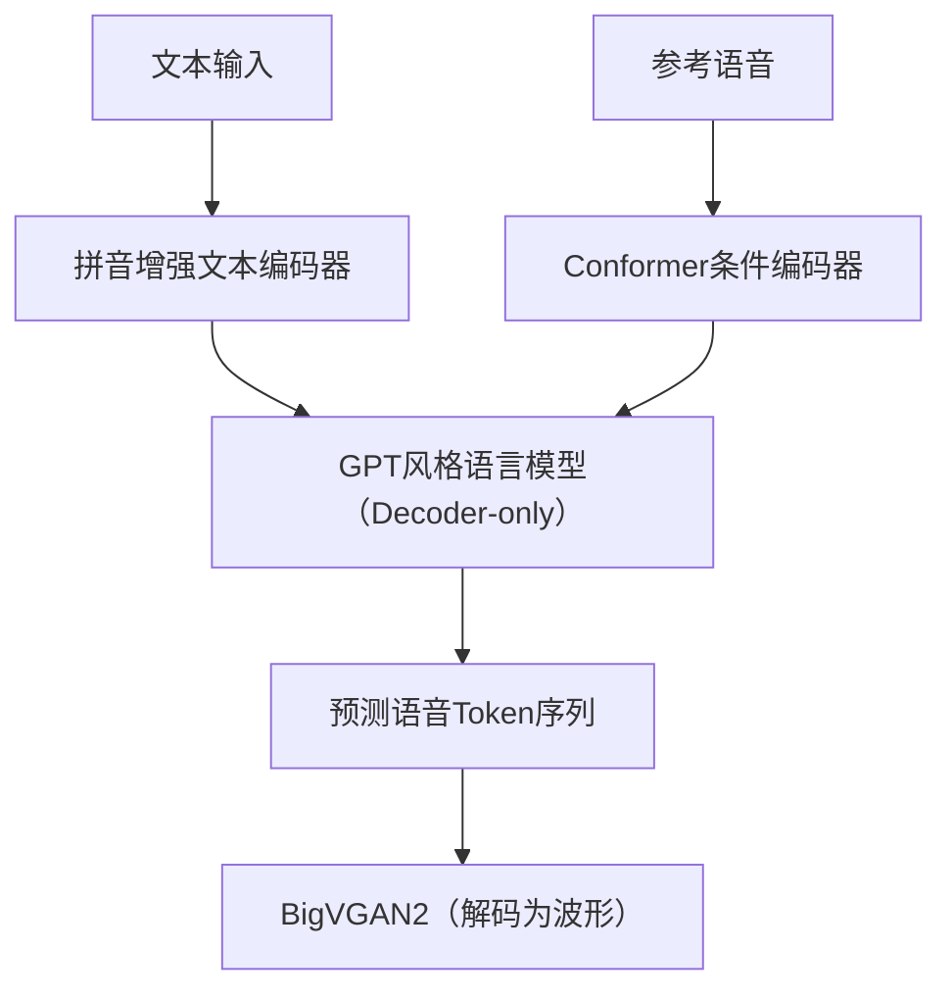

主要模块及其功能：

| 模块名称 | 功能说明 |
| --- | --- |
| 文本编码器（字符 + 拼音） | 中文支持拼音输入，英文直接字符建模- 能准确捕捉发音特征，解决多音字、轻声等复杂读音问题 |
| 神经音频 tokenizer | 使用 FSQ 编码器，将音频转为离散 token- 每帧（25Hz）用多个 codebook 表达，token 使用率达 98%，远高于 VQ |
| LLM-style Decoder（GPT结构） | Decoder-only Transformer 架构- 条件输入包括文本 token 和参考音频- 支持多说话人迁移与零样本语音生成 |
| 条件 Conformer 编码器 | 编码参考音频中音色、节奏、韵律等隐含特征- 提供稳定控制向量输入 GPT，提升稳定性与音色还原度 |
| BigVGAN2 | 解码最终音频波形- 兼顾高保真度与实时合成性能 |

### 9.2 技术优势

Index-TTS针对TTS系统的多个问题提供了创新解决方案：

| 问题 | IndexTTS 的解决方案 |
| --- | --- |
| 多音字控制 | 字符+拼音联合建模，可显式指定发音 |
| 说话人一致性差 | 引入 Conformer 条件模块，用参考语音增强控制能力 |
| 音频 token 利用率低 | 使用 FSQ 替代 VQ-VAE，有效利用 codebook，提升表达力 |
| 模型稳定性差 | 分阶段训练 + 条件控制，减少发散，保证合成质量 |
| 英文兼容差 | IndexTTS 1.5 强化英文 token 学习，增强跨语种适应性 |
| 推理慢 | GPT 解码器 + BigVGAN2，兼顾自然度与速度，可部署工业系统 |

### 9.3 局限性分析

Index-TTS在多模态条件控制方面有创新，但也面临一些实际应用挑战：

#### 9.3.1 韵律控制依赖参考音频
- 当前系统的韵律（prosody）生成主要依赖输入的参考音频隐式引导
  - 缺少显式韵律标注或 token 控制机制，无法手动控制停顿、重读、语调等信息
  - 在参考音频不理想或风格差异较大时，韵律迁移效果容易出现不自然或不一致的问题
- 不利于模板化大规模应用场景（如客服、朗读）中的可控性与稳定性需求

#### 9.3.2 生成不确定性
- 使用 GPT-style 自回归生成结构，虽然语音自然度高，但存在一定的不确定性：
  - 同一输入在不同推理轮次中，生成语音可能在语速、韵律、轻微音色上存在波动
  - 难以完全复现生成结果，不利于音频缓存与版本管理
- 在高一致性要求的场景（如影视后期、法律合成）中，可能影响交付稳定性

#### 9.3.3 说话人迁移非完全端到端
- 当前说话人控制模块仍依赖显式的参考音频 embedding（如 speaker encoder）作为条件向量输入
  - 说话人向量需要外部模块提取，非 end-to-end 整合
  - 当参考音频质量低或说话风格变化大时，克隆效果不稳定
- 不支持完全文本驱动的说话人指定（如指定 speaker ID 生成），限制了自动化部署灵活性

## 10. Mega-TTS3：统一建模TTS

### 10.1 架构设计

Mega-TTS3采用了统一建模的创新设计：

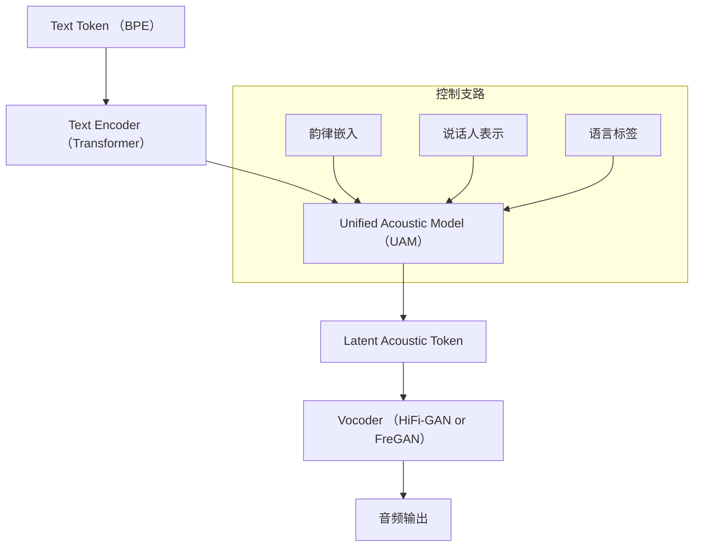

主要模块及其功能：

| 模块 | 说明 |
| --- | --- |
| Text Encoder | 将输入文本 token 编码为语义向量，支持多语言 token |
| UAM（统一建模器） | 核心模块，融合 Text、Prosody、Speaker、Language 信息，预测 acoustic latent |
| Continuous Speaker Modeling | 跨时序建模说话人信息，减少风格漂移问题 |
| Prosody Control Module | 提供独立的韵律控制器，可精确调控停顿、节奏、音高等 |
| Vocoder | 最终将 latent token 解码为音频波形，使用 HiFi-GAN / FreGAN |

### 10.2 技术优势

Mega-TTS3针对TTS系统的多个问题提供了创新解决方案：

| 问题 | 描述 | Mega-TTS3 的解决方案 |
| --- | --- | --- |
| 建模粒度不一致 | 不同模块（文本、韵律、语音）建模粒度不统一，导致信息割裂、风格迁移失真 | 引入 统一建模器（Unified Acoustic Model, UAM），融合文本编码、韵律信息、语言标签与音频 latent 统一建模，避免阶段性信息丢失 |
| 多说话人建模难 | 传统嵌入方式难以稳定建模大量说话人，泛化性与合成一致性不足 | 提出 连续说话人建模（Continuous Speaker Embedding），将说话人表示作为时序向量嵌入统一建模过程，提高风格一致性和迁移稳定性 |
| 控制粒度弱 | 控制情绪、语速、韵律等风格时缺乏可插拔的独立控制机制 | 设计 可插拔控制分支（Prosody / Emotion / Language / Speaker Embedding），每种控制信号独立建模，可组合使用、灵活插拔，提升控制精度 |
| 多语种互扰问题 | 语言标签建模稀疏，多语种系统往往互相干扰，影响语音质量 | 引入 显式语言标签嵌入 + 多语言共享 Transformer 参数机制，在保证语言辨识度的同时提升语种间共享性，缓解语种间干扰 |

### 10.3 局限性分析

Mega-TTS3在统一建模方面有创新，但也面临一些实际应用挑战：

#### 10.3.1 控制粒度有限 & 可解释性弱
- 控制维度虽多（情绪、语速、韵律等），但目前仍依赖端到端模型隐式建模：
  - 缺乏可插拔式独立控制模块
  - 控制变量间耦合强，难以精准调控单一维度
  - 不适合面向工业部署的"可控可解释合成"场景

#### 10.3.2 多语种语音质量不均
- 尽管支持多语言建模，但实际生成中仍会出现：
  - 语种标签依赖严重，标签错误会直接导致发音错乱
  - 存在语言间互扰问题（如中英混读时口音漂移）
  - 低资源语种生成效果显著低于高资源语种

## 11. 总结与展望

### 11.1 现代TTS模型架构趋势

通过对十种主流TTS模型的深入分析，我们可以观察到以下几个明显的技术趋势：

1. **统一架构化**：从早期的多模块级联到如今的端到端统一架构，TTS系统正朝着更加一体化的方向发展
2. **离散token表示**：使用离散token表示音频已成为主流，这种方式更适合与LLM等模型融合
3. **扩散与自回归并存**：扩散模型提供了高质量生成能力，而自回归模型则在上下文建模方面有优势
4. **多模态条件控制**：通过参考音频、情感标签等多模态输入控制语音生成，提升个性化能力
5. **部署格式标准化**：GGUF等格式的普及使得TTS模型可以更容易地在不同平台上部署

### 11.2 技术挑战与未来方向

尽管现代TTS系统取得了显著进步，但仍面临一些关键挑战：

1. **推理效率与音质平衡**：如何在保证高音质的同时提高推理速度，特别是在边缘设备上
2. **可控性与自然度权衡**：增强控制能力往往会牺牲语音的自然度，如何平衡二者是一个持续挑战
3. **多语言一致性**：构建真正高质量的多语言TTS系统，保证各语种间的一致性和质量
4. **情感表达深度**：当前系统在细腻情感表达方面仍有局限，未来需要更深入的情感建模
5. **长文本连贯性**：改善长文本生成时的连贯性和一致性，特别是在段落和章节级别的语音合成

### 11.3 应用场景匹配建议

不同TTS模型适合不同的应用场景，以下是一些匹配建议：

| 应用场景 | 推荐模型 | 理由 |
| --- | --- | --- |
| 边缘设备/低资源环境 | Kokoro, Dia | 轻量级设计，支持ONNX/GGUF格式，低延迟 |
| 高质量音频内容创作 | Index-TTS, F5-TTS | 高音质输出，支持参考音频克隆，适合专业内容制作 |
| 多语言客服系统 | Mega-TTS3 | 优秀的多语言支持，统一建模架构，稳定性好 |
| 对话式语音助手 | CosyVoice, Orpheus | 与LLM兼容性好，支持对话上下文，情感表达自然 |
| 本地部署语音应用 | OuteTTS | GGUF格式优化，支持CPU推理，无需云服务 |

随着技术的不断进步，我们可以期待未来的TTS系统将进一步打破模态边界，实现更加自然、个性化、情感丰富的语音交互体验。