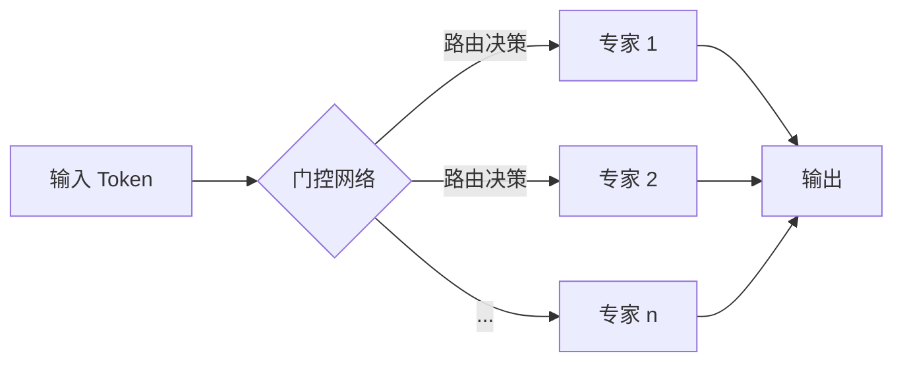
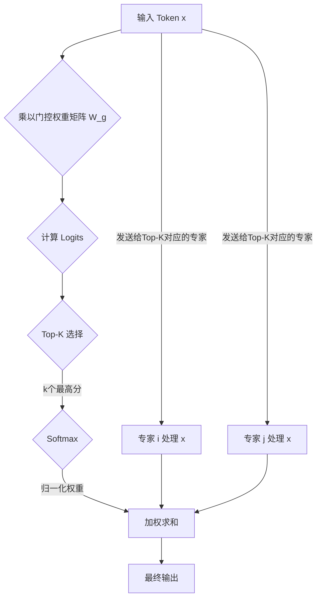

## 1. 简介

MoE (Mixture of Experts) 是一种神经网络架构，它通过将大型模型分解为多个较小的"专家"网络，并使用一个"门控"网络来动态地为每个输入选择最合适的专家子集，从而在不显著增加计算成本的情况下，极大地扩展了模型的容量。

这种方法的灵感来源于人类社会中的专家系统，即针对特定问题咨询相应的专家。在深度学习中，这意味着模型可以学习将不同的输入路由到专门处理这类数据的专家网络，从而实现更高效、更专业的学习。

## 2. 核心组件：宏观与微观解析

从宏观上看，MoE 层在 Transformer 模型中通常作为标准前馈网络（Feed-Forward Network, FFN）层的一种高效替代。传统的 FFN 层会对序列中的每一个 token 应用完全相同的变换。而 MoE 层则引入了**条件计算 (Conditional Computation)** 的概念：对于每一个 token，模型会动态地选择一小部分"专家"网络来处理它，而不是动用整个模型的全部参数。这种机制使得模型可以在参数量巨大的同时，保持计算量的相对恒定。

一个 MoE 层主要由两个核心部分组成：**专家网络 (Expert Networks)** 和 **门控网络 (Gating Network)**。
下面是 MoE 层宏观架构的可视化表示：

一个 MoE 层主要由两个核心部分组成：**专家网络 (Expert Networks)** 和 **门控网络 (Gating Network)**。

### 2.1. 专家网络 (Expert Networks)：各司其职的专才

#### 底层构成与变体

在底层，每个"专家"本身通常是一个独立的前馈神经网络（FFN）。在标准的 Transformer 架构中，一个 FFN 通常由两个线性层和一个非线性激活函数（如 GeLU 或 SwiGLU）组成。

*   **同构专家 (Homogeneous Experts)**：在大多数 MoE 模型中，所有的专家都采用完全相同的网络结构。例如，在 Mixtral 8x7B 模型中，每个 MoE 层包含 8 个结构相同的专家 FFN。这种设计便于实现和优化。
*   **异构专家 (Heterogeneous Experts)**：虽然不常见，但理论上专家也可以是异构的，例如使用不同的激活函数、不同的隐藏层维度，甚至更复杂的结构（如卷积层）。这可能允许模型学习更多样化的特征，但会增加实现的复杂性。

#### 功能特化：从通用到专精

在训练过程中，尽管所有专家开始时是相同的，但门控网络的路由机制会引导它们向不同的"专业方向"发展。例如，在自然语言处理任务中，经过充分的训练，可能会出现：

*   **语法专家**：专门处理与句子结构、词性等相关的 token。
*   **语义专家**：专注于理解词语的含义和上下文关系。
*   **特定领域知识专家**：例如，一个专家可能专门处理与"法律"相关的文本，而另一个则对"生物医学"领域的知识更为敏感。

这种功能特化是 MoE 模型高效性的关键来源，因为它允许模型用专门的子网络处理特定类型的信息，而不是用一个庞大而通用的网络处理所有信息。

### 2.2. 门控网络 (Gating Network)：智能路由与调度中心

门控网络是 MoE 的核心决策单元，它负责为每一个输入的 token 分配最合适的专家。

#### 底层技术细节

门控网络的实现通常非常简洁高效。其工作流程如下：

1.  **生成 Logits**：对于输入的 token 的向量表征 `x`（通常是自注意力层的输出），门控网络通过一个简单的可训练线性层 `W_g` 来计算路由的 logits： `logits = einsum("d,de->e", x, W_g)`，其中 `d` 是 token 的维度，`e` 是专家的数量。这个操作产生一个长度为 `e` 的向量，每个元素代表对应专家的"得分"。

2.  **Top-K 路由机制**：为了实现稀疏计算，通常不会将 token 发送给所有专家。门控网络会从 logits 向量中选择得分最高的 `k` 个值。这个 `k` 值是一个重要的超参数，在 Mixtral 8x7B 中，`k=2`。这意味着每个 token 只会被两个最相关的专家处理。

3.  **计算门控权重 (Softmax)**：选出的 `k` 个 logits 会通过一个 Softmax 函数进行归一化，从而生成 `k` 个门控权重（Gating Weights）。这些权重决定了最终如何组合这 `k` 个专家的输出。
    `weights = softmax(top_k_logits)`

4.  **计算最终输出**：输入 token `x` 被发送给被选中的 `k` 个专家，得到 `k` 个专家的输出。最终的输出是这 `k` 个专家输出的加权和，权重就是上一步计算出的门控权重。
    `output = sum(weights[i] * expert_i(x) for i in top_k_indices)`

下面是这个工作流程的可视化表示：

#### 关键挑战：负载均衡 (Load Balancing)

门控网络的一个关键挑战是"马太效应"：部分专家可能因为初始权重略高而获得更多训练机会，从而变得更强，进而被更频繁地选择，导致其他专家被"饿死"。为了解决这个问题，MoE 引入了一个**辅助的负载均衡损失 (Auxiliary Load Balancing Loss)**。

*   **原理**：该损失函数旨在鼓励门控网络将 token 尽可能均匀地分配给所有专家。它通常通过计算每个专家在一个批次中被分配的 token 比例的平方和，再乘以一个可调的超参数 `α` 来实现。当分配越不均衡时，这个损失值就越大。
*   **优化**：这个辅助损失会与模型的主任务损失（如语言模型的交叉熵损失）相加，共同构成最终的总损失函数。通过在反向传播中同时优化这两个损失，模型被激励在完成主任务的同时，保持专家之间的负载均衡。

## 3. MoE 模型的训练方法：应对规模的挑战

由于 MoE 模型拥有巨大的参数量（尽管每次计算是稀疏的），其训练对计算资源，特别是内存，提出了极大的挑战。为了有效训练 MoE 模型，必须采用复杂的并行化策略。

### 3.1. 专家并行 (Expert Parallelism)

这是训练 MoE 模型最核心的并行策略。

*   **核心思想**：将不同的专家（Experts）分布到不同的计算设备（如 GPU）上。例如，在一个有 8 个专家的 MoE 层和 8 个 GPU 的场景下，每个 GPU 负责存储和计算一个专家。模型的其他部分（如自注意力层）则可以在每个 GPU 上进行复制。
*   **工作流程与通信开销**：在每次前向传播中，来自各个 GPU 的 token 在经过门控网络计算后，需要根据路由决策被发送到存储相应专家的 GPU 上。这个过程涉及到一次全局的 **All-to-All** 通信操作，即每个 GPU 都需要向所有其他 GPU 发送和接收数据。计算完成后，结果再通过另一次 All-to-All 通信传回原始的 GPU。这种密集的通信是专家并行模式下的主要性能瓶颈。

### 3.2. 结合其他并行策略

为了应对不同规模的模型和硬件配置，专家并行通常需要与其他并行策略结合使用：

*   **数据并行 (Data Parallelism)**：这是最常见的并行方式。当 GPU 数量超过专家数量时，可以将多个 GPU 组成一个数据并行组，每个组内完整地包含一套专家（通过专家并行分布）。例如，在 64 个 GPU 和 8 个专家的情况下，可以创建 8 个数据并行组，每个组有 8 个 GPU，每个 GPU 负责一个专家。
*   **模型并行与流水线并行**：对于那些单个专家或非 MoE 层都无法装入单个 GPU 的超大规模模型，还需要引入张量模型并行（Tensor Parallelism）和流水线并行（Pipeline Parallelism）来进一步拆分模型。

总而言之，MoE 的训练是一个复杂的多维并行工程，需要根据模型大小、专家数量、GPU 数量和网络带宽等因素精心设计并行策略。

## 4. MoE 的优势

- **巨大的模型容量**: MoE 允许模型拥有海量的参数（例如，数万亿个参数），而不需要在每次前向传播时都计算所有参数。这使得模型能够学习更复杂、更细致的知识。
- **计算成本可控**: 由于采用了稀疏激活的策略（只激活少数专家），MoE 模型的训练和推理成本与一个参数量远小于其总参数量的密集模型相当。
- **更快的训练和推理**: 在相同的计算预算下，MoE 模型通常比密集模型收敛得更快，推理速度也更快。

## 5. MoE 的挑战

- **训练不稳定性**: 门控网络可能会倾向于总是选择少数几个"受欢迎"的专家，导致其他专家得不到充分的训练。为了解决这个问题，通常会引入一个"负载均衡损失"（Load Balancing Loss），以鼓励门控网络将输入均匀地分配给所有专家。
- **高昂的通信成本**: 在分布式训练中，由于不同的专家可能分布在不同的计算设备上，将输入数据从门控网络路由到选定的专家会产生显著的通信开销。
- **复杂的实现**: 相比于标准的密集模型，MoE 模型的实现和部署更为复杂，需要专门的并行计算策略和硬件支持。
- **内存消耗**: 尽管计算是稀疏的，但模型的全部参数（所有专家）都需要存储在内存中，这对硬件提出了很高的要求。

## 6. 关键技术与最新进展

- **Switch Transformers**: 这是 Google 提出的一种简化的 MoE 架构，它将 top-k 策略简化为 top-1，即每个 token 只被路由到一个专家。这种设计极大地简化了路由逻辑，并降低了通信成本。
- **GShard**: 这是一种用于在超大规模集群上训练 MoE 模型的系统。它通过巧妙的数据和模型并行策略，有效地解决了 MoE 训练中的通信瓶颈问题。
- **专家容量因子 (Expert Capacity Factor)**: 为了处理负载不均衡问题，可以为每个专家设置一个"容量"，即它在一个批次中最多能处理的 token 数量。如果某个专家被选中的次数超过了其容量，多余的 token 将被"丢弃"或路由到其他专家。
- **最新的路由策略**: 研究人员正在探索更先进的路由策略，例如，允许 token 被路由到多个专家并加权组合其输出，或者使用更复杂的门控网络来做出更智能的路由决策。
- **在视觉领域的应用**: MoE 不仅仅局限于 NLP 领域，它也被成功地应用于计算机视觉任务，如姿态估计，通过为不同的数据集或姿态类型训练专门的专家来提升模型的性能。

## 7. 总结与展望

MoE 模型通过引入稀疏激活的专家网络，成功地在可控的计算成本下实现了模型规模的巨大突破，成为构建超大规模语言模型和视觉模型的关键技术之一。

尽管面临训练稳定性、通信开销等挑战，但随着 Switch Transformers、GShard 等技术的不断成熟，以及新的路由策略和硬件优化的出现，MoE 的应用前景将更加广阔。未来，我们有望看到更多、更大、更高效的 MoE 模型在各个领域发挥重要作用。