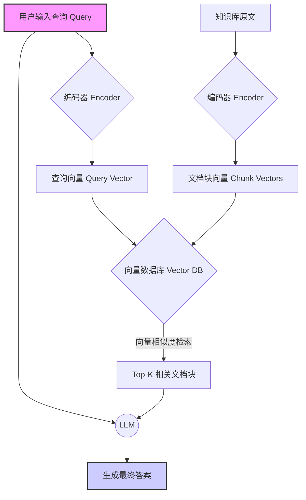
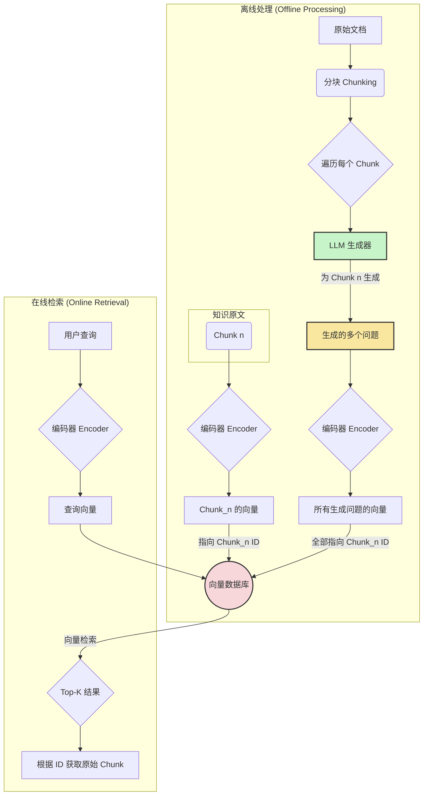

## 1. 导论：为什么 RAG 需要数据增强？

### 1.1 从"语义鸿沟"说起

检索增强生成（Retrieval-Augmented Generation, RAG）的核心在于"检索"这一环。然而，在实际应用中，检索环节常常成为整个系统的瓶颈。其根本原因在于 **"语义鸿沟"（Semantic Gap）** 或 **"召回失配"（Retrieval Mismatch）**。

具体来说，这个问题体现在：

*   **用户查询的多样性与不确定性**：用户会用千变万化的方式提问，可能使用口语、缩写、错别字，或者从不同的角度描述同一个问题。
*   **知识库文档的固定性与规范性**：知识库中的文档通常是结构化、书面化的，用词相对固定。

这就导致了用户的查询向量（Query Vector）和知识库中的文档块向量（Chunk Vector）在向量空间中可能距离很远，即便它们在语义上是相关的。

**举个例子：**

*   **知识库文档**：`# ThinkPad X1 Carbon 散热指南\n\n如果您的 ThinkPad X1 Carbon 出现过热问题，可以尝试清理风扇、更新BIOS或在电源管理中选择平衡模式...`
*   **用户的可能查询**：
    *   "我的笔记本电脑好烫，怎么办？"
    *   "小新笔记本风扇声音大是不是过热了？" (即便品牌不完全匹配，但问题本质相似)
    *   "电脑发热严重，打游戏掉帧"
    *   "如何给我的 ThinkPad 降温？"

在标准的RAG流程中，以上这些查询很可能无法准确召回上述的散热指南，因为它们的字面表达和向量表示差异太大。

### 1.2 标准 RAG 流程图

为了更好地理解问题所在，我们先来看一下标准RAG的工作流程。


*图1：标准RAG系统工作流程*

如上图所示，整个检索过程严重依赖于 `Query Vector` 和 `Chunk Vectors` 的相似度。如果二者存在"语义鸿沟"，检索效果将大打折扣。

**数据增强/数据泛化** 的核心目标，就是通过技术手段，主动地为知识库中的每个文档块生成大量潜在的、语义相同但表述多样的"虚拟查询"或"等价描述"，从而在知识库侧预先填补这条鸿沟。

## 2. 基于 LLM 的数据增强/泛化技术：深入底层细节

利用大语言模型（LLM）强大的语言理解和生成能力，是进行数据增强/泛化最高效、最主流的方式。其核心思想是：**让LLM扮演用户的角色，为每一个知识片段（Chunk）生成它可能对应的各种问题和表述。**

主要的技术实现路径有两种：**假设性问题生成 (Hypothetical Questions)** 和 **摘要与改写 (Summarization & Paraphrasing)**。

### 2.1 技术路径一：假设性问题生成（Hypothetical Questions）

这是最直接也最有效的方法。对知识库中的每一个文档块（Chunk），我们都让LLM生成一组能够被这个文档块回答的问题。

#### 技术实现细节：

1.  **文档分块（Chunking）**：首先，将原始文档切分成有意义的、大小适中的知识块（Chunk）。这是所有RAG的基础。
2.  **为每个 Chunk 生成问题**：
    *   遍历每一个 Chunk。
    *   将该 Chunk 的内容作为上下文，喂给一个LLM。
    *   使用精心设计的 Prompt（详见第3章），指示LLM生成 N 个与该 Chunk 内容紧密相关的问题。
3.  **数据组织与索引**：
    *   **关键步骤**：将生成的 N 个问题与原始的 Chunk 关联起来。在进行向量化时，**不是对问题本身进行向量化**，而是将每个生成的"问题-原文对"进行处理。一种常见的做法是，在向量化时将问题和原文拼接起来，或者在索引时将问题作为元数据（Metadata）与原文块的向量关联。
    *   更常见的做法是，**将生成的问题的向量** 和 **原文块的向量** 都存入向量数据库，并且都指向同一个原文块ID。这样，当用户查询时，无论是匹配到原文块还是匹配到某个生成的问题，都能最终定位到正确的原文。
4.  **存入向量数据库**：将处理后的数据（原文块向量、生成的问题向量）及其元数据（如原文ID）存入向量数据库（如 ChromaDB, Milvus, Qdrant 等）。

#### 流程图：


*图2：集成【假设性问题生成】的数据增强RAG流程*

这种方法极大地丰富了每个知识块的"可检索性"，相当于为每个知识点创建了多个不同的"入口"。

### 2.2 技术路径二：摘要与改写 (Summarization & Paraphrasing)

除了生成问题，还可以生成知识块的摘要或用不同的方式重写它。

*   **摘要 (Summarization)**：对于一个较长的知识块，LLM可以生成一个简短的核心摘要。这个摘要可以作为一个"粗粒度"的检索入口。当用户的查询比较宽泛时，可能更容易与摘要匹配。
*   **改写 (Paraphrasing)**：让LLM用不同的句式、词汇重写同一个知识块的核心内容。这也能创造出与原文向量不同的、但语义一致的新向量。

#### 技术实现细节：

实现方式与假设性问题生成类似，只是Prompt的目标从"生成问题"变为了"生成摘要"或"进行改写"。生成的数据同样与原始Chunk关联，并将其向量存入数据库。

在实践中，**假设性问题生成通常比摘要/改写更受欢迎**，因为它更直接地模拟了用户的"提问"行为，与检索任务的本质更加契合。

## 3. 泛化数据的 Prompt 工程：一个优秀的示例

Prompt 的质量直接决定了生成数据的质量。一个好的Prompt应该像一个精准的手术刀，引导LLM生成我们想要的数据。

以下是一个为"假设性问题生成"任务设计的、考虑周全的Prompt示例：

```text
### 角色与目标 (Role and Goal)
你是一名高级AI助手，你的任务是为给定的知识文本（Context）生成一组高质量、多样化的问题。这些问题应该能够被所提供的文本完全回答。你的目标是帮助构建一个更智能的问答系统，让用户无论怎么提问，只要与文本内容相关，都能找到答案。

### 指令 (Instructions)
根据下方提供的`[原始文本]`，请生成 **5** 个不同的问题。

### 要求 (Requirements)
1.  **多样性 (Diversity)**：生成的问题必须在句式、用词和意图上有所不同。请尝试从不同角度提问，例如：
    *   **How-to 类型**：如何操作...？
    *   **Why 类型**：为什么会发生...？
    *   **What is 类型**：...是什么意思？
    *   **Comparison 类型**：...和...有什么区别？
    *   **What-if 类型**：如果...会怎么样？
2.  **角色扮演 (Persona)**：想象自己是不同类型的用户在提问：
    *   一个对此领域一无所知的**新手 (Beginner)**。
    *   一个寻求深入技术细节的**专家 (Expert)**。
    *   一个正在写作业寻求答案的**学生 (Student)**。
3.  **完全可回答 (Fully Answerable)**：确保每个生成的问题都能完全且仅通过`[原始文本]`中的信息得到回答。不要提出任何需要外部知识的问题。
4.  **语言风格 (Language Style)**：问题应自然、清晰，符合中文口语习惯。

### 输出格式 (Output Format)
请严格按照以下JSON格式输出，不要添加任何额外的解释或文本：
```json
{
  "generated_questions": [
    {
      "persona": "新手",
      "question": "这里是第一个问题"
    },
    {
      "persona": "专家",
      "question": "这里是第二个问题"
    },
    {
      "persona": "学生",
      "question": "这里是第三个问题"
    },
    // ... more questions
  ]
}
```

### [原始文本]
{context_chunk}
```

#### Prompt 设计解析：

*   **角色与目标**：给LLM一个清晰的定位，让它理解任务的意义，而不仅仅是机械执行。
*   **多样性要求**：这是最关键的部分。它引导LLM从不同维度思考，避免生成大量同质化的问题（例如，只是简单地把陈述句改成疑问句）。
*   **角色扮演**：这一指令能极大地丰富问题的多样性。新手的问题可能更宽泛、更口语化，而专家的问题可能更具体、更技术化。
*   **完全可回答**：这是一个重要的约束，保证了生成的问题与原文的强相关性，避免引入噪声。
*   **JSON输出格式**：强制的结构化输出使得LLM的返回结果能够被程序轻松解析和处理，是自动化流程中必不可少的一环。

## 4. 效果验证：如何衡量数据增强的成效？

数据增强不是一个"做了就一定好"的过程，必须建立一套科学的评估体系来验证其效果。评估应从**召回率**和**最终答案质量**两个层面进行。

### 4.1 召回率评估 (Retrieval Evaluation)

这是评估检索环节改进情况的核心指标。

#### 步骤：

1.  **构建评估数据集**：这是最关键的一步。你需要创建一个包含 `(问题, 对应正确原文Chunk_ID)` 的测试集。这个测试集中的问题应该尽可能多样化，模拟真实用户查询。
2.  **进行两次测试**：
    *   **实验组A（无数据增强）**：使用标准的RAG流程，用测试集中的问题去检索，记录召回的Top-K个Chunk ID。
    *   **实验组B（有数据增强）**：使用集成了数据增强的知识库，用同样的问题去检索，记录召回的Top-K个Chunk ID。
3.  **计算评估指标**：
    *   **Recall@K (召回率)**：测试集中有多少比例的问题，其对应的正确Chunk_ID出现在了召回结果的前K个中？这是最重要的指标。`Recall@K = (正确召回的问题数) / (总问题数)`。
    *   **Precision@K (精确率)**：在召回的前K个结果中，有多少是正确的？对于单个问题，如果正确答案只有一个，那么 Precision@K 要么是 1/K 要么是 0。
    *   **MRR (Mean Reciprocal Rank, 平均倒数排名)**：正确答案在召回列表中排名的倒数的平均值。该指标不仅关心是否召回，还关心召回的排名有多靠前。排名越靠前，得分越高。`MRR = (1/N) * Σ(1 / rank_i)`，其中 `N` 是问题总数，`rank_i` 是第 i 个问题正确答案的排名。

通过对比实验组A和B的 `Recall@K` 和 `MRR` 指标，你就可以定量地判断数据增强是否提升了召回性能。

### 4.2 最终答案质量评估 (Generation Quality Evaluation)

召回率提升是前提，但不完全等同于用户体验的提升。我们还需要评估RAG系统端到端生成的最终答案。

#### 方法一：人工评估 (Human Evaluation)

这是最可靠但成本最高的方法。

1.  **设计评估维度**：
    *   **相关性 (Relevance)**：生成的答案是否切中要害，回答了用户的问题？
    *   **准确性 (Accuracy/Factuality)**：答案中的信息是否准确，是否基于召回的知识？
    *   **流畅性 (Fluency)**：答案的语言是否自然、通顺？
2.  **进行盲评**：让评估员在不知道哪个答案来自哪个系统（增强前/后）的情况下，对两组答案进行打分（例如1-5分）或对比（A更好/B更好/打平）。
3.  **统计分析**：通过统计得分或胜率，判断数据增强是否对最终答案质量有正面影响。

#### 方法二：基于 LLM 的自动评估 (LLM-based Evaluation)

这是一种更高效的替代方案，利用一个更强大、更先进的LLM（如 GPT-4o, Claude 3.5 Sonnet）作为"裁判"。

1.  **设计评估Prompt**：创建一个Prompt，要求裁判LLM对两个由不同系统生成的答案进行比较。
    *   **输入**：用户问题、召回的上下文、系统A的答案、系统B的答案。
    *   **指令**：要求LLM从相关性、准确性等维度进行分析，并判断哪个答案更好，最后以JSON格式输出评分和理由。
2.  **批量执行与分析**：对测试集中的所有问题都运行此评估流程，然后统计胜率。

这种方法可以大规模、低成本地进行评估，为快速迭代提供了可能。

## 5. 总结与展望

**总而言之，基于LLM的数据增强/泛化是提升RAG系统性能，特别是解决"语义鸿沟"问题的关键技术。** 它通过在离线阶段预先生成大量的"虚拟问题"或等价描述，极大地丰富了知识库的可检索性，使得系统更能适应真实世界中用户查询的多样性。

**实践中的注意事项：**

*   **成本与质量的平衡**：生成数据会产生LLM API调用成本和索引存储成本。需要根据预算和对性能提升的需求，决定为每个Chunk生成多少数据。
*   **生成数据的清洗**：LLM的生成并非100%完美，可能会产生低质量或不相关的问题。可以考虑加入一个校验步骤，过滤掉劣质数据。

**未来展望：**

*   **与Reranker结合**：数据增强旨在提升"召回"，而Reranker模型旨在优化"排序"。将二者结合，可以先通过数据增强保证能召回相关内容，再通过Reranker模型进行精排，是RAG优化的黄金组合。
*   **多模态数据增强**：随着多模态大模型的发展，未来RAG将不止处理文本。如何为图像、音视频知识进行数据增强（例如，生成对图像内容的文字提问），将是一个有趣的研究方向。
*   **自适应数据增强**：未来的系统可能会根据线上用户的真实查询，自动发现召回失败的案例，并针对性地为相关知识块进行数据增强，形成一个持续优化的闭环。