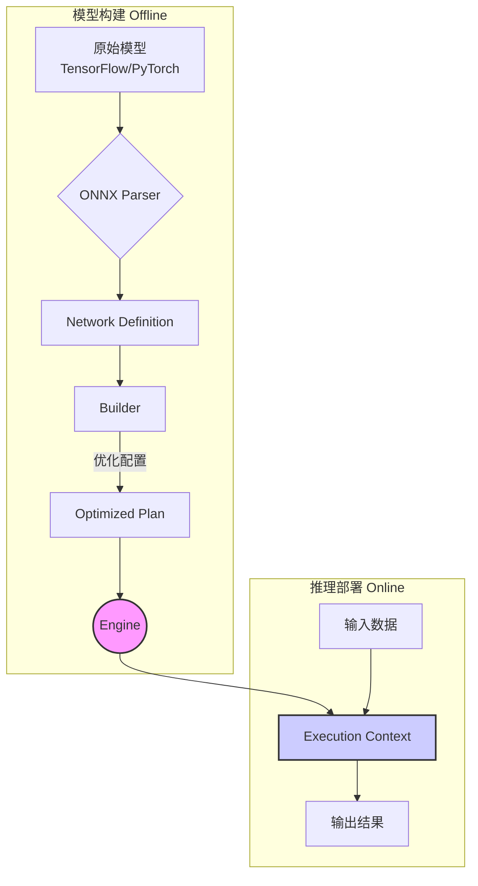
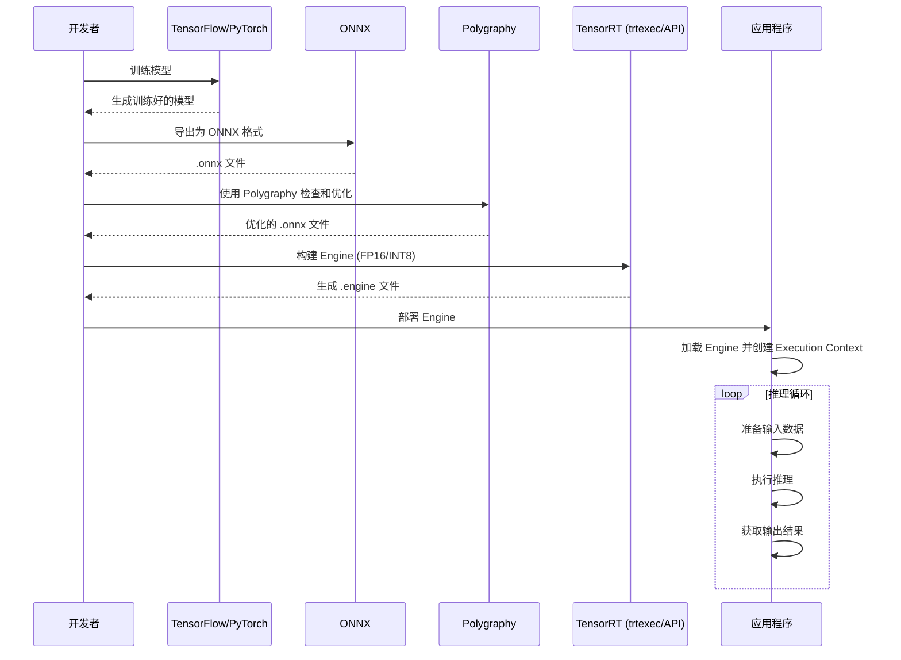
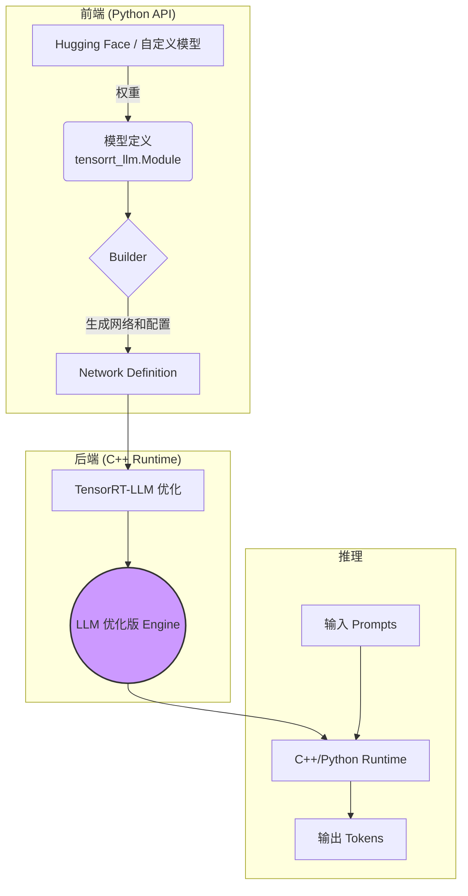
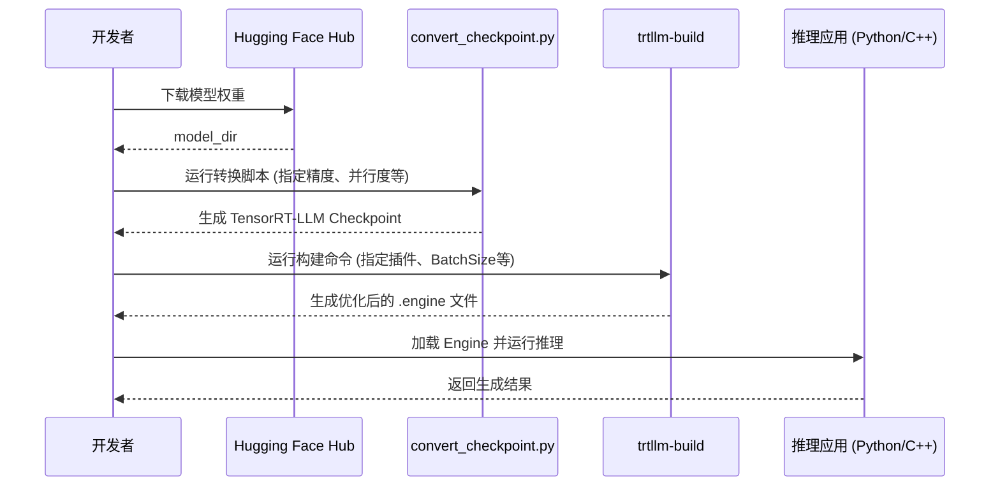

## 1. 引言

NVIDIA® TensorRT™ 是一个用于在 NVIDIA GPU 上进行高性能深度学习推理的软件开发套件（SDK）。它旨在优化和加速经过训练的神经网络，使其能够在生产环境中以低延迟和高吞吐量的方式运行。TensorRT 接收来自主流深度学习框架（如 TensorFlow、PyTorch、ONNX 等）的模型，通过一系列复杂的优化技术，生成一个高度优化的运行时引擎（Runtime Engine）。

本文档将深入浅出地介绍 TensorRT 的核心概念、关键特性、工作流程以及最新的功能（包括专门用于加速大语言模型的 TensorRT-LLM），帮助开发者充分利用其强大的性能优势。

## 2. 核心概念

理解 TensorRT 的核心组件是有效使用它的第一步。

*   **Engine**: TensorRT 的核心。它是一个经过优化的模型表示，包含了针对特定 GPU 架构和配置（如批量大小、精度）生成的计算图和权重。Engine 是不可修改的，并且是部署的最终产物。
*   **Builder (`IBuilder`)**: 这是创建 Engine 的主要接口。Builder 接收一个网络定义，并应用各种优化，最终生成一个针对目标 GPU 的优化计划（Plan），该计划可以被序列化为 Engine。
*   **Network Definition (`INetworkDefinition`)**: 这是您用来定义模型结构的地方。您可以从头开始手动构建网络，或者使用 Parser 从模型文件中导入。
*   **Parser**: 用于将来自不同框架的模型（主要是 ONNX 格式）解析并转换为 TensorRT 的网络定义。TensorRT 提供了强大的 ONNX 解析器。
*   **Profiler (`IProfiler`)**: 一个可选的接口，允许您在构建过程中收集和查询关于层性能的信息。这有助于调试和理解哪些层是性能瓶颈。
*   **Execution Context (`IExecutionContext`)**: 这是执行推理的主要接口。一个 Engine 可以有多个 Execution Context，允许并发执行推理任务。每个上下文都维护自己的输入、输出和状态。



## 3. 关键特性和优化技术

TensorRT 的高性能源于其先进的优化技术。

### 3.1. 精度校准与量化 (Precision Calibration & Quantization)

TensorRT 支持多种精度进行推理，包括 FP32、FP16、INT8，以及最新的 FP8。其中，INT8 量化是提升性能、降低内存占用的关键技术。

*   **训练后量化 (Post-Training Quantization, PTQ)**: 在不重新训练模型的情况下，通过一个校准数据集来确定将 FP32 权重和激活值转换为 INT8 所需的缩放因子。
*   **量化感知训练 (Quantization-Aware Training, QAT)**: 在训练过程中模拟量化操作，使模型对量化误差更具鲁棒性，从而在转换为 INT8 时获得更高的精度。

您可以使用 `QuantizationSpec` 来精确控制哪些层或哪些类型的层需要被量化。

```python
# 示例：仅量化 'Conv2D' 类型的层
q_spec = QuantizationSpec()
q_spec.add(name='Conv2D', is_keras_class=True)
q_model = quantize_model(model, quantization_mode='partial', quantization_spec=q_spec)
```

### 3.2. 层与张量融合 (Layer & Tensor Fusion)

TensorRT 会智能地将多个独立的层合并成一个单一的、更复杂的层。这减少了 CUDA 内核的启动次数和内存读写，从而显著降低了延迟。

*   **垂直融合**: 将连续的、具有相同数据依赖性的层（如 Conv、Bias、ReLU）融合成一个 CBR 层。

    ```mermaid
    graph TD;
        subgraph "融合前"
            A[Input] --> B(Conv);
            B --> C(Bias);
            C --> D(ReLU);
            D --> E[Output];
        end
        subgraph "融合后"
            A2[Input] --> F((Conv + Bias + ReLU));
            F --> E2[Output];
        end
    ```

*   **水平融合**: 将具有相同输入但执行不同操作的并行层融合在一起。

    ```mermaid
    graph TD;
        subgraph "融合前"
            A[Input] --> B(Conv A);
            A --> C(Conv B);
            B --> D[Output A];
            C --> E[Output B];
        end
        subgraph "融合后"
            A2[Input] --> F((Conv A + Conv B));
            F --> D2[Output A];
            F --> E2[Output B];
        end
    ```

### 3.3. 内核自动调整 (Kernel Auto-Tuning)

针对特定的目标 GPU 架构，TensorRT 会从一个包含多种实现的库中，为每个层选择最优的 CUDA 内核。它会根据当前的批量大小、输入尺寸和参数来测试不同的算法和实现，以找到最快的一个。

### 3.4. 动态形状 (Dynamic Shapes)

TensorRT 能够处理输入张量尺寸在运行时可变的模型。在构建 Engine 时，您可以指定一个优化配置文件（Optimization Profile），其中包含输入的最小、最优和最大尺寸。TensorRT 会根据这些信息生成一个可以在指定范围内高效处理任何输入尺寸的 Engine。

### 3.5. 插件 (Plugins)

对于 TensorRT 原生不支持的自定义或特殊层，您可以通过插件 API (`IPluginV2`) 来实现自己的逻辑。这为 TensorRT 提供了极大的扩展性。

最新的 TensorRT 版本通过装饰器极大地简化了插件的注册过程，特别是对于 Python API。

```python
# 示例：注册一个简单的元素级加法插件
import tensorrt.plugin as trtp

@trtp.register("sample::elemwise_add_plugin")
def add_plugin_desc(inp0: trtp.TensorDesc, block_size: int) -> trtp.TensorDesc:
    return inp0.like()
```

### 3.6. 稀疏性 (Sparsity)

TensorRT 支持利用 NVIDIA Ampere 及更高架构 GPU 上的结构化稀疏性特性。如果您的模型权重具有 2:4 的稀疏模式，TensorRT 可以利用稀疏张量核心（Sparse Tensor Cores）来进一步加速计算，性能几乎翻倍。

## 4. 工作流程

一个典型的 TensorRT 部署流程如下：



1.  **模型导出**: 从您的训练框架（如 PyTorch 或 TensorFlow）中，将训练好的模型导出为 ONNX 格式。ONNX 是一个开放的模型交换格式，是连接训练和推理的桥梁。

2.  **模型检查与优化 (Polygraphy)**: 在构建 Engine 之前，强烈建议使用 **Polygraphy** 工具集来检查、修改和优化您的 ONNX 模型。Polygraphy 是一个功能强大的工具，可以：
    *   **检查模型**: 显示模型的层、输入输出等信息。
    *   **常量折叠**: 预先计算模型中的常量表达式，简化计算图。
        ```bash
        polygraphy surgeon sanitize model.onnx -o folded.onnx --fold-constants
        ```
    *   **比较不同框架的输出**: 验证 TensorRT 与原始框架（如 ONNX Runtime）的输出是否一致，以排查精度问题。
        ```bash
        polygraphy run model.onnx --trt --onnxrt
        ```
    *   **处理数据依赖形状 (DDS)**: 识别并为具有数据依赖形状的张量设置上界。

3.  **构建 Engine**: 使用 `trtexec` 命令行工具或 TensorRT 的 C++/Python API 来构建 Engine。
    *   **`trtexec`**: 一个方便的命令行工具，用于快速从 ONNX 文件构建 Engine 并进行性能基准测试。
        ```bash
        trtexec --onnx=model.onnx --saveEngine=model.engine --fp16
        ```
    *   **API**: 提供更灵活的控制，例如定义动态形状的优化配置文件、配置插件等。

4.  **部署与推理**: 将序列化后的 Engine 文件加载到您的应用程序中，并使用 Execution Context 来执行推理。
    ```python
    # 使用 Polygraphy 的 TrtRunner 进行推理
    from polygraphy.backend.trt import TrtRunner, EngineFromBytes

    # 加载 Engine
    engine = EngineFromBytes(open("model.engine", "rb").read())

    with TrtRunner(engine) as runner:
        # 准备输入数据
        feed_dict = {"input_name": input_data}
        # 执行推理
        outputs = runner.infer(feed_dict=feed_dict)
    ```

## 5. 最新功能亮点

TensorRT 正在快速迭代，以下是一些最新的重要功能：

*   **Polygraphy 工具增强**:
    *   **简化的 CLI 语法**: 允许在单个参数中同时指定脚本和函数名 (`my_script.py:my_func`)。
    *   **改进的输入规范**: 使用新的列表式语法 (`--input-shapes input0:[x,y,z]`) 来避免歧义。

*   **快速部署插件 (Quickly Deployable Plugins)**:
    *   Python API 引入了 `@trtp.register` 和 `@trt.plugin.autotune` 装饰器，使得定义、注册和自动调整插件变得前所未有的简单，无需编写 C++ 代码。

*   **CUDA 图 (CUDA Graphs)**:
    *   通过 `--use-cuda-graph` 标志，TensorRT 可以利用 CUDA Graphs 来捕获整个推理过程，进一步减少 CPU 开销和内核启动延迟，特别适用于模型结构固定的场景。

*   **FP8 支持**:
    *   在 Hopper 及更高架构的 GPU 上，TensorRT 支持 FP8 推理，为大型语言模型等提供了更高的性能和更低的内存占用。

## 6. 附录：常用命令

*   **安装 Polygraphy**:
    ```bash
    python3 -m pip install polygraphy --extra-index-url https://pypi.ngc.nvidia.com
    ```
*   **构建并安装 TensorRT 开源组件**:
    ```bash
    # 从源码目录
    make install
    ```
*   **运行 pytest 测试**:
    ```bash
    pytest --verbose
    ```

## 7. TensorRT-LLM：为大语言模型（LLM）推理而生

随着大语言模型（LLM）的规模和复杂性呈指数级增长，传统的推理优化方法面临着前所未有的挑战。为了应对这些挑战，NVIDIA 推出了 TensorRT-LLM，一个专门为加速和优化 LLM 推理而设计的开源库。它构建于 TensorRT 之上，并封装了针对 LLM 的一系列尖端优化技术。

### 7.1. 什么是 TensorRT-LLM?

可以把 TensorRT-LLM 看作是 TensorRT 的一个 "LLM 专家版本"。它提供了一个 Python API，让开发者可以轻松地定义 LLM 模型，并自动应用各种SOTA（State-of-the-Art）优化。最终，它会生成一个高性能的 TensorRT 引擎，可以直接部署。

与通用 TensorRT 主要处理静态图不同，TensorRT-LLM 专门解决了 LLM 推理中的动态特性，例如：
*   **自回归生成 (Autoregressive Generation)**: 每个新生成的 token 都依赖于前面的 token，导致输入序列长度动态变化。
*   **巨大的模型规模**: 模型参数动辄数十亿甚至上千亿，无法单卡部署。
*   **庞大的 KV 缓存**: 推理过程中需要存储大量的键值对（Key-Value Cache），对内存带宽和容量提出极高要求。

### 7.2. 核心架构与组件

TensorRT-LLM 的架构分为前端和后端：

*   **Python API (`tensorrt_llm`)**: 这是用户交互的主要接口。它以声明式的方式定义模型（类似于 PyTorch），开发者无需关心底层复杂的 TensorRT C++ API。
*   **C++ Backend**: 这是真正执行优化的核心，包含了预先写好的、高度优化的 CUDA 内核、LLM 专属优化 pass 以及一个能够高效处理 LLM 任务的运行时。



### 7.3. 关键优化技术（LLM 专属）

TensorRT-LLM 的魔力在于其专为 LLM 设计的优化技术。

#### 7.3.1. In-Flight Batching (也称 Continuous Batching)

**问题**: 传统的批处理（Static Batching）要求所有请求都等待，直到湊够一个批次再一起处理。由于每个请求的生成长度不同，这会导致大量 GPU 空闲（"气泡"），因为必须等待批次中最慢的请求完成。

**解决方案**: In-Flight Batching 允许服务器在 GPU 运行时动态地加入新的请求，一旦某个请求完成，其占用的计算资源立即被释放并分配给等待队列中的新请求。这极大地提高了 GPU 的利用率和系统的总吞吐量。

```mermaid
gantt
    title GPU 利用率对比
    dateFormat X
    axisFormat %S
    section 静态批处理 (Static Batching)
    请求 A: 0, 6
    请求 B: 0, 3
    请求 C: 0, 5
    GPU 等待 : 3, 3
    GPU 等待 : 5, 1
    section In-Flight Batching
    请求 A : 0, 6
    请求 B : 0, 3
    请求 C : 0, 5
    新请求 D : 3, 4
```



#### 7.3.2. Paged KV Cache & Attention

**问题**: 在自回归生成过程中，KV 缓存会随着序列长度的增加而线性增长，消耗大量显存。传统的做法是为每个请求预分配一个连续的、能容纳最大序列长度的内存块，这导致了严重的内存碎片和浪费。

**解决方案**: 受到操作系统虚拟内存分页的启发，TensorRT-LLM 引入了 Paged KV Cache。它将 KV 缓存分割成固定大小的"块"（Blocks），并按需分配。
*   **非连续存储**: 逻辑上连续的 Token 的 KV 缓存可以存储在物理上不连续的块中。
*   **内存共享**: 对于复杂的场景（如并行采样、Beam Search），不同序列之间可以共享相同的 KV 缓存块（例如共享 Prompt部分的缓存），从而大幅节省内存。
*   **优化的 Attention 核**: TensorRT-LLM 使用了如 FlashAttention、MQA/GQA 等专门优化的 Attention 内核，可以直接操作这些非连续的缓存块，避免了数据拷贝开销。

#### 7.3.3. 张量并行与流水线并行 (Tensor & Pipeline Parallelism)

对于无法在单个 GPU 上容纳的大型模型，TensorRT-LLM 内置了对张量并行（Tensor Parallelism）和流水线并行（Pipeline Parallelism）的无缝支持。开发者只需在构建时指定并行度（`tp_size`, `pp_size`），TensorRT-LLM 就会自动处理模型的切分和跨 GPU 的通信。

```bash
# 示例：构建一个 2 路张量并行的 Llama 模型
python3 examples/llama/convert_checkpoint.py \
    --model_dir ./llama-7b-hf \
    --output_dir ./tllm_checkpoint_tp2 \
    --dtype float16 \
    --tp_size 2
```

#### 7.3.4. 先进的量化支持 (FP8/INT4/INT8)

LLM 的巨大参数量使其成为量化的理想对象。TensorRT-LLM 支持多种先进的量化方案：
*   **FP8**: 在 NVIDIA Hopper 及更高架构的 GPU 上，FP8 提供了接近 FP16 的精度，同时显著提升了性能和降低了内存占用。
*   **INT8 SmoothQuant**: 一种同时量化激活值和权重的技术，能在保持较高精度的同时获得 INT8 的加速。
*   **INT4/INT8 仅权重化 (Weight-Only Quantization, W4A16/W8A16)**: 这是一种非常流行的技术，仅将模型权重（参数量最大部分）量化为 INT4 或 INT8，而激活值保持 FP16。这极大地降低了内存占用，同时对精度的影响很小。

```bash
# 示例：构建一个 INT4 仅权重化量化的模型
python convert_checkpoint.py --model_dir ./gpt-j-6b \
                             --dtype float16 \
                             --use_weight_only \
                             --weight_only_precision int4 \
                             --output_dir ./trt_ckpt/gptj_int4wo_tp1/
```

### 7.4. TensorRT-LLM 工作流程

一个典型的 TensorRT-LLM 工作流程如下：



**端到端示例 (以 Llama-7B 为例)**:
1.  **转换权重**:
    ```bash
    git clone https://huggingface.co/meta-llama/Llama-2-7b-hf
    python3 examples/llama/convert_checkpoint.py \
        --model_dir ./Llama-2-7b-hf \
        --output_dir ./tllm_checkpoint_1gpu \
        --dtype float16
    ```
2.  **构建 Engine**:
    ```bash
    trtllm-build --checkpoint_dir ./tllm_checkpoint_1gpu \
                 --output_dir ./trt_engines/llama_7b \
                 --gpt_attention_plugin float16 \
                 --gemm_plugin float16
    ```
3.  **运行推理**:
    ```bash
    python3 examples/run.py --max_output_len=100 \
                          --tokenizer_dir ./Llama-2-7b-hf \
                          --engine_dir=./trt_engines/llama_7b
    ```

### 7.5. 便捷的高层级 API (`LLM`)

为了进一步简化开发流程，TensorRT-LLM 提供了一个名为 `LLM` 的高层级 API。这个接口将模型加载、构建、保存和推理封装成一个简单的类，让开发者在几行代码内就能完成所有操作。

```python
from tensorrt_llm import LLM

# 1. 初始化 LLM 对象，如果引擎不存在，它会自动从 HuggingFace 模型构建
#    这里会应用所有优化，如 In-Flight Batching, Paged KV-Cache
llm = LLM(
    model="meta-llama/Llama-2-7b-hf",
    tensor_parallel_size=1,
)

# 2. (可选) 保存构建好的引擎以备后用
llm.save("llama_engine_dir")

# 3. 运行推理
prompt = "NVIDIA TensorRT-LLM is"
for output in llm.generate([prompt], max_new_tokens=50):
    print(output)

```

这个高层级 API 是快速原型设计和部署的理想选择。

### 7.6. 总结

TensorRT-LLM 并非简单地将 TensorRT 应用于 LLM，而是一个从根本上为 LLM 推理重新设计的、包含多种SOTA优化的综合性解决方案。通过 In-Flight Batching、Paged KV-Cache、原生并行支持和先进的量化方案，它能够将 NVIDIA GPU 的硬件性能发挥到极致，为部署高性能、高吞吐量的 LLM 服务提供了坚实的基础。