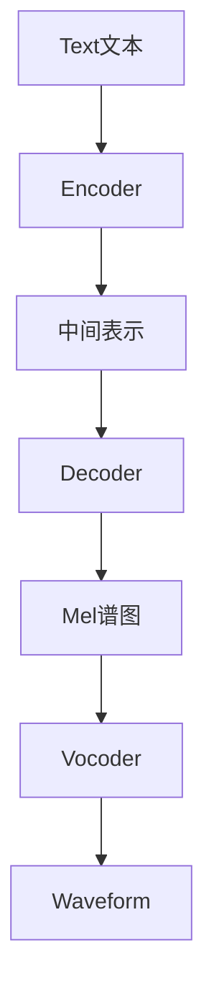

## 1. 背景

### 1.1 传统TTS模型的痛点

传统的文本到语音（TTS）模型在声音克隆和语音合成方面一直表现出色，通常采用两阶段流程：
1. 声学模型（如 Tacotron）：将文本转换为中间声学表示（例如声谱图）。
2. 声码器（如 WaveGlow、HiFi-GAN）：将声学表示转换为波形音频。

尽管这些模型能产生逼真的声音，主要关注点仍是复刻某个说话者的声音，缺乏在动态、上下文敏感的对话中灵活适应的能力。

### 1.2 LLM 的初步融入：上下文感知对话式语音模型

大语言模型（LLMs）的出现，提供了丰富的推理能力和上下文理解。将 LLM 集成到 TTS 流程中，合成不仅仅是产生声音，更能在上下文中进行智能对话回应。

典型级联式流程（speech-to-speech 模型）：
- STT（语音转文本）：如 Whisper
- LLM（上下文理解与生成）：如微调版 Llama
- TTS（文本转语音）：如 ElevenLabs

示例流程：
```
Speech-to-Text  (e.g., Whisper)       : "Hello friend, how are you?"
Conversational LLM (e.g., Llama)      : "Hi there! I am fine and you?"
Text-to-Speech (e.g., ElevenLabs)     : 生成自然语音回复
```

这种流水线方法集成了各专门模块的优势，但也有局限：
LLM 接收的转录文本丢失了语音中丰富的韵律、情感等线索，使得生成的回复缺乏原始语音的细腻表达。

### 1.3 直接将语音接入 LLM：音频编码器与神经编解码器

为解决上述的瓶颈，研究者尝试直接将语音表示输入到 LLM，目前将语言这种连续高维信号转换成LLM能够处理的信号的方式主要有以下两种：

- **音频编码器**：将连续语音转为离散 token，保留节奏、情感等关键信息。
  > 新挑战：音频编码器必须在关键信息的保存与紧凑、离散的表示需求之间取得平衡。

- **神经编解码器 (Neural Codecs)**：如 DAC、Encodec、XCodec，将音频波形转为离散 token 序列，桥接连续音频与离散 token 需求。
  > 新挑战：音频 token 数量远多于文本，量化过程可能导致细节损失。

## 2. TTS模型的流程结构

传统TTS模型的基本流程结构通常如下：



这个流程包含几个关键组件：

1. **文本编码器(Encoder)**：负责将输入文本转换为中间表示，通常是一个深度学习模型，如Transformer或CNN。编码器需要理解文本的语义、语法结构，并提取出与发音相关的特征。

2. **中间表示**：连接编码器和解码器的桥梁，通常是一组向量或特征图，包含了文本的语义信息和一些初步的声学特征。

3. **解码器(Decoder)**：将中间表示转换为声学特征，如Mel频谱图。解码器需要考虑语音的韵律、节奏、停顿等因素。

4. **声码器(Vocoder)**：将声学特征(如Mel频谱图)转换为最终的波形音频。现代声码器如HiFi-GAN、WaveGlow等能够生成高质量的语音波形。

## 3. 音频编码器技术深度解析

音频编码器是连接连续语音信号和离散token表示的关键桥梁。下面我们深入探讨几种主流的音频编码技术及其工作原理。

### 3.1 VQ-VAE (Vector Quantized Variational Autoencoder)

VQ-VAE是一种将连续音频信号转换为离散编码的有效方法。其工作原理如下：

1. **编码阶段**：使用编码器网络将输入音频转换为连续的潜在表示。
2. **量化阶段**：将连续潜在表示映射到最近的离散码本向量。
3. **解码阶段**：使用解码器网络将量化后的潜在表示重建为音频信号。

VQ-VAE的优势在于它能够学习紧凑的离散表示，同时保留重建音频所需的关键信息。然而，它也面临着码本使用率低(codebook collapse)和重建质量与压缩率之间的权衡等挑战。

### 3.2 Encodec

Encodec是Meta AI提出的一种高效神经音频编解码器，它结合了VQ-VAE的思想和多级量化技术：

1. **多分辨率编码**：使用不同时间分辨率的编码器捕获音频的不同时间尺度特征。
2. **残差量化**：采用多级量化策略，每一级量化器处理前一级的残差误差。
3. **可变比特率**：支持不同的压缩级别，可以根据需求调整比特率和音质之间的平衡。

Encodec的一个显著优势是它能够在极低的比特率下保持良好的音频质量，使其特别适合于语音合成和音频传输应用。

### 3.3 DAC (Discrete Autoencoder for Audio Compression)

DAC是一种专为音频压缩设计的离散自编码器，其特点包括：

1. **层次化量化**：使用多层次的量化结构，不同层次捕获不同级别的音频细节。
2. **上下文建模**：利用自回归模型对量化后的token序列进行建模，捕获时序依赖关系。
3. **感知损失函数**：结合频谱损失和对抗损失，优化人耳感知的音频质量。

DAC在高压缩率下仍能保持出色的音频质量，特别适合于需要高效存储和传输的语音合成应用。

## 4. TTS系统中的音频数据格式与传输

在TTS系统中，音频数据的格式选择和传输方式对于实际应用至关重要。本章将详细介绍TTS系统中使用的各种音频格式、传输协议以及前端处理技术。

### 4.1 常用音频格式及其特性

TTS系统支持多种音频格式，每种格式都有其特定的应用场景和优缺点。以下是几种最常用的格式：

#### 4.1.1 PCM (脉冲编码调制)

**特点：**
- **无压缩**：原始音频数据，没有任何压缩
- **位深度**：通常为16位（也有8位、24位、32位等）
- **格式简单**：直接表示音频波形的数字样本
- **文件大小**：较大，一分钟24kHz/16位单声道音频约为2.8MB
- **处理开销**：低，无需解码
- **质量**：无损，保留所有原始音频信息

**使用场景：**
- 系统内部音频处理管道
- 低延迟要求的实时应用
- 需要进一步处理的中间格式

#### 4.1.2 Opus

**特点：**
- **高压缩率**：比PCM小得多，但保持高质量
- **低延迟**：编解码延迟低至20ms
- **可变比特率**：6kbps到510kbps
- **自适应**：可根据网络条件调整
- **专为网络传输设计**：抗丢包能力强
- **开放标准**：免版税，广泛支持

**使用场景：**
- 网络流式传输
- WebRTC应用
- 实时通信系统
- WebSocket音频传输

**Opus编码配置：**
- **采样率**：24000 Hz
- **声道数**：1 (单声道)
- **比特率**：32000 bps (32 kbps)
- **帧大小**：480个样本 (对应20ms@24kHz)
- **复杂度**：5 (平衡设置)

#### 4.1.3 MP3

**特点：**
- **高压缩率**：比PCM小得多
- **广泛兼容**：几乎所有设备和平台都支持
- **可变比特率**：通常32kbps到320kbps
- **有损压缩**：会丢失部分音频信息
- **编解码延迟**：较高，不适合实时应用
- **文件大小**：中等，一分钟音频约为1MB（128kbps）

**使用场景：**
- 非实时应用
- 需要广泛兼容性的场景
- 音频存储和分发

#### 4.1.4 WAV

**特点：**
- **容器格式**：通常包含PCM数据
- **无压缩**：文件较大
- **元数据支持**：包含采样率、声道数等信息
- **广泛兼容**：几乎所有音频软件都支持
- **简单结构**：易于处理
- **质量**：通常无损

**使用场景：**
- 音频存档
- 专业音频处理
- 测试和开发环境

### 4.2 TTS音频传输与处理

#### 4.2.1 基本音频参数
在TTS系统中，音频数据通常具有以下基本参数：
- **采样率**：通常为24000 Hz (24 kHz)
- **声道数**：1 (单声道)
- **位深度**：16位 (Int16)

#### 4.2.2 传输协议

**HTTP REST API**
- **Content-Type**: `audio/opus`
- **自定义头部**: `X-Sample-Rate: 24000`
- **数据格式**: 原始Opus编码数据（非OggS容器）

**WebSocket协议**
- **子协议**: `tts-1.0`
- **消息结构**: 1字节类型 + 4字节长度(小端) + 负载
- **音频消息类型**: `AUDIO = 0x12`
- **音频数据**: 原始Opus编码数据

#### 4.2.3 前端处理技术

TTS系统的前端需要处理接收到的音频数据，主要有两种方式：

**WebCodecs API解码**
- 使用浏览器的硬件加速解码Opus数据
- 解码后转换为Float32Array供Web Audio API使用

**PCM直接处理**
- 将Int16 PCM数据转换为Float32音频数据(范围从-32768~32767转换为-1.0~1.0)
- 创建AudioBuffer并通过Web Audio API播放

#### 4.2.4 音频处理增强功能
- **淡入淡出效果**：可配置的音频淡入淡出处理，默认为10ms
- **音频增益调整**：可调整音量大小
- **水印**：可选的音频水印功能
- **自适应批处理**：根据性能动态调整音频处理批次大小

### 4.3 TTS系统音频数据流程

TTS模型中的音频数据从生成到播放，经历以下流程：


### 4.4 实际应用中的格式选择

在TTS实际生产应用中，格式选择主要基于应用场景：

**实时流式TTS应用**
- **Opus**是首选，因为其低延迟特性和高压缩率非常适合实时应用
- 适用于语音助手、实时对话系统、在线客服等场景

**非实时TTS应用**
- **MP3**更常用，因为几乎所有设备和平台都支持，文件大小适中
- 适用于有声读物、预录制通知、内容分发等场景

**系统内部处理**
- **PCM**格式常用于系统内部处理，提供最高质量和最低处理延迟
- 适用于音频处理管道中的中间环节

**存档和专业应用**
- **WAV**格式适用于需要保存元数据和保持最高质量的场景
- 适用于专业音频编辑、存档和质量评估

## 5. 神经编解码器与LLM的融合

将神经编解码器与LLM融合是实现端到端语音理解和生成的关键步骤。这种融合面临几个技术挑战：

### 5.1 Token速率不匹配问题

语音信号的信息密度远高于文本，导致音频token数量远多于文本token。例如，一秒钟的语音可能需要数百个token表示，而对应的文本可能只有几个token。这种不匹配给LLM的处理带来了挑战。

解决方案包括：
- **分层编码**：使用多级编码结构，不同级别捕获不同时间尺度的信息
- **下采样策略**：在时间维度上进行下采样，减少token数量
- **注意力机制优化**：设计特殊的注意力机制，有效处理长序列token

### 5.2 多模态表示对齐

文本和语音是两种不同模态的信息，它们的表示空间存在天然的差异。为了实现有效的融合，需要解决表示对齐问题。

主要方法包括：
- **联合训练**：同时训练文本编码器和音频编码器，使它们的表示空间对齐
- **对比学习**：使用对比损失函数，拉近相关文本和语音表示的距离，推远不相关的表示
- **跨模态Transformer**：设计专门的Transformer架构，处理多模态输入并学习它们之间的关系

### 5.3 上下文感知语音合成

传统TTS模型往往缺乏对上下文的理解，导致生成的语音缺乏适当的情感和韵律变化。融合LLM后，模型能够基于对话上下文生成更自然的语音。

关键技术包括：
- **上下文编码**：将对话历史编码为上下文向量，影响语音生成
- **情感控制**：基于上下文理解，自动调整语音的情感色彩
- **韵律建模**：根据语义重要性和对话状态，调整语音的节奏、停顿和重音

## 6. 未来发展方向

随着技术的不断进步，TTS模型正朝着以下几个方向发展：

### 6.1 全端到端多模态模型

未来的语音模型将打破模块间的界限，实现真正的端到端训练和推理。这种模型能够直接从原始输入（文本、语音、图像等）生成自然的语音输出，无需中间表示的显式转换。

### 6.2 个性化与适应性

下一代TTS模型将更加注重个性化和适应性，能够根据用户偏好、对话历史和环境因素自动调整语音特性，提供更加自然和人性化的交互体验。

### 6.3 低资源场景优化

针对低资源语言和特殊应用场景，研究者正在探索如何利用迁移学习、元学习和数据增强等技术，在有限数据条件下构建高质量的TTS模型。

### 6.4 实时交互式语音合成

随着算法和硬件的进步，实时交互式语音合成将成为可能，支持更加自然流畅的人机对话，为虚拟助手、客服机器人和元宇宙应用提供更好的用户体验。

## 7. 总结

语音合成技术正经历从传统TTS到多模态语音模型的重大转变。通过融合大语言模型、神经编解码器和先进的音频处理技术，现代TTS模型不仅能够生成高质量的语音，还能理解上下文、表达情感，并在动态对话中自然地适应。尽管仍面临诸多挑战，但随着技术的不断进步，我们有理由期待更加智能、自然和个性化的语音交互体验。