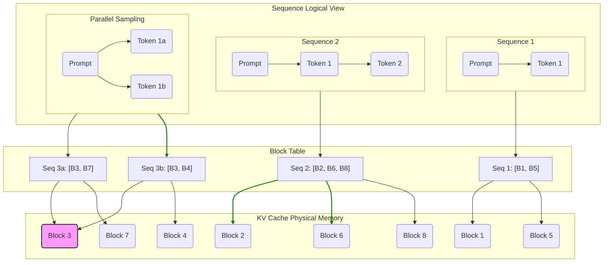
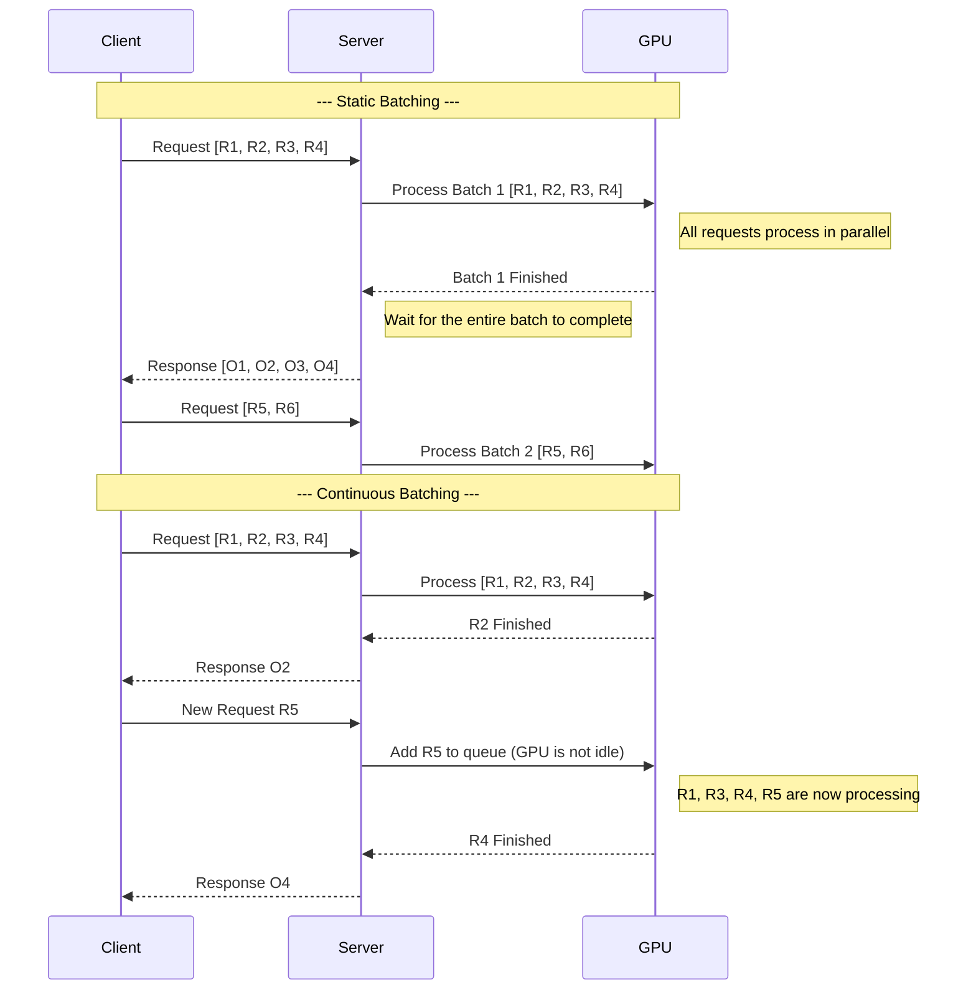

# vLLM 深度解析：技术原理与实践指南

## 1. vLLM 简介

vLLM 是一个为大型语言模型（LLM）设计的开源推理和服务引擎，以其高吞吐量和内存效率而闻名。在 LLM 服务领域，vLLM 解决了一个核心痛点：传统推理系统在处理 Transformer 模型中注意力机制的键值缓存（KV Cache）时效率低下，导致大量内存被浪费，推理速度受限。

LLM 推理过程中的内存瓶颈主要源于 KV Cache。这个缓存存储了序列中每个先前 token 的注意力键（Key）和值（Value），以加速后续 token 的生成。然而，KV Cache 的大小是动态变化的，且难以预测，这给内存管理带来了巨大挑战。传统系统（如 HuggingFace Transformers）通常会预先分配一块连续的大内存空间来存储 KV Cache，但这会导致严重的内存碎片化和浪费。

vLLM 通过引入其核心创新 **PagedAttention** 机制，从根本上解决了这个问题。

## 2. 核心特性与优势

vLLM 之所以能在众多 LLM 推理框架中脱颖而出，得益于其以下几个关键特性：

- **极高的吞吐量**：通过 PagedAttention 和持续的批处理（Continuous Batching），vLLM 能够显著提升 GPU 的利用率，其吞吐量比 HuggingFace Transformers 高出数倍，也优于其他主流推理库。
- **高效的内存管理**：PagedAttention 机制将 KV Cache 划分为非连续的内存块，极大地减少了内存的内部和外部碎片。根据官方数据，它可以节省高达 55% 的内存，这意味着您可以用相同的硬件加载更大的模型或服务更多的并发请求。
- **灵活的解码策略**：vLLM 支持多种复杂的解码算法，包括并行采样（Parallel Sampling）、波束搜索（Beam Search）和 Top-K/Top-P 采样，可以满足不同应用场景的需求。
- **与 OpenAI API 兼容**：vLLM 提供了一个与 OpenAI API 完全兼容的服务端点。这意味着您可以将 vLLM 无缝集成到现有的、基于 OpenAI API 构建的应用生态中，只需更改几个配置即可。
- **分布式推理**：对于无法在单个 GPU 上容纳的超大模型，vLLM 支持张量并行（Tensor Parallelism），可以将模型的权重和计算负载分散到多个 GPU 上，实现高效的分布式推理。
- **流式输出与结构化输出**：支持流式传输（Streaming）生成的 token，并能通过引导式生成（Guided Generation）产生符合特定格式（如 JSON Schema 或正则表达式）的结构化输出。

## 3. 核心架构：深入 PagedAttention

PagedAttention 是 vLLM 的灵魂，其设计灵感来源于现代操作系统中用于管理虚拟内存的分页（Paging）技术。

### 3.1 工作原理

在传统方法中，KV Cache 为每个序列存储在连续的内存空间中。这种方式看似简单，但由于不同序列长度差异巨大，会导致严重的内存碎片。

PagedAttention 则将每个序列的 KV Cache 划分为固定大小的 **块（Blocks）**。每个块可以存储固定数量 token 的键和值。在推理过程中，vLLM 的核心调度器会根据需要动态地为序列分配这些块。

这种设计的优势在于：

1.  **消除内部碎片**：由于块的大小固定，一个序列的最后一个块可能会有少量空间未被使用，但这种浪费远小于为整个序列预留连续内存所造成的浪费。
2.  **灵活的内存分配**：块存储在非连续的内存空间中，使得内存管理更加灵活，类似于操作系统管理物理内存页。
3.  **高效的内存共享**：PagedAttention 使得在不同序列之间共享 KV Cache 变得异常简单和高效。例如，在并行采样或波束搜索中，多个候选序列都源自同一个提示（Prompt）。vLLM 可以让这些序列共享存储提示部分的 KV 块，只有在生成新 token 时才需要为每个序列分配新的、独立的块。这种"写时复制"（Copy-on-Write）的机制极大地降低了复杂解码算法的内存开销。


下面是一个 Mermaid 图，更直观地展示了 PagedAttention 的内存管理方式：


*上图说明：*
- **KV Cache 物理内存**：代表 GPU 上非连续的物理内存块。
- **序列逻辑视图**：代表正在处理的多个请求（序列）。
- **块映射表**：vLLM 的核心组件，将逻辑上的 token 位置映射到物理内存块。
- **内存共享**：注意到"并行采样"中的两个分支（3a 和 3b）共享了同一个 Prompt 块（B3），这就是 PagedAttention 高效内存共享的体现。

### 3.2 持续批处理 (Continuous Batching)

基于 PagedAttention，vLLM 实现了一种更先进的批处理策略——持续批处理。传统的批处理（Static Batching）需要等待批次中所有序列都生成完毕后，才能开始处理下一个批次。而持续批处理则允许在批次中的某个序列完成生成后，立即将新的请求插入到批处理中，从而避免了 GPU 的空闲等待，进一步提升了吞吐量。

下面通过 Mermaid 序列图对比两种批处理方式：



## 4. 快速上手指南

下面，我们将通过几个简单的步骤来展示如何安装和使用 vLLM。

### 4.1 安装

您可以使用 `pip` 或 `uv`（一个更快的包安装工具）来安装 vLLM。推荐使用 `uv`，因为它可以自动检测您的 CUDA 版本并安装匹配的 PyTorch 后端。

**使用 uv (推荐):**
```bash
# 创建并激活虚拟环境
uv venv
source .venv/bin/activate

# 安装 vLLM
uv pip install vllm --torch-backend=auto
```

**使用 pip:**
```bash
pip install vllm
```

### 4.2 离线推理

使用 `vllm.LLM` 类可以非常方便地进行离线推理。

```python
from vllm import LLM, SamplingParams

# 定义输入提示
prompts = [
    "Hello, my name is",
    "The capital of France is",
    "The future of AI is",
]

# 定义采样参数
sampling_params = SamplingParams(temperature=0.8, top_p=0.95)

# 初始化 LLM 引擎 (模型会自动从 Hugging Face 下载)
llm = LLM(model="facebook/opt-125m")

# 生成文本
outputs = llm.generate(prompts, sampling_params)

# 打印结果
for output in outputs:
    prompt = output.prompt
    generated_text = output.outputs[0].text
    print(f"Prompt: {prompt!r}, Generated text: {generated_text!r}")
```

### 4.3 启动 OpenAI 兼容服务器

vLLM 最强大的功能之一是其内置的 API 服务器。只需一行命令，即可启动一个与 OpenAI API 兼容的服务。

```bash
vllm serve Qwen/Qwen2.5-1.5B-Instruct
```

默认情况下，服务器会在 `http://localhost:8000` 上运行。

### 4.4 与服务器交互

您可以使用 `curl` 或 `openai` Python 客户端与服务器进行交互。

**使用 curl:**
```bash
curl http://localhost:8000/v1/completions \
    -H "Content-Type: application/json" \
    -d '{
        "model": "Qwen/Qwen2.5-1.5B-Instruct",
        "prompt": "San Francisco is a",
        "max_tokens": 7,
        "temperature": 0
    }'
```

**使用 OpenAI Python 客户端:**
```python
from openai import OpenAI

client = OpenAI(
    base_url="http://localhost:8000/v1",
    api_key="not-used"  # API 密钥不是必需的
)

completion = client.chat.completions.create(
    model="Qwen/Qwen2.5-1.5B-Instruct",
    messages=[
        {"role": "system", "content": "You are a helpful assistant."},
        {"role": "user", "content": "Who won the world series in 2020?"}
    ]
)

print(completion.choices[0].message)
```

## 5. 模型服务 (Serving)

### 5.1 分布式服务

如果模型太大无法放入单个 GPU，您可以使用张量并行将其分布在多个 GPU 上。

```bash
# 在 4 个 GPU 上启动服务
vllm serve facebook/opt-13b --tensor-parallel-size 4
```

### 5.2 Docker 部署

vLLM 提供了官方的 Docker 镜像，可以方便地进行容器化部署。

```bash
docker run --runtime nvidia --gpus all \
    -v ~/.cache/huggingface:/root/.cache/huggingface \
    --env "HUGGING_FACE_HUB_TOKEN=<your-hf-token>" \
    -p 8000:8000 \
    --ipc=host \
    vllm/vllm-openai:latest \
    --model mistralai/Mistral-7B-v0.1
```

## 6. 高级功能详解

### 6.1 结构化输出 (Structured Outputs)

vLLM 支持多种方式来约束模型的输出格式，这对于需要可靠、可解析输出的应用至关重要。

**使用 Pydantic 模型生成 JSON:**
```python
from pydantic import BaseModel
from openai import OpenAI

client = OpenAI(base_url="http://localhost:8000/v1", api_key="dummy")
model = client.models.list().data[0].id

class People(BaseModel):
    name: str
    age: int

completion = client.chat.completions.create(
    model=model,
    messages=[
        {"role": "user", "content": "Generate a JSON with the name and age of one random person."}
    ],
    response_format={
        "type": "json_schema",
        "json_schema": {
            "name": "people",
            "schema": People.model_json_schema()
        }
    },
)
print(completion.choices[0].message.content)
```

### 6.2 LoRA 支持

vLLM 可以在同一个基础模型上高效地服务多个 LoRA 适配器。这对于需要为不同客户或任务提供定制化模型的场景非常有用。

**启动支持 LoRA 的服务器:**
```python
from vllm import LLM

llm = LLM(model="meta-llama/Llama-2-7b-hf", enable_lora=True)
```

**在请求中指定 LoRA 适配器:**
```bash
curl http://localhost:8000/v1/completions \
    -H "Content-Type: application/json" \
    -d '{
        "model": "sql-lora", # 指定 LoRA 模型的 ID
        "prompt": "San Francisco is a",
        "max_tokens": 7
    }'
```

### 6.3 量化 (Quantization)

量化是一种通过降低模型权重的精度来减小模型大小和内存占用的技术。vLLM 支持多种量化方案，如 AWQ 和 FP8 KV 缓存。

**启用 FP8 KV 缓存:**
```python
from vllm import LLM

llm = LLM(
    model="meta-llama/Llama-2-7b-chat-hf",
    kv_cache_dtype="fp8",
    calculate_kv_scales=True # 动态计算量化尺度
)
```

## 7. 框架集成

vLLM 可以轻松地与 Langchain 和 LlamaIndex 等流行的 LLM 应用框架集成，用于构建复杂的系统，如检索增强生成（RAG）。通常，vLLM 会作为后端提供快速的 LLM 推理和嵌入生成服务。

**安装相关依赖:**
```bash
pip install -U vllm langchain_openai langchain_community
```

之后，在 Langchain 中，您可以将 `ChatOpenAI` 或 `OpenAIEmbeddings` 的 `base_url` 指向 vLLM 服务器的地址，即可完成集成。

## 8. 总结

vLLM 通过其创新的 PagedAttention 架构，成功地解决了 LLM 推理中的内存管理和性能瓶颈，为开发者提供了一个极其高效、灵活且易于使用的推理服务引擎。无论是进行快速的离线实验，还是部署生产级的、高并发的 LLM 服务，vLLM 都展现出了卓越的性能和强大的功能。随着社区的不断发展，vLLM 正在成为 LLM 服务领域的标准工具之一。