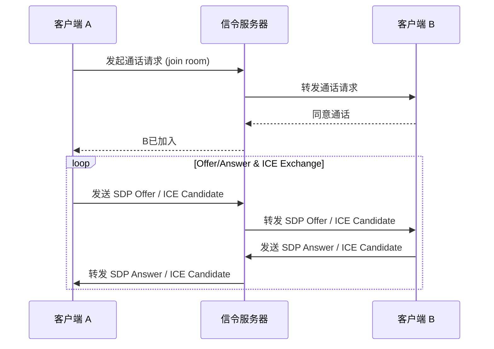
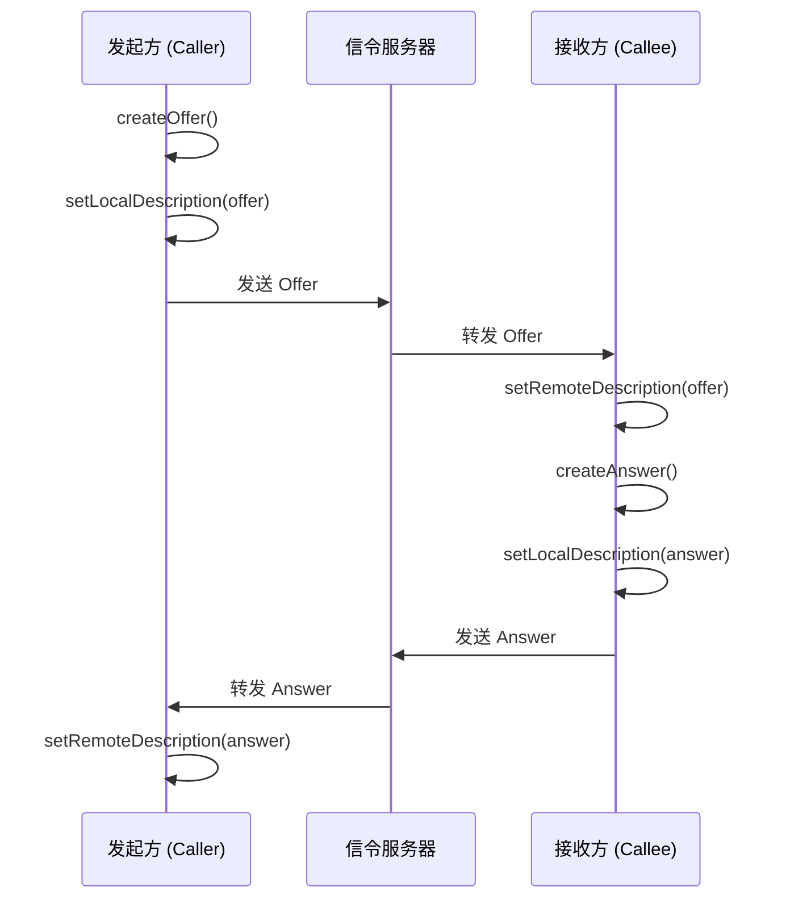
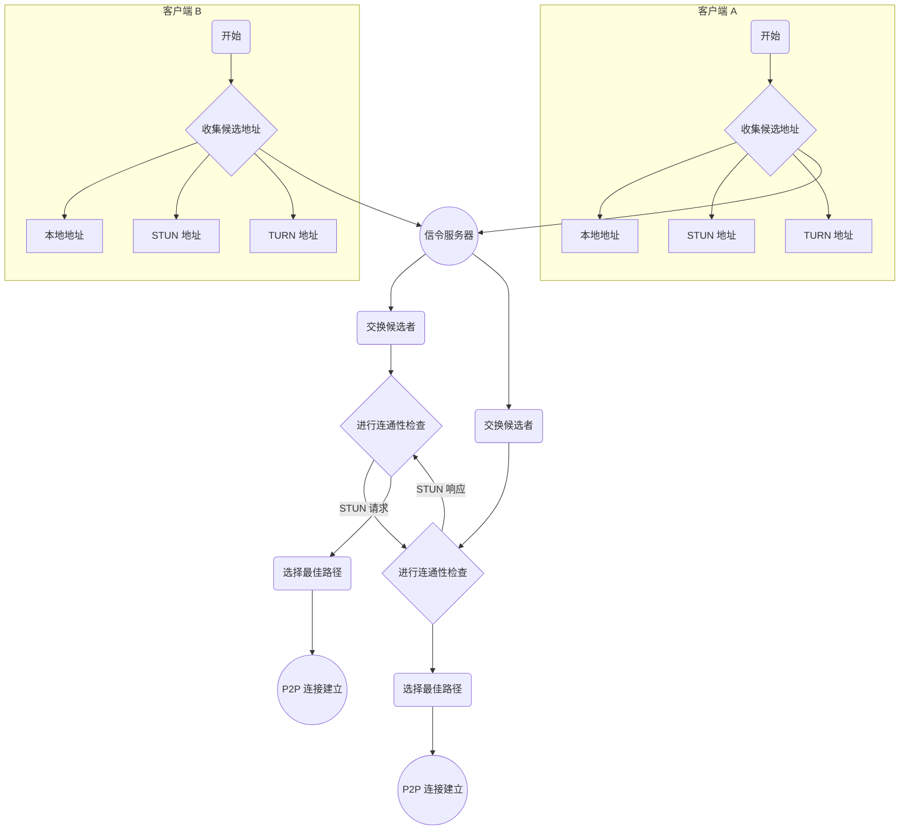

## 1. 引言

WebRTC（Web Real-Time Communication，网页即时通信）是一项支持网页浏览器进行实时语音对话或视频对话的开源技术。它允许浏览器之间直接进行点对点（Peer-to-Peer, P2P）的音视频和数据共享，而无需安装任何插件或第三方软件。

WebRTC 的主要目标是实现高质量、低延迟的实时通信，让开发者能够轻松地在 Web 应用中构建丰富的通信功能。

### 核心优势

- **跨平台和浏览器兼容**：WebRTC 是 W3C 和 IETF 的开放标准，得到了主流浏览器（如 Chrome, Firefox, Safari, Edge）的广泛支持。
- **无需插件**：用户可以直接在浏览器中使用实时通信功能，无需下载或安装任何扩展。
- **点对点通信**：在可能的情况下，数据直接在用户之间传输，减少了服务器的带宽压力和延迟。
- **高安全性**：所有 WebRTC 通信都经过强制加密（通过 SRTP 和 DTLS），确保了数据的机密性和完整性。
- **高质量音视频**：WebRTC 包含先进的信号处理组件，如回声消除、噪声抑制和自动增益控制，以提供卓越的音视频质量。
## 2. 核心概念

WebRTC 由几个关键的 JavaScript API 组成，它们共同协作以实现实时通信。

### 2.1. `RTCPeerConnection`

`RTCPeerConnection` 是 WebRTC 的核心接口，负责建立和管理两个对等端之间的连接。它的主要职责包括：

- **媒体协商**：处理音视频的编解码器、分辨率等参数。
- **网络路径发现**：通过 ICE 框架寻找最佳的连接路径。
- **连接维护**：管理连接的生命周期，包括建立、保持和关闭。
- **数据传输**：处理音视频流（SRTP）和数据通道（SCTP/DTLS）的实际传输。

一个 `RTCPeerConnection` 对象代表了一个从本地计算机到远程对等端的 WebRTC 连接。

### 2.2. `MediaStream`

`MediaStream` API 用于表示媒体内容的流。一个 `MediaStream` 对象可以包含一个或多个媒体轨道（`MediaStreamTrack`），这些轨道可以是：

- **音频轨道（`AudioTrack`）**：来自麦克风的音频数据。
- **视频轨道（`VideoTrack`）**：来自摄像头的视频数据。

开发者通常使用 `navigator.mediaDevices.getUserMedia()` 方法来获取本地的 `MediaStream`，该方法会提示用户授权访问摄像头和麦克风。获取到的流可以被添加到 `RTCPeerConnection` 中，以便传输给远程对等端。

### 2.3. `RTCDataChannel`

除了音视频，WebRTC 还支持通过 `RTCDataChannel` API 在对等端之间传输任意的二进制数据。这为开发者提供了强大的功能，可用于：

- **文件共享**
- **实时文本聊天**
- **在线游戏状态同步**
- **远程桌面控制**

`RTCDataChannel` 的 API 设计类似于 WebSocket，提供了可靠和不可靠、有序和无序的传输模式，开发者可以根据应用需求进行选择。它使用 SCTP 协议（Stream Control Transmission Protocol）进行传输，并通过 DTLS 进行加密。
## 3. 连接过程详解

建立一个 WebRTC 连接是一个复杂的多阶段过程，涉及到信令、会话描述和网络路径发现。

### 3.1. 信令 (Signaling)

有趣的是，WebRTC API 本身不包含信令机制。信令是建立通信之前，对等端之间交换元数据的过程。开发者必须自己选择或实现信令通道。常用的技术包括 WebSocket 或 XMLHttpRequest。

信令服务器像一个中间人，帮助两个希望通信的客户端交换三类信息：

1.  **会话控制消息**：用于打开或关闭通信。
2.  **网络配置**：客户端的 IP 地址和端口等信息。
3.  **媒体能力**：客户端支持的编解码器和分辨率。

这个过程通常遵循以下步骤：
1.  客户端 A 向信令服务器发送一个"请求通话"的消息。
2.  信令服务器将该请求转发给客户端 B。
3.  客户端 B 同意通话。
4.  之后，客户端 A 和 B 通过信令服务器交换 SDP 和 ICE 候选者，直到找到一个可行的连接路径。

### 3.2. 会话描述协议 (SDP)

SDP (Session Description Protocol) 是一种用于描述多媒体连接内容的标准格式。它不传输媒体数据本身，而是描述连接的参数。一个 SDP 对象包含了：

-   会话的唯一标识符和版本。
-   媒体类型（音频、视频、数据）。
-   所使用的编解码器（如 VP8, H.264, Opus）。
-   网络传输信息（IP 地址和端口）。
-   带宽信息。

WebRTC 使用 **Offer/Answer (提议/应答)** 模型来交换 SDP 信息：
1.  **发起方 (Caller)** 创建一个 **Offer (提议)** SDP，描述了它希望的通信参数，并通过信令服务器发送给接收方。
2.  **接收方 (Callee)** 收到 Offer 后，创建一个 **Answer (应答)** SDP，描述了它所能支持的通信参数，并通过信令服务器发回给发起方。
3.  双方都接受对方的 SDP 后，它们就对会话的参数达成了共识。

### 3.3. 交互式连接建立 (ICE)

由于大多数设备都位于 NAT (网络地址转换) 或防火墙之后，它们没有公共 IP 地址，这使得直接建立 P2P 连接变得困难。ICE (Interactive Connectivity Establishment) 是一个框架，专门用于解决这个问题。

ICE 的工作流程如下：
1.  **收集候选地址**：每个客户端从不同来源收集自己的网络地址候选者：
    -   **本地地址**：设备在局域网内的 IP 地址。
    -   **服务器反射地址 (Server Reflexive Address)**：通过 STUN 服务器发现的设备在公网上的 IP 地址和端口。
    -   **中继地址 (Relayed Address)**：通过 TURN 服务器获取的中继地址。当 P2P 直连失败时，所有数据将通过 TURN 服务器转发。
2.  **交换候选者**：客户端通过信令服务器交换它们收集到的 ICE 候选者列表。
3.  **连通性检查**：客户端两两配对收到的候选地址，并发送 STUN 请求进行连通性检查（称为 "ping"），以确定哪条路径是可用的。
4.  **选择最佳路径**：一旦找到一个可用的地址对，ICE 代理就会选择它作为通信路径，并开始传输媒体数据。通常会优先选择 P2P 直连路径，因为它延迟最低。

## 4. NAT 穿越：STUN 与 TURN

为了实现 P2P 连接，WebRTC 严重依赖 STUN 和 TURN 服务器来解决 NAT 带来的问题。

### 4.1. STUN 服务器

STUN (Session Traversal Utilities for NAT) 服务器非常轻量，它只有一个简单的任务：告诉一个位于 NAT 后的客户端其公网 IP 地址和端口是什么。

当一个 WebRTC 客户端向 STUN 服务器发送请求时，服务器会检查该请求的来源 IP 和端口，并将其原样返回给客户端。这样，客户端就知道自己"在互联网上看起来是什么样子"，并可以将这个公网地址作为 ICE 候选者分享给其他对等端。

使用 STUN 服务器是建立 P2P 连接的首选方案，因为它只在连接建立阶段需要，不参与实际的数据传输，开销极小。

### 4.2. TURN 服务器

然而，在某些复杂的网络环境（如对称 NAT）中，即使知道了公网地址，对等端之间也无法直接建立连接。这时就需要 TURN (Traversal Using Relays around NAT) 服务器。

TURN 服务器是一个功能更强大的中继服务器。当 P2P 连接失败时，两个客户端都会连接到 TURN 服务器，然后由服务器在它们之间转发所有的音视频和数据。这不再是真正的 P2P 通信，但它确保了在最坏的网络条件下连接仍然可以建立。

使用 TURN 服务器会增加延迟和服务器的带宽成本，因此它通常被用作最后的备用方案。

## 5. 安全性

安全性是 WebRTC 设计的核心原则，所有通信都经过强制加密，无法被禁用。

- **信令安全**：WebRTC 标准没有规定信令协议，但建议使用安全的 WebSocket (WSS) 或 HTTPS 来加密信令消息。
- **媒体加密**：所有音视频流都使用 **SRTP (Secure Real-time Transport Protocol)** 进行加密。SRTP 通过对 RTP 数据包进行加密和认证，防止窃听和内容篡改。
- **数据加密**：所有 `RTCDataChannel` 的数据都使用 **DTLS (Datagram Transport Layer Security)** 进行加密。DTLS 是基于 TLS 的协议，为数据报文提供与 TLS 相同的安全保障。

密钥交换通过 DTLS 握手在 `RTCPeerConnection` 建立过程中自动完成。这意味着在任何媒体或数据交换之前，一个安全的通道就已经建立好了。
## 6. 实际应用案例

凭借其强大的功能，WebRTC 已经被广泛应用于各种场景：

- **视频会议系统**：如 Google Meet, Jitsi Meet 等，允许多方进行实时音视频通话。
- **在线教育平台**：实现老师和学生之间的远程互动教学。
- **远程医疗**：让医生能够远程为患者进行视频问诊。
- **P2P 文件共享**：利用 `RTCDataChannel` 实现浏览器之间的快速文件传输。
- **云游戏和实时游戏**：为游戏提供低延迟的指令和数据同步。
- **在线客服和视频支持**：企业通过网页为客户提供实时的视频支持服务。

## 7. 总结

WebRTC 是一项革命性的技术，它将实时通信能力直接带入了浏览器，极大地降低了开发富媒体应用的门槛。通过 `RTCPeerConnection`、`MediaStream` 和 `RTCDataChannel` 这三大核心 API，结合强大的信令、ICE 和安全机制，WebRTC 提供了一个完整、健壮且安全的实时通信解决方案。

随着网络技术的发展和 5G 的普及，WebRTC 的应用场景将更加广阔，它在物联网、增强现实（AR）和虚拟现实（VR）等新兴领域的潜力正逐渐显现。对于希望在应用中集成高质量、低延迟通信功能的开发者来说，WebRTC 无疑是当前最值得关注和学习的技术之一。