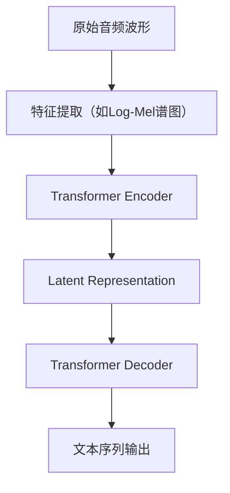
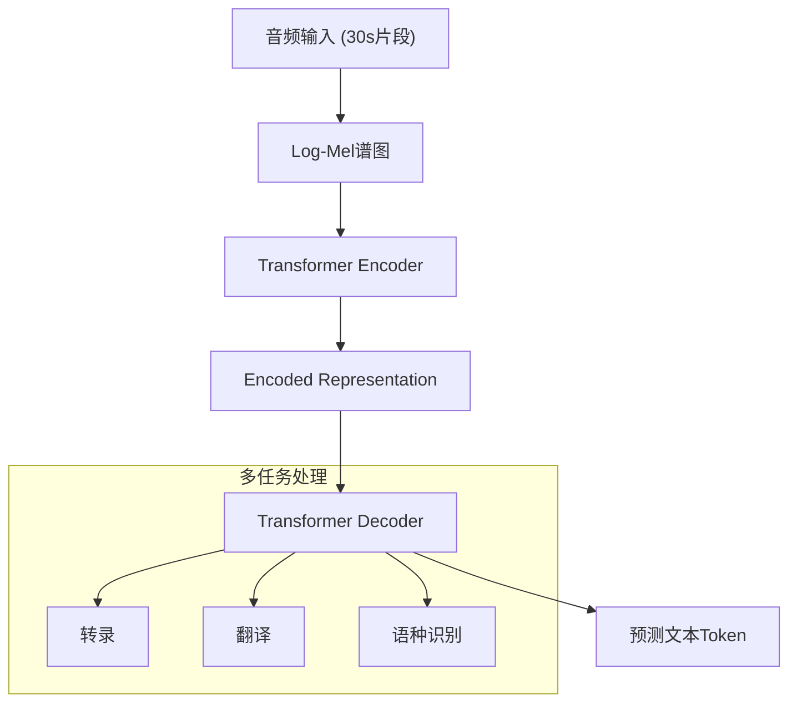
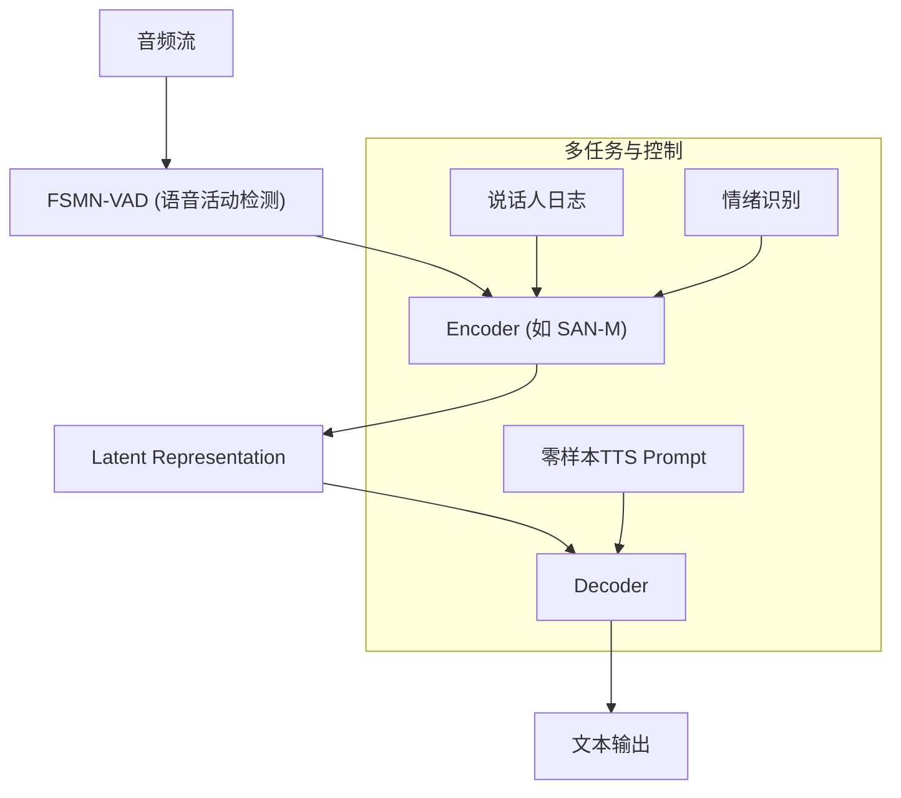

# 1. 背景
## 1.1 传统ASR模型的痛点
传统的自动语音识别（ASR）模型，如基于隐马尔可夫模型-高斯混合模型（HMM-GMM）或深度神经网络（DNN）的系统，在特定领域和受控环境下表现良好，但面临诸多挑战：
1.  **数据稀疏性**：对大规模、高质量的标注数据集依赖严重，在低资源语言或特定口音上泛化能力差。
2.  **鲁棒性不足**：在嘈杂环境、远场拾音、多人对话等真实场景下，性能会急剧下降。
3.  **上下文理解缺失**：模型通常局限于声学特征到文本的直接映射，缺乏对长程上下文、语义和说话人意图的理解，导致识别错误（如同音异义词混淆）。
4.  **多任务能力有限**：传统模型通常是单一任务的，如仅支持语音转录，而无法同时完成说话人日志、语种识别、翻译等任务。

## 1.2 大语言模型（LLM）驱动的 ASR 新范式
近年来，以 `Whisper` 为代表的端到端大型 ASR 模型，通过在海量、多样化的无监督或弱监督数据上进行预训练，展现了前所未有的鲁棒性和泛化能力。这些模型通常采用 Encoder-Decoder 架构，将 ASR 任务视为一个序列到序列的翻译问题。

**典型流程**：

这种方法不仅简化了传统 ASR 的复杂流水线，还通过大规模数据学习到了丰富的声学和语言知识，从而在零样本（Zero-shot）场景下也能取得优异表现。

# 2. ASR模型的解决方案分析
## 2.1 Whisper-large-v3-turbo
`Whisper` 是由 OpenAI 开发的预训练 ASR 系统，其 `large-v3` 和 `large-v3-turbo` 版本是目前业界领先的模型之一。

### 2.1.1 Whisper的设计
**结构模块**：

**特点**：
-   **大规模弱监督训练**：在 68 万小时的多语言、多任务数据上进行训练，覆盖了广泛的口音、背景噪音和技术术语。
-   **端到端架构**：一个统一的 Transformer 模型直接将音频映射到文本，无需外部的语言模型或对齐模块。
-   **多任务能力**：模型能够同时处理多语言语音转录、语音翻译和语种识别。
-   **鲁棒性**：通过对数据进行精心设计的数据增强和混合，模型在各种具有挑战性的条件下都表现出色。
-   **Turbo 版本**：`large-v3-turbo` 是 `large-v3` 的优化版本，可能在推理速度、计算效率或特定任务性能上有所提升，参数量约为 798M。

### 2.1.2 解决的问题
| 目标问题 | Whisper 的应对方案 |
| --- | --- |
| 泛化能力差 | 在海量、多样化的数据集上进行大规模预训练，覆盖近百种语言。 |
| 鲁棒性不足 | 训练数据包含各种背景噪音、口音和说话风格，提升了真实场景下的性能。 |
| 上下文建模弱 | Transformer 架构能够捕捉音频信号中的长程依赖关系。 |
| 部署复杂 | 提供多种模型尺寸（从 `tiny` 到 `large`），并开源了代码和模型权重，方便社区使用和部署。 |

### 2.1.3 生产缺陷分析
#### 2.1.3.1 "幻觉"（Hallucination）问题
-   在无语音或噪声片段中，模型有时会生成无意义或重复的文本，这是大型自回归模型的通病。
-   这种现象在长音频处理中尤为明显，可能需要额外的后处理逻辑来检测和过滤。

#### 2.1.3.2 时间戳精度有限
-   模型预测的时间戳是词级别的，但其精度可能不足以满足某些应用（如字幕对齐、语音编辑）的苛刻要求。
-   在长段静音或快速语流中，时间戳的准确性会下降。

#### 2.1.3.3 计算资源要求高
-   `large-v3` 模型包含 15.5 亿参数，`turbo` 版本也有近 8 亿参数，对计算资源（特别是 GPU 显存）要求较高，不适合在边缘设备上直接运行。
-   虽然有量化等优化手段，但在保证性能的同时降低资源消耗仍是一个挑战。

#### 2.1.3.4 实时性瓶颈
-   模型基于 30 秒的音频窗口进行处理，对于实时流式 ASR 场景，需要设计复杂的滑动窗口和缓存机制，这会引入额外的延迟。

## 2.2 SenseVoice
`SenseVoice` 是由阿里巴巴达摩院的语音团队开发的下一代工业级 ASR 模型。与 `Whisper` 专注于鲁棒的通用转录不同，`SenseVoice` 在设计上更侧重于多功能性、实时性和与下游任务的结合。
*(注：由于无法通过 context7 获取官方文档，以下分析基于公开的技术博客和通用知识。)*

### 2.2.1 SenseVoice的设计
**结构模块**：

**特点**：
-   **统一端到端模型**：集成了声学模型、语言模型和标点预测，实现了从语音到带标点文本的端到端输出。
-   **多任务学习**：模型不仅能进行语音识别，还能同时输出说话人日志（Diarization）、情绪信息，甚至可以生成用于零样本 TTS 的声学 prompt。
-   **流式与非流式一体化**：通过统一的架构支持流式和非流式两种模式，满足实时和离线场景的需求。
-   **与 TTS 联动**：`SenseVoice` 的一个创新点是其输出可以作为 `CosyVoice` 等 TTS 模型的 prompt，实现声音的克隆和迁移，打通了 ASR 与 TTS 的闭环。

### 2.2.2 解决的问题
| 目标问题 | SenseVoice 的应对方案 |
| --- | --- |
| 任务单一，集成困难 | 设计为多任务模型，原生支持说话人日志、情绪识别等，简化了对话系统的构建。 |
| 实时性差 | 采用高效的流式架构（如 SAN-M），并结合 VAD，实现了低延迟的实时识别。 |
| 缺乏与下游任务的协同 | 输出包含了丰富的元信息（如说话人、情绪），并能生成 TTS prompt，实现了 ASR 与 TTS 的深度融合。 |
| 标点恢复依赖后处理 | 将标点预测作为模型的一个内置任务，实现了文本和标点的联合建模。 |

### 2.2.3 生产缺陷分析
#### 2.2.3.1 模型复杂度与维护
-   作为一个集成了多种功能的复杂模型，其训练和维护成本相对较高。
-   多任务之间的平衡可能需要精细的调整，以避免某一任务性能的下降。

#### 2.2.3.2 零样本能力的泛化性
-   虽然支持零样本 TTS prompt 生成，但其声音克隆的效果和稳定性在面对未见过的说话人或复杂声学环境时，可能不如专门的 voice cloning 模型。

#### 2.2.3.3 开源生态与社区
-   相较于 `Whisper` 强大的开源社区和丰富的生态工具，`SenseVoice` 作为工业级模型，其开源程度和社区支持可能相对有限，这会影响其在学术界和开发者社区中的普及。

# 3. 总结
-   **Whisper**：通过大规模弱监督学习，将 ASR 的鲁棒性和泛化能力推向了新的高度。它是一个强大的**通用语音识别器**，特别适合处理多样化、非受控的音频数据。其设计哲学是“用规模换性能”，在零样本和多语言场景下表现卓越。
-   **SenseVoice**：代表了 ASR 技术向**多功能、一体化**方向发展的趋势。它不仅仅是一个识别器，更是一个**对话智能的感知前端**，旨在为下游任务（如对话系统、TTS）提供更丰富、更实时的输入。其设计哲学是“融合与协同”，强调 ASR 在整个智能交互链路中的枢纽作用。

总的来说，`Whisper` 定义了现代 ASR 的性能基线，而 `SenseVoice` 则探索了 ASR 在工业应用中更广阔的可能性。未来的 ASR 技术可能会朝着二者结合的方向发展：既有 `Whisper` 的鲁棒性和泛化能力，又有 `SenseVoice` 的多任务协同和实时处理能力。