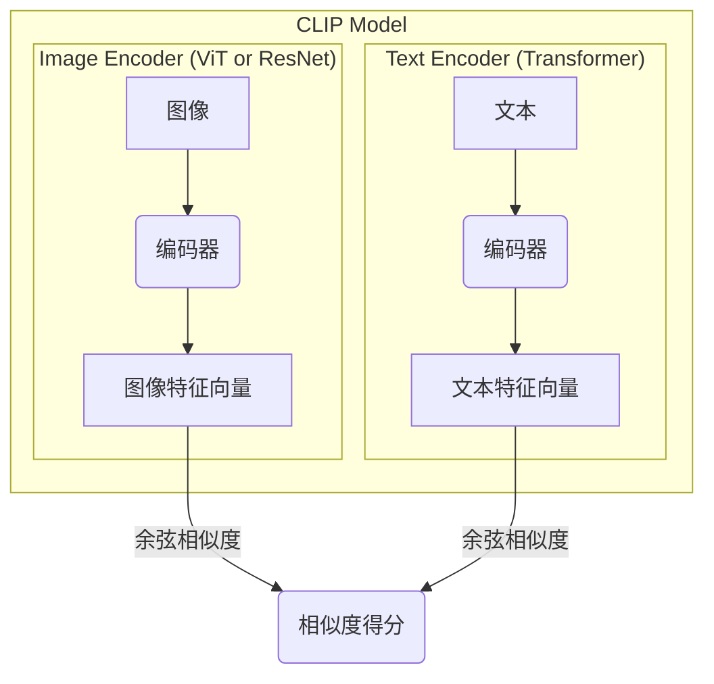
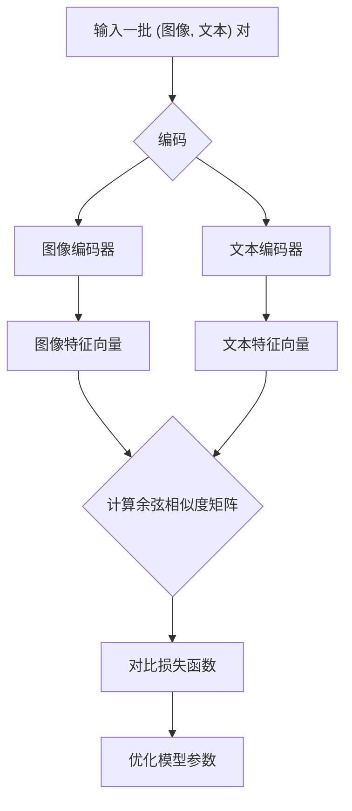

# CLIP (Contrastive Language-Image Pre-training) 技术文档

## 1. 引言

CLIP (Contrastive Language-Image Pre-training) 是由 OpenAI 开发的一种先进的深度学习模型，旨在理解图像和描述该图像的文本之间的关系。通过在大量的（图像，文本）对上进行预训练，CLIP 能够学习到一个共享的多模态嵌入空间，从而将图像和文本映射到这个空间中的向量。

CLIP 的革命性在于其强大的 **零样本学习 (Zero-Shot Learning)** 能力。传统的图像分类模型通常需要针对特定的任务和标签进行训练，而 CLIP 可以在没有任何特定训练的情况下，对从未见过的图像类别进行分类，这极大地提高了模型的泛化性和灵活性。

## 2. 核心概念

要理解 CLIP，首先需要了解以下几个核心概念：

### 2.1 多模态学习 (Multimodal Learning)

多模态学习是指让模型能够处理和关联来自不同模态（如文本、图像、音频）的信息。人类通过结合视觉、听觉和语言来理解世界，多模态学习的目标就是让 AI 具备类似的能力。CLIP 正是多模态学习在图像和文本领域的杰出代表。

### 2.2 对比学习 (Contrastive Learning)

对比学习是一种自监督学习方法。其核心思想是：**将相似的样本在表示空间中拉近，将不相似的样本推远**。

想象一下，在一大堆“图像-文本”配对的数据中，对于一个给定的图像（例如一张猫的图片），其对应的文本描述（“一只猫的照片”）就是正样本，而其他所有文本描述（例如“一条狗的照片”、“一辆车的照片”）都是负样本。CLIP 的目标就是学习一个编码器，使得“猫的图片”和“一只猫的照片”在向量空间中的表示非常接近，而与其他不相关的文本描述的表示则相距甚远。

### 2.3 零样本学习 (Zero-Shot Learning)

零样本学习是指模型在没有见过任何特定类别样本的情况下，依然能够对该类别进行识别和分类。CLIP 通过将图像分类任务转化为一个图文匹配问题来实现这一点。

例如，要判断一张图片是不是“狗”，我们不需要一个专门训练来识别“狗”的模型。我们只需要将这张图片编码成一个向量，然后将文本“一张狗的照片”也编码成一个向量，最后计算这两个向量的相似度。如果相似度很高，那么我们就可以认为这张图片是“狗”。这种方法使得 CLIP 能够识别任意类别的物体，只要我们能用文本描述它。

## 3. 模型架构

CLIP 模型由两个主要部分组成：一个图像编码器和一个文本编码器。

*   **图像编码器 (Image Encoder)**：负责将输入的图像转换成一个特征向量。CLIP 使用了两种主流的架构：
    *   **ResNet**：一种经典的卷积神经网络。
    *   **Vision Transformer (ViT)**：一种将 Transformer 架构应用于图像识别的模型。
*   **文本编码器 (Text Encoder)**：负责将输入的文本转换成一个特征向量。CLIP 使用的是标准的 **Transformer** 架构。

这两个编码器将图像和文本映射到同一个多维度的嵌入空间中，使得它们的向量表示可以进行直接比较。



## 4. 工作流程

CLIP 的工作流程分为训练和推理两个阶段。

### 4.1 训练阶段

在训练阶段，CLIP 从一个包含数亿个（图像，文本）对的数据集中学习。对于一个批次（Batch）的数据，其中包含 N 个（图像，文本）对，CLIP 会执行以下操作：

1.  **编码**：将 N 个图像通过图像编码器得到 N 个图像特征向量，将 N 个文本通过文本编码器得到 N 个文本特征向量。
2.  **计算相似度**：计算这 N 个图像特征向量和 N 个文本特征向量两两之间的余弦相似度，得到一个 N x N 的相似度矩阵。
3.  **对比学习**：在这个矩阵中，对角线上的元素对应的是正确的（图像，文本）对，我们希望它们的相似度尽可能高。而非对角线上的元素则是不匹配的，我们希望它们的相似度尽可能低。模型通过一个对比损失函数（Contrastive Loss）来优化，从而实现这个目标。



### 4.2 推理阶段 (零样本分类)

在推理阶段，CLIP 可以执行零样本图像分类任务：

1.  **准备文本提示**：对于所有你想要分类的类别（例如，“猫”，“狗”，“汽车”），创建一系列的文本提示，如 "a photo of a cat", "a photo of a dog", "a photo of a car"。
2.  **编码文本**：将这些文本提示通过文本编码器转换成一系列的文本特征向量。
3.  **编码图像**：将待分类的图像通过图像编码器转换成一个图像特征向量。
4.  **计算相似度**：计算该图像特征向量与所有文本特征向量之间的余弦相似度。
5.  **预测**：相似度最高的文本提示所对应的类别，就是 CLIP 的预测结果。

## 5. 应用场景

CLIP 的强大能力使其在许多领域都有广泛的应用：

*   **零样本图像分类**：无需额外训练即可对任意类别的图像进行分类。
*   **图像检索**：可以用一段自然语言描述来搜索匹配的图像。
*   **内容审核**：自动识别和过滤不当的图像内容。
*   **驱动生成模型**：CLIP 的多模态理解能力可以用来指导生成模型（如 DALL-E 2）生成符合文本描述的图像。

## 6. 代码示例

以下是一个简单的 Python 代码示例，展示了如何使用 `clip` 库加载模型并获取图像的特征向量。

首先，你需要安装必要的库：

```bash
pip install torch clip
```

然后，你可以使用以下代码：

```python
import torch
import clip
from PIL import Image

# 加载模型，可以选择在 CPU 或 GPU 上运行
device = "cuda" if torch.cuda.is_available() else "cpu"
model, preprocess = clip.load("ViT-B/32", device=device)

# 加载并预处理图像
image_path = "cat.jpg"  # 替换成你的图片路径
image = preprocess(Image.open(image_path)).unsqueeze(0).to(device)

# 准备文本描述
text_descriptions = ["a photo of a cat", "a photo of a dog"]
text_tokens = clip.tokenize(text_descriptions).to(device)

with torch.no_grad():
    # 编码图像和文本
    image_features = model.encode_image(image)
    text_features = model.encode_text(text_tokens)
    
    # 计算相似度
    logits_per_image, logits_per_text = model(image, text_tokens)
    probs = logits_per_image.softmax(dim=-1).cpu().numpy()

print("Label probs:", probs)  # 输出图像与每个文本描述的匹配概率

```

## 7. 总结

CLIP 通过其创新的对比学习方法，成功地将文本和图像连接在了一个共享的表示空间中，展示了强大的零样本学习能力。它不仅在多项基准测试中取得了优异的成绩，也为多模态人工智能的发展开辟了新的道路。

**优势**:
*   强大的泛化能力和零样本性能。
*   无需为特定任务进行微调，节省了大量的标注成本。
*   可以理解复杂的、抽象的文本描述。

**局限性**:
*   对于非常细粒度的分类任务（如识别特定种类的鸟）可能表现不佳。
*   对一些抽象或系统性的概念（如计数）理解有限。
*   模型的性能高度依赖于预训练数据的质量和规模。

尽管存在一些局限性，CLIP 依然是近年来人工智能领域最重要的突破之一，并持续推动着多模态研究的边界。