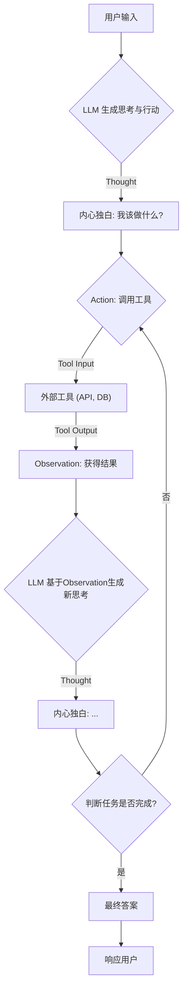
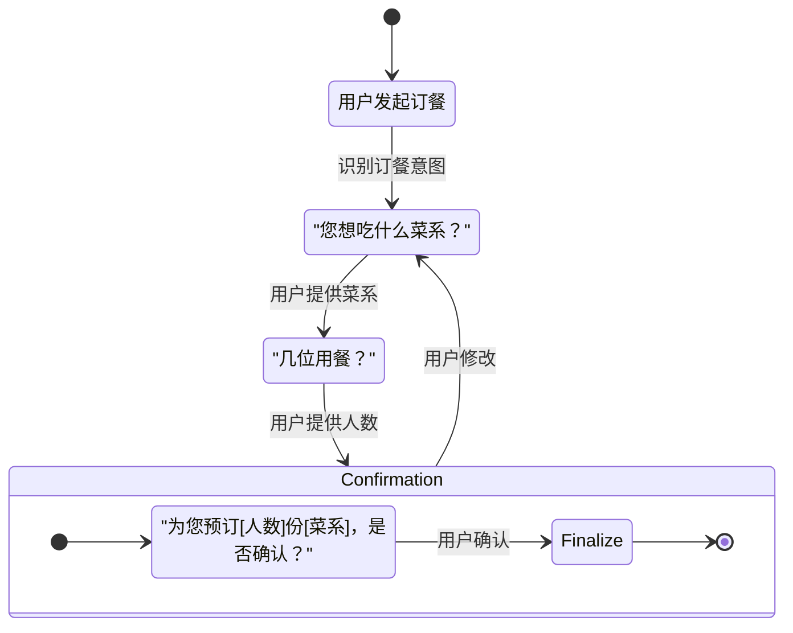

# LLM Agent 多轮对话解决方案：从宏观到微观的深度解析

## 1. 引言：为什么多轮对话是 Agent 的核心命脉？

在人机交互的浪潮中，大型语言模型（LLM）驱动的 Agent（智能体）正从简单的“一问一答”式工具，演变为能够执行复杂任务、具备推理和规划能力的“智能助理”。这种演进的核心，在于**多轮对话（Multi-turn Dialogue）**的能力。

单轮对话如同一次性的查询，而多轮对话则是一场持续的、有记忆、有目标的交流。用户可能不会一次性给出所有信息，Agent 需要在连续的交互中理解不断变化的需求、澄清模糊的指令、调用外部工具、并最终达成用户的目标。

本篇文档将深入浅出地剖析 LLM Agent 在实现高效、可靠的多轮对话时所面临的核心挑战，并“掰开了、揉碎了”地讲解当前主流的技术架构和实现细节。

---

## 2. 核心挑战：多轮对话中的“棘手问题”

要构建一个强大的多轮对话 Agent，就必须直面以下几个根源性难题：

### 2.1 上下文窗口限制 (Context Window Limitation)
这是最根本的物理限制。LLM 只能处理有限长度的文本（Token）。随着对话轮次的增加，完整的对话历史很快就会超出模型的上下文窗口。

- **宏观问题**：导致“失忆”，Agent 无法回顾早期的关键信息，造成对话连贯性断裂。
- **底层细节**：直接截断早期的对话历史是最简单粗暴的方法，但这可能丢失重要前提。例如，用户在对话开始时设定的偏好（“我喜欢靠窗的座位”）在后续订票环节可能被遗忘。

### 2.2 状态维护的复杂性 (State Maintenance)
Agent 需要精确地追踪对话的状态，例如：当前任务进展到哪一步？用户提供了哪些信息？还需要哪些信息？

- **宏观问题**：如果状态混乱，Agent 会表现得“糊涂”，反复询问已知信息，或在任务流程中“迷路”。
- **底层细节**：状态不仅仅是对话历史。它是一个结构化的数据集合，可能包括用户意图、已提取的实体（如日期、地点）、API 调用结果、当前任务节点等。如何设计一个健壮、可扩展的状态管理机制是工程上的巨大挑战。

### 2.3 意图漂移与目标遗忘 (Intent Drifting & Goal Forgetting)
在长对话中，用户的意图可能会发生变化，或者一个大的目标会被分解成多个子任务。

- **宏观问题**：Agent 需要能够理解并适应这种动态变化，而不是固守最初的目标。如果用户在查询天气后，接着说“那帮我订一张去那里的机票”，Agent 必须意识到这是一个新的、关联的意图。
- **底层细节**：这要求 Agent 具备强大的意图识别和推理能力，能判断当前用户输入是延续、修正还是开启一个全新的任务。

### 2.4 错误处理与自我纠正 (Error Handling & Self-Correction)
当工具调用失败（如 API 超时）、信息提取错误或理解偏差时，Agent 不能简单地崩溃或放弃。

- **宏观问题**：一个可靠的 Agent 应该能识别失败，并主动发起纠正流程，例如重新尝试、向用户澄清或寻找替代方案。
- **底层细节**：这需要在架构层面设计出容错和重试机制。Agent 需要能“理解”工具返回的错误信息，并基于此生成新的“思考”，规划下一步的纠正动作。

---

## 3. 技术架构的演进与剖析

为了应对上述挑战，业界探索出了多种解决方案，从简单的历史压缩到复杂的 Agentic 架构。

### 3.1 早期尝试：对话历史压缩
这是解决上下文窗口限制最直接的思路。

- **摘要式记忆 (Summary Memory)**：在每轮对话后，或当历史长度接近阈值时，让另一个 LLM 调用来对现有对话进行摘要。
  - **优点**：有效缩减长度。
  - **缺点**：摘要过程可能丢失细节，且会增加额外的 LLM 调用成本和延迟。

### 3.2 ReAct 架构：赋予 Agent “思考”的能力

ReAct (Reason + Act) 是当今主流 Agent 架构的基石。它通过一个精巧的“思考-行动-观察”循环，让 LLM 从一个单纯的文本生成器，变成一个具备推理和执行能力的主体。

- **宏观理念**：模仿人类解决问题的模式——先思考分析（Reason），然后采取行动（Act），最后观察结果（Observation）并调整思路。

- **底层实现**：通过精心设计的 Prompt，引导 LLM 生成包含特定标记的文本。
    - **Thought**: LLM 在这一步进行“内心独白”，分析当前情况，规划下一步行动。这部分内容对用户不可见。
    - **Action**: LLM 决定调用哪个工具以及传入什么参数。例如 `search("北京今天天气")`。
    - **Observation**: 将工具执行的结果（如 API 返回的数据、数据库查询结果）反馈给 LLM。

这个循环不断重复，直到 Agent 认为任务已经完成。

#### Mermaid 流程图：ReAct 工作循环

### 3.3 有限状态机 (FSM)：为对话流建立“轨道”

对于目标明确、流程相对固定的任务（如订餐、客服），有限状态机 (FSM) 是一种极其强大和可靠的架构。

- **宏观理念**：将复杂的对话流程抽象成一系列离散的“状态”，以及在这些状态之间切换的“转移条件”。Agent 在任意时刻都处于一个明确的状态，只能通过预设的路径转移到下一个状态。

- **底层实现**：
    - **States**: 定义对话可能处于的节点，如 `AskLocation`、`AskCuisine`、`ConfirmOrder`、`OrderPlaced`。
    - **Transitions**: 定义状态切换的规则，通常由用户的输入或工具的输出来触发。例如，在 `AskLocation` 状态下，如果从用户输入中成功提取到地点信息，则转移到 `AskCuisine` 状态。
    - **State Handler**: 每个状态都关联一个处理函数，负责在该状态下执行特定逻辑（如向用户提问、调用 API）。

#### Mermaid 状态图：一个简单的订餐 Agent

**FSM vs. ReAct**：FSM 结构清晰、可预测性强、易于调试，非常适合任务型对话。而 ReAct 更加灵活、通用，适合处理开放式、需要复杂推理和动态规划的任务。在实践中，两者也常常结合使用（例如，在 FSM 的某个状态中使用 ReAct 来处理一个开放式子任务）。

---

## 4. 核心组件：Agent 的“记忆”系统

无论采用何种架构，一个强大的记忆系统都是实现有效多轮对话的基石。

### 4.1 短期记忆 (Short-term Memory)
也称为工作记忆，主要负责存储近期的对话历史。

- **典型实现**: `ConversationBufferMemory` 或 `ConversationBufferWindowMemory`。
- **底层细节**:
    - `ConversationBufferMemory`: 存储完整的对话历史。简单直接，但在长对话中迅速耗尽上下文窗口。
    - `ConversationBufferWindowMemory`: 只保留最近 `k` 轮的对话。这是一种滑动窗口机制，能有效控制长度，但有丢失早期重要信息的风险。

### 4.2 长期记忆 (Long-term Memory)
负责存储跨对话的、持久化的知识和信息。

- **典型实现**: 基于**向量数据库**的检索增强生成 (RAG)。
- **底层细节**:
    1.  将外部文档（如产品手册、知识库文章）或过去的对话关键信息进行切片。
    2.  使用 Embedding 模型将文本块转换为向量。
    3.  将向量存入向量数据库（如 Chroma, Pinecone, FAISS）。
    4.  当用户提问时，将其问题也转换为向量。
    5.  在向量数据库中进行相似度搜索，找出最相关的文本块。
    6.  将这些文本块作为上下文（Context）与用户问题一起注入到 LLM 的 Prompt 中，引导其生成更精准的回答。

### 4.3 结构化记忆 (Structured Memory)
以结构化的方式存储和提取信息，特别是对话中的关键实体。

- **典型实现**: `Entity Memory`。
- **底层细节**: LLM 被指示去识别和提取对话中出现的关键实体（如人名、地名、订单号），并将它们存储在一个类似键值对的表中。当后续对话提及这些实体时，Agent 可以快速、准确地检索其相关信息。

### 4.4 摘要式记忆 (Summary Memory)
如前所述，通过对对话历史进行滚动摘要来节省空间。

- **典型实现**: `ConversationSummaryMemory` 或 `ConversationSummaryBufferMemory`。
- **底层细节**:
    - `ConversationSummaryMemory`: 每次都对整个对话历史进行摘要，成本高。
    - `ConversationSummaryBufferMemory`: 一种混合策略。它保留最近 `k` 轮的完整对话，同时维护一个对更早期对话的滚动摘要。这在成本和信息保真度之间取得了很好的平衡。

---

## 5. 总结与展望

构建一个能够进行流畅、智能多轮对话的 LLM Agent 是一项复杂的系统工程。它要求我们：

1.  **直面物理限制**：通过巧妙的**记忆管理机制**（如摘要、RAG）来克服上下文窗口的瓶颈。
2.  **选择合适的架构**：根据任务的复杂度，在**灵活性（ReAct）**和**结构性（FSM）**之间做出权衡，甚至将两者结合。
3.  **设计健壮的流程**：内置**状态追踪**、**意图识别**和**错误纠正**能力，使 Agent 在复杂交互中保持稳定和可靠。

未来的发展方向将更加聚焦于 Agent 的自主学习和进化能力。Agent 不仅能执行任务，还能从与用户的交互中学习新的技能、优化自身的工具调用策略、并动态调整其对话风格，最终成为真正意义上的个性化智能伙伴。