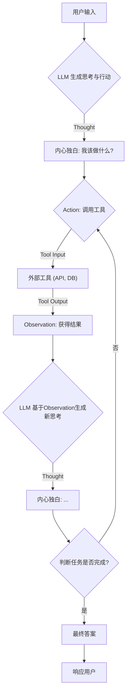
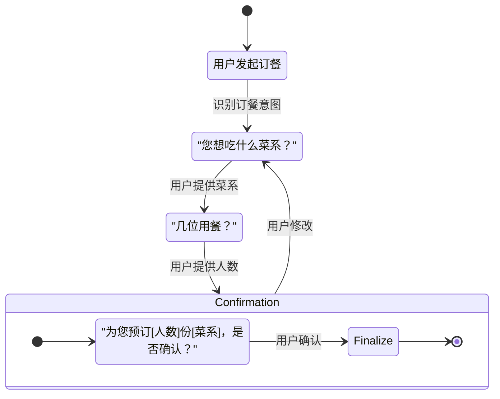
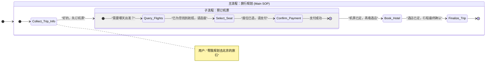

# LLM Agent 多轮对话解决方案：从宏观到微观的深度解析

## 1. 引言：为什么多轮对话是 Agent 的核心命脉？

在人机交互的浪潮中，大型语言模型（LLM）驱动的 Agent（智能体）正从简单的“一问一答”式工具，演变为能够执行复杂任务、具备推理和规划能力的“智能助理”。这种演进的核心，在于**多轮对话（Multi-turn Dialogue）**的能力。

单轮对话如同一次性的查询，而多轮对话则是一场持续的、有记忆、有目标的交流。用户可能不会一次性给出所有信息，Agent 需要在连续的交互中理解不断变化的需求、澄清模糊的指令、调用外部工具、并最终达成用户的目标。

本篇文档将深入浅出地剖析 LLM Agent 在实现高效、可靠的多轮对话时所面临的核心挑战，并“掰开了、揉碎了”地讲解当前主流的技术架构和实现细节。

---

## 2. 核心挑战：多轮对话中的“棘手问题”

要构建一个强大的多轮对话 Agent，就必须直面以下几个根源性难题：

### 2.1 上下文窗口限制 (Context Window Limitation)
这是最根本的物理限制。LLM 只能处理有限长度的文本（Token）。随着对话轮次的增加，完整的对话历史很快就会超出模型的上下文窗口。

- **宏观问题**：导致“失忆”，Agent 无法回顾早期的关键信息，造成对话连贯性断裂。
- **底层细节**：直接截断早期的对话历史是最简单粗暴的方法，但这可能丢失重要前提。例如，用户在对话开始时设定的偏好（“我喜欢靠窗的座位”）在后续订票环节可能被遗忘。

### 2.2 状态维护的复杂性 (State Maintenance)
Agent 需要精确地追踪对话的状态，例如：当前任务进展到哪一步？用户提供了哪些信息？还需要哪些信息？

- **宏观问题**：如果状态混乱，Agent 会表现得“糊涂”，反复询问已知信息，或在任务流程中“迷路”。
- **底层细节**：状态不仅仅是对话历史。它是一个结构化的数据集合，可能包括用户意图、已提取的实体（如日期、地点）、API 调用结果、当前任务节点等。如何设计一个健壮、可扩展的状态管理机制是工程上的巨大挑战。

### 2.3 意图漂移与目标遗忘 (Intent Drifting & Goal Forgetting)
在长对话中，用户的意图可能会发生变化，或者一个大的目标会被分解成多个子任务。

- **宏观问题**：Agent 需要能够理解并适应这种动态变化，而不是固守最初的目标。如果用户在查询天气后，接着说“那帮我订一张去那里的机票”，Agent 必须意识到这是一个新的、关联的意图。
- **底层细节**：这要求 Agent 具备强大的意图识别和推理能力，能判断当前用户输入是延续、修正还是开启一个全新的任务。

### 2.4 错误处理与自我纠正 (Error Handling & Self-Correction)
当工具调用失败（如 API 超时）、信息提取错误或理解偏差时，Agent 不能简单地崩溃或放弃。

- **宏观问题**：一个可靠的 Agent 应该能识别失败，并主动发起纠正流程，例如重新尝试、向用户澄清或寻找替代方案。
- **底层细节**：这需要在架构层面设计出容错和重试机制。Agent 需要能“理解”工具返回的错误信息，并基于此生成新的“思考”，规划下一步的纠正动作。

---

## 3. 技术架构的演进与剖析

为了应对上述挑战，业界探索出了多种解决方案，从简单的历史压缩到复杂的 Agentic 架构。

### 3.1 早期尝试：对话历史压缩
这是解决上下文窗口限制最直接的思路。

- **摘要式记忆 (Summary Memory)**：在每轮对话后，或当历史长度接近阈值时，让另一个 LLM 调用来对现有对话进行摘要。
  - **优点**：有效缩减长度。
  - **缺点**：摘要过程可能丢失细节，且会增加额外的 LLM 调用成本和延迟。

### 3.2 ReAct 架构：赋予 Agent “思考”的能力

ReAct (Reason + Act) 是当今主流 Agent 架构的基石。它通过一个精巧的“思考-行动-观察”循环，让 LLM 从一个单纯的文本生成器，变成一个具备推理和执行能力的主体。

- **宏观理念**：模仿人类解决问题的模式——先思考分析（Reason），然后采取行动（Act），最后观察结果（Observation）并调整思路。

- **底层实现**：通过精心设计的 Prompt，引导 LLM 生成包含特定标记的文本。
    - **Thought**: LLM 在这一步进行“内心独白”，分析当前情况，规划下一步行动。这部分内容对用户不可见。
    - **Action**: LLM 决定调用哪个工具以及传入什么参数。例如 `search("北京今天天气")`。
    - **Observation**: 将工具执行的结果（如 API 返回的数据、数据库查询结果）反馈给 LLM。

这个循环不断重复，直到 Agent 认为任务已经完成。

#### Mermaid 流程图：ReAct 工作循环



### 3.3 有限状态机 (FSM)：为对话流建立“轨道”

对于目标明确、流程相对固定的任务（如订餐、客服），有限状态机 (FSM) 是一种极其强大和可靠的架构。

- **宏观理念**：将复杂的对话流程抽象成一系列离散的“状态”，以及在这些状态之间切换的“转移条件”。Agent 在任意时刻都处于一个明确的状态，只能通过预设的路径转移到下一个状态。

- **底层实现**：
    - **States**: 定义对话可能处于的节点，如 `AskLocation`、`AskCuisine`、`ConfirmOrder`、`OrderPlaced`。
    - **Transitions**: 定义状态切换的规则，通常由用户的输入或工具的输出来触发。例如，在 `AskLocation` 状态下，如果从用户输入中成功提取到地点信息，则转移到 `AskCuisine` 状态。
    - **State Handler**: 每个状态都关联一个处理函数，负责在该状态下执行特定逻辑（如向用户提问、调用 API）。

#### Mermaid 状态图：一个简单的订餐 Agent


#### FSM 的现代化演进：动态与层级化

传统的 FSM 依赖于硬编码的规则进行状态转移，这在面对复杂多变的真实场景时会显得僵化。现代 Agent 设计将 FSM 与 LLM 的能力深度结合，催生了更智能、更灵活的架构。

-   **LLM 驱动的状态转移**：与其用固定的 `if-else` 规则判断状态切换，不如让 LLM 来做决策。在每个循环中，将对话历史、当前用户输入以及所有可能的目标状态列表传给 LLM，让它基于强大的上下文理解能力，判断出最应该进入的下一个状态。这使得状态转移从“规则驱动”升级为“智能驱动”。

-   **状态专属提示词（State-specific Prompts）**：这是一种强大的动态提示词应用。可以为 FSM 中的每一个核心状态节点，预先设计一套高度优化的专属提示词。当 Agent 进入某个状态（如 `Collect_Cuisine`），系统会立即启用该状态对应的 Prompt。这个 Prompt 不仅指导 LLM 如何在该节点与用户交互，还可以定义该状态下可调用的工具、应遵循的规则等。这使得 Agent 在不同任务阶段可以“戴上不同的帽子”，表现出极高的专业性和任务相关性。

##### 示例：机票预订子流程中 `Query_Flights` 状态的专属提示词
```
# IDENTITY
You are a world-class flight booking assistant AI.

# STATE & GOAL
You are currently in the "Query_Flights" state.
Your SOLE GOAL is to collect the necessary information to search for flights.
The necessary information is: origin city, destination city, and departure date.

# AVAILABLE TOOLS
- `flight_search_api(origin: str, destination: str, date: str)`: Use this tool to search for flights.

# CONTEXT
- Conversation History:
  {conversation_history}
- User Profile:
  {user_profile}
- Current State Data:
  {state_data}  # e.g., {"origin": "Shanghai", "destination": "Beijing", "date": null}

# RULES
1.  Analyze the Current State Data first.
2.  If any necessary information (origin, destination, date) is missing, you MUST ask the user for it clearly.
3.  Phrase your questions to sound helpful and natural.
4.  Once all information is collected, your FINAL ACTION MUST be to call the `flight_search_api` tool with the correct parameters.
5.  Do not make up information. Do not ask for information that is not required (e.g., return date, unless specified by the user).

# OUTPUT FORMAT
Your output must be a single JSON object.
- To ask a question: {"action": "ask_user", "question": "Your question here."}
- To call a tool: {"action": "call_tool", "tool_name": "flight_search_api", "tool_params": {"origin": "...", "destination": "...", "date": "..."}}
```

-   **层级化状态机（Hierarchical FSM）**：对于大型复杂任务，单一的扁平状态图难以管理。层级化状态机引入了“SOP 嵌套”或“子状态图”的概念。一个高阶的 FSM（主 SOP）负责规划宏观的业务流程（如“完成一次旅行预订”），当流程进行到某个宏观状态（如“预订机票”）时，可以激活一个内嵌的、更详细的子 FSM（子 SOP），该子 FSM 专门负责处理“查询航班 -> 选择座位 -> 确认支付”等一系列精细化操作。这种模式极大地提升了任务拆解的模块化程度和可管理性。

##### Mermaid 图：层级化状态机（SOP 嵌套）示例


**FSM vs. ReAct**：FSM 结构清晰、可预测性强、易于调试，非常适合任务型对话。而 ReAct 更加灵活、通用，适合处理开放式、需要复杂推理和动态规划的任务。在实践中，两者也常常结合使用（例如，在 FSM 的某个状态中使用 ReAct 来处理一个开放式子任务，或者如上文所述，用 LLM 驱动 FSM 的状态转移本身）。

---

## 4. 核心组件：Agent 的“记忆”系统

无论采用何种架构，一个强大的记忆系统都是实现有效多轮对话的基石。

### 4.1 短期记忆 (Short-term Memory)
也称为工作记忆，主要负责存储近期的对话历史。

- **典型实现**: `ConversationBufferMemory` 或 `ConversationBufferWindowMemory`。
- **底层细节**:
    - `ConversationBufferMemory`: 存储完整的对话历史。简单直接，但在长对话中迅速耗尽上下文窗口。
    - `ConversationBufferWindowMemory`: 只保留最近 `k` 轮的对话。这是一种滑动窗口机制，能有效控制长度，但有丢失早期重要信息的风险。

### 4.2 长期记忆 (Long-term Memory)
负责存储跨对话的、持久化的知识和信息。

- **典型实现**: 基于**向量数据库**的检索增强生成 (RAG)。
- **底层细节**:
    1.  将外部文档（如产品手册、知识库文章）或过去的对话关键信息进行切片。
    2.  使用 Embedding 模型将文本块转换为向量。
    3.  将向量存入向量数据库（如 Chroma, Pinecone, FAISS）。
    4.  当用户提问时，将其问题也转换为向量。
    5.  在向量数据库中进行相似度搜索，找出最相关的文本块。
    6.  将这些文本块作为上下文（Context）与用户问题一起注入到 LLM 的 Prompt 中，引导其生成更精准的回答。

### 4.3 结构化记忆 (Structured Memory)
以结构化的方式存储和提取信息，特别是对话中的关键实体。

- **典型实现**: `Entity Memory`。
- **底层细节**: LLM 被指示去识别和提取对话中出现的关键实体（如人名、地名、订单号），并将它们存储在一个类似键值对的表中。当后续对话提及这些实体时，Agent 可以快速、准确地检索其相关信息。

### 4.4 摘要式记忆 (Summary Memory)
如前所述，通过对对话历史进行滚动摘要来节省空间。

- **典型实现**: `ConversationSummaryMemory` 或 `ConversationSummaryBufferMemory`。
- **底层细节**:
    - `ConversationSummaryMemory`: 每次都对整个对话历史进行摘要，成本高。
    - `ConversationSummaryBufferMemory`: 一种混合策略。它保留最近 `k` 轮的完整对话，同时维护一个对更早期对话的滚动摘要。这在成本和信息保真度之间取得了很好的平衡。

### 4.5 用户画像记忆 (User Profile Memory)

这是一种更主动、更高级的结构化记忆，旨在超越单次对话，为用户建立一个持久化的、动态更新的“画像”。Agent 不仅记住对话内容，更记住“你是谁”。

- **宏观理念**: 将用户的偏好、习惯、历史选择、甚至人口统计学信息（在用户授权下）结构化地存储起来。在每次交互时，将这份“用户画像”作为关键上下文直接注入到 Prompt 中，让 LLM 从一开始就“了解”它的交流对象。

- **底层实现**:
    1.  **数据结构**: 通常以键值对（如 JSON 对象）的形式维护用户元数据。例如：`{"user_id": "123", "preferred_language": "English", "dietary_restrictions": ["vegetarian"], "home_city": "Shanghai"}`。
    2.  **Prompt 注入**: 在构建最终的 Prompt 时，将序列化后的用户画像字符串（如 `[UserProfile]...[/UserProfile]`）作为一个固定部分放入上下文。
    3.  **动态维护**: 这是该机制的核心。在对话结束后，Agent 或一个后台进程会分析本轮交互，判断是否需要更新用户画像。例如，当用户说“我最近搬到了北京”，系统需要有一个机制来更新 `home_city` 字段。这个更新过程本身可能就需要一次独立的 LLM 调用来做信息提取和决策。

- **优势**:
    - **高度个性化**: Agent 可以提供前瞻性的、高度定制化的服务。
    - **对话效率**: 避免了重复询问用户的基本偏好，让交互更流畅。
- **挑战**:
    - **更新机制的复杂性**: 如何准确、安全地更新用户画像是一个技术难点。
    - **Token 消耗**: 用户画像会占用宝贵的上下文窗口空间。
    - **数据隐私**: 必须严格遵守用户隐私政策。
---

## 5. 总结与展望

构建一个能够进行流畅、智能多轮对话的 LLM Agent 是一项复杂的系统工程。它要求我们：

1.  **直面物理限制**：通过巧妙的**记忆管理机制**（如摘要、RAG）来克服上下文窗口的瓶颈。
2.  **选择合适的架构**：根据任务的复杂度，在**灵活性（ReAct）**和**结构性（FSM）**之间做出权衡，甚至将两者结合。
3.  **设计健壮的流程**：内置**状态追踪**、**意图识别**和**错误纠正**能力，使 Agent 在复杂交互中保持稳定和可靠。

未来的发展方向将更加聚焦于 Agent 的自主学习和进化能力。Agent 不仅能执行任务，还能从与用户的交互中学习新的技能、优化自身的工具调用策略、并动态调整其对话风格，最终成为真正意义上的个性化智能伙伴。