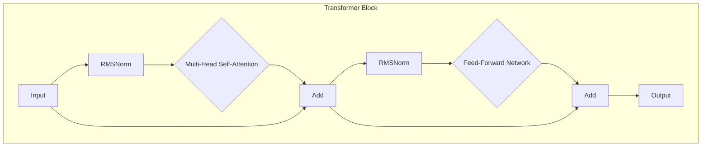

# Llama 1: 详细技术架构解析

## 1. 概述

Llama 1 是由 Meta AI 于 2023 年 2 月推出的第一代大型语言模型。它的发布标志着高性能语言模型开源运动的一个重要里程碑。Llama 1 的设计目标是为学术研究界提供一个强大、高效且可复现的基础模型，其架构在遵循标准 Transformer 模型的基础上，引入了多项关键创新，显著提升了模型的训练稳定性和最终性能。

## 2. 核心架构：基于 Transformer 的改进

Llama 1 的核心是一个仅包含解码器（Decoder-Only）的 Transformer 架构。这种设计使其非常适合自回归式的文本生成任务。其主要构建模块和创新点如下：

### 2.1 预归一化 (Pre-normalization)

为了解决深度 Transformer 网络中普遍存在的梯度消失/爆炸问题，从而提高训练的稳定性，Llama 1 采用了预归一化策略。

- **实现方式**: 在每个 Transformer 子层（多头自注意力层和前馈网络层）的输入端使用 **RMSNorm (Root Mean Square Layer Normalization)** 进行归一化。
- **优势**: 相比于传统的 LayerNorm，RMSNorm 计算更简单，开销更小，同时被证明同样有效。它通过对输入向量进行缩放（scaling）而不是中心化（centering）和缩放，简化了计算过程。
- **公式**: `RMSNorm(x) = (x / sqrt(mean(x^2) + epsilon)) * g`，其中 `g` 是一个可学习的增益参数。

### 2.2 SwiGLU 激活函数

在前馈网络（Feed-Forward Network, FFN）层，Llama 1 放弃了广泛使用的 ReLU 激活函数，转而采用 SwiGLU (Swish-Gated Linear Unit)。

- **实现方式**: FFN 层的维度被扩展，并应用门控线性单元（Gated Linear Unit, GLU）的变体。具体来说，输入 `x` 会被两个线性变换分别处理，一个经过 Swish 激活函数，然后两者逐元素相乘。
- **公式**: `SwiGLU(x, W, V, b, c) = Swish(xW + b) * (xV + c)`，其中 `Swish(x) = x * sigmoid(βx)`。
- **优势**: SwiGLU 被证明可以显著提升模型性能，尽管这会增加一定的计算量（FFN 层的参数量约为标准 ReLU FFN 的 4/3）。

### 2.3 旋转位置编码 (Rotary Positional Embeddings, RoPE)

为了让模型理解 token 在序列中的位置，Llama 1 采用了 RoPE，这是一种相对位置编码方案。

- **实现方式**: RoPE 不直接将位置信息加到词嵌入中，而是在自注意力机制的计算过程中，通过旋转矩阵来修改查询（Query）和键（Key）向量。旋转的角度取决于 token 的绝对位置。
- **优势**:
    1.  **长序列泛化能力**: RoPE 具有良好的外推（extrapolation）能力，对于比训练时更长的序列，其性能衰减更平缓。
    2.  **保留相对位置信息**: 通过旋转操作，模型可以自然地捕捉到 token 之间的相对位置关系。
    3.  **实现简单**: 它只在注意力计算的特定环节修改 Q/K 向量，无需改变模型主体结构。

## 3. 模型规模与训练细节

### 3.1 多尺寸模型

Llama 1 提供了一系列不同规模的模型，以适应不同的研究需求和计算预算：

| 模型 | 参数量 | 维度 (dim) | 头数 (heads) | 层数 (layers) |
| :--- | :--- | :--- | :--- | :--- |
| Llama-7B | 7B | 4096 | 32 | 32 |
| Llama-13B | 13B | 5120 | 40 | 40 |
| Llama-33B | 33B | 6656 | 52 | 60 |
| Llama-65B | 65B | 8192 | 64 | 80 |

### 3.2 训练数据

Llama 1 在一个大规模、多样化的公开文本数据集上进行了训练，总计约 **1.4 万亿 (1.4T) 个 tokens**。数据集来源包括：

- CommonCrawl (filtered)
- C4
- GitHub
- Wikipedia
- Books
- ArXiv
- Stack Exchange

### 3.3 优化器

模型训练使用了 AdamW 优化器，参数设置为 `β1 = 0.9`, `β2 = 0.95`。

## 4. 总结与局限性

Llama 1 的架构设计在效率和性能之间取得了出色的平衡。其引入的 Pre-normalization RMSNorm、SwiGLU 和 RoPE 等技术，对后续的开源大模型产生了深远影响。

然而，作为第一代基础模型，Llama 1 也存在明显局限：
- **未进行指令微调**: 它是一个纯粹的预训练模型，不擅长遵循用户指令或进行多轮对话。
- **商业限制**: 其许可证严格限制了商业用途。
- **上下文长度有限**: 2048 的上下文窗口在处理长文档任务时显得不足。

这些局限性为 Llama 2 的诞生和改进指明了方向。