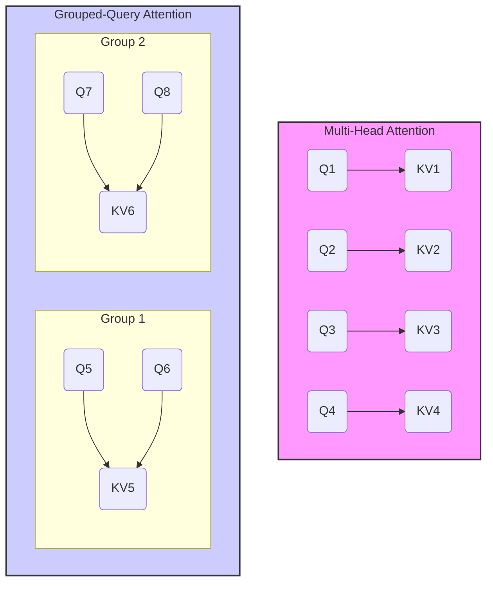

# Llama 2: 详细技术架构解析

## 1. 概述

Llama 2 于 2023 年 7 月发布，是 Meta 对其开创性的 Llama 1 模型的重大升级。它不仅在模型性能上实现了显著提升，更重要的是，它以一个对商业友好的许可证发布，极大地推动了开源大模型在产业界的落地应用。Llama 2 继承了 Llama 1 的优秀设计，并在多个关键维度上进行了深化和创新，特别是引入了对话优化模型 Llama 2-Chat。

## 2. 核心架构与关键改进

Llama 2 的基础架构与 Llama 1 大体一致，仍然是基于 Transformer 的解码器模型，并保留了 Pre-normalization RMSNorm、SwiGLU 激活函数和 RoPE 位置编码等核心组件。但在此基础上，Llama 2 进行了多项关键改进。

### 2.1 更长的上下文窗口

Llama 2 将模型的最大上下文长度从 Llama 1 的 2048 个 token **扩展到了 4096 个 token**。这一改进使得模型能够处理和理解更长的文本输入，对于需要长依赖关系的任务（如长文档问答、代码生成、多轮对话等）至关重要。

### 2.2 分组查询注意力 (Grouped-Query Attention, GQA)

为了在提升模型性能的同时控制推理成本，Llama 2 在其 34B 和 70B 等较大规模的模型中引入了 **分组查询注意力 (GQA)**。

- **背景**: 在标准的多头注意力（Multi-Head Attention, MHA）中，每个查询头（Query head）都有一对独立的键/值头（Key/Value head）。在自回归生成任务中，随着序列长度增加，需要缓存的 K/V 张量会变得非常大，成为推理时的主要内存瓶颈。
- **实现方式**: GQA 是一种折中方案，它将查询头分成若干组，**组内的所有查询头共享同一对键/值头**。这显著减少了需要缓存的 K/V 头的数量。
- **优势**:
    - **降低内存占用**: 大幅减少了 K/V 缓存的大小，使得在同等硬件上可以支持更长的序列或更大的批量大小（batch size）。
    - **加快推理速度**: 减少了内存访问的开销，从而提升了推理效率。
    - **性能保持**: 实验证明，GQA 能够在性能上接近 MHA，远优于所有查询头共享一对 K/V 头的多查询注意力（Multi-Query Attention, MQA）。

## 3. Llama 2-Chat: 对话优化

Llama 2 最大的创新之一是推出了经过专门优化的对话模型——**Llama 2-Chat**。这使其不再仅仅是一个基础模型，而是一个能够与用户进行有效交互的智能助手。其训练过程包括两个主要阶段：

### 3.1 监督式微调 (Supervised Fine-Tuning, SFT)

研究团队首先收集了大量高质量的指令和对话数据，对预训练好的 Llama 2 基础模型进行微调。这个阶段的目标是让模型学会理解和遵循人类的指令，并以对话的形式生成回应。

### 3.2 带人类反馈的强化学习 (Reinforcement Learning with Human Feedback, RLHF)

为了进一步提升模型的有用性（Helpfulness）和安全性（Safety），Llama 2-Chat 采用了 RLHF 进行优化。

1.  **奖励模型训练**: 人类标注员会对模型生成的多个回答进行排序和打分，基于这些偏好数据训练一个或多个奖励模型（Reward Model）。奖励模型学会了评估哪个回答更符合人类的偏好。
2.  **强化学习优化**: 使用奖励模型作为回报函数，通过强化学习算法（如 PPO）来微调 SFT 模型。模型会生成回答，奖励模型给出分数，然后通过优化策略来最大化这个奖励分数。这个过程会激励模型生成更优质、更安全的内容。

## 4. 训练与数据

- **训练数据量**: Llama 2 在一个包含 **2 万亿 (2T) 个 tokens** 的新混合数据集上进行训练，比 Llama 1 多了 40%。数据来源更加广泛，并进行了更严格的清洗和筛选。
- **模型规模**: Llama 2 提供了 7B、13B 和 70B 三种参数规模的模型，以及一个未公开发布的 34B 模型。

## 5. 安全性与责任

Meta 在 Llama 2 的开发中投入了大量资源来确保其安全性。
- **安全微调**: 在 SFT 和 RLHF 阶段都融入了安全相关的指令和数据。
- **红队测试 (Red Teaming)**: 组织了大量的对抗性测试，主动寻找和修复模型的安全漏洞。
- **发布透明度**: 发布了详细的《责任用户指南》和模型卡，说明了模型的潜在风险和使用建议。

## 6. 总结

Llama 2 是一个里程碑式的开源模型。它通过引入 GQA 和更大的上下文窗口提升了基础模型的性能和效率，并通过精细的 SFT 和 RLHF 流程打造了强大的 Llama 2-Chat 对话模型。最重要的是，其开放的商业许可证极大地促进了 AI 技术的民主化，为全球的开发者和企业提供了构建自己 AI 应用的坚实基础。