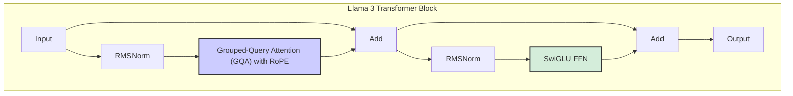
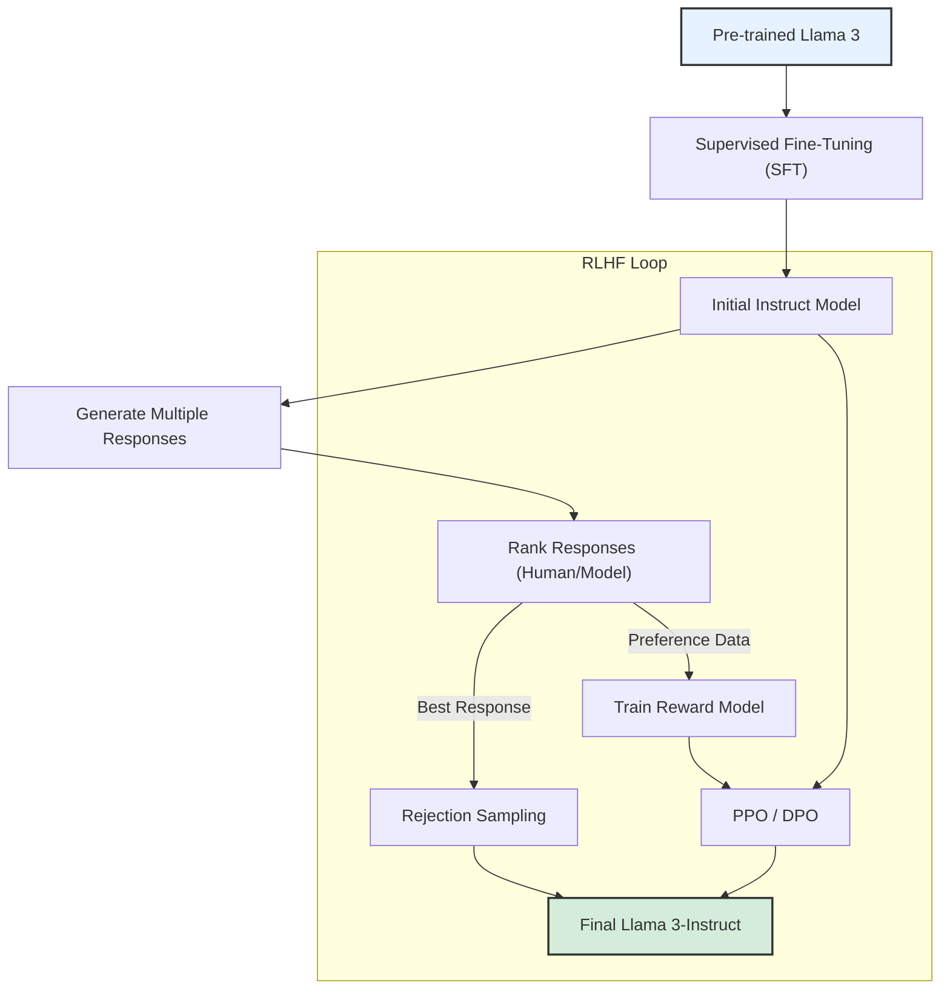

# Llama 3: 详细技术架构解析

## 1. 概述

Llama 3 于 2024 年 4 月发布，被誉为 Meta 迄今为止最强大的开源大语言模型。它在 Llama 2 的成功基础上，从预训练数据、模型架构到后训练（Post-training）方法都进行了全面的、系统性的升级。Llama 3 的目标是打造在各种行业基准测试中都表现卓越，并能在真实世界场景中提供顶尖性能的 SOTA（State-of-the-Art）模型。

## 2. 核心架构与关键创新

Llama 3 延续了其前代产品的解码器式 Transformer 架构，但在多个方面进行了关键的优化和增强。

### Llama 3 Transformer 模块示意图

### 2.1 优化的分词器 (Tokenizer)

Llama 3 采用了全新的、基于 **Tiktoken** 实现的分词器，其词汇表规模从 Llama 2 的 32,000 大幅扩展到了 **128,256**。

- **优势**:
    - **更高的编码效率**: 更大的词汇表意味着可以用更少的 token 来表示相同的文本，这直接提升了模型的处理效率和性能。据 Meta 称，其效率比 Llama 2 的分词器高出约 15%。
    - **更强的多语言能力**: 扩展的词汇表包含了更多非英语语系的 token，显著改善了模型在多语言任务上的表现。

### 2.2 全面应用 GQA (Grouped-Query Attention)

与 Llama 2 仅在部分大模型上使用 GQA 不同，Llama 3 在其所有尺寸的模型（包括 8B 和 70B）中都全面部署了 **分组查询注意力 (GQA)**。

- **一致性与效率**: 这一决策统一了不同规模模型的架构，并确保了即使是较小的 8B 模型也能享受到 GQA 带来的推理效率提升（即更低的内存占用和更快的生成速度）。这对于资源受限的边缘设备和本地部署场景尤为重要。

### 2.3 扩展的上下文窗口

Llama 3 的基础上下文长度为 **8192 个 token**，是 Llama 2 的两倍。更重要的是，通过 RoPE（旋转位置编码）的插值能力，这个窗口可以轻松扩展到 **32K甚至更长**，同时保持较低的性能损失。这使得 Llama 3 能够处理非常长的文档和复杂的上下文依赖。

## 3. 预训练：规模与质量的飞跃

Llama 3 的卓越性能在很大程度上归功于其前所未有的预训练规模和对数据质量的极致追求。

- **海量训练数据**: Llama 3 在一个超过 **15 万亿 (15T) 个 tokens** 的庞大数据集上进行预训练，数据量是 Llama 2 的 7.5 倍。所有数据均来自公开来源。
- **数据质量为王**:
    - **启发式过滤器**: 使用一系列启发式规则（如文本质量、长度、复杂度等）对原始数据进行筛选。
    - **NSFW 过滤器**: 过滤掉不适宜的内容。
    - **语义去重**: 使用模型辅助的去重技术，在文档级别和数据集级别移除冗余信息。
    - **高质量数据倾斜**: 在最终的训练数据集中，不成比例地增加了高质量数据源（如代码、教科书、科学论文等）的权重，并利用 Llama 2 来辅助生成用于训练数据过滤器的文本质量分类器。

## 4. 后训练：精益求精的指令微调

为了打造强大的指令遵循模型 Llama 3-Instruct，Meta 采用了多种先进的后训练技术相结合的策略。

- **混合方法**:
    1.  **监督式微调 (SFT)**: 使用了超过 1000 万个人工标注的高质量指令数据。
    2.  **拒绝采样 (Rejection Sampling)**: 让模型生成多个候选答案，然后由一个高质量的分类器（或人类）选出最佳答案用于梯度更新。
    3.  **近端策略优化 (Proximal Policy Optimization, PPO)**: 一种经典的强化学习算法，用于优化模型的策略以最大化奖励。
    4.  **直接策略优化 (Direct Policy Optimization, DPO)**: 一种更新颖、更稳定的强化学习算法，通过对偏好数据的直接优化来调整模型策略。

- **优势**: 这种混合策略使得 Llama 3-Instruct 在推理、代码生成、指令遵循等复杂任务上表现出色，同时显著提升了模型的有用性和安全性。

### Llama 3 后训练流程示意图

## 5. 模型规模与未来展望

- **当前模型**: 目前已发布 8B 和 70B 两种参数规模的预训练和指令微调模型。
- **未来模型**: Meta 正在训练一个超过 **400B** 参数的旗舰模型，该模型将具备多模态能力（能够处理文本、图像等多种信息），并拥有更长的上下文窗口和更强的整体性能。

## 6. 总结

Llama 3 代表了当前开源大模型的最高水平。它通过在分词器、注意力机制、上下文长度等架构层面的精心优化，结合前所未有的预训练数据规模和质量，以及融合多种先进技术的后训练流程，实现了性能的巨大飞跃。Llama 3 不仅是一个强大的工具，更是开源 AI 社区持续创新和发展的核心引擎。