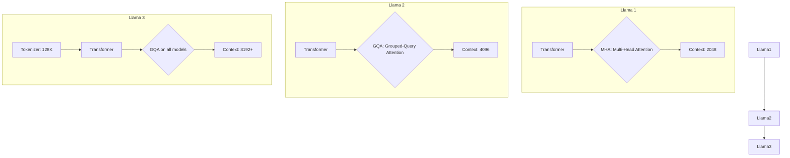

# Llama 模型家族技术文档

## 1. 引言

Llama (Large Language Model Meta AI) 是由 Meta AI 发布的一系列大型语言模型。自诞生以来，Llama 家族凭借其卓越的性能和开源的特性，迅速成为全球开发者和研究者社区中最受欢迎和最具影响力的基础模型之一。本篇技术文档将深入浅出地介绍 Llama 模型家族的演进历程，详细解析从 Llama 1 到 Llama 3 的关键架构、技术创新和性能提升，并探讨其繁荣的生态系统。

## 2. Llama 1: 开源的基石

2023 年 2 月，Meta 发布了第一代 Llama 模型，旨在为研究社区提供一个强大、开放的语言模型，以促进 AI 领域的研究。虽然最初仅授权给学术界，但其权重很快被泄露，从而催生了充满活力的开源社区创新。

### 2.1 核心架构

Llama 1 的架构基于标准的 Transformer 模型，但进行了一些关键的改进，这些改进后来被许多后续的语言模型所采纳：

- **预归一化 (Pre-normalization)**: 为了提升训练稳定性，Llama 使用 RMSNorm 对每个 Transformer 子层的输入进行归一化，而不是对输出进行归一化。
- **SwiGLU 激活函数**: 采用 SwiGLU 激活函数替换了传统的 ReLU，以提升模型性能。
- **旋转位置编码 (Rotary Positional Embeddings, RoPE)**: Llama 使用 RoPE 来注入位置信息，这种方式在处理长序列时表现更佳。

### 2.2 训练数据与模型规模

Llama 1 在高达 1.4 万亿（1.4T）个 token 的公开数据集上进行训练，模型参数规模涵盖 7B、13B、33B 和 65B 四个版本。这种多尺寸的设计使得研究者可以根据计算资源选择合适的模型进行实验。

### 2.3 局限性

尽管 Llama 1 性能强大，但它主要是一个基础模型（foundation model），没有经过针对性的指令微调，因此在作为聊天助手或遵循复杂指令方面能力有限。此外，其商业使用也受到限制。

## 3. Llama 2: 全面进化

2023 年 7 月，Meta 与微软合作发布了 Llama 2，不仅全面开源，还提供了可免费用于研究和商业用途的版本。Llama 2 在第一代的基础上进行了多项重要升级。

### 3.1 关键改进

- **更长的上下文窗口**: 上下文长度从 Llama 1 的 2048 扩展到了 4096，使模型能够处理和理解更长的文本。
- **更多的训练数据**: 训练数据量增加了 40%，达到了 2 万亿（2T）个 token，进一步增强了模型的知识和能力。
- **分组查询注意力 (Grouped-Query Attention, GQA)**: 在较大的模型中引入 GQA，通过共享部分键/值头（Key/Value heads）来降低推理时的计算和内存开销，从而加快推理速度。

### 3.2 Llama 2-Chat

Llama 2 最大的亮点是发布了经过指令微调的对话模型——Llama 2-Chat。它通过监督式微调（SFT）和带有人类反馈的强化学习（RLHF）进行优化，使其在对话、遵循指令和内容创作方面表现出色。

### 3.3 安全与责任

Meta 在 Llama 2 的开发中高度重视安全性，通过红队测试、安全微调等手段来减少模型的有害输出，并发布了详细的《责任用户指南》。

## 4. Llama 3: 当前最佳

2024 年 4 月，Meta 推出了 Llama 3，被誉为当前最强大的开源模型。Llama 3 在架构、数据和后训练方法上都实现了飞跃。

### 4.1 架构增强

- **优化的分词器 (Tokenizer)**: Llama 3 采用了一个拥有 128K token 词汇表的 Tiktoken 分词器，相比 Llama 2 的 32K 词汇表，能更高效地编码文本，尤其是在处理多语言时。
- **全面的 GQA 应用**: Llama 3 在所有尺寸的模型（8B 和 70B）中都使用了 GQA，显著提升了推理效率。

### 4.2 海量预训练数据

Llama 3 在一个超过 15 万亿（15T）token 的高质量数据集上进行预训练，数据量是 Llama 2 的 7.5 倍。这些数据经过了严格的过滤和去重，确保了模型知识的广度和深度。

### 4.3 优化的后训练流程

Llama 3 的指令微调（Instruct-tuning）结合了监督式微调（SFT）、拒绝采样、近端策略优化（PPO）和直接策略优化（DPO）等多种技术。这种混合方法使得模型在遵循指令、逻辑推理和代码生成等方面的能力得到了巨大提升。

## 5. 三代模型对比分析

为了更直观地展示 Llama 家族的演进，下表总结了各代模型的关键特性：

| 特性 | Llama 1 | Llama 2 | Llama 3 |
| :--- | :--- | :--- | :--- |
| **发布时间** | 2023年2月 | 2023年7月 | 2024年4月 |
| **参数规模** | 7B, 13B, 33B, 65B | 7B, 13B, 70B | 8B, 70B (未来有400B+) |
| **训练数据量** | 1.4T tokens | 2T tokens | 15T+ tokens |
| **上下文长度** | 2048 | 4096 | 8192 (可扩展至32K+) |
| **注意力机制** | MHA | MHA / GQA | GQA |
| **分词器词汇量**| 32K | 32K | 128K |
| **开源协议** | 仅研究 | 允许商用 | 允许商用 |
| **对话模型** | 无 | Llama 2-Chat | Llama 3-Instruct |

### 架构演进示意图

## 6. Llama 生态系统

Llama 的开源特性催生了一个庞大而活跃的生态系统，为开发者提供了丰富的工具和平台。

- **`llama.cpp`**: 一个用 C/C++ 实现的高效推理引擎，可以在包括 Mac、Windows、Linux 甚至移动设备在内的多种平台上运行 Llama 模型，极大地降低了本地部署的门槛。
- **`Ollama`**: 一个流行的命令行工具，可以轻松地在本地下载、运行和管理 Llama 及其他开源模型。
- **`vLLM`**: 一个为 Llama 等模型设计的高吞吐量、低延迟的推理和服务引擎，广泛用于生产环境。
- **`LangChain` & `LlamaIndex`**: 强大的应用开发框架，帮助开发者将 Llama 模型与外部数据源、API 和其他工具结合，构建复杂的 RAG（检索增强生成）和 Agent 应用。
- **`Llama Guard`**: Meta 官方推出的专用安全模型，用于检测和过滤用户输入和模型输出中的不安全内容，是构建负责任 AI 应用的重要工具。

## 7. 结语

从 Llama 1 的惊艳亮相，到 Llama 2 的全面开源，再到 Llama 3 的性能巅峰，Llama 模型家族不仅在技术上不断突破，更重要的是，它引领了一场 AI 领域的开源运动。通过向世界开放其最先进的模型，Meta 极大地推动了 AI 技术的普及和创新，赋能了无数开发者、研究人员和初创公司。未来，随着更大规模模型（如 Llama 3 400B+）的发布和生态系统的持续繁荣，Llama 无疑将继续在塑造人工智能的未来中扮演核心角色。