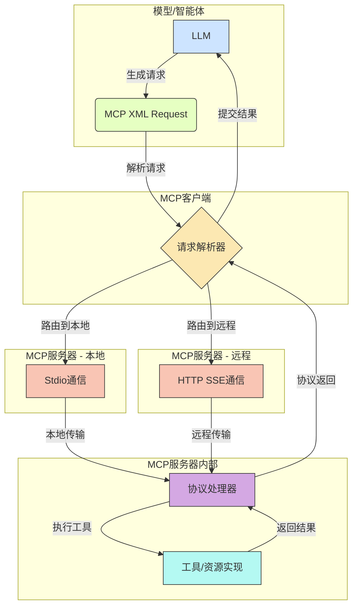
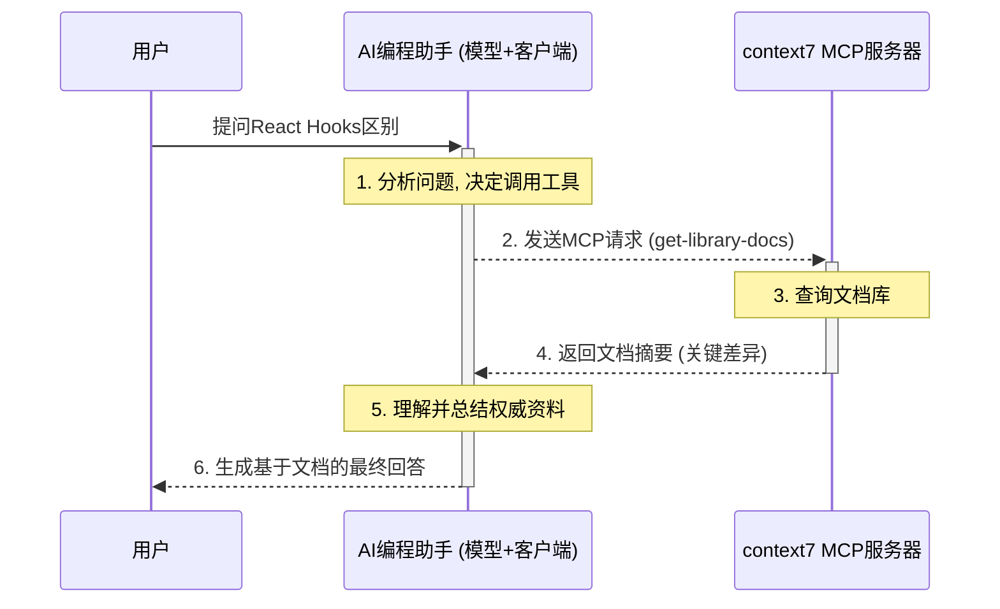

# 模型上下文协议 (MCP) 技术深度解析

## 1. 宏观介绍：在工具调用之上，我们为什么需要MCP？

在上一篇关于通用LLM工具调用的文档中，我们揭示了LLM如何通过调用外部函数来打破其知识边界。这是一种强大的**编程范式**，但它本身并未定义一套**标准化的通信规则**。每个开发者在实现时，都需要自行决定如何组织API、如何管理工具、如何处理数据格式，这导致了生态的碎片化。

**模型上下文协议（Model Context Protocol, MCP）** 正是为了解决这个问题而生。它不是要取代通用的工具调用概念，而是在其之上构建了一层**标准化的、可插拔的、面向服务的协议**。

如果说“工具调用”是让汽车学会了“加油”（使用外部能力）这个动作，那么MCP就是为世界建立了**统一标准的加油站和加油枪接口**。无论你开的是什么车（不同的LLM），无论你要加什么油（不同的工具），只要遵循MCP这套标准，就能无缝对接，即插即用。

MCP的核心价值在于：

*   **标准化 (Standardization)**：定义了模型与外部工具服务之间通信的统一消息格式和交互模式。开发者不再需要为每个模型或应用定制工具集成方案。
*   **解耦 (Decoupling)**：将工具的**实现**（运行在MCP服务器上）与模型的**使用**（由LLM发起调用）彻底分离。模型不需要知道工具的内部代码，只需要知道如何通过协议与其对话。
*   **可复用性 (Reusability)**：一旦一个工具或数据源被封装成一个MCP服务器，它就可以被任何支持MCP协议的模型或应用轻松复用，极大地提高了开发效率。
*   **可发现性 (Discoverability)**：MCP使得工具服务化，为未来构建工具市场、实现工具的自动发现和编排奠定了基础。

简而言之，MCP将零散的“函数调用”提升到了“分布式服务调用”的层面，是构建可扩展、可互操作的AI Agent生态系统的关键基础设施。

## 2. MCP核心架构：三位一体的协同模式

MCP的架构由三个核心组件构成，它们之间通过清晰定义的协议进行交互，形成了一个稳固的“三位一体”协同模式。

1.  **模型/智能体 (Model/Agent)**：决策核心。它负责理解用户意图，并生成遵循MCP格式的请求，以调用外部工具或访问外部资源。
2.  **MCP客户端 (MCP Client)**：通信枢纽。它作为模型与MCP服务器之间的桥梁，负责解析模型生成的MCP请求，通过标准化的传输方式（如Stdio、HTTP SSE）与相应的MCP服务器通信，并处理返回结果。
3.  **MCP服务器 (MCP Server)**：能力提供方。这是一个独立的进程或服务，它将一个或多个工具（Tools）或数据源（Resources）封装起来，并通过MCP协议对外提供标准化的访问接口。

下面是这个架构的可视化解释：



### 架构职责详解：

1.  **模型生成请求**：当LLM需要外部能力时，它不再生成特定API的JSON，而是生成一个符合MCP规范的XML消息，例如`<use_mcp_tool>`。这个消息清晰地指明了要与哪个`server_name`通信，调用哪个`tool_name`。
2.  **客户端解析与路由**：MCP客户端（通常是模型运行环境的一部分）捕获并解析这个XML请求。它根据`server_name`查询一个服务注册表，确定目标服务器是本地进程还是远程服务。
3.  **选择通信信道**：
    *   如果目标是**本地MCP服务器**（例如，一个本地运行的Python脚本），客户端将通过**标准输入/输出 (stdio)** 与该服务器进程进行通信。
    *   如果目标是**远程MCP服务器**（例如，一个部署在云端的服务），客户端将通过**HTTP服务器发送事件 (SSE)** 协议与其建立连接。
4.  **服务器处理请求**：MCP服务器上的协议处理器接收到请求后，根据`tool_name`或`uri`，调用其内部已经注册好的具体工具函数或资源处理器。
5.  **执行与返回**：服务器执行具体的逻辑（调用API、查询数据库等），并将结果封装成MCP标准格式，通过原路返回给客户端。
6.  **结果反馈给模型**：客户端接收到服务器的响应后，将其整理并格式化，作为外部工具的执行结果，再次提交给LLM，以供LLM生成最终的自然语言回复，完成整个交互闭环。

这个架构的精妙之处在于，LLM本身完全与工具的物理位置、网络实现细节解耦。它只需要学会“说”MCP这门“普通话”，就可以与整个MCP生态系统中的任何服务进行交互。
## 3. 通信协议深潜：MCP的神经网络

MCP的强大之处在于其标准化的通信方式。它主要通过两种截然不同的协议来连接客户端和服务器，以适应不同的部署场景。

### 3.1. 本地通信：标准输入/输出 (Stdio)

当MCP服务器是一个本地可执行文件或脚本时（例如，一个Python脚本、一个Go程序），MCP客户端会采用**标准输入/输出（Stdio）**来进行通信。这是一种经典且高效的进程间通信（IPC）方式。

**工作流程掰开揉碎看**:

1.  **启动子进程**: MCP客户端（如VS Code扩展）以一个**子进程**的方式启动MCP服务器程序（例如，执行 `python mcp_server.py`）。
2.  **管道建立**: 操作系统会自动为父进程（客户端）和子进程（服务器）之间建立三个管道：
    *   `stdin` (标准输入): 客户端向服务器发送数据的通道。
    *   `stdout` (标准输出): 服务器向客户端发送成功结果的通道。
    *   `stderr` (标准错误): 服务器向客户端发送错误信息的通道。
3.  **消息交换**:
    *   客户端将MCP请求（例如 `<use_mcp_tool>...` 的XML字符串）写入到服务器进程的`stdin`。为了处理粘包问题，消息通常会以特定的分隔符（如换行符`\n`）或长度前缀来界定。
    *   服务器从其`stdout`读取并解析该请求，执行相应的逻辑。
    *   服务器将执行结果（同样是MCP格式的XML字符串）写入到自己的`stdout`。
    *   如果过程中发生任何错误，错误详情会被写入到`stderr`。
4.  **生命周期管理**: 客户端负责监控服务器子进程的生命周期，可以在不再需要时终止它。

**优点**:
*   **极低延迟**: 因为是本地进程间通信，几乎没有网络开销。
*   **简单可靠**: 实现简单，不依赖于网络堆栈。
*   **安全性高**: 数据不出本机，天然隔离。

**适用场景**:
*   需要高性能、高频次调用的本地工具。
*   直接操作本地文件系统或硬件的工具。
*   作为开发和调试环境。

### 3.2. 远程通信：服务器发送事件 (HTTP SSE)

当MCP服务器部署在远程主机或云端时，通信则通过基于HTTP的**服务器发送事件（Server-Sent Events, SSE）**协议。SSE是一种允许服务器向客户端单向推送事件的Web技术。

**工作流程掰开揉碎看**:

1.  **HTTP连接**: MCP客户端向MCP服务器的特定端点（例如 `https://api.my-mcp-server.com/v1/mcp`）发起一个常规的HTTP GET请求。关键在于，客户端会在请求头中包含 `Accept: text/event-stream`，表明它希望建立一个SSE连接。
2.  **长连接保持**: 服务器在收到该请求后，不会立即关闭连接，而是保持其打开状态，形成一个**长连接**。响应的`Content-Type`头会被设置为`text/event-stream`。
3.  **事件推送**:
    *   客户端通过这个长连接，将MCP请求（XML字符串）作为HTTP POST请求体的一部分发送到服务器的另一个端点。
    *   服务器处理请求后，会将响应数据封装成SSE事件的格式，通过之前建立的长连接**推送**回客户端。每个事件都由`event: <event_name>`和`data: <event_data>`等字段组成。
    *   MCP通常会定义不同类型的事件，如`result`表示成功，`error`表示失败，`log`用于传输日志等。

**优点**:
*   **跨网络通信**: 可以轻松连接到任何地方的服务器。
*   **穿透防火墙**: 基于标准的HTTP(S)协议，具有良好的网络兼容性。
*   **服务端推送**: 适合需要服务器主动通知的场景。

**适用场景**:
*   封装第三方云服务API（如天气、地图、支付）。
*   需要集中管理和部署的共享工具。
*   构建可公开访问的工具服务生态。

## 4. MCP消息格式拆解：协议的“通用语”

MCP的核心是其基于XML的、人类可读且机器易解析的消息格式。模型通过生成这些特定格式的XML片段来表达其意图。

### 4.1. `<use_mcp_tool>`：调用一个工具

这是最核心的消息，用于请求执行一个已定义的工具。

**结构示例**:
```xml
<use_mcp_tool>
    <server_name>weather-server</server_name>
    <tool_name>get_forecast</tool_name>
    <arguments>
        {
          "city": "San Francisco",
          "days": 5
        }
    </arguments>
</use_mcp_tool>
```

**字段详解**:
*   **`<server_name>` (必需)**:
    *   **作用**: MCP服务器的唯一标识符。
    *   **底层细节**: 客户端通过这个名称在其内部的服务注册表中查找对应的服务器信息（是本地进程还是远程URL），决定是使用Stdio还是SSE进行通信。这是实现路由的关键。
*   **`<tool_name>` (必需)**:
    *   **作用**: 要调用的工具的名称。
    *   **底层细节**: MCP服务器接收到请求后，会用这个名称在其内部的工具映射表中找到并执行对应的函数。
*   **`<arguments>` (必需)**:
    *   **作用**: 调用工具所需的参数。
    *   **底层细节**: 内容通常是一个**JSON字符串**。服务器需要先解析这个字符串，将其转换为语言原生的对象或字典，然后再传递给具体的工具函数。这种设计利用了JSON强大的数据表达能力和跨语言的通用性。

### 4.2. `<access_mcp_resource>`：访问一个资源

除了主动“执行”工具，MCP还支持被动地“访问”数据源。

**结构示例**:
```xml
<access_mcp_resource>
    <server_name>internal-docs</server_name>
    <uri>doc://product/specs/version-3.md</uri>
</access_mcp_resource>
```
**字段详解**:
*   **`<server_name>` (必需)**: 同上，用于路由。
*   **`<uri>` (必需)**:
    *   **作用**: 资源的统一资源标识符。
    *   **底层细节**: URI的格式 (`scheme://path`) 由服务器自行定义和解释。例如：
        *   `file:///path/to/local/file`: 访问本地文件。
        *   `db://customers/id/123`: 查询数据库。
        *   `api://v1/users?active=true`: 访问某个REST API端点。
      服务器需要解析这个URI，并根据其模式和路径执行相应的资源获取逻辑。

## 5. 构建一个MCP服务器：从概念到代码骨架

为了让概念更具体，下面是一个极简的Python伪代码骨架，展示了如何实现一个响应Stdio通信的MCP服务器。

```python
import sys
import json
import xml.etree.ElementTree as ET

# 1. 定义具体的工具函数
def get_weather(city: str, days: int = 1):
    """一个模拟的天气工具"""
    # 在真实世界里，这里会调用一个天气API
    return {"city": city, "forecast": f"未来 {days} 天天气晴朗"}

# 将工具名映射到函数对象
AVAILABLE_TOOLS = {
    "get_weather": get_weather
}

# 2. MCP协议处理主循环
def main_loop():
    """从stdin读取请求，处理后将结果写入stdout"""
    for line in sys.stdin:
        request_xml = line.strip()
        if not request_xml:
            continue

        try:
            # 3. 解析MCP请求
            root = ET.fromstring(request_xml)
            if root.tag == "use_mcp_tool":
                tool_name = root.find("tool_name").text
                args_str = root.find("arguments").text
                args = json.loads(args_str)

                # 4. 查找并执行工具
                tool_function = AVAILABLE_TOOLS.get(tool_name)
                if tool_function:
                    result = tool_function(**args)
                    # 5. 将成功结果封装并写回stdout
                    response = {"status": "success", "data": result}
                    sys.stdout.write(json.dumps(response) + "\n")
                else:
                    raise ValueError(f"Tool '{tool_name}' not found.")
            
            # (此处可以添加对access_mcp_resource的处理逻辑)

        except Exception as e:
            # 6. 将错误信息写回stderr
            error_response = {"status": "error", "message": str(e)}
            sys.stderr.write(json.dumps(error_response) + "\n")
        
        # 实时刷新缓冲区，确保客户端能立即收到
        sys.stdout.flush()
        sys.stderr.flush()

if __name__ == "__main__":
    main_loop()

```
这个骨架清晰地展示了MCP服务器的核心职责：监听输入、解析协议、执行逻辑、返回结果。

## 6. 实战演练：使用MCP驱动的context7服务器解答技术问题

理论和骨架之后，让我们通过一个真实的、端到端的例子，看看MCP在实际应用中如何发挥威力。

**场景**：我们正在构建一个AI编程助手。当用户问到一个具体的编程问题时，我们希望AI能通过查询最新的官方文档来给出最权威、最准确的回答，而不是依赖其可能过时的内部知识。

在这个场景中，`context7` MCP服务器就是我们的“外部文档库”。

下面是完整的交互流程：



### 流程拆解与MCP价值体现

1.  **意图到协议的转换**：模型 (LLM) 成功地将用户的自然语言问题，转换成了一个结构化、标准化的MCP请求。它不仅识别出需要调用工具，还准确地填充了`server_name`、`tool_name`和`arguments`，这是MCP驱动的Agent的核心能力。

2.  **解耦的优势**：AI编程助手（客户端）完全不需要知道`context7`服务器是如何实现的。它可能是一个复杂的系统，连接了多个数据源。但对于助手来说，它只是一个遵循MCP协议、可以通过`context7`这个名字访问的服务端点。这种解耦使得更换或升级文档源变得极其简单，而无需改动Agent的核心逻辑。

3.  **标准化带来的可扩展性**：现在，如果我们想让这个AI助手再增加查询NPM包依赖关系的能力，我们只需要开发或接入另一个名为`npm-analyzer`的MCP服务器。Agent的学习成本几乎为零，因为它只需要学会生成一个新的`<use_mcp_tool>`请求，指向新的`server_name`即可。整个系统的能力可以像搭乐高一样被无限扩展。

这个例子清晰地展示了MCP是如何从一个简单的“函数调用”思想，升华为一个强大、可扩展的服务化架构，为构建复杂AI应用提供了坚实的基础。

## 7. 总结：MCP的价值与未来——构建AI的“互联网”

通用工具调用赋予了LLM“说话”和“行动”的能力，而**模型上下文协议（MCP）则为这些能力定义了语法和交通规则**。MCP通过标准化、解耦和服务化的设计理念，将孤立的AI应用和工具转变为一个潜在的、可互操作的巨大网络。

MCP的真正价值不在于它定义了另一种RPC（远程过程调用），而在于它专为**AI Agent与外部世界交互**这一独特场景量身定制。它足够简单，使得LLM可以轻松生成协议消息；又足够强大，能够支撑起复杂的、分布式的应用生态。

未来，随着MCP生态的成熟，我们可以预见到一个“AI工具的互联网”：
*   **工具市场**: 开发者可以发布和销售标准化的MCP服务器，其他应用可以按需购买和集成。
*   **Agent的互操作**: 不同公司开发的、基于不同底层模型的智能体，只要它们都“说”MCP这门语言，就可以互相调用对方的能力，协同完成更复杂的任务。
*   **动态服务发现**: 更高级的Agent或许能够动态发现和学习新的MCP服务，不断扩展自己的能力边界，而无需重新编程。

因此，理解和掌握MCP，不仅仅是学习一项具体的技术，更是洞察和布局下一代AI应用架构的关键一步。