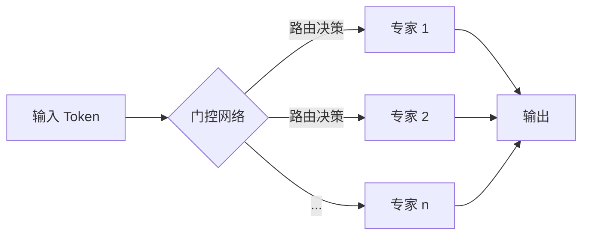

# MoE (Mixture of Experts) 模型技术文档

## 1. 简介

MoE (Mixture of Experts) 是一种神经网络架构，它通过将大型模型分解为多个较小的“专家”网络，并使用一个“门控”网络来动态地为每个输入选择最合适的专家子集，从而在不显著增加计算成本的情况下，极大地扩展了模型的容量。

这种方法的灵感来源于人类社会中的专家系统，即针对特定问题咨询相应的专家。在深度学习中，这意味着模型可以学习将不同的输入路由到专门处理这类数据的专家网络，从而实现更高效、更专业的学习。

## 2. 核心组件

MoE 模型主要由两个核心组件构成：

### 2.1. 专家网络 (Expert Networks)

每个专家通常是一个标准的前馈神经网络 (FFN)。在 Transformer 模型中，MoE 层通常用来替换 FFN 层。这些专家网络并行存在，每个网络都学习处理数据的一个特定子集或方面。它们可以具有相同的架构，也可以是异构的。

### 2.2. 门控网络 (Gating Network)

门控网络是 MoE 的“大脑”，它决定了每个输入 token 应该由哪些专家来处理。对于每个输入，门控网络会输出一个权重向量，该向量的维度等于专家的数量。这个权重向量通常通过一个 softmax 函数生成，表示每个专家对于当前输入的“重要性”或“适用性”。

在稀疏 MoE 中，通常只选择权重最高的 top-k (k 通常为 1 或 2) 个专家来处理输入，从而实现计算上的稀疏性。最终的输出是所选专家的输出的加权和，权重由门控网络提供。

## 3. MoE 的优势

- **巨大的模型容量**: MoE 允许模型拥有海量的参数（例如，数万亿个参数），而不需要在每次前向传播时都计算所有参数。这使得模型能够学习更复杂、更细致的知识。
- **计算成本可控**: 由于采用了稀疏激活的策略（只激活少数专家），MoE 模型的训练和推理成本与一个参数量远小于其总参数量的密集模型相当。
- **更快的训练和推理**: 在相同的计算预算下，MoE 模型通常比密集模型收敛得更快，推理速度也更快。

## 4. MoE 的挑战

- **训练不稳定性**: 门控网络可能会倾向于总是选择少数几个“受欢迎”的专家，导致其他专家得不到充分的训练。为了解决这个问题，通常会引入一个“负载均衡损失”（Load Balancing Loss），以鼓励门控网络将输入均匀地分配给所有专家。
- **高昂的通信成本**: 在分布式训练中，由于不同的专家可能分布在不同的计算设备上，将输入数据从门控网络路由到选定的专家会产生显著的通信开销。
- **复杂的实现**: 相比于标准的密集模型，MoE 模型的实现和部署更为复杂，需要专门的并行计算策略和硬件支持。
- **内存消耗**: 尽管计算是稀疏的，但模型的全部参数（所有专家）都需要存储在内存中，这对硬件提出了很高的要求。

## 5. 关键技术与最新进展

- **Switch Transformers**: 这是 Google 提出的一种简化的 MoE 架构，它将 top-k 策略简化为 top-1，即每个 token 只被路由到一个专家。这种设计极大地简化了路由逻辑，并降低了通信成本。
- **GShard**: 这是一种用于在超大规模集群上训练 MoE 模型的系统。它通过巧妙的数据和模型并行策略，有效地解决了 MoE 训练中的通信瓶颈问题。
- **专家容量因子 (Expert Capacity Factor)**: 为了处理负载不均衡问题，可以为每个专家设置一个“容量”，即它在一个批次中最多能处理的 token 数量。如果某个专家被选中的次数超过了其容量，多余的 token 将被“丢弃”或路由到其他专家。
- **最新的路由策略**: 研究人员正在探索更先进的路由策略，例如，允许 token 被路由到多个专家并加权组合其输出，或者使用更复杂的门控网络来做出更智能的路由决策。
- **在视觉领域的应用**: MoE 不仅仅局限于 NLP 领域，它也被成功地应用于计算机视觉任务，如姿态估计，通过为不同的数据集或姿态类型训练专门的专家来提升模型的性能。

## 6. 总结与展望

MoE 模型通过引入稀疏激活的专家网络，成功地在可控的计算成本下实现了模型规模的巨大突破，成为构建超大规模语言模型和视觉模型的关键技术之一。

尽管面临训练稳定性、通信开销等挑战，但随着 Switch Transformers、GShard 等技术的不断成熟，以及新的路由策略和硬件优化的出现，MoE 的应用前景将更加广阔。未来，我们有望看到更多、更大、更高效的 MoE 模型在各个领域发挥重要作用。