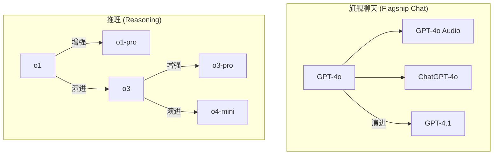
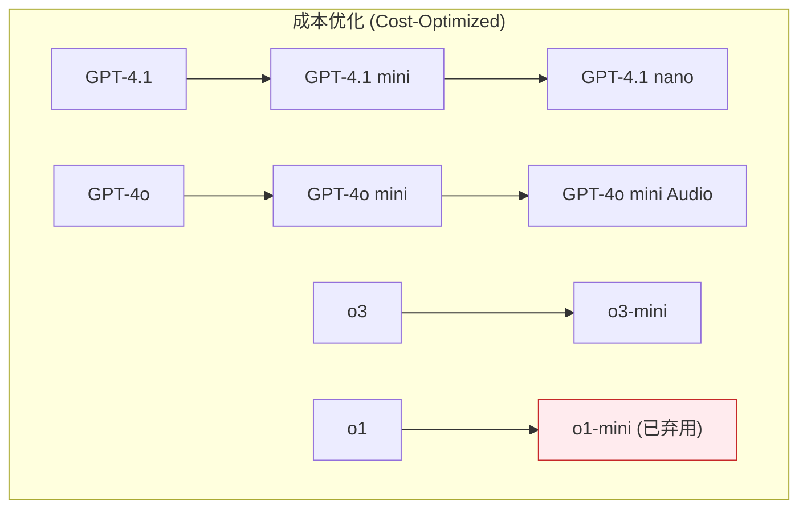
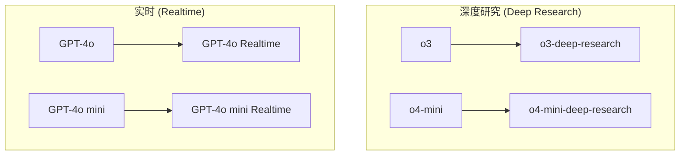

# OpenAI 模型生态系统权威技术文档

**版本**: 1.1 (最终修复版)
**信息来源**: 本文档内容严格基于用户提供的五张官方模型列表图片。

---

## 1. 引言：一个庞大而精细的模型宇宙

欢迎来到OpenAI模型的全景世界。这已经不是单一模型通吃天下的时代，而是一个由多个专业化、互相协作的模型家族组成的复杂生态系统。从能够进行深度对话的旗舰聊天模型，到专为复杂推理而生的o系列，再到为特定任务（如图像生成、实时语音交互、内容审核）量身定制的专项工具，OpenAI为开发者提供了一套前所未有的、精细化的能力矩阵。

本篇技术文档旨在为您提供一张清晰、权威的“地图”，帮助您深入了解每个模型的独特能力和适用场景，从而在您的项目中做出最佳的技术选型。

---

## 2. 旗舰聊天模型 (Flagship Chat Models)

这是OpenAI的门面，代表着最前沿、功能最全面的通用人工智能。它们是构建下一代智能应用的核心引擎。

-   **GPT-4.1**: **旗舰GPT模型，为复杂任务而生。** 这是GPT系列的最新标杆，拥有最强的综合能力，适用于需要顶级智能和深度理解的场景。
-   **GPT-4o**: **快速、智能、灵活的GPT模型。** “o”代表“omni”（全能），是原生多模态的里程碑，无缝整合了文本、音频和视觉能力，同时在速度和成本上取得了巨大突破。
-   **GPT-4o Audio**: **支持音频输入和输出的GPT-4o模型。** 这是GPT-4o在语音交互领域的特定应用形态，为实时语音对话等场景提供了强大的技术基础。
-   **ChatGPT-4o**: **在ChatGPT中使用的GPT-4o模型。** 这是面向公众的ChatGPT产品背后所使用的模型版本。

---

## 3. 推理模型 (Reasoning Models)

o系列模型是为最棘手的逻辑难题而设计的专业“思考者”，它们擅长处理需要多步骤、复杂规划才能解决的任务。

-   **o4-mini**: **更快、更经济实惠的推理模型。** 代表了最新一代的推理技术，在效率和成本上取得了新的平衡。
-   **o3**: **OpenAI当前最强大的推理模型。** 这是o系列的性能巅峰，为需要最高推理精度的任务而设计。
-   **o3-pro**: **o3的增强版，拥有更多的计算资源以获得更好的响应。**
-   **o1**: **之前的全功能o系列推理模型。**
-   **o1-pro**: **o1的增强版。**

---

## 4. 成本优化模型 (Cost-optimized Models)

这个系列旨在让强大的AI能力以更低的门槛被广泛应用。它们是更小、更快、运行成本更低的智能模型，非常适合大规模部署。

-   **GPT-4.1 nano**: **最快、最具成本效益的GPT-4.1模型。**
-   **GPT-4.1 mini**: **在智能、速度和成本之间取得平衡的模型。**
-   **GPT-4o mini**: **快速、经济实惠，专注于特定任务的小模型。**
-   **GPT-4o mini Audio**: **支持音频输入和输出的更小模型。**
-   **o3-mini**: **o3的小模型替代品。**
-   **o1-mini**: o1的小模型替代品，已被 **弃用(Deprecated)**。

---

## 5. 深度研究模型 (Deep Research Models)

这是为探索未知、处理极其复杂任务而设计的“科研级”模型。

-   **o3-deep-research**: **OpenAI当前最强大的深度研究模型。**
-   **o4-mini-deep-research**: **更快、更经济实惠的深度研究模型。**

---

## 6. 实时模型 (Realtime Models)

这个系列为实现真正自然的实时人机交互而生，能够即时处理文本和音频流。

-   **GPT-4o Realtime**: **能够处理实时文本和音频输入输出的模型。**
-   **GPT-4o mini Realtime**: **用于处理实时文本和音频输入输出的更小模型。**

---

## 7. 专项能力模型 (Specialized Capability Models)

除了通用的聊天和推理能力，OpenAI还提供了一系列针对特定任务的专业模型。

### 7.1 图像生成 (Image Generation)
-   **GPT Image 1**: **最先进的图像生成模型。**
-   **DALL·E 3**: **之前的图像生成模型。**
-   **DALL·E 2**: **OpenAI的第一个图像生成模型。**

### 7.2 文本转语音 (Text-to-speech)
-   **TTS-1 HD**: **为质量优化的文本转语音模型。**
-   **TTS-1**: **为速度优化的文本转语音模型。**
-   **GPT-4o mini TTS**: **由GPT-4o mini驱动的文本转语音模型。**

### 7.3 语音转文本 (Transcription)
-   **Whisper**: **通用的语音识别模型。**
-   **GPT-4o Transcribe**: **由GPT-4o驱动的语音转文本模型。**
-   **GPT-4o mini Transcribe**: **由GPT-4o mini驱动的语音转文本模型。**

### 7.4 工具使用 (Tool-specific)
-   **computer-use-preview**: **专为计算机使用而设计的模型。**
-   **GPT-4o Search Preview**: **用于在聊天补全中进行网页搜索的GPT模型。**
-   **GPT-4o mini Search Preview**: **用于网页搜索的经济实惠的小模型。**
-   **codex-mini-latest**: **为Codex CLI优化的快速推理模型。**

### 7.5 嵌入 (Embeddings)
-   **text-embedding-3-large**: **能力最强的嵌入模型。**
-   **text-embedding-3-small**: **小型嵌入模型。**
-   **text-embedding-ada-002**: **较早的嵌入模型。**

### 7.6 内容审核 (Moderation)
-   **omni-moderation**: **识别文本和图像中潜在有害内容。**
-   **text-moderation**: **之前的纯文本内容审核模型，已被弃用(Deprecated)。**

---

## 8. 旧版与基础模型 (Older & Base Models)

这些是早期版本的模型，为理解OpenAI的技术演进提供了重要的历史背景。

-   **GPT-4 Turbo**: **较早的高智能GPT模型。**
-   **GPT-4**: **更早的高智能GPT模型。**
-   **GPT-3.5 Turbo**: **用于聊天和非聊天任务的经典GPT模型。**
-   **babbage-002**: **替代GPT-3 ada和babbage基础模型。**
-   **davinci-002**: **替代GPT-3 curie和davinci基础模型。**

---

## 9. OpenAI 模型生态系统全景图 (最终修复版)

为了保证渲染的稳定性，我们将复杂的全景图拆分为以下几个核心模块，分别展示其内部关系。

### 图一：核心产品线 (旗舰与推理)



### 图二：成本优化模型



### 图三：专业化模型 (研究与实时)



### 图四：专项能力模型

```mermaid
graph TD
    subgraph "图像 (Image)"
        Dalle2["DALL-E 2"] --> Dalle3["DALL-E 3"]
        Dalle3 --> GPTImage1["GPT Image 1"]
    end

    subgraph "语音 (Audio)"
        TTS1["TTS-1"] --> TTS1HD["TTS-1 HD"]
        GPT4ominiTTS["GPT-4o mini TTS"]
        Whisper["Whisper"]
        GPT4oTranscribe["GPT-4o Transcribe"]
        GPT4ominiTranscribe["GPT-4o mini Transcribe"]
    end
    
    subgraph "其他 (Others)"
        Computer["computer-use-preview"]
        Search["GPT-4o Search Preview"]
        SearchMini["GPT-4o mini Search Preview"]
        Codex["codex-mini-latest"]
        Embedding["Embeddings"]
        OmniMod["omni-moderation"]
        TextMod["text-moderation (deprecated)"]
    end
