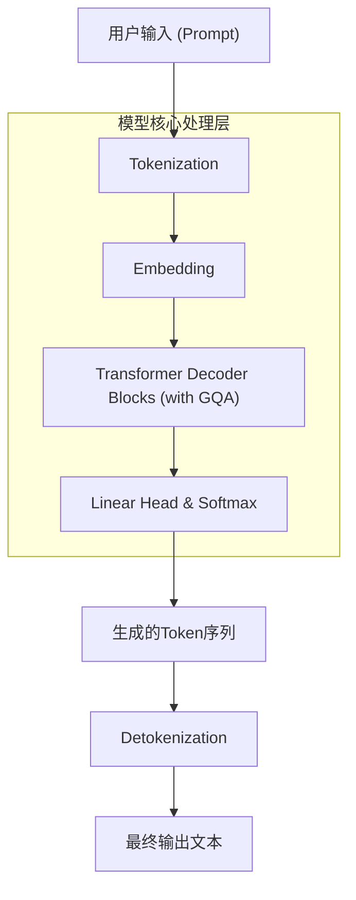
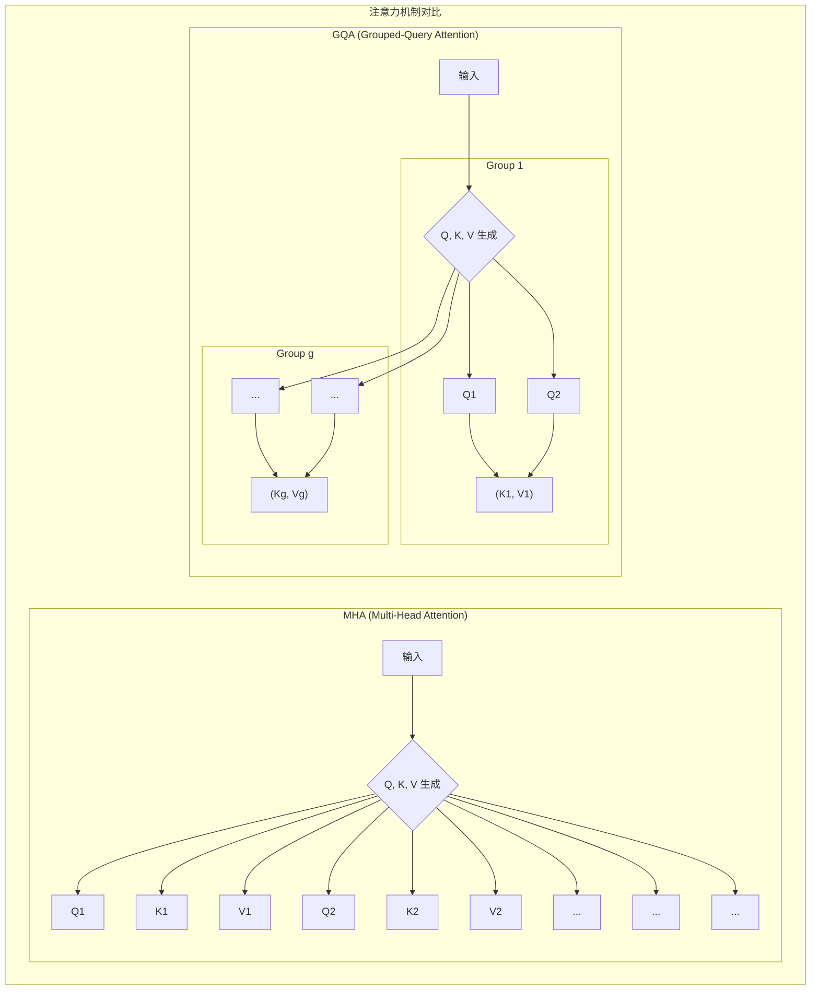

# Qwen 1.5 模型技术文档

## 1. 引言：承前启后的关键一步

Qwen 1.5 是通义千问（Qwen）大语言模型家族在从 Qwen 1 迈向 Qwen 2 的演进道路上，一次至关重要的技术迭代。它并非一次彻底的架构颠覆，而是一次**精准而高效的升级**。Qwen 1.5 继承了 Qwen 1 稳定且强大的基座模型能力，并前瞻性地引入了 **分组查询注意力（Grouped-Query Attention, GQA）** 这一核心优化，旨在大幅提升模型的推理效率，为后续更大规模、更长上下文窗口的模型铺平了道路。

可以把 Qwen 1.5 理解为 Qwen 家族的“**性能优化版**”或“**效率先锋**”。它验证了一条关键的技术路线：在几乎不牺牲模型性能的前提下，显著降低推理成本（特别是显存占用），从而让更大、更强的模型变得更加实用和普惠。

**核心定位**：
*   **继承与发展**：完美继承 Qwen 1 的双语核心、全面能力和对话格式。
*   **效率革新**：首次引入 GQA，将推理效率提升到新的高度。
*   **承前启后**：作为从 `MHA` (Multi-Head Attention) 到 `GQA` 的技术探路者，为 Qwen 2 的全面升级奠定了坚实的工程基础。

> **注意**：本篇文档旨在深入解析 Qwen 1.5 的技术架构。由于官方并未发布专门针对 Qwen 1.5 的独立技术报告，本文内容是基于对 Qwen 1 架构的理解、Qwen 2/3 技术报告的追溯，以及 `context7` 提供的公开信息进行的综合分析和重构。

## 2. 宏观架构：依然是稳定高效的Decoder-Only

在宏观层面，Qwen 1.5 继续沿用 Qwen 1 成熟且高效的 **Decoder-Only (仅解码器)** 架构。这一架构已被业界广泛证明是文本生成任务的最优解。

其顶层工作流程与 Qwen 1 基本一致：
1.  **Tokenization**：使用与 Qwen 1 兼容的高效多语言 Tokenizer。
2.  **Embedding**：将 Tokens 映射为高维语义向量。
3.  **Transformer Decoder Blocks**：这是 Qwen 1.5 发生核心变化的地方。信息流经的解码器堆栈中，标准的 **Multi-Head Attention (MHA) 被替换为了 Grouped-Query Attention (GQA)**。
4.  **Linear Head & Softmax**：计算下一个 Token 的生成概率。
5.  **Detokenization**：将生成的 Token 序列转换回文本。

## 3. 微观架构：从 MHA 到 GQA 的进化

让我们深入 Transformer 解码器模块的内部，聚焦于 Qwen 1.5 的核心创新——GQA。

### 3.1. 基础组件（继承自 Qwen 1）

Qwen 1.5 的解码器模块依然构建在 Qwen 1 那套坚实、高效的组件之上：
*   **RMSNorm (Root Mean Square Normalization)**：用于预归一化，计算速度快，性能稳定。
*   **RoPE (Rotary Position Embedding)**：用于注入相对位置信息，具有优秀的长度外推能力。
*   **SwiGLU FFN (Feed-Forward Network)**：带有门控线性单元的前馈网络，拥有更强的非线性表达能力。

### 3.2. 核心变革：GQA (Grouped-Query Attention)

在 Qwen 1 中，注意力机制采用的是标准的多头注意力（MHA）。MHA 的特点是每个“头”都拥有一套独立的 Query (Q)、Key (K) 和 Value (V) 权重。这意味着，如果有 `h` 个头，就需要计算和存储 `h` 组 K 和 V。在模型推理（尤其是处理长序列）时，这些 K 和 V 的缓存（KV Cache）会占用大量显存。

**GQA 的提出，旨在找到一个介于 MHA 和 MQA (Multi-Query Attention，所有头共享同一组 K/V) 之间的完美平衡。**

#### GQA 工作原理

GQA 的核心思想是**分组**：将 Query 头分成`g`个组，**同一组内的所有 Query 头共享同一组 Key 和 Value 头**。

*   **MHA**：`h` 个 Query 头，`h` 个 Key 头，`h` 个 Value 头。 (h=h, g=h)
*   **GQA**：`h` 个 Query 头，`g` 个 Key 头，`g` 个 Value 头。 (1 < g < h)
*   **MQA**：`h` 个 Query 头，`1` 个 Key 头，`1` 个 Value 头。 (g=1)

#### MHA vs GQA 对比图

**图解**：
*   在 **MHA** 中，每个 Q 头（如 `Q1`, `Q2`）都有自己独立的 K/V 对（`K1/V1`, `K2/V2`）。
*   在 **GQA** 中，多个 Q 头（如 `Q1`, `Q2`）被分到同一个组（Group 1），它们共同使用同一对 K/V（`K1/V1`）。

## 4. 关键技术实现：推理效率的飞跃

引入 GQA 的最大动机，就是为了**优化推理性能**，特别是在处理长上下文和进行大规模部署时。

### a. 显著降低 KV Cache 显存占用

在自回归生成过程中，模型需要缓存之前所有 Token 的 Key 和 Value，即 **KV Cache**。其大小与 `序列长度 × K/V头的数量 × 头的维度` 成正比。

*   对于 MHA，K/V 头的数量等于总头数 `h`。
*   对于 GQA，K/V 头的数量等于分组数 `g`。

由于 `g` 远小于 `h`，GQA 极大地减小了 KV Cache 的体积。这意味着：
1.  **支持更长的上下文**：在同等显存条件下，Qwen 1.5 可以处理比 Qwen 1 更长的文本序列。
2.  **提高吞吐量**：在推理服务器上，更小的显存占用意味着可以并行处理更多的请求（更大的 Batch Size），从而大幅提升服务吞吐量。

### b. 保持高质量的模型性能

GQA 不仅仅是 MQA 的简单扩展，它通过“分组”的方式，在模型的表达能力和计算效率之间取得了巧妙的平衡。大量的研究和实践（包括在 Qwen 家族中的应用）表明，从 MHA 切换到 GQA，模型的性能损失微乎其微，但带来的工程优势是巨大的。这使得 GQA 成为现代 LLM 架构设计的“新宠”。

### c. Tokenizer 和 ChatML

Qwen 1.5 在这两方面完全继承了 Qwen 1 的设计，确保了模型的兼容性和对话能力的延续。
*   **Tokenizer**: 继续使用高效的多语言 BPE Tokenizer，对中英文及代码有良好的编码效率。
*   **ChatML**: 依然采用 `<|im_start|>` 和 `<|im_end|>` 这种清晰、结构化的对话格式，保证了模型在指令遵循和多轮交互中的优秀表现。

## 5. 总结：迈向未来的坚实跳板

**Qwen 1.5** 扮演了通义千问家族技术演进中一个不可或缺的角色。它在继承 Qwen 1 成熟架构的基础上，勇敢地引入了 **GQA** 这一关键优化，成功地验证了在 LLM 上实现“高质量与高效率兼得”的技术路径。

*   **实践出真知**：GQA 的引入，不再是一个理论上的探讨，而是一次成功的工程落地。它为 Qwen 后续模型（Qwen 2, Qwen 3）全面采用 GQA，并进一步支持超长上下文窗口（如 32K, 64K 甚至更长）扫清了障碍。
*   **效率的胜利**：在AI应用落地的今天，推理成本是决定技术能否被广泛应用的关键。Qwen 1.5 在这方面做出的探索，展示了 Qwen 团队对工程极限的追求。

总而言之，Qwen 1.5 不仅是 Qwen 1 的一个简单升级，更是 Qwen 技术理念的一次重要进化。它像一块坚实的跳板，帮助整个 Qwen 系列顺利地跃入了追求极致效率和更强性能的新阶段。