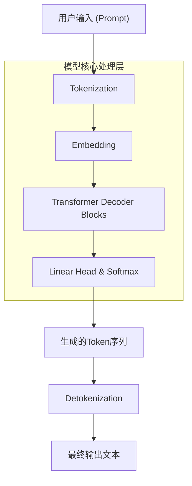
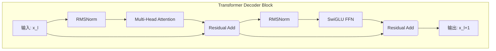
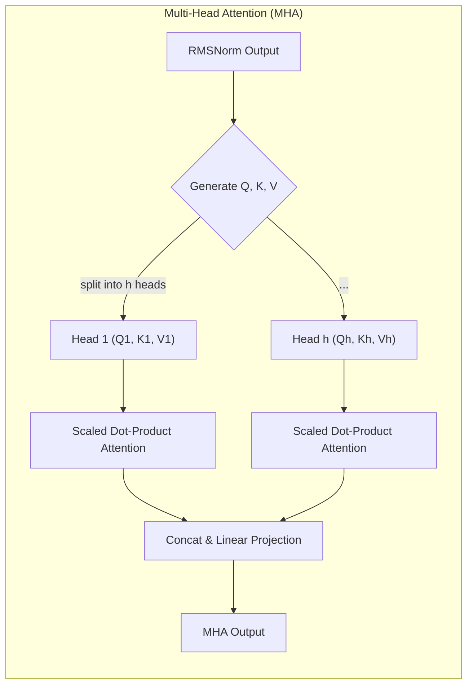

# Qwen 1 模型技术文档

## 1. 引言：揭开通义千问的序幕

Qwen（“通义千问”）是由阿里巴巴达摩院研发的先进大语言模型（LLM）系列。作为该系列的开山之作，**Qwen 1** 不仅仅是一个模型，更是阿里在通用人工智能领域探索的起点和基石。它被设计为一个强大的、支持多语言（尤其是中文和英文）的基座模型，旨在为广泛的应用场景提供坚实的自然语言理解和生成能力。

Qwen 1 的发布，标志着一个具备卓越性能、同时深度优化中文处理能力的LLM的诞生。它不仅在标准的语言建模任务上表现出色，还在代码理解、数学推理和常识问答等多个维度上展现了其潜力，为后续更强大的Qwen模型家族（如Qwen 1.5, Qwen 2）的演进奠定了坚实的技术基础。

**核心定位**：
*   **双语核心**：生来就具备强大的中英文处理能力。
*   **能力全面**：兼顾语言、代码、推理等多种核心AI能力。
*   **对话优化**：通过专门的对话格式（ChatML），为指令遵循和多轮交互提供原生支持。

> **注意**：本篇文档旨在深入解析 Qwen 1 的技术架构。由于官方并未发布专门针对 Qwen 1 的详尽技术报告，本文的许多微观架构细节是基于其后续版本（Qwen 2/3）的技术文档、开源社区的分析以及当时（2023年）业界最前沿的LLM架构（如Llama系列）进行推断和重构的。我们会明确指出哪些是基于公开确认的事实，哪些是基于行业实践的合理推断。

## 2. 宏观架构：简洁而强大的Decoder-Only设计

从宏观上看，Qwen 1 采用了目前主流且最高效的 **Decoder-Only（仅解码器）** 架构。这种架构源自经典的Transformer模型，但舍弃了编码器（Encoder）部分，使其更专注于文本生成任务。

这种设计的核心思想是：模型接收一段文本（称为提示/Prompt），然后通过自回归（Auto-regressive）的方式，一次一个token地预测后续内容，从而“生成”完整的回答。

### 2.1. 顶层工作流程

以下是Qwen 1处理请求的简化流程图，展示了数据从输入到输出的完整旅程。



**流程解读**：
1.  **Tokenization（分词）**：将输入的文本字符串切分成模型能够理解的最小单元（Tokens）。Qwen的Tokenizer经过特殊优化，能高效处理中英文混合文本和代码。
2.  **Embedding（嵌入）**：将每个Token映射到一个高维度的向量（Vector），这个向量包含了Token的语义信息。
3.  **Transformer Decoder Blocks（解码器堆栈）**：这是模型的核心。输入向量会流经数十个串联的解码器层。每一层都会通过自注意力机制和前馈网络对信息进行深度加工和提炼。
4.  **Linear Head & Softmax（线性头与Softmax）**：在最后一个解码器层之后，一个线性变换层将处理后的向量映射到整个词汇表的维度上，然后通过Softmax函数计算出每个Token成为下一个Token的概率。
5.  **Detokenization（反分词）**：将模型生成的高概率Token序列重新组合成人类可读的文本字符串。

## 3. 微观架构：深入Transformer解码器内部

现在，我们“掰开了、揉碎了”去看Qwen 1的“发动机”——单个Transformer解码器模块（Decoder Block）。我们推断，Qwen 1采用了当时业界公认的最佳实践组合，以实现性能和效率的平衡。

### 3.1. Transformer Decoder Block 结构图



这个图展示了一个清晰的“**预归一化（Pre-Normalization）**”结构。输入向量`x_l`进入第`l`层，首先经过归一化处理，然后才进入核心的计算模块（自注意力和前馈网络）。这种结构被证明比“后归一化”更容易训练，也更稳定。

### 3.2. 核心组件详解

#### a. RMSNorm (Root Mean Square Normalization)

在每个注意力层和前馈网络层之前，Qwen 1使用 **RMSNorm** 而不是传统的LayerNorm。

*   **工作原理**：RMSNorm简化了LayerNorm，它只对输入向量进行均方根缩放，移除了重新中心化的步骤（即减去均值）。公式为：`output = (x / sqrt(mean(x^2) + epsilon)) * gain`。
*   **设计动机**：
    *   **计算效率**：相比LayerNorm，减少了约25%-40%的计算量，因为省去了计算均值的开销。
    *   **性能相当**：大量实验证明，在Transformer架构中，RMSNorm的性能与LayerNorm相当，甚至在某些情况下略优。

#### b. RoPE (Rotary Position Embedding)

为了让模型理解Token在序列中的位置关系，Qwen 1采用了 **旋转位置编码（RoPE）**。

*   **工作原理**：RoPE不同于将位置信息直接“加”到Token嵌入中的传统方法。它通过一种非常巧妙的方式将位置信息“乘”入其中。具体来说，它在计算自注意力时，对Query和Key向量应用一个与位置相关的旋转矩阵。
*   **设计动机**：
    *   **相对位置感知**：RoPE能够自然地表达Token之间的相对位置关系，这对于语言理解至关重要。
    *   **外推能力强**：相比绝对位置编码，RoPE在处理超出预训练长度的序列时表现更好，具有很好的长度外推性，这对于支持长文本至关重要。

#### c. Multi-Head Attention (MHA) 机制图

这是模型从上下文中提取信息的关键。MHA允模型同时关注来自不同“表示子空间”的信息。


*   **流程**：输入向量被线性变换三次，分别得到Query (Q), Key (K), Value (V)向量。然后，这些向量被分割成多个“头”（`h`个）。每个头独立执行**缩放点积注意力**（`Softmax((Q * K^T) / sqrt(d_k)) * V`），最后将所有头的输出拼接起来，再通过一个线性层进行融合。

#### d. SwiGLU FFN (Feed-Forward Network)

在注意力层之后，信息会流经一个前馈网络（FFN），它负责对信息进行非线性变换和深度加工。Qwen 1采用了带有**SwiGLU**激活函数的FFN。

*   **工作原理**：传统的FFN通常使用ReLU激活函数。SwiGLU引入了一个门控机制。它包含三个线性变换层，而不是两个。其计算公式为： `FFN(x, W, V, W2) = (Swish(xW) * xV) * W2`，其中Swish(x) = `x * sigmoid(x)`。
*   **设计动机**：
    *   **更强的表达能力**：GLU（Gated Linear Unit）的变体被证明比标准ReLU能提供更丰富的非线性表达，门控机制允许网络动态地控制信息流，从而提升模型质量。
    *   **业界标配**：从PaLM到Llama，几乎所有顶级的LLM都采用了GLU的变体，它已成为提升模型性能的“标配”。


## 4. 关键技术实现

除了底层的架构组件，Qwen 1还有几个上层的关键技术实现，共同定义了其强大的能力。

### a. 高效的多语言Tokenizer

Tokenizer是模型与现实世界文本之间的桥梁。Qwen 1的Tokenizer具有以下特点：
*   **基于BPE**：我们推断它采用了字节对编码（Byte-Pair Encoding, BPE）算法，这是一种在压缩率和词汇表大小之间取得良好平衡的流行算法。
*   **大规模词汇表**：为了同时高效地表示中文、英文和各种编程语言，Qwen 1拥有一个非常大的词汇表（可能超过15万），远超许多以英文为主的模型。这使得它在处理中文时能用更少的Token表示相同的信息，提升了效率。

### b. 为对话而生的ChatML格式

从`context7`获取的文档中可以确认，Qwen系列模型统一使用一种名为**ChatML (Chat Markup Language)**的格式来组织对话数据。

一个典型的ChatML示例如下：
```
<|im_start|>system
You are a helpful assistant.
<|im_end|>
<|im_start|>user
你好，介绍一下你自己。
<|im_end|>
<|im_start|>assistant
你好！我是通义千问，一个由阿里巴巴达摩院开发的人工智能助手。
<|im_end|>
```

*   **`<|im_start|>` 和 `<|im_end|>`**：这是特殊的控制Token，用来明确标识一轮对话的开始和结束。
*   **`system`, `user`, `assistant`**：这些标识符定义了消息的角色。
    *   `system`: 用于设定模型的身份、行为准则或提供全局指令。
    *   `user`: 代表用户的输入。
    *   `assistant`: 代表模型的输出。

这种结构化的对话格式，使得Qwen 1能够清晰地理解对话历史和上下文，从而在多轮对话中更好地遵循指令，保持角色一致性。

## 5. 总结与技术演进

**Qwen 1** 作为通义千问家族的奠基者，其技术选型展现了深刻的洞察力和前瞻性。它并没有盲目堆砌全新的、未经验证的模块，而是聪明地组合了当时已被证明最高效、最稳定的架构组件：

*   **坚实的基础**：以 **RMSNorm + RoPE + SwiGLU** 构成的Transformer解码器，为模型提供了强大的基本能力。
*   **双语的基因**：通过精心设计的 **Tokenizer** 和海量的双语预训练数据，从一开始就确立了在中英文处理上的领先地位。
*   **对话的直觉**：原生支持 **ChatML** 格式，使其天生就擅长交互式应用。

这条技术路线被证明是极其成功的。后续的Qwen模型家族，如 **Qwen 1.5**、**Qwen 2** 和 **Qwen 3**，都在Qwen 1的基础上进行了迭代和创新：

*   **注意力机制优化**：后续版本引入了**GQA (Grouped-Query Attention)**，在保持高质量的同时，大幅降低了推理时的显存占用和计算开销。
*   **更长的上下文**：得益于RoPE等技术的优秀外推能力，后续版本支持了更长的上下文窗口（从8K扩展到32K甚至更长）。
*   **模型架构探索**：在更大参数的模型变体中，可能探索了**MoE (Mixture of Experts)** 架构，以更高效的方式扩展模型规模。

总而言之，Qwen 1不仅是一个强大的模型，更是一次成功的技术范式验证。它为整个Qwen系列设定了高质量的起点，其核心设计理念和技术选型在后续版本中不断被继承和发扬光大。