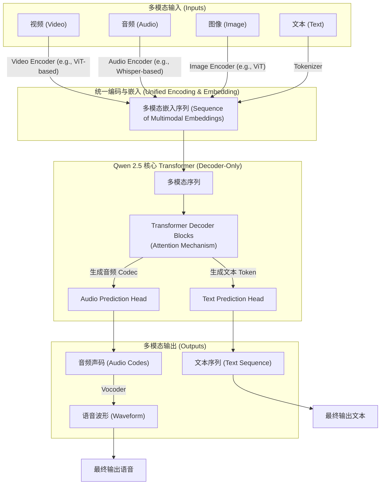
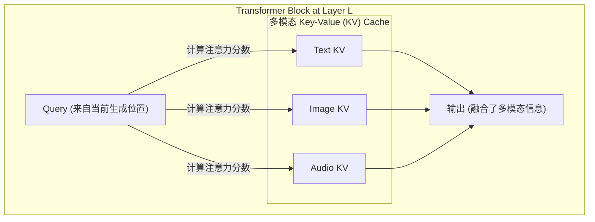

# Qwen 2.5 模型技术文档：走向原生多模态的终极形态

## 1. 引言：从语言智能到感官融合的革命

Qwen 2.5 不再是 Qwen 家族的线性迭代，而是一次**范式级的跃迁**。它标志着通义千问系列正式从一个卓越的**大语言模型 (LLM)** 迈向一个无缝融合文本、视觉、音频等多重感官能力的**原生多模态大模型 (LMM)**。Qwen 2.5 的核心定位是**“万物皆可输入，自然交互生成”**，旨在打造一个能听、能看、能说、能理解、能创作的“全能型” AI 助理。

相较于在长文本和代码领域建立标杆的 Qwen 2，Qwen 2.5 的战场扩展到了一个全新的维度：**现实世界的复杂交互**。它不仅要理解代码的逻辑、文章的语义，更要能解析视频中的场景动态、听懂语音中的微妙情感，并以同样自然的方式生成连贯的文本和逼真的语音。

**核心定位**：
*   **原生多模态 (Natively Multimodal)**：并非多个单模态模型的简单拼接，而是在架构层面实现了对不同模态信息的深度融合与统一处理。
*   **端到端一体化**：实现了从多模态输入理解到多模态（文本+语音）输出的端到端生成，无需依赖外部独立的语音识别 (ASR) 或语音合成 (TTS) 系统。
*   **感官协同理解**：能够处理视频、音频、图像和文本的任意组合，实现跨模态的联合推理与内容生成。
*   **开发者友好**：通过 `transformers` 库和 OpenAI 兼容的 API，极大地简化了开发者构建复杂多模态应用的流程。

> **注意**：本篇文档是基于 Qwen 团队发布的官方 `GitHub` 仓库 (`qwenlm/qwen2.5-omni`) 和相关技术报告 (`arXiv:2503.20215`) 的公开信息进行的综合分析和重构，旨在提供一份深入浅出的技术解读。关于部分底层实现细节，在官方文档未详尽披露的情况下，本文将结合业界主流技术进行合理分析。

## 2. 宏观架构：统一的多模态生成框架

Qwen 2.5 的宏观架构选择了一条更具挑战性但潜力也更大的道路：构建一个**统一的、端到端的多模态生成模型**。其核心依然是强大的 **Decoder-Only Transformer**，但其输入和输出两端都进行了革命性的扩展。



其顶层工作流程的核心变化在于：
1.  **多模态编码器 (Multimodal Encoders)**：模型为不同的非文本模态配备了专门的编码器。
    *   **视觉 (图像/视频)**：极有可能采用类似 **Vision Transformer (ViT)** 的架构，将图像或视频帧分割成块 (Patches)，然后将其转换为一系列的嵌入向量。
    *   **音频**：可能借鉴了 **Whisper** 等模型的编码器设计，使用卷积层和 Transformer Block 来处理音频频谱图，并提取其声学特征。
2.  **统一表示空间 (Unified Representation Space)**：所有模态（文本、视觉、音频）的输入，在经过各自的编码器处理后，都会被**投影 (Projected)** 到一个统一的、与语言模型兼容的嵌入空间中。这使得来自不同感官的信息能够被核心 Transformer 一视同仁地处理。
3.  **核心解码器 (Core Decoder)**：继承自 Qwen 2 的强大 Transformer 解码器，但在其基础上进行了扩展，使其不仅能预测下一个文本 Token，还能预测下一个**音频单元 (Audio Unit)**。
4.  **双重预测头 (Dual Prediction Heads)**：在解码器的顶部，存在至少两个并行的预测头：
    *   **文本预测头**：用于生成文本内容，与传统 LLM 类似。
    *   **音频预测头**：用于生成代表声音的离散单元（类似于音频编解码器的 token），这是实现端到端语音生成的关键。
5.  **声码器 (Vocoder)**：音频预测头生成的离散单元，会经过一个高效的声码器模块，最终被合成为平滑、自然的语音波形。

## 3. 微观实现：多模态融合的艺术

深入模型内部，Qwen 2.5 的技术精髓在于它如何巧妙地让不同模态的信息相互“对话”与“融合”。

### 3.1. 输入处理：`Qwen2_5OmniProcessor` 的魔法

从开发者的角度看，这一切的复杂性都被 `Qwen2_5OmniProcessor` 优雅地封装了。这个处理器是多模态输入的“总调度师”，其核心职责包括：
*   **格式统一**：无论是本地文件路径、URL 还是 Base64 字符串，它都能自动识别和加载。
*   **预处理**：对图像和视频进行缩放、归一化；对音频进行重采样和特征提取。
*   **序列构建**：将文本、处理后的图像/音频嵌入，按照用户定义的顺序，智能地拼接成一个统一的输入序列，并插入特殊的分隔符 `<|image|>`, `<|audio|>` 等，以告知模型不同模态信息的位置。

```python
# 开发者视角：一个简单的 API 调用
inputs = processor(
    text="描述一下视频和音频", 
    audio="/path/to/sound.wav", 
    images=["/path/to/img.jpg"], 
    videos=["/path/to/vid.mp4"],
    return_tensors="pt"
)
# 背后，processor 已经完成了所有模态的编码、对齐和序列化
```
### 3.2. 核心架构猜测：基于 GQA 的多模态注意力

虽然官方未明确，但我们可以合理推断 Qwen 2.5 的核心 Transformer 依然沿用了 Qwen 2 中经过验证的高效组件：
*   **Grouped-Query Attention (GQA)**：作为 Qwen 家族的标志性技术，GQA 在降低 KV Cache 显存占用和提升推理吞吐量方面优势显著，没有理由在更复杂的多模态模型中被弃用。
*   **RoPE & SwiGLU**: 依然是位置编码和前馈网络的最佳实践。

**多模态融合的关键**可能发生在注意力计算的每一层：当模型在生成下一个 Token 时，它的注意力机制可以**同时关注**到文本嵌入、先前生成的 Token、来自图像的视觉嵌入，以及来自音频的声学嵌入。


**图解**：在每一层的 Transformer Block 中，Query 向量都会与一个包含了所有模态信息的扩展版 KV Cache 进行交互。这使得模型在做出下一个决策时，能够充分权衡来自不同感官的上下文。

### 3.3. 输出生成：文本与语音的协同

Qwen 2.5 的另一大创新是**一体化的文本-语音生成**。
*   `model.generate()` 函数现在可以接受如 `return_audio=True` 和 `speaker="Chelsie"` 等参数。
*   这意味着模型的生成过程是**协同**的：它在构思文本回复的同时，也在规划这段话应该以怎样的韵律、节奏和音色说出来。
*   这与“先生成文本，再送入 TTS 系统”的传统管线式方法有本质区别，后者会导致信息在传递过程中丢失（如情感、强调等），而原生生成则能更好地保持一致性。

## 4. 关键技术实现：从应用看本质

*   **真正的端到端**：用户只需调用一个 `model.generate()` 函数，就能同时得到文本和音频输出。这背后隐藏了文本预测、音频 codec 预测和声码器合成等多个复杂步骤，但对用户完全透明。
*   **灵活的批量处理 (Batching)**：如 `context7` 文档所示，Qwen 2.5 支持对包含不同模态组合的多个请求进行批量推理，这对于构建高吞吐量的多模态服务至关重要。
*   **高效推理部署**：支持 `flash_attention_2`、`vLLM` 等业界领先的加速技术，表明其在设计之初就充分考虑了大规模部署的性能和成本效益。

## 5. 总结：多模态 AI 应用的引爆点

**Qwen 2.5** 是通义千问从“语言”到“世界”的一次决定性跨越。它不仅仅是增加了几个新的感官输入，而是从**架构、理​​念到工程实现**上，对多模态 AI 的一次系统性重构。

*   **架构的统一性**：通过将不同模态编码到统一的表示空间，并使用单一 Transformer 进行联合处理，为更深层次的跨模态推理奠定了基础。
*   **体验的无缝性**：端到端的生成方式，消除了传统多模态系统中的延迟和信息损耗，让 AI 的交互变得前所未有的自然。
*   **开发的便捷性**：高度封装的处理器和与 Hugging Face 生态的紧密集成，使得开发者可以像调用普通 LLM 一样，轻松驾驭这个强大的多模态“巨兽”。

总而言之，Qwen 2.5 不仅是一个在各项基准测试上表现出色的模型，更是一个强大的**“赋能平台”**。它为开发者提供了构建下一代智能应用（如虚拟人、智能座舱、多模态内容创作工具）所需的核心引擎，有望成为引爆多模态 AI 应用生态的那个关键节点。