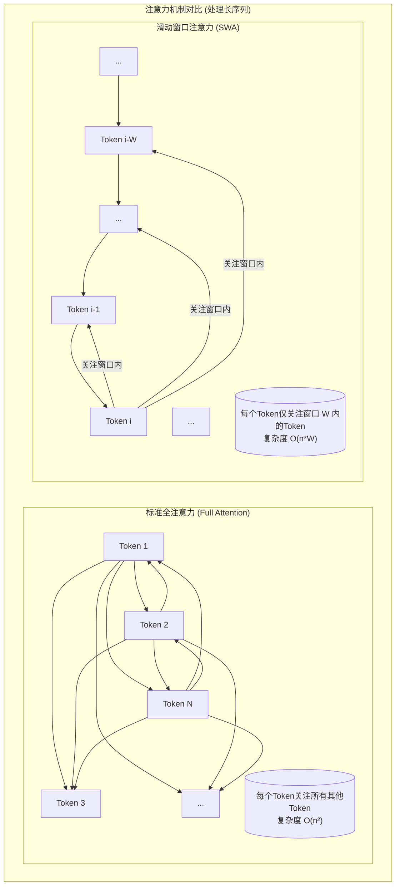

# Qwen 2 模型技术文档

## 1. 引言：新一代开源模型的全面进化

Qwen 2 是通义千问（Qwen）大语言模型家族继 Qwen 1.5 之后，一次**全面、标志性的进化**。它不再仅仅是某个单一维度的优化，而是在模型架构、训练数据、上下文长度支持和整体性能上的一次**巨大飞跃**。Qwen 2 被设计为新一代的开源模型标杆，旨在为学术界和工业界提供更强大、更高效、更全面的基础模型。

相较于作为“效率先锋”的 Qwen 1.5，Qwen 2 的核心定位是**性能的王者**与**能力的标杆**。它不仅巩固了在 GQA 上的效率优势，更将技术边界拓展到了超长上下文处理、深度多语言理解和复杂的代码生成等前沿领域。

**核心定位**：
*   **性能飞跃**：在各大基准测试中（尤其是多语言和代码能力）树立了新的 SOTA（State-of-the-Art）标准。
*   **架构革新**：首次将**滑动窗口注意力 (Sliding Window Attention, SWA)** 与 GQA 结合，原生支持超长上下文（如 32K，甚至通过微调达到 128K）。
*   **规模与普惠**：发布了从 0.5B 到 72B 的多个尺寸的模型，覆盖了从端侧到云端的全场景需求。
*   **开放与安全**：在提供强大能力的同时，高度重视模型的对齐和安全，确保其能被负责任地应用。

> **注意**：本篇文档是基于 Qwen 团队发布的官方技术报告 (`arXiv:2407.10671`) 以及 `context7` 提供的公开信息进行的综合分析和重构，旨在提供一份深入浅出的技术解读。

## 2. 宏观架构：稳定之上，规模与深度的拓展

在宏观层面，Qwen 2 依然坚守着业界公认最高效的 **Decoder-Only (仅解码器)** 架构。然而，在这一稳定框架之下，其内部的规模和复杂性都实现了质的提升。


其顶层工作流程的核心变化在于：
1.  **大规模预训练**：使用了高达 7T tokens 的高质量、多源数据进行训练，数据质量和多样性远超前代。
2.  **Tokenizer**：词表从 Qwen 1.5 的 152K 进一步扩展，以更好地支持**多种新语言**和**编程语言**，提升了编码效率。
3.  **Transformer Decoder Blocks**：这是 Qwen 2 架构创新的核心。在继承 GQA 的基础上，引入了**滑动窗口注意力 (SWA)**，从根本上解决了处理超长序列时的计算瓶颈。
4.  **模型规模**：发布了包括 0.5B, 1.5B, 7B, 57B (MoE), 72B 在内的多个版本，满足不同场景的性能和成本需求。

## 3. 微观架构：GQA 与 SWA 的珠联璧合

深入解码器模块内部，Qwen 2 将两种强大的注意力机制进行了完美融合，实现了效率和长上下文能力的兼得。

### 3.1. 基础组件（继承与优化）

Qwen 2 依然构建在经过验证的高效组件之上：
*   **RMSNorm**: 用于预归一化，性能稳定。
*   **RoPE (Rotary Position Embedding)**: 依然是注入位置信息的首选方案。
*   **SwiGLU FFN**: 强大的前馈网络，提供优秀的非线性表达能力。
*   **Grouped-Query Attention (GQA)**: 继承自 Qwen 1.5，作为降低 KV Cache 显存占用、提升推理吞吐量的关键技术，已成为 Qwen 家族的标配。

### 3.2. 核心变革：滑动窗口注意力 (SWA)

当上下文长度变得非常长（例如超过 32K）时，即使是 GQA，其 KV Cache 的大小和计算量依然是巨大的挑战。标准的自注意力机制要求每个 Token 都要关注序列中的所有其他 Token，计算复杂度为 `O(n²)`，n为序列长度。

**滑动窗口注意力 (SWA) 的出现，就是为了打破这个二次方瓶颈。**

#### SWA 工作原理

SWA 的核心思想是**局部关注**：对于序列中的任何一个 Token，它不再需要与序列中所有的 Token 计算注意力分数，而**只需关注其左侧一个固定大小窗口（Window Size, W）内的 Token**。



**图解**：
*   在 **Full Attention** 中，序列中的每个 Token 都要和包括自身在内的所有 `N` 个 Token 进行计算。
*   在 **SWA** 中，`Token i` 只与它之前的 `W` 个 Token（从 `Token i-W` 到 `Token i-1`）计算注意力。

### 3.3. GQA + SWA 的协同效应

Qwen 2 将 GQA 和 SWA 巧妙地结合起来：
*   **GQA 负责“瘦身”**：它减少了 K/V 头的数量，从而降低了每个 Token 对应的 KV Cache 的“厚度”。
*   **SWA 负责“缩短”**：它限制了注意力计算的“长度”，将 `O(n²)` 的计算复杂度降低到近似线性的 `O(n*W)`。

这种组合使得 Qwen 2 在处理极长上下文时，无论是显存占用还是计算延迟，都得到了惊人的优化，从而原生支持了 32K 乃至更长的上下文窗口。

## 4. 关键技术实现：性能的全面超越

Qwen 2 的强大不仅仅体现在架构上，更体现在一系列关键技术的落地和优化上。

### a. 卓越的多语言和代码能力

*   **扩展的词表**：新的 Tokenizer 增加了对多种语言（如越南语、泰语等）和编程语言（如 Julia, R）的支持，从源头上提升了模型的理解和生成能力。
*   **高质量数据**：在 7T 的预训练数据中，包含了大量高质量的多语言语料和代码数据，使得 Qwen 2 在相关的基准测试（如 HumanEval, NaturalCodeBench, MMLU, GPQA）上取得了开源模型的领先水平。

### b. 领先的模型对齐技术

为了让模型更好地理解和遵循人类指令，并确保其输出内容的安全、无害，Qwen 2 采用了一套先进的模型对齐策略：
*   **指令遵循微调 (SFT)**：使用了大量高质量的指令数据对模型进行微调。
*   **人类偏好对齐 (DPO)**：有别于传统的基于强化学习的 RLHF，Qwen 2 采用了**直接偏好优化 (Direct Preference Optimization, DPO)**。DPO 是一种更稳定、更高效的对齐方法，它直接利用偏好数据（即对于同一个 prompt，哪个回答更好）来优化模型策略，避免了 RLHF 中需要训练奖励模型的复杂过程。

### c. ChatML 对话模板

Qwen 2 依然沿用并完善了 ChatML 对话格式。这种结构化的格式对于提升模型在多轮对话、工具使用（Function Calling）和角色扮演等复杂场景下的表现至关重要。

```
<|im_start|>system
You are a helpful assistant.
<|im_end|>
<|im_start|>user
你好，给我介绍一下 Qwen 2。
<|im_end|>
<|im_start|>assistant
Qwen 2 是...
<|im_end|>
```

## 5. 总结：开源大模型时代的性能新标杆

**Qwen 2** 不再是 Qwen 1.5 的简单延续，而是一次**脱胎换骨的全面升级**。它通过在**架构（GQA + SWA）、数据和对齐技术**上的多重创新，成功地将开源大模型的性能推向了一个新的高度。

*   **长文本处理的成熟方案**：通过 GQA+SWA 的组合，Qwen 2 为业界处理超长上下文提供了一个经过大规模验证的、高效的成熟方案。
*   **全能型选手的诞生**：在保持优秀中文能力的基础上，Qwen 2 在多语言和代码这两大关键领域取得了突破性进展，成为一个真正的“全能型”基础模型。
*   **开源生态的推动者**：从 0.5B 到 72B 的全系列模型，覆盖了从研究、开发到部署的全链路需求，极大地推动了 AI 技术的普及和应用创新。

总而言之，Qwen 2 凭借其卓越的性能、创新的架构和开放的姿态，为整个开源社区树立了一个新的标杆，标志着大语言模型技术进入了一个更高性能、更长文本和更强能力的全新阶段。