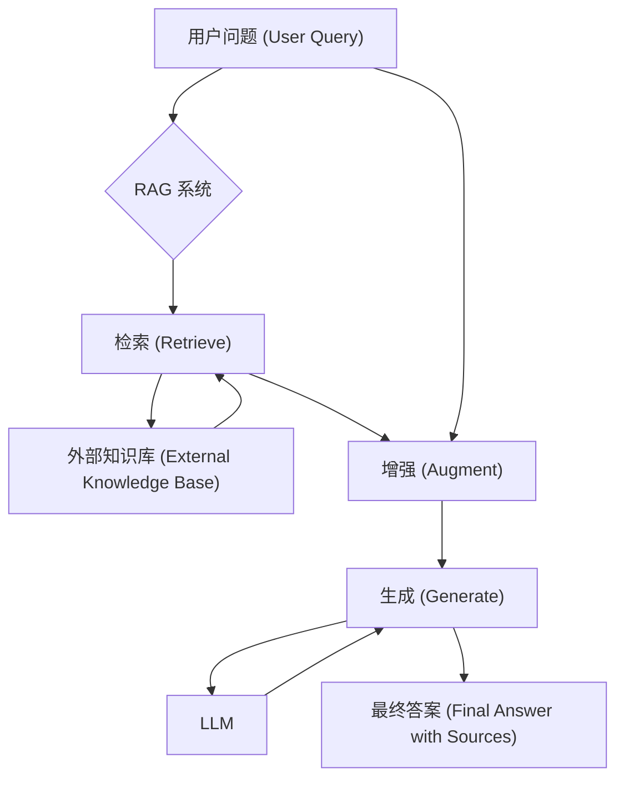
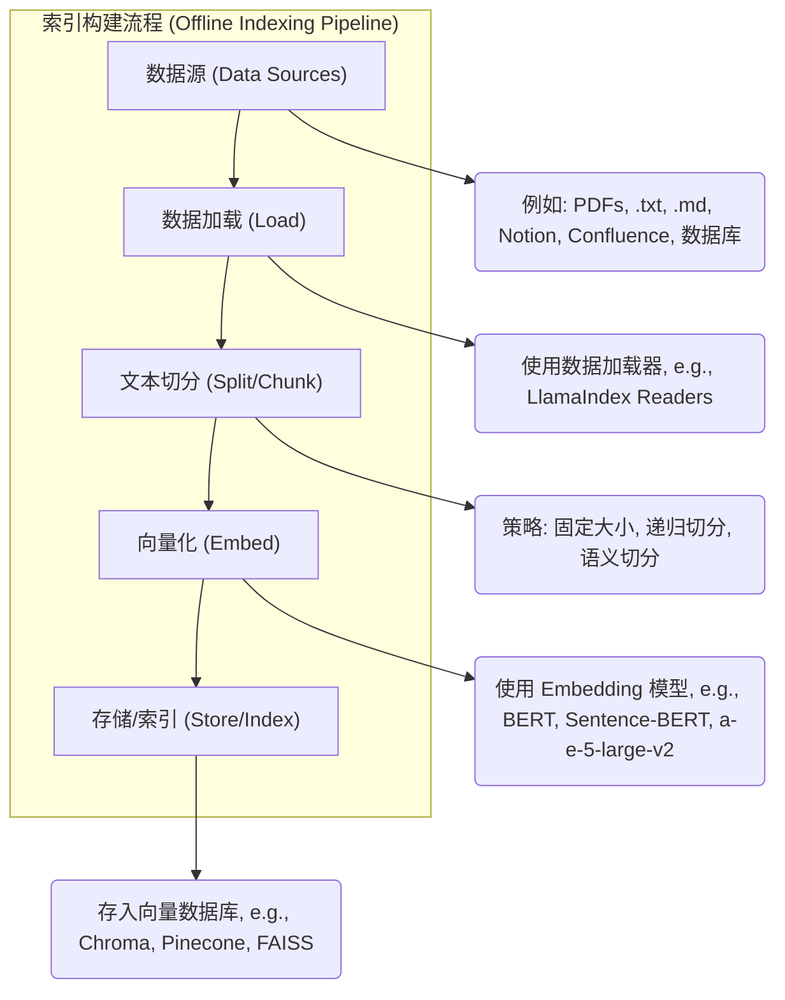
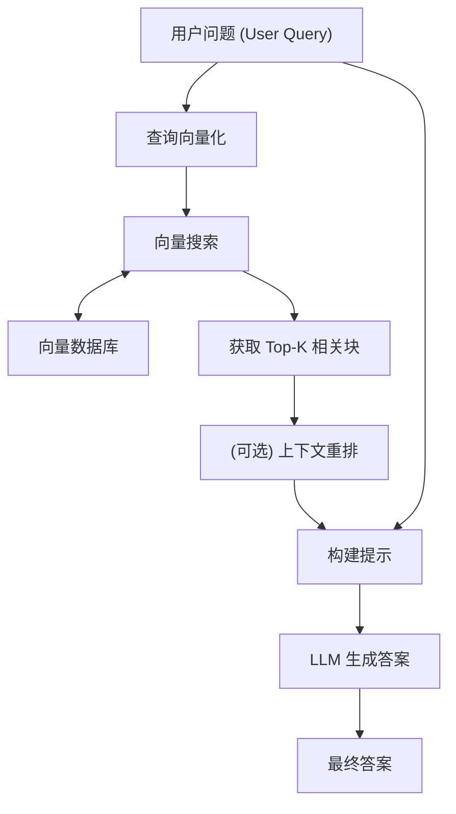
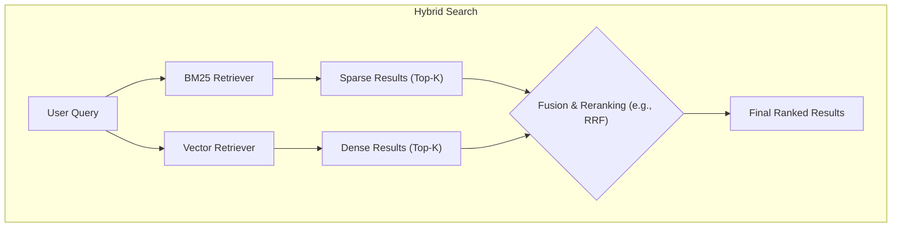
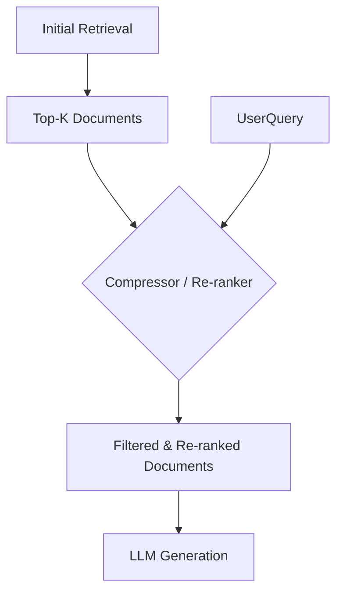
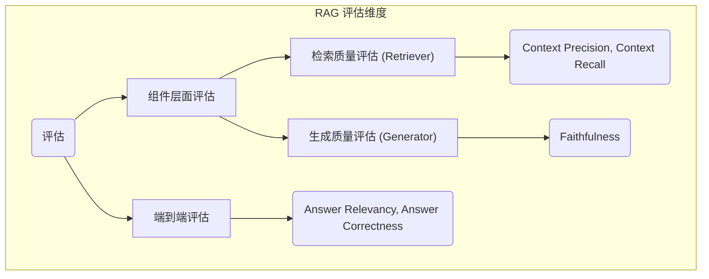

# RAG (Retrieval-Augmented Generation) 深度解析技术文档

## 1. 宏观概述：为什么需要 RAG？

### 1.1 什么是 RAG？

RAG，全称 Retrieval-Augmented Generation，即“检索增强生成”。它是一种将外部知识库的信息检索与大型语言模型（LLM）的强大生成能力相结合的技术框架。简单来说，当用户提出问题时，RAG 系统首先会从一个庞大的、可实时更新的知识库（如公司的内部文档、产品手册、最新的网络资讯等）中检索出最相关的信息片段，然后将这些信息连同原始问题一起“喂”给语言模型，让模型基于这些精准的、实时的上下文来生成答案。

如果用一个比喻来解释：想象一位开卷考试的学生。这位学生（LLM）本身已经学了很多知识（预训练数据），但在回答非常具体或涉及最新知识点的题目时，他可以翻阅参考书（外部知识库）。RAG 就是这个“开卷”的过程，它让 LLM 在回答问题时，能够查阅最新的、最权威的资料，从而给出更准确、更全面的答案。

### 1.2 RAG的核心价值：解决LLM的固有缺陷

大型语言模型虽然强大，但其本身存在一些固有缺陷，而 RAG 正是解决这些痛点的关键技术。

**痛点一：知识的静态性 (Knowledge Cut-off)**

LLM 的知识被冻结在其最后一次训练的时间点。例如，一个在 2023 年初完成训练的模型，无法回答任何关于那之后发生事件的问题。RAG 通过引入一个可以随时更新的外部知识库，彻底解决了这个问题。企业可以将最新的产品信息、财报、市场动态等实时更新到知识库中，RAG 系统能够立即利用这些新知识来回答问题。

**痛点二：模型幻觉 (Hallucination)**

当 LLM 遇到其知识范围内不存在或不确定的问题时，它有时会“一本正经地胡说八道”，即编造事实，产生所谓的“幻觉”。RAG 通过提供明确的、基于事实的参考资料，极大地约束了模型的输出。模型被要求在检索到的上下文基础上进行回答，这就像给它划定了答题范围，从而显著降低了幻觉出现的概率。

**痛点三：缺乏领域专业知识 (Lack of Domain-Specific Knowledge)**

通用的 LLM 在处理特定行业或企业的专业问题时，往往表现不佳。例如，它不了解某公司的内部流程、特定产品的技术规格等。通过 RAG，企业可以构建一个包含内部规章制度、技术文档、客户支持记录等信息的专业知识库。这相当于为 LLM 配备了一位领域专家顾问，使其能够胜任高度专业化的问答任务。

**痛点四：透明度与可解释性差 (Lack of Transparency & Interpretability)**

传统 LLM 的回答过程是一个“黑箱”，我们无法知道它是依据什么信息得出结论的。这在金融、医疗、法律等需要高度可信度的领域是致命的。RAG 架构天然地提升了透明度，因为系统可以明确地展示出“我是根据这几份文档（Source 1, Source 2...）得出了这个答案”。用户可以追溯和验证信息的来源，大大增强了对答案的信任度。

### 1.3 RAG 的宏观工作流程

从最高层面看，RAG 的工作流程可以被描绘成一个简单而优雅的架构。



这个流程可以解读为：
1.  **检索 (Retrieve)**：系统接收到用户的问题后，首先将其转化为一种可用于搜索的格式（如向量），然后在知识库中快速匹配、检索出最相关的信息片段。
2.  **增强 (Augment)**：系统将检索到的信息片段与用户的原始问题整合成一个更丰富的“提示”（Prompt）。
3.  **生成 (Generate)**：将这个增强后的提示发送给 LLM，指导它生成一个基于所提供上下文的、内容丰富且准确的答案，并附上信息来源。

通过这个流程，RAG 成功地将 LLM 从一个“封闭世界的博学者”转变为一个“开放世界的、有据可查的专家”。
## 2. RAG 核心架构：双流程解析

RAG 系统的生命周期可以清晰地划分为两个核心流程：

1.  **离线流程：索引构建 (Indexing)**：这是一个预处理阶段，负责将原始数据源转化为可供快速检索的知识库。此流程通常在后台执行，每当知识库内容需要更新时触发。
2.  **在线流程：检索与生成 (Retrieval & Generation)**：这是用户与系统交互的实时流程，负责根据用户输入，从索引中检索信息并生成答案。

下面，我们将通过详细的图表和解释来剖析这两个流程。

### 2.1 离线流程：索引构建 (Indexing)

这个流程的目标是将非结构化或半结构的原始数据，处理成结构化的、易于查询的索引。



**流程详解:**

1.  **数据加载 (Load)**：系统首先需要从各种指定的数据源加载原始文档。数据源可以是多种多样的，比如 PDF 文件、Markdown 文档、网页、Notion 页面、数据库记录等。现代 RAG 框架（如 LlamaIndex, LangChain）提供了丰富的数据加载器（Readers/Loaders）来简化这一过程。
2.  **文本切分 (Split/Chunk)**：由于语言模型处理的上下文长度有限（Context Window），直接将一篇长文档嵌入（Embed）为一个单一向量的效果不佳，会丢失大量细节。因此，必须将长文本切分成更小的、语义完整的片段（Chunks）。切分策略至关重要，直接影响检索的精准度。
3.  **向量化 (Embed)**：这是将文本信息转化为机器可理解的数学表示的核心步骤。系统使用一个预训练的 Embedding 模型，将每一个文本块（Chunk）映射到一个高维的向量（Vector）。这个向量能够捕捉文本的语义信息，语义相近的文本块在向量空间中的距离也更近。
4.  **存储/索引 (Store/Index)**：最后，系统将所有文本块的向量表示以及它们的元数据（metadata，如来源文档、章节、页码等）存入一个专门的数据库中，这个数据库通常是向量数据库。向量数据库经过特殊优化，能够支持超大规模向量数据的高效相似性搜索。

### 2.2 在线流程：检索与生成 (Retrieval & Generation)

这个流程在用户提交查询时被触发，目标是实时地生成精准、有据可依的答案。



**流程详解:**

1.  **查询向量化 (Embed Query)**：当用户输入一个问题时，系统使用与索引构建阶段**相同的 Embedding 模型**，将这个问题也转化为一个查询向量。
2.  **向量搜索 (Vector Search)**：系统拿着这个查询向量，去向量数据库中执行一个相似性搜索。最常见的算法是“K-近邻”（K-Nearest Neighbors, KNN），目标是找出与查询向量在向量空间中距离最近的 K 个文本块向量。
3.  **获取 Top-K 相关块 (Get Top-K Chunks)**：根据搜索结果，系统从数据库中取回这 K 个最相关的文本块原始内容。这 K 个文本块就构成了回答问题的核心上下文。
4.  **上下文重排 (Re-ranking, 可选)**：在一些高级 RAG 系统中，还会有一个重排步骤。因为向量相似度高不完全等同于与问题最相关。重排器（Re-ranker）是一个更轻量级的模型，它会重新审视这 Top-K 个文本块与原始问题的相关性，并对它们进行重新排序，选出最优质的几个作为最终上下文。
5.  **构建提示 (Build Prompt)**：系统将原始问题和经过筛选的上下文信息，按照一个预设的模板，组合成一个完整的提示（Prompt）。这个提示通常会包含类似这样的指令：“请根据以下上下文信息，回答这个问题。问题：[...] 上下文：[...]”。
6.  **LLM 生成答案 (LLM Generation)**：最后，将这个增强后的提示发送给大型语言模型（LLM）。LLM 会在遵循指令的前提下，综合利用其内部知识和提供的上下文，生成一个流畅、准确且信息丰富的答案。同时，系统还可以引用上下文的出处，提升答案的可信度。
## 3. 索引构建 (Indexing) 深度解析

索引构建是 RAG 系统的基石。这个过程的质量直接决定了后续检索和生成环节的效果。一个设计精良的索引流程能够确保知识库中的信息被准确、完整地转化为可供检索的单元。我们将深入探讨其中的每一个环节。

### 3.1 数据加载 (Data Loading)

万事开头第一步，我们需要将散落在各处的原始数据加载到处理流程中。

*   **加载器 (Loaders)**：现代 RAG 框架提供了强大的加载器生态。例如，LangChain 的 `Document Loaders` 支持从超过100种不同的数据源加载数据，包括：
    *   **文件**: [`TextLoader`](/home/zrt_lzy/workdir/md_docs_base/RAG_Technical_Documentation.md:374) (纯文本), `PyPDFLoader` (PDF), `JSONLoader`, `CSVLoader`, `UnstructuredFileLoader` (能处理 Word, PowerPoint, HTML, XML 等多种格式)。
    *   **Web 内容**: `WebBaseLoader` (抓取网页), `YoutubeLoader` (加载油管视频字幕)。
    *   **协作平台**: `NotionDirectoryLoader`, `ConfluenceLoader`。
    *   **数据库**: `AzureCosmosDBLoader`, `PostgresLoader`。

选择合适的加载器，可以轻松地将企业已有的知识资产接入到 RAG 系统中，无需进行复杂的数据格式转换。

### 3.2 文本切分 (Text Splitting / Chunking)

**为什么必须切分？**
将整篇文档（比如一本几百页的 PDF）直接进行向量化是不可行的，原因有三：
1.  **上下文长度限制**：大多数 Embedding 模型和 LLM 都有输入的 Token 上限。
2.  **噪声问题**：一个单一的、代表长篇文档的向量会包含太多主题和细节，导致语义信息被“稀释”，在检索时难以精确匹配用户的具体问题。
3.  **检索成本**：将整篇文档作为上下文喂给 LLM 会消耗大量的计算资源和费用。

因此，将文档切分成语义相关的小块（Chunks）是至关重要的一步。**Chunk 的质量决定了 RAG 的上限。**

#### 3.2.1 核心参数：`chunk_size` 和 `chunk_overlap`

*   `chunk_size`：定义了每个文本块的大小，通常以字符数或 Token 数来计算。这个值的选择需要在“信息密度”和“上下文完整性”之间做权衡。太小，可能割裂完整的语义；太大，可能引入过多噪声。
*   `chunk_overlap`：定义了相邻文本块之间重叠的字符（或 Token）数。设置重叠可以有效防止在块的边界处切断一个完整的句子或段落，保证语义的连续性。

#### 3.2.2 主流切分策略

选择哪种切分策略，取决于文档的结构和内容。

**策略一：字符切分 (Character Splitting)**

*   **代表**: `CharacterTextSplitter`
*   **原理**: 这是最简单直接的方法。它仅仅根据一个固定的字符（如 `\n\n` 换行符），然后按预设的 `chunk_size` 进行暴力切分。
*   **优点**: 简单、快速、计算成本低。
*   **缺点**: 完全不考虑文本的语义和逻辑结构，很容易在句子中间或一个完整的概念描述中将其粗暴地断开。
*   **适用场景**: 适用于那些本身结构不明显，或者对语义连贯性要求不高的文本。

```python
# 示例: CharacterTextSplitter
from langchain_text_splitters import CharacterTextSplitter
text_splitter = CharacterTextSplitter(
    separator="\n\n",
    chunk_size=1000,
    chunk_overlap=200,
    length_function=len,
)
```

**策略二：递归字符切分 (Recursive Character Splitting)**

*   **代表**: `RecursiveCharacterTextSplitter`
*   **原理**: 这是目前最常用且推荐的策略。它尝试按一组预设的分隔符（如 `["\n\n", "\n", " ", ""]`）进行递归切分。它会首先尝试用第一个分隔符（`\n\n`，段落）切分，如果切分后的块仍然大于 `chunk_size`，它会继续使用下一个分隔符（`\n`，行）对这个大块进行切分，以此类推，直到块的大小符合要求。
*   **优点**: 尽最大努力保持段落、句子等语义单元的完整性，是通用性和效果之间的一个很好的平衡。
*   **缺点**: 仍然是基于字符规则，而非真正的语义理解。
*   **适用场景**: 绝大多数场景下的首选策略。

```python
# 示例: RecursiveCharacterTextSplitter
from langchain_text_splitters import RecursiveCharacterTextSplitter
text_splitter = RecursiveCharacterTextSplitter(
    chunk_size=1000,
    chunk_overlap=200,
)
```

**策略三：基于 Token 的切分 (Token Splitting)**

*   **代表**: `TokenTextSplitter`, `CharacterTextSplitter.from_tiktoken_encoder`
*   **原理**: 它不按字符数计算 `chunk_size`，而是按 Token 数。这与语言模型的处理方式更一致，可以更精确地控制输入到模型中的内容长度。
*   **优点**: 对输入模型的成本和长度控制更精确。
*   **缺点**: 计算比字符分割稍复杂。
*   **适用场景**: 当需要严格控制成本和 API 调用时的输入长度时。

**策略四：语义切分 (Semantic Chunking)**

*   **原理**: 这是一种更先进的实验性方法。它不是基于固定的规则，而是基于对文本语义的理解。切分器会计算句子之间的 Embedding 相似度，当发现相邻句子之间的语义差异超过一个阈值时，就在此处进行切分。
*   **优点**: 能够生成高度语义一致的文本块，理论上是效果最好的切分方式。
*   **缺点**: 计算成本非常高，因为它需要在切分阶段就进行多次 Embedding 计算。
*   **适用场景**: 对检索质量要求极高，且不计较计算成本的场景。

### 3.3 向量化 (Embedding)

向量化是将文本块转化为高维数字向量的过程，这个向量就是文本语义的数学表示。

#### 3.3.1 Embedding 模型选型

Embedding 模型的选择直接影响检索质量和系统成本。

*   **闭源商业模型 (如 OpenAI)**:
    *   **代表**: `text-embedding-ada-002`, `text-embedding-3-small`, `text-embedding-3-large`
    *   **优点**: 性能强大，通常在各种评测基准中名列前茅，使用简单（API 调用）。
    *   **缺点**: 需要付费，数据需要发送到第三方服务器，存在隐私风险。

```python
# 示例: 使用 OpenAI Embeddings
from langchain_openai import OpenAIEmbeddings
embeddings_model = OpenAIEmbeddings(model="text-embedding-3-small")
```

*   **开源模型 (如 Hugging Face)**:
    *   **代表**: `sentence-transformers/all-mpnet-base-v2` (英文通用), `bge-large-zh-v1.5` (中文), `m3e-large` (中英) 等。
    *   **优点**: 免费，可以本地部署，无数据隐私泄露风险，有大量针对特定语言或领域的微调模型可选。
    *   **缺点**: 需要自行管理模型部署和计算资源，性能可能与顶级的商业模型有一定差距。
    *   **MTEB 榜单**: Massive Text Embedding Benchmark (MTEB) 是一个评估和比较不同 Embedding 模型性能的公开排行榜，是选择开源模型的重要参考。

```python
# 示例: 使用 Hugging Face 上的开源模型
from langchain_huggingface import HuggingFaceEmbeddings
model_name = "sentence-transformers/all-mpnet-base-v2"
embeddings_model = HuggingFaceEmbeddings(model_name=model_name)
```

**核心原则**：在整个 RAG 流程中，**索引阶段和在线检索阶段必须使用同一个 Embedding 模型**。否则，查询向量和文档向量处于不同的向量空间，无法进行有意义的相似度比较。
## 4. 检索 (Retrieval) 技术深度解析

检索是 RAG 系统的“心脏”。找到最相关的上下文信息，是生成高质量答案的前提。如果检索出的内容不相关或不准确，那么即便是最强大的 LLM 也无能为力，这就是所谓的“垃圾进，垃圾出”（Garbage In, Garbage Out）。

检索技术经历了从传统的关键词匹配到现代的语义向量搜索的演进，如今更是发展出了多种高级策略，以应对不同场景下的复杂挑战。

### 4.1 传统基石：稀疏检索 (Sparse Retrieval)

稀疏检索是基于词频统计的经典信息检索方法，不依赖于深度学习模型。其核心思想是，一个词在某篇文档中出现次数越多，而在所有文档中出现的总次数越少，那么这个词对该文档的代表性就越强。

*   **代表算法**: **TF-IDF** & **BM25 (Best Match 25)**
*   **原理简述 (以 BM25 为例)**:
    1.  **词频 (Term Frequency, TF)**: 计算查询中的每个词在文档中出现的频率。
    2.  **逆文档频率 (Inverse Document Frequency, IDF)**: 衡量一个词的“稀有度”。越稀有的词，权重越高。
    3.  **文档长度惩罚**: 对过长的文档进行惩罚，避免其因为包含更多词而获得虚高的分数。
*   **优点**:
    *   **关键词匹配精准**: 对于包含特定术语、缩写、产品型号（如“iPhone 15 Pro”）的查询，效果非常好。
    *   **可解释性强**: 分数计算逻辑清晰，易于理解和调试。
    *   **计算速度快**: 无需复杂的模型推理。
*   **缺点**:
    *   **无法理解语义**: 无法处理同义词、近义词或概念相关性。例如，搜索“苹果手机”，它无法匹配到包含“iPhone”的文档。
    *   **“词汇鸿沟”问题**: 依赖于查询和文档之间的字面匹配。
*   **适用场景**: 作为混合检索的一部分，处理关键词和专有名词的匹配。

### 4.2 现代核心：密集检索 (Dense Retrieval) / 向量搜索

密集检索是当前 RAG 系统的主流技术。它利用深度学习模型（即我们之前讨论的 Embedding Models）将文本的语义信息编码成密集的向量（Dense Vectors），从而能够基于“语义相似度”而非“字面相似度”进行检索。

*   **核心思想**: 语义上相似的文本，其向量在多维空间中的距离也相近。
*   **工作流程**:
    1.  离线时，将所有文档块（Chunks）向量化并存入向量数据库。
    2.  在线时，将用户查询向量化。
    3.  在向量数据库中，计算查询向量与所有文档向量之间的距离/相似度（如余弦相似度、欧氏距离）。
    4.  返回距离最近的 Top-K 个文档块。

#### 4.2.1 近似最近邻 (ANN) 搜索

由于在数百万甚至数十亿的向量中进行精确的“最近邻”搜索计算成本极高，工业界普遍采用**近似最近邻（Approximate Nearest Neighbor, ANN）** 算法。ANN 以牺牲极小的精度为代价，来换取数量级上的查询速度提升。

*   **主流 ANN 算法**: **HNSW (Hierarchical Navigable Small World)**
*   **HNSW 原理简述**: 它构建了一个层次化的图结构。在高层图中进行粗略的、大步长的搜索，快速定位到目标区域；然后在低层图中进行精细的、小步长的搜索，最终找到最近邻的向量。这好比在一个城市里找地址，先确定在哪个区（高层），再确定在哪条街道（低层）。

*   **优点**:
    *   **强大的语义理解能力**: 能够跨越字面障碍，理解概念和意图。
    *   **高召回率**: 能找回更多语义相关但用词不同的文档。
*   **缺点**:
    *   **关键词不敏感**: 有时对特定的关键词或专有名词匹配效果不如稀疏检索。
    *   **对 Embedding 模型依赖强**: 效果好坏完全取决于 Embedding 模型的质量。
    *   “黑箱”问题: 向量的生成和匹配过程不如稀疏检索直观。

### 4.3 强强联合：混合检索 (Hybrid Search)

既然稀疏检索和密集检索各有优劣，最自然的想法就是将它们结合起来，取长补短。混合检索正是为此而生。

*   **实现方式**:
    1.  **并行执行**: 同时用稀疏检索（如 BM25）和密集检索（向量搜索）来处理用户查询。
    2.  **分数融合**: 分别得到两组结果和对应的分数。
    3.  **结果重排**: 使用一个融合算法（如 **Reciprocal Rank Fusion, RRF**）将两组结果合并，并根据融合后的分数进行重排，得到最终的 Top-K 结果。RRF 算法会给那些在不同检索方法中都排名靠前的文档更高的权重。



*   **优点**: 兼顾了关键词匹配的精准性和语义理解的广度，在大多数场景下都能取得比单一检索方法更好的效果。
*   **适用场景**: 几乎所有要求高质量检索的 RAG 应用。

### 4.4 前沿探索：高级检索策略

为了应对更复杂的查询意图和数据结构，学术界和工业界发展出了一系列高级检索策略。

#### 4.4.1 上下文压缩与重排 (Contextual Compression & Re-ranking)

**问题**: 向量搜索返回的 Top-K 文档块，可能只有部分内容是真正和问题相关的，甚至有些排名靠前的块其实是“假阳性”。直接将这些冗余或无关信息喂给 LLM 会增加噪声和成本。

**解决方案**: 在检索和生成之间增加一个“过滤”和“排序”的中间层。



*   **实现方式**: 使用 LangChain 的 `ContextualCompressionRetriever`。
    *   **`LLMChainExtractor`**: 用一个 LLM 来判断每个文档块是否与查询相关，并只抽取出相关的句子。
    *   **`EmbeddingsFilter`**: 重新计算查询向量和文档块向量的相似度，过滤掉低于某个阈值的文档。
    *   **重排器 (Re-ranker)**: 这是目前效果最好且最常用的方式。它使用一个更轻量级的、专门训练用于计算相关性分数的**交叉编码器（Cross-encoder）** 模型。与在检索阶段使用的双编码器（Bi-encoder，将查询和文档分开编码）不同，交叉编码器会同时接收查询和文档块作为输入，从而能进行更精细的相关性判断。常见的 Re-ranker 有 `Cohere Rerank`, `BAAI/bge-reranker-*`, 开源或云服务厂商提供的模型。

#### 4.4.2 自查询检索器 (Self-Querying Retriever)

**问题**: 用户的查询通常是自然语言，但背后可能包含了对**元数据 (Metadata)** 的过滤需求。例如：“给我推荐几部 2000 年后上映的、评分高于 8.5 分的科幻电影？”

**解决方案**: 让 LLM 自己把自然语言查询“翻译”成结构化的、包含元数据过滤条件的查询语句。

*   **工作流程**:
    1.  用户输入自然语言查询。
    2.  `SelfQueryingRetriever` 将查询发送给 LLM。
    3.  LLM 根据预先定义的元数据字段信息（如 `year`, `rating`, `genre`），生成一个结构化的查询，其中包含：
        *   `query`: 用于向量搜索的关键词部分（"科幻电影"）。
        *   `filter`: 用于元数据过滤的条件（`year > 2000 AND rating > 8.5`）。
    4.  检索器使用这个结构化查询，在向量数据库上执行一个“先过滤，后搜索”的操作，大大缩小了搜索范围，提高了精准度。

```python
# LangChain 中 Self-Querying 的核心设置
metadata_field_info = [
    AttributeInfo(name="genre", ...),
    AttributeInfo(name="year", ...),
    AttributeInfo(name="rating", ...),
]
retriever = SelfQueryRetriever.from_llm(
    llm,
    vectorstore,
    document_content_description,
    metadata_field_info,
)
```

#### 4.4.3 多向量检索器 (Multi-Vector Retriever)

**问题**: 单一向量很难完美地概括一个较长的文档块，特别是当这个块包含多个子主题时。

**解决方案**: 为每个文档块生成**多个**代表不同方面的向量，而不是单一向量。

*   **实现方式**:
    1.  **更小的子块**: 将原始文档块再切分成更小的句子或段落，为这些小块生成向量。
    2.  **摘要向量**: 使用 LLM 为每个文档块生成一个摘要，然后对摘要进行向量化。
    3.  **假设性问题向量**: 使用 LLM 对每个文档块提出几个可能的问题，然后对这些问题进行向量化。

在查询时，查询向量会与所有这些子向量（子块、摘要、问题）进行匹配。一旦匹配成功，返回的是它所属的那个**完整的原始文档块**。这既利用了细粒度匹配的精确性，又保证了提供给最终 LLM 的上下文是完整的。

#### 4.4.4 父文档检索器 (Parent Document Retriever)

这是多向量检索器的一种常见实现。它将文档切分成“父块”和“子块”。索引和检索发生在更小的“子块”上，但最终返回给 LLM 的是子块所属的、更大的“父块”。这解决了“上下文丢失”的问题，确保了 LLM 在生成答案时能看到更完整的语境。

#### 4.4.5 图 RAG (Graph RAG)

**问题**: 传统 RAG 将知识视为独立的文本块，忽略了知识点之间复杂的、网状的关联关系。

**解决方案**: 将知识库构建成一个**知识图谱 (Knowledge Graph)**，其中实体是节点（Nodes），关系是边（Edges）。

*   **工作流程**:
    1.  查询时，系统首先识别出查询中的核心实体。
    2.  然后在图谱中探索与这些实体相关的邻居节点和关系，形成一个包含丰富结构化信息的子图。
    3.  将这个子图的信息线性化（转换为文本），作为上下文提供给 LLM。
*   **优点**: 能够回答更复杂、需要多跳推理的关联性问题（例如“A 的老板的妻子是谁？”），提供了比“文本块”更深层次的上下文。

#### 4.4.6 代理 RAG (Agentic RAG / Adaptive RAG)

这是 RAG 的最新进化方向，它赋予了 RAG 系统一定的“思考”和“决策”能力，使其能根据问题的复杂性，自适应地选择最佳的检索策略。

*   **核心思想**: 将传统的线性 RAG 流程，转变为一个由 LLM Agent 驱动的、可循环、可迭代的动态流程。
*   **可能的工作流**:
    1.  **问题分析**: Agent 首先分析用户问题。这是一个简单的问题还是一个复杂的问题？需要关键词匹配还是语义搜索？
    2.  **策略选择**:
        *   如果问题简单，直接进行向量搜索。
        *   如果问题包含元数据，切换到 Self-Querying。
        *   如果问题模糊，Agent 可能会先对问题进行重写（Query Rewriting），生成几个不同的查询变体，再分别执行。
    3.  **结果反思与迭代**: Agent 检查初步检索到的结果。如果结果不理想（例如，相关性不高，或信息冲突），它可以决定：
        *   **再次查询**: 采用不同的关键词或策略重新检索。
        *   **Web 搜索**: 如果内部知识库没有答案，它可以调用搜索引擎工具去网上查找信息。
        *   **多步推理**: 将复杂问题拆解成几个子问题，逐步检索和回答。

Agentic RAG 不再是一个固定的管道，而是一个灵活、智能的框架，代表了 RAG 发展的未来方向。
## 5. 生成 (Generation) 阶段：最后的临门一脚

生成阶段是 RAG 流程的终点，也是价值的最终体现。在此阶段，系统将前面检索、筛选、重排后得到的“精华”上下文与用户的原始问题相结合，形成一个最终的提示（Prompt），并将其发送给大型语言模型（LLM）以生成答案。

### 5.1 核心任务：构建有效的提示 (Prompt Engineering)

此阶段的核心任务是**提示工程（Prompt Engineering）**。一个精心设计的 Prompt 模板能够清晰地向 LLM 指示其任务，确保它在正确的轨道上进行思考和回答。

一个典型的 RAG Prompt 模板结构如下：

```text
你是一个专业、严谨的问答助手。请基于下面提供的上下文信息来回答用户的问题。
你的回答必须完全依据所给的上下文，禁止利用你的内部知识进行任何补充或想象。
如果上下文中没有足够的信息来回答问题，请明确告知“根据现有资料，我无法回答这个问题”。
在回答的末尾，请列出你参考的所有上下文来源的ID。

---
[上下文信息]

{context}

---
[用户问题]

{question}

---
[你的回答]
```

#### 5.1.1 模板关键要素解析

*   **角色设定 (Persona)**: "你是一个专业、严谨的问答助手。" 这有助于设定 LLM 输出的语气和风格。
*   **核心指令 (Instruction)**: "请基于下面提供的上下文信息来回答用户的问题。" 这是最关键的任务指令。
*   **约束与护栏 (Constraints & Guardrails)**:
    *   "必须完全依据所给的上下文，禁止...补充或想象。" -> 这是抑制模型幻觉的关键。
    *   "如果上下文没有足够的信息，请明确告知..." -> 这定义了模型在信息不足时的“退路”，避免它去猜测。
*   **溯源要求 (Attribution/Citation)**: "请列出你参考的所有上下文来源的ID。" -> 这是实现答案可解释性和可信度的基础。
*   **占位符 (Placeholders)**:
    *   `{context}`: 此处将填入从检索阶段获取的、经过处理的多个文档块（chunks）内容。
    *   `{question}`: 此处将填入用户的原始问题。

### 5.2 上下文与问题的融合

当系统将检索到的多个文档块（例如 Top-5 chunks）填入 `{context}` 占位符时，这些块会和原始问题一起被打包发送给 LLM。LLM 会阅读整个增强后的 Prompt，然后：

1.  **理解问题**: 明确用户的查询意图。
2.  **定位信息**: 在提供的多个上下文块中，寻找与问题直接相关的句子和段落。
3.  **综合与提炼**: 将从不同上下文块中找到的零散信息点进行整合、理解和提炼。
4.  **生成答案**: 基于提炼后的信息，用流畅、连贯的自然语言生成最终答案。
5.  **引用来源**: 根据指令，附上答案所依据的文档来源。

通过这个精心设计的“开卷考试”流程，RAG 系统最终能够生成一个既包含 LLM 强大语言能力、又以事实为依据的高质量答案。
## 6. RAG 评估体系：如何衡量系统的优劣？

构建 RAG 系统只是第一步，如何科学、量化地评估其表现，并在此基础上持续迭代优化，同样至关重要。一个好的评估框架能帮助我们诊断系统的瓶颈是在检索模块（“没找到”）还是在生成模块（“没说好”）。

业界主流的 RAG 评估框架，如 **RAGAS (RAG Assessment)**、**TruLens** 等，提供了一系列度量标准，从不同维度对 RAG 系统的性能进行打分。

### 6.1 核心评估维度

RAG 的评估可以分为两个层面：**组件层面**（单独评估检索和生成）和**端到端层面**（评估最终答案的质量）。



### 6.2 关键评估指标 (以 RAGAS 为例)

下面我们详细解释 RAGAS 框架中的几个核心指标，它们在评估中无需人工标注的参考答案（Reference-Free），极大地降低了评估成本。

#### 6.2.1 评估生成质量

**指标一：忠实度 (Faithfulness)**

*   **定义**: 衡量生成的答案在多大程度上是完全基于所提供的上下文的。高忠实度意味着答案中的每一个声明都能在上下文中找到依据。
*   **评估方式**: RAGAS 使用 LLM 来分析答案，将其分解为一系列的声明（Statements）。然后，对于每一个声明，它会去上下文中进行验证，看是否存在支持该声明的证据。最终的得分是（得到上下文支持的声明数量）/（总声明数量）。
*   **诊断的问题**: 这个指标是**衡量“模型幻觉”的核心指标**。低分意味着生成器（LLM）在自由发挥，编造了上下文中不存在的信息。
*   **需要的数据**: `question`, `answer`, `context`。

#### 6.2.2 评估检索与生成两方面的质量

**指标二：答案相关性 (Answer Relevancy)**

*   **定义**: 衡量生成的答案与用户原始问题的相关性。一个忠实于上下文的答案，也可能是跑题的。
*   **评估方式**: RAGAS 使用 Embedding 模型来衡量问题和答案之间的语义相似度。同时，它也会使用 LLM 从答案中识别出一些“噪音”或不相关的句子，并对其进行惩罚。
*   **诊断的问题**: 低分意味着答案虽然可能基于了上下文，但没有直接、有效地回答用户的问题，或者包含了太多无关信息。
*   **需要的数据**: `question`, `answer`。

#### 6.2.3 评估检索质量

**指标三：上下文精度 (Context Precision)**

*   **定义**: 衡量检索到的上下文中，有多少是真正与问题相关的“信噪比”。
*   **评估方式**: RAGAS 逐句分析上下文，并让 LLM 判断每一句对于回答用户问题是否是必需的。最终得分为（被认为有用的句子数）/（上下文总句子数）。
*   **诊断的问题**: 低分（高 `1 - Context Precision` 值）表明检索器返回了大量与问题无关的“噪音”文档，这会干扰生成器的判断，并增加成本。这说明**检索算法需要优化**。
*   **需要的数据**: `question`, `context`。

**指标四：上下文召回率 (Context Recall)**

*   **定义**: 衡量检索到的上下文是否包含了所有回答问题所需的必要信息。
*   **评估方式**: 这个指标需要**人工标注的参考答案 (Ground Truth)** 作为基准。RAGAS 会让 LLM 分析这个参考答案，并判断其中的每一句话是否都能在检索到的上下文中找到支持。
*   **诊断的问题**: 低分意味着检索器**未能找到**回答问题所需要的关键信息，存在“漏检”。这可能说明文档切分（Chunking）策略不合理，或者 Embedding 模型无法很好地理解查询。
*   **需要的数据**: `question`, `ground_truth` (参考答案), `context`。

### 6.3 如何使用评估指导迭代

通过对 RAG 系统进行上述指标的综合评估，我们可以得到一个清晰的性能画像，并针对性地进行优化：

*   **Faithfulness 分数低**: 问题出在**生成器**。需要优化 Prompt，增加更强的约束，或者更换一个指令遵循能力更强的 LLM。
*   **Answer Relevancy 分数低**: 问题可能在生成器或检索器。需要检查 Prompt 是否引导模型跑题，或检查检索到的内容是否质量不高。
*   **Context Precision 分数低**: 问题出在**检索器**。说明召回的文档质量差、噪音多。可以尝试更优的检索策略，比如加入 Re-ranker 来过滤无关文档。
*   **Context Recall 分数低**: 问题出在**检索器**。说明关键信息没被找到。需要检查 Chunking 策略是否切碎了关键信息，或者尝试 Multi-Query 等方式扩大检索范围。

通过“评估-诊断-优化”的闭环，我们可以持续提升 RAG 系统的整体表现。
## 7. 挑战与展望

尽管 RAG 已经极大地扩展了大型语言模型的能力，并成为构建知识密集型应用的事实标准，但它仍然面临着一些挑战，同时也预示着令人兴奋的未来发展方向。

### 7.1 当前面临的挑战

1.  **“大海捞针”问题 (Needle-in-a-Haystack)**: 随着 LLM 的上下文窗口越来越大（如百万级 Token），如何在冗长、充满噪声的上下文中精确地找到并利用关键信息，变得愈发困难。研究表明，LLM 在处理长上下文时，其性能会受到信息在其中位置的影响，存在“中间忽略”等问题。
2.  **不完美的块切分 (Imperfect Chunking)**: 如何最优地切分文档仍然是一个开放性问题。现有的基于规则或简单语义的切分方法，都可能破坏信息的完整性或引入不相关的上下文，从而影响检索和生成质量。
3.  **评估的复杂性与成本**: 虽然 RAGAS 等框架提供了自动化的评估指标，但要构建一个全面、可靠的评估集仍然需要大量的人力投入。尤其是一些需要精细判断的领域，机器评估的结果可能与人的感受存在偏差。
4.  **结构化与多模态数据的融合**: 现实世界中的知识不仅仅是文本。如何高效地融合表格、图表、图片、音频等多模态信息，并让 RAG 系统能够理解和利用它们，是一个正在积极探索的领域。
5.  **生产环境的复杂性**: 将一个 RAG 原型部署到生产环境，需要考虑数据更新、权限管理、版本控制、成本监控、低延迟响应等一系列工程挑战。

### 7.2 未来展望

1.  **更智能的索引 (Smarter Indexing)**: 未来的索引过程将不再是简单的“切分-向量化”。它会更深入地理解文档结构，自动构建知识图谱，识别实体和关系，生成多层次、多角度的表示（如摘要、问题等），从而创建一个更丰富、更易于查询的知识网络。
2.  **自适应的检索 (Adaptive Retrieval)**: 正如 Agentic RAG 所展示的，未来的 RAG 系统将具备更强的自主性。它能根据问题的具体情况，动态地决定是进行简单的向量搜索，还是执行复杂的多步查询，甚至是调用外部工具（如搜索引擎、计算器、API）来获取信息。检索将从一个固定的步骤，演变为一个灵活的、由智能体驱动的过程。
3.  **LLM 作为 RAG 的一部分**: 随着 LLM 本身能力的增强，它将更深度地参与到 RAG 的每一个环节中。不仅仅是在生成阶段，更是在索引（如生成元数据、摘要）、查询（如查询重写、扩展）、检索（如作为 Re-ranker）等各个环节扮演核心角色。
4.  **端到端的优化**: 未来的框架可能会允许对 RAG 的各个组件（Embedding 模型、LLM 生成器等）进行端到端的联合微调（Fine-tuning），使得整个系统为一个特定的任务或领域高度优化，而不仅仅是各个组件的简单拼接。
5.  **原生多模态 RAG**: RAG 将天生支持对图片、音频、视频等内容的理解和检索。用户可以提出“给我找一下那张‘猫在弹钢琴’的图片”这样的问题，系统能够直接在多媒体数据库中进行语义检索并返回结果。

总而言之，RAG 正在从一个相对固定的“检索-增强-生成”管道，向一个更加动态、智能、自适应的知识处理框架演进。它将继续作为连接大型语言模型与海量外部世界的关键桥梁，在可预见的未来里，持续释放 AI 在各行各业的应用潜力。