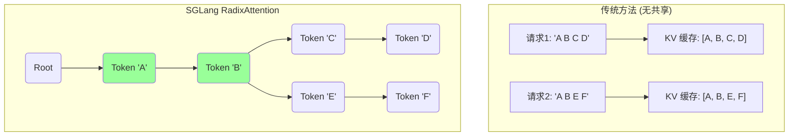
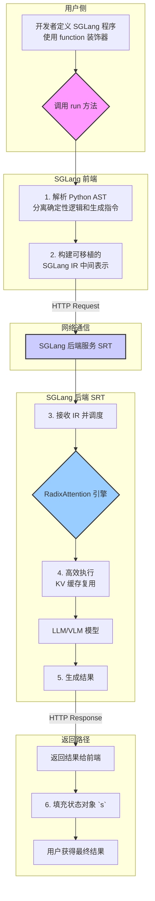
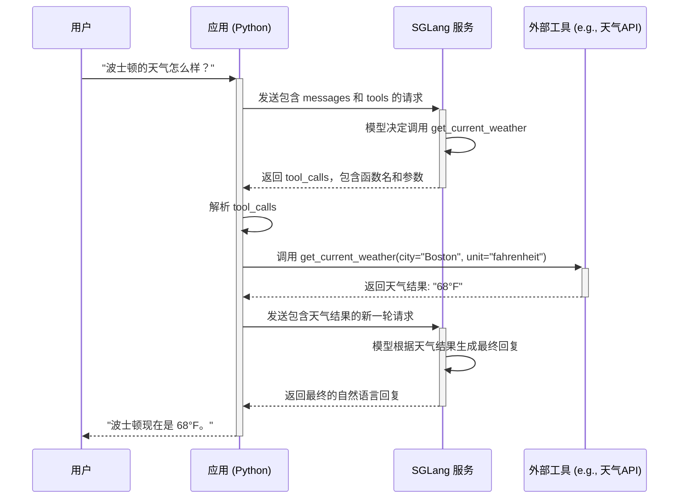

# SGLang 技术文档

## 1. SGLang 简介

SGLang (Structured Generation Language) 是一个为大型语言模型（LLM）和视觉语言模型（VLM）设计的高性能服务框架。它的核心目标是解决在实际应用中常见的复杂 LLM 程序所面临的挑战，即在保持灵活性的同时，最大化推理过程的性能。

传统的 LLM 服务框架（如 vLLM）在处理简单的、一次性的提示（one-shot prompting）时表现出色，但在需要多轮交互、结构化输出、函数调用或控制流的复杂场景下，其性能和易用性会受到限制。SGLang 通过引入一种新颖的前端语言和高效的后端运行时，有效地弥补了这一差距。

**SGLang 的核心优势包括：**

*   **卓越的性能：** SGLang 引入了 **RadixAttention**，这是一种创新的注意力机制，可以自动、无损地复用键值缓存（KV Cache），从而显著提升了具有复杂提示（如 CoT、ReAct）或多轮对话场景下的推理速度。与 vLLM 等领先框架相比，SGLang 在这些场景下可以实现数倍的吞吐量提升。
*   **强大的编程能力：** SGLang 提供了一种直观的前端语言（DSL），允许开发者使用 Pythonic 的方式来编排复杂的生成任务。你可以轻松地定义变量、使用循环和条件判断、调用外部工具，并将这些逻辑与 LLM 的生成过程无缝集成。这使得构建复杂的 AI Agent、多轮对话系统和结构化数据提取任务变得前所未有的简单。
*   **统一的前后端接口：** SGLang 将前端的编程逻辑与后端的推理服务解耦。前端负责定义“生成什么”，后端负责“如何高效生成”。这种设计不仅简化了开发流程，还使得 SGLang 能够兼容 OpenAI 的 API 标准，让用户可以轻松地将现有应用迁移到 SGLang 上，立即享受性能红利。
*   **灵活的结构化输出：** SGLang 提供了强大的结构化输出约束功能。无论是通过正则表达式、EBNF 文法还是 JSON Schema，你都可以精确地控制 LLM 的输出格式，确保生成的内容符合预期的结构，这对于需要可靠数据格式的应用至关重要。

总而言之，SGLang 不仅仅是一个 LLM 推理加速引擎，更是一个完整的、面向复杂生成任务的编程和执行框架。它旨在让开发者能够以一种既高效又直观的方式，充分释放大型语言模型的潜力。
## 2. 核心特性

SGLang 的强大之处在于其独特的设计，它将直观的前端编程模型与高效的后端执行引擎相结合。以下是其几个核心特性的详细介绍。

### 2.1 RadixAttention：为复杂提示而生的 KV 缓存优化

在处理复杂的 LLM 程序时，例如思维链（Chain-of-Thought）、多轮对话或需要调用工具的 Agent，提示（Prompt）中往往包含大量共享的前缀。传统的注意力机制在处理这些共享前缀时会产生冗余的计算和存储。

SGLang 引入了 **RadixAttention**，这是一种新颖的 KV 缓存优化技术。其核心思想是将提示组织成一棵基数树（Radix Tree），并在这个树上执行注意力计算。

*   **自动共享与复用**：RadixAttention 能够自动识别并共享不同请求之间的公共前缀，从而避免了重复计算和存储。例如，在多轮对话中，每一轮的对话历史都可以被后续轮次无损地复用。
*   **性能提升**：通过最大化 KV 缓存的复用，RadixAttention 显著减少了内存占用和计算量，从而将吞吐量提升了2到5倍，尤其是在处理长提示或高并发请求时效果更为明显。

下面是一个 Mermaid 图，用于直观地展示 RadixAttention 如何处理共享前缀的请求：


在上图中，对于两个请求 `'A B C D'` 和 `'A B E F'`，传统方法会创建两个独立的 KV 缓存。而 RadixAttention 将它们组织成一棵树，共享了公共前缀 `'A B'`（绿色节点）的计算和存储，只为不同的部分（C, D, E, F）创建新的分支。这极大地提高了内存和计算效率。

### 2.2 统一的前端编程语言（DSL）

SGLang 提供了一种富有表现力的领域特定语言（DSL），它深度集成在 Python 中，使得开发者可以用非常自然和直观的方式来构建复杂的生成逻辑。
### SGLang 架构概览

为了更好地理解 SGLang 的工作方式，我们可以通过下面的流程图来观察其核心架构：



这个图表清晰地展示了 SGLang 如何将前端的编程便利性与后端的高性能执行引擎解耦并结合起来。

*   **Pythonic 控制流**：你可以在 SGLang 函数中直接使用 `if/else`、`for` 循环等标准的 Python 控制流语句，来动态地构建提示。
*   **生成与逻辑的结合**：通过 `@function` 装饰器和 `gen()` 指令，SGLang 将 LLM 的生成过程（“不确定性”部分）与程序的确定性逻辑无缝地结合在一起。

**示例：根据条件生成不同的内容**

```python
from sglang import function, system, user, assistant, gen

@function
def tool_use(s, question):
    s += system("You are a helpful assistant.")
    s += user(question)
    s += assistant(
        "To answer this question, I need to use a "
        + gen("tool", choices=["calculator", "search engine"])
        + ". "
    )

    if s["tool"] == "calculator":
        s += assistant("The math expression is: " + gen("expression"))
    elif s["tool"] == "search engine":
        s += assistant("The key word to search is: " + gen("word"))

state = tool_use.run("What is the population of London?")
print(state["tool"])
# Output: search engine
print(state["word"])
# Output: population of London
```

在这个例子中，程序首先让 LLM 在 "calculator" 和 "search engine" 中选择一个工具，然后根据 LLM 的选择，执行不同的逻辑分支，引导 LLM 生成下一步的内容。

### 2.3 强大的结构化输出

为了确保 LLM 生成的内容能够被下游程序可靠地解析和使用，SGLang 提供了多种强大的结构化输出约束机制。

*   **正则表达式（Regex）**：你可以提供一个正则表达式，强制模型的输出严格匹配该模式。这对于生成特定格式的标识符、数字或简单的文本片段非常有用。

    ```python
    response = client.chat.completions.create(
        model="deepseek-ai/DeepSeek-R1-Distill-Qwen-7B",
        messages=[{"role": "assistant", "content": "What is the capital of France?"}],
        extra_body={"regex": "(Paris|London)"},
    )
    # response.choices[0].message.content 将必然是 "Paris" 或 "London"
    ```

*   **EBNF 文法**：对于更复杂的语法结构，你可以使用扩展巴科斯范式（EBNF）来定义一个完整的文法。这使得你可以生成严格遵守特定语法的代码、DSL 或其他结构化文本。

    ```python
    ebnf_grammar = """
    root ::= city " is the capital of " country
    city ::= "London" | "Paris" | "Berlin" | "Rome"
    country ::= "England" | "France" | "Germany" | "Italy"
    """
    response = client.chat.completions.create(
        model="meta-llama/Meta-Llama-3.1-8B-Instruct",
        messages=[{"role": "user", "content": "Give me the information of the capital of France."}],
        extra_body={"ebnf": ebnf_grammar},
    )
    # response.choices[0].message.content 将会是 "Paris is the capital of France"
    ```

*   **JSON Schema**：SGLang 支持使用 JSON Schema 来约束模型生成结构化的 JSON 对象。你可以直接定义 JSON Schema，或者使用 Pydantic 模型来自动生成。这对于需要可靠、可验证的 JSON 输出的 API 和数据处理任务至关重要。

    ```python
    from pydantic import BaseModel

    class CapitalInfo(BaseModel):
        name: str
        population: int

    response = client.chat.completions.create(
        model="deepseek-ai/DeepSeek-R1-Distill-Qwen-7B",
        messages=[{"role": "assistant", "content": "Give me the information and population of the capital of France in the JSON format."}],
        response_format={
            "type": "json_schema",
            "json_schema": {
                "name": "capital_info",
                "schema": CapitalInfo.model_json_schema(),
            },
        },
    )
    # response.choices[0].message.content 将会是一个符合 CapitalInfo 结构的 JSON 字符串
    ```
## 3. 快速入门

本章节将指导你完成 SGLang 的安装、服务启动和基本使用，让你在几分钟内体验到 SGLang 的强大功能。

### 3.1 安装

SGLang 可以通过 `pip` 或更快的 `uv` 进行安装。为了获得最佳体验和全部功能，推荐安装 `all` 版本。

**使用 pip:**
```bash
pip install --upgrade pip
pip install "sglang[all]"
```

**使用 uv (推荐，速度更快):**
```bash
pip install uv
uv pip install "sglang[all]"
```

> **注意**: 安装过程可能需要编译 CUDA 内核（如 `flashinfer`），请确保你的环境中已正确配置 `CUDA_HOME` 环境变量，并且 CUDA 版本与 PyTorch 版本兼容。

### 3.2 启动后端服务 (SRT)

安装完成后，下一步是启动 SGLang 的后端服务（SRT, SGLang Runtime）。该服务将加载指定的语言模型，并提供一个与 OpenAI API 兼容的接口。

在你的终端中运行以下命令：

```bash
python -m sglang.launch_server --model-path meta-llama/Meta-Llama-3.1-8B-Instruct --host 0.0.0.0 --port 30000
```

**参数说明:**

*   `--model-path`: 指定要加载的模型的路径。可以是 Hugging Face Hub 上的模型名称（如本例所示），也可以是本地的模型路径。
*   `--host`: 服务监听的主机地址。`0.0.0.0` 表示允许从任何网络接口访问。
*   `--port`: 服务监听的端口号。

服务成功启动后，你将看到类似以下的输出，表示模型已加载并准备好接收请求。

```
INFO:     Uvicorn running on http://0.0.0.0:30000 (Press CTRL+C to quit)
INFO:     Started server process [12345]
INFO:     Waiting for application startup.
INFO:     Application startup complete.
```

### 3.3 发送第一个请求

服务正在运行，现在我们可以通过 OpenAI 的 Python 客户端库来与之交互。

创建一个名为 `test_sglang.py` 的 Python 文件，并填入以下内容：

```python
import openai

# 初始化客户端，指向我们本地启动的 SGLang 服务
client = openai.Client(
    base_url="http://127.0.0.1:30000/v1",
    api_key="EMPTY"  # SGLang 服务不需要 API Key
)

# 创建一个聊天补全请求
response = client.chat.completions.create(
    model="meta-llama/Meta-Llama-3.1-8B-Instruct",  # 必须与服务加载的模型一致
    messages=[
        {"role": "system", "content": "You are a helpful assistant."},
        {"role": "user", "content": "What is the capital of France and why is it famous?"},
    ],
    temperature=0.7,
    max_tokens=150,
)

# 打印模型的回复
print(response.choices[0].message.content)
```

运行这个脚本：

```bash
python test_sglang.py
```

你将看到模型生成的关于巴黎的详细回答。至此，你已经成功地使用 SGLang 完成了一次从服务部署到推理请求的全过程！
## 4. 前端语言 (SGLang DSL)

SGLang 的前端语言（DSL）是其易用性的核心。它允许你以声明式的方式定义复杂的生成流程，将 Python 的灵活性与 LLM 的生成能力完美结合。

### 4.1 `@function` 装饰器

**3. 交互流程**

整个函数调用的交互流程可以用下面的序列图来表示：



这个序列图清晰地展示了从用户提问到模型决策、工具调用、结果整合，再到最终回复的完整闭环。
所有 SGLang 程序都始于一个由 `@function` 装饰的 Python 函数。这个装饰器会将一个普通的 Python 函数转换成一个可执行的 SGLang 程序模板。

*   **状态管理**：函数的第一个参数（通常命名为 `s`）代表了当前的生成状态（state）。它是一个类似字典的对象，用于存储和传递生成过程中产生的所有变量。
*   **延迟执行**：被 `@function` 装饰的函数在定义时不会立即执行。相反，它会创建一个可重用的模板。只有当调用 `.run()` 或 `.run_batch()` 方法时，程序才会真正执行。

### 4.2 核心指令

在 SGLang 函数内部，你使用一系列指令来构建提示和控制生成流程。

*   **角色指令**: `system()`, `user()`, `assistant()`
    这些指令用于定义对话的不同部分，符合标准的多轮对话格式。你可以将字符串直接传递给它们。
*   **生成指令**: `gen()`
    这是 SGLang 中最重要的指令。它告诉 LLM 在当前位置生成文本。
    *   `s += gen("variable_name", ...)`: `gen()` 的第一个参数是必需的，它指定了生成结果将存储在状态 `s` 中的变量名。
    *   `max_tokens`: 限制生成的最大 token 数量。
    *   `stop`: 定义一个或多个停止字符串。当模型生成这些字符串时，生成过程会提前结束。
    *   `choices`: 提供一个字符串列表，强制模型从这些选项中选择一个进行生成。

**示例：一个完整的前端函数**

```python
from sglang import function, system, user, assistant, gen, set_default_backend, OpenAI

# 设置后端为 SGLang 提供的 OpenAI 兼容服务
set_default_backend(OpenAI("meta-llama/Meta-Llama-3.1-8B-Instruct"))

@function
def multi_turn_qa(s, question1, question2):
    s += system("You are a helpful assistant.")
    s += user(question1)
    s += assistant(gen("answer1", max_tokens=128))
    s += user(question2)
    s += assistant(gen("answer2", max_tokens=128))

# 执行 SGLang 程序
state = multi_turn_qa.run(
    question1="What is the capital of the UK?",
    question2="What is its population?",
    temperature=0.1
)

print("Answer 1:", state["answer1"])
print("Answer 2:", state["answer2"])
```

### 4.3 流式输出

对于需要实时反馈的应用，SGLang 支持流式输出。只需在 `.run()` 方法中设置 `stream=True`，然后迭代返回的状态对象的 `.text_iter()` 方法即可。

```python
state = multi_turn_qa.run(
    question1="Write a short story about a robot.",
    question2="Continue the story.",
    stream=True
)

for out in state.text_iter("answer2"):
    print(out, end="", flush=True)
```

## 5. 后端服务 (SRT) 与 API 参考

SGLang 的后端，即 SGLang Runtime (SRT)，是一个用 Python 实现的高性能推理服务器。它负责加载模型、管理 KV 缓存（通过 RadixAttention），并处理来自客户端的请求。SRT 提供了两种主要的 API 端点。

### 5.1 原生 API: `/generate`

这是一个更底层的 API，提供了对生成过程最精细的控制。

*   **Endpoint**: `POST /generate`
*   **描述**: 从给定的文本提示开始生成文本。
*   **核心参数**:
    *   `text` (string, required): 输入的文本提示。
    *   `sampling_params` (object, optional): 一个包含采样参数的 JSON 对象。
        *   `temperature` (float): 采样温度。
        *   `max_new_tokens` (int): 最大新生成 token 数。
        *   `stop` (string or list[string]): 停止符。
        *   `json_schema` (string): JSON Schema 字符串，用于约束输出。
        *   `regex` (string): 正则表达式，用于约束输出。
        *   `ebnf` (string): EBNF 文法，用于约束输出。
    *   `stream` (boolean, optional): 是否使用流式传输。

**示例 (使用 `requests`)**:

```python
import requests
import json

url = "http://127.0.0.1:30000/generate"
data = {
    "text": "The capital of France is",
    "sampling_params": {
        "temperature": 0,
        "max_new_tokens": 16,
    }
}

response = requests.post(url, json=data)
print(response.json())
# {'text': ' Paris.\n\nThe capital of France is Paris. It is the most populous city in', 'meta': ...}
```

### 5.2 OpenAI 兼容 API: `/v1/chat/completions`

为了方便迁移和集成，SGLang 提供了与 OpenAI 完全兼容的聊天补全 API。你可以无缝地使用 OpenAI 的官方客户端库。

*   **Endpoint**: `POST /v1/chat/completions`
*   **描述**: 执行聊天式文本生成。
*   **核心参数**:
    *   `model` (string, required): 模型的名称。
    *   `messages` (list[object], required): 对话消息列表。
    *   `temperature`, `max_tokens`, `stream`, etc.
    *   `response_format` (object, optional): 用于指定结构化输出，如 `{"type": "json_schema", "json_schema": ...}`。
    *   `extra_body` (object, optional): SGLang 特有的扩展参数，如 `{"regex": "..."}` 或 `{"ebnf": "..."}`。

**示例 (使用 `openai` 库)**:

```python
import openai

client = openai.Client(base_url="http://127.0.0.1:30000/v1", api_key="EMPTY")

response = client.chat.completions.create(
    model="meta-llama/Meta-Llama-3.1-8B-Instruct",
    messages=[{"role": "user", "content": "List 3 countries and their capitals."}],
    temperature=0,
    max_tokens=64,
)
print(response.choices[0].message.content)
```

## 6. 高级用法：函数调用/工具使用

SGLang 强大的编程模型使其非常适合构建能够调用外部工具的 AI Agent。这通常通过结构化输出来实现，模型被引导生成一个描述函数调用的特定格式的文本（通常是 JSON）。

以下是构建一个简单天气查询 Agent 的步骤：

**1. 定义工具 Schema**

首先，使用 JSON Schema 定义你的工具。这告诉模型工具的名称、目的以及需要哪些参数。

```python
tools = [
    {
        "type": "function",
        "function": {
            "name": "get_current_weather",
            "description": "Get the current weather in a given location",
            "parameters": {
                "type": "object",
                "properties": {
                    "city": {"type": "string", "description": "The city name"},
                    "unit": {"type": "string", "enum": ["celsius", "fahrenheit"]},
                },
                "required": ["city", "unit"],
            },
        },
    }
]
```

**2. 引导模型进行函数调用**

在发送给模型的 `messages` 中，包含一个系统提示，指示模型可以使用这些工具。然后，在 API 调用中传入 `tools` 和 `tool_choice="auto"`。

```python
import json

messages = [
    {"role": "system", "content": "You are a helpful assistant that can access external tools."},
    {"role": "user", "content": "What's the weather like in Boston in fahrenheit?"}
]

response = client.chat.completions.create(
    model="meta-llama/Meta-Llama-3.1-8B-Instruct",
    messages=messages,
    tools=tools,
    tool_choice="auto",
)

# 检查模型是否决定调用工具
response_message = response.choices[0].message
tool_calls = response_message.tool_calls

if tool_calls:
    # 模型决定调用工具
    for tool_call in tool_calls:
        function_name = tool_call.function.name
        function_args = json.loads(tool_call.function.arguments)
        
        print(f"Function Call: {function_name}")
        print(f"Arguments: {function_args}")
        
        # 在这里，你可以实际执行函数调用
        # e.g., result = get_current_weather(**function_args)
```

**输出:**
```
Function Call: get_current_weather
Arguments: {'city': 'Boston', 'unit': 'fahrenheit'}
```

通过这种方式，你可以构建出能够与外部世界交互的、功能强大的 AI 应用。