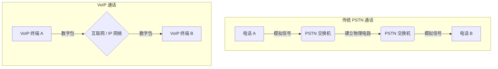
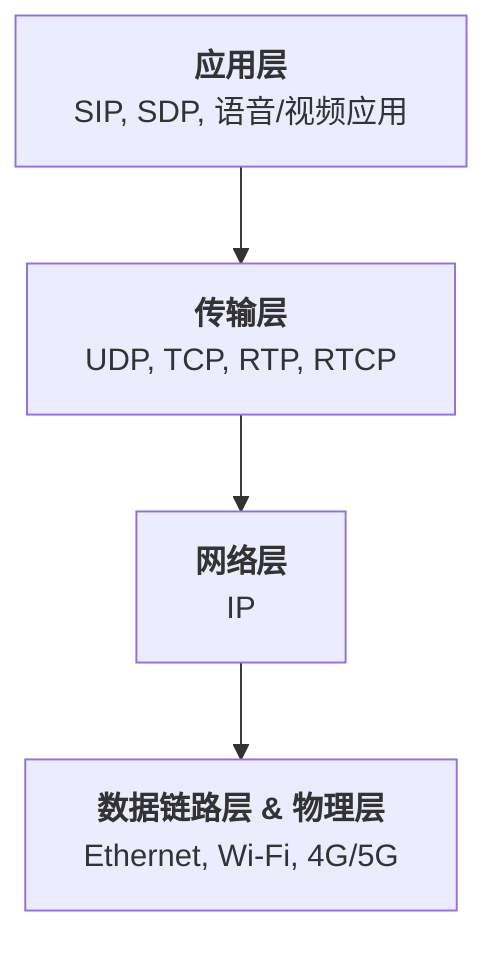
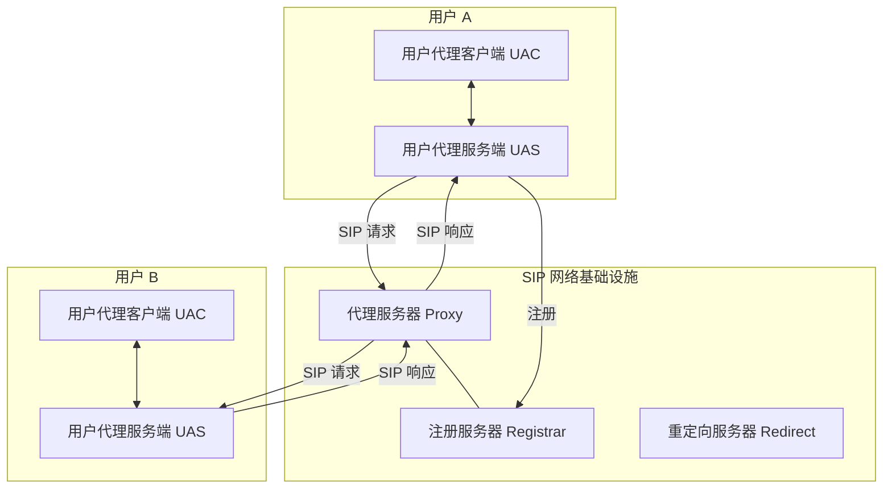
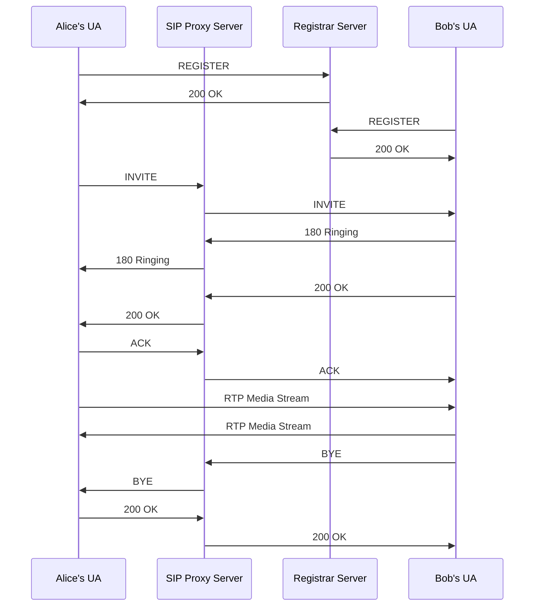
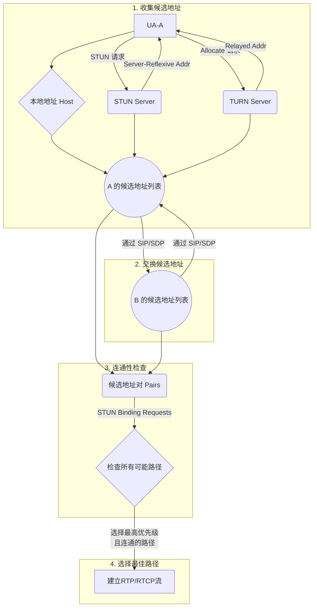
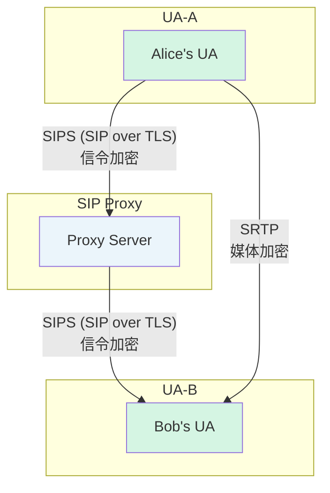

# SIP 与 VoIP 深度技术剖析文档

## 目录
1.  [引言：VoIP 与 SIP 的世界](#1-引言voip-与-sip-的世界)
    *   [1.1 什么是 VoIP？](#11-什么是-voip)
    *   [1.2 SIP：VoIP 的“交通指挥官”](#12-sipvoip-的交通指挥官)
    *   [1.3 VoIP vs. PSTN：一场通信革命](#13-voip-vs-pstn一场通信革命)
2.  [VoIP 核心技术栈 (宏观视角)](#2-voip-核心技术栈-宏观视角)
    *   [2.1 分层架构](#21-分层架构)
    *   [2.2 关键协议一览](#22-关键协议一览)
3.  [SIP 协议深度解析 (微观细节)](#3-sip-协议深度解析-微观细节)
    *   [3.1 SIP 核心组件](#31-sip-核心组件)
    *   [3.2 SIP 消息：与 HTTP 的异曲同工之妙](#32-sip-消息与-http-的异曲同工之妙)
    *   [3.3 一次完整通话：SIP 会话流程详解](#33-一次完整通话sip-会话流程详解)
    *   [3.4 SDP：描绘媒体会话的蓝图](#34-sdp描绘媒体会话的蓝图)
4.  [媒体流传输：RTP 与 RTCP](#4-媒体流传输rtp-与-rtcp)
    *   [4.1 RTP：为实时数据而生](#41-rtp为实时数据而生)
    *   [4.2 RTCP：RTP 的“控制伙伴”](#42-rtcprtp-的控制伙伴)
5.  [NAT 穿越：打通网络的“任督二脉”](#5-nat-穿越打通网络的任督二脉)
    *   [5.1 NAT 的挑战](#51-nat-的挑战)
    *   [5.2 NAT 穿越的三剑客：STUN, TURN, ICE](#52-nat-穿越的三剑客stun-turn-ice)
6.  [VoIP 安全：保护你的通话隐私](#6-voip-安全保护你的通话隐私)
    *   [6.1 信令加密：SIPS (SIP over TLS)](#61-信令加密sips-sip-over-tls)
    *   [6.2 媒体加密：SRTP](#62-媒体加密srtp)
7.  [总结与展望](#7-总结与展望)

---

## 1. 引言：VoIP 与 SIP 的世界

### 1.1 什么是 VoIP？

VoIP (Voice over Internet Protocol)，即“通过互联网协议传输的语音”，是一项革命性的技术。从本质上讲，它将人的声音（模拟信号）进行数字化、压缩、打包，然后通过 IP 网络（如我们日常使用的互联网）进行传输，最后在接收端解包、解压、转换回声音。

**核心思想**：将语音视为一种数据，像发送电子邮件或浏览网页一样在网络上传输。

这打破了传统电话系统 (PSTN - Public Switched Telephone Network) 对物理电话线的依赖，带来了巨大的灵活性和成本优势。

### 1.2 SIP：VoIP 的“交通指挥官”

如果说 VoIP 是一个完整的通信系统，那么 SIP (Session Initiation Protocol)，即“会话发起协议”，就是这个系统的大脑和交通指挥官。

SIP 本身并不传输语音数据。它的核心职责是**信令 (Signaling)**，负责处理通信会话的 **创建 (Setup)、管理 (Management) 和终止 (Teardown)**。

可以这样理解：
*   **你想给朋友打电话**：SIP 负责找到你的朋友在哪（地址解析），告诉他的电话“有人找”，让他的电话响起来（会话邀请）。
*   **朋友接电话了**：SIP 负责确认双方都准备好了，可以开始通话了。
*   **通话结束，挂断电话**：SIP 负责通知双方，这个通话已经结束，可以释放资源了。

SIP 是一个应用层协议，其设计深受 HTTP 和 SMTP 的影响，采用文本格式，易于理解和扩展。正是由于其灵活性和强大功能，SIP 已成为现代 VoIP 系统中最主流的信令协议。

### 1.3 VoIP vs. PSTN：一场通信革命

为了更直观地理解 VoIP 的颠覆性，我们可以将其与传统的 PSTN 进行对比。

| 特性 | PSTN (传统电话) | VoIP (网络电话) |
| :--- | :--- | :--- |
| **网络基础** | 专用、电路交换网络 | 通用、分组交换的 IP 网络 |
| **连接方式** | 通话前建立一条物理独占线路 | 数据包在网络中独立路由，共享带宽 |
| **核心原理** | 电路交换 | 分组交换 |
| **功能** | 主要限于语音通话 | 融合语音、视频、消息、状态显示等 |
| **成本** | 依赖距离和通话时长，长途昂贵 | 主要取决于网络带宽成本，长途和市话无差别 |
| **灵活性** | 号码与物理线路绑定 | 号码（地址）与用户绑定，可在任何有网络的地方使用 |



接下来的章节，我们将深入探索构成 VoIP 系统的技术栈，并“掰开了揉碎了”地解析 SIP 协议的每一个细节。
---

## 2. VoIP 核心技术栈 (宏观视角)

从宏观上看，VoIP 不是单一技术，而是一个复杂但有序的技术体系，由多个协议协同工作而成。理解其分层架构是掌握 VoIP 全局观的关键。

### 2.1 分层架构

VoIP 的技术栈可以大致分为四层，每一层都依赖于其下层提供的服务。



*   **应用层 (Application Layer)**: 这是用户最接近的一层。
    *   **信令协议 (Signaling Protocols)**: 如我们重点关注的 **SIP**，以及其前辈 **H.323**。它们负责“打电话”、“挂电话”等控制操作。
    *   **媒体描述协议 (Media Description Protocol)**: **SDP (Session Description Protocol)** 扮演着关键角色。它并不传输媒体，而是用来详细描述媒体流的属性，例如：用什么编解码器 (G.711, Opus)？IP 地址和端口是什么？是音频还是视频？SDP 的内容通常由 SIP “背着”进行交换。

*   **传输层 (Transport Layer)**: 负责端到端的数据传输。
    *   **UDP (User Datagram Protocol)**: 由于其实时、低开销的特性，成为了 VoIP 媒体数据（即语音包）传输的 **首选**。它不保证可靠性，允许丢包，这对于实时语音来说是可以接受的（丢失一两个数据包可能只是瞬间的杂音，而为重传等待则会导致严重的延迟和抖动）。**RTP (Real-time Transport Protocol)** 协议就构建于 UDP 之上。
    *   **TCP (Transmission Control Protocol)**: 对于要求绝对可靠的信令消息（如 SIP），通常会选用 TCP。确保“INVITE”（邀请）或“BYE”（结束）这样的关键指令不会丢失。当然，SIP 也可以运行在 UDP 之上，并通过自身的重传机制保证可靠性。

*   **网络层 (Network Layer)**: 核心是 **IP (Internet Protocol)**，负责数据包的路由和寻址，确保数据包能从源头穿越复杂的网络，最终抵达目的地。

*   **数据链路层 & 物理层 (Data Link & Physical Layer)**: 这是最底层的基础设施，包括以太网、Wi-Fi、光纤等，负责将数据比特流在物理介质上传输。

### 2.2 关键协议一览

| 协议 | 全称 | 所属层次 | 核心功能 |
| :--- | :--- | :--- | :--- |
| **SIP** | Session Initiation Protocol | 应用层 | 建立、管理和终止多媒体会话（信令控制）。 |
| **SDP** | Session Description Protocol | 应用层 | 描述媒体会d话的参数，如 IP 地址、端口、编解码器等。 |
| **RTP** | Real-time Transport Protocol | 传输层 | 承载实时数据（如语音、视频），提供时间戳和序列号。 |
| **RTCP** | Real-time Transport Control Protocol | 传输层 | 与 RTP 配对使用，提供服务质量 (QoS) 监控和反馈。 |
| **UDP** | User Datagram Protocol | 传输层 | 为 RTP 提供低延迟的、不可靠的数据报传输。 |
| **TCP** | Transmission Control Protocol | 传输层 | 为 SIP 等信令提供可靠的、面向连接的传输。 |
| **STUN/TURN/ICE** | (见 NAT 章节) | 应用层 | 用于解决网络地址转换 (NAT) 带来的连接性问题。 |
| **SRTP** | Secure Real-time Transport Protocol | 传输层/应用层 | RTP 的安全版本，提供媒体流的加密和认证。 |
| **TLS**| Transport Layer Security | 传输层 | 用于加密 SIP 信令 (SIPS)，保证信令的机密性和完整性。 |

理解了这幅宏观图景后，我们就可以开始深入到最重要的协议——SIP 的内部，去探索它是如何精巧地完成通信指挥的。
---

## 3. SIP 协议深度解析 (微观细节)

现在，我们正式进入 SIP 的世界。SIP 的设计哲学是“简单”和“可扩展”，它借鉴了大量 HTTP 的设计思想，如果你了解 HTTP，学习 SIP 会感到非常亲切。

### 3.1 SIP 核心组件

一个典型的 SIP 网络由以下几种逻辑组件构成：



*   **用户代理 (User Agent - UA)**: 这是 SIP 世界的终端设备。它可以是：
    *   **硬件电话**: 外形像传统电话，但内部运行 SIP 协议的 IP 电话。
    *   **软件电话 (Softphone)**: 安装在电脑或手机上的应用程序。
    *   任何能够发起或接收 SIP 会话的设备。
    
    一个 UA 包含两个部分：
    *   **用户代理客户端 (User Agent Client - UAC)**: 负责**发起** SIP 请求。当你拨打电话时，你的设备就是 UAC。
    *   **用户代理服务端 (User Agent Server - UAS)**: 负责**接收** SIP 请求并给出响应。当你的电话响铃时，你的设备就是 UAS。
    在一次完整的双向通话中，**任何一方的设备都同时是 UAC 和 UAS**。

*   **代理服务器 (Proxy Server)**: 这是 SIP 网络的中枢神经。它接收来自 UAC 的请求，并将其**转发**给目标 UAS。代理服务器自身不发起请求，但它可以为了策略执行（如计费、路由策略）而修改请求的某些部分。它是通话的“中间人”。

*   **注册服务器 (Registrar Server)**: 它的功能像一个“地址簿”。当一个 UA 启动并接入网络时，它会向 Registrar 发送一个 `REGISTER` 请求，告诉服务器：“我是 Bob，我的 SIP 地址是 `sip:bob@example.com`，现在我的 IP 地址是 `192.168.1.100`”。Registrar 负责维护这个地址映射关系（即用户的 SIP URI 与其实际网络位置之间的绑定）。当有人想呼叫 Bob 时，Proxy 服务器就会查询 Registrar 以找到 Bob 的当前位置。

*   **重定向服务器 (Redirect Server)**: 它与 Proxy 有点像，但更“懒”。当它收到一个请求时，它不会自己去转发，而是直接回复给 UAC 一个“3xx”响应，告诉 UAC：“你要找的人在 `sip:bob@192.168.1.100`，你自己去找他吧”。UAC 需要自己根据这个新地址再次发起请求。这种模式在实际应用中不如代理模式常见。

### 3.2 SIP 消息：与 HTTP 的异曲同工之妙

SIP 消息是纯文本的，分为两种：**请求 (Request)** 和 **响应 (Response)**。

**一个典型的 SIP 请求 (INVITE):**
```
INVITE sip:bob@biloxi.com SIP/2.0
Via: SIP/2.0/UDP pc33.atlanta.com;branch=z9hG4bK776asdhds
Max-Forwards: 70
To: Bob <sip:bob@biloxi.com>
From: Alice <sip:alice@atlanta.com>;tag=1928301774
Call-ID: a84b4c76e66710
CSeq: 314159 INVITE
Contact: <sip:alice@pc33.atlanta.com>
Content-Type: application/sdp
Content-Length: 142

(消息体: SDP 内容在此处...)
```

**请求消息结构解析:**
*   **请求行 (Request Line)**: `方法 (Method) 请求URI (Request-URI) 协议版本 (Version)`
    *   **Method**: 定义了请求的目的。常用方法有：
        *   `INVITE`: 发起一个会话邀请。
        *   `ACK`: 对 `INVITE` 的最终响应进行确认。
        *   `BYE`: 终止一个已建立的会话。
        *   `CANCEL`: 取消一个尚未完成的 `INVITE` 请求。
        *   `REGISTER`: 向 Registrar 服务器注册用户位置。
        *   `OPTIONS`: 查询服务器或 UA 的能力。
    *   **Request-URI**: 请求的目标地址，即 `sip:user@domain`。
*   **头字段 (Header Fields)**: `字段名: 字段值` 的键值对，提供了关于消息的详细信息。
    *   `Via`: 记录了请求经过的路径。每一跳代理都会在顶部加入自己的地址。响应消息将沿着 `Via` 头指定的路径原路返回。`branch` 参数是事务 ID 的关键部分。
    *   `From` / `To`: 分别表示呼叫的发起方和接收方。`tag` 参数在一个通话中唯一标识一方，是对话 (Dialog) 的关键。
    *   `Call-ID`: 在全局范围内唯一标识一次完整的呼叫（Call）。所有与这次呼叫相关的请求和响应都使用相同的 `Call-ID`。
    *   `CSeq`: Command Sequence，命令序列号。它包含一个数字和一个方法名，用于将同一 `Call-ID` 下的多个事务进行排序和区分。
    *   `Contact`: 提供了请求发起方直接联系的地址（URI）。在 `INVITE` 中，它告诉对方后续请求（如 `BYE`）应该直接发到哪里。
    *   `Content-Type`: 描述消息体的媒体类型，通常是 `application/sdp`。
    *   `Content-Length`: 消息体的长度。

**一个典型的 SIP 响应 (200 OK):**
```
SIP/2.0 200 OK
Via: SIP/2.0/UDP pc33.atlanta.com;branch=z9hG4bK776asdhds;received=192.0.2.4
To: Bob <sip:bob@biloxi.com>;tag=a6c85cf
From: Alice <sip:alice@atlanta.com>;tag=1928301774
Call-ID: a84b4c76e66710
CSeq: 314159 INVITE
Contact: <sip:bob@198.51.100.3>
Content-Type: application/sdp
Content-Length: 131

(消息体: SDP 内容在此处...)
```

**响应消息结构解析:**
*   **状态行 (Status Line)**: `协议版本 (Version) 状态码 (Status-Code) 原因短语 (Reason-Phrase)`
    *   **状态码**: 与 HTTP 状态码非常相似。
        *   `1xx` (临时响应): 请求已收到，正在处理中。如 `180 Ringing` (正在振铃)。
        *   `2xx` (成功响应): 请求已成功处理。如 `200 OK`。
        *   `3xx` (重定向响应): 需要采取进一步操作。
        *   `4xx` (客户端错误): 请求有语法错误或无法在此服务器上处理。
        *   `5xx` (服务器错误): 服务器处理请求失败。
        *   `6xx` (全局失败): 任何服务器都无法处理该请求。
*   **头字段**: 大部分头字段（如 `Via`, `From`, `To`, `Call-ID`, `CSeq`）从请求中复制过来，以确保响应能正确关联到请求上。`To` 字段的 `tag` 是由被叫方（UAS）添加的。

### 3.3 一次完整通话：SIP 会话流程详解

下面我们用一个 Mermaid 序列图来分解一次最典型的 SIP 通话流程，从用户上线注册，到 A 呼叫 B，最后挂断。



**流程分解**:
1.  **注册 (1-4)**: Alice 和 Bob 上线后，各自向 Registrar 注册自己的位置。这是让别人能找到他们的前提。
2.  **呼叫 (5-12)**: 这是著名的 “三次握手” 过程 (`INVITE` -> `200 OK` -> `ACK`)。
    *   **INVITE**: Alice 发起呼叫，请求中携带了她这边准备好的媒体信息 (SDP)，描述了她能接收的媒体类型、编解码器和 IP/端口。
    *   **1xx 临时响应**: Proxy 和 Bob 会返回 `100 Trying` (图中未画出) 和 `180 Ringing`，告诉 Alice "别急，正在处理/对方电话在响"。这能有效防止 UAC 因超时而重发 `INVITE`。
    *   **200 OK**: 当 Bob 接听电话，他的 UA 会发送一个 `200 OK` 响应，其中包含了 **他自己的 SDP 信息**。至此，媒体协商完成，双方都知道了对方的媒体能力和接收地址。
    *   **ACK**: Alice 收到 `200 OK` 后，必须发送一个 `ACK` 请求来确认。`ACK` 是一个独立的事务，用于确认最终响应。当 Bob 收到 `ACK` 后，一个完整的 SIP 对话 (Dialog) 就正式建立了。
3.  **媒体传输**: 对话建立后，Alice 和 Bob 就可以绕开 Proxy 服务器，根据从对方 SDP 中获取的 IP 和端口信息，**直接**发送 RTP 语音包给对方。**信令走的路（通过 Proxy）和媒体走的路（P2P）可以是不同的**，这是 SIP 的一个重要特点。
4.  **结束 (13-16)**: 任何一方想结束通话，只需发送一个 `BYE` 请求。对方收到后回复一个 `200 OK`，通话就干净利落地终止了。

### 3.4 SDP：描绘媒体会话的蓝图

SDP (Session Description Protocol) 是 SIP 的“天作之合”，但它是一个独立的协议 (RFC 4566)。它本身不传输任何媒体数据，只用来**描述**媒体会话。它就像一张蓝图，详细说明了要建的“通信大厦”的规格。

**一个典型的 SDP 示例 (在 INVITE 请求中):**
```
v=0
o=alice 2890844526 2890844526 IN IP4 pc33.atlanta.com
s=SIP Call
c=IN IP4 192.0.2.4
t=0 0
m=audio 49170 RTP/AVP 0 8 97
a=rtpmap:0 PCMU/8000
a=rtpmap:8 PCMA/8000
a=rtpmap:97 iLBC/8000
```
**关键字段解析**:
*   `v=0`: 协议版本。
*   `o=`: (owner/creator) 描述了会话的发起者信息，包括用户名、会话 ID、版本号等。
*   `s=`: 会话名称。
*   `c=`: (connection data) 连接信息。**非常重要**，它指明了媒体流应该发往的地址 (`IN` 表示 Internet, `IP4` 表示 IPv4, 后面是 IP 地址)。
*   `t=`: (time) 会话的起止时间，`0 0` 表示永久。
*   `m=`: (media description) 媒体描述。**至关重要**。
    *   `audio`: 媒体类型是音频。
    *   `49170`: **媒体将要发送到的端口**。
    *   `RTP/AVP`: 使用的传输协议是 RTP。
    *   `0 8 97`: **提议的编解码器列表** (payload type)。这是一个优先级列表，表示“我优先使用 0，其次是 8，再次是 97”。
*   `a=rtpmap: ...`: (attribute) 属性行，将上面 `m` 行中的 payload type 数字映射到具体的编解码器名称和时钟频率。例如 `a=rtpmap:0 PCMU/8000` 表示 payload type 0 对应的是 G.711u (PCMU)，采样率 8000Hz。

这个模型被称为 **Offer/Answer 模型**：
1.  **Offer (提议)**: Alice 在 `INVITE` 中发送她的 SDP，这是一个 Offer，列出了她支持的所有编解码器和她的接收地址/端口。
2.  **Answer (应答)**: Bob 收到后，从 Alice 的列表中选择一个他也支持的编解码器（例如 PCMA），然后在 `200 OK` 的 SDP 中返回这个选定的编解码器以及**他自己**的接收地址/端口。

当 Alice 收到这个 Answer 后，双方就达成了共识：使用 PCMA 编解码器，Alice 向 Bob 的 IP/端口发送 RTP 包，Bob 向 Alice 的 IP/端口发送 RTP 包。
---

## 4. 媒体流传输：RTP 与 RTCP

我们已经通过 SIP/SDP 成功地建立了通话的“信令”连接，就像两个城市的机场调度中心已经协调好了航班计划。现在，我们需要真正的“飞机”——RTP 协议，来运送我们的“乘客”——语音和视频数据。

### 4.1 RTP：为实时数据而生

RTP (Real-time Transport Protocol, RFC 3550) 是专门为端到端传输实时数据（如音频和视频）而设计的网络协议。它通常运行在 **UDP** 之上。

**为什么是 UDP？**
TCP 提供可靠的、有序的传输，但这是有代价的：当一个包丢失时，TCP 会停止后续包的发送，直到丢失的包被重传并成功接收。对于实时语音，这种为“可靠性”而付出的延迟是致命的。丢失一小片语音（可能只是零点几秒的静音或微弱杂音）远比为了等它而让整个对话卡顿几秒钟要好得多。RTP 正是基于这种“容忍丢包、不容忍延迟”的原则，选择了 UDP 作为其理想的载体。

但纯粹的 UDP 只是把数据包“尽力而为”地扔给对方，它不提供时间信息，也不知道包的顺序。RTP 在 UDP 的基础上，增加了一个额外的头部，赋予了数据包“生命”：**时间戳** 和 **序列号**。

**RTP 头部结构详解**

一个标准的 RTP 头部至少有 12 个字节，其结构如下：

```
    0                   1                   2                   3
    0 1 2 3 4 5 6 7 8 9 0 1 2 3 4 5 6 7 8 9 0 1 2 3 4 5 6 7 8 9 0 1
   +-+-+-+-+-+-+-+-+-+-+-+-+-+-+-+-+-+-+-+-+-+-+-+-+-+-+-+-+-+-+-+-+
   |V=2|P|X|  CC   |M|     PT      |       Sequence Number         |
   +-+-+-+-+-+-+-+-+-+-+-+-+-+-+-+-+-+-+-+-+-+-+-+-+-+-+-+-+-+-+-+-+
   |                           Timestamp                           |
   +-+-+-+-+-+-+-+-+-+-+-+-+-+-+-+-+-+-+-+-+-+-+-+-+-+-+-+-+-+-+-+-+
   |           Synchronization Source (SSRC) identifier            |
   +=+=+=+=+=+=+=+=+=+=+=+=+=+=+=+=+=+=+=+=+=+=+=+=+=+=+=+=+=+=+=+=+
   |            Contributing source (CSRC) identifiers             |
   |                             ....                              |
   +-+-+-+-+-+-+-+-+-+-+-+-+-+-+-+-+-+-+-+-+-+-+-+-+-+-+-+-+-+-+-+-+
```

*   **V (Version, 2 bits)**: RTP 协议的版本，目前是版本 2。
*   **P (Padding, 1 bit)**: 填充位。如果设置，表示数据包末尾有额外的填充字节。
*   **X (Extension, 1 bit)**: 扩展位。如果设置，表示在标准头后跟一个扩展头。
*   **CC (CSRC Count, 4 bits)**: 贡献源计数，表示跟在固定头后的 CSRC 标识符的数量。
*   **M (Marker, 1 bit)**: 标记位。其具体含义由具体的应用场景 (Profile) 定义。例如，在视频流中，它可以标记一帧的结束。在音频中，它可以标记一段静默期的开始。
*   **PT (Payload Type, 7 bits)**: **载荷类型**。这是一个非常关键的字段，用于标识 RTP 包中承载的媒体数据是什么格式。这个数字与我们在 SDP 的 `m=` 行和 `a=rtpmap` 行协商的结果是完全对应的。例如，如果 SDP 协商决定使用 PCMU (payload type 0)，那么所有承载 PCMU 数据的 RTP 包的 PT 字段都会被设置为 0。接收端看到 PT=0，就知道该用 PCMU 解码器来处理数据。
*   **Sequence Number (16 bits)**: **序列号**。每发送一个 RTP 包，序列号就加 1。这个字段有两个核心作用：
    1.  **探测丢包**: 接收端可以根据收到的序列号是否连续来判断中间是否有包丢失。
    2.  **重排序**: 由于网络中数据包的路径可能不同，先发的包可能后到。接收端可以通过序列号来恢复数据包的原始顺序。
*   **Timestamp (32 bits)**: **时间戳**。**这是 RTP 的灵魂**。它记录了包中媒体数据的采样时刻。**注意：这个时间戳不是“墙上时钟”**，而是基于媒体的采样时钟。例如，对于 8000Hz 采样的音频，时钟每秒“滴答”8000 次。如果一个包装了 20 毫秒的音频数据，那么下一个包的时间戳就会增加 `8000 * 0.020 = 160`。
    时间戳的主要作用是：
    1.  **同步播放和消除抖动 (Jitter)**: Jitter 指的是数据包到达时间的延迟变化。接收端会设置一个“抖动缓冲区”(Jitter Buffer)，根据包上的时间戳来平滑地播放媒体，而不是忽快忽慢地播放，从而提供流畅的听觉/视觉体验。
    2.  **多媒体同步**: 在一个包含音频和视频的通话中，音频流和视频流是两个独立的 RTP 流（有不同的 SSRC），但它们的时间戳可以基于同一个参考时钟。这使得接收端能够精确地对齐音频和视频，实现“唇音同步”。
*   **SSRC (Synchronization Source, 32 bits)**: **同步源**。在一个 RTP 会话中，每个媒体流源（如一个麦克风或一个摄像头）都被分配一个随机生成的、全局唯一的 SSRC 值。例如，如果 Alice 在通话中既发送音频又发送视频，她会生成两个 SSRC，一个用于音频流，一个用于视频流。Proxy 或 Mixer 等中间设备可以根据 SSRC 来区分不同的流。
*   **CSRC (Contributing Source)**: 贡献源。当多个源的媒体流经过一个混合器（Mixer）合并成一个流时，这个字段用来列出所有原始贡献者的 SSRC。

### 4.2 RTCP：RTP 的“控制伙伴”

RTP 只负责“运货”，但它不知道“货运”的质量如何。RTCP (Real-time Transport Control Protocol) 就是随行的“质量总监”。它与 RTP 并行工作，定期在参与者之间发送控制包，以监控数据传输的服务质量 (QoS)。

RTCP 包和 RTP 包使用不同的 UDP 端口（通常是 RTP 端口号 + 1）。它本身不传输任何媒体数据，只传输控制信息，其带宽占用通常被限制在 RTP 带宽的 5% 以内。

**核心 RTCP 包类型及其功能:**

*   **Sender Report (SR)**: 由**媒体发送方**发出。
    *   **内容**: 包含发送方的 SSRC，一个 **NTP 时间戳** (用于与“墙上时钟”同步，实现绝对时间同步和跨媒体流同步)，与 NTP 时间戳对应的 RTP 时间戳，以及发送的包总数和字节总数。
    *   **作用**: 让接收方知道发送了多少数据，并提供跨媒体流同步（如音视频同步）所需的关键信息。

*   **Receiver Report (RR)**: 由**媒体接收方**发出。
    *   **内容**: 包含它正在接收的源的 SSRC，以及自上次报告以来：**丢失的包比例 (fraction lost)**、**累积丢包数 (cumulative number of packets lost)**、**收到的最高序列号**，以及**到达间隔抖动 (interarrival jitter)** 的估算值。
    *   **作用**: **这是最重要的 QoS 反馈机制**。发送方收到 RR 后，就能了解到网络状况。如果报告显示丢包率很高，发送方的应用程序可能会做出智能调整，例如：切换到一个更抗丢包、更低比特率的编解码器，或者通知用户网络状况不佳。

*   **Source Description (SDES)**:
    *   **内容**: 提供与 SSRC 关联的附加信息，最重要的是 **CNAME (Canonical Name)**。CNAME 是每个终端唯一的、持久的标识符。
    *   **作用**: 用于将来自同一个用户的不同媒体流（如 SSRC_audio 和 SSRC_video）关联起来。接收端看到两个流的 CNAME 相同，就知道它们来自同一个参与者，从而可以将它们同步播放。

*   **BYE**: 用于明确指示一个参与者离开会话，关闭某个流。

*   **APP**: 用于应用程序特定的扩展。

通过 RTP 和 RTCP 的协同工作，VoIP 系统不仅能高效地传输实时媒体，还能智能地感知网络质量并做出适应性调整，这正是实现高质量通话体验的技术基石。
---

## 5. NAT 穿越：打通网络的“任督二脉”

到目前为止，我们讨论的 SIP 和 RTP 流程都基于一个理想假设：通话双方都拥有公网 IP 地址，可以互相直接访问。然而在现实世界中，绝大多数用户设备（电脑、手机、IP 电话）都位于家庭或办公室的路由器后面，使用着私有 IP 地址（如 `192.168.x.x`）。

网络地址转换 (NAT) 设备（即我们日常所说的路由器）在其中扮演了“看门人”的角色，它允许内部设备访问互联网，但默认情况下会阻止来自外部的、未经请求的连接。这为 VoIP 通信带来了巨大的挑战。

### 5.1 NAT 的挑战

想象一下 Alice 和 Bob 都在各自的家庭网络中，他们的 IP 地址都是 `192.168.1.10`。

1.  Alice 发起呼叫，她在自己的 `INVITE` 请求的 SDP 中，诚实地填写了她的媒体接收地址：`c=IN IP4 192.168.1.10` 和 `m=audio 49170 ...`。
2.  这个 `INVITE` 请求通过 SIP 代理成功地到达了 Bob 那里。
3.  Bob 的 UA 看到这个 SDP 后，陷入了困惑。它 dutifully地尝试将自己的 RTP 包发送到 `192.168.1.10` 这个地址。但这个地址是 Bob 自己网络里的一个私有地址（甚至可能是他邻居的打印机地址），根本不是公网上的 Alice！
4.  结果就是：**媒体流（RTP 包）无法送达，双方都只能听到自己这边的声音（或是一片死寂）**。

这就是 NAT 对 VoIP 的核心挑战：**SDP 中携带的私有地址信息对于公网上的对方是无用且有误导性的**。为了解决这个问题，我们需要一套机制来发现设备在公网的“身份”，并建立一条能穿透 NAT 的路径。

### 5.2 NAT 穿越的三剑客：STUN, TURN, ICE

为了解决 NAT 带来的连接性问题，IETF 定义了一套完整的解决方案，其核心就是 ICE 协议，而 ICE 的工作又依赖于 STUN 和 TURN 两个辅助协议。

#### 1. STUN (Session Traversal Utilities for NAT)

STUN (RFC 5389) 是一个简单的客户端-服务器协议，它的核心功能像一面“镜子”。

*   **工作原理**: 位于私网后的 UA（客户端）向位于公网的 STUN 服务器发送一个请求。STUN 服务器收到请求后，会检查这个请求是从哪个公网 IP 和端口过来的，然后把这个地址（被称为**服务器反射地址 Server-Reflexive Address**）打包在响应中，原路返回给客户端。
*   **作用**: 客户端收到响应后，就从“镜子”里看到了自己在公网的“模样”。它现在知道了：“哦，原来当我对外发包时，我的路由器会把我的源地址 `192.168.1.10:49170` 映射成公网地址 `203.0.113.10:8001`”。这样，它就可以把这个公网地址和端口填写到 SDP 中，发给对方。

STUN 还能用于探测 NAT 的类型（例如，完全锥型、受限锥型、端口受限锥型、对称型）。了解 NAT 类型有助于选择最优的穿越策略。

**局限性**: STUN 对“对称型 NAT (Symmetric NAT)”无能为力。在这种最严格的 NAT 类型下，路由器不仅为每个出站会话分配一个公网端口，而且这个端口映射关系**只对特定的目标 IP 和端口有效**。Alice 通过 STUN 服务器发现的公网地址 `203.0.113.10:8001` 是她与 STUN 服务器通信的专用映射，Bob 无法使用这个地址向 Alice 发送数据。

#### 2. TURN (Traversal Using Relays around NAT)

当 STUN 因为对称型 NAT 或其他防火墙策略而失败时，就需要 TURN (RFC 8656) 作为最后的“兜底”方案。

*   **工作原理**: TURN 服务器不仅仅是“镜子”，它是一个功能完整的**公网媒体中继 (Relay)**。
    1.  客户端首先在 TURN 服务器上**分配 (Allocate)** 一个中继地址（公网 IP 和端口）。
    2.  然后，客户端告诉对端（通过 SIP/SDP），请将你的媒体包发送到这个中继地址。
    3.  同时，客户端也通过 TURN 服务器将自己的媒体包发送给对端。
*   **作用**: 所有媒体流都通过 TURN 服务器进行转发。这虽然会增加延迟并消耗服务器带宽，但它**保证了连通性**，因为通信双方实际上都是在和具有公网地址的 TURN 服务器进行通信。

#### 3. ICE (Interactive Connectivity Establishment)

ICE (RFC 8445) 才是真正的“总指挥”。它不发明新协议，而是巧妙地将 STUN 和 TURN 整合起来，形成一套系统性的框架，以最有效的方式在通信双方之间建立媒体路径。

ICE 的工作流程可以分为以下几个阶段：



**ICE 流程详解**:
1.  **收集候选地址 (Gathering Candidates)**:
    *   **Host Candidates**: UA 首先收集自己本地网卡上的所有 IP 地址和端口。
    *   **Server-Reflexive Candidates**: UA 使用 STUN 服务器发现自己的公网映射地址。
    *   **Relayed Candidates**: UA 使用 TURN 服务器分配一个中继地址。
    *   最终，每个 UA 都会生成一个包含多种类型、不同优先级的候选地址列表。

2.  **交换候选地址 (Exchanging Candidates)**:
    *   双方通过信令通道（通常是 SIP 的 `INVITE`/`200 OK` 消息中的 SDP）将自己的候选地址列表发送给对方。

3.  **连通性检查 (Connectivity Checks)**:
    *   收到对方的地址列表后，每个 UA 将自己本地的候选地址和对方的候选地址两两配对，形成一个**候选地址对 (Candidate Pair)** 列表，并按优先级排序（P2P > Server-Reflexive > Relayed）。
    *   ICE 开始进行**连通性检查 (STUN Binding Requests)**。它从最高优先级的地址对开始，互相发送 STUN 请求。如果一个请求成功地收到了响应，那么这个路径就被认为是**有效的 (Valid)**。

4.  **选择最佳路径并开始媒体传输**:
    *   一旦找到一个有效的路径对，UA 就可以开始使用它发送媒体数据了。但它并不会立即停止，而是会继续检查其他可能的路径对。
    *   当所有检查完成后，ICE 会选择那个已验证通过的、且优先级最高的路径作为最终的通信路径。
    *   **最终结果**:
        *   如果 Host-to-Host 或 Host-to-ServerReflexive 的路径通了，就实现了 P2P（或类 P2P）连接，效率最高。
        *   如果所有 P2P 尝试都失败了，ICE 最终会选择通过 TURN 服务器中继的路径，牺牲一些性能以保证通话的成功建立。

通过 ICE，VoIP 系统能够智能、动态地适应各种复杂的网络环境，最大限度地尝试建立高效的 P2P 连接，同时在必要时又能优雅地降级到中继模式，极大地提高了 VoIP 通话的成功率和质量。
---

## 6. VoIP 安全：保护你的通话隐私

随着 VoIP 的普及，其安全性也变得至关重要。一个未受保护的 VoIP 通信系统面临着被窃听、欺诈和拒绝服务攻击的风险。幸运的是，我们有成熟的解决方案来保护通信的两个关键部分：信令和媒体。



### 6.1 信令加密：SIPS (SIP over TLS)

*   **问题**: 普通的 SIP 消息是明文传输的。攻击者可以轻易地在网络中嗅探到这些消息，从而获取到通话的双方是谁 (`From`/`To` 头)、通话的唯一标识 (`Call-ID`) 等元数据，甚至可以篡改消息内容，进行呼叫劫持或欺诈。
*   **解决方案**: **TLS (Transport Layer Security)**，即传输层安全协议。它也是 HTTPS 用来加密网页流量的协议。
    *   **SIPS (Secure SIP)**: 当 SIP 运行在 TLS 之上时，就被称为 SIPS。它将整个 SIP 消息（请求和响应）都封装在一个加密的 TLS 通道中进行传输。
    *   **工作方式**: UA 和 SIP 代理之间首先建立一个标准的 TLS 握手，交换证书并协商加密密钥。一旦 TLS 连接建立，所有后续的 SIP 消息都会在这个加密通道内传输，外界无法窥探其内容。
    *   **SIP URI**: 使用了 SIPS 的地址通常表示为 `sips:alice@example.com`，并且默认使用端口 `5061` 而不是 `5060`。

通过 SIPS，我们保证了通话**信令的机密性和完整性**。

### 6.2 媒体加密：SRTP

*   **问题**: 即使信令是加密的，真正的语音/视频数据（RTP 包）默认情况下仍然是明文的！攻击者虽然不知道是谁在通话，但如果能截获 RTP 流，他们依然可以窃听通话内容。
*   **解决方案**: **SRTP (Secure Real-time Transport Protocol)**，即安全实时传输协议 (RFC 3711)。
    *   **工作方式**: SRTP 并非一个全新的协议，而是在 RTP 协议的基础上增加了一层加密和认证机制。它对 RTP 的**载荷 (payload) 部分进行加密**，但保留 RTP 头部为明文（因为网络设备可能需要读取头部信息进行 QoS 处理）。
    *   **密钥交换**: SRTP 本身不规定密钥如何交换。在实践中，加密密钥通常是通过安全的信令通道（即 SIPS/TLS 加密的 SIP/SDP 消息）进行协商的。这个过程通常由一个名为 **SDES (SDP Security Descriptions)** 或更现代的 **DTLS-SRTP** 的机制来完成。
    *   **功能**:
        1.  **机密性 (Confidentiality)**: 使用对称加密算法（如 AES）对 RTP 载荷进行加密，确保只有拥有密钥的通信双方才能解密通话内容。
        2.  **消息认证 (Message Authentication)**: 通过 HMAC-SHA1 等算法生成一个认证标签 (Authentication Tag)。接收方可以此验证消息是否在传输过程中被篡改。
        3.  **重放保护 (Replay Protection)**: 防止攻击者截获数据包后，重新发送它来进行恶意攻击。

同时，与 SRTP 配套的还有 **SRTCP**，它为 RTCP 控制包提供了同等级别的加密和认证保护。

结合 SIPS 和 SRTP，我们就能构建一个端到端的安全 VoIP 通信系统，确保从“谁在打电话”到“电话里说了什么”的整个过程都受到严密保护。

## 7. 总结与展望

### 总结

这篇文档从宏观到微观，深入浅出地剖析了支撑现代网络语音通信的两大核心技术：VoIP 和 SIP。

*   我们从 **VoIP 的基本概念**出发，理解了它如何将语音转化为 IP 网络上的数据包，从而颠覆了传统的 PSTN 系统。
*   在**宏观层面**，我们描绘了 VoIP 的分层技术栈，明确了 SIP (信令)、RTP/RTCP (媒体)、SDP (描述)、UDP/TCP (传输) 等关键协议在其中的位置和协同关系。
*   在**微观层面**，我们“掰开了揉碎了”地解析了 **SIP 协议**的核心组件 (UA, Proxy, Registrar)、与 HTTP 类似的文本消息结构、以及一次完整通话从注册、建立到结束的详细信令流程。我们也理解了 **SDP** 是如何通过 Offer/Answer 模型来协商媒体参数的。
*   我们深入探讨了负责承载真正语音数据的 **RTP 协议**，理解了其头部中序列号和时间戳对于处理乱序、抖动和实现同步的至关重要性，以及 **RTCP** 在 QoS 监控中的关键作用。
*   我们直面了现实世界网络部署中的最大障碍——**NAT**，并详细阐述了 **STUN, TURN, ICE** 这“三剑客”是如何协同工作，智能地建立一条能穿透路由器的媒体路径。
*   最后，我们讨论了 **VoIP 的安全**机制，通过 **SIPS (TLS)** 保护信令，通过 **SRTP** 保护媒体，构筑了端到端的安全通信。

### 展望

VoIP 技术远未停止发展，它正朝着更智能、更融合、更无缝的方向演进。

*   **与 WebRTC 的深度融合**: WebRTC (Web Real-Time Communication) 将高质量的音视频通信能力直接引入了浏览器。虽然 WebRTC 在浏览器端使用一套基于 Javascript API 的标准，但其底层核心思想（ICE, STUN, TURN, (S)RTP, DTLS-SRTP）与我们讨论的 VoIP 技术栈一脉相承。未来，传统的 SIP 系统与基于 WebRTC 的应用将更紧密地互联互通，形成一个无缝的统一通信生态系统。
*   **AI 赋能的通信体验**: 人工智能正在重塑 VoIP。例如：
    *   **智能编解码器 (AI Codec)**: 利用机器学习在极低带宽下重建高质量语音。
    *   **智能降噪与回声消除**: 通过 AI 模型精准分离人声与背景噪音，实现录音棚级别的通话质量。
    *   **网络路径优化**: AI 可以分析 RTCP 数据和网络遥测数据，预测网络拥塞，并主动切换到更优的服务器或网络路径。
*   **沉浸式通信 (Immersive Communication)**: 随着 5G 的普及和元宇宙概念的兴起，VoIP 将不再局限于语音和平面视频。空间音频 (Spatial Audio)、VR/AR 通话等沉浸式体验将对 VoIP 的延迟、带宽和同步提出更高的要求，催生新的技术演进。

从模拟电话线上的电流，到 IP 网络中飞驰的数据包，再到未来 AI 赋能的虚拟空间对话，通信技术的变革永不停歇。而深刻理解以 SIP 和 VoIP 为代表的这套核心技术原理，将是我们在浪潮中前行的坚实基础。