# 1. 背景
## 1.1 传统TTS模型的痛点
传统的文本到语音（TTS）模型在声音克隆和语音合成方面一直表现出色，通常采用两阶段流程：
1. 声学模型（如 Tacotron）：将文本转换为中间声学表示（例如声谱图）。
2. 声码器（如 WaveGlow、HiFi-GAN）：将声学表示转换为波形音频。
尽管这些系统能产生逼真的声音，主要关注点仍是复刻某个说话者的声音，缺乏在动态、上下文敏感的对话中灵活适应的能力。
## 1.2 LLM 的初步融入：上下文感知对话式语音系统
大语言模型（LLMs）的出现，提供了丰富的推理能力和上下文理解。将 LLM 集成到 TTS 流程中，合成不仅仅是产生声音，更能在上下文中进行智能对话回应。

典型级联式流程（speech-to-speech 系统）：
- STT（语音转文本）：如 Whisper
- LLM（上下文理解与生成）：如微调版 Llama
- TTS（文本转语音）：如 ElevenLabs
示例流程：
```
Speech-to-Text  (e.g., Whisper)       : "Hello friend, how are you?"
Conversational LLM (e.g., Llama)      : "Hi there! I am fine and you?"
Text-to-Speech (e.g., ElevenLabs)     : 生成自然语音回复
```
这种流水线方法集成了各专门模块的优势，但也有局限：
LLM 接收的转录文本丢失了语音中丰富的韵律、情感等线索，使得生成的回复缺乏原始语音的细腻表达。
## 1.3 直接将语音接入 LLM：音频编码器与神经编解码器
为解决上述的瓶颈，研究者尝试直接将语音表示输入到 LLM，目前将语言这种连续高维信号转换成LLM能够处理的信号的方式主要有以下两种：
- **音频编码器**：将连续语音转为离散 token，保留节奏、情感等关键信息。
> 新挑战：音频编码器必须在关键信息的保存与紧凑、离散的表示需求之间取得平衡。
- **神经编解码器 (Neural Codecs)**：如 DAC、Encodec、XCodec，将音频波形转为离散 token 序列，桥接连续音频与离散 token 需求。
> 新挑战：音频 token 数量远多于文本，量化过程可能导致细节损失。

## 1.4  TTS系统的流程结构通常是：
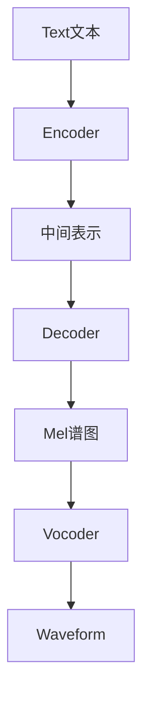
# 2. TTS模型的解决方案分析
## 2.1 Kokoro
模型下载地址：https://huggingface.co/hexgrad/Kokoro-82M
### 2.1.1 Kokoro的设计
结构模块
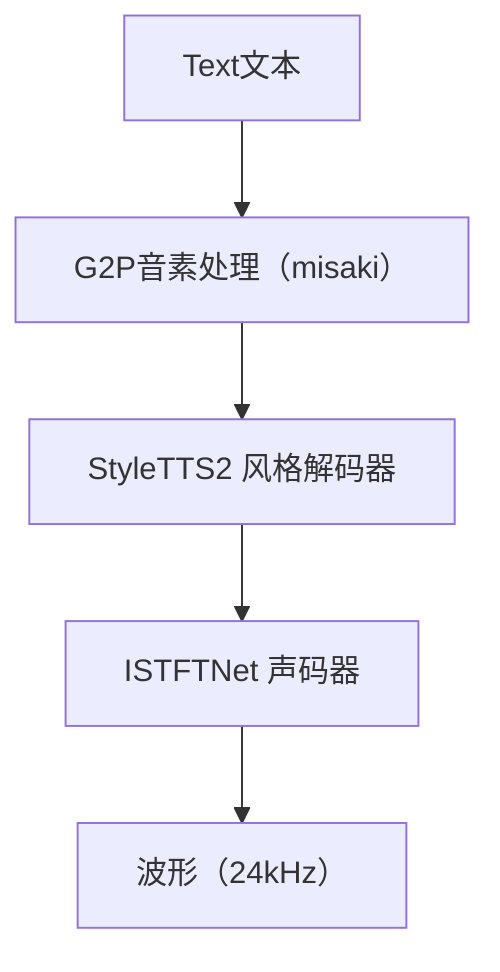
特点：
- 没有 Encoder（直接处理 phoneme）
- 解码器是一种前馈非递归结构（Conv1D/FFN）
- 不使用 transformer，不使用自回归或扩散
- 风格、韵律作为条件向量在解码器注入
- vocoder 为 ISTFTNet：轻量、快速、可 ONNX 推理
>Style TTS2论文地址：https://arxiv.org/abs/2306.07691
ISTFTNet论文地址：https://arxiv.org/abs/2203.02395
### 2.1.2 解决的问题

| 目标问题 | Kokoro 的应对方案 |
| --- | --- |
| 声音风格不够丰富 | 内置 style embedding 与多 speaker 选择（48+） |
| 部署门槛高 | 全 Python/PyTorch + ONNX 支持，一行 pip 安装 |
| 生成速度太慢 | 采用非自回归结构 + 轻量 vocoder（ISTFTNet） |
| 缺乏控制能力 | 明确建模 pitch/duration/energy 等 prosody 参数 |
| 许可证不清晰 | 使用 Apache 2.0，可商用、可微调 |

### 2.1.3 生产缺陷分析
#### 2.1.3.1 结构并行性强，但上下文建模弱
- 没有 encoder → 无法理解整句上下文，例如：“他今天很开心” vs “他今天很生气” 语调无法自然变化
- phoneme 直接送入 decoder，不带语言层次结构
- 在长文本或强上下文依赖的句子中，停顿节奏缺乏语义感知
- 并行可以一次生成，无 token by token 推理，但语义一致性差、无法模拟段落语气递进
#### 2.1.3.2 不使用扩散/transformer，声学建模能力受限
- 声音细节（如 breathiness、intonation contour）不如 VALL-E, StyleTTS2, Bark
- 用的是「解码器预测 Mel + vocoder合成」的经典 TTS 路线，声学精度已经接近上限
- prosody 预测虽可控，但质量有限（模型本身太小）
#### 2.1.3.3 音质与模型复杂度需要权衡
- 在保持速度的同时，牺牲部分音质
- 例如在高频段、鼻音、爆破音中可能产生 artifacts
- 情绪表达强度有限，不能做“怒吼、哭腔”等极端风格
#### 2.1.3.4 并发控制/模型推理线程不优化
- 在生产环境中，使用 PyTorch + Python 调用时，
  - 线程安全性不高
  - 无多模型管理框架（如 Triton、ONNX Runtime Server）
- 在高并发应用（如客服中心）需要自己额外封装 load balancing/queueing
## 2.2 CosyVoice
模型下载地址：https://huggingface.co/FunAudioLLM/CosyVoice2-0.5B
论文地址：https://arxiv.org/abs/2412.10117
### 2.2.1 CosyVoice的设计
结构模块
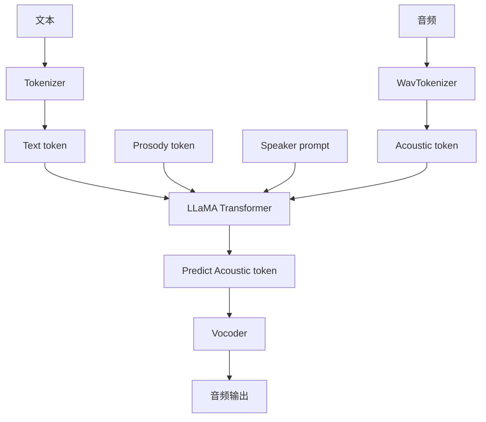
模块细节：

| 模块 | 实现说明 |
| --- | --- |
| Tokenizer | 使用标准 BPE tokenizer，将文本转为 token（支持中英混合） |
| WavTokenizer | 将音频离散化为 token（替代传统 Mel），对接 Transformer 解码器 |
| Transformer 模型 | 多模态自回归 Transformer，结构类似 LLaMA，融合文本与音频 token |
| Prosody Token | 控制 <laugh> <pause> <whisper> 等语气，通过 token 插入而非模型结构建模 |
| Vocoder | 支持 HiFi-GAN 或 SNAC：从音频 token 还原出波形，轻量、可低延迟部署 |

### 2.2.2 解决的问题

| 目标问题 | CosyVoice 的应对方案 |
| --- | --- |
| 传统结构复杂、推理慢 | 使用统一 Transformer 架构，无 encoder，直接 token 输入输出，简化结构 |
| 韵律控制缺乏 | 插入 prosody token（如 <laugh>）进行表达控制，无需训练专门情感模型 |
| 上下游不统一，TTS 不可控 | 文本与音频均离散化为 token，统一建模逻辑，支持 prompt 引导与 controllable generation |
| 多语言建模难度高 | 支持中英文双语训练，文本 tokenizer 原生多语言支持，token 层统一表达 |
| 缺乏对话式语音能力 | 与 LLM 相兼容的生成方式，可融合聊天上下文构造语音对话系统框架 |

### 2.2.3 生产缺陷分析
#### 2.2.3.1 自回归结构导致低并行性
- 模型采用类似 LLM 的 token-by-token 自回归生成方式；
- 所以必须顺序生成，不能并行处理长句子；
- 推理速度明显慢于 Fastspeech2 / StyleTTS2 等非自回归模型；
- 本质限制来自 Transformer decoder 架构：必须等待上一个 token 生成，才能预测下一个。
#### 2.2.3.2 韵律控制机制依赖 prompt，不适合稳定生产
- 控制风格依赖手动插入 prosody token；
- 风格输出质量高度依赖“prompt 编排技巧”；
- 相比 StyleTTS2 那种直接输入 style vector/embedding 的方式，控制不够结构化，缺乏可学习性与稳健性；
- 工程上难以自动构建稳定输出流。
#### 2.2.3.3 不具备说话人迁移能力（Zero-shot Speaker Cloning）
- 没有显式支持 speaker embedding；
- 也无法通过参考音频实现 voice cloning；
- 在需要高个性化语音（如虚拟人、客户定制声音）时能力明显不足。
## 2.3 ChatTTS
模型下载地址：https://huggingface.co/2Noise/ChatTTS
### 2.3.1 ChatTTS的设计
结构模块：
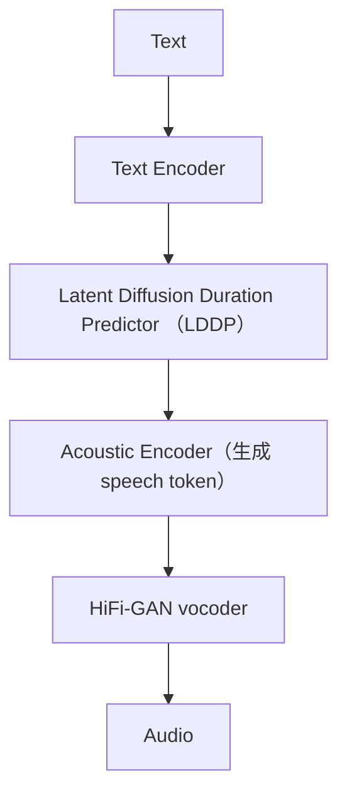
模块细节：
| 模块 | 实现说明 |
| --- | --- |
| Tokenizer | 使用标准 BPE tokenizer，将文本转为 token（支持中英混合） |
| WavTokenizer | 将音频离散化为 token（代替 Mel），作为 decoder 目标 |
| Text Encoder | 编码文本 token，为后续模块提供上下文向量表示 |
| Duration Predictor（LDDP） | 使用扩散模型预测 token 时长，实现自然的 prosody（节奏建模） |
| Acoustic Decoder | 自回归生成 speech token，逐帧构建语音表示 |
| Prosody Token | 控制 <laugh> <pause> <shout> 等 token，融入句子表达语气与节奏 |
| Vocoder | 支持 HiFi-GAN / EnCodec，从 speech token 还原波形，部署灵活 |
### 2.3.2 解决的问题
| 问题 | ChatTTS 的应对策略 |
| --- | --- |
| 模块依赖繁重 | 将各模块解耦实现模块化训练：支持独立训练 tokenizer、扩散式 duration 模型、vocoder，并通过中间 token 实现衔接，降低端到端耦合风险 |
| 推理链路长 | 使用统一 token 表达结构（文本 token → speech token → waveform），形成标准 token 流转路径，提升模块协同效率；支持 HiFi-GAN 简化后端 |
| 精调难度高 | 控制逻辑显式化：通过插入 prosody token 进行风格表达，无需训练额外风格模型，降低数据依赖性与微调复杂度 |
### 2.3.3 生产缺陷分析
#### 2.3.3.1 自回归结构导致低并行性
- 采用 Transformer Decoder + 自回归机制，逐 token 生成；
- 必须等待上一个 speech token 完成后才能生成下一个。
#### 2.3.3.2 架构复杂，模块多，维护难度高
- 模块依赖繁重：包含 tokenizer、扩散预测器、解码器、vocoder 等多个组件，难以统一训练和调优
- 推理链路长：任一模块出错都会影响语音质量和时序控制
- 精调难度高：控制 token 和 style embedding 的效果对数据依赖性强
#### 2.3.3.3 控制 token 可解释性弱，生成不稳定
- 控制 token 无标准，例如 [laugh], [pause], [sad] 插入后表现不一致，需人工调参
- token 组合效应复杂，多种控制 token 组合时可能产生非预期语音效果（如节奏错乱）
## 2.4 Chatterbox
模型下载地址：https://huggingface.co/calcuis/chatterbox-gguf
### 2.4.1 Chatterbox设计
结构模块
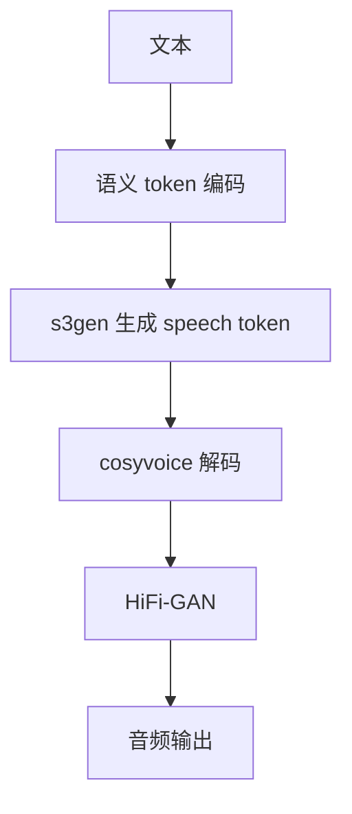
模块细节：
| 模块 | 算法思路 |
| --- | --- |
| Text Encoder（LLM） | 使用语言模型（如 LLaMA）对文本编码 |
| s3gen（Speech Semantic Sequence Generator） | 模仿 VALL-E 概念，预测离散 speech token |
| t3_cfg（TTS Config） | 模型结构定义，包括 vocoder 类型、tokenizer 配置等 |
| CosyVoice（Decoder） | 非自回归解码器 |
| HiFi-GAN（Vocoder） | 卷积 + 判别器生成器网络 |
>s3资料：https://github.com/xingchensong/S3Tokenizer
### 2.4.2 解决的问题
| 目标问题 | Chatterbox 的应对策略 |
| --- | --- |
| 韵律控制难 | 插入 prosody token 进行表达控制，无需额外标签或门控模型 |
| 文本与语音结构割裂 | 使用离散语音 token 接入统一 token 管线，增强上下游协同性 |
| 多语言支持差 | 支持原生中英混合输入，统一 token 层表达结构 |
| 缺乏上下文/对话支持 | 融合 LLM 输出 token 序列，为构建对话式语音框架打基础 |
### 2.4.3 生产缺陷分析
#### 2.4.3.1 中间 token 不透明
- s3gen 的 speech token 无明确可解释性，不利于后期调试和控制语气、情绪等属性
#### 2.4.3.2 上下文管理能力不足
- 当前设计偏向单轮推理，不支持长对话缓存，难以用于多轮语音对话代理场景
#### 2.4.3.3 链条长、依赖多模块
- 多模块组合（LLM + s3gen + CosyVoice + vocoder），整体系统鲁棒性下降，难以整体优化
## 2.5 Dia
模型下载地址：https://huggingface.co/calcuis/dia-gguf
### 2.5.1 Dia设计
结构模块：
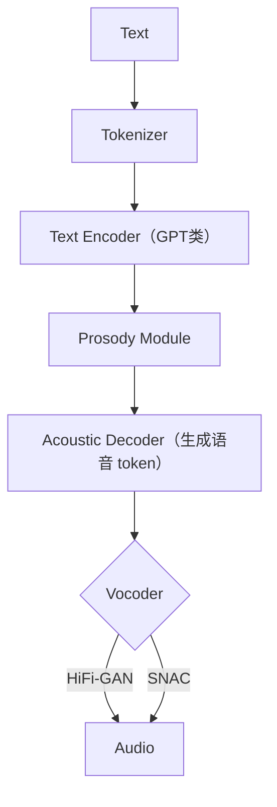
模块细节：
| 模块 | 描述 |
| --- | --- |
| Text Encoder | 多为 GPT 类结构，对输入文本建模；捕捉上下文语义与语调提示。 |
| Prosody Module | 控制语气、节奏、情感状态（可能为 embedding + classifier）。 |
| Decoder | 将编码后的语义映射成声学 token（可能是 codec 表征或 Mel 特征）。 |
| Vocoder | 常用 HiFi-GAN，将声学 token 转为可播放音频（.wav 或 .mp3）。 |
### 2.5.2 解决的问题
| 目标问题 | dia-gguf 的应对策略 |
| --- | --- |
| 缺乏自然对话语调 | 引入 prosody token（如 <laugh>、<pause> 等）表达语气变化，构建对话感知式发音风格 |
| 推理门槛高，部署复杂 | 通过 GGUF 格式封装 + 多级量化（Q2/Q4/Q6/F16），支持在 CPU 离线运行，无需专业 GPU |
| 模型部署格式割裂 | 使用 GGUF 标准格式封装模型参数与结构信息，兼容 TTS.cpp / gguf-connector 等框架，实现跨平台运行 |
### 2.5.3 生产缺陷分析
#### 2.5.3.1 声学解码器可能成为瓶颈
- 如果使用高保真的 decoder（如基于 VQ-VAE 或 GAN 的声码器），推理阶段的效率依赖于声码器本身。
- 当前 gguf‑connector 主要以 C++ 实现，不如 GPU 端的 HiFi-GAN 高效。
#### 2.5.3.2 缺乏灵活风格迁移机制
- 当前版本主要针对单一对话风格，不支持多说话人、多情绪场景下的样式迁移或情感控制。
- 无 encoder-decoder 分离结构，导致风格迁移可扩展性受限。
#### 2.5.3.3 精度与自然度折中明显
- 低 bit 量化（如 Q2）虽然推理快，但容易出现语音破碎、细节缺失现象，不适合高保真场景。
- 若部署在语音助手或主播系统中，对音质敏感的用户体验会下降。
## 2.6 orpheus-3b-0.1-ft.gguf
模型下载地址：https://huggingface.co/canopylabs/orpheus-3b-0.1-ft
### 2.6.1 Orpheus的设计
结构模块：
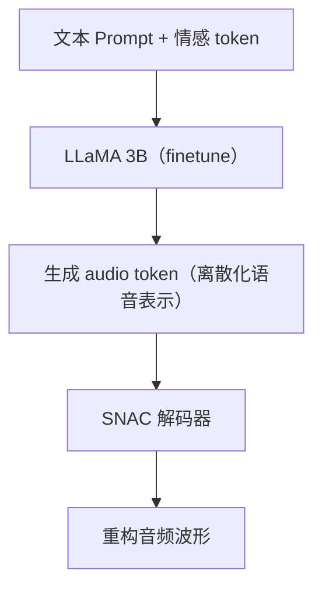
模块细节：
- LLaMA 3B 结构：基础是 Meta 的 Transformer 架构，Orpheus 对其进行 SFT（Supervised Finetuning）以学习音频 token 预测。
- tokenization：借助 SoundStorm 系列中的 audio codec，对音频进行离散化（类似 VQVAE）形成训练目标。
- 输出形式：模型最后阶段预测多个音频 token 序列（token-class level autoregression），可拼接重构语音。
- 解码器：使用 [SNAC (Streaming Non-Autoregressive Codec)] 解码音频 token 成最终 waveform。
### 2.6.2 解决的问题
| 问题 | 解决方案 |
| --- | --- |
| 多模块部署复杂 | 将 TTS 融入 LLM，构建单模型结构，直接生成音频 token |
| 推理延迟高 | 使用低位量化（Q4_K_M），结合 GGUF 格式，加速推理 |
| 情绪无法控制 | 引入 <laugh>、<sigh>、<giggle> 等 prompt 控制 token |
| 云服务依赖 | 可本地运行于 llama.cpp / LM Studio，无需云端推理 |
| 与 LLM 分离 | 与 LLM 对话结构兼容，可直接多模态对话生成语音响应 |
### 2.6.3 生产缺陷分析
#### 2.6.3.1 情感控制缺乏结构建模：
- 情感只是通过“prompt token”插入控制，缺少系统性的情绪建模模块；
- 可能导致相同 <laugh> 表现出不稳定、偶尔失效的情况（prompt injection不稳定性）。
#### 2.6.3.2 解码器绑定强：
- 使用 SNAC 解码器，意味着最终声音质量与 audio codec 紧密绑定，不可自由替换为 HiFi-GAN 等；
- 如果 codec 出现 artifacts，则整个系统难以替换解码模块独立优化。
#### 2.6.3.3 定制化困难：
- 不支持零样本声音克隆（zero-shot speaker cloning）；
- 想生成用户自定义声音仍需“微调”，存在训练门槛。
## 2.7 Llama‑OuteTTS‑1.0‑1B‑Q4_K_M.gguf
模型下载地址：https://huggingface.co/OuteAI/Llama-OuteTTS-1.0-1B
### 2.7.1 OuteTTS的设计
结构模块：
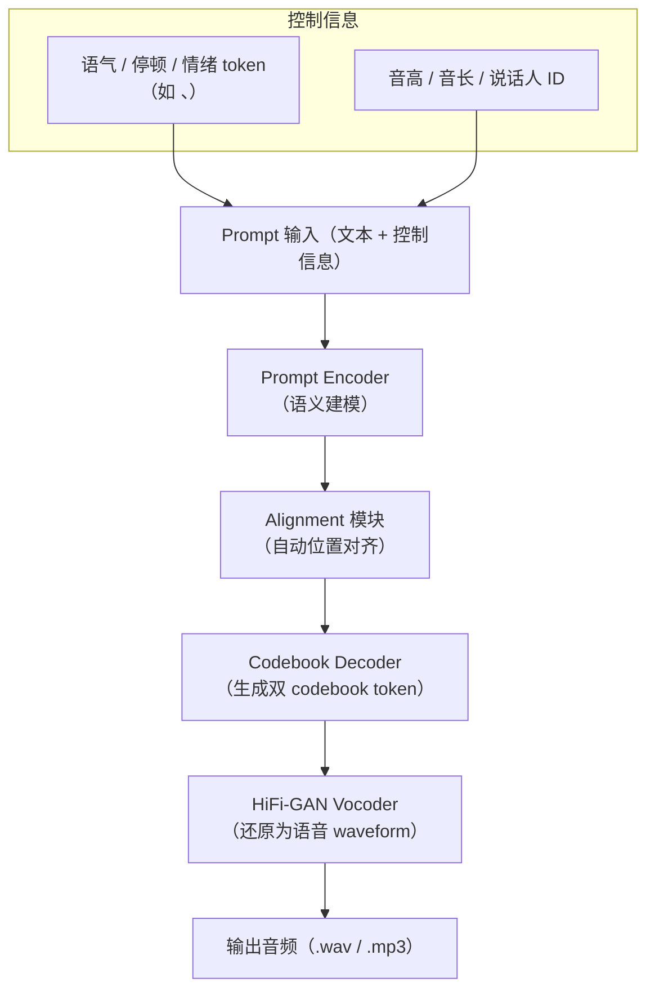

模块细节：
| 模块 | 描述 |
| --- | --- |
| Prompt Encoder | 输入为自然语言 prompt（带上下文、说话人、音色等信息），类似指令引导模型生成语音内容。 |
| Alignment 模块（内部建模） | 内嵌对齐能力，无需 external alignment tool，基于 transformer 自建位置到 token 映射。 |
| Codebook Decoder | 将文本映射为 DAC 编码器下的双 codebook token（例如 codec-C1、codec-C2），作为音频内容的潜在表示。 |
| Vocoder（HiFi-GAN） | 将 DAC codebook 或语音特征映射为最终可播放音频（支持 .wav），部署于 CPU/GPU。 |
### 2.7.2 解决的问题
| 目标问题 | Llama-OuteTTS 的应对策略 |
| --- | --- |
| 多语言 TTS 无需预处理 | 直接支持中、英、日、阿语等语言，无需转拼音或强制空格。 |
| 对齐困难、需要外部 CTC | 模型内建对齐机制，直接将文字对齐至生成 token，无需外部对齐工具。 |
| 音质与吞吐矛盾 | DAC + 双 codebook 提高音质；每秒生成 150 token，速度相对同类扩散模型大幅提升。 |
| 模型调用复杂 | GGUF 格式封装结构 + llama.cpp 支持，本地部署更简洁。 |
### 2.7.3 生产缺陷分析
#### 2.7.3.1 音频编码瓶颈
- 当前主要使用基于 DAC 的双 codebook 表达方式，虽然提升了音质，但：
  - 解码器（HiFi-GAN）仍为瓶颈，尤其在边缘设备上存在推理时延；
  - 如果后续使用更复杂模型（如 VQ-VAE），其并行性与高效推理将更成问题；
  - 当前 gguf-connector 基于 C++ 实现，尚不支持移动端原生部署（如 Android/iOS TensorDelegate）。
#### 2.7.3.2 并行性与上下文依赖
- 模型强依赖上下文记忆（如 token 间时序依赖），推理中：
  - 不能像一些自回归扩散模型那样大幅并行，推理仍为串行主导；
  - sampling 阶段需要设定重复惩罚窗口（默认 64 token）；
  - 高上下文长度（例如 8192）虽然支持，但部署时 memory cost 显著增加。
#### 2.7.3.3 风格迁移与个性控制不足
- 当前版本主要针对“单人+语调控制”优化，风格迁移机制不够完善：
  - 缺少基于 embedding 的说话人控制机制；
  - 多情绪、多风格还需通过 prompt 微调，而非显式 token 控制；
  - 未来需要引入 speaker encoder 或风格/情绪向量。
## 2.8 F5-TTS
论文地址：https://arxiv.org/abs/2410.06885
模型下载地址：https://huggingface.co/SWivid/F5-TTS
### 2.8.1 F5-TTS的设计
结构模块：
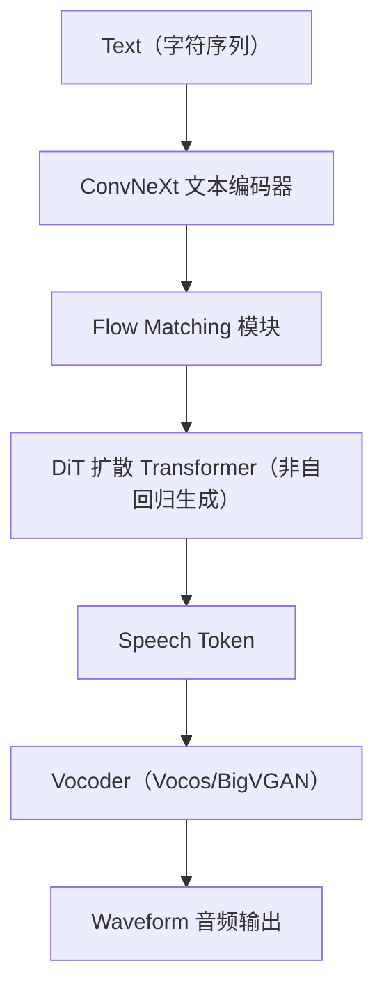
模块细节：
| 模块 | 描述 |
| --- | --- |
| ConvNeXt 文本编码器 | 用于提取文本的全局特征，具备并行卷积能力 |
| Flow Matching | 用于训练过程中学习 noise → speech token 的映射路径 |
| DiT（Diffusion Transformer） | 核心合成器，基于扩散建模的并行语音 token 生成器 |
| Sway Sampling | 推理阶段优化采样路径，减少无效扩散步骤，提升速度和质量 |
| Vocoder | 使用 BigVGAN 或 Vocos 将 speech token 还原为波形音频 |
### 2.8.2 解决的问题
| 问题 | F5-TTS 的解决方案 |
| --- | --- |
| 音素对齐、duration 依赖 | 输入字符直接填充对齐，不依赖时长预测器或对齐器 |
| 语音质量不自然、克隆能力弱 | 采用扩散式语音 token 合成，配合 sway sampling 技术提升自然度 |
### 2.8.3 生产缺陷分析
#### 2.8.3.1 推理需采样多步
虽然 sway sampling 已优化，但推理仍需执行扩散采样过程（约 20 步）
#### 2.8.3.2 对声码器依赖
最终语音质量高度依赖 vocoder（如 vocos、BigVGAN），需单独部署
#### 2.8.3.3 音频长度控制弱
没有显式的 duration predictor，语速控制需通过额外的 prompt 或采样技巧
#### 2.8.3.4 许可限制
使用 CC-BY-NC-4.0 开源协议，不能直接商业使用，需要遵循授权条款
## 2.9 Index-TTS
论文地址：https://arxiv.org/abs/2502.05512
模型下载地址：https://huggingface.co/IndexTeam/Index-TTS
### 2.9.1 Index-TTS的设计
结构模块：
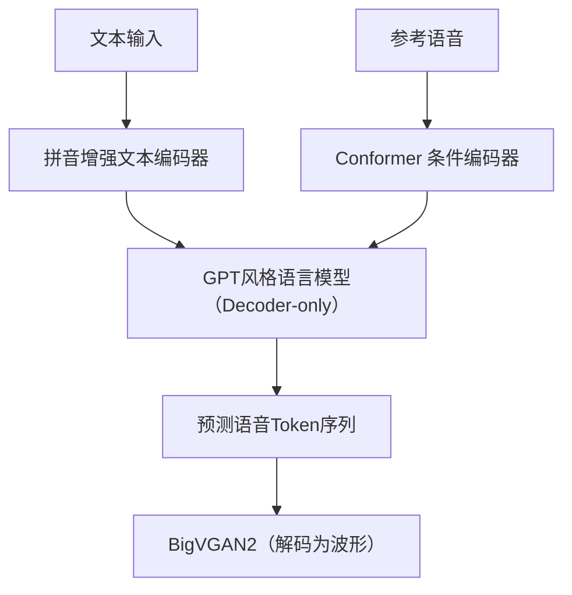
模块细节：
| 模块名称 | 功能说明 |
| --- | --- |
| 文本编码器（字符 + 拼音） | 中文支持拼音输入，英文直接字符建模- 能准确捕捉发音特征，解决多音字、轻声等复杂读音问题 |
| 神经音频 tokenizer | 使用 FSQ 编码器，将音频转为离散 token- 每帧（25Hz）用多个 codebook 表达，token 使用率达 98%，远高于 VQ |
| LLM-style Decoder（GPT结构） | Decoder-only Transformer 架构- 条件输入包括文本 token 和参考音频- 支持多说话人迁移与零样本语音生成 |
| 条件 Conformer 编码器 | 编码参考音频中音色、节奏、韵律等隐含特征- 提供稳定控制向量输入 GPT，提升稳定性与音色还原度 |
| BigVGAN2 | 解码最终音频波形- 兼顾高保真度与实时合成性能 |
### 2.9.2 解决的问题
| 问题 | IndexTTS 的解决方案 |
| --- | --- |
| 多音字控制 | 字符+拼音联合建模，可显式指定发音 |
| 说话人一致性差 | 引入 Conformer 条件模块，用参考语音增强控制能力 |
| 音频 token 利用率低 | 使用 FSQ 替代 VQ-VAE，有效利用 codebook，提升表达力 |
| 模型稳定性差 | 分阶段训练 + 条件控制，减少发散，保证合成质量 |
| 英文兼容差 | IndexTTS 1.5 强化英文 token 学习，增强跨语种适应性 |
| 推理慢 | GPT 解码器 + BigVGAN2，兼顾自然度与速度，可部署工业系统 |
### 2.9.3 生产缺陷
#### 2.9.3.1 韵律控制依赖参考音频
- 当前系统的韵律（prosody）生成主要依赖输入的参考音频隐式引导；
  - 缺少显式韵律标注或 token 控制机制，无法手动控制停顿、重读、语调等信息；
  - 在参考音频不理想或风格差异较大时，韵律迁移效果容易出现不自然或不一致的问题；
- 不利于模板化大规模应用场景（如客服、朗读）中的可控性与稳定性需求。
#### 2.9.3.2 生成不确定性
- 使用 GPT-style 自回归生成结构，虽然语音自然度高，但存在一定的不确定性：
  - 同一输入在不同推理轮次中，生成语音可能在语速、韵律、轻微音色上存在波动；
  - 难以完全复现生成结果，不利于音频缓存与版本管理；
- 在高一致性要求的场景（如影视后期、法律合成）中，可能影响交付稳定性。
#### 2.9.3.3 说话人迁移非完全端到端
- 当前说话人控制模块仍依赖显式的参考音频 embedding（如 speaker encoder）作为条件向量输入；
  - 说话人向量需要外部模块提取，非 end-to-end 整合；
  - 当参考音频质量低或说话风格变化大时，克隆效果不稳定；
- 不支持完全文本驱动的说话人指定（如指定 speaker ID 生成），限制了自动化部署灵活性。
#### 2.9.3.4 context-window 限制
- GPT 模型对上下文 token 的建模能力受限于其 context window 大小：
  - 目前支持最长 8192 token，但随着句长提升，memory cost 呈线性上升；
  - sampling 阶段需要滑动窗口进行生成，限制生成效率；
- 特别是在生成长文本、多段对话语音时，存在“越生成越慢”的性能瓶颈。
## 2.10 Mega-TTS3
论文地址：https://arxiv.org/html/2502.18924v4
模型下载地址：https://huggingface.co/ByteDance/MegaTTS3
### 2.10.1 Mega-TTS3的设计
结构模块：
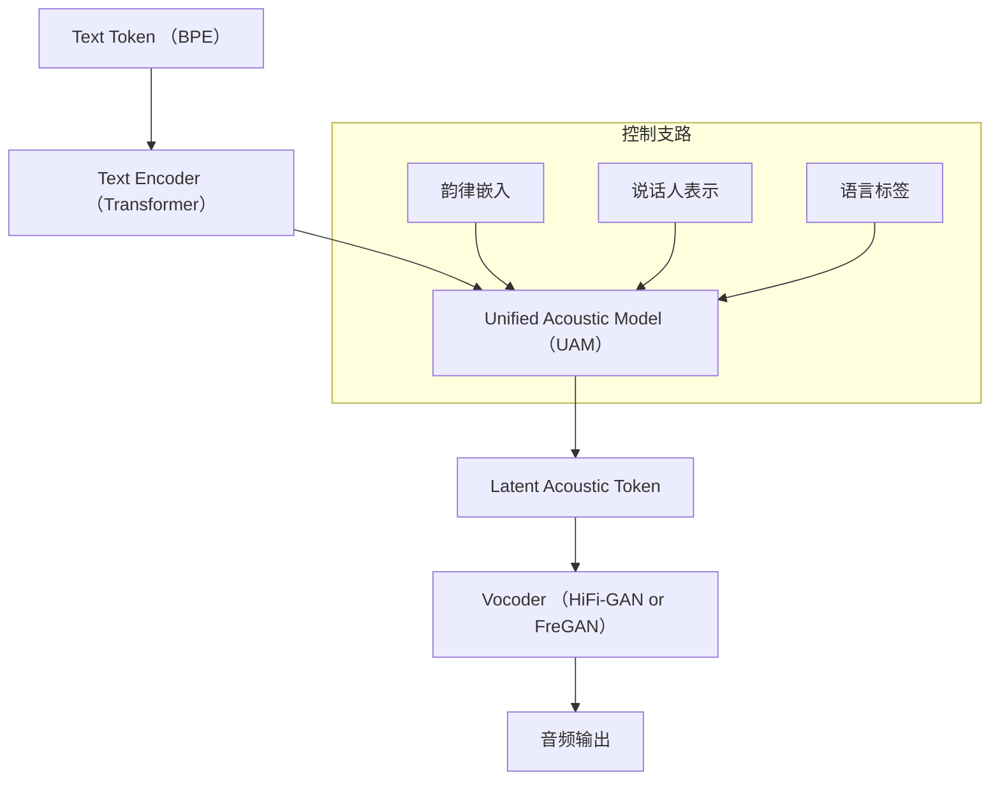
模块细节：
| 模块 | 说明 |
| --- | --- |
| ext Encoder | 将输入文本 token 编码为语义向量，支持多语言 token。 |
| UAM（统一建模器） | 核心模块，融合 Text、Prosody、Speaker、Language 信息，预测 acoustic latent。 |
| Continuous Speaker Modeling | 跨时序建模说话人信息，减少风格漂移问题。 |
| Prosody Control Module | 提供独立的韵律控制器，可精确调控停顿、节奏、音高等。 |
| Vocoder | 最终将 latent token 解码为音频波形，使用 HiFi-GAN / FreGAN。 |
### 2.10.2 解决的问题
| 问题 | 描述 | Mega-TTS3 的解决方案 |
| --- | --- | --- |
| 建模粒度不一致 | 不同模块（文本、韵律、语音）建模粒度不统一，导致信息割裂、风格迁移失真。 | 引入 统一建模器（Unified Acoustic Model, UAM），融合文本编码、韵律信息、语言标签与音频 latent 统一建模，避免阶段性信息丢失。 |
| 多说话人建模难 | 传统嵌入方式难以稳定建模大量说话人，泛化性与合成一致性不足。 | 提出 连续说话人建模（Continuous Speaker Embedding），将说话人表示作为时序向量嵌入统一建模过程，提高风格一致性和迁移稳定性。 |
| 控制粒度弱 | 控制情绪、语速、韵律等风格时缺乏可插拔的独立控制机制。 | 设计 可插拔控制分支（Prosody / Emotion / Language / Speaker Embedding），每种控制信号独立建模，可组合使用、灵活插拔，提升控制精度。 |
| 多语种互扰问题 | 语言标签建模稀疏，多语种系统往往互相干扰，影响语音质量。 | 引入 显式语言标签嵌入 + 多语言共享 Transformer 参数机制，在保证语言辨识度的同时提升语种间共享性，缓解语种间干扰。 |
### 2.10.3 生产缺陷
#### 2.10.3.1 控制粒度有限 & 可解释性弱
- 控制维度虽多（情绪、语速、韵律等），但目前仍依赖端到端模型隐式建模：
  - 缺乏可插拔式独立控制模块；
  - 控制变量间耦合强，难以精准调控单一维度；
  - 不适合面向工业部署的“可控可解释合成”场景。
#### 2.10.3.2 多语种语音质量不均
- 尽管支持多语言建模，但实际生成中仍会出现：
  - 语种标签依赖严重，标签错误会直接导致发音错乱；
  - 存在语言间互扰问题（如中英混读时口音漂移）；
  - 低资源语种生成效果显著低于高资源语种。
# 3. 总结
- 经典 TTS：专注声音克隆，表达受限，缺乏在动态、上下文敏感的对话中灵活适应的能力。
- 级联 STT–LLM–TTS：可用但难捕捉语音细腻之处，LLM 接收的转录文本丢失了语音中丰富的韵律、情感等线索。
- 音频编码器/神经编解码器：桥接连续音频与 LLM 离散 token，音频编码器必须在关键信息的保存与紧凑、离散的表示需求之间取得平衡。与此同时，神经编解码器面临着与标记速率相关的挑战——因为语音通常每秒产生的标记远多于文本——以及量化过程中细粒度声学细节的潜在损失。
- 全端到端融合（如 Moshi、CSM）：打破模块界限，实现真正的上下文感知对话式语音。