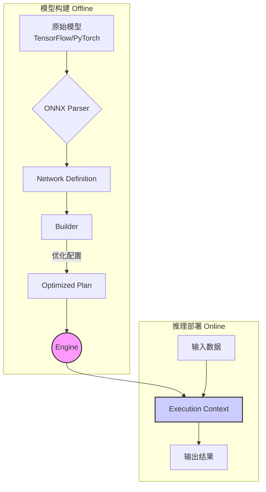
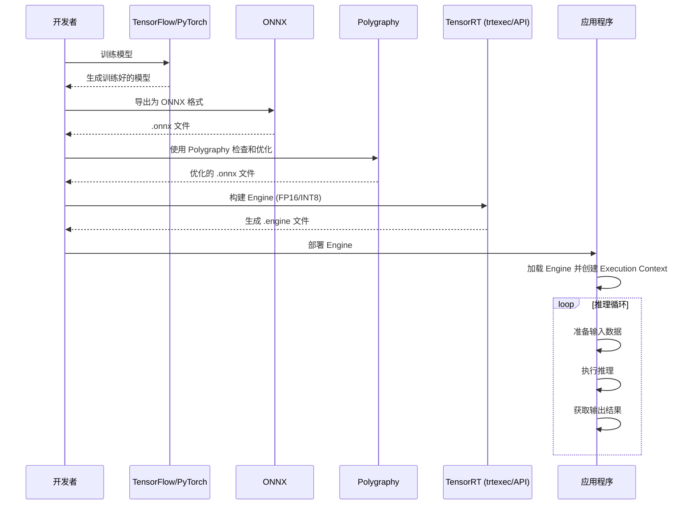

# NVIDIA TensorRT 详细技术文档

## 1. 引言

NVIDIA® TensorRT™ 是一个用于在 NVIDIA GPU 上进行高性能深度学习推理的软件开发套件（SDK）。它旨在优化和加速经过训练的神经网络，使其能够在生产环境中以低延迟和高吞吐量的方式运行。TensorRT 接收来自主流深度学习框架（如 TensorFlow、PyTorch、ONNX 等）的模型，通过一系列复杂的优化技术，生成一个高度优化的运行时引擎（Runtime Engine）。

本文档将深入浅出地介绍 TensorRT 的核心概念、关键特性、工作流程以及最新的功能，帮助开发者充分利用其强大的性能优势。

## 2. 核心概念

理解 TensorRT 的核心组件是有效使用它的第一步。

*   **Engine**: TensorRT 的核心。它是一个经过优化的模型表示，包含了针对特定 GPU 架构和配置（如批量大小、精度）生成的计算图和权重。Engine 是不可修改的，并且是部署的最终产物。
*   **Builder (`IBuilder`)**: 这是创建 Engine 的主要接口。Builder 接收一个网络定义，并应用各种优化，最终生成一个针对目标 GPU 的优化计划（Plan），该计划可以被序列化为 Engine。
*   **Network Definition (`INetworkDefinition`)**: 这是您用来定义模型结构的地方。您可以从头开始手动构建网络，或者使用 Parser 从模型文件中导入。
*   **Parser**: 用于将来自不同框架的模型（主要是 ONNX 格式）解析并转换为 TensorRT 的网络定义。TensorRT 提供了强大的 ONNX 解析器。
*   **Profiler (`IProfiler`)**: 一个可选的接口，允许您在构建过程中收集和查询关于层性能的信息。这有助于调试和理解哪些层是性能瓶颈。
*   **Execution Context (`IExecutionContext`)**: 这是执行推理的主要接口。一个 Engine 可以有多个 Execution Context，允许并发执行推理任务。每个上下文都维护自己的输入、输出和状态。



## 3. 关键特性和优化技术

TensorRT 的高性能源于其先进的优化技术。

### 3.1. 精度校准与量化 (Precision Calibration & Quantization)

TensorRT 支持多种精度进行推理，包括 FP32、FP16、INT8，以及最新的 FP8。其中，INT8 量化是提升性能、降低内存占用的关键技术。

*   **训练后量化 (Post-Training Quantization, PTQ)**: 在不重新训练模型的情况下，通过一个校准数据集来确定将 FP32 权重和激活值转换为 INT8 所需的缩放因子。
*   **量化感知训练 (Quantization-Aware Training, QAT)**: 在训练过程中模拟量化操作，使模型对量化误差更具鲁棒性，从而在转换为 INT8 时获得更高的精度。

您可以使用 `QuantizationSpec` 来精确控制哪些层或哪些类型的层需要被量化。

```python
# 示例：仅量化 'Conv2D' 类型的层
q_spec = QuantizationSpec()
q_spec.add(name='Conv2D', is_keras_class=True)
q_model = quantize_model(model, quantization_mode='partial', quantization_spec=q_spec)
```

### 3.2. 层与张量融合 (Layer & Tensor Fusion)

TensorRT 会智能地将多个独立的层合并成一个单一的、更复杂的层。这减少了 CUDA 内核的启动次数和内存读写，从而显著降低了延迟。

*   **垂直融合**: 将连续的、具有相同数据依赖性的层（如 Conv、Bias、ReLU）融合成一个 CBR 层。

    ```mermaid
    graph TD;
        subgraph "融合前"
            A[Input] --> B(Conv);
            B --> C(Bias);
            C --> D(ReLU);
            D --> E[Output];
        end
        subgraph "融合后"
            A2[Input] --> F((Conv + Bias + ReLU));
            F --> E2[Output];
        end
    ```

*   **水平融合**: 将具有相同输入但执行不同操作的并行层融合在一起。

    ```mermaid
    graph TD;
        subgraph "融合前"
            A[Input] --> B(Conv A);
            A --> C(Conv B);
            B --> D[Output A];
            C --> E[Output B];
        end
        subgraph "融合后"
            A2[Input] --> F((Conv A + Conv B));
            F --> D2[Output A];
            F --> E2[Output B];
        end
    ```

### 3.3. 内核自动调整 (Kernel Auto-Tuning)

针对特定的目标 GPU 架构，TensorRT 会从一个包含多种实现的库中，为每个层选择最优的 CUDA 内核。它会根据当前的批量大小、输入尺寸和参数来测试不同的算法和实现，以找到最快的一个。

### 3.4. 动态形状 (Dynamic Shapes)

TensorRT 能够处理输入张量尺寸在运行时可变的模型。在构建 Engine 时，您可以指定一个优化配置文件（Optimization Profile），其中包含输入的最小、最优和最大尺寸。TensorRT 会根据这些信息生成一个可以在指定范围内高效处理任何输入尺寸的 Engine。

### 3.5. 插件 (Plugins)

对于 TensorRT 原生不支持的自定义或特殊层，您可以通过插件 API (`IPluginV2`) 来实现自己的逻辑。这为 TensorRT 提供了极大的扩展性。

最新的 TensorRT 版本通过装饰器极大地简化了插件的注册过程，特别是对于 Python API。

```python
# 示例：注册一个简单的元素级加法插件
import tensorrt.plugin as trtp

@trtp.register("sample::elemwise_add_plugin")
def add_plugin_desc(inp0: trtp.TensorDesc, block_size: int) -> trtp.TensorDesc:
    return inp0.like()
```

### 3.6. 稀疏性 (Sparsity)

TensorRT 支持利用 NVIDIA Ampere 及更高架构 GPU 上的结构化稀疏性特性。如果您的模型权重具有 2:4 的稀疏模式，TensorRT 可以利用稀疏张量核心（Sparse Tensor Cores）来进一步加速计算，性能几乎翻倍。

## 4. 工作流程

一个典型的 TensorRT 部署流程如下：



1.  **模型导出**: 从您的训练框架（如 PyTorch 或 TensorFlow）中，将训练好的模型导出为 ONNX 格式。ONNX 是一个开放的模型交换格式，是连接训练和推理的桥梁。

2.  **模型检查与优化 (Polygraphy)**: 在构建 Engine 之前，强烈建议使用 **Polygraphy** 工具集来检查、修改和优化您的 ONNX 模型。Polygraphy 是一个功能强大的工具，可以：
    *   **检查模型**: 显示模型的层、输入输出等信息。
    *   **常量折叠**: 预先计算模型中的常量表达式，简化计算图。
        ```bash
        polygraphy surgeon sanitize model.onnx -o folded.onnx --fold-constants
        ```
    *   **比较不同框架的输出**: 验证 TensorRT 与原始框架（如 ONNX Runtime）的输出是否一致，以排查精度问题。
        ```bash
        polygraphy run model.onnx --trt --onnxrt
        ```
    *   **处理数据依赖形状 (DDS)**: 识别并为具有数据依赖形状的张量设置上界。

3.  **构建 Engine**: 使用 `trtexec` 命令行工具或 TensorRT 的 C++/Python API 来构建 Engine。
    *   **`trtexec`**: 一个方便的命令行工具，用于快速从 ONNX 文件构建 Engine 并进行性能基准测试。
        ```bash
        trtexec --onnx=model.onnx --saveEngine=model.engine --fp16
        ```
    *   **API**: 提供更灵活的控制，例如定义动态形状的优化配置文件、配置插件等。

4.  **部署与推理**: 将序列化后的 Engine 文件加载到您的应用程序中，并使用 Execution Context 来执行推理。
    ```python
    # 使用 Polygraphy 的 TrtRunner 进行推理
    from polygraphy.backend.trt import TrtRunner, EngineFromBytes

    # 加载 Engine
    engine = EngineFromBytes(open("model.engine", "rb").read())

    with TrtRunner(engine) as runner:
        # 准备输入数据
        feed_dict = {"input_name": input_data}
        # 执行推理
        outputs = runner.infer(feed_dict=feed_dict)
    ```

## 5. 最新功能亮点

TensorRT 正在快速迭代，以下是一些最新的重要功能：

*   **Polygraphy 工具增强**:
    *   **简化的 CLI 语法**: 允许在单个参数中同时指定脚本和函数名 (`my_script.py:my_func`)。
    *   **改进的输入规范**: 使用新的列表式语法 (`--input-shapes input0:[x,y,z]`) 来避免歧义。

*   **快速部署插件 (Quickly Deployable Plugins)**:
    *   Python API 引入了 `@trtp.register` 和 `@trt.plugin.autotune` 装饰器，使得定义、注册和自动调整插件变得前所未有的简单，无需编写 C++ 代码。

*   **CUDA 图 (CUDA Graphs)**:
    *   通过 `--use-cuda-graph` 标志，TensorRT 可以利用 CUDA Graphs 来捕获整个推理过程，进一步减少 CPU 开销和内核启动延迟，特别适用于模型结构固定的场景。

*   **FP8 支持**:
    *   在 Hopper 及更高架构的 GPU 上，TensorRT 支持 FP8 推理，为大型语言模型等提供了更高的性能和更低的内存占用。

## 6. 附录：常用命令

*   **安装 Polygraphy**:
    ```bash
    python3 -m pip install polygraphy --extra-index-url https://pypi.ngc.nvidia.com
    ```
*   **构建并安装 TensorRT 开源组件**:
    ```bash
    # 从源码目录
    make install
    ```
*   **运行 pytest 测试**:
    ```bash
    pytest --verbose
    ```

希望这份文档能帮助您更好地理解和使用 NVIDIA TensorRT。