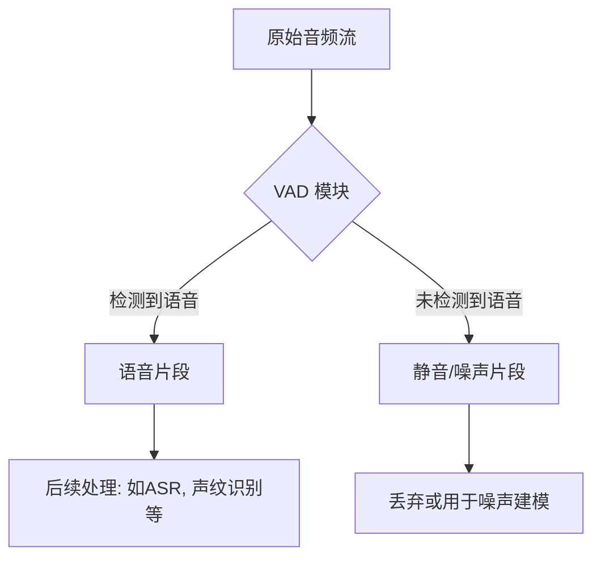
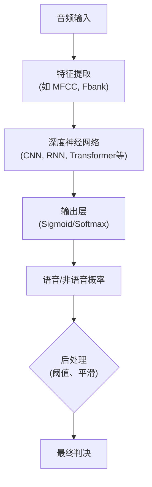
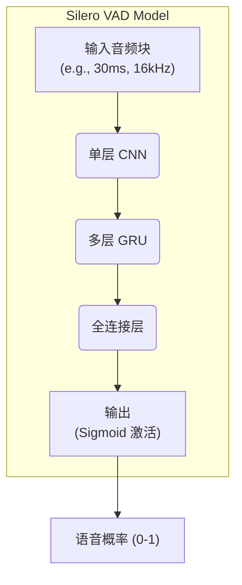
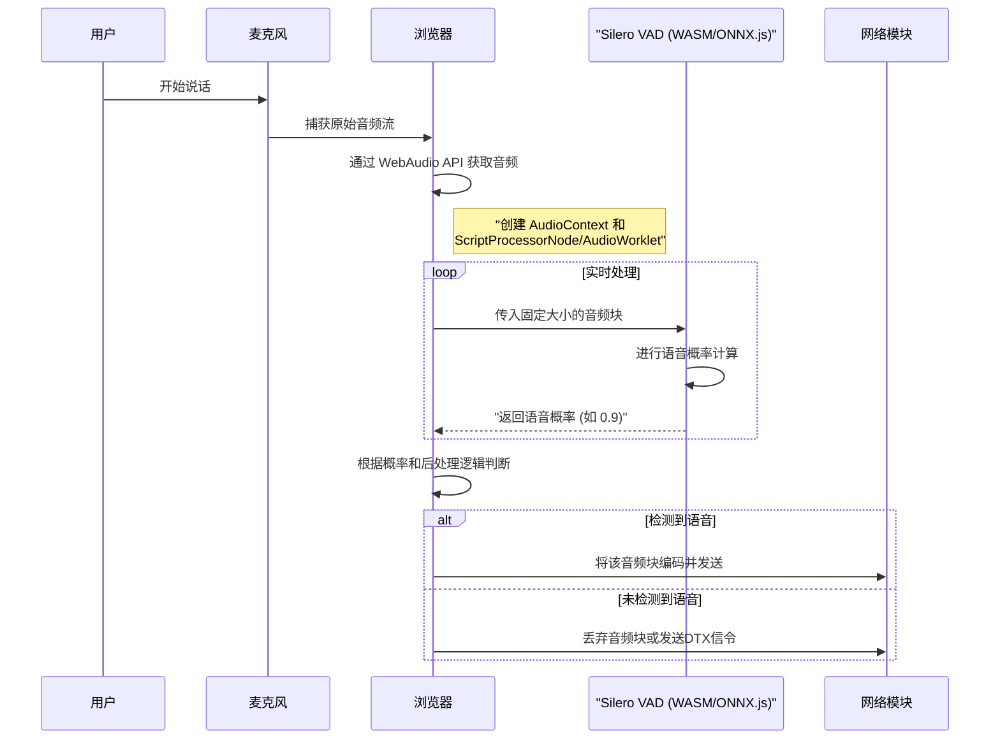
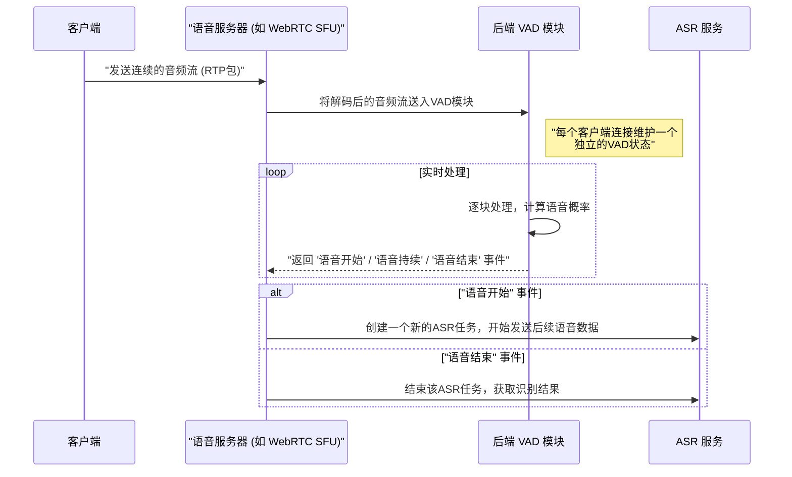

# VAD (Voice Activity Detection) 技术深度剖析

## 1. VAD 技术概述：从宏观层面理解

### 1.1 什么是 VAD？

VAD（Voice Activity Detection），即语音活动检测，是一种旨在从音频信号中准确识别出人类语音存在与否的技术。其核心任务是将一段音频流切分为两个部分：**包含语音的片段**和**不包含语音的静音/噪声片段**。

从宏观上看，VAD 是语音处理流水线中的“看门人”或“预处理器”。在任何需要处理人类语音的系统中，它都是至关重要且通常是第一步。

### 1.2 为什么 VAD 如此重要？

VAD 的应用价值体现在以下几个关键方面：

*   **节省计算资源**：在自动语音识别（ASR）等计算密集型任务中，只对检测到的语音片段进行处理，可以避免对大量的静音和背景噪声进行无效计算，从而将计算资源（CPU/GPU）节约 50% 或更多。
*   **提升下游任务精度**：去除静音片段可以减少对 ASR 模型、声纹识别模型或情感分析模型的干扰，从而提升它们的准确率。
*   **优化网络带宽**：在实时语音通信（如 VoIP, WebRTC）中，静音片段可以不被传输或以极低码率传输（所谓的 "Discontinuous Transmission", DTX），从而显著降低网络带宽占用。
*   **改善用户体验**：在智能助手、语音交互等场景中，精确的 VAD 可以实现更自然的交互，避免在用户停顿时过早地中断识别，或在环境噪声中误触发。
*   **数据预处理和标注**：在构建大型语音数据集时，VAD 可以自动切分和标注出有效语音片段，极大地提升了数据处理效率。

## 2. VAD 的传统实现方法

在深度学习流行之前，VAD 主要依赖于人工设计的声学特征。这些方法计算简单、速度快，但在复杂噪声环境下的鲁棒性较差。

主要方法包括：

*   **基于能量（Energy-based）**：最简单的方法。通常认为语音信号的短时能量远大于背景噪声。通过设定一个能量阈值来区分语音和静音。
    *   **优点**：计算极其简单。
    *   **缺点**：对噪声和音量变化非常敏感，阈值难以设定。
*   **基于零交叉率（Zero-Crossing Rate, ZCR）**：ZCR 描述了信号穿过零值的频率。清音（如 's'）的 ZCR 较高，而浊音和背景噪声的 ZCR 较低。
    *   **优点**：对宽带噪声不敏感。
    *   **缺点**：对某些清音和噪声区分度不高。
*   **基于频谱特征**：例如频谱熵、频谱平坦度等。语音信号的频谱结构通常比噪声更复杂、更有规律，因此其频谱熵较低、频谱不平坦。
*   **组合特征**：实际应用中通常会组合多种特征（如能量+ZCR）并使用一些平滑滤波技术来提升稳定性。著名的 **WebRTC VAD** 就是一个基于高斯混合模型（GMM）的经典例子，它在多个频带上提取特征，具有较好的性能和效率。

## 3. 基于深度学习的 VAD

随着深度学习的发展，基于神经网络的 VAD 方法在性能上远超传统方法，尤其是在低信噪比（SNR）和复杂噪声环境中。其核心思想是**让模型自动从数据中学习语音和非语音之间的区别特征**，而不是依赖人工设计的规则。

这类模型的通用流程如下：

## 4. Silero VAD 模型深度剖析

**Silero VAD** 是目前业界领先的 VAD 模型之一，以其**极高的准确率、惊人的计算效率和对多语言的普适性**而闻名。其成果主要基于 `snakers4/silero-vad` 仓库。

### 4.1 核心特点

*   **高精度**：在多种噪声环境下，其准确率媲美甚至超过了许多大型、复杂的模型。
*   **极度轻量**：模型尺寸非常小（通常小于 1MB），使其可以轻松部署在浏览器、移动端甚至嵌入式设备上。
*   **语言无关**：它并非在特定语言上训练，而是学习人类语音的通用声学特性，因此对世界上几乎所有语言都有效。
*   **实时性**：处理延迟极低，非常适合实时通信应用。

### 4.2 模型架构

Silero VAD 的核心架构是 **CNN + GRU** 的混合模型。这种架构结合了两者的优点：

*   **CNN (卷积神经网络)**: 用于从原始音频或频谱图中提取局部的、具有平移不变性的特征。CNN 能够有效地捕捉声音事件的瞬时特性。
*   **GRU (门控循环单元)**: 一种 RNN（循环神经网络），用于处理序列数据。它能够捕捉音频信号在时间维度上的上下文依赖关系，例如一个音节的开始和结束。

其详细的架构可以宏观地理解为：

**掰开了揉碎了看细节**：

1.  **输入**：模型接收一小段音频作为输入，例如一个 480 样本的块（在 16kHz 采样率下等于 30 毫秒）。模型是**逐块（chunk-by-chunk）**处理的。
2.  **特征提取**：与许多模型不同，Silero VAD 可能直接在原始波形或非常底层的特征上操作，由第一层 CNN 自动学习有效的声学特征，而不是依赖于 MFCC 这种人工设计的特征。
3.  **CNN 层**：这一层像一个滤波器组，扫描输入的音频块，捕捉音素级别的微小模式。
4.  **GRU 层**：这是模型的记忆核心。每个音频块经过 CNN 处理后的特征向量被送入 GRU。GRU 的内部状态会根据当前输入和前一时刻的状态进行更新。这使得模型能够理解“我现在听到的声音是接着上一段声音的延续，还是一个全新的声音事件的开始”。这对于准确判断长段静音后的第一个词，或者一句话中间的短暂停顿至关重要。
5.  **全连接层 & 输出**：GRU 的输出经过一个或多个全连接层进行整合，最后通过一个 `Sigmoid` 函数，输出一个介于 0 和 1 之间的浮点数。这个数代表**当前输入音频块包含语音的概率**。

### 4.3 技术实现细节

*   **状态维持 (Stateful)**：为了处理连续的音频流，Silero VAD 是一个有状态的模型。你需要为每一路独立的音频流维持一个模型的内部状态（主要是 GRU 的隐状态）。在处理完一个音频块后，模型的隐状态需要被保存下来，并作为下一个音频块处理的输入。这样才能实现不间断的实时检测。
*   **采样率支持**：通常支持 8kHz 和 16kHz，这是语音通信中最常见的采样率。
*   **音频块大小 (Chunk Size)**：模型对输入音频块的大小有严格要求，例如 256、512、768（8kHz）或 512、1024、1536（16kHz）样本。开发者需要将麦克风或网络传入的音频流缓冲并分割成这些固定大小的块。
*   **后处理**：模型只输出单个块的语音概率。在实际应用中，还需要一个简单的后处理逻辑。例如：
    *   `trigger_level`: 语音激活阈值（如 0.5）。
    *   `speech_pad_ms`: 在语音结束信号发出后，额外保留一小段音频，以防过早切断。
    *   `min_silence_duration_ms`: 判定为静音段所需的最短时长。
    *   `min_speech_duration_ms`: 判定为语音段所需的最短时长，防止将短暂的噪声（如咳嗽）误判为语音。

## 5. VAD 在实时语音通信中的应用

### 5.1 前端应用 (浏览器/客户端)

在前端运行 VAD，可以在语音数据离开用户的设备前就进行处理，实现最大的带宽节省和最低的延迟。

**典型场景**：网页版在线会议、浏览器内嵌的客服对话系统。

**实现流程**：

**技术栈**:

*   **音频捕获**: `navigator.mediaDevices.getUserMedia()`
*   **音频处理**: Web Audio API (`AudioContext`, `AudioWorkletNode`)
*   **VAD 模型运行**:
    *   **WebAssembly (WASM)**: 将使用 C++/Rust 实现的 VAD 推理引擎编译成 WASM，获得接近原生的性能。Silero 官方就提供了这样的实现。
    *   **ONNX.js / TensorFlow.js**: 将 VAD 模型转换为 ONNX 或 TF.js 格式，直接在 JavaScript 中运行，部署更简单，但性能略低于 WASM。

### 5.2 后端应用 (服务器)

在后端运行 VAD，可以对所有汇入的音频流进行集中处理，适用于无法控制客户端行为的场景，或需要进行服务端录制、分析的场景。

**典型场景**：ASR 即服务、多方通话的混音与录制、智能语音监控。

**实现流程**：

**技术栈**:

*   **语音服务器**: 开源项目如 `livekit`, `ion-sfu` 或自研的媒体服务器。
*   **VAD 模块**: 通常使用 Python、C++ 或 Go 语言实现，直接调用 Silero 的 PyTorch 模型或其 ONNX/C++ 实现。
*   **服务间通信**: 如果 VAD 是一个独立微服务，可以使用 gRPC 或消息队列与主业务服务器通信。

## 6. 总结与展望

VAD 虽然是一个看似简单的任务，但却是构建高效、智能语音应用的基石。

*   **传统VAD** 简单快速，但在复杂场景下力不从心。
*   **以 Silero VAD 为代表的现代深度学习 VAD**，通过巧妙的模型设计，在**精度、效率和通用性**上取得了完美的平衡，将高质量的 VAD 技术推向了前所未有的普及程度，使其能够轻松部署在从云端到边缘的任何设备上。

未来，VAD 技术可能会向着更精细化的方向发展，例如：

*   **与噪声抑制更深度地融合**：不仅仅是检测语音，而是直接输出干净的语音。
*   **多模态检测**：结合视频中的唇动信息（Lip-VAD），实现更极致的准确率。
*   **更复杂的声学场景理解**：不仅区分语音和非语音，还能区分不同类型的非语音（如音乐、掌声、环境噪声），为下游任务提供更丰富的上下文信息。